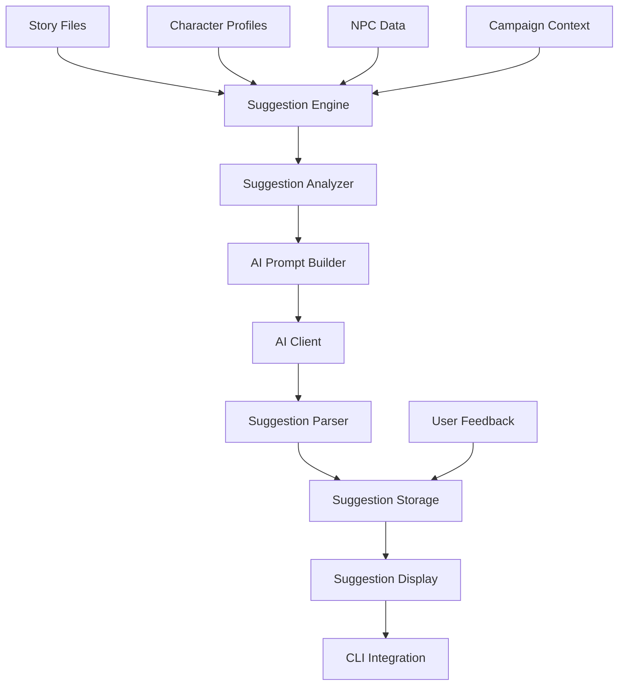

# AI-Powered Story Suggestions Plan

## Overview

This document describes the design for an AI-powered story suggestion system
that helps Dungeon Masters develop their narratives. The system analyzes
existing story content, character profiles, and campaign context to generate
contextual suggestions for plot hooks, character moments, plot twists, and
narrative improvements.

## Problem Statement

### Current Limitations

1. **Manual Story Development**: DMs must come up with all plot hooks,
   character moments, and narrative twists on their own without AI assistance.

2. **Underutilized AI Capabilities**: The existing AI integration focuses on
   generating full stories but does not provide incremental suggestions that
   could inspire DM creativity.

3. **No Proactive Suggestions**: The system only responds to explicit requests
   rather than proactively offering ideas based on story analysis.

4. **Disconnected Story Elements**: Character backstories, NPC relationships,
   and plot threads exist in isolation without AI-powered connections.

### User Stories

| As a | I want to | So that |
|------|-----------|---------|
| DM | Get plot hook suggestions based on my campaign | I can develop stories faster |
| DM | See character moment opportunities | My players get meaningful character development |
| DM | Receive twist suggestions | My stories have surprising turns |
| DM | Get narrative improvement tips | My storytelling quality improves |
| DM | Save and review suggestions later | I can consider ideas at my own pace |

---

## Proposed Solution

### High-Level Architecture



### Suggestion Types

| Type | Description | Trigger |
|------|-------------|---------|
| **Plot Hook** | New story directions or encounters | After story analysis |
| **Character Moment** | Opportunities for character development | When characters present |
| **Plot Twist** | Unexpected narrative turns | Mid-campaign analysis |
| **Narrative Improvement** | Writing quality suggestions | On demand |
| **NPC Interaction** | Dynamic NPC encounter ideas | When NPCs detected |
| **Foreshadowing** | Setup for future events | Based on story arc |

---

## Implementation Details

### 1. Suggestion Data Model

Create `src/stories/suggestion_types.py`:

```python
"""
Story Suggestion Types

Data models for AI-generated story suggestions.
"""

from dataclasses import dataclass, field
from typing import Optional, List
from enum import Enum
from datetime import datetime


class SuggestionType(Enum):
    """Types of story suggestions."""
    PLOT_HOOK = "plot_hook"
    CHARACTER_MOMENT = "character_moment"
    PLOT_TWIST = "plot_twist"
    NARRATIVE_IMPROVEMENT = "narrative_improvement"
    NPC_INTERACTION = "npc_interaction"
    FORESHADOWING = "foreshadowing"


class SuggestionPriority(Enum):
    """Priority levels for suggestions."""
    HIGH = "high"
    MEDIUM = "medium"
    LOW = "low"


@dataclass
class StorySuggestion:
    """A single story suggestion from AI analysis."""

    suggestion_type: SuggestionType
    title: str
    description: str
    rationale: str
    priority: SuggestionPriority = SuggestionPriority.MEDIUM

    # Context information
    source_story: Optional[str] = None
    relevant_characters: List[str] = field(default_factory=list)
    relevant_npcs: List[str] = field(default_factory=list)

    # Implementation guidance
    implementation_notes: Optional[str] = None
    suggested_timing: Optional[str] = None  # "next session", "mid-campaign", etc.

    # Metadata
    created_at: datetime = field(default_factory=datetime.now)
    accepted: Optional[bool] = None
    user_notes: Optional[str] = None

    def to_dict(self) -> dict:
        """Convert to dictionary for JSON serialization."""
        return {
            "suggestion_type": self.suggestion_type.value,
            "title": self.title,
            "description": self.description,
            "rationale": self.rationale,
            "priority": self.priority.value,
            "source_story": self.source_story,
            "relevant_characters": self.relevant_characters,
            "relevant_npcs": self.relevant_npcs,
            "implementation_notes": self.implementation_notes,
            "suggested_timing": self.suggested_timing,
            "created_at": self.created_at.isoformat(),
            "accepted": self.accepted,
            "user_notes": self.user_notes,
        }

    @classmethod
    def from_dict(cls, data: dict) -> "StorySuggestion":
        """Create from dictionary."""
        return cls(
            suggestion_type=SuggestionType(data["suggestion_type"]),
            title=data["title"],
            description=data["description"],
            rationale=data["rationale"],
            priority=SuggestionPriority(data.get("priority", "medium")),
            source_story=data.get("source_story"),
            relevant_characters=data.get("relevant_characters", []),
            relevant_npcs=data.get("relevant_npcs", []),
            implementation_notes=data.get("implementation_notes"),
            suggested_timing=data.get("suggested_timing"),
            created_at=datetime.fromisoformat(data["created_at"])
                       if "created_at" in data else datetime.now(),
            accepted=data.get("accepted"),
            user_notes=data.get("user_notes"),
        )


@dataclass
class SuggestionSet:
    """A collection of suggestions for a story or campaign."""

    campaign_name: str
    story_file: Optional[str]
    suggestions: List[StorySuggestion] = field(default_factory=list)
    generated_at: datetime = field(default_factory=datetime.now)

    def add_suggestion(self, suggestion: StorySuggestion) -> None:
        """Add a suggestion to the set."""
        self.suggestions.append(suggestion)

    def get_by_type(self, suggestion_type: SuggestionType) -> List[StorySuggestion]:
        """Filter suggestions by type."""
        return [s for s in self.suggestions if s.suggestion_type == suggestion_type]

    def get_accepted(self) -> List[StorySuggestion]:
        """Get all accepted suggestions."""
        return [s for s in self.suggestions if s.accepted is True]

    def get_pending(self) -> List[StorySuggestion]:
        """Get all unreviewed suggestions."""
        return [s for s in self.suggestions if s.accepted is None]

    def to_dict(self) -> dict:
        """Convert to dictionary for JSON serialization."""
        return {
            "campaign_name": self.campaign_name,
            "story_file": self.story_file,
            "suggestions": [s.to_dict() for s in self.suggestions],
            "generated_at": self.generated_at.isoformat(),
        }

    @classmethod
    def from_dict(cls, data: dict) -> "SuggestionSet":
        """Create from dictionary."""
        return cls(
            campaign_name=data["campaign_name"],
            story_file=data.get("story_file"),
            suggestions=[StorySuggestion.from_dict(s) for s in data.get("suggestions", [])],
            generated_at=datetime.fromisoformat(data["generated_at"])
                       if "generated_at" in data else datetime.now(),
        )
```

### 2. Suggestion Engine

Create `src/stories/suggestion_engine.py`:

```python
"""
Story Suggestion Engine

Generates AI-powered suggestions for story development.
"""

from typing import Optional, List, Dict, Any
from src.ai.availability import AI_AVAILABLE
from src.stories.suggestion_types import (
    SuggestionType,
    SuggestionPriority,
    StorySuggestion,
    SuggestionSet,
)


# AI Prompt Templates
SUGGESTION_PROMPTS = {
    SuggestionType.PLOT_HOOK: {
        "system": (
            "You are a creative D&D adventure designer. Generate compelling plot "
            "hooks that DMs can use to develop their campaigns. Each hook should "
            "be specific, actionable, and tied to the existing story context. "
            "Format your response as JSON with 'title', 'description', 'rationale', "
            "'implementation_notes', and 'suggested_timing' fields."
        ),
        "user_template": (
            "Based on the following story context, generate {count} plot hook "
            "suggestions for a D&D campaign.\n\n"
            "STORY CONTEXT:\n{story_context}\n\n"
            "PARTY MEMBERS:\n{party_context}\n\n"
            "KNOWN NPCs:\n{npc_context}\n\n"
            "Generate plot hooks that:\n"
            "1. Connect to existing story elements\n"
            "2. Provide clear adventure opportunities\n"
            "3. Create opportunities for character development\n"
            "4. Are specific enough to use immediately\n\n"
            "Respond with a JSON array of suggestions."
        ),
    },

    SuggestionType.CHARACTER_MOMENT: {
        "system": (
            "You are a D&D character development specialist. Suggest meaningful "
            "moments that highlight character personalities, backgrounds, and "
            "growth opportunities. Each suggestion should create roleplay "
            "opportunities and deepen character engagement. "
            "Format your response as JSON with 'title', 'description', 'rationale', "
            "'relevant_characters', and 'implementation_notes' fields."
        ),
        "user_template": (
            "Based on the following characters and story context, suggest {count} "
            "character moment opportunities.\n\n"
            "CHARACTERS:\n{party_context}\n\n"
            "STORY CONTEXT:\n{story_context}\n\n"
            "Suggest moments that:\n"
            "1. Highlight each character's unique traits\n"
            "2. Create roleplay opportunities\n"
            "3. Connect to character backstories\n"
            "4. Allow for meaningful player choices\n\n"
            "Respond with a JSON array of suggestions."
        ),
    },

    SuggestionType.PLOT_TWIST: {
        "system": (
            "You are a master of D&D plot twists and surprises. Generate "
            "unexpected narrative turns that recontextualize existing story "
            "elements. Twists should be surprising but fair, with proper "
            "foreshadowing opportunities. "
            "Format your response as JSON with 'title', 'description', 'rationale', "
            "'implementation_notes', and 'foreshadowing_hints' fields."
        ),
        "user_template": (
            "Based on the following story context, suggest {count} plot twist "
            "ideas.\n\n"
            "STORY CONTEXT:\n{story_context}\n\n"
            "PARTY MEMBERS:\n{party_context}\n\n"
            "Generate twists that:\n"
            "1. Recontextualize existing NPCs or events\n"
            "2. Create dramatic tension\n"
            "3. Have foreshadowing opportunities\n"
            "4. Maintain narrative coherence\n\n"
            "Respond with a JSON array of suggestions."
        ),
    },

    SuggestionType.NARRATIVE_IMPROVEMENT: {
        "system": (
            "You are a D&D narrative writing coach. Suggest improvements to "
            "story descriptions, pacing, and atmosphere. Focus on making "
            "narratives more engaging and immersive. "
            "Format your response as JSON with 'title', 'description', 'rationale', "
            "and 'implementation_notes' fields."
        ),
        "user_template": (
            "Review the following story content and suggest {count} narrative "
            "improvements.\n\n"
            "STORY CONTENT:\n{story_context}\n\n"
            "Suggest improvements for:\n"
            "1. Descriptive language and atmosphere\n"
            "2. Pacing and tension\n"
            "3. Character voice and dialogue\n"
            "4. Sensory details and immersion\n\n"
            "Respond with a JSON array of suggestions."
        ),
    },

    SuggestionType.NPC_INTERACTION: {
        "system": (
            "You are a D&D NPC specialist. Generate dynamic NPC interaction "
            "ideas that create memorable encounters. Focus on NPC personality, "
            "motivations, and relationship dynamics. "
            "Format your response as JSON with 'title', 'description', 'rationale', "
            "'relevant_npcs', and 'implementation_notes' fields."
        ),
        "user_template": (
            "Based on the following NPCs and story context, suggest {count} "
            "NPC interaction opportunities.\n\n"
            "NPCs:\n{npc_context}\n\n"
            "STORY CONTEXT:\n{story_context}\n\n"
            "Suggest interactions that:\n"
            "1. Showcase NPC personalities\n"
            "2. Create roleplay opportunities\n"
            "3. Advance plot threads\n"
            "4. Build relationships with party members\n\n"
            "Respond with a JSON array of suggestions."
        ),
    },

    SuggestionType.FORESHADOWING: {
        "system": (
            "You are a D&D foreshadowing expert. Suggest subtle hints and "
            "setup for future story developments. Focus on creating mystery "
            "and anticipation without revealing too much. "
            "Format your response as JSON with 'title', 'description', 'rationale', "
            "'implementation_notes', and 'payoff_timing' fields."
        ),
        "user_template": (
            "Based on the following story context, suggest {count} foreshadowing "
            "opportunities.\n\n"
            "STORY CONTEXT:\n{story_context}\n\n"
            "CAMPAIGN DIRECTION:\n{campaign_direction}\n\n"
            "Suggest foreshadowing that:\n"
            "1. Hints at future events subtly\n"
            "2. Creates mystery and anticipation\n"
            "3. Can be paid off in future sessions\n"
            "4. Rewards attentive players\n\n"
            "Respond with a JSON array of suggestions."
        ),
    },
}


class SuggestionEngine:
    """Generates AI-powered story suggestions."""

    def __init__(self, ai_client):
        """Initialize the suggestion engine.

        Args:
            ai_client: Initialized AIClient instance
        """
        self.ai_client = ai_client

    def generate_suggestions(
        self,
        suggestion_type: SuggestionType,
        story_context: str,
        party_context: Optional[str] = None,
        npc_context: Optional[str] = None,
        campaign_direction: Optional[str] = None,
        count: int = 3,
    ) -> List[StorySuggestion]:
        """Generate suggestions of a specific type.

        Args:
            suggestion_type: Type of suggestions to generate
            story_context: Current story content or summary
            party_context: Information about party members
            npc_context: Information about relevant NPCs
            campaign_direction: Where the campaign is heading
            count: Number of suggestions to generate

        Returns:
            List of StorySuggestion objects
        """
        if not AI_AVAILABLE or not self.ai_client:
            return []

        prompts = SUGGESTION_PROMPTS.get(suggestion_type)
        if not prompts:
            return []

        user_prompt = prompts["user_template"].format(
            count=count,
            story_context=story_context or "No story context available.",
            party_context=party_context or "No party information available.",
            npc_context=npc_context or "No NPC information available.",
            campaign_direction=campaign_direction or "No campaign direction specified.",
        )

        try:
            response = self.ai_client.chat_completion(
                messages=[
                    {"role": "system", "content": prompts["system"]},
                    {"role": "user", "content": user_prompt},
                ],
                temperature=0.9,  # Higher temperature for creativity
                max_tokens=2000,
            )

            return self._parse_suggestions(response, suggestion_type)

        except (AttributeError, TypeError, KeyError, ValueError) as e:
            print(f"[WARNING] Failed to generate suggestions: {e}")
            return []

    def generate_comprehensive_suggestions(
        self,
        campaign_name: str,
        story_file: Optional[str],
        story_content: str,
        party_profiles: Dict[str, Any],
        npc_data: List[Dict[str, Any]],
        suggestion_types: Optional[List[SuggestionType]] = None,
        count_per_type: int = 2,
    ) -> SuggestionSet:
        """Generate a comprehensive set of suggestions.

        Args:
            campaign_name: Name of the campaign
            story_file: Path to the story file being analyzed
            story_content: Full story content
            party_profiles: Dictionary of character profiles
            npc_data: List of NPC data dictionaries
            suggestion_types: Types to generate, or all if None
            count_per_type: Suggestions per type

        Returns:
            SuggestionSet with all generated suggestions
        """
        suggestion_set = SuggestionSet(
            campaign_name=campaign_name,
            story_file=story_file,
        )

        if suggestion_types is None:
            suggestion_types = list(SuggestionType)

        # Build context strings
        party_context = self._build_party_context(party_profiles)
        npc_context = self._build_npc_context(npc_data)

        for suggestion_type in suggestion_types:
            suggestions = self.generate_suggestions(
                suggestion_type=suggestion_type,
                story_context=story_content[:2000],  # Limit context size
                party_context=party_context,
                npc_context=npc_context,
                count=count_per_type,
            )

            for suggestion in suggestions:
                suggestion.source_story = story_file
                suggestion_set.add_suggestion(suggestion)

        return suggestion_set

    def _parse_suggestions(
        self,
        response: str,
        suggestion_type: SuggestionType,
    ) -> List[StorySuggestion]:
        """Parse AI response into StorySuggestion objects."""
        import json

        suggestions = []

        try:
            # Try to parse as JSON
            data = json.loads(response)
            if not isinstance(data, list):
                data = [data]

            for item in data:
                suggestion = StorySuggestion(
                    suggestion_type=suggestion_type,
                    title=item.get("title", "Untitled Suggestion"),
                    description=item.get("description", ""),
                    rationale=item.get("rationale", ""),
                    priority=SuggestionPriority.MEDIUM,
                    implementation_notes=item.get("implementation_notes"),
                    suggested_timing=item.get("suggested_timing")
                                      or item.get("payoff_timing"),
                    relevant_characters=item.get("relevant_characters", []),
                    relevant_npcs=item.get("relevant_npcs", []),
                )
                suggestions.append(suggestion)

        except json.JSONDecodeError:
            # Fallback: create single suggestion from raw text
            suggestions.append(StorySuggestion(
                suggestion_type=suggestion_type,
                title="AI Suggestion",
                description=response,
                rationale="Generated from AI analysis",
            ))

        return suggestions

    def _build_party_context(self, party_profiles: Dict[str, Any]) -> str:
        """Build context string from party profiles."""
        if not party_profiles:
            return "No party members available."

        lines = []
        for name, profile in party_profiles.items():
            if isinstance(profile, dict):
                char_class = profile.get("dnd_class", "Unknown")
                level = profile.get("level", "?")
                personality = profile.get("personality_summary", "")
                background = profile.get("background_story", "")[:100]

                lines.append(
                    f"- {name}: Level {level} {char_class}. "
                    f"{personality} {background}"
                )

        return "\n".join(lines)

    def _build_npc_context(self, npc_data: List[Dict[str, Any]]) -> str:
        """Build context string from NPC data."""
        if not npc_data:
            return "No NPCs available."

        lines = []
        for npc in npc_data:
            name = npc.get("name", "Unknown")
            role = npc.get("role", "NPC")
            location = npc.get("location", "Unknown location")
            personality = npc.get("personality", "")

            lines.append(f"- {name} ({role} at {location}): {personality}")

        return "\n".join(lines)
```

### 3. Suggestion Storage

Create `src/stories/suggestion_storage.py`:

```python
"""
Suggestion Storage System

Persists and retrieves story suggestions.
"""

import json
from pathlib import Path
from typing import Optional, List
from datetime import datetime

from src.utils.file_io import ensure_directory
from src.utils.path_utils import get_campaign_path
from src.stories.suggestion_types import SuggestionSet, StorySuggestion, SuggestionType


def get_suggestions_path(campaign_name: str) -> Path:
    """Get the path to a campaign's suggestions file."""
    campaign_path = get_campaign_path(campaign_name)
    return campaign_path / "suggestions.json"


def save_suggestions(suggestion_set: SuggestionSet) -> bool:
    """Save suggestions to a campaign's suggestions file.

    Args:
        suggestion_set: SuggestionSet to save

    Returns:
        True if save was successful
    """
    try:
        suggestions_path = get_suggestions_path(suggestion_set.campaign_name)
        ensure_directory(suggestions_path.parent)

        # Load existing suggestions
        existing = load_suggestions(suggestion_set.campaign_name)

        # Merge new suggestions
        for new_suggestion in suggestion_set.suggestions:
            existing.suggestions.append(new_suggestion)

        # Save merged set
        with open(suggestions_path, "w", encoding="utf-8") as f:
            json.dump(existing.to_dict(), f, indent=2)

        return True

    except (OSError, ValueError) as e:
        print(f"[ERROR] Failed to save suggestions: {e}")
        return False


def load_suggestions(campaign_name: str) -> SuggestionSet:
    """Load suggestions from a campaign's suggestions file.

    Args:
        campaign_name: Name of the campaign

    Returns:
        SuggestionSet with all stored suggestions
    """
    suggestions_path = get_suggestions_path(campaign_name)

    if not suggestions_path.exists():
        return SuggestionSet(campaign_name=campaign_name, story_file=None)

    try:
        with open(suggestions_path, "r", encoding="utf-8") as f:
            data = json.load(f)
        return SuggestionSet.from_dict(data)

    except (OSError, json.JSONDecodeError, ValueError) as e:
        print(f"[WARNING] Could not load suggestions: {e}")
        return SuggestionSet(campaign_name=campaign_name, story_file=None)


def update_suggestion_status(
    campaign_name: str,
    suggestion_index: int,
    accepted: bool,
    user_notes: Optional[str] = None,
) -> bool:
    """Update the status of a suggestion.

    Args:
        campaign_name: Name of the campaign
        suggestion_index: Index of the suggestion to update
        accepted: Whether the suggestion was accepted
        user_notes: Optional notes from the user

    Returns:
        True if update was successful
    """
    suggestion_set = load_suggestions(campaign_name)

    if 0 <= suggestion_index < len(suggestion_set.suggestions):
        suggestion = suggestion_set.suggestions[suggestion_index]
        suggestion.accepted = accepted
        suggestion.user_notes = user_notes

        try:
            suggestions_path = get_suggestions_path(campaign_name)
            with open(suggestions_path, "w", encoding="utf-8") as f:
                json.dump(suggestion_set.to_dict(), f, indent=2)
            return True
        except OSError as e:
            print(f"[ERROR] Failed to update suggestion: {e}")

    return False


def get_pending_suggestions(campaign_name: str) -> List[StorySuggestion]:
    """Get all pending suggestions for a campaign."""
    suggestion_set = load_suggestions(campaign_name)
    return suggestion_set.get_pending()


def get_suggestions_by_type(
    campaign_name: str,
    suggestion_type: SuggestionType,
) -> List[StorySuggestion]:
    """Get suggestions of a specific type."""
    suggestion_set = load_suggestions(campaign_name)
    return suggestion_set.get_by_type(suggestion_type)


def clear_old_suggestions(campaign_name: str, days_old: int = 30) -> int:
    """Remove suggestions older than specified days.

    Args:
        campaign_name: Name of the campaign
        days_old: Age threshold in days

    Returns:
        Number of suggestions removed
    """
    suggestion_set = load_suggestions(campaign_name)
    cutoff = datetime.now().timestamp() - (days_old * 24 * 60 * 60)

    original_count = len(suggestion_set.suggestions)
    suggestion_set.suggestions = [
        s for s in suggestion_set.suggestions
        if s.created_at.timestamp() > cutoff or s.accepted is not None
    ]

    removed = original_count - len(suggestion_set.suggestions)

    if removed > 0:
        save_suggestions(suggestion_set)

    return removed
```

### 4. CLI Integration

Add to `src/cli/cli_suggestions.py`:

```python
"""
CLI Interface for Story Suggestions

Provides menu-driven access to AI-powered story suggestions.
"""

from typing import Optional, List

from src.ai.availability import AI_AVAILABLE
from src.stories.suggestion_types import SuggestionType, StorySuggestion, SuggestionSet
from src.stories.suggestion_engine import SuggestionEngine
from src.stories.suggestion_storage import (
    save_suggestions,
    load_suggestions,
    update_suggestion_status,
    get_pending_suggestions,
)
from src.utils.terminal_display import print_info, print_success, print_warning
from src.utils.cli_utils import display_selection_menu, confirm_action


SUGGESTION_TYPE_LABELS = {
    SuggestionType.PLOT_HOOK: "Plot Hooks",
    SuggestionType.CHARACTER_MOMENT: "Character Moments",
    SuggestionType.PLOT_TWIST: "Plot Twists",
    SuggestionType.NARRATIVE_IMPROVEMENT: "Narrative Improvements",
    SuggestionType.NPC_INTERACTION: "NPC Interactions",
    SuggestionType.FORESHADOWING: "Foreshadowing",
}


class SuggestionManager:
    """CLI manager for story suggestions."""

    def __init__(self, ai_client=None):
        """Initialize the suggestion manager.

        Args:
            ai_client: Optional AIClient instance
        """
        self.ai_client = ai_client
        self.engine = SuggestionEngine(ai_client) if ai_client else None

    def show_suggestions_menu(self, campaign_name: str) -> None:
        """Display the main suggestions menu for a campaign."""
        while True:
            print(f"\n=== Story Suggestions: {campaign_name} ===")
            print("1. Generate New Suggestions")
            print("2. View Pending Suggestions")
            print("3. View All Suggestions")
            print("4. View by Type")
            print("5. Clear Old Suggestions")
            print("0. Back")

            choice = input("\nSelect: ").strip()

            if choice == "1":
                self._generate_suggestions_flow(campaign_name)
            elif choice == "2":
                self._display_pending_suggestions(campaign_name)
            elif choice == "3":
                self._display_all_suggestions(campaign_name)
            elif choice == "4":
                self._display_by_type_flow(campaign_name)
            elif choice == "5":
                self._clear_old_suggestions_flow(campaign_name)
            elif choice == "0":
                break
            else:
                print_warning("Invalid selection.")

    def _generate_suggestions_flow(self, campaign_name: str) -> None:
        """Guide user through generating new suggestions."""
        if not AI_AVAILABLE or not self.engine:
            print_warning("AI is not available. Configure AI first.")
            return

        # Select suggestion types
        print("\nSelect suggestion types to generate:")
        type_options = list(SUGGESTION_TYPE_LABELS.values())
        type_options.append("All Types")

        for i, option in enumerate(type_options, 1):
            print(f"{i}. {option}")

        selection = input("\nSelect type (number): ").strip()

        try:
            idx = int(selection) - 1
            if idx == len(type_options) - 1:
                # All types selected
                selected_types = None
            elif 0 <= idx < len(SuggestionType):
                selected_types = [list(SuggestionType)[idx]]
            else:
                print_warning("Invalid selection.")
                return
        except ValueError:
            print_warning("Invalid input.")
            return

        # Get story context
        print_info("Analyzing campaign for suggestions...")

        # This would integrate with existing story loading
        # For now, placeholder
        story_content = self._get_latest_story_content(campaign_name)
        party_profiles = self._get_party_profiles(campaign_name)
        npc_data = self._get_npc_data(campaign_name)

        # Generate suggestions
        suggestion_set = self.engine.generate_comprehensive_suggestions(
            campaign_name=campaign_name,
            story_file=None,
            story_content=story_content,
            party_profiles=party_profiles,
            npc_data=npc_data,
            suggestion_types=selected_types,
            count_per_type=2,
        )

        if suggestion_set.suggestions:
            save_suggestions(suggestion_set)
            print_success(f"Generated {len(suggestion_set.suggestions)} suggestions.")
            self._display_suggestion_list(suggestion_set.suggestions)
        else:
            print_warning("No suggestions generated. Check AI configuration.")

    def _display_pending_suggestions(self, campaign_name: str) -> None:
        """Display all pending suggestions."""
        pending = get_pending_suggestions(campaign_name)

        if not pending:
            print_info("No pending suggestions.")
            return

        print(f"\n=== Pending Suggestions ({len(pending)}) ===")
        self._display_suggestion_list(pending)
        self._suggestion_action_menu(campaign_name, pending)

    def _display_all_suggestions(self, campaign_name: str) -> None:
        """Display all suggestions for a campaign."""
        suggestion_set = load_suggestions(campaign_name)

        if not suggestion_set.suggestions:
            print_info("No suggestions found.")
            return

        print(f"\n=== All Suggestions ({len(suggestion_set.suggestions)}) ===")
        self._display_suggestion_list(suggestion_set.suggestions)

    def _display_by_type_flow(self, campaign_name: str) -> None:
        """Display suggestions filtered by type."""
        print("\nSelect suggestion type:")
        for i, (stype, label) in enumerate(SUGGESTION_TYPE_LABELS.items(), 1):
            print(f"{i}. {label}")

        selection = input("\nSelect: ").strip()

        try:
            idx = int(selection) - 1
            selected_type = list(SuggestionType)[idx]
            suggestions = [
                s for s in load_suggestions(campaign_name).suggestions
                if s.suggestion_type == selected_type
            ]

            if suggestions:
                self._display_suggestion_list(suggestions)
            else:
                print_info(f"No {SUGGESTION_TYPE_LABELS[selected_type]} found.")

        except (ValueError, IndexError):
            print_warning("Invalid selection.")

    def _display_suggestion_list(self, suggestions: List[StorySuggestion]) -> None:
        """Display a list of suggestions."""
        for i, suggestion in enumerate(suggestions):
            status = ""
            if suggestion.accepted is True:
                status = " [ACCEPTED]"
            elif suggestion.accepted is False:
                status = " [REJECTED]"

            type_label = SUGGESTION_TYPE_LABELS.get(
                suggestion.suggestion_type, "Unknown"
            )

            print(f"\n{i}. [{type_label}]{status} {suggestion.title}")
            print(f"   {suggestion.description[:100]}...")
            if suggestion.rationale:
                print(f"   Rationale: {suggestion.rationale[:80]}...")

    def _suggestion_action_menu(
        self,
        campaign_name: str,
        suggestions: List[StorySuggestion],
    ) -> None:
        """Allow user to act on suggestions."""
        while True:
            print("\n--- Actions ---")
            print("1. Accept a suggestion")
            print("2. Reject a suggestion")
            print("3. Add notes to a suggestion")
            print("0. Back")

            choice = input("\nSelect: ").strip()

            if choice == "1":
                self._accept_suggestion_flow(campaign_name, suggestions)
            elif choice == "2":
                self._reject_suggestion_flow(campaign_name, suggestions)
            elif choice == "3":
                self._add_notes_flow(campaign_name, suggestions)
            elif choice == "0":
                break
            else:
                print_warning("Invalid selection.")

    def _accept_suggestion_flow(
        self,
        campaign_name: str,
        suggestions: List[StorySuggestion],
    ) -> None:
        """Accept a suggestion."""
        selection = input("Enter suggestion number: ").strip()

        try:
            idx = int(selection)
            if 0 <= idx < len(suggestions):
                update_suggestion_status(campaign_name, idx, accepted=True)
                print_success(f"Suggestion {idx} accepted.")
            else:
                print_warning("Invalid number.")
        except ValueError:
            print_warning("Invalid input.")

    def _reject_suggestion_flow(
        self,
        campaign_name: str,
        suggestions: List[StorySuggestion],
    ) -> None:
        """Reject a suggestion."""
        selection = input("Enter suggestion number: ").strip()

        try:
            idx = int(selection)
            if 0 <= idx < len(suggestions):
                update_suggestion_status(campaign_name, idx, accepted=False)
                print_info(f"Suggestion {idx} rejected.")
            else:
                print_warning("Invalid number.")
        except ValueError:
            print_warning("Invalid input.")

    def _add_notes_flow(
        self,
        campaign_name: str,
        suggestions: List[StorySuggestion],
    ) -> None:
        """Add notes to a suggestion."""
        selection = input("Enter suggestion number: ").strip()

        try:
            idx = int(selection)
            if 0 <= idx < len(suggestions):
                notes = input("Enter notes: ").strip()
                suggestion = suggestions[idx]
                update_suggestion_status(
                    campaign_name, idx,
                    accepted=suggestion.accepted,
                    user_notes=notes,
                )
                print_success("Notes saved.")
            else:
                print_warning("Invalid number.")
        except ValueError:
            print_warning("Invalid input.")

    def _clear_old_suggestions_flow(self, campaign_name: str) -> None:
        """Clear old suggestions with confirmation."""
        from src.stories.suggestion_storage import clear_old_suggestions

        if confirm_action("Remove suggestions older than 30 days?"):
            removed = clear_old_suggestions(campaign_name, days_old=30)
            print_info(f"Removed {removed} old suggestions.")

    # Placeholder methods - would integrate with existing systems
    def _get_latest_story_content(self, campaign_name: str) -> str:
        """Get the latest story content for a campaign."""
        # Would integrate with story_manager
        return "Story content placeholder"

    def _get_party_profiles(self, campaign_name: str) -> dict:
        """Get party member profiles for a campaign."""
        # Would integrate with party_manager
        return {}

    def _get_npc_data(self, campaign_name: str) -> list:
        """Get NPC data for a campaign."""
        # Would integrate with npc system
        return []
```

### 5. Integration with Story Workflow

Add suggestion generation to story workflow in `src/stories/story_workflow_orchestrator.py`:

```python
# Add to imports
from src.stories.suggestion_engine import SuggestionEngine
from src.stories.suggestion_storage import save_suggestions

# Add to workflow context
@dataclass
class StoryWorkflowContext:
    # ... existing fields ...
    generate_suggestions: bool = True
    suggestion_types: Optional[List[SuggestionType]] = None

# Add to workflow
def _post_story_suggestions(self, ctx: StoryWorkflowContext) -> None:
    """Generate suggestions after story creation."""
    if not ctx.generate_suggestions or not ctx.ai_client:
        return

    engine = SuggestionEngine(ctx.ai_client)

    suggestion_set = engine.generate_comprehensive_suggestions(
        campaign_name=ctx.campaign_name,
        story_file=ctx.story_file,
        story_content=ctx.story_content,
        party_profiles=ctx.party_profiles,
        npc_data=ctx.known_npcs,
        suggestion_types=ctx.suggestion_types,
        count_per_type=2,
    )

    if suggestion_set.suggestions:
        save_suggestions(suggestion_set)
        ctx.results["suggestions_generated"] = len(suggestion_set.suggestions)
```

---

## Affected Files

### New Files to Create

| File | Purpose |
|------|---------|
| `src/stories/suggestion_types.py` | Data models for suggestions |
| `src/stories/suggestion_engine.py` | AI-powered suggestion generation |
| `src/stories/suggestion_storage.py` | Persistence layer |
| `src/cli/cli_suggestions.py` | CLI interface |
| `tests/stories/test_suggestions.py` | Unit tests |

### Files to Modify

| File | Changes |
|------|---------|
| `src/stories/story_workflow_orchestrator.py` | Add suggestion generation |
| `src/cli/cli_story_manager.py` | Add suggestions menu option |
| `src/cli/dnd_consultant.py` | Add suggestions to main menu |

---

## Testing Strategy

### Unit Tests

Create `tests/stories/test_suggestions.py`:

```python
"""Tests for story suggestion system."""

import pytest
from datetime import datetime

from src.stories.suggestion_types import (
    SuggestionType,
    SuggestionPriority,
    StorySuggestion,
    SuggestionSet,
)


class TestStorySuggestion:
    """Tests for StorySuggestion dataclass."""

    def test_create_suggestion(self):
        """Create a basic suggestion."""
        suggestion = StorySuggestion(
            suggestion_type=SuggestionType.PLOT_HOOK,
            title="Test Hook",
            description="A test plot hook",
            rationale="Testing",
        )

        assert suggestion.suggestion_type == SuggestionType.PLOT_HOOK
        assert suggestion.title == "Test Hook"
        assert suggestion.accepted is None

    def test_suggestion_to_dict(self):
        """Suggestion serializes to dict."""
        suggestion = StorySuggestion(
            suggestion_type=SuggestionType.CHARACTER_MOMENT,
            title="Test",
            description="Test description",
            rationale="Test rationale",
            relevant_characters=["Aragorn"],
        )

        data = suggestion.to_dict()

        assert data["suggestion_type"] == "character_moment"
        assert data["title"] == "Test"
        assert "Aragorn" in data["relevant_characters"]

    def test_suggestion_from_dict(self):
        """Suggestion deserializes from dict."""
        data = {
            "suggestion_type": "plot_twist",
            "title": "The Betrayal",
            "description": "An ally becomes an enemy",
            "rationale": "Creates dramatic tension",
            "priority": "high",
            "created_at": "2025-01-01T12:00:00",
        }

        suggestion = StorySuggestion.from_dict(data)

        assert suggestion.suggestion_type == SuggestionType.PLOT_TWIST
        assert suggestion.priority == SuggestionPriority.HIGH


class TestSuggestionSet:
    """Tests for SuggestionSet."""

    def test_empty_suggestion_set(self):
        """Create empty suggestion set."""
        suggestion_set = SuggestionSet(
            campaign_name="Test Campaign",
            story_file=None,
        )

        assert len(suggestion_set.suggestions) == 0

    def test_add_suggestions(self):
        """Add suggestions to set."""
        suggestion_set = SuggestionSet(
            campaign_name="Test",
            story_file=None,
        )

        suggestion = StorySuggestion(
            suggestion_type=SuggestionType.PLOT_HOOK,
            title="Test",
            description="Test",
            rationale="Test",
        )

        suggestion_set.add_suggestion(suggestion)

        assert len(suggestion_set.suggestions) == 1

    def test_filter_by_type(self):
        """Filter suggestions by type."""
        suggestion_set = SuggestionSet(
            campaign_name="Test",
            story_file=None,
        )

        for stype in [SuggestionType.PLOT_HOOK, SuggestionType.CHARACTER_MOMENT]:
            suggestion_set.add_suggestion(StorySuggestion(
                suggestion_type=stype,
                title="Test",
                description="Test",
                rationale="Test",
            ))

        hooks = suggestion_set.get_by_type(SuggestionType.PLOT_HOOK)

        assert len(hooks) == 1
        assert hooks[0].suggestion_type == SuggestionType.PLOT_HOOK

    def test_get_accepted(self):
        """Get accepted suggestions."""
        suggestion_set = SuggestionSet(
            campaign_name="Test",
            story_file=None,
        )

        accepted = StorySuggestion(
            suggestion_type=SuggestionType.PLOT_HOOK,
            title="Accepted",
            description="Test",
            rationale="Test",
        )
        accepted.accepted = True

        pending = StorySuggestion(
            suggestion_type=SuggestionType.PLOT_HOOK,
            title="Pending",
            description="Test",
            rationale="Test",
        )

        suggestion_set.suggestions = [accepted, pending]

        accepted_list = suggestion_set.get_accepted()

        assert len(accepted_list) == 1
        assert accepted_list[0].title == "Accepted"


class TestSuggestionEngine:
    """Tests for SuggestionEngine."""

    def test_parse_json_suggestions(self):
        """Parse JSON response into suggestions."""
        from src.stories.suggestion_engine import SuggestionEngine

        engine = SuggestionEngine(ai_client=None)

        json_response = '''[
            {
                "title": "The Hidden Passage",
                "description": "A secret door leads to ancient ruins",
                "rationale": "Provides exploration opportunity"
            }
        ]'''

        suggestions = engine._parse_suggestions(
            json_response,
            SuggestionType.PLOT_HOOK,
        )

        assert len(suggestions) == 1
        assert suggestions[0].title == "The Hidden Passage"

    def test_fallback_on_invalid_json(self):
        """Fallback to raw text on invalid JSON."""
        from src.stories.suggestion_engine import SuggestionEngine

        engine = SuggestionEngine(ai_client=None)

        suggestions = engine._parse_suggestions(
            "This is not JSON",
            SuggestionType.PLOT_HOOK,
        )

        assert len(suggestions) == 1
        assert "not JSON" in suggestions[0].description
```

---

## Migration Path

### Phase 1: Core Implementation

1. Create `suggestion_types.py` with data models
2. Create `suggestion_engine.py` with AI integration
3. Create `suggestion_storage.py` for persistence
4. Add unit tests for core functionality

### Phase 2: CLI Integration

1. Create `cli_suggestions.py` with menu interface
2. Add suggestions option to story manager
3. Add suggestions to main menu
4. Test CLI workflows

### Phase 3: Workflow Integration

1. Add suggestion generation to story workflow
2. Add automatic suggestion generation after story creation
3. Add suggestion display to story reader
4. Test end-to-end workflows

### Phase 4: Polish

1. Add suggestion export functionality
2. Add suggestion templates for common scenarios
3. Add suggestion quality scoring
4. Update documentation

---

## Dependencies

### Required

- **AI Client**: Must have AI configured for suggestion generation
- **Error Handling Plan**: Should use centralized error handling once implemented

### Optional Enhancements

- **Configuration System**: Could use centralized config for suggestion settings
- **RAG System**: Could enhance suggestions with wiki context

---

## Success Criteria

1. **Functionality**: Users can generate and view suggestions
2. **Integration**: Suggestions appear in story workflow
3. **Persistence**: Suggestions are saved and can be reviewed later
4. **Usability**: CLI interface is intuitive and helpful
5. **Quality**: Generated suggestions are relevant and actionable

---

## Future Enhancements

1. **Suggestion Quality Scoring**: Rate suggestions based on relevance
2. **Suggestion Templates**: Pre-built suggestions for common scenarios
3. **Collaborative Filtering**: Learn from accepted/rejected suggestions
4. **Export Options**: Export suggestions to markdown or PDF
5. **Suggestion Chains**: Connected suggestions forming story arcs
6. **Player-Specific Suggestions**: Tailored to specific player preferences
