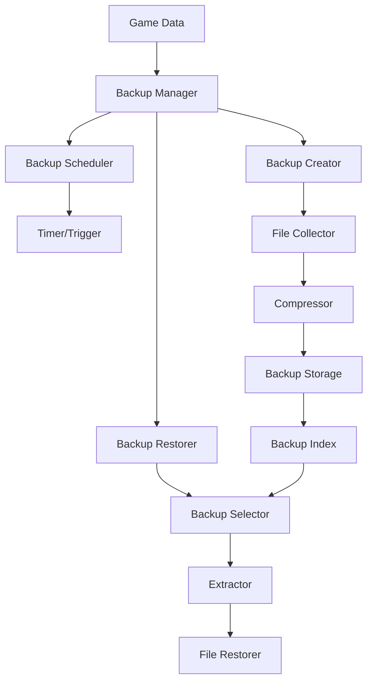

# Backup System Plan

## Overview

This document describes the design for a backup system for the D&D Character
Consultant System. The goal is to provide automated backup of character profiles,
party configurations, and campaign data with easy restore functionality.

## Problem Statement

### Current Issues

1. **No Automated Backups**: Users must manually copy files to create backups,
   leading to data loss risk.

2. **No Version History**: When files are corrupted or accidentally modified,
   there is no way to recover previous versions.

3. **No Scheduled Backups**: No automatic backup scheduling means users must
   remember to backup manually.

4. **No Restore Functionality**: Even if backups exist, there is no easy way
   to restore specific files or versions.

### Evidence from Codebase

| Current State | Limitation |
|---------------|------------|
| No backup module | No backup functionality |
| No versioning | Cannot recover previous versions |
| No scheduling | Must backup manually |
| No restore tools | Cannot easily restore |

---

## Proposed Solution

### High-Level Approach

1. **Backup Strategy**: Define what to backup, when, and how long to keep
2. **Backup Scheduler**: Automatic scheduled backups at configurable intervals
3. **Backup Storage**: Organized storage with versioning and compression
4. **Restore Functionality**: Easy restoration of specific files or entire backups
5. **CLI Integration**: Commands for backup management

### Backup Architecture



---

## Implementation Details

### 1. Backup Configuration

Create `src/backup/backup_config.py`:

```python
"""Backup configuration and settings."""

from dataclasses import dataclass, field
from typing import List, Optional
from enum import Enum
from datetime import datetime


class BackupType(Enum):
    """Types of backups."""
    FULL = "full"           # All data
    INCREMENTAL = "incremental"  # Only changed files
    CHARACTER = "character"  # Only character data
    CAMPAIGN = "campaign"   # Only campaign data
    CONFIG = "config"       # Only configuration


class BackupSchedule(Enum):
    """Backup schedule options."""
    MANUAL = "manual"
    HOURLY = "hourly"
    DAILY = "daily"
    WEEKLY = "weekly"
    BEFORE_SESSION = "before_session"


@dataclass
class RetentionPolicy:
    """Policy for how long to keep backups."""
    keep_hourly: int = 24      # Keep last 24 hourly backups
    keep_daily: int = 7        # Keep last 7 daily backups
    keep_weekly: int = 4       # Keep last 4 weekly backups
    keep_monthly: int = 12     # Keep last 12 monthly backups
    min_backups: int = 3       # Always keep at least 3 backups
    max_backups: int = 100     # Maximum total backups


@dataclass
class BackupConfig:
    """Configuration for backup system."""
    enabled: bool = True
    backup_dir: str = "backups"
    schedule: BackupSchedule = BackupSchedule.DAILY
    retention: RetentionPolicy = field(default_factory=RetentionPolicy)

    # What to include
    include_characters: bool = True
    include_npcs: bool = True
    include_campaigns: bool = True
    include_items: bool = True
    include_config: bool = True

    # Compression
    compress: bool = True
    compression_level: int = 6  # 1-9

    # Exclude patterns
    exclude_patterns: List[str] = field(default_factory=lambda: [
        "*.tmp",
        "*.bak",
        ".git/*",
        "__pycache__/*",
        "*.pyc"
    ])

    def to_dict(self) -> dict:
        """Convert to dictionary."""
        return {
            "enabled": self.enabled,
            "backup_dir": self.backup_dir,
            "schedule": self.schedule.value,
            "retention": {
                "keep_hourly": self.retention.keep_hourly,
                "keep_daily": self.retention.keep_daily,
                "keep_weekly": self.retention.keep_weekly,
                "keep_monthly": self.retention.keep_monthly,
                "min_backups": self.retention.min_backups,
                "max_backups": self.retention.max_backups
            },
            "include_characters": self.include_characters,
            "include_npcs": self.include_npcs,
            "include_campaigns": self.include_campaigns,
            "include_items": self.include_items,
            "include_config": self.include_config,
            "compress": self.compress,
            "compression_level": self.compression_level,
            "exclude_patterns": self.exclude_patterns
        }

    @classmethod
    def from_dict(cls, data: dict) -> "BackupConfig":
        """Create from dictionary."""
        retention_data = data.get("retention", {})
        retention = RetentionPolicy(
            keep_hourly=retention_data.get("keep_hourly", 24),
            keep_daily=retention_data.get("keep_daily", 7),
            keep_weekly=retention_data.get("keep_weekly", 4),
            keep_monthly=retention_data.get("keep_monthly", 12),
            min_backups=retention_data.get("min_backups", 3),
            max_backups=retention_data.get("max_backups", 100)
        )

        return cls(
            enabled=data.get("enabled", True),
            backup_dir=data.get("backup_dir", "backups"),
            schedule=BackupSchedule(data.get("schedule", "daily")),
            retention=retention,
            include_characters=data.get("include_characters", True),
            include_npcs=data.get("include_npcs", True),
            include_campaigns=data.get("include_campaigns", True),
            include_items=data.get("include_items", True),
            include_config=data.get("include_config", True),
            compress=data.get("compress", True),
            compression_level=data.get("compression_level", 6),
            exclude_patterns=data.get("exclude_patterns", [])
        )
```

### 2. Backup Manager

Create `src/backup/backup_manager.py`:

```python
"""Core backup management functionality."""

import os
import shutil
import zipfile
import json
from pathlib import Path
from datetime import datetime
from typing import List, Optional, Dict, Any
from dataclasses import dataclass, field

from src.backup.backup_config import BackupConfig, BackupType, BackupSchedule
from src.utils.path_utils import get_game_data_path
from src.utils.file_io import load_json_file, save_json_file


@dataclass
class BackupInfo:
    """Information about a backup."""
    backup_id: str
    timestamp: str
    backup_type: BackupType
    file_path: str
    size_bytes: int = 0
    file_count: int = 0
    description: str = ""
    includes: List[str] = field(default_factory=list)

    def to_dict(self) -> dict:
        """Convert to dictionary."""
        return {
            "backup_id": self.backup_id,
            "timestamp": self.timestamp,
            "backup_type": self.backup_type.value,
            "file_path": self.file_path,
            "size_bytes": self.size_bytes,
            "file_count": self.file_count,
            "description": self.description,
            "includes": self.includes
        }

    @classmethod
    def from_dict(cls, data: dict) -> "BackupInfo":
        """Create from dictionary."""
        return cls(
            backup_id=data["backup_id"],
            timestamp=data["timestamp"],
            backup_type=BackupType(data["backup_type"]),
            file_path=data["file_path"],
            size_bytes=data.get("size_bytes", 0),
            file_count=data.get("file_count", 0),
            description=data.get("description", ""),
            includes=data.get("includes", [])
        )


class BackupManager:
    """Manages backup creation, storage, and restoration."""

    BACKUP_INDEX_FILE = "backup_index.json"

    def __init__(self, config: Optional[BackupConfig] = None):
        """Initialize the backup manager.

        Args:
            config: Backup configuration, uses defaults if not provided
        """
        self.config = config or BackupConfig()
        self._backup_index: Dict[str, BackupInfo] = {}
        self._load_backup_index()

    @property
    def backup_dir(self) -> Path:
        """Get the backup directory path."""
        return get_game_data_path().parent / self.config.backup_dir

    def _load_backup_index(self) -> None:
        """Load the backup index from file."""
        index_path = self.backup_dir / self.BACKUP_INDEX_FILE

        if index_path.exists():
            try:
                data = load_json_file(str(index_path))
                for backup_data in data.get("backups", []):
                    info = BackupInfo.from_dict(backup_data)
                    self._backup_index[info.backup_id] = info
            except Exception:
                self._backup_index = {}

    def _save_backup_index(self) -> None:
        """Save the backup index to file."""
        self.backup_dir.mkdir(parents=True, exist_ok=True)

        index_path = self.backup_dir / self.BACKUP_INDEX_FILE

        data = {
            "last_updated": datetime.now().isoformat(),
            "backups": [info.to_dict() for info in self._backup_index.values()]
        }

        save_json_file(str(index_path), data)

    def create_backup(
        self,
        backup_type: BackupType = BackupType.FULL,
        description: str = ""
    ) -> Optional[BackupInfo]:
        """Create a new backup.

        Args:
            backup_type: Type of backup to create
            description: Optional description for the backup

        Returns:
            BackupInfo if successful, None otherwise
        """
        if not self.config.enabled:
            return None

        # Generate backup ID
        timestamp = datetime.now()
        backup_id = f"backup_{timestamp.strftime('%Y%m%d_%H%M%S')}"

        # Collect files to backup
        files_to_backup = self._collect_files(backup_type)

        if not files_to_backup:
            return None

        # Create backup file
        backup_filename = f"{backup_id}.zip" if self.config.compress else backup_id
        backup_path = self.backup_dir / backup_filename

        self.backup_dir.mkdir(parents=True, exist_ok=True)

        try:
            if self.config.compress:
                file_count = self._create_zip_backup(
                    backup_path,
                    files_to_backup
                )
            else:
                file_count = self._create_directory_backup(
                    backup_path,
                    files_to_backup
                )

            # Get backup size
            if self.config.compress:
                size_bytes = backup_path.stat().st_size
            else:
                size_bytes = sum(
                    f.stat().st_size
                    for f in backup_path.rglob("*")
                    if f.is_file()
                )

            # Create backup info
            includes = []
            if self.config.include_characters:
                includes.append("characters")
            if self.config.include_npcs:
                includes.append("npcs")
            if self.config.include_campaigns:
                includes.append("campaigns")
            if self.config.include_items:
                includes.append("items")

            info = BackupInfo(
                backup_id=backup_id,
                timestamp=timestamp.isoformat(),
                backup_type=backup_type,
                file_path=str(backup_path),
                size_bytes=size_bytes,
                file_count=file_count,
                description=description,
                includes=includes
            )

            # Add to index
            self._backup_index[backup_id] = info
            self._save_backup_index()

            # Apply retention policy
            self._apply_retention_policy()

            return info

        except Exception as e:
            print(f"[BackupManager] Error creating backup: {e}")
            return None

    def _collect_files(self, backup_type: BackupType) -> Dict[str, Path]:
        """Collect files to backup based on type.

        Args:
            backup_type: Type of backup

        Returns:
            Dictionary mapping archive paths to source paths
        """
        game_data = get_game_data_path()
        files = {}

        if backup_type == BackupType.FULL or backup_type == BackupType.CHARACTER:
            if self.config.include_characters:
                char_dir = game_data / "characters"
                if char_dir.exists():
                    for f in char_dir.glob("**/*"):
                        if f.is_file() and not self._should_exclude(f):
                            rel_path = f.relative_to(game_data)
                            files[str(rel_path)] = f

        if backup_type == BackupType.FULL or backup_type == BackupType.CHARACTER:
            if self.config.include_npcs:
                npc_dir = game_data / "npcs"
                if npc_dir.exists():
                    for f in npc_dir.glob("**/*"):
                        if f.is_file() and not self._should_exclude(f):
                            rel_path = f.relative_to(game_data)
                            files[str(rel_path)] = f

        if backup_type == BackupType.FULL or backup_type == BackupType.CAMPAIGN:
            if self.config.include_campaigns:
                campaign_dir = game_data / "campaigns"
                if campaign_dir.exists():
                    for f in campaign_dir.glob("**/*"):
                        if f.is_file() and not self._should_exclude(f):
                            rel_path = f.relative_to(game_data)
                            files[str(rel_path)] = f

        if backup_type == BackupType.FULL:
            if self.config.include_items:
                items_dir = game_data / "items"
                if items_dir.exists():
                    for f in items_dir.glob("**/*"):
                        if f.is_file() and not self._should_exclude(f):
                            rel_path = f.relative_to(game_data)
                            files[str(rel_path)] = f

        return files

    def _should_exclude(self, file_path: Path) -> bool:
        """Check if a file should be excluded from backup."""
        import fnmatch

        for pattern in self.config.exclude_patterns:
            if fnmatch.fnmatch(str(file_path), pattern):
                return True
            if fnmatch.fnmatch(file_path.name, pattern):
                return True

        return False

    def _create_zip_backup(
        self,
        backup_path: Path,
        files: Dict[str, Path]
    ) -> int:
        """Create a compressed ZIP backup.

        Args:
            backup_path: Path for the backup file
            files: Dictionary of archive_path -> source_path

        Returns:
            Number of files backed up
        """
        with zipfile.ZipFile(
            backup_path,
            "w",
            zipfile.ZIP_DEFLATED,
            compresslevel=self.config.compression_level
        ) as zf:
            for archive_path, source_path in files.items():
                zf.write(source_path, archive_path)

        return len(files)

    def _create_directory_backup(
        self,
        backup_path: Path,
        files: Dict[str, Path]
    ) -> int:
        """Create an uncompressed directory backup.

        Args:
            backup_path: Path for the backup directory
            files: Dictionary of archive_path -> source_path

        Returns:
            Number of files backed up
        """
        backup_path.mkdir(parents=True, exist_ok=True)

        for archive_path, source_path in files.items():
            dest_path = backup_path / archive_path
            dest_path.parent.mkdir(parents=True, exist_ok=True)
            shutil.copy2(source_path, dest_path)

        return len(files)

    def list_backups(self) -> List[BackupInfo]:
        """List all available backups.

        Returns:
            List of backup info, sorted by timestamp (newest first)
        """
        return sorted(
            self._backup_index.values(),
            key=lambda x: x.timestamp,
            reverse=True
        )

    def get_backup(self, backup_id: str) -> Optional[BackupInfo]:
        """Get information about a specific backup."""
        return self._backup_index.get(backup_id)

    def restore_backup(
        self,
        backup_id: str,
        restore_path: Optional[str] = None,
        files: Optional[List[str]] = None
    ) -> bool:
        """Restore from a backup.

        Args:
            backup_id: ID of the backup to restore
            restore_path: Optional path to restore to (default: original location)
            files: Optional list of specific files to restore

        Returns:
            True if restore was successful
        """
        info = self._backup_index.get(backup_id)

        if not info:
            print(f"[BackupManager] Backup not found: {backup_id}")
            return False

        backup_path = Path(info.file_path)

        if not backup_path.exists():
            print(f"[BackupManager] Backup file not found: {backup_path}")
            return False

        try:
            if self.config.compress:
                return self._restore_from_zip(backup_path, restore_path, files)
            else:
                return self._restore_from_directory(backup_path, restore_path, files)

        except Exception as e:
            print(f"[BackupManager] Error restoring backup: {e}")
            return False

    def _restore_from_zip(
        self,
        backup_path: Path,
        restore_path: Optional[str],
        files: Optional[List[str]]
    ) -> bool:
        """Restore from a ZIP backup."""
        game_data = get_game_data_path()
        target_dir = Path(restore_path) if restore_path else game_data

        with zipfile.ZipFile(backup_path, "r") as zf:
            if files:
                # Restore specific files
                for file_pattern in files:
                    for name in zf.namelist():
                        if file_pattern in name:
                            zf.extract(name, target_dir)
            else:
                # Restore all files
                zf.extractall(target_dir)

        return True

    def _restore_from_directory(
        self,
        backup_path: Path,
        restore_path: Optional[str],
        files: Optional[List[str]]
    ) -> bool:
        """Restore from a directory backup."""
        game_data = get_game_data_path()
        target_dir = Path(restore_path) if restore_path else game_data

        if files:
            # Restore specific files
            for file_pattern in files:
                for source_file in backup_path.rglob("*"):
                    if source_file.is_file() and file_pattern in str(source_file):
                        rel_path = source_file.relative_to(backup_path)
                        dest_file = target_dir / rel_path
                        dest_file.parent.mkdir(parents=True, exist_ok=True)
                        shutil.copy2(source_file, dest_file)
        else:
            # Restore all files
            for source_file in backup_path.rglob("*"):
                if source_file.is_file():
                    rel_path = source_file.relative_to(backup_path)
                    dest_file = target_dir / rel_path
                    dest_file.parent.mkdir(parents=True, exist_ok=True)
                    shutil.copy2(source_file, dest_file)

        return True

    def delete_backup(self, backup_id: str) -> bool:
        """Delete a backup.

        Args:
            backup_id: ID of the backup to delete

        Returns:
            True if deleted successfully
        """
        info = self._backup_index.get(backup_id)

        if not info:
            return False

        backup_path = Path(info.file_path)

        try:
            if backup_path.exists():
                if backup_path.is_file():
                    backup_path.unlink()
                else:
                    shutil.rmtree(backup_path)

            del self._backup_index[backup_id]
            self._save_backup_index()

            return True

        except Exception:
            return False

    def _apply_retention_policy(self) -> None:
        """Apply retention policy to remove old backups."""
        backups = self.list_backups()

        if len(backups) <= self.config.retention.min_backups:
            return

        # Categorize backups by age
        now = datetime.now()
        to_keep = set()

        # Keep recent backups based on policy
        hourly_kept = 0
        daily_kept = 0
        weekly_kept = 0
        monthly_kept = 0

        for info in backups:
            backup_time = datetime.fromisoformat(info.timestamp)
            age_hours = (now - backup_time).total_seconds() / 3600
            age_days = age_hours / 24
            age_weeks = age_days / 7
            age_months = age_days / 30

            # Determine category
            if age_hours < 24 and hourly_kept < self.config.retention.keep_hourly:
                to_keep.add(info.backup_id)
                hourly_kept += 1
            elif age_days < 7 and daily_kept < self.config.retention.keep_daily:
                to_keep.add(info.backup_id)
                daily_kept += 1
            elif age_weeks < 4 and weekly_kept < self.config.retention.keep_weekly:
                to_keep.add(info.backup_id)
                weekly_kept += 1
            elif age_months < 12 and monthly_kept < self.config.retention.keep_monthly:
                to_keep.add(info.backup_id)
                monthly_kept += 1

        # Always keep minimum backups
        if len(to_keep) < self.config.retention.min_backups:
            for info in backups[:self.config.retention.min_backups]:
                to_keep.add(info.backup_id)

        # Delete backups not in keep set
        for info in backups:
            if info.backup_id not in to_keep:
                if len(self._backup_index) > self.config.retention.min_backups:
                    self.delete_backup(info.backup_id)

    def get_backup_stats(self) -> Dict[str, Any]:
        """Get statistics about backups.

        Returns:
            Dictionary with backup statistics
        """
        backups = self.list_backups()

        total_size = sum(info.size_bytes for info in backups)

        return {
            "total_backups": len(backups),
            "total_size_bytes": total_size,
            "total_size_mb": round(total_size / (1024 * 1024), 2),
            "oldest_backup": backups[-1].timestamp if backups else None,
            "newest_backup": backups[0].timestamp if backups else None,
            "backup_types": {
                t.value: sum(1 for b in backups if b.backup_type == t)
                for t in BackupType
            }
        }
```

### 3. Backup Scheduler

Create `src/backup/backup_scheduler.py`:

```python
"""Scheduled backup functionality."""

import threading
import time
from datetime import datetime, timedelta
from typing import Optional, Callable, List

from src.backup.backup_config import BackupConfig, BackupSchedule, BackupType
from src.backup.backup_manager import BackupManager


class BackupScheduler:
    """Schedules and executes automatic backups."""

    def __init__(
        self,
        manager: Optional[BackupManager] = None,
        config: Optional[BackupConfig] = None
    ):
        """Initialize the backup scheduler.

        Args:
            manager: Backup manager instance
            config: Backup configuration
        """
        self.manager = manager or BackupManager(config)
        self.config = config or self.manager.config
        self._running = False
        self._thread: Optional[threading.Thread] = None
        self._stop_event = threading.Event()
        self._last_backup: Optional[datetime] = None
        self._callbacks: List[Callable] = []

    def start(self) -> None:
        """Start the backup scheduler."""
        if self._running:
            return

        if self.config.schedule == BackupSchedule.MANUAL:
            return

        self._running = True
        self._stop_event.clear()

        self._thread = threading.Thread(target=self._run_scheduler, daemon=True)
        self._thread.start()

    def stop(self) -> None:
        """Stop the backup scheduler."""
        if not self._running:
            return

        self._running = False
        self._stop_event.set()

        if self._thread:
            self._thread.join(timeout=5)
            self._thread = None

    def _run_scheduler(self) -> None:
        """Main scheduler loop."""
        while self._running and not self._stop_event.is_set():
            try:
                self._check_and_backup()
            except Exception as e:
                print(f"[BackupScheduler] Error: {e}")

            # Sleep for check interval (check every minute)
            self._stop_event.wait(60)

    def _check_and_backup(self) -> None:
        """Check if a backup is due and execute it."""
        now = datetime.now()

        if self._should_backup(now):
            self._execute_backup()

    def _should_backup(self, now: datetime) -> bool:
        """Determine if a backup should be performed.

        Args:
            now: Current datetime

        Returns:
            True if backup should be performed
        """
        if self._last_backup is None:
            return True

        time_since_last = now - self._last_backup

        if self.config.schedule == BackupSchedule.HOURLY:
            return time_since_last >= timedelta(hours=1)
        elif self.config.schedule == BackupSchedule.DAILY:
            return time_since_last >= timedelta(days=1)
        elif self.config.schedule == BackupSchedule.WEEKLY:
            return time_since_last >= timedelta(weeks=1)

        return False

    def _execute_backup(self) -> None:
        """Execute a scheduled backup."""
        backup_type = BackupType.FULL

        info = self.manager.create_backup(
            backup_type=backup_type,
            description=f"Scheduled {self.config.schedule.value} backup"
        )

        if info:
            self._last_backup = datetime.now()
            self._notify_callbacks(info)

    def trigger_backup(
        self,
        backup_type: BackupType = BackupType.FULL,
        description: str = ""
    ) -> Optional[dict]:
        """Manually trigger a backup.

        Args:
            backup_type: Type of backup
            description: Backup description

        Returns:
            Backup info if successful
        """
        info = self.manager.create_backup(
            backup_type=backup_type,
            description=description or "Manual backup"
        )

        if info:
            self._last_backup = datetime.now()
            self._notify_callbacks(info)
            return info.to_dict()

        return None

    def register_callback(self, callback: Callable) -> None:
        """Register a callback to be called after backups.

        Args:
            callback: Function to call with BackupInfo
        """
        self._callbacks.append(callback)

    def unregister_callback(self, callback: Callable) -> None:
        """Unregister a callback."""
        if callback in self._callbacks:
            self._callbacks.remove(callback)

    def _notify_callbacks(self, info) -> None:
        """Notify all registered callbacks."""
        for callback in self._callbacks:
            try:
                callback(info)
            except Exception as e:
                print(f"[BackupScheduler] Callback error: {e}")

    def get_next_backup_time(self) -> Optional[datetime]:
        """Get the estimated time of the next backup.

        Returns:
            Datetime of next backup or None if manual
        """
        if self.config.schedule == BackupSchedule.MANUAL:
            return None

        if self._last_backup is None:
            return datetime.now()

        if self.config.schedule == BackupSchedule.HOURLY:
            return self._last_backup + timedelta(hours=1)
        elif self.config.schedule == BackupSchedule.DAILY:
            return self._last_backup + timedelta(days=1)
        elif self.config.schedule == BackupSchedule.WEEKLY:
            return self._last_backup + timedelta(weeks=1)

        return None


# Singleton instances
_backup_manager: Optional[BackupManager] = None
_backup_scheduler: Optional[BackupScheduler] = None


def get_backup_manager() -> BackupManager:
    """Get the global backup manager instance."""
    global _backup_manager
    if _backup_manager is None:
        _backup_manager = BackupManager()
    return _backup_manager


def get_backup_scheduler() -> BackupScheduler:
    """Get the global backup scheduler instance."""
    global _backup_scheduler
    if _backup_scheduler is None:
        _backup_scheduler = BackupScheduler(get_backup_manager())
    return _backup_scheduler
```

### 4. CLI Integration

Create `src/cli/cli_backup.py`:

```python
"""CLI commands for backup management."""

from typing import Optional
from datetime import datetime

from src.backup.backup_manager import get_backup_manager
from src.backup.backup_scheduler import get_backup_scheduler
from src.backup.backup_config import BackupType, BackupSchedule


def add_backup_commands(cli_group):
    """Add backup commands to CLI."""

    @cli_group.command("backup-create")
    def backup_create(
        backup_type: str = "full",
        description: str = ""
    ):
        """Create a new backup.

        Args:
            backup_type: Type of backup (full, character, campaign)
            description: Optional description for the backup
        """
        manager = get_backup_manager()

        try:
            btype = BackupType(backup_type.lower())
        except ValueError:
            print(f"Unknown backup type: {backup_type}")
            print(f"Valid types: {', '.join(t.value for t in BackupType)}")
            return

        print(f"Creating {btype.value} backup...")

        info = manager.create_backup(
            backup_type=btype,
            description=description
        )

        if info:
            print(f"Backup created: {info.backup_id}")
            print(f"  Files: {info.file_count}")
            print(f"  Size: {info.size_bytes / 1024:.1f} KB")
        else:
            print("Failed to create backup")

    @cli_group.command("backup-list")
    def backup_list(limit: int = 10):
        """List available backups.

        Args:
            limit: Maximum number of backups to show
        """
        manager = get_backup_manager()
        backups = manager.list_backups()[:limit]

        if not backups:
            print("No backups found")
            return

        print(f"\n{'ID':<25} {'Type':<12} {'Date':<20} {'Files':<8} {'Size':<10}")
        print("-" * 80)

        for info in backups:
            timestamp = datetime.fromisoformat(info.timestamp)
            date_str = timestamp.strftime("%Y-%m-%d %H:%M")
            size_str = f"{info.size_bytes / 1024:.1f} KB"

            print(
                f"{info.backup_id:<25} "
                f"{info.backup_type.value:<12} "
                f"{date_str:<20} "
                f"{info.file_count:<8} "
                f"{size_str:<10}"
            )

            if info.description:
                print(f"  Description: {info.description}")

    @cli_group.command("backup-restore")
    def backup_restore(
        backup_id: str,
        files: Optional[str] = None
    ):
        """Restore from a backup.

        Args:
            backup_id: ID of the backup to restore
            files: Optional comma-separated list of files to restore
        """
        manager = get_backup_manager()

        info = manager.get_backup(backup_id)
        if not info:
            print(f"Backup not found: {backup_id}")
            return

        print(f"Restoring backup: {backup_id}")
        print(f"  Created: {info.timestamp}")
        print(f"  Type: {info.backup_type.value}")
        print(f"  Files: {info.file_count}")

        file_list = None
        if files:
            file_list = [f.strip() for f in files.split(",")]
            print(f"  Restoring specific files: {file_list}")

        # Confirm restore
        response = input("This will overwrite existing files. Continue? (y/N): ")
        if response.lower() != "y":
            print("Restore cancelled")
            return

        success = manager.restore_backup(backup_id, files=file_list)

        if success:
            print("Restore completed successfully")
        else:
            print("Restore failed")

    @cli_group.command("backup-delete")
    def backup_delete(backup_id: str):
        """Delete a backup.

        Args:
            backup_id: ID of the backup to delete
        """
        manager = get_backup_manager()

        info = manager.get_backup(backup_id)
        if not info:
            print(f"Backup not found: {backup_id}")
            return

        print(f"Deleting backup: {backup_id}")
        response = input("Are you sure? (y/N): ")

        if response.lower() != "y":
            print("Delete cancelled")
            return

        success = manager.delete_backup(backup_id)

        if success:
            print("Backup deleted")
        else:
            print("Failed to delete backup")

    @cli_group.command("backup-stats")
    def backup_stats():
        """Show backup statistics."""
        manager = get_backup_manager()
        stats = manager.get_backup_stats()

        print("\nBackup Statistics")
        print("=" * 40)
        print(f"Total backups: {stats['total_backups']}")
        print(f"Total size: {stats['total_size_mb']} MB")

        if stats['oldest_backup']:
            print(f"Oldest backup: {stats['oldest_backup']}")
        if stats['newest_backup']:
            print(f"Newest backup: {stats['newest_backup']}")

        print("\nBy Type:")
        for btype, count in stats['backup_types'].items():
            if count > 0:
                print(f"  {btype}: {count}")

    @cli_group.command("backup-schedule")
    def backup_schedule(
        schedule: str = "daily",
        enable: bool = True
    ):
        """Configure backup scheduling.

        Args:
            schedule: Schedule type (manual, hourly, daily, weekly)
            enable: Whether to enable scheduled backups
        """
        scheduler = get_backup_scheduler()

        try:
            sched = BackupSchedule(schedule.lower())
        except ValueError:
            print(f"Unknown schedule: {schedule}")
            print(f"Valid schedules: {', '.join(s.value for s in BackupSchedule)}")
            return

        scheduler.config.schedule = sched

        if enable and sched != BackupSchedule.MANUAL:
            scheduler.start()
            print(f"Scheduled backups enabled: {sched.value}")

            next_backup = scheduler.get_next_backup_time()
            if next_backup:
                print(f"Next backup: {next_backup.strftime('%Y-%m-%d %H:%M')}")
        else:
            scheduler.stop()
            print("Scheduled backups disabled")
```

### 5. Session Integration

Create `src/backup/session_backup.py`:

```python
"""Automatic backup before game sessions."""

from typing import Optional
from datetime import datetime

from src.backup.backup_manager import get_backup_manager
from src.backup.backup_config import BackupType


class SessionBackup:
    """Handles automatic backups before game sessions."""

    def __init__(self):
        """Initialize session backup handler."""
        self.manager = get_backup_manager()
        self._session_active = False
        self._pre_session_backup_id: Optional[str] = None

    def pre_session_backup(
        self,
        campaign_name: str,
        session_id: Optional[str] = None
    ) -> Optional[str]:
        """Create a backup before starting a session.

        Args:
            campaign_name: Name of the campaign
            session_id: Optional session identifier

        Returns:
            Backup ID if successful
        """
        if self._session_active:
            return None

        timestamp = datetime.now().strftime("%Y-%m-%d %H:%M")
        description = f"Pre-session backup - {campaign_name}"

        if session_id:
            description += f" ({session_id})"

        info = self.manager.create_backup(
            backup_type=BackupType.CAMPAIGN,
            description=description
        )

        if info:
            self._session_active = True
            self._pre_session_backup_id = info.backup_id
            return info.backup_id

        return None

    def post_session_cleanup(self) -> None:
        """Clean up after session ends."""
        self._session_active = False
        self._pre_session_backup_id = None

    def rollback_session(self) -> bool:
        """Rollback to the pre-session state.

        Returns:
            True if rollback successful
        """
        if not self._pre_session_backup_id:
            print("No pre-session backup available")
            return False

        success = self.manager.restore_backup(self._pre_session_backup_id)

        if success:
            self._session_active = False

        return success


# Singleton instance
_session_backup: Optional[SessionBackup] = None


def get_session_backup() -> SessionBackup:
    """Get the global session backup instance."""
    global _session_backup
    if _session_backup is None:
        _session_backup = SessionBackup()
    return _session_backup
```

---

## Affected Files

### New Files to Create

| File | Purpose |
|------|---------|
| `src/backup/__init__.py` | Package initialization |
| `src/backup/backup_config.py` | Backup configuration |
| `src/backup/backup_manager.py` | Core backup functionality |
| `src/backup/backup_scheduler.py` | Scheduled backups |
| `src/backup/session_backup.py` | Session-based backups |
| `src/cli/cli_backup.py` | CLI commands |
| `tests/backup/test_backup_manager.py` | Manager tests |
| `tests/backup/test_backup_scheduler.py` | Scheduler tests |

### Files to Modify

| File | Changes |
|------|---------|
| `src/cli/dnd_consultant.py` | Add backup command group |
| `src/cli/cli_session_manager.py` | Add pre-session backup |
| `src/cli/cli_story_manager.py` | Add backup before story changes |

---

## Testing Strategy

### Unit Tests

1. **Backup Manager Tests**
   - Test backup creation
   - Test backup restoration
   - Test retention policy

2. **Backup Scheduler Tests**
   - Test schedule timing
   - Test callback notifications
   - Test manual triggers

### Integration Tests

1. **End-to-End Tests**
   - Create backup, modify files, restore
   - Test with real game data
   - Test scheduled backups

### Test Data

Use existing test data:
- Create test backups of `game_data/`
- Test restore to temporary location
- Verify file integrity

---

## Migration Path

### Phase 1: Core Infrastructure

1. Create `src/backup/` package
2. Implement backup configuration
3. Implement backup manager
4. Add unit tests

### Phase 2: Scheduling

1. Implement backup scheduler
2. Add retention policy
3. Test scheduled backups
4. Add configuration persistence

### Phase 3: CLI Integration

1. Add backup commands
2. Add session integration
3. Add progress reporting
4. Document usage

### Phase 4: Advanced Features

1. Add incremental backups
2. Add cloud backup support (optional)
3. Add backup verification
4. Add backup encryption (optional)

### Backward Compatibility

- Backup system is entirely additive
- No changes to existing data
- No breaking changes to APIs

---

## Dependencies

### Internal Dependencies

- `src/utils/file_io.py` - File operations
- `src/utils/path_utils.py` - Path resolution

### External Dependencies

**Required:**
- None (uses Python standard library)

**Optional:**
- Cloud storage libraries for remote backup

---

## Future Enhancements

1. **Cloud Backup**: Support for Google Drive, Dropbox, etc.
2. **Incremental Backups**: Only backup changed files
3. **Backup Encryption**: Encrypt sensitive data
4. **Backup Verification**: Verify backup integrity
5. **Cross-Machine Sync**: Sync backups between devices
