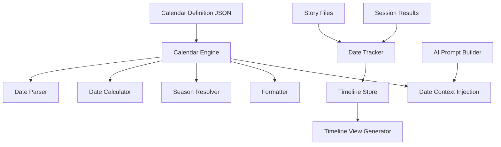

# In-World Calendar Tracking Plan

## Overview

This document describes the design for an in-world calendar tracking system
for the D&D Character Consultant System. The goal is to provide immersive
date tracking within game worlds, enabling story chronology, season-aware
narratives, and timeline visualization.

## Problem Statement

### Current Issues

1. **No Date Context**: Stories lack in-world date references, making it
   difficult to track when events occur relative to each other.

2. **No Seasonal Awareness**: AI-generated narratives cannot reference
   seasons, weather patterns, or time-sensitive events.

3. **Manual Timeline Management**: DMs must manually track dates across
   sessions, leading to inconsistencies.

4. **No Calendar Customization**: Different campaign settings use different
   calendars (Forgotten Realms vs. Eberron vs. homebrew), but the system
   has no way to represent these.

### Evidence from Codebase

| Current State | Limitation |
|---------------|------------|
| Story files have no date fields | Cannot order events chronologically |
| No calendar configuration | Cannot represent different game worlds |
| Session results lack timestamps | Cannot correlate real-world and in-world time |
| AI prompts lack date context | Cannot generate time-aware narratives |

---

## Proposed Solution

### High-Level Approach

1. **Calendar Definition System**: JSON-based calendar definitions supporting
   custom months, weeks, seasons, and epochs
2. **Date Tracking in Stories**: Add in-world date fields to story files
   and session results
3. **Date Progression Calculator**: Automatically calculate date progression
   based on story events and travel times
4. **Timeline Visualization**: Generate timeline views of campaign events
5. **AI Integration**: Inject current date and season into AI prompts

### Calendar Architecture



---

## Implementation Details

### 1. Calendar Definition Schema

Create `game_data/calendars/` directory with calendar definition files.

**File: `game_data/calendars/forgotten_realms.json`**

```json
{
  "calendar_name": "Forgotten Realms - Dalereckoning",
  "calendar_id": "forgotten_realms_dr",
  "description": "Standard Forgotten Realms calendar using Dalereckoning",
  "year_length": 365,
  "months": [
    {"name": "Hammer", "days": 30, "nickname": "Deepwinter"},
    {"name": "Midwinter", "days": 1, "type": "festival"},
    {"name": "Alturiak", "days": 30, "nickname": "The Claw of Winter"},
    {"name": "Ches", "days": 30, "nickname": "The Claw of the Sunsets"},
    {"name": "Tarsakh", "days": 30, "nickname": "The Claw of the Storms"},
    {"name": "Greengrass", "days": 1, "type": "festival"},
    {"name": "Mirtul", "days": 30, "nickname": "The Melting"},
    {"name": "Kythorn", "days": 30, "nickname": "The Time of Flowers"},
    {"name": "Flamerule", "days": 30, "nickname": "Summertide"},
    {"name": "Midsummer", "days": 1, "type": "festival"},
    {"name": "Shieldmeet", "days": 1, "type": "festival", "frequency": "leap_year"},
    {"name": "Eleasis", "days": 30, "nickname": "Highsun"},
    {"name": "Eleint", "days": 30, "nickname": "The Fading"},
    {"name": "Higharvestide", "days": 1, "type": "festival"},
    {"name": "Marpenoth", "days": 30, "nickname": "Leafall"},
    {"name": "Uktar", "days": 30, "nickname": "The Rotting"},
    {"name": "The Feast of the Moon", "days": 1, "type": "festival"},
    {"name": "Nightal", "days": 30, "nickname": "The Drawing Down"}
  ],
  "week": {
    "days": [
      "Sulday",
      "Molday",
      "Tiewday",
      "Watersday",
      "Earthday",
      "Starday",
      "Sunday"
    ],
    "length": 10
  },
  "seasons": [
    {"name": "Spring", "start_month": "Ches", "start_day": 15, "end_month": "Kythorn", "end_day": 15},
    {"name": "Summer", "start_month": "Kythorn", "start_day": 16, "end_month": "Eleint", "end_day": 15},
    {"name": "Autumn", "start_month": "Eleint", "start_day": 16, "end_month": "Uktar", "end_day": 15},
    {"name": "Winter", "start_month": "Uktar", "start_day": 16, "end_month": "Ches", "end_day": 14}
  ],
  "epochs": [
    {"name": "Dalereckoning", "abbreviation": "DR", "start_year": 1, "description": "Years since the raising of the Standing Stone"}
  ],
  "holidays": [
    {"name": "Midwinter", "month": "Midwinter", "day": 1, "description": "Midwinter festival"},
    {"name": "Greengrass", "month": "Greengrass", "day": 1, "description": "Spring festival"},
    {"name": "Midsummer", "month": "Midsummer", "day": 1, "description": "Summer festival"},
    {"name": "Shieldmeet", "month": "Shieldmeet", "day": 1, "description": "Leap year festival"},
    {"name": "Higharvestide", "month": "Higharvestide", "day": 1, "description": "Harvest festival"},
    {"name": "Feast of the Moon", "month": "The Feast of the Moon", "day": 1, "description": "Remembrance of the dead"}
  ]
}
```

**File: `game_data/calendars/generic.json`**

```json
{
  "calendar_name": "Generic D&D Calendar",
  "calendar_id": "generic",
  "description": "Simple 12-month calendar for homebrew worlds",
  "year_length": 365,
  "months": [
    {"name": "January", "days": 31},
    {"name": "February", "days": 28},
    {"name": "March", "days": 31},
    {"name": "April", "days": 30},
    {"name": "May", "days": 31},
    {"name": "June", "days": 30},
    {"name": "July", "days": 31},
    {"name": "August", "days": 31},
    {"name": "September", "days": 30},
    {"name": "October", "days": 31},
    {"name": "November", "days": 30},
    {"name": "December", "days": 31}
  ],
  "week": {
    "days": ["Sunday", "Monday", "Tuesday", "Wednesday", "Thursday", "Friday", "Saturday"],
    "length": 7
  },
  "seasons": [
    {"name": "Spring", "start_month": "March", "start_day": 20, "end_month": "June", "end_day": 20},
    {"name": "Summer", "start_month": "June", "start_day": 21, "end_month": "September", "end_day": 22},
    {"name": "Autumn", "start_month": "September", "start_day": 23, "end_month": "December", "end_day": 20},
    {"name": "Winter", "start_month": "December", "start_day": 21, "end_month": "March", "end_day": 19}
  ],
  "epochs": [
    {"name": "Common Era", "abbreviation": "CE", "start_year": 1}
  ],
  "holidays": []
}
```

### 2. Calendar Engine Module

Create `src/calendar/calendar_engine.py`:

```python
"""Calendar engine for in-world date tracking."""

import json
from dataclasses import dataclass, field
from typing import Dict, List, Optional, Tuple
from pathlib import Path

from src.utils.file_io import load_json_file
from src.utils.path_utils import get_game_data_path


@dataclass
class Month:
    """Represents a month in a calendar."""
    name: str
    days: int
    nickname: str = ""
    month_type: str = "standard"  # standard, festival


@dataclass
class Season:
    """Represents a season in a calendar."""
    name: str
    start_month: str
    start_day: int
    end_month: str
    end_day: int


@dataclass
class Holiday:
    """Represents a holiday in a calendar."""
    name: str
    month: str
    day: int
    description: str = ""


@dataclass
class InWorldDate:
    """Represents a date in the game world."""
    year: int
    month: str
    day: int
    epoch: str = ""
    calendar_id: str = "generic"

    def __str__(self) -> str:
        """Return formatted date string."""
        if self.epoch:
            return f"{self.day} {self.month}, {self.year} {self.epoch}"
        return f"{self.day} {self.month}, {self.year}"

    def to_dict(self) -> Dict:
        """Convert to dictionary for JSON serialization."""
        return {
            "year": self.year,
            "month": self.month,
            "day": self.day,
            "epoch": self.epoch,
            "calendar_id": self.calendar_id
        }

    @classmethod
    def from_dict(cls, data: Dict) -> "InWorldDate":
        """Create from dictionary."""
        return cls(
            year=data["year"],
            month=data["month"],
            day=data["day"],
            epoch=data.get("epoch", ""),
            calendar_id=data.get("calendar_id", "generic")
        )


class CalendarEngine:
    """Manages calendar definitions and date calculations."""

    def __init__(self, calendar_id: str = "generic"):
        """Initialize calendar engine with specified calendar.

        Args:
            calendar_id: ID of the calendar to use
        """
        self.calendar_id = calendar_id
        self._calendar_data: Dict = {}
        self._months: List[Month] = []
        self._seasons: List[Season] = []
        self._holidays: List[Holiday] = []
        self._week_days: List[str] = []
        self._epochs: List[Dict] = []
        self._load_calendar()

    def _load_calendar(self) -> None:
        """Load calendar definition from file."""
        calendar_path = (
            get_game_data_path() / "calendars" / f"{self.calendar_id}.json"
        )

        if not calendar_path.exists():
            # Fall back to generic calendar
            calendar_path = (
                get_game_data_path() / "calendars" / "generic.json"
            )

        if calendar_path.exists():
            self._calendar_data = load_json_file(str(calendar_path))
            self._parse_calendar()

    def _parse_calendar(self) -> None:
        """Parse calendar data into structured objects."""
        # Parse months
        for month_data in self._calendar_data.get("months", []):
            self._months.append(Month(
                name=month_data["name"],
                days=month_data["days"],
                nickname=month_data.get("nickname", ""),
                month_type=month_data.get("type", "standard")
            ))

        # Parse seasons
        for season_data in self._calendar_data.get("seasons", []):
            self._seasons.append(Season(
                name=season_data["name"],
                start_month=season_data["start_month"],
                start_day=season_data["start_day"],
                end_month=season_data["end_month"],
                end_day=season_data["end_day"]
            ))

        # Parse holidays
        for holiday_data in self._calendar_data.get("holidays", []):
            self._holidays.append(Holiday(
                name=holiday_data["name"],
                month=holiday_data["month"],
                day=holiday_data["day"],
                description=holiday_data.get("description", "")
            ))

        # Parse week days
        week_data = self._calendar_data.get("week", {})
        self._week_days = week_data.get("days", [])

        # Parse epochs
        self._epochs = self._calendar_data.get("epochs", [])

    def get_month(self, month_name: str) -> Optional[Month]:
        """Get month by name."""
        for month in self._months:
            if month.name.lower() == month_name.lower():
                return month
        return None

    def get_season(self, date: InWorldDate) -> Optional[str]:
        """Get the season for a given date."""
        month = self.get_month(date.month)
        if not month:
            return None

        for season in self._seasons:
            # Check if date falls within season
            # This is simplified - full implementation would handle year wrap
            if self._date_in_season(date, season):
                return season.name

        return None

    def _date_in_season(self, date: InWorldDate, season: Season) -> bool:
        """Check if a date falls within a season."""
        # Simplified check - full implementation would handle year boundaries
        month_names = [m.name for m in self._months]
        date_month_idx = next(
            (i for i, m in enumerate(month_names) if m.lower() == date.month.lower()),
            -1
        )
        start_month_idx = next(
            (i for i, m in enumerate(month_names) if m.lower() == season.start_month.lower()),
            -1
        )
        end_month_idx = next(
            (i for i, m in enumerate(month_names) if m.lower() == season.end_month.lower()),
            -1
        )

        if date_month_idx == -1:
            return False

        # Handle season that spans year boundary
        if start_month_idx > end_month_idx:
            return date_month_idx >= start_month_idx or date_month_idx <= end_month_idx

        return start_month_idx <= date_month_idx <= end_month_idx

    def get_holiday(self, date: InWorldDate) -> Optional[Holiday]:
        """Get holiday for a specific date, if any."""
        for holiday in self._holidays:
            if (holiday.month.lower() == date.month.lower() and
                holiday.day == date.day):
                return holiday
        return None

    def get_week_day(self, date: InWorldDate) -> Optional[str]:
        """Get the day of the week for a date."""
        if not self._week_days:
            return None

        # Calculate days since a reference date
        total_days = self._date_to_day_number(date)
        week_length = len(self._week_days)
        day_index = total_days % week_length

        return self._week_days[day_index]

    def _date_to_day_number(self, date: InWorldDate) -> int:
        """Convert date to absolute day number for calculations."""
        total_days = 0

        # Add days from years
        year_length = self._calendar_data.get("year_length", 365)
        total_days += date.year * year_length

        # Add days from months
        for month in self._months:
            if month.name.lower() == date.month.lower():
                total_days += date.day
                break
            total_days += month.days

        return total_days

    def add_days(self, date: InWorldDate, days: int) -> InWorldDate:
        """Add days to a date and return new date.

        Args:
            date: Starting date
            days: Number of days to add

        Returns:
            New InWorldDate after adding days
        """
        total_days = self._date_to_day_number(date) + days
        return self._day_number_to_date(total_days)

    def _day_number_to_date(self, total_days: int) -> InWorldDate:
        """Convert absolute day number back to date."""
        year_length = self._calendar_data.get("year_length", 365)

        year = total_days // year_length
        remaining_days = total_days % year_length

        current_day = 0
        month_name = self._months[0].name if self._months else "Unknown"
        day = 1

        for month in self._months:
            if current_day + month.days > remaining_days:
                month_name = month.name
                day = remaining_days - current_day + 1
                break
            current_day += month.days

        epoch = ""
        if self._epochs:
            epoch = self._epochs[0].get("abbreviation", "")

        return InWorldDate(
            year=year,
            month=month_name,
            day=day,
            epoch=epoch,
            calendar_id=self.calendar_id
        )

    def days_between(self, date1: InWorldDate, date2: InWorldDate) -> int:
        """Calculate days between two dates."""
        return abs(self._date_to_day_number(date1) - self._date_to_day_number(date2))

    def format_date(self, date: InWorldDate, format_type: str = "long") -> str:
        """Format date in various styles.

        Args:
            date: Date to format
            format_type: long, short, or narrative

        Returns:
            Formatted date string
        """
        if format_type == "short":
            return f"{date.day} {date.month[:3]} {date.year}"

        if format_type == "narrative":
            season = self.get_season(date)
            weekday = self.get_week_day(date)
            holiday = self.get_holiday(date)

            parts = []
            if weekday:
                parts.append(weekday)
            parts.append(f"the {self._ordinal(date.day)} of {date.month}")
            if season:
                parts.append(f"in {season}")
            if holiday:
                parts.append(f"({holiday.name})")

            return " ".join(parts)

        # Long format (default)
        return str(date)

    def _ordinal(self, n: int) -> str:
        """Return ordinal string for number."""
        suffix = "th"
        if 10 <= n % 100 <= 20:
            suffix = "th"
        elif n % 10 == 1:
            suffix = "st"
        elif n % 10 == 2:
            suffix = "nd"
        elif n % 10 == 3:
            suffix = "rd"
        return f"{n}{suffix}"

    def get_date_context(self, date: InWorldDate) -> Dict:
        """Get full context for a date for AI prompts.

        Returns:
            Dictionary with date, season, holiday, and narrative context
        """
        return {
            "date": str(date),
            "formatted": self.format_date(date, "narrative"),
            "season": self.get_season(date),
            "weekday": self.get_week_day(date),
            "holiday": self.get_holiday(date).__dict__ if self.get_holiday(date) else None,
            "year": date.year,
            "month": date.month,
            "day": date.day
        }
```

### 3. Date Tracker for Stories

Create `src/calendar/date_tracker.py`:

```python
"""Date tracking for stories and sessions."""

from dataclasses import dataclass, field
from typing import Dict, List, Optional
from datetime import datetime

from src.calendar.calendar_engine import CalendarEngine, InWorldDate
from src.utils.file_io import load_json_file, save_json_file
from src.utils.path_utils import get_game_data_path


@dataclass
class TimelineEvent:
    """Represents an event in the campaign timeline."""
    event_id: str
    title: str
    date: InWorldDate
    description: str = ""
    story_file: str = ""
    session_id: str = ""
    characters_involved: List[str] = field(default_factory=list)
    location: str = ""
    tags: List[str] = field(default_factory=list)

    def to_dict(self) -> Dict:
        """Convert to dictionary for JSON serialization."""
        return {
            "event_id": self.event_id,
            "title": self.title,
            "date": self.date.to_dict(),
            "description": self.description,
            "story_file": self.story_file,
            "session_id": self.session_id,
            "characters_involved": self.characters_involved,
            "location": self.location,
            "tags": self.tags
        }

    @classmethod
    def from_dict(cls, data: Dict) -> "TimelineEvent":
        """Create from dictionary."""
        return cls(
            event_id=data["event_id"],
            title=data["title"],
            date=InWorldDate.from_dict(data["date"]),
            description=data.get("description", ""),
            story_file=data.get("story_file", ""),
            session_id=data.get("session_id", ""),
            characters_involved=data.get("characters_involved", []),
            location=data.get("location", ""),
            tags=data.get("tags", [])
        )


class DateTracker:
    """Tracks in-world dates for campaigns."""

    def __init__(self, campaign_name: str, calendar_id: str = "generic"):
        """Initialize date tracker for a campaign.

        Args:
            campaign_name: Name of the campaign
            calendar_id: ID of the calendar to use
        """
        self.campaign_name = campaign_name
        self.calendar = CalendarEngine(calendar_id)
        self._current_date: Optional[InWorldDate] = None
        self._timeline: List[TimelineEvent] = []
        self._load_campaign_timeline()

    def _load_campaign_timeline(self) -> None:
        """Load existing timeline for campaign."""
        timeline_path = (
            get_game_data_path() / "campaigns" / self.campaign_name / "timeline.json"
        )

        if timeline_path.exists():
            data = load_json_file(str(timeline_path))

            # Load current date
            if "current_date" in data:
                self._current_date = InWorldDate.from_dict(data["current_date"])

            # Load timeline events
            for event_data in data.get("events", []):
                self._timeline.append(TimelineEvent.from_dict(event_data))

    def save_timeline(self) -> None:
        """Save timeline to file."""
        timeline_path = (
            get_game_data_path() / "campaigns" / self.campaign_name / "timeline.json"
        )

        data = {
            "campaign_name": self.campaign_name,
            "calendar_id": self.calendar.calendar_id,
            "current_date": self._current_date.to_dict() if self._current_date else None,
            "events": [e.to_dict() for e in self._timeline]
        }

        save_json_file(str(timeline_path), data)

    def set_current_date(self, date: InWorldDate) -> None:
        """Set the current in-world date."""
        self._current_date = date
        self.save_timeline()

    def get_current_date(self) -> Optional[InWorldDate]:
        """Get the current in-world date."""
        return self._current_date

    def advance_days(self, days: int) -> Optional[InWorldDate]:
        """Advance the current date by a number of days."""
        if self._current_date:
            self._current_date = self.calendar.add_days(self._current_date, days)
            self.save_timeline()
            return self._current_date
        return None

    def add_event(
        self,
        title: str,
        date: Optional[InWorldDate] = None,
        description: str = "",
        story_file: str = "",
        session_id: str = "",
        characters_involved: List[str] = None,
        location: str = "",
        tags: List[str] = None
    ) -> TimelineEvent:
        """Add an event to the timeline."""
        if date is None:
            date = self._current_date or InWorldDate(1, "January", 1)

        event_id = f"event_{len(self._timeline) + 1:04d}"

        event = TimelineEvent(
            event_id=event_id,
            title=title,
            date=date,
            description=description,
            story_file=story_file,
            session_id=session_id,
            characters_involved=characters_involved or [],
            location=location,
            tags=tags or []
        )

        self._timeline.append(event)
        self.save_timeline()

        return event

    def get_timeline(self) -> List[TimelineEvent]:
        """Get all timeline events sorted by date."""
        return sorted(self._timeline, key=lambda e: self.calendar._date_to_day_number(e.date))

    def get_events_in_range(
        self,
        start_date: InWorldDate,
        end_date: InWorldDate
    ) -> List[TimelineEvent]:
        """Get events within a date range."""
        start_day = self.calendar._date_to_day_number(start_date)
        end_day = self.calendar._date_to_day_number(end_date)

        return [
            e for e in self._timeline
            if start_day <= self.calendar._date_to_day_number(e.date) <= end_day
        ]

    def get_date_context_for_prompt(self) -> str:
        """Get formatted date context for AI prompts."""
        if not self._current_date:
            return ""

        context = self.calendar.get_date_context(self._current_date)

        prompt_context = f"""
Current Date: {context['formatted']}
Season: {context['season'] or 'Unknown'}
"""

        if context['holiday']:
            prompt_context += f"Holiday: {context['holiday']['name']} - {context['holiday']['description']}\n"

        return prompt_context.strip()
```

### 4. Story File Integration

Update story file format to include date fields:

**Example story file with date:**

```markdown
# The Goblin Ambush

**Date:** 15 Ches, 1492 DR
**Season:** Spring
**Location:** Triboar Trail

## Narrative

On a crisp spring morning, the party encounters a broken wagon on the road...
```

**Story metadata JSON addition:**

```json
{
  "story_title": "The Goblin Ambush",
  "in_world_date": {
    "year": 1492,
    "month": "Ches",
    "day": 15,
    "epoch": "DR",
    "calendar_id": "forgotten_realms_dr"
  },
  "duration_days": 1,
  "season": "Spring"
}
```

### 5. AI Prompt Integration

Update `src/dm/dungeon_master.py` to inject date context:

```python
def _build_date_context(self, campaign_name: str) -> str:
    """Build date context for AI prompts."""
    from src.calendar.date_tracker import DateTracker

    try:
        tracker = DateTracker(campaign_name)
        return tracker.get_date_context_for_prompt()
    except Exception:
        return ""

def generate_narrative(self, prompt: str, campaign_name: str) -> str:
    """Generate narrative with date context."""
    date_context = self._build_date_context(campaign_name)

    full_prompt = f"""
{date_context}

{prompt}

Please consider the current date and season when generating the narrative.
"""
    # ... rest of generation logic
```

---

## Affected Files

### New Files to Create

| File | Purpose |
|------|---------|
| `src/calendar/__init__.py` | Package initialization |
| `src/calendar/calendar_engine.py` | Calendar definition and calculations |
| `src/calendar/date_tracker.py` | Date tracking for campaigns |
| `src/calendar/timeline_view.py` | Timeline visualization |
| `game_data/calendars/generic.json` | Default calendar definition |
| `game_data/calendars/forgotten_realms.json` | Forgotten Realms calendar |
| `tests/calendar/test_calendar_engine.py` | Calendar engine tests |
| `tests/calendar/test_date_tracker.py` | Date tracker tests |

### Files to Modify

| File | Changes |
|------|---------|
| `src/dm/dungeon_master.py` | Add date context to prompts |
| `src/stories/story_manager.py` | Add date fields to story handling |
| `src/stories/story_file_manager.py` | Parse date from story files |
| `src/cli/cli_story_manager.py` | Add date selection prompts |
| `src/validation/character_validator.py` | Add date field validation |

---

## Testing Strategy

### Unit Tests

1. **Calendar Engine Tests**
   - Test month parsing from JSON
   - Test season calculation for various dates
   - Test holiday detection
   - Test date arithmetic (add_days, days_between)
   - Test week day calculation
   - Test date formatting

2. **Date Tracker Tests**
   - Test timeline loading/saving
   - Test event creation and retrieval
   - Test date range queries
   - Test prompt context generation

### Integration Tests

1. **Story Integration**
   - Test story file with date metadata
   - Test date progression across sessions
   - Test AI prompt includes date context

### Test Data

Use existing `game_data/campaigns/Example_Campaign/` for testing:
- Add timeline.json to Example_Campaign
- Test with Forgotten Realms calendar

---

## Migration Path

### Phase 1: Calendar Infrastructure

1. Create `src/calendar/` package
2. Implement `CalendarEngine` with basic date calculations
3. Create calendar definition JSON files
4. Add unit tests for calendar engine

### Phase 2: Date Tracking

1. Implement `DateTracker` class
2. Add timeline.json support to campaigns
3. Create CLI commands for date management
4. Add tests for date tracker

### Phase 3: Story Integration

1. Update story file format to include date fields
2. Modify story manager to handle dates
3. Add date prompts to story creation workflow
4. Update existing stories with dates (manual)

### Phase 4: AI Integration

1. Inject date context into AI prompts
2. Add season-aware narrative suggestions
3. Create timeline visualization
4. Add CLI timeline view command

### Backward Compatibility

- Stories without dates continue to work
- Default calendar is generic (Gregorian-like)
- Timeline is optional per campaign
- No breaking changes to existing APIs

---

## Dependencies

### Internal Dependencies

- `src/utils/file_io.py` - JSON loading/saving
- `src/utils/path_utils.py` - Path resolution
- `src/dm/dungeon_master.py` - AI prompt integration

### External Dependencies

None - uses only Python standard library

### Optional Dependencies

- Integration with SQLite plan for timeline storage
- Integration with export plan for timeline reports

---

## Future Enhancements

1. **Moon Phases**: Track lunar cycles for lycanthropes and tide-dependent events
2. **Weather Generation**: Season-aware weather suggestions
3. **Astronomical Events**: Eclipses, comets, and celestial events
4. **Cultural Calendars**: Multiple calendar systems in one world
5. **Time Zone Support**: Different time zones for large worlds
