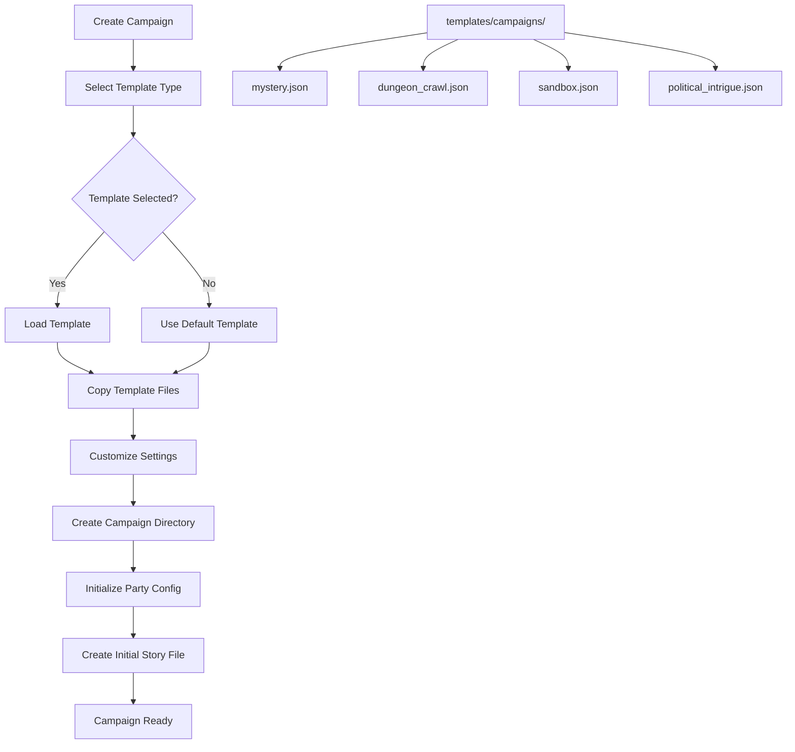

# Campaign Templates Plan

## Overview

This document describes the design for campaign templates that provide
pre-configured settings, story structures, and content frameworks for common
campaign types. The goal is to help DMs quickly start new campaigns with
appropriate structures and guidance.

## Problem Statement

### Current Issues

1. **Manual Campaign Setup**: Every new campaign requires manual creation of
   directory structure, party configuration, and initial story files.

2. **No Structural Guidance**: New DMs may not know what files and structures
   are needed for different campaign types.

3. **Repetitive Configuration**: Similar settings must be re-entered for each
   new campaign of the same type.

4. **Missing Best Practices**: No way to encode learnings from successful
   campaigns into reusable templates.

### Evidence from Codebase

| Current State | Issue |
|---------------|-------|
| `game_data/campaigns/Example_Campaign/` | Only one example exists |
| No template directory | No reusable campaign patterns |
| Manual directory creation | Error-prone setup process |
| No campaign type metadata | Cannot filter by campaign style |

---

## Proposed Solution

### High-Level Approach

1. **Template Directory**: Create `templates/campaigns/` for template storage
2. **Template Types**: Define common campaign archetypes
3. **Template Schema**: JSON schema for template definition
4. **Campaign Creation Flow**: CLI wizard using templates
5. **Template Inheritance**: Allow templates to extend base templates

### Template Architecture



---

## Implementation Details

### 1. Template Types

Define common campaign archetypes:

| Template Type | Description | Key Features |
|---------------|-------------|--------------|
| `mystery` | Investigation-focused campaigns | Clue tracking, NPC witnesses, red herrings |
| `dungeon_crawl` | Combat and exploration focused | Room descriptions, monster tables, loot |
| `sandbox` | Open-world exploration | Location nodes, random encounters, factions |
| `political_intrigue` | Social and political maneuvering | Faction relationships, secrets, agendas |
| `heroic_journey` | Classic hero's arc story | Milestone progression, character arcs |
| `survival` | Resource management focus | Supply tracking, environmental hazards |
| `heist` | Planning and execution missions | Target info, security measures, crew roles |

### 2. Template Schema

Create `templates/campaigns/schema.json`:

```json
{
  "$schema": "http://json-schema.org/draft-07/schema#",
  "title": "Campaign Template",
  "type": "object",
  "required": ["name", "type", "description"],
  "properties": {
    "name": {
      "type": "string",
      "description": "Template display name"
    },
    "type": {
      "type": "string",
      "enum": [
        "mystery",
        "dungeon_crawl",
        "sandbox",
        "political_intrigue",
        "heroic_journey",
        "survival",
        "heist",
        "custom"
      ]
    },
    "description": {
      "type": "string",
      "description": "Brief description of this template"
    },
    "extends": {
      "type": "string",
      "description": "Optional parent template to inherit from"
    },
    "default_settings": {
      "type": "object",
      "properties": {
        "recommended_party_size": {
          "type": "object",
          "properties": {
            "min": {"type": "integer", "minimum": 1},
            "max": {"type": "integer", "maximum": 10}
          }
        },
        "recommended_level_range": {
          "type": "object",
          "properties": {
            "start": {"type": "integer", "minimum": 1, "maximum": 20},
            "end": {"type": "integer", "minimum": 1, "maximum": 20}
          }
        },
        "tone": {
          "type": "string",
          "enum": ["serious", "lighthearted", "dark", "heroic", "comedic"]
        },
        "content_rating": {
          "type": "string",
          "enum": ["family", "teen", "mature"]
        }
      }
    },
    "initial_files": {
      "type": "object",
      "properties": {
        "story_prefix": {
          "type": "string",
          "description": "Prefix for story file numbering"
        },
        "first_story": {
          "type": "object",
          "description": "Template for first story file"
        }
      }
    },
    "directories": {
      "type": "array",
      "items": {"type": "string"},
      "description": "Additional directories to create"
    },
    "prompts": {
      "type": "array",
      "items": {
        "type": "object",
        "properties": {
          "question": {"type": "string"},
          "field": {"type": "string"},
          "type": {"type": "string", "enum": ["text", "choice", "multiselect"]},
          "options": {"type": "array", "items": {"type": "string"}},
          "default": {"type": "string"}
        }
      }
    },
    "hooks": {
      "type": "object",
      "description": "Story hooks specific to this template type"
    }
  }
}
```

### 3. Example Template Files

Create `templates/campaigns/mystery.json`:

```json
{
  "name": "Mystery Campaign",
  "type": "mystery",
  "description": "Investigation-focused campaign with clues, witnesses, and revelations",
  "default_settings": {
    "recommended_party_size": {"min": 3, "max": 5},
    "recommended_level_range": {"start": 1, "end": 10},
    "tone": "serious",
    "content_rating": "teen"
  },
  "initial_files": {
    "story_prefix": "chapter",
    "first_story": {
      "title": "The Investigation Begins",
      "template": "mystery_intro.md"
    }
  },
  "directories": ["clues", "suspects", "evidence"],
  "prompts": [
    {
      "question": "What is the central mystery?",
      "field": "mystery_type",
      "type": "choice",
      "options": ["Murder", "Theft", "Disappearance", "Conspiracy", "Supernatural"],
      "default": "Murder"
    },
    {
      "question": "Where does the investigation begin?",
      "field": "starting_location",
      "type": "text",
      "default": "A small village"
    },
    {
      "question": "Who is the primary patron or client?",
      "field": "patron",
      "type": "text",
      "default": "A worried noble"
    }
  ],
  "hooks": {
    "opening": [
      "A desperate plea for help arrives",
      "The party witnesses a crime",
      "A mysterious letter leads to intrigue"
    ],
    "clue_types": [
      "Physical evidence",
      "Testimony",
      "Documentary evidence",
      "Magical traces"
    ]
  }
}
```

Create `templates/campaigns/dungeon_crawl.json`:

```json
{
  "name": "Dungeon Crawl",
  "type": "dungeon_crawl",
  "description": "Combat and exploration focused campaign with dungeons, monsters, and treasure",
  "default_settings": {
    "recommended_party_size": {"min": 4, "max": 6},
    "recommended_level_range": {"start": 1, "end": 20},
    "tone": "heroic",
    "content_rating": "teen"
  },
  "initial_files": {
    "story_prefix": "level",
    "first_story": {
      "title": "Descent into Darkness",
      "template": "dungeon_intro.md"
    }
  },
  "directories": ["maps", "monsters", "treasure"],
  "prompts": [
    {
      "question": "What type of dungeon is the primary location?",
      "field": "dungeon_type",
      "type": "choice",
      "options": [
        "Ancient Ruins",
        "Natural Caves",
        "Abandoned Mine",
        "Haunted Castle",
        "Underground Temple"
      ],
      "default": "Ancient Ruins"
    },
    {
      "question": "What is the ultimate treasure or goal?",
      "field": "ultimate_goal",
      "type": "text",
      "default": "A legendary artifact"
    },
    {
      "question": "What is the dungeon's primary threat?",
      "field": "primary_threat",
      "type": "choice",
      "options": ["Goblins", "Undead", "Demons", "Elementals", "Dragons"],
      "default": "Goblins"
    }
  ],
  "hooks": {
    "opening": [
      "A map leads to forgotten depths",
      "Villagers speak of treasures untold",
      "A merchant offers a lucrative contract"
    ]
  }
}
```

### 4. Campaign Creation Manager

Create `src/campaigns/campaign_creator.py`:

```python
"""Campaign creation from templates."""

import json
from pathlib import Path
from typing import Dict, Any, List, Optional
from dataclasses import dataclass

from src.utils.file_io import save_json_file, write_text_file, ensure_directory
from src.utils.path_utils import get_game_data_path


@dataclass
class CampaignTemplate:
    """Loaded campaign template."""
    name: str
    type: str
    description: str
    default_settings: Dict[str, Any]
    initial_files: Dict[str, Any]
    directories: List[str]
    prompts: List[Dict[str, Any]]
    hooks: Dict[str, Any]

    @classmethod
    def from_file(cls, template_path: Path) -> 'CampaignTemplate':
        """Load template from JSON file."""
        with open(template_path, 'r', encoding='utf-8') as f:
            data = json.load(f)

        return cls(
            name=data.get("name", "Unknown"),
            type=data.get("type", "custom"),
            description=data.get("description", ""),
            default_settings=data.get("default_settings", {}),
            initial_files=data.get("initial_files", {}),
            directories=data.get("directories", []),
            prompts=data.get("prompts", []),
            hooks=data.get("hooks", {})
        )


class CampaignCreator:
    """Creates new campaigns from templates."""

    TEMPLATES_DIR = Path("templates/campaigns")

    def __init__(self, workspace_path: Optional[str] = None):
        self.workspace = Path(workspace_path) if workspace_path else get_game_data_path()
        self.campaigns_dir = self.workspace / "campaigns"

    def list_templates(self) -> List[str]:
        """List available campaign templates."""
        templates = []
        template_dir = self.TEMPLATES_DIR

        if template_dir.exists():
            for template_file in template_dir.glob("*.json"):
                if template_file.name != "schema.json":
                    templates.append(template_file.stem)

        # Always include default
        if "default" not in templates:
            templates.insert(0, "default")

        return templates

    def load_template(self, template_name: str) -> CampaignTemplate:
        """Load a specific template."""
        if template_name == "default":
            return self._get_default_template()

        template_path = self.TEMPLATES_DIR / f"{template_name}.json"
        if not template_path.exists():
            raise FileNotFoundError(f"Template not found: {template_name}")

        return CampaignTemplate.from_file(template_path)

    def create_campaign(
        self,
        campaign_name: str,
        template_name: str = "default",
        custom_settings: Optional[Dict[str, Any]] = None
    ) -> Path:
        """Create a new campaign from a template.

        Args:
            campaign_name: Name for the new campaign
            template_name: Template to use
            custom_settings: Override settings from prompts

        Returns:
            Path to the created campaign directory
        """
        template = self.load_template(template_name)
        settings = {**template.default_settings, **(custom_settings or {})}

        # Create campaign directory
        campaign_dir = self.campaigns_dir / campaign_name
        ensure_directory(str(campaign_dir))

        # Create additional directories
        for subdir in template.directories:
            ensure_directory(str(campaign_dir / subdir))

        # Create campaign metadata
        metadata = {
            "name": campaign_name,
            "template": template_name,
            "template_type": template.type,
            "created_date": self._get_timestamp(),
            "settings": settings
        }
        save_json_file(str(campaign_dir / "campaign.json"), metadata)

        # Create initial party config
        party_config = {
            "campaign_name": campaign_name,
            "party_members": [],
            "active": True,
            "created_date": self._get_timestamp(),
            "last_updated": self._get_timestamp()
        }
        save_json_file(str(campaign_dir / "current_party.json"), party_config)

        # Create first story file
        self._create_initial_story(campaign_dir, template, settings)

        return campaign_dir

    def _create_initial_story(
        self,
        campaign_dir: Path,
        template: CampaignTemplate,
        settings: Dict[str, Any]
    ):
        """Create the initial story file from template."""
        initial = template.initial_files
        prefix = initial.get("story_prefix", "")

        # Determine filename
        if prefix:
            filename = f"001_{prefix}.md"
        else:
            filename = "001_start.md"

        # Generate content
        content = self._generate_initial_content(template, settings)
        write_text_file(str(campaign_dir / filename), content)

    def _generate_initial_content(
        self,
        template: CampaignTemplate,
        settings: Dict[str, Any]
    ) -> str:
        """Generate initial story content from template."""
        lines = [
            f"# {template.name}",
            "",
            f"**Campaign Type:** {template.type}",
            f"**Description:** {template.description}",
            "",
            "## Opening",
            ""
        ]

        # Add opening hooks
        opening_hooks = template.hooks.get("opening", [])
        if opening_hooks:
            lines.append("Possible opening scenarios:")
            for hook in opening_hooks:
                lines.append(f"- {hook}")
            lines.append("")

        # Add settings
        lines.extend([
            "## Campaign Settings",
            ""
        ])
        for key, value in settings.items():
            lines.append(f"- **{key.replace('_', ' ').title()}:** {value}")

        lines.extend([
            "",
            "## Notes",
            "",
            "[Add your campaign notes here]",
            ""
        ])

        return "\n".join(lines)

    def _get_default_template(self) -> CampaignTemplate:
        """Return the default template."""
        return CampaignTemplate(
            name="Default Campaign",
            type="custom",
            description="A blank campaign with basic structure",
            default_settings={},
            initial_files={"story_prefix": ""},
            directories=[],
            prompts=[],
            hooks={}
        )

    def _get_timestamp(self) -> str:
        """Get current timestamp in ISO format."""
        from datetime import datetime
        return datetime.now().isoformat()


def get_template_prompts(template_name: str) -> List[Dict[str, Any]]:
    """Get customization prompts for a template.

    Returns list of prompt definitions for CLI wizard.
    """
    creator = CampaignCreator()
    template = creator.load_template(template_name)
    return template.prompts
```

### 5. CLI Campaign Creation

Update `src/cli/cli_story_manager.py` or create new file:

```python
def create_campaign_wizard():
    """Interactive campaign creation wizard."""
    print("\n=== Create New Campaign ===\n")

    creator = CampaignCreator()

    # List available templates
    templates = creator.list_templates()
    print("Available templates:")
    for i, template_name in enumerate(templates, 1):
        template = creator.load_template(template_name)
        print(f"  {i}. {template.name} - {template.description}")

    # Select template
    choice = input("\nSelect template (number) or press Enter for default: ").strip()

    if choice == "":
        template_name = "default"
    else:
        try:
            index = int(choice) - 1
            template_name = templates[index]
        except (ValueError, IndexError):
            print("[ERROR] Invalid selection, using default")
            template_name = "default"

    # Get campaign name
    campaign_name = input("\nEnter campaign name: ").strip()
    if not campaign_name:
        print("[ERROR] Campaign name is required")
        return

    # Get template prompts
    template = creator.load_template(template_name)
    custom_settings = {}

    for prompt in template.prompts:
        question = prompt["question"]
        field = prompt["field"]
        prompt_type = prompt.get("type", "text")
        default = prompt.get("default", "")

        if prompt_type == "choice":
            options = prompt.get("options", [])
            print(f"\n{question}")
            for i, opt in enumerate(options, 1):
                print(f"  {i}. {opt}")
            choice = input(f"Select (default: {default}): ").strip()

            if choice == "":
                custom_settings[field] = default
            else:
                try:
                    idx = int(choice) - 1
                    custom_settings[field] = options[idx]
                except (ValueError, IndexError):
                    custom_settings[field] = default

        else:  # text
            answer = input(f"\n{question} (default: {default}): ").strip()
            custom_settings[field] = answer if answer else default

    # Create campaign
    try:
        campaign_path = creator.create_campaign(
            campaign_name,
            template_name,
            custom_settings
        )
        print(f"\n[SUCCESS] Campaign created at: {campaign_path}")
        print(f"  - Template: {template.name}")
        print(f"  - Settings: {len(custom_settings)} customizations")
    except Exception as e:
        print(f"\n[ERROR] Failed to create campaign: {e}")
```

---

## Affected Files

| File | Changes Required |
|------|-----------------|
| `src/campaigns/campaign_creator.py` | Create new module |
| `src/campaigns/__init__.py` | Create new package |
| `src/cli/cli_story_manager.py` | Add campaign creation wizard |
| `src/utils/path_utils.py` | Add template directory helpers |
| `templates/campaigns/schema.json` | Create template schema |
| `templates/campaigns/default.json` | Create default template |
| `templates/campaigns/mystery.json` | Create mystery template |
| `templates/campaigns/dungeon_crawl.json` | Create dungeon crawl template |
| `templates/campaigns/sandbox.json` | Create sandbox template |
| `templates/campaigns/political_intrigue.json` | Create political template |
| `tests/campaigns/test_campaign_creator.py` | Create test file |

---

## Testing Strategy

### Unit Tests

1. **CampaignTemplate Tests**
   - Load template from JSON
   - Validate required fields
   - Handle missing optional fields

2. **CampaignCreator Tests**
   - List available templates
   - Load default template
   - Create campaign directory structure
   - Generate initial story content

3. **Template Validation Tests**
   - All templates conform to schema
   - Required fields present
   - Valid enum values

### Integration Tests

1. Create campaign from each template type
2. Verify directory structure created
3. Verify initial files generated
4. Test campaign loading after creation

### Test Data

Create test templates in `templates/campaigns/`:
- `test_template.json` - Minimal template for testing
- `invalid_template.json` - For validation error testing

---

## Migration Path

### Phase 1: Template Infrastructure

1. Create `templates/campaigns/` directory
2. Create schema.json
3. Create default template
4. Create CampaignCreator class

### Phase 2: Template Library

1. Create mystery template
2. Create dungeon_crawl template
3. Create sandbox template
4. Create political_intrigue template

### Phase 3: CLI Integration

1. Add campaign creation wizard
2. Add template selection menu
3. Add customization prompts
4. Update documentation

---

## Dependencies

### Required Before This Work

- **Current Party Alterations Plan** - Campaign-scoped party configuration

### Works Well With

- **Session Notes Integration Plan** - Template-specific note structures
- **DC Difficulty Scaling Plan** - Template-specific DC recommendations

### Enables Future Work

- Custom template creation by users
- Template sharing between DMs
- Campaign export/import functionality

---

## Risks and Mitigations

| Risk | Impact | Mitigation |
|------|--------|------------|
| Templates too rigid | Medium | Allow full customization after creation |
| Missing template types | Low | Extensible template system |
| Complex prompt wizard | Low | Skip prompts option with defaults |
| Template schema changes | Medium | Version field in templates |

---

## Success Criteria

1. Templates directory with at least 4 template types
2. Campaign creation wizard in CLI
3. All templates pass schema validation
4. Created campaigns have correct structure
5. All tests pass with 10.00/10 pylint score
6. Documentation updated with template usage
