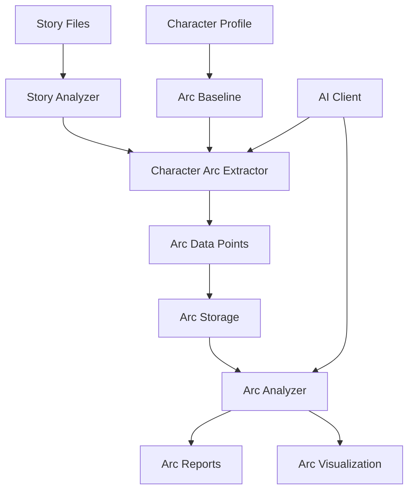

# Character Arc Analysis Plan

## Overview

This document describes the design for a character arc analysis system
for the D&D Character Consultant System. The goal is to analyze character
development over multiple stories, track growth and changes, and generate
arc reports for players and DMs.

## Problem Statement

### Current Issues

1. **No Development Tracking**: Characters evolve through stories but there
   is no systematic tracking of their growth, relationships, or changes.

2. **Manual Arc Review**: DMs and players must manually read through all
   story files to understand character development.

3. **No Arc Metrics**: No quantitative or qualitative measures of character
   growth exist to help guide narrative decisions.

4. **No Arc Reports**: No way to generate summaries of character journeys
   for players or campaign retrospectives.

### Evidence from Codebase

| Current State | Limitation |
|---------------|------------|
| Character profiles are static | No tracking of changes over time |
| Story files contain development | Not extracted or analyzed |
| No arc data structures | Cannot store or query arc information |
| No AI analysis for arcs | Cannot leverage AI for insights |

---

## Proposed Solution

### High-Level Approach

1. **Arc Analysis Criteria**: Define measurable criteria for character
   development (relationships, abilities, personality, goals)
2. **AI-Powered Analysis**: Use AI to analyze stories and extract arc data
3. **Arc Storage Schema**: Store arc progression data per character
4. **Arc Reports**: Generate readable reports on character development
5. **Arc Visualization**: Display arc progression over time

### Arc Analysis Architecture



---

## Implementation Details

### 1. Arc Analysis Criteria

Create `src/character_arc/arc_criteria.py`:

```python
"""Criteria and metrics for character arc analysis."""

from dataclasses import dataclass, field
from typing import List, Dict, Optional
from enum import Enum


class ArcDimension(Enum):
    """Dimensions of character development."""
    PERSONALITY = "personality"
    RELATIONSHIPS = "relationships"
    ABILITIES = "abilities"
    GOALS = "goals"
    BELIEFS = "beliefs"
    REPUTATION = "reputation"
    POSSESSIONS = "possessions"
    TRAUMA = "trauma"
    GROWTH = "growth"


class ArcDirection(Enum):
    """Direction of character change."""
    GROWTH = "growth"           # Positive development
    DECLINE = "decline"         # Negative development
    STASIS = "stasis"           # No significant change
    FLUCTUATION = "fluctuation"  # Mixed changes
    TRANSFORMATION = "transformation"  # Major change


class ArcStage(Enum):
    """Stages in a character arc."""
    INTRODUCTION = "introduction"
    ESTABLISHMENT = "establishment"
    CHALLENGE = "challenge"
    DEVELOPMENT = "development"
    CLIMAX = "climax"
    RESOLUTION = "resolution"
    AFTERMATH = "aftermath"


@dataclass
class ArcMetric:
    """A measurable aspect of character development."""
    metric_id: str
    name: str
    dimension: ArcDimension
    description: str
    measurement_type: str  # "numeric", "categorical", "text"
    scale_min: Optional[int] = None
    scale_max: Optional[int] = None
    categories: List[str] = field(default_factory=list)


# Standard arc metrics
STANDARD_METRICS = [
    ArcMetric(
        metric_id="relationship_strength",
        name="Relationship Strength",
        dimension=ArcDimension.RELATIONSHIPS,
        description="Overall strength of relationships with others",
        measurement_type="numeric",
        scale_min=1,
        scale_max=10
    ),
    ArcMetric(
        metric_id="trust_level",
        name="Trust Level",
        dimension=ArcDimension.RELATIONSHIPS,
        description="Willingness to trust others",
        measurement_type="numeric",
        scale_min=1,
        scale_max=10
    ),
    ArcMetric(
        metric_id="combat_effectiveness",
        name="Combat Effectiveness",
        dimension=ArcDimension.ABILITIES,
        description="Effectiveness in combat situations",
        measurement_type="numeric",
        scale_min=1,
        scale_max=10
    ),
    ArcMetric(
        metric_id="moral_alignment",
        name="Moral Alignment",
        dimension=ArcDimension.BELIEFS,
        description="Current moral stance",
        measurement_type="categorical",
        categories=["lawful_good", "neutral_good", "chaotic_good",
                   "lawful_neutral", "true_neutral", "chaotic_neutral",
                   "lawful_evil", "neutral_evil", "chaotic_evil"]
    ),
    ArcMetric(
        metric_id="confidence",
        name="Confidence Level",
        dimension=ArcDimension.PERSONALITY,
        description="Self-confidence and assurance",
        measurement_type="numeric",
        scale_min=1,
        scale_max=10
    ),
    ArcMetric(
        metric_id="trauma_level",
        name="Trauma Level",
        dimension=ArcDimension.TRAUMA,
        description="Accumulated psychological trauma",
        measurement_type="numeric",
        scale_min=0,
        scale_max=10
    ),
    ArcMetric(
        metric_id="goal_progress",
        name="Goal Progress",
        dimension=ArcDimension.GOALS,
        description="Progress toward primary goal",
        measurement_type="numeric",
        scale_min=0,
        scale_max=100
    ),
    ArcMetric(
        metric_id="reputation",
        name="Reputation",
        dimension=ArcDimension.REPUTATION,
        description="How the character is perceived by others",
        measurement_type="categorical",
        categories=["unknown", "disliked", "neutral", "respected", "renowned", "legendary"]
    ),
]


@dataclass
class ArcCriteria:
    """Criteria for analyzing character arcs."""
    dimensions: List[ArcDimension] = field(default_factory=lambda: list(ArcDimension))
    metrics: List[ArcMetric] = field(default_factory=lambda: STANDARD_METRICS)
    min_stories_for_analysis: int = 2
    significance_threshold: float = 0.2  # 20% change is significant

    def get_metrics_for_dimension(self, dimension: ArcDimension) -> List[ArcMetric]:
        """Get all metrics for a specific dimension."""
        return [m for m in self.metrics if m.dimension == dimension]
```

### 2. Arc Data Structures

Create `src/character_arc/arc_data.py`:

```python
"""Data structures for character arc tracking."""

from dataclasses import dataclass, field
from typing import Dict, List, Optional, Any
from datetime import datetime


@dataclass
class ArcDataPoint:
    """A single data point in a character's arc."""
    story_file: str
    session_id: str
    timestamp: str

    # Metric values at this point
    metric_values: Dict[str, Any] = field(default_factory=dict)

    # Qualitative observations
    observations: List[str] = field(default_factory=list)

    # Key events that influenced this point
    key_events: List[str] = field(default_factory=list)

    # AI analysis notes
    ai_analysis: str = ""

    def to_dict(self) -> Dict:
        """Convert to dictionary."""
        return {
            "story_file": self.story_file,
            "session_id": self.session_id,
            "timestamp": self.timestamp,
            "metric_values": self.metric_values,
            "observations": self.observations,
            "key_events": self.key_events,
            "ai_analysis": self.ai_analysis
        }

    @classmethod
    def from_dict(cls, data: Dict) -> "ArcDataPoint":
        """Create from dictionary."""
        return cls(
            story_file=data.get("story_file", ""),
            session_id=data.get("session_id", ""),
            timestamp=data.get("timestamp", ""),
            metric_values=data.get("metric_values", {}),
            observations=data.get("observations", []),
            key_events=data.get("key_events", []),
            ai_analysis=data.get("ai_analysis", "")
        )


@dataclass
class RelationshipArc:
    """Tracks the arc of a relationship between characters."""
    character_name: str
    target_name: str

    # Relationship progression
    relationship_type: str = "neutral"
    strength: int = 5
    trust: int = 5

    # History of changes
    changes: List[Dict] = field(default_factory=list)

    # Key moments
    key_moments: List[str] = field(default_factory=list)

    def to_dict(self) -> Dict:
        """Convert to dictionary."""
        return {
            "character_name": self.character_name,
            "target_name": self.target_name,
            "relationship_type": self.relationship_type,
            "strength": self.strength,
            "trust": self.trust,
            "changes": self.changes,
            "key_moments": self.key_moments
        }


@dataclass
class CharacterArc:
    """Complete arc data for a character."""
    character_name: str
    campaign_name: str

    # Baseline from character profile
    baseline: Dict[str, Any] = field(default_factory=dict)

    # Data points over time
    data_points: List[ArcDataPoint] = field(default_factory=list)

    # Relationship arcs
    relationships: Dict[str, RelationshipArc] = field(default_factory=dict)

    # Goal tracking
    goals: List[Dict] = field(default_factory=list)

    # Arc analysis results
    arc_direction: str = "stasis"
    arc_stage: str = "introduction"
    arc_summary: str = ""

    # Metadata
    created_at: str = field(default_factory=lambda: datetime.now().isoformat())
    updated_at: str = field(default_factory=lambda: datetime.now().isoformat())

    def to_dict(self) -> Dict:
        """Convert to dictionary for JSON serialization."""
        return {
            "character_name": self.character_name,
            "campaign_name": self.campaign_name,
            "baseline": self.baseline,
            "data_points": [dp.to_dict() for dp in self.data_points],
            "relationships": {k: v.to_dict() for k, v in self.relationships.items()},
            "goals": self.goals,
            "arc_direction": self.arc_direction,
            "arc_stage": self.arc_stage,
            "arc_summary": self.arc_summary,
            "created_at": self.created_at,
            "updated_at": self.updated_at
        }

    @classmethod
    def from_dict(cls, data: Dict) -> "CharacterArc":
        """Create from dictionary."""
        arc = cls(
            character_name=data["character_name"],
            campaign_name=data["campaign_name"],
            baseline=data.get("baseline", {}),
            goals=data.get("goals", []),
            arc_direction=data.get("arc_direction", "stasis"),
            arc_stage=data.get("arc_stage", "introduction"),
            arc_summary=data.get("arc_summary", ""),
            created_at=data.get("created_at", datetime.now().isoformat()),
            updated_at=data.get("updated_at", datetime.now().isoformat())
        )

        # Load data points
        arc.data_points = [
            ArcDataPoint.from_dict(dp) for dp in data.get("data_points", [])
        ]

        # Load relationships
        arc.relationships = {
            k: RelationshipArc(**v)
            for k, v in data.get("relationships", {}).items()
        }

        return arc

    def add_data_point(self, data_point: ArcDataPoint) -> None:
        """Add a new data point to the arc."""
        self.data_points.append(data_point)
        self.updated_at = datetime.now().isoformat()

    def get_metric_progression(self, metric_id: str) -> List[tuple]:
        """Get the progression of a metric over time.

        Returns:
            List of (timestamp, value) tuples
        """
        progression = []
        for dp in self.data_points:
            if metric_id in dp.metric_values:
                progression.append((dp.timestamp, dp.metric_values[metric_id]))
        return progression
```

### 3. AI-Powered Arc Analysis

Create `src/character_arc/arc_analyzer.py`:

```python
"""AI-powered character arc analysis."""

from typing import List, Dict, Optional, Any
from dataclasses import dataclass

from src.character_arc.arc_criteria import (
    ArcCriteria, ArcDimension, ArcDirection, ArcStage, STANDARD_METRICS
)
from src.character_arc.arc_data import (
    CharacterArc, ArcDataPoint, RelationshipArc
)
from src.ai.ai_client import AIClient
from src.utils.character_profile_utils import load_character_profile


@dataclass
class AnalysisResult:
    """Result of arc analysis."""
    dimension: ArcDimension
    direction: ArcDirection
    confidence: float
    observations: List[str]
    evidence: List[str]


class ArcAnalyzer:
    """Analyzes character arcs using AI and pattern matching."""

    def __init__(
        self,
        ai_client: Optional[AIClient] = None,
        criteria: Optional[ArcCriteria] = None
    ):
        """Initialize the arc analyzer.

        Args:
            ai_client: Optional AI client for enhanced analysis
            criteria: Arc analysis criteria
        """
        self.ai_client = ai_client
        self.criteria = criteria or ArcCriteria()

    def analyze_story(
        self,
        story_content: str,
        character_name: str,
        story_file: str = "",
        session_id: str = ""
    ) -> ArcDataPoint:
        """Analyze a story for character development.

        Args:
            story_content: The story text to analyze
            character_name: Name of the character to analyze
            story_file: Path to the story file
            session_id: Session identifier

        Returns:
            ArcDataPoint with analysis results
        """
        data_point = ArcDataPoint(
            story_file=story_file,
            session_id=session_id,
            timestamp=""
        )

        # Use AI if available
        if self.ai_client:
            ai_analysis = self._ai_analyze_story(story_content, character_name)
            data_point.metric_values = ai_analysis.get("metrics", {})
            data_point.observations = ai_analysis.get("observations", [])
            data_point.key_events = ai_analysis.get("key_events", [])
            data_point.ai_analysis = ai_analysis.get("summary", "")
        else:
            # Pattern-based analysis
            data_point.metric_values = self._pattern_analyze_story(
                story_content, character_name
            )

        return data_point

    def _ai_analyze_story(
        self,
        story_content: str,
        character_name: str
    ) -> Dict[str, Any]:
        """Use AI to analyze story for character development."""
        prompt = f"""
Analyze the following story for character development of {character_name}.

Story:
{story_content[:4000]}  # Limit for token constraints

Provide analysis in the following JSON format:
{{
    "metrics": {{
        "relationship_strength": <1-10>,
        "trust_level": <1-10>,
        "combat_effectiveness": <1-10>,
        "confidence": <1-10>,
        "trauma_level": <0-10>,
        "goal_progress": <0-100>
    }},
    "observations": [
        "Observation 1 about character development",
        "Observation 2 about character development"
    ],
    "key_events": [
        "Event that affected the character",
        "Another significant event"
    ],
    "summary": "Brief summary of character development in this story"
}}

Focus on:
1. How the character changed or grew
2. Relationship developments
3. Skills or abilities used or gained
4. Emotional or psychological changes
5. Progress toward goals
"""

        try:
            response = self.ai_client.generate(prompt)
            return self._parse_ai_response(response)
        except Exception:
            return {"metrics": {}, "observations": [], "key_events": [], "summary": ""}

    def _parse_ai_response(self, response: str) -> Dict[str, Any]:
        """Parse AI response into structured data."""
        import json

        try:
            # Find JSON in response
            start = response.find("{")
            end = response.rfind("}") + 1
            if start >= 0 and end > start:
                json_str = response[start:end]
                return json.loads(json_str)
        except json.JSONDecodeError:
            pass

        return {"metrics": {}, "observations": [], "key_events": [], "summary": ""}

    def _pattern_analyze_story(
        self,
        story_content: str,
        character_name: str
    ) -> Dict[str, Any]:
        """Pattern-based analysis without AI."""
        import re

        metrics = {}

        # Find character mentions
        char_pattern = re.compile(
            rf"\b{re.escape(character_name)}\b",
            re.IGNORECASE
        )
        mentions = len(char_pattern.findall(story_content))

        # Estimate engagement based on mentions
        metrics["engagement"] = min(10, mentions)

        # Look for combat indicators
        combat_patterns = [
            r"\b(?:attacks?|strikes?|hits?|damage|wounds?)\b",
            r"\b(?:battle|combat|fight)\b"
        ]
        combat_score = sum(
            len(re.findall(p, story_content, re.IGNORECASE))
            for p in combat_patterns
        )
        metrics["combat_involvement"] = min(10, combat_score)

        # Look for social indicators
        social_patterns = [
            r"\b(?:talks?|speaks?|says?|replies?)\b",
            r"\b(?:negotiates?|persuades?|convinces?)\b"
        ]
        social_score = sum(
            len(re.findall(p, story_content, re.IGNORECASE))
            for p in social_patterns
        )
        metrics["social_involvement"] = min(10, social_score)

        return metrics

    def analyze_arc_progression(
        self,
        arc: CharacterArc
    ) -> Dict[str, Any]:
        """Analyze the overall progression of a character arc.

        Args:
            arc: CharacterArc to analyze

        Returns:
            Analysis results with direction, stage, and summary
        """
        if len(arc.data_points) < self.criteria.min_stories_for_analysis:
            return {
                "direction": ArcDirection.STASIS.value,
                "stage": ArcStage.INTRODUCTION.value,
                "summary": "Insufficient data for arc analysis"
            }

        # Analyze each dimension
        dimension_analyses = []
        for dimension in self.criteria.dimensions:
            analysis = self._analyze_dimension(arc, dimension)
            dimension_analyses.append(analysis)

        # Determine overall direction
        overall_direction = self._determine_overall_direction(dimension_analyses)

        # Determine arc stage
        arc_stage = self._determine_arc_stage(arc)

        # Generate summary
        summary = self._generate_arc_summary(arc, dimension_analyses)

        return {
            "direction": overall_direction,
            "stage": arc_stage,
            "summary": summary,
            "dimension_analyses": [
                {
                    "dimension": a.dimension.value,
                    "direction": a.direction.value,
                    "confidence": a.confidence,
                    "observations": a.observations
                }
                for a in dimension_analyses
            ]
        }

    def _analyze_dimension(
        self,
        arc: CharacterArc,
        dimension: ArcDimension
    ) -> AnalysisResult:
        """Analyze a specific dimension of character development."""
        metrics = self.criteria.get_metrics_for_dimension(dimension)

        observations = []
        evidence = []
        changes = []

        for metric in metrics:
            progression = arc.get_metric_progression(metric.metric_id)

            if len(progression) >= 2:
                first_value = progression[0][1]
                last_value = progression[-1][1]

                if isinstance(first_value, (int, float)) and isinstance(last_value, (int, float)):
                    change = last_value - first_value
                    relative_change = abs(change) / max(first_value, 1)

                    if relative_change >= self.criteria.significance_threshold:
                        changes.append(change)
                        observations.append(
                            f"{metric.name}: {first_value} -> {last_value}"
                        )

        # Determine direction
        if not changes:
            direction = ArcDirection.STASIS
            confidence = 0.5
        elif sum(1 for c in changes if c > 0) > len(changes) * 0.7:
            direction = ArcDirection.GROWTH
            confidence = 0.8
        elif sum(1 for c in changes if c < 0) > len(changes) * 0.7:
            direction = ArcDirection.DECLINE
            confidence = 0.8
        else:
            direction = ArcDirection.FLUCTUATION
            confidence = 0.6

        return AnalysisResult(
            dimension=dimension,
            direction=direction,
            confidence=confidence,
            observations=observations,
            evidence=evidence
        )

    def _determine_overall_direction(
        self,
        analyses: List[AnalysisResult]
    ) -> str:
        """Determine overall arc direction from dimension analyses."""
        growth_count = sum(1 for a in analyses if a.direction == ArcDirection.GROWTH)
        decline_count = sum(1 for a in analyses if a.direction == ArcDirection.DECLINE)

        if growth_count > decline_count + 2:
            return ArcDirection.GROWTH.value
        elif decline_count > growth_count + 2:
            return ArcDirection.DECLINE.value
        elif growth_count == 0 and decline_count == 0:
            return ArcDirection.STASIS.value
        else:
            return ArcDirection.FLUCTUATION.value

    def _determine_arc_stage(self, arc: CharacterArc) -> str:
        """Determine the current stage of the character arc."""
        num_points = len(arc.data_points)

        if num_points == 0:
            return ArcStage.INTRODUCTION.value
        elif num_points == 1:
            return ArcStage.ESTABLISHMENT.value
        elif num_points == 2:
            return ArcStage.CHALLENGE.value
        elif num_points <= 4:
            return ArcStage.DEVELOPMENT.value
        elif num_points <= 6:
            return ArcStage.CLIMAX.value
        elif num_points <= 8:
            return ArcStage.RESOLUTION.value
        else:
            return ArcStage.AFTERMATH.value

    def _generate_arc_summary(
        self,
        arc: CharacterArc,
        analyses: List[AnalysisResult]
    ) -> str:
        """Generate a summary of the character arc."""
        if self.ai_client:
            return self._ai_generate_summary(arc, analyses)

        # Pattern-based summary
        parts = [f"{arc.character_name}'s arc shows"]

        direction_counts = {}
        for a in analyses:
            direction_counts[a.direction.value] = direction_counts.get(a.direction.value, 0) + 1

        if direction_counts:
            main_direction = max(direction_counts, key=direction_counts.get)
            parts.append(f"overall {main_direction}")

        # Add dimension details
        for a in analyses:
            if a.observations:
                parts.append(f"In {a.dimension.value}: {', '.join(a.observations[:2])}")

        return ". ".join(parts) + "."

    def _ai_generate_summary(
        self,
        arc: CharacterArc,
        analyses: List[AnalysisResult]
    ) -> str:
        """Use AI to generate arc summary."""
        analysis_text = "\n".join([
            f"- {a.dimension.value}: {a.direction.value} (confidence: {a.confidence})"
            for a in analyses
        ])

        prompt = f"""
Summarize the character arc for {arc.character_name} based on the following analysis:

{analysis_text}

Number of story appearances: {len(arc.data_points)}

Provide a 2-3 sentence summary of the character's development journey.
"""

        try:
            return self.ai_client.generate(prompt)
        except Exception:
            return f"{arc.character_name}'s arc spans {len(arc.data_points)} stories."
```

### 4. Arc Storage

Create `src/character_arc/arc_storage.py`:

```python
"""Storage for character arc data."""

from typing import Dict, List, Optional
from pathlib import Path
from datetime import datetime

from src.character_arc.arc_data import CharacterArc, ArcDataPoint
from src.utils.file_io import load_json_file, save_json_file
from src.utils.path_utils import get_game_data_path


class ArcStorage:
    """Manages storage of character arc data."""

    def __init__(self, campaign_name: str):
        """Initialize arc storage for a campaign.

        Args:
            campaign_name: Name of the campaign
        """
        self.campaign_name = campaign_name
        self._arcs: Dict[str, CharacterArc] = {}
        self._load_arcs()

    @property
    def arcs_dir(self) -> Path:
        """Get the directory for arc storage."""
        return get_game_data_path() / "campaigns" / self.campaign_name / "arcs"

    def _load_arcs(self) -> None:
        """Load all arc files for the campaign."""
        if not self.arcs_dir.exists():
            return

        for arc_file in self.arcs_dir.glob("*_arc.json"):
            try:
                data = load_json_file(str(arc_file))
                arc = CharacterArc.from_dict(data)
                self._arcs[arc.character_name.lower()] = arc
            except Exception:
                pass

    def get_arc(self, character_name: str) -> Optional[CharacterArc]:
        """Get arc data for a character."""
        return self._arcs.get(character_name.lower())

    def save_arc(self, arc: CharacterArc) -> None:
        """Save arc data to file."""
        self._arcs[arc.character_name.lower()] = arc

        # Ensure directory exists
        self.arcs_dir.mkdir(parents=True, exist_ok=True)

        # Save to file
        arc_file = self.arcs_dir / f"{arc.character_name.lower()}_arc.json"
        save_json_file(str(arc_file), arc.to_dict())

    def create_arc(
        self,
        character_name: str,
        baseline: Optional[Dict] = None
    ) -> CharacterArc:
        """Create a new arc for a character."""
        arc = CharacterArc(
            character_name=character_name,
            campaign_name=self.campaign_name,
            baseline=baseline or {}
        )
        self.save_arc(arc)
        return arc

    def add_data_point(
        self,
        character_name: str,
        data_point: ArcDataPoint
    ) -> None:
        """Add a data point to a character's arc."""
        arc = self.get_arc(character_name)

        if not arc:
            arc = self.create_arc(character_name)

        arc.add_data_point(data_point)
        self.save_arc(arc)

    def get_all_arcs(self) -> List[CharacterArc]:
        """Get all character arcs for the campaign."""
        return list(self._arcs.values())

    def delete_arc(self, character_name: str) -> bool:
        """Delete an arc file."""
        arc = self._arcs.pop(character_name.lower(), None)

        if arc:
            arc_file = self.arcs_dir / f"{character_name.lower()}_arc.json"
            if arc_file.exists():
                arc_file.unlink()
            return True

        return False
```

### 5. Arc Reports

Create `src/character_arc/arc_reports.py`:

```python
"""Generate reports from character arc data."""

from typing import List, Dict, Optional
from datetime import datetime
from pathlib import Path

from src.character_arc.arc_data import CharacterArc, ArcDataPoint
from src.character_arc.arc_analyzer import ArcAnalyzer
from src.character_arc.arc_storage import ArcStorage
from src.utils.terminal_display import print_section_header, print_info


class ArcReporter:
    """Generates reports from character arc data."""

    def __init__(
        self,
        storage: ArcStorage,
        analyzer: Optional[ArcAnalyzer] = None
    ):
        """Initialize reporter.

        Args:
            storage: Arc storage instance
            analyzer: Optional arc analyzer
        """
        self.storage = storage
        self.analyzer = analyzer or ArcAnalyzer()

    def generate_character_report(
        self,
        character_name: str,
        output_format: str = "markdown"
    ) -> str:
        """Generate a detailed report for a single character.

        Args:
            character_name: Name of the character
            output_format: Output format - markdown or text

        Returns:
            Formatted report string
        """
        arc = self.storage.get_arc(character_name)

        if not arc:
            return f"No arc data found for {character_name}"

        # Analyze arc
        analysis = self.analyzer.analyze_arc_progression(arc)

        if output_format == "markdown":
            return self._format_markdown_report(arc, analysis)
        else:
            return self._format_text_report(arc, analysis)

    def _format_markdown_report(
        self,
        arc: CharacterArc,
        analysis: Dict
    ) -> str:
        """Format report as markdown."""
        lines = [
            f"# Character Arc Report: {arc.character_name}",
            "",
            f"**Campaign:** {arc.campaign_name}",
            f"**Generated:** {datetime.now().strftime('%Y-%m-%d %H:%M')}",
            "",
            "## Overview",
            "",
            f"- **Arc Direction:** {analysis['direction']}",
            f"- **Arc Stage:** {analysis['stage']}",
            f"- **Stories Analyzed:** {len(arc.data_points)}",
            "",
            "## Summary",
            "",
            analysis['summary'],
            "",
            "## Dimension Analysis",
            ""
        ]

        for dim_analysis in analysis.get('dimension_analyses', []):
            lines.append(f"### {dim_analysis['dimension'].title()}")
            lines.append("")
            lines.append(f"- **Direction:** {dim_analysis['direction']}")
            lines.append(f"- **Confidence:** {dim_analysis['confidence']:.0%}")

            if dim_analysis['observations']:
                lines.append("")
                lines.append("**Observations:**")
                for obs in dim_analysis['observations']:
                    lines.append(f"- {obs}")

            lines.append("")

        # Add relationship section
        if arc.relationships:
            lines.append("## Relationships")
            lines.append("")

            for target_name, rel_arc in arc.relationships.items():
                lines.append(f"### {target_name}")
                lines.append(f"- **Type:** {rel_arc.relationship_type}")
                lines.append(f"- **Strength:** {rel_arc.strength}/10")
                lines.append(f"- **Trust:** {rel_arc.trust}/10")
                lines.append("")

        # Add goal progress
        if arc.goals:
            lines.append("## Goals")
            lines.append("")

            for goal in arc.goals:
                status = goal.get('status', 'active')
                progress = goal.get('progress', 0)
                lines.append(f"- **{goal.get('description', 'Unknown goal')}**")
                lines.append(f"  - Status: {status}")
                lines.append(f"  - Progress: {progress}%")
                lines.append("")

        # Add timeline
        lines.append("## Timeline")
        lines.append("")

        for i, dp in enumerate(arc.data_points, 1):
            lines.append(f"### Story {i}: {dp.story_file}")
            lines.append("")

            if dp.ai_analysis:
                lines.append(dp.ai_analysis)
                lines.append("")

            if dp.key_events:
                lines.append("**Key Events:**")
                for event in dp.key_events:
                    lines.append(f"- {event}")
                lines.append("")

        return "\n".join(lines)

    def _format_text_report(
        self,
        arc: CharacterArc,
        analysis: Dict
    ) -> str:
        """Format report as plain text."""
        lines = [
            f"CHARACTER ARC REPORT: {arc.character_name.upper()}",
            "=" * 50,
            "",
            f"Campaign: {arc.campaign_name}",
            f"Generated: {datetime.now().strftime('%Y-%m-%d %H:%M')}",
            "",
            "OVERVIEW",
            "-" * 20,
            f"Direction: {analysis['direction']}",
            f"Stage: {analysis['stage']}",
            f"Stories: {len(arc.data_points)}",
            "",
            "SUMMARY",
            "-" * 20,
            analysis['summary'],
            ""
        ]

        return "\n".join(lines)

    def generate_campaign_report(self) -> str:
        """Generate a summary report for all characters in campaign."""
        arcs = self.storage.get_all_arcs()

        if not arcs:
            return "No character arc data found for this campaign."

        lines = [
            f"# Campaign Arc Summary: {self.storage.campaign_name}",
            "",
            f"**Generated:** {datetime.now().strftime('%Y-%m-%d %H:%M')}",
            "",
            f"**Characters:** {len(arcs)}",
            "",
            "## Character Summaries",
            ""
        ]

        for arc in arcs:
            analysis = self.analyzer.analyze_arc_progression(arc)

            lines.append(f"### {arc.character_name}")
            lines.append("")
            lines.append(f"- **Direction:** {analysis['direction']}")
            lines.append(f"- **Stage:** {analysis['stage']}")
            lines.append(f"- **Stories:** {len(arc.data_points)}")
            lines.append(f"- **Summary:** {analysis['summary'][:100]}...")
            lines.append("")

        return "\n".join(lines)

    def display_character_summary(self, character_name: str) -> None:
        """Display a brief summary in terminal."""
        arc = self.storage.get_arc(character_name)

        if not arc:
            print_info(f"No arc data found for {character_name}")
            return

        analysis = self.analyzer.analyze_arc_progression(arc)

        print_section_header(f"Character Arc: {character_name}")

        print(f"Direction: {analysis['direction']}")
        print(f"Stage: {analysis['stage']}")
        print(f"Stories: {len(arc.data_points)}")
        print()
        print(analysis['summary'])

    def export_report(
        self,
        character_name: str,
        output_path: str,
        format_type: str = "markdown"
    ) -> None:
        """Export report to file."""
        report = self.generate_character_report(character_name, format_type)

        with open(output_path, "w", encoding="utf-8") as f:
            f.write(report)
```

---

## Affected Files

### New Files to Create

| File | Purpose |
|------|---------|
| `src/character_arc/__init__.py` | Package initialization |
| `src/character_arc/arc_criteria.py` | Arc analysis criteria and metrics |
| `src/character_arc/arc_data.py` | Arc data structures |
| `src/character_arc/arc_analyzer.py` | AI-powered arc analysis |
| `src/character_arc/arc_storage.py` | Arc data persistence |
| `src/character_arc/arc_reports.py` | Report generation |
| `tests/character_arc/test_arc_criteria.py` | Criteria tests |
| `tests/character_arc/test_arc_analyzer.py` | Analyzer tests |
| `tests/character_arc/test_arc_storage.py` | Storage tests |

### Files to Modify

| File | Changes |
|------|---------|
| `src/stories/story_manager.py` | Add arc analysis after story creation |
| `src/cli/cli_story_manager.py` | Add arc report commands |
| `src/cli/cli_character_manager.py` | Add arc viewing commands |

---

## Testing Strategy

### Unit Tests

1. **Arc Criteria Tests**
   - Test metric definitions
   - Test dimension categorization
   - Test threshold calculations

2. **Arc Data Tests**
   - Test data point creation
   - Test arc serialization
   - Test metric progression retrieval

3. **Arc Analyzer Tests**
   - Test pattern-based analysis
   - Test direction determination
   - Test stage determination

### Integration Tests

1. **Story Integration**
   - Test arc extraction from real stories
   - Test arc persistence across sessions
   - Test AI analysis integration

### Test Data

Use `game_data/campaigns/Example_Campaign/` for testing:
- Analyze existing character development files
- Create arc data for test characters
- Test report generation

---

## Migration Path

### Phase 1: Core Infrastructure

1. Create `src/character_arc/` package
2. Implement arc criteria and data structures
3. Add unit tests for data structures

### Phase 2: Analysis Engine

1. Implement arc analyzer with pattern matching
2. Add AI-powered analysis
3. Add tests for analyzer

### Phase 3: Storage and Reports

1. Implement arc storage
2. Implement report generation
3. Add CLI commands for arc viewing

### Phase 4: Story Integration

1. Integrate with story creation workflow
2. Auto-analyze stories for arc data
3. Add campaign-level arc summaries

### Backward Compatibility

- Arc data is optional per character
- No changes to existing character profiles
- No breaking changes to existing APIs

---

## Dependencies

### Internal Dependencies

- `src/utils/file_io.py` - JSON loading/saving
- `src/utils/path_utils.py` - Path resolution
- `src/utils/character_profile_utils.py` - Character loading
- `src/ai/ai_client.py` - AI-powered analysis
- `src/utils/terminal_display.py` - Output formatting

### External Dependencies

None - uses only Python standard library

### Optional Dependencies

- Integration with timeline tracking for event correlation
- Integration with calendar tracking for date context
- Integration with export plan for report export

---

## Future Enhancements

1. **Arc Templates**: Pre-defined arc patterns (hero's journey, tragedy, etc.)
2. **Arc Prediction**: AI prediction of future arc development
3. **Arc Comparison**: Compare arcs between characters
4. **Arc Visualization**: Graphical arc progression charts
5. **Player Feedback**: Allow players to annotate their arc data
