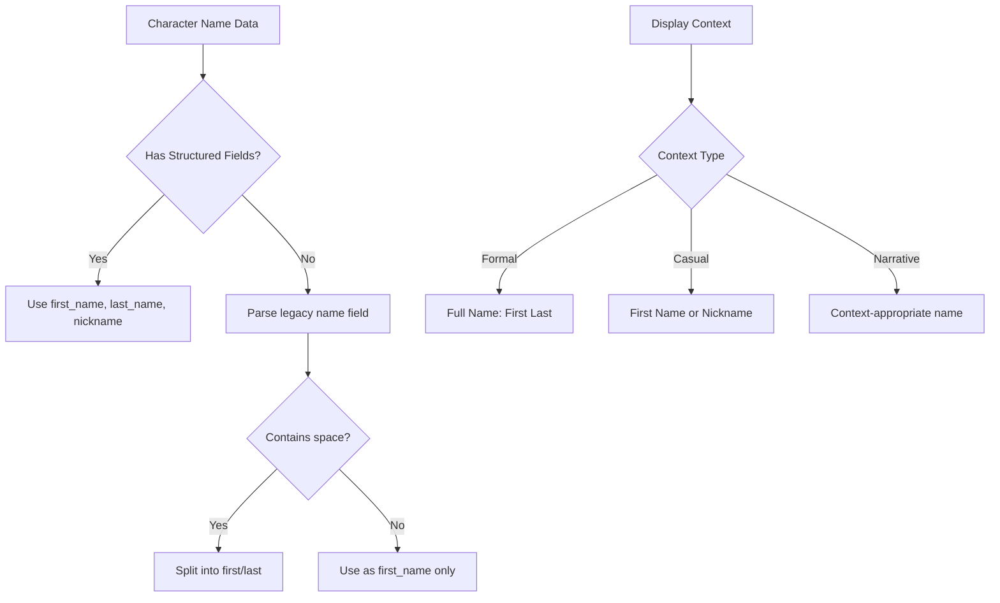

# Character Names Split Plan

## Overview

This document describes the design for splitting character and NPC names into
structured components (first name, last name, nickname). The goal is to enable
more flexible name handling, better sorting, and improved narrative generation
with proper name usage.

## Problem Statement

### Current Issues

1. **Monolithic Name Field**: The current schema uses a single `name` field
   that combines first name, last name, and sometimes titles or epithets.

2. **Inconsistent Nickname Handling**: The `nickname` field exists but is
   separate from the main name, making it unclear how names should be displayed
   in different contexts.

3. **Sorting and Display Limitations**: Without structured name components,
   sorting by last name or displaying "First Last" format requires string
   parsing that may fail for complex names.

4. **Narrative Inconsistency**: Story generation may use full names when
   first names would be more natural, or vice versa.

### Evidence from Codebase

| File | Current Name Format | Issue |
|------|---------------------|-------|
| `aragorn.json` | `"name": "Aragorn"` | No last name field |
| `frodo.json` | `"name": "Frodo Baggins"` | Combined first/last |
| `gandalf.json` | `"name": "Gandalf the Grey"` | Title in name field |
| `butterbur.json` | `"name": "Barliman Butterbur"` | Combined first/last |
| `character_validator.py` | `name: str` required | Single string only |

---

## Proposed Solution

### High-Level Approach

1. **Structured Name Schema**: Add `first_name`, `last_name`, and `nickname`
   as proper fields
2. **Backward Compatibility**: Support both legacy `name` string and new
   structured fields
3. **Name Resolution Logic**: Provide helper functions to get display names
   in various formats
4. **Migration Path**: Script to split existing names into components

### Name Schema Design



---

## Implementation Details

### 1. New Name Schema

Update character JSON structure:

```json
{
  "name": "Frodo Baggins",
  "first_name": "Frodo",
  "last_name": "Baggins",
  "nickname": null,
  "title": null,
  "epithet": "The Ring-bearer"
}
```

Example with all fields:

```json
{
  "name": "Aragorn",
  "first_name": "Aragorn",
  "last_name": null,
  "nickname": "Strider",
  "title": "King of Gondor",
  "epithet": "The Dúnadan"
}
```

Example with epithet in name:

```json
{
  "name": "Gandalf the Grey",
  "first_name": "Gandalf",
  "last_name": null,
  "nickname": null,
  "title": null,
  "epithet": "the Grey"
}
```

### 2. Name Field Definitions

| Field | Type | Required | Description | Example |
|-------|------|----------|-------------|---------|
| `name` | string | Yes | Full display name - legacy compatibility | "Frodo Baggins" |
| `first_name` | string | No | Given name | "Frodo" |
| `last_name` | string | No | Family name | "Baggins" |
| `nickname` | string | No | Common alias or nickname | "Strider" |
| `title` | string | No | Formal title | "King of Gondor" |
| `epithet` | string | No | Descriptive phrase | "the Grey" |

### 3. CharacterProfile Updates

Update `src/characters/consultants/character_profile.py`:

```python
@dataclass
class CharacterName:
    """Structured name components for a character."""
    full_name: str                    # The complete display name
    first_name: Optional[str] = None
    last_name: Optional[str] = None
    nickname: Optional[str] = None
    title: Optional[str] = None
    epithet: Optional[str] = None

    @classmethod
    def from_dict(cls, data: Dict[str, Any]) -> 'CharacterName':
        """Create CharacterName from JSON data with fallback parsing."""
        full_name = data.get("name", "")

        # Use structured fields if available
        if "first_name" in data or "last_name" in data:
            return cls(
                full_name=full_name,
                first_name=data.get("first_name"),
                last_name=data.get("last_name"),
                nickname=data.get("nickname"),
                title=data.get("title"),
                epithet=data.get("epithet")
            )

        # Fallback: parse from full name
        return cls.from_full_name(full_name, data.get("nickname"))

    @classmethod
    def from_full_name(
        cls,
        full_name: str,
        nickname: Optional[str] = None
    ) -> 'CharacterName':
        """Parse a full name string into components."""
        # Handle epithets like "the Grey", "the Dúnadan"
        epithet = None
        if " the " in full_name.lower():
            parts = full_name.split(" the ", 1)
            name_part = parts[0].strip()
            epithet = "the " + parts[1].strip()
            full_name = name_part

        # Split remaining name
        parts = full_name.split(None, 1)
        first_name = parts[0] if parts else full_name
        last_name = parts[1] if len(parts) > 1 else None

        return cls(
            full_name=full_name,
            first_name=first_name,
            last_name=last_name,
            nickname=nickname,
            epithet=epithet
        )

    @property
    def formal_name(self) -> str:
        """Get formal name with title: 'King Aragorn' or 'Frodo Baggins'."""
        if self.title:
            return f"{self.title} {self.first_name}"
        if self.first_name and self.last_name:
            return f"{self.first_name} {self.last_name}"
        return self.full_name

    @property
    def casual_name(self) -> str:
        """Get casual name: nickname if available, else first name."""
        return self.nickname or self.first_name or self.full_name

    @property
    def short_name(self) -> str:
        """Get shortest reasonable name for dialogue tags."""
        return self.nickname or self.first_name or self.full_name

    @property
    def sort_key(self) -> str:
        """Get name for alphabetical sorting by last name."""
        if self.last_name:
            return f"{self.last_name}, {self.first_name}"
        return self.first_name or self.full_name

    def get_name_for_context(self, context: str) -> str:
        """Get appropriate name for a narrative context.

        Args:
            context: One of 'formal', 'casual', 'dialogue', 'narrative'

        Returns:
            Appropriate name for the context
        """
        context_map = {
            "formal": self.formal_name,
            "casual": self.casual_name,
            "dialogue": self.short_name,
            "narrative": self.full_name,
            "sort": self.sort_key
        }
        return context_map.get(context, self.full_name)


class CharacterProfile:
    # ... existing fields ...
    name: str                          # Legacy full name
    name_components: CharacterName     # Structured name

    def __post_init__(self):
        # Initialize name components from data
        if not hasattr(self, 'name_components') or self.name_components is None:
            self.name_components = CharacterName.from_dict({
                "name": self.name,
                "nickname": getattr(self, 'nickname', None)
            })

    def get_display_name(self, context: str = "narrative") -> str:
        """Get name formatted for display context.

        Args:
            context: Display context - formal, casual, dialogue, narrative

        Returns:
            Appropriately formatted name
        """
        return self.name_components.get_name_for_context(context)
```

### 4. NPC Name Updates

Update `src/npcs/npc_profile.py` or equivalent:

```python
@dataclass
class NPCName:
    """Structured name for NPCs."""
    full_name: str
    first_name: Optional[str] = None
    last_name: Optional[str] = None
    nickname: Optional[str] = None
    occupation_title: Optional[str] = None  # e.g., "Innkeeper"

    @property
    def introduction(self) -> str:
        """Get name with occupation: 'Barliman Butterbur, the innkeeper'."""
        parts = [self.full_name]
        if self.occupation_title:
            parts.append(f", the {self.occupation_title}")
        return "".join(parts)
```

### 5. Validator Updates

Update `src/validation/character_validator.py`:

```python
def _validate_name_fields(data: Dict[str, Any], file_prefix: str) -> List[str]:
    """Validate name field structure and consistency."""
    errors = []

    # name field is required
    if "name" not in data:
        errors.append(f"{file_prefix}Missing required field: 'name'")
        return errors

    if not isinstance(data["name"], str):
        errors.append(f"{file_prefix}Field 'name' must be a string")
        return errors

    # Optional structured name fields
    optional_name_fields = {
        "first_name": str,
        "last_name": str,
        "nickname": (str, type(None)),
        "title": str,
        "epithet": str
    }

    for field, expected_type in optional_name_fields.items():
        if field in data:
            if not isinstance(data[field], expected_type):
                type_name = get_type_name(expected_type)
                errors.append(
                    f"{file_prefix}Field '{field}' should be {type_name}, "
                    f"got {type(data[field]).__name__}"
                )

    # Validate consistency: if first_name is set, it should match name start
    if "first_name" in data and data["first_name"]:
        if not data["name"].startswith(data["first_name"]):
            errors.append(
                f"{file_prefix}Field 'first_name' should be the start of 'name'. "
                f"first_name='{data['first_name']}', name='{data['name']}'"
            )

    return errors
```

### 6. Name Display Helper

Create `src/utils/name_utils.py`:

```python
"""Name formatting utilities for characters and NPCs."""

from typing import Optional, Dict, Any, List
from dataclasses import dataclass


def format_character_list(
    characters: List[Dict[str, Any]],
    format_type: str = "full"
) -> str:
    """Format a list of characters for display.

    Args:
        characters: List of character dictionaries
        format_type: One of 'full', 'short', 'sorted'

    Returns:
        Formatted string of character names
    """
    if format_type == "sorted":
        # Sort by last name
        def sort_key(char):
            last = char.get("last_name", "")
            first = char.get("first_name", char.get("name", ""))
            return f"{last}, {first}" if last else first

        sorted_chars = sorted(characters, key=sort_key)
        return ", ".join(c.get("name", "Unknown") for c in sorted_chars)

    if format_type == "short":
        return ", ".join(
            c.get("nickname") or c.get("first_name") or c.get("name", "Unknown")
            for c in characters
        )

    # Full format
    return ", ".join(c.get("name", "Unknown") for c in characters)


def get_name_for_dialogue(character: Dict[str, Any]) -> str:
    """Get the name to use in dialogue tags.

    Prefers nickname for characters who commonly use one.
    """
    return (
        character.get("nickname") or
        character.get("first_name") or
        character.get("name", "Unknown")
    )


def get_formal_introduction(character: Dict[str, Any]) -> str:
    """Get formal introduction with title if available."""
    parts = []

    if character.get("title"):
        parts.append(character["title"])

    parts.append(character.get("name", "Unknown"))

    if character.get("epithet"):
        parts.append(character["epithet"])

    return " ".join(parts)
```

---

## Affected Files

| File | Changes Required |
|------|-----------------|
| `src/characters/consultants/character_profile.py` | Add CharacterName dataclass, update profile |
| `src/validation/character_validator.py` | Add name field validation |
| `src/utils/name_utils.py` | Create new name formatting utilities |
| `src/utils/character_profile_utils.py` | Update to use structured names |
| `src/npcs/npc_profile.py` | Add NPCName dataclass |
| `src/validation/npc_validator.py` | Add NPC name field validation |
| `src/stories/story_ai_generator.py` | Use context-appropriate names |
| `src/cli/cli_character_manager.py` | Update character display |
| `game_data/characters/*.json` | Migrate to structured names |
| `game_data/npcs/*.json` | Migrate to structured names |
| `tests/characters/test_character_profile.py` | Add name component tests |
| `tests/utils/test_name_utils.py` | Create new test file |

---

## Testing Strategy

### Unit Tests

1. **CharacterName Tests**
   - Parse full name into components
   - Handle epithets correctly
   - Return appropriate names for contexts
   - Sort key generation

2. **Name Utils Tests**
   - Format character lists
   - Dialogue name selection
   - Formal introduction generation

3. **Validator Tests**
   - Valid structured names pass
   - Inconsistent names flagged
   - Legacy names still work

### Integration Tests

1. Load character with structured names
2. Generate story with context-appropriate name usage
3. Sort character list by last name
4. Display character in various CLI contexts

### Test Data

Update test characters with structured names:

```json
{
  "name": "Frodo Baggins",
  "first_name": "Frodo",
  "last_name": "Baggins",
  "nickname": null
}
```

```json
{
  "name": "Aragorn",
  "first_name": "Aragorn",
  "last_name": null,
  "nickname": "Strider",
  "title": "King of Gondor",
  "epithet": "The Dúnadan"
}
```

---

## Migration Path

### Phase 1: Add Fields

1. Add optional `first_name`, `last_name`, `title`, `epithet` fields
2. Keep `name` as required for backward compatibility
3. Add `CharacterName.from_dict()` to parse both formats

### Phase 2: Migration Script

Create `scripts/migrate_character_names.py`:

```python
"""Migrate character files to structured name format."""

import json
import re
from pathlib import Path
from typing import Dict, Any, Tuple, Optional


def parse_name(full_name: str) -> Tuple[str, Optional[str], Optional[str]]:
    """Parse a full name into components.

    Returns:
        Tuple of (first_name, last_name, epithet)
    """
    # Handle epithets like "the Grey"
    epithet = None
    if " the " in full_name.lower():
        parts = re.split(r"\s+the\s+", full_name, 1, flags=re.IGNORECASE)
        name_part = parts[0].strip()
        epithet = "the " + parts[1].strip()
        full_name = name_part

    # Split into first and last
    parts = full_name.split(None, 1)
    first_name = parts[0] if parts else full_name
    last_name = parts[1] if len(parts) > 1 else None

    return first_name, last_name, epithet


def migrate_character_file(filepath: Path) -> bool:
    """Add structured name fields to character file.

    Returns:
        True if file was modified, False if already migrated
    """
    with open(filepath, 'r', encoding='utf-8') as f:
        data = json.load(f)

    # Skip if already has structured fields
    if "first_name" in data:
        return False

    # Parse name
    full_name = data.get("name", "")
    first_name, last_name, epithet = parse_name(full_name)

    # Add structured fields
    data["first_name"] = first_name
    if last_name:
        data["last_name"] = last_name
    if epithet:
        data["epithet"] = epithet

    # Write back
    with open(filepath, 'w', encoding='utf-8') as f:
        json.dump(data, f, indent=2)

    print(f"  Migrated: {filepath.name}")
    return True


def migrate_all_characters(characters_dir: str = "game_data/characters"):
    """Migrate all character files in directory."""
    char_path = Path(characters_dir)

    if not char_path.exists():
        print(f"Directory not found: {char_path}")
        return

    migrated = 0
    skipped = 0

    for json_file in char_path.glob("*.json"):
        if ".example" in json_file.name:
            continue

        if migrate_character_file(json_file):
            migrated += 1
        else:
            skipped += 1

    print(f"\nMigration complete: {migrated} migrated, {skipped} skipped")


if __name__ == "__main__":
    migrate_all_characters()
```

### Phase 3: Update Usage

1. Update story generation to use context-appropriate names
2. Update CLI displays to use structured names
3. Update documentation with new field examples

---

## Dependencies

### Required Before This Work

- None - this is a standalone enhancement

### Works Well With

- **Multi-class Support Plan** - Can be implemented together
- **Character Relationship Mapping Plan** - Benefits from structured names

### Enables Future Work

- Name localization support
- Cultural naming conventions
- Name-based NPC generation

---

## Risks and Mitigations

| Risk | Impact | Mitigation |
|------|--------|------------|
| Breaking existing name references | High | Keep `name` field, add new fields |
| Complex name parsing errors | Medium | Manual review of migrated files |
| Inconsistent name usage in stories | Low | Clear context guidelines |
| NPC name migration complexity | Low | Separate NPC migration script |

---

## Success Criteria

1. All characters have structured name fields
2. Legacy `name` field continues to work
3. Context-appropriate name display in CLI
4. Story generation uses correct name forms
5. All tests pass with 10.00/10 pylint score
6. Migration script successfully updates all files
