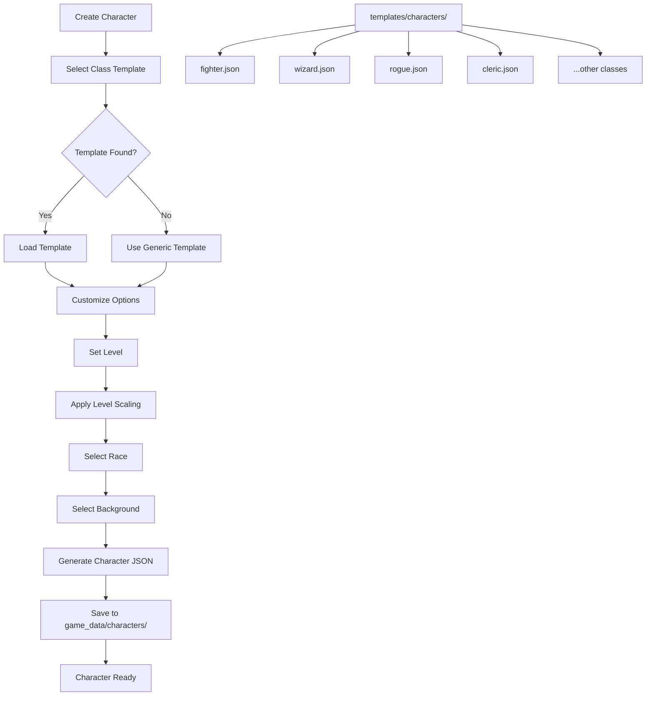
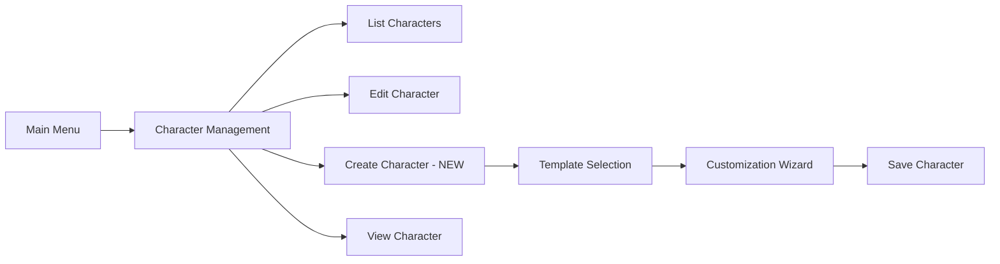

# Character Templates Plan

## Overview

This document describes the design for character templates that provide
pre-configured character archetypes for quick character creation. The goal is
to help players and DMs quickly create new characters with appropriate stats,
equipment, spells, and abilities based on D&D 5e class archetypes.

## Problem Statement

### Current Issues

1. **Manual Character Creation**: Every new character requires manual entry of
   all stats, equipment, spells, and abilities - a time-consuming process.

2. **Limited Example**: Only one generic example file exists
   `class.example.json` with placeholder values that provide no real guidance.

3. **Knowledge Gap**: New players may not know appropriate ability score
   distributions, starting equipment, or class features for different classes.

4. **Inconsistent Quality**: Manually created characters may have unbalanced
   stats or missing class features.

### Evidence from Codebase

| Current State | Issue |
|---------------|-------|
| `game_data/characters/class.example.json` | Generic template with zeros |
| No class-specific templates | No guidance for different classes |
| Manual data entry | Error-prone and time-consuming |
| No level scaling | Cannot quickly create higher-level characters |

---

## Proposed Solution

### High-Level Approach

1. **Template Directory**: Create `templates/characters/` for template storage
2. **Class Templates**: Define templates for each D&D 5e class
3. **Template Schema**: JSON schema for template definition
4. **Character Creation Flow**: CLI wizard using templates
5. **Level Scaling**: Automatic calculation of stats based on target level

### Template Architecture



---

## Implementation Details

### 1. Template Types

Define templates for all core D&D 5e classes:

| Template Type | Primary Ability | Hit Die | Key Features |
|---------------|-----------------|---------|--------------|
| `fighter` | Strength/Dexterity | d10 | Fighting Style, Second Wind |
| `wizard` | Intelligence | d6 | Arcane Recovery, Spellcasting |
| `rogue` | Dexterity | d8 | Sneak Attack, Cunning Action |
| `cleric` | Wisdom | d8 | Divine Domain, Spellcasting |
| `ranger` | Dexterity/Wisdom | d10 | Favored Enemy, Natural Explorer |
| `paladin` | Strength/Charisma | d10 | Divine Smite, Lay on Hands |
| `barbarian` | Strength | d12 | Rage, Unarmored Defense |
| `bard` | Charisma | d8 | Bardic Inspiration, Spellcasting |
| `druid` | Wisdom | d8 | Wild Shape, Spellcasting |
| `monk` | Dexterity/Wisdom | d8 | Martial Arts, Ki |
| `sorcerer` | Charisma | d6 | Sorcerous Origin, Spellcasting |
| `warlock` | Charisma | d8 | Eldritch Invocations, Pact Magic |

### 2. Template Schema

Create `templates/characters/schema.json`:

```json
{
  "$schema": "http://json-schema.org/draft-07/schema#",
  "title": "Character Template",
  "type": "object",
  "required": ["name", "class", "hit_die", "primary_abilities"],
  "properties": {
    "name": {
      "type": "string",
      "description": "Template display name"
    },
    "class": {
      "type": "string",
      "description": "D&D class this template represents"
    },
    "description": {
      "type": "string",
      "description": "Brief description of this class archetype"
    },
    "hit_die": {
      "type": "integer",
      "description": "Hit die type - 6, 8, 10, or 12"
    },
    "primary_abilities": {
      "type": "array",
      "items": {"type": "string"},
      "description": "Primary abilities for this class"
    },
    "saving_throws": {
      "type": "array",
      "items": {"type": "string"},
      "description": "Proficient saving throws"
    },
    "base_ability_scores": {
      "type": "object",
      "description": "Recommended base ability scores using standard array",
      "properties": {
        "strength": {"type": "integer"},
        "dexterity": {"type": "integer"},
        "constitution": {"type": "integer"},
        "intelligence": {"type": "integer"},
        "wisdom": {"type": "integer"},
        "charisma": {"type": "integer"}
      }
    },
    "skill_options": {
      "type": "object",
      "description": "Available skills and number to choose",
      "properties": {
        "choose": {"type": "integer"},
        "from": {"type": "array", "items": {"type": "string"}}
      }
    },
    "starting_equipment": {
      "type": "object",
      "description": "Default starting equipment",
      "properties": {
        "weapons": {"type": "array", "items": {"type": "string")},
        "armor": {"type": "array", "items": {"type": "string")},
        "items": {"type": "array", "items": {"type": "string")},
        "gold": {"type": "integer"}
      }
    },
    "class_features": {
      "type": "object",
      "description": "Class features gained at each level",
      "patternProperties": {
        "^[0-9]+$": {
          "type": "array",
          "items": {"type": "string"}
        }
      }
    },
    "spellcasting": {
      "type": "object",
      "description": "Spellcasting information if applicable",
      "properties": {
        "ability": {"type": "string"},
        "type": {"type": "string", "enum": ["full", "half", "pact"]},
        "cantrips_known": {"type": "object"},
        "spells_known": {"type": "object"},
        "spell_slots": {"type": "object"}
      }
    },
    "subclass_options": {
      "type": "object",
      "description": "Available subclasses by level",
      "properties": {
        "level": {"type": "integer"},
        "options": {"type": "array", "items": {"type": "string"}}
      }
    },
    "recommended_backgrounds": {
      "type": "array",
      "items": {"type": "string"},
      "description": "Thematically appropriate backgrounds"
    },
    "recommended_races": {
      "type": "array",
      "items": {"type": "string"},
      "description": "Thematically appropriate races"
    }
  }
}
```

### 3. Example Template Files

Create `templates/characters/fighter.json`:

```json
{
  "name": "Fighter",
  "class": "Fighter",
  "description": "A master of martial combat, skilled with a variety of weapons and armor",
  "hit_die": 10,
  "primary_abilities": ["Strength", "Dexterity"],
  "saving_throws": ["Strength", "Constitution"],
  "base_ability_scores": {
    "strength": 16,
    "dexterity": 14,
    "constitution": 15,
    "intelligence": 10,
    "wisdom": 12,
    "charisma": 8
  },
  "skill_options": {
    "choose": 2,
    "from": [
      "Acrobatics",
      "Animal Handling",
      "Athletics",
      "History",
      "Insight",
      "Intimidation",
      "Perception",
      "Survival"
    ]
  },
  "starting_equipment": {
    "weapons": ["Longsword", "Shield", "Handaxe"],
    "armor": ["Chain Mail"],
    "items": ["Explorer's Pack"],
    "gold": 10
  },
  "class_features": {
    "1": ["Fighting Style", "Second Wind"],
    "2": ["Action Surge"],
    "3": ["Martial Archetype"],
    "4": ["Ability Score Improvement"],
    "5": ["Extra Attack"],
    "6": ["Ability Score Improvement"],
    "7": ["Martial Archetype Feature"],
    "8": ["Ability Score Improvement"],
    "9": ["Indomitable"],
    "10": ["Martial Archetype Feature"],
    "11": ["Extra Attack (2)"],
    "12": ["Ability Score Improvement"],
    "13": ["Indomitable (2)"],
    "14": ["Ability Score Improvement"],
    "15": ["Martial Archetype Feature"],
    "16": ["Ability Score Improvement"],
    "17": ["Action Surge (2)", "Indomitable (3)"],
    "18": ["Martial Archetype Feature"],
    "19": ["Ability Score Improvement"],
    "20": ["Extra Attack (3)"]
  },
  "subclass_options": {
    "level": 3,
    "options": [
      "Champion",
      "Battle Master",
      "Eldritch Knight",
      "Cavalier",
      "Samurai",
      "Arcane Archer"
    ]
  },
  "recommended_backgrounds": [
    "Soldier",
    "Mercenary Veteran",
    "Knight",
    "Gladiator",
    "Folk Hero"
  ],
  "recommended_races": [
    "Human",
    "Dwarf",
    "Half-Orc",
    "Goliath",
    "Dragonborn"
  ]
}
```

Create `templates/characters/wizard.json`:

```json
{
  "name": "Wizard",
  "class": "Wizard",
  "description": "A scholarly magic-user capable of manipulating the structures of reality",
  "hit_die": 6,
  "primary_abilities": ["Intelligence"],
  "saving_throws": ["Intelligence", "Wisdom"],
  "base_ability_scores": {
    "strength": 8,
    "dexterity": 14,
    "constitution": 14,
    "intelligence": 16,
    "wisdom": 12,
    "charisma": 10
  },
  "skill_options": {
    "choose": 2,
    "from": [
      "Arcana",
      "History",
      "Insight",
      "Investigation",
      "Medicine",
      "Religion"
    ]
  },
  "starting_equipment": {
    "weapons": ["Quarterstaff", "Dagger"],
    "armor": [],
    "items": ["Spellbook", "Arcane Focus", "Scholar's Pack"],
    "gold": 10
  },
  "class_features": {
    "1": ["Arcane Recovery", "Spellcasting"],
    "2": ["Arcane Tradition"],
    "4": ["Ability Score Improvement"],
    "6": ["Arcane Tradition Feature"],
    "8": ["Ability Score Improvement"],
    "10": ["Arcane Tradition Feature"],
    "12": ["Ability Score Improvement"],
    "14": ["Arcane Tradition Feature"],
    "16": ["Ability Score Improvement"],
    "18": ["Spell Mastery"],
    "19": ["Ability Score Improvement"],
    "20": ["Signature Spells"]
  },
  "spellcasting": {
    "ability": "Intelligence",
    "type": "full",
    "cantrips_known": {
      "1": 3,
      "4": 4,
      "10": 5
    },
    "spells_known": {
      "1": 6,
      "growth": "2 per level"
    },
    "spell_slots": {
      "1": {"1": 2},
      "2": {"1": 3},
      "3": {"1": 4, "2": 2},
      "4": {"1": 4, "2": 3},
      "5": {"1": 4, "2": 3, "3": 2},
      "6": {"1": 4, "2": 3, "3": 3},
      "7": {"1": 4, "2": 3, "3": 3, "4": 1},
      "8": {"1": 4, "2": 3, "3": 3, "4": 2},
      "9": {"1": 4, "2": 3, "3": 3, "4": 3, "5": 1},
      "10": {"1": 4, "2": 3, "3": 3, "4": 3, "5": 2},
      "11": {"1": 4, "2": 3, "3": 3, "4": 3, "5": 2, "6": 1},
      "12": {"1": 4, "2": 3, "3": 3, "4": 3, "5": 2, "6": 1},
      "13": {"1": 4, "2": 3, "3": 3, "4": 3, "5": 2, "6": 1, "7": 1},
      "14": {"1": 4, "2": 3, "3": 3, "4": 3, "5": 2, "6": 1, "7": 1},
      "15": {"1": 4, "2": 3, "3": 3, "4": 3, "5": 2, "6": 1, "7": 1, "8": 1},
      "16": {"1": 4, "2": 3, "3": 3, "4": 3, "5": 2, "6": 1, "7": 1, "8": 1},
      "17": {"1": 4, "2": 3, "3": 3, "4": 3, "5": 2, "6": 1, "7": 1, "8": 1, "9": 1},
      "18": {"1": 4, "2": 3, "3": 3, "4": 3, "5": 2, "6": 1, "7": 1, "8": 1, "9": 1},
      "19": {"1": 4, "2": 3, "3": 3, "4": 3, "5": 2, "6": 2, "7": 1, "8": 1, "9": 1},
      "20": {"1": 4, "2": 3, "3": 3, "4": 3, "5": 2, "6": 2, "7": 2, "8": 1, "9": 1}
    }
  },
  "subclass_options": {
    "level": 2,
    "options": [
      "School of Evocation",
      "School of Abjuration",
      "School of Divination",
      "School of Conjuration",
      "School of Enchantment",
      "School of Illusion",
      "School of Necromancy",
      "School of Transmutation"
    ]
  },
  "recommended_backgrounds": [
    "Sage",
    "Scholar",
    "Cloistered Scholar",
    "Sage",
    "Acolyte"
  ],
  "recommended_races": [
    "Human",
    "Elf",
    "Gnome",
    "Tiefling",
    "Half-Elf"
  ]
}
```

Create `templates/characters/rogue.json`:

```json
{
  "name": "Rogue",
  "class": "Rogue",
  "description": "A scoundrel who uses stealth and trickery to overcome obstacles",
  "hit_die": 8,
  "primary_abilities": ["Dexterity"],
  "saving_throws": ["Dexterity", "Intelligence"],
  "base_ability_scores": {
    "strength": 8,
    "dexterity": 16,
    "constitution": 14,
    "intelligence": 14,
    "wisdom": 10,
    "charisma": 12
  },
  "skill_options": {
    "choose": 4,
    "from": [
      "Acrobatics",
      "Athletics",
      "Deception",
      "Insight",
      "Intimidation",
      "Investigation",
      "Perception",
      "Performance",
      "Persuasion",
      "Sleight of Hand",
      "Stealth"
    ]
  },
  "starting_equipment": {
    "weapons": ["Rapier", "Shortbow", "Dagger", "Dagger"],
    "armor": ["Leather Armor"],
    "items": ["Thieves' Tools", "Burglar's Pack"],
    "gold": 10
  },
  "class_features": {
    "1": ["Expertise", "Sneak Attack", "Thieves' Cant"],
    "2": ["Cunning Action"],
    "3": ["Roguish Archetype"],
    "4": ["Ability Score Improvement"],
    "5": ["Uncanny Dodge"],
    "6": ["Expertise"],
    "7": ["Evasion"],
    "8": ["Ability Score Improvement"],
    "9": ["Roguish Archetype Feature"],
    "10": ["Ability Score Improvement"],
    "11": ["Reliable Talent"],
    "12": ["Ability Score Improvement"],
    "13": ["Roguish Archetype Feature"],
    "14": ["Blindsense"],
    "15": ["Slippery Mind"],
    "16": ["Ability Score Improvement"],
    "17": ["Roguish Archetype Feature"],
    "18": ["Elusive"],
    "19": ["Ability Score Improvement"],
    "20": ["Stroke of Luck"]
  },
  "subclass_options": {
    "level": 3,
    "options": [
      "Thief",
      "Assassin",
      "Arcane Trickster",
      "Swashbuckler",
      "Mastermind",
      "Scout"
    ]
  },
  "recommended_backgrounds": [
    "Criminal",
    "Urchin",
    "Spy",
    "Charlatan",
    "Folk Hero"
  ],
  "recommended_races": [
    "Human",
    "Halfling",
    "Elf",
    "Half-Elf",
    "Tiefling"
  ]
}
```

Create `templates/characters/cleric.json`:

```json
{
  "name": "Cleric",
  "class": "Cleric",
  "description": "A priestly champion who wields divine magic in service of a higher power",
  "hit_die": 8,
  "primary_abilities": ["Wisdom"],
  "saving_throws": ["Wisdom", "Charisma"],
  "base_ability_scores": {
    "strength": 14,
    "dexterity": 10,
    "constitution": 14,
    "intelligence": 10,
    "wisdom": 16,
    "charisma": 12
  },
  "skill_options": {
    "choose": 2,
    "from": [
      "History",
      "Insight",
      "Medicine",
      "Persuasion",
      "Religion"
    ]
  },
  "starting_equipment": {
    "weapons": ["Mace", "Warhammer"],
    "armor": ["Scale Mail", "Shield", "Holy Symbol"],
    "items": ["Priest's Pack"],
    "gold": 15
  },
  "class_features": {
    "1": ["Spellcasting", "Divine Domain"],
    "2": ["Channel Divinity"],
    "4": ["Ability Score Improvement"],
    "5": ["Destroy Undead"],
    "6": ["Channel Divinity", "Divine Domain Feature"],
    "8": ["Ability Score Improvement", "Divine Domain Feature"],
    "10": ["Divine Intervention"],
    "11": ["Destroy Undead (CR 2)"],
    "12": ["Ability Score Improvement"],
    "14": ["Destroy Undead (CR 3)"],
    "16": ["Ability Score Improvement"],
    "17": ["Destroy Undead (CR 4)"],
    "18": ["Channel Divinity (3/rest)"],
    "19": ["Ability Score Improvement"],
    "20": ["Divine Intervention Improvement"]
  },
  "spellcasting": {
    "ability": "Wisdom",
    "type": "full",
    "cantrips_known": {
      "1": 3,
      "4": 4,
      "10": 5
    },
    "spell_slots": {
      "1": {"1": 2},
      "2": {"1": 3},
      "3": {"1": 4, "2": 2},
      "4": {"1": 4, "2": 3},
      "5": {"1": 4, "2": 3, "3": 2},
      "6": {"1": 4, "2": 3, "3": 3},
      "7": {"1": 4, "2": 3, "3": 3, "4": 1},
      "8": {"1": 4, "2": 3, "3": 3, "4": 2},
      "9": {"1": 4, "2": 3, "3": 3, "4": 3, "5": 1},
      "10": {"1": 4, "2": 3, "3": 3, "4": 3, "5": 2},
      "11": {"1": 4, "2": 3, "3": 3, "4": 3, "5": 2, "6": 1},
      "12": {"1": 4, "2": 3, "3": 3, "4": 3, "5": 2, "6": 1},
      "13": {"1": 4, "2": 3, "3": 3, "4": 3, "5": 2, "6": 1, "7": 1},
      "14": {"1": 4, "2": 3, "3": 3, "4": 3, "5": 2, "6": 1, "7": 1},
      "15": {"1": 4, "2": 3, "3": 3, "4": 3, "5": 2, "6": 1, "7": 1, "8": 1},
      "16": {"1": 4, "2": 3, "3": 3, "4": 3, "5": 2, "6": 1, "7": 1, "8": 1},
      "17": {"1": 4, "2": 3, "3": 3, "4": 3, "5": 2, "6": 1, "7": 1, "8": 1, "9": 1},
      "18": {"1": 4, "2": 3, "3": 3, "4": 3, "5": 2, "6": 1, "7": 1, "8": 1, "9": 1},
      "19": {"1": 4, "2": 3, "3": 3, "4": 3, "5": 2, "6": 2, "7": 1, "8": 1, "9": 1},
      "20": {"1": 4, "2": 3, "3": 3, "4": 3, "5": 2, "6": 2, "7": 2, "8": 1, "9": 1}
    }
  },
  "subclass_options": {
    "level": 1,
    "options": [
      "Life Domain",
      "Light Domain",
      "Nature Domain",
      "Tempest Domain",
      "Trickery Domain",
      "War Domain",
      "Knowledge Domain",
      "Death Domain",
      "Arcana Domain",
      "Grave Domain"
    ]
  },
  "recommended_backgrounds": [
    "Acolyte",
    "Folk Hero",
    "Hermit",
    "Sage",
    "Outlander"
  ],
  "recommended_races": [
    "Human",
    "Dwarf",
    "Elf",
    "Half-Elf",
    "Aasimar"
  ]
}
```

---

### 4. Level Scaling System

#### Automatic Calculations

When creating a character at a level higher than 1, the system should
automatically calculate:

| Attribute | Calculation |
|-----------|-------------|
| Hit Points | Base HP + Constitution modifier per level + hit die average |
| Proficiency Bonus | 2 + floor((level - 1) / 4) |
| Ability Score Improvements | At levels 4, 8, 12, 16, 19 if not used for feats |
| Class Features | All features up to and including target level |
| Spell Slots | Based on class spell slot progression table |

#### Level Scaling Implementation

```python
# Level scaling constants
PROFICIENCY_BONUS_BY_LEVEL = {
    1: 2, 2: 2, 3: 2, 4: 2,
    5: 3, 6: 3, 7: 3, 8: 3,
    9: 4, 10: 4, 11: 4, 12: 4,
    13: 5, 14: 5, 15: 5, 16: 5,
    17: 6, 18: 6, 19: 6, 20: 6
}

ASI_LEVELS = [4, 8, 12, 16, 19]

def calculate_hit_points(hit_die: int, constitution_mod: int, level: int) -> int:
    """Calculate hit points for a given level."""
    # First level gets max hit die
    hp = hit_die + constitution_mod
    # Subsequent levels get average (rounded up) + con mod
    average_hit_die = (hit_die // 2) + 1
    hp += (average_hit_die + constitution_mod) * (level - 1)
    return max(hp, level)  # Minimum 1 HP per level
```

---

### 5. CLI Workflow

#### Character Creation Menu

```
CREATE NEW CHARACTER
--------------------
1. Select Class Template
   > Fighter
   > Wizard
   > Rogue
   > Cleric
   > Ranger
   > Paladin
   > Barbarian
   > Bard
   > Druid
   > Monk
   > Sorcerer
   > Warlock

2. Set Character Name: [input]

3. Select Race:
   > Human (+1 to all abilities)
   > Elf (+2 DEX)
   > Dwarf (+2 CON)
   > Halfling (+2 DEX)
   > Dragonborn (+2 STR, +1 CHA)
   > Gnome (+2 INT)
   > Half-Elf (+2 CHA, +1 to two others)
   > Half-Orc (+2 STR, +1 CON)
   > Tiefling (+2 CHA)
   > Custom...

4. Set Level (1-20): [input]

5. Select Background:
   > [Recommended backgrounds for class]
   > All backgrounds...
   > Custom...

6. Select Subclass (if applicable):
   > [Available subclasses for class]

7. Customize Ability Scores?
   > Use Standard Array (15, 14, 13, 12, 10, 8)
   > Point Buy (27 points)
   > Roll (4d6 drop lowest)
   > Custom input

8. Select Skills:
   > [Available skills, select N based on class]

9. Starting Equipment:
   > Use default starting equipment
   > Use starting gold (roll for gold)
   > Custom selection

10. Review and Confirm:
    [Display summary of all choices]
    > Create Character
    > Go back to modify
    > Cancel
```

#### Integration with Existing CLI

The character creation flow should integrate with the existing
[`CharacterCLIManager`](src/cli/cli_character_manager.py) class:



---

### 6. Template Storage Location

#### Directory Structure

```
templates/
|-- characters/
|   |-- schema.json           # JSON schema for validation
|   |-- fighter.json          # Fighter template
|   |-- wizard.json           # Wizard template
|   |-- rogue.json            # Rogue template
|   |-- cleric.json           # Cleric template
|   |-- ranger.json           # Ranger template
|   |-- paladin.json          # Paladin template
|   |-- barbarian.json        # Barbarian template
|   |-- bard.json             # Bard template
|   |-- druid.json            # Druid template
|   |-- monk.json             # Monk template
|   |-- sorcerer.json         # Sorcerer template
|   |-- warlock.json          # Warlock template
|   |-- artificer.json        # Artificer template (optional)
|   |-- custom/               # User-created custom templates
|   |   |-- *.json
|-- story_template.md         # Existing story template
```

#### Naming Convention

- Template files: `{class_name.lower()}.json`
- Custom templates: `custom/{descriptive_name}.json`
- Schema file: `schema.json`

---

### 7. Integration Points

#### CharacterProfile Integration

The template system should integrate with the existing
[`CharacterProfile`](src/characters/consultants/character_profile.py) class:

```python
# New factory method in CharacterProfile
@classmethod
def from_template(
    cls,
    template: dict,
    name: str,
    race: str,
    level: int = 1,
    background: str = None,
    subclass: str = None,
    ability_scores: dict = None,
    skills: list = None
) -> CharacterProfile:
    """Create a CharacterProfile from a template with customizations."""
    # Implementation
```

#### Path Utils Integration

Add new utility function to [`path_utils.py`](src/utils/path_utils.py):

```python
def get_character_templates_dir() -> Path:
    """Get the path to the character templates directory."""
    return get_project_root() / "templates" / "characters"

def list_character_templates() -> list[str]:
    """List available character template names."""
    templates_dir = get_character_templates_dir()
    return [f.stem for f in templates_dir.glob("*.json") if f.stem != "schema"]
```

#### Validation Integration

Extend [`character_validator.py`](src/validation/character_validator.py) to
validate templates:

```python
def validate_character_template(template: dict, filepath: str) -> tuple[bool, list[str]]:
    """Validate a character template against the schema."""
    # Load schema
    # Validate template structure
    # Return validation results
```

---

### 8. Default Equipment, Spells, and Abilities

#### Equipment by Class

Each template includes default starting equipment based on D&D 5e SRD:

| Class | Primary Weapon | Secondary | Armor | Gold |
|-------|---------------|-----------|-------|------|
| Fighter | Longsword/Greatsword | Shield/Longbow | Chain Mail | 10gp |
| Wizard | Quarterstaff | Dagger | Robes | 10gp |
| Rogue | Rapier | Shortbow | Leather | 10gp |
| Cleric | Mace | Shield | Scale Mail | 15gp |
| Ranger | Longsword/Longbow | Two shortswords | Leather | 10gp |
| Paladin | Longsword | Shield | Chain Mail | 10gp |
| Barbarian | Greataxe/Handaxes | Javelins | None | 10gp |
| Bard | Rapier | Dagger | Leather | 10gp |
| Druid | Wooden Shield | Scimitar | Leather | 2gp |
| Monk | Quarterstaff | Dart | None | 10gp |
| Sorcerer | Light Crossbow | Dagger | None | 10gp |
| Warlock | Light Crossbow | Dagger | Leather | 10gp |

#### Spells by Class

For spellcasting classes, include recommended starting spells:

**Wizard Starting Spells (Level 1):**
- Cantrips: Fire Bolt, Light, Mage Hand
- 1st Level: Magic Missile, Shield, Sleep, Detect Magic, Charm Person, Mage Armor

**Cleric Starting Spells (Level 1):**
- Cantrips: Guidance, Sacred Flame, Toll the Dead
- 1st Level: Cure Wounds, Healing Word, Bless, Guiding Bolt (domain spells added)

**Bard Starting Spells (Level 1):**
- Cantrips: Vicious Mockery, Minor Illusion
- 1st Level: Healing Word, Faerie Fire, Thunderwave, Dissonant Whispers, Tasha's Hideous Laughter

#### Class Abilities by Level

Templates include all class features gained at each level, allowing the system
to automatically populate abilities based on selected level.

---

### 9. Testing Requirements

#### Unit Tests

Create `tests/characters/test_character_templates.py`:

| Test | Description |
|------|-------------|
| `test_load_template_valid` | Load each class template successfully |
| `test_template_schema_validation` | Validate all templates against schema |
| `test_calculate_hit_points_level_1` | HP calculation for level 1 |
| `test_calculate_hit_points_level_10` | HP calculation for level 10 |
| `test_proficiency_bonus_scaling` | Proficiency bonus at each tier |
| `test_spell_slots_wizard` | Spell slot progression for wizard |
| `test_spell_slots_cleric` | Spell slot progression for cleric |
| `test_class_features_by_level` | Features gained at each level |
| `test_create_character_from_template` | Full character creation flow |
| `test_custom_template_loading` | Load custom templates from custom/ |

#### Integration Tests

| Test | Description |
|------|-------------|
| `test_cli_character_creation` | Full CLI workflow for character creation |
| `test_character_profile_from_template` | CharacterProfile.from_template() |
| `test_save_created_character` | Save created character to game_data |
| `test_template_validation_integration` | Validate templates during loading |

#### Test Data

Use existing test characters as reference:
- [`aragorn.json`](game_data/characters/aragorn.json) - Ranger level 10
- [`frodo.json`](game_data/characters/frodo.json) - Rogue level 4
- [`gandalf.json`](game_data/characters/gandalf.json) - Wizard level 10

---

### 10. Implementation Phases

#### Phase 1: Foundation

1. Create `templates/characters/` directory structure
2. Define JSON schema for templates
3. Create templates for core 4 classes: Fighter, Wizard, Rogue, Cleric
4. Implement template loading utilities in `path_utils.py`
5. Add template validation to `character_validator.py`

#### Phase 2: Character Creation

1. Implement `CharacterProfile.from_template()` factory method
2. Create level scaling calculations
3. Build CLI character creation wizard
4. Integrate with existing `CharacterCLIManager`
5. Add "Create Character" menu option

#### Phase 3: Extended Classes

1. Create templates for remaining classes: Ranger, Paladin, Barbarian, Bard,
   Druid, Monk, Sorcerer, Warlock
2. Add spell selection for spellcasting classes
3. Implement subclass feature selection
4. Add racial bonus application

#### Phase 4: Advanced Features

1. Custom template support (user-created templates)
2. Point buy system for ability scores
3. Starting gold option with equipment selection
4. Multi-class template support (future integration with multiclass feature)
5. Template inheritance for variant archetypes

---

## File Changes Summary

### New Files

| File | Purpose |
|------|---------|
| `templates/characters/schema.json` | JSON schema for template validation |
| `templates/characters/fighter.json` | Fighter class template |
| `templates/characters/wizard.json` | Wizard class template |
| `templates/characters/rogue.json` | Rogue class template |
| `templates/characters/cleric.json` | Cleric class template |
| `templates/characters/ranger.json` | Ranger class template |
| `templates/characters/paladin.json` | Paladin class template |
| `templates/characters/barbarian.json` | Barbarian class template |
| `templates/characters/bard.json` | Bard class template |
| `templates/characters/druid.json` | Druid class template |
| `templates/characters/monk.json` | Monk class template |
| `templates/characters/sorcerer.json` | Sorcerer class template |
| `templates/characters/warlock.json` | Warlock class template |
| `src/characters/character_template.py` | Template loading and processing |
| `tests/characters/test_character_templates.py` | Unit tests for templates |

### Modified Files

| File | Changes |
|------|---------|
| `src/characters/consultants/character_profile.py` | Add `from_template()` factory method |
| `src/utils/path_utils.py` | Add `get_character_templates_dir()`, `list_character_templates()` |
| `src/validation/character_validator.py` | Add `validate_character_template()` |
| `src/cli/cli_character_manager.py` | Add character creation menu and wizard |
| `game_data/characters/class.example.json` | Update to match new template format |

---

## Success Criteria

1. **Quick Character Creation**: Users can create a level-appropriate character
   in under 2 minutes using templates.

2. **Accurate Stats**: All calculated stats (HP, proficiency, spell slots)
   match D&D 5e rules.

3. **Complete Features**: Characters created from templates have all class
   features for their level.

4. **Customization**: Users can override any template defaults during creation.

5. **Validation**: All templates pass schema validation and produce valid
   character files.

6. **Test Coverage**: All template functionality has unit tests with 100%
   coverage of new code.

---

## Future Considerations

1. **Artificer Class**: Add template for Artificer (Eberron content)

2. **Bloodhunter Class**: Add template for Bloodhunter (Critical Role content)

3. **Template Variants**: Create variant templates for different archetypes
   e.g., `fighter_archer.json`, `fighter_tank.json`

4. **AI Integration**: Use AI to suggest optimal ability scores, spells, or
   equipment based on character concept.

5. **Import/Export**: Allow importing character templates from external sources
   like D&D Beyond or Roll20.

6. **Homebrew Support**: Allow custom classes with user-defined templates.
