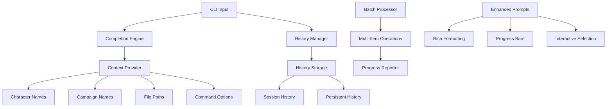

# CLI Enhancements Plan

## Overview

This document describes the design for CLI enhancements for the D&D Character
Consultant System. The goal is to improve the command-line interface with
tab completion, command history, batch operations, and an updated CLI framework.

## Problem Statement

### Current Issues

1. **No Tab Completion**: Users must type full character names, campaign names,
   and commands manually, leading to typos and frustration.

2. **No Command History**: Users cannot recall or reuse previous commands,
   making repetitive tasks tedious.

3. **No Batch Operations**: Users cannot perform operations on multiple
   characters or stories at once.

4. **Basic CLI Framework**: The current CLI lacks modern features like
   progress indicators, better formatting, and interactive prompts.

### Evidence from Codebase

| Current State | Limitation |
|---------------|------------|
| No completion system | Must type everything manually |
| No history storage | Cannot recall previous commands |
| Single-item operations | No batch processing |
| Basic click commands | Limited interactivity |

---

## Proposed Solution

### High-Level Approach

1. **Tab Completion System**: Add shell completion for commands, character
   names, campaign names, and file paths
2. **Command History Storage**: Save and recall command history across sessions
3. **Batch Operation Commands**: Add commands for bulk operations
4. **Enhanced CLI Framework**: Update to use advanced prompt toolkit features

### CLI Enhancement Architecture



---

## Implementation Details

### 1. Tab Completion System

Create `src/cli/completion.py`:

```python
"""Tab completion system for CLI."""

import os
from typing import List, Optional, Callable
from pathlib import Path

import click
from click.shell_completion import CompletionItem

from src.utils.path_utils import (
    get_characters_dir,
    get_npcs_dir,
    get_game_data_path
)


class CompletionContext:
    """Provides context for shell completion."""

    @staticmethod
    def get_character_names(
        ctx: Optional[click.Context],
        args: List[str],
        incomplete: str
    ) -> List[CompletionItem]:
        """Get character names for completion.

        Args:
            ctx: Click context
            args: Current arguments
            incomplete: Incomplete string being typed

        Returns:
            List of completion items
        """
        characters_dir = get_characters_dir()
        names = []

        if characters_dir.exists():
            for char_file in characters_dir.glob("*.json"):
                if not char_file.name.startswith("."):
                    name = char_file.stem
                    if name.lower().startswith(incomplete.lower()):
                        names.append(CompletionItem(name))

        return names

    @staticmethod
    def get_npc_names(
        ctx: Optional[click.Context],
        args: List[str],
        incomplete: str
    ) -> List[CompletionItem]:
        """Get NPC names for completion."""
        npcs_dir = get_npcs_dir()
        names = []

        if npcs_dir.exists():
            for npc_file in npcs_dir.glob("*.json"):
                if not npc_file.name.startswith("."):
                    name = npc_file.stem
                    if name.lower().startswith(incomplete.lower()):
                        names.append(CompletionItem(name))

        return names

    @staticmethod
    def get_campaign_names(
        ctx: Optional[click.Context],
        args: List[str],
        incomplete: str
    ) -> List[CompletionItem]:
        """Get campaign names for completion."""
        campaigns_dir = get_game_data_path() / "campaigns"
        names = []

        if campaigns_dir.exists():
            for campaign_dir in campaigns_dir.iterdir():
                if campaign_dir.is_dir():
                    name = campaign_dir.name
                    if name.lower().startswith(incomplete.lower()):
                        names.append(CompletionItem(name))

        return names

    @staticmethod
    def get_story_files(
        ctx: Optional[click.Context],
        args: List[str],
        incomplete: str
    ) -> List[CompletionItem]:
        """Get story files for completion."""
        # Find campaign from previous args
        campaign_name = None
        for i, arg in enumerate(args):
            if arg in ("--campaign", "-c") and i + 1 < len(args):
                campaign_name = args[i + 1]
                break

        if not campaign_name:
            return []

        campaign_dir = get_game_data_path() / "campaigns" / campaign_name
        files = []

        if campaign_dir.exists():
            for story_file in campaign_dir.glob("*.md"):
                name = story_file.name
                if name.lower().startswith(incomplete.lower()):
                    files.append(CompletionItem(name))

        return files

    @staticmethod
    def get_file_paths(
        ctx: Optional[click.Context],
        args: List[str],
        incomplete: str
    ) -> List[CompletionItem]:
        """Get file paths for completion."""
        items = []

        # Determine directory to search
        if incomplete:
            if os.path.dirname(incomplete):
                search_dir = os.path.dirname(incomplete)
                prefix = os.path.basename(incomplete)
            else:
                search_dir = "."
                prefix = incomplete
        else:
            search_dir = "."
            prefix = ""

        search_path = Path(search_dir)

        if search_path.exists():
            for item in search_path.iterdir():
                if item.name.lower().startswith(prefix.lower()):
                    if item.is_dir():
                        items.append(CompletionItem(item.name + "/"))
                    else:
                        items.append(CompletionItem(item.name))

        return items


# Custom completion decorators

def complete_characters(func: Callable) -> Callable:
    """Decorator to add character name completion."""
    return click.argument(
        "name",
        shell_complete=CompletionContext.get_character_names
    )(func)


def complete_campaigns(func: Callable) -> Callable:
    """Decorator to add campaign name completion."""
    return click.argument(
        "campaign",
        shell_complete=CompletionContext.get_campaign_names
    )(func)


def complete_npcs(func: Callable) -> Callable:
    """Decorator to add NPC name completion."""
    return click.argument(
        "name",
        shell_complete=CompletionContext.get_npc_names
    )(func)


# Shell completion setup

def setup_shell_completion() -> None:
    """Setup shell completion for the CLI."""
    # This is handled by click's shell completion system
    # Users need to run: eval "$(_DND_CONSULTANT_COMPLETE=bash_source dnd-consultant)"
    # Or for zsh: eval "$(_DND_CONSULTANT_COMPLETE=zsh_source dnd-consultant)"
    pass


def print_completion_instructions() -> None:
    """Print instructions for enabling shell completion."""
    print("""
Shell Completion Setup
======================

To enable tab completion, add one of the following to your shell config:

Bash (~/.bashrc):
    eval "$(_DND_CONSULTANT_COMPLETE=bash_source dnd-consultant)"

Zsh (~/.zshrc):
    eval "$(_DND_CONSULTANT_COMPLETE=zsh_source dnd-consultant)"

Fish (~/.config/fish/config.fish):
    _DND_CONSULTANT_COMPLETE=fish_source dnd-consultant | source

After adding, restart your shell or source the config file.
""")
```

### 2. Command History

Create `src/cli/history.py`:

```python
"""Command history management for CLI."""

import os
import json
from pathlib import Path
from datetime import datetime
from typing import List, Optional, Dict, Any
from dataclasses import dataclass, field


@dataclass
class HistoryEntry:
    """A single command history entry."""
    command: str
    timestamp: str
    session_id: str = ""
    working_dir: str = ""
    success: bool = True

    def to_dict(self) -> Dict[str, Any]:
        """Convert to dictionary."""
        return {
            "command": self.command,
            "timestamp": self.timestamp,
            "session_id": self.session_id,
            "working_dir": self.working_dir,
            "success": self.success
        }

    @classmethod
    def from_dict(cls, data: Dict[str, Any]) -> "HistoryEntry":
        """Create from dictionary."""
        return cls(
            command=data["command"],
            timestamp=data["timestamp"],
            session_id=data.get("session_id", ""),
            working_dir=data.get("working_dir", ""),
            success=data.get("success", True)
        )


class CommandHistory:
    """Manages command history storage and retrieval."""

    HISTORY_FILE = "command_history.json"
    MAX_HISTORY = 1000
    SESSION_HISTORY_LIMIT = 100

    def __init__(self, history_dir: Optional[str] = None):
        """Initialize command history.

        Args:
            history_dir: Directory to store history file
        """
        self.history_dir = Path(history_dir) if history_dir else self._get_default_dir()
        self.history_path = self.history_dir / self.HISTORY_FILE
        self._history: List[HistoryEntry] = []
        self._session_id = datetime.now().strftime("%Y%m%d_%H%M%S")
        self._session_index = 0
        self._load_history()

    def _get_default_dir(self) -> Path:
        """Get default history directory."""
        # Use user's home directory for cross-session persistence
        home = Path.home()
        return home / ".dnd_consultant"

    def _load_history(self) -> None:
        """Load history from file."""
        if not self.history_path.exists():
            return

        try:
            with open(self.history_path, "r", encoding="utf-8") as f:
                data = json.load(f)

            self._history = [
                HistoryEntry.from_dict(entry)
                for entry in data.get("entries", [])
            ]

            # Set session index to end of history
            self._session_index = len(self._history)

        except Exception:
            self._history = []

    def _save_history(self) -> None:
        """Save history to file."""
        self.history_dir.mkdir(parents=True, exist_ok=True)

        data = {
            "version": 1,
            "last_updated": datetime.now().isoformat(),
            "entries": [entry.to_dict() for entry in self._history]
        }

        with open(self.history_path, "w", encoding="utf-8") as f:
            json.dump(data, f, indent=2)

    def add_command(
        self,
        command: str,
        success: bool = True
    ) -> None:
        """Add a command to history.

        Args:
            command: Command string
            success: Whether the command succeeded
        """
        entry = HistoryEntry(
            command=command,
            timestamp=datetime.now().isoformat(),
            session_id=self._session_id,
            working_dir=os.getcwd(),
            success=success
        )

        # Don't add duplicate consecutive commands
        if self._history and self._history[-1].command == command:
            return

        self._history.append(entry)
        self._session_index = len(self._history)

        # Trim history if needed
        if len(self._history) > self.MAX_HISTORY:
            self._history = self._history[-self.MAX_HISTORY:]

        self._save_history()

    def get_previous(self) -> Optional[str]:
        """Get previous command in history.

        Returns:
            Previous command or None if at beginning
        """
        if self._session_index > 0:
            self._session_index -= 1
            return self._history[self._session_index].command
        return None

    def get_next(self) -> Optional[str]:
        """Get next command in history.

        Returns:
            Next command or None if at end
        """
        if self._session_index < len(self._history) - 1:
            self._session_index += 1
            return self._history[self._session_index].command
        self._session_index = len(self._history)
        return None

    def search(self, query: str) -> List[HistoryEntry]:
        """Search command history.

        Args:
            query: Search query

        Returns:
            List of matching entries
        """
        query_lower = query.lower()
        return [
            entry for entry in self._history
            if query_lower in entry.command.lower()
        ]

    def get_session_commands(self) -> List[HistoryEntry]:
        """Get commands from current session."""
        return [
            entry for entry in self._history
            if entry.session_id == self._session_id
        ]

    def get_recent(self, limit: int = 10) -> List[HistoryEntry]:
        """Get recent commands.

        Args:
            limit: Maximum number to return

        Returns:
            List of recent entries
        """
        return self._history[-limit:]

    def clear(self) -> None:
        """Clear all history."""
        self._history = []
        self._session_index = 0
        self._save_history()

    def get_stats(self) -> Dict[str, Any]:
        """Get history statistics."""
        if not self._history:
            return {
                "total_commands": 0,
                "sessions": 0,
                "most_common": []
            }

        # Count command frequency
        command_counts: Dict[str, int] = {}
        for entry in self._history:
            cmd_base = entry.command.split()[0] if entry.command else ""
            command_counts[cmd_base] = command_counts.get(cmd_base, 0) + 1

        # Get unique sessions
        sessions = set(entry.session_id for entry in self._history)

        # Most common commands
        most_common = sorted(
            command_counts.items(),
            key=lambda x: x[1],
            reverse=True
        )[:5]

        return {
            "total_commands": len(self._history),
            "sessions": len(sessions),
            "most_common": most_common,
            "oldest": self._history[0].timestamp if self._history else None,
            "newest": self._history[-1].timestamp if self._history else None
        }


# Singleton instance
_command_history: Optional[CommandHistory] = None


def get_command_history() -> CommandHistory:
    """Get the global command history instance."""
    global _command_history
    if _command_history is None:
        _command_history = CommandHistory()
    return _command_history
```

### 3. Batch Operations

Create `src/cli/batch_operations.py`:

```python
"""Batch operations for CLI."""

from typing import List, Dict, Any, Optional, Callable
from dataclasses import dataclass
from concurrent.futures import ThreadPoolExecutor, as_completed
from pathlib import Path

from src.utils.path_utils import get_characters_dir, get_game_data_path
from src.utils.file_io import load_json_file, save_json_file


@dataclass
class BatchResult:
    """Result of a batch operation."""
    item: str
    success: bool
    message: str = ""
    data: Optional[Dict[str, Any]] = None


class BatchProcessor:
    """Process multiple items in batch operations."""

    def __init__(self, max_workers: int = 4):
        """Initialize batch processor.

        Args:
            max_workers: Maximum concurrent workers
        """
        self.max_workers = max_workers

    def process_characters(
        self,
        operation: Callable[[str, Dict], BatchResult],
        character_names: Optional[List[str]] = None,
        progress_callback: Optional[Callable[[str, int, int], None]] = None
    ) -> List[BatchResult]:
        """Process multiple characters.

        Args:
            operation: Function to apply to each character
            character_names: Names to process, or all if None
            progress_callback: Callback for progress updates

        Returns:
            List of results
        """
        # Get character names if not provided
        if character_names is None:
            characters_dir = get_characters_dir()
            character_names = [
                f.stem for f in characters_dir.glob("*.json")
                if not f.name.startswith(".")
            ]

        results = []
        total = len(character_names)

        for i, name in enumerate(character_names):
            if progress_callback:
                progress_callback(name, i + 1, total)

            try:
                # Load character
                char_path = get_characters_dir() / f"{name}.json"
                if not char_path.exists():
                    results.append(BatchResult(
                        item=name,
                        success=False,
                        message="Character file not found"
                    ))
                    continue

                char_data = load_json_file(str(char_path))

                # Apply operation
                result = operation(name, char_data)
                results.append(result)

                # Save if modified
                if result.success and result.data:
                    save_json_file(str(char_path), result.data)

            except Exception as e:
                results.append(BatchResult(
                    item=name,
                    success=False,
                    message=str(e)
                ))

        return results

    def process_campaigns(
        self,
        operation: Callable[[str, Path], BatchResult],
        campaign_names: Optional[List[str]] = None,
        progress_callback: Optional[Callable[[str, int, int], None]] = None
    ) -> List[BatchResult]:
        """Process multiple campaigns.

        Args:
            operation: Function to apply to each campaign
            campaign_names: Names to process, or all if None
            progress_callback: Callback for progress updates

        Returns:
            List of results
        """
        # Get campaign names if not provided
        if campaign_names is None:
            campaigns_dir = get_game_data_path() / "campaigns"
            campaign_names = [
                d.name for d in campaigns_dir.iterdir()
                if d.is_dir()
            ]

        results = []
        total = len(campaign_names)

        for i, name in enumerate(campaign_names):
            if progress_callback:
                progress_callback(name, i + 1, total)

            try:
                campaign_path = get_game_data_path() / "campaigns" / name

                if not campaign_path.exists():
                    results.append(BatchResult(
                        item=name,
                        success=False,
                        message="Campaign not found"
                    ))
                    continue

                result = operation(name, campaign_path)
                results.append(result)

            except Exception as e:
                results.append(BatchResult(
                    item=name,
                    success=False,
                    message=str(e)
                ))

        return results

    def process_stories(
        self,
        campaign_name: str,
        operation: Callable[[str, str], BatchResult],
        story_files: Optional[List[str]] = None,
        progress_callback: Optional[Callable[[str, int, int], None]] = None
    ) -> List[BatchResult]:
        """Process multiple story files.

        Args:
            campaign_name: Name of the campaign
            operation: Function to apply to each story
            story_files: Files to process, or all if None
            progress_callback: Callback for progress updates

        Returns:
            List of results
        """
        campaign_path = get_game_data_path() / "campaigns" / campaign_name

        if not campaign_path.exists():
            return [BatchResult(
                item=campaign_name,
                success=False,
                message="Campaign not found"
            )]

        # Get story files if not provided
        if story_files is None:
            story_files = [f.name for f in campaign_path.glob("*.md")]

        results = []
        total = len(story_files)

        for i, story_file in enumerate(story_files):
            if progress_callback:
                progress_callback(story_file, i + 1, total)

            try:
                story_path = campaign_path / story_file

                if not story_path.exists():
                    results.append(BatchResult(
                        item=story_file,
                        success=False,
                        message="Story file not found"
                    ))
                    continue

                result = operation(story_file, str(story_path))
                results.append(result)

            except Exception as e:
                results.append(BatchResult(
                    item=story_file,
                    success=False,
                    message=str(e)
                ))

        return results


# Common batch operations

def batch_level_up(amount: int = 1) -> Callable:
    """Create a level-up operation.

    Args:
        amount: Number of levels to add

    Returns:
        Operation function
    """
    def operation(name: str, data: Dict) -> BatchResult:
        current_level = data.get("level", 1)
        new_level = current_level + amount

        data["level"] = new_level

        return BatchResult(
            item=name,
            success=True,
            message=f"Leveled up from {current_level} to {new_level}",
            data=data
        )

    return operation


def batch_add_item(item_name: str, quantity: int = 1) -> Callable:
    """Create an add-item operation.

    Args:
        item_name: Name of item to add
        quantity: Quantity to add

    Returns:
        Operation function
    """
    def operation(name: str, data: Dict) -> BatchResult:
        equipment = data.get("equipment", [])

        # Check if item exists
        found = False
        for item in equipment:
            if isinstance(item, dict) and item.get("name") == item_name:
                item["quantity"] = item.get("quantity", 1) + quantity
                found = True
                break

        if not found:
            equipment.append({"name": item_name, "quantity": quantity})

        data["equipment"] = equipment

        return BatchResult(
            item=name,
            success=True,
            message=f"Added {quantity}x {item_name}",
            data=data
        )

    return operation


def batch_export(format_type: str, output_dir: str) -> Callable:
    """Create an export operation.

    Args:
        format_type: Export format
        output_dir: Output directory

    Returns:
        Operation function
    """
    def operation(name: str, data: Dict) -> BatchResult:
        from src.export.export_manager import get_export_manager, ExportFormat

        manager = get_export_manager()

        output_path = Path(output_dir) / f"{name}.{format_type}"

        result = manager.export_character(
            name,
            str(output_path),
            ExportFormat(format_type)
        )

        return BatchResult(
            item=name,
            success=result.success,
            message=result.errors[0] if result.errors else "Exported",
            data=None
        )

    return operation
```

### 4. Enhanced CLI Framework

Create `src/cli/enhanced_cli.py`:

```python
"""Enhanced CLI framework with advanced features."""

from typing import Optional, List, Callable, Any
from dataclasses import dataclass
import sys

import click
from rich.console import Console
from rich.progress import Progress, SpinnerColumn, TextColumn, BarColumn
from rich.table import Table
from rich.panel import Panel
from rich.prompt import Prompt, Confirm
from rich.syntax import Syntax

from src.cli.history import get_command_history


console = Console()


@dataclass
class CLIContext:
    """Enhanced CLI context with additional features."""
    verbose: bool = False
    no_color: bool = False
    output_format: str = "text"


class EnhancedCLI:
    """Enhanced CLI with rich formatting and interactivity."""

    def __init__(self):
        """Initialize enhanced CLI."""
        self.console = Console()
        self.history = get_command_history()

    def print_header(self, title: str, subtitle: str = "") -> None:
        """Print a styled header.

        Args:
            title: Main title
            subtitle: Optional subtitle
        """
        content = f"[bold cyan]{title}[/bold cyan]"
        if subtitle:
            content += f"\n[dim]{subtitle}[/dim]"

        self.console.print(Panel(content, border_style="cyan"))

    def print_section(self, title: str) -> None:
        """Print a section header."""
        self.console.print(f"\n[bold yellow]{title}[/bold yellow]")
        self.console.print("-" * len(title))

    def print_success(self, message: str) -> None:
        """Print a success message."""
        self.console.print(f"[green]Success:[/green] {message}")

    def print_error(self, message: str) -> None:
        """Print an error message."""
        self.console.print(f"[red]Error:[/red] {message}", file=sys.stderr)

    def print_warning(self, message: str) -> None:
        """Print a warning message."""
        self.console.print(f"[yellow]Warning:[/yellow] {message}")

    def print_info(self, message: str) -> None:
        """Print an info message."""
        self.console.print(f"[blue]Info:[/blue] {message}")

    def print_table(
        self,
        title: str,
        headers: List[str],
        rows: List[List[Any]],
        show_lines: bool = False
    ) -> None:
        """Print a formatted table.

        Args:
            title: Table title
            headers: Column headers
            rows: Table rows
            show_lines: Show row separators
        """
        table = Table(title=title, show_lines=show_lines)

        for header in headers:
            table.add_column(header)

        for row in rows:
            table.add_row(*[str(cell) for cell in row])

        self.console.print(table)

    def print_code(
        self,
        code: str,
        language: str = "python",
        line_numbers: bool = True
    ) -> None:
        """Print syntax-highlighted code."""
        syntax = Syntax(
            code,
            language,
            line_numbers=line_numbers,
            theme="monokai"
        )
        self.console.print(syntax)

    def progress_spinner(
        self,
        message: str,
        task: Callable[[], Any]
    ) -> Any:
        """Run a task with a progress spinner.

        Args:
            message: Message to display
            task: Task function to run

        Returns:
            Task result
        """
        with Progress(
            SpinnerColumn(),
            TextColumn("[progress.description]{task.description}"),
            console=self.console
        ) as progress:
            progress.add_task(message, total=None)
            return task()

    def progress_bar(
        self,
        items: List[Any],
        process_func: Callable[[Any], Any],
        description: str = "Processing"
    ) -> List[Any]:
        """Process items with a progress bar.

        Args:
            items: Items to process
            process_func: Function to apply to each item
            description: Progress description

        Returns:
            List of results
        """
        results = []

        with Progress(
            TextColumn("[progress.description]{task.description}"),
            BarColumn(),
            TextColumn("[progress.percentage]{task.percentage:>3.0f}%"),
            console=self.console
        ) as progress:
            task = progress.add_task(description, total=len(items))

            for item in items:
                result = process_func(item)
                results.append(result)
                progress.advance(task)

        return results

    def select_from_list(
        self,
        prompt: str,
        choices: List[str],
        default: Optional[str] = None
    ) -> str:
        """Interactive selection from a list.

        Args:
            prompt: Prompt message
            choices: Available choices
            default: Default choice

        Returns:
            Selected choice
        """
        self.console.print(f"\n[bold]{prompt}[/bold]")

        for i, choice in enumerate(choices, 1):
            marker = ">" if choice == default else " "
            self.console.print(f"  {marker} {i}. {choice}")

        while True:
            response = Prompt.ask(
                "Select",
                default=str(choices.index(default) + 1) if default else ""
            )

            if response.isdigit():
                index = int(response) - 1
                if 0 <= index < len(choices):
                    return choices[index]

            if response in choices:
                return response

            self.print_error("Invalid selection")

    def confirm(
        self,
        prompt: str,
        default: bool = True
    ) -> bool:
        """Confirmation prompt.

        Args:
            prompt: Prompt message
            default: Default value

        Returns:
            True if confirmed
        """
        return Confirm.ask(prompt, default=default)

    def prompt_with_history(
        self,
        prompt: str,
        default: str = ""
    ) -> str:
        """Prompt with history navigation.

        Args:
            prompt: Prompt message
            default: Default value

        Returns:
            User input
        """
        # Note: Full history navigation requires prompt_toolkit
        # This is a simplified version
        return Prompt.ask(prompt, default=default)

    def show_history(self, limit: int = 10) -> None:
        """Show command history."""
        entries = self.history.get_recent(limit)

        if not entries:
            self.print_info("No command history")
            return

        self.print_section("Command History")

        for entry in entries:
            timestamp = entry.timestamp.split("T")[0]
            status = "[green]OK[/green]" if entry.success else "[red]FAIL[/red]"
            self.console.print(f"  {timestamp} {status} {entry.command}")

    def search_history(self, query: str) -> None:
        """Search and display command history."""
        entries = self.history.search(query)

        if not entries:
            self.print_info(f"No commands matching '{query}'")
            return

        self.print_section(f"History: '{query}'")

        for entry in entries:
            timestamp = entry.timestamp.split("T")[0]
            self.console.print(f"  {timestamp} {entry.command}")


# Singleton instance
_enhanced_cli: Optional[EnhancedCLI] = None


def get_enhanced_cli() -> EnhancedCLI:
    """Get the global enhanced CLI instance."""
    global _enhanced_cli
    if _enhanced_cli is None:
        _enhanced_cli = EnhancedCLI()
    return _enhanced_cli
```

### 5. CLI Commands for Enhancements

Create `src/cli/cli_enhancements.py`:

```python
"""CLI commands for enhanced features."""

from typing import Optional, List

import click

from src.cli.completion import (
    CompletionContext,
    print_completion_instructions
)
from src.cli.history import get_command_history
from src.cli.batch_operations import (
    BatchProcessor,
    batch_level_up,
    batch_add_item,
    batch_export
)
from src.cli.enhanced_cli import get_enhanced_cli


def add_enhancement_commands(cli_group):
    """Add enhancement commands to CLI."""

    @cli_group.command("history")
    @click.option("--limit", "-n", default=10, help="Number of entries to show")
    @click.option("--search", "-s", help="Search query")
    def show_history(limit: int, search: Optional[str]):
        """Show command history.

        Args:
            limit: Maximum entries to show
            search: Optional search query
        """
        cli = get_enhanced_cli()

        if search:
            cli.search_history(search)
        else:
            cli.show_history(limit)

    @cli_group.command("history-clear")
    @click.confirmation_option(prompt="Clear all command history?")
    def clear_history():
        """Clear command history."""
        history = get_command_history()
        history.clear()
        click.echo("Command history cleared.")

    @cli_group.command("history-stats")
    def history_stats():
        """Show command history statistics."""
        history = get_command_history()
        stats = history.get_stats()

        cli = get_enhanced_cli()
        cli.print_section("History Statistics")

        click.echo(f"Total commands: {stats['total_commands']}")
        click.echo(f"Sessions: {stats['sessions']}")

        if stats['most_common']:
            click.echo("\nMost common commands:")
            for cmd, count in stats['most_common']:
                click.echo(f"  {cmd}: {count}")

    @cli_group.command("completion-setup")
    def completion_setup():
        """Show shell completion setup instructions."""
        print_completion_instructions()

    @cli_group.group("batch")
    def batch():
        """Batch operations on multiple items."""
        pass

    @batch.command("level-up")
    @click.option("--amount", "-l", default=1, help="Levels to add")
    @click.option("--characters", "-c", multiple=True, help="Character names (all if not specified)")
    def batch_level_up_cmd(amount: int, characters: List[str]):
        """Level up multiple characters.

        Args:
            amount: Number of levels to add
            characters: Character names to process
        """
        cli = get_enhanced_cli()
        processor = BatchProcessor()

        char_list = list(characters) if characters else None

        def progress_callback(name: str, current: int, total: int):
            cli.console.print(f"[{current}/{total}] Processing {name}...")

        results = processor.process_characters(
            batch_level_up(amount),
            char_list,
            progress_callback
        )

        # Show results
        success_count = sum(1 for r in results if r.success)
        cli.print_info(f"Processed {len(results)} characters, {success_count} successful")

        for result in results:
            if result.success:
                cli.print_success(f"{result.item}: {result.message}")
            else:
                cli.print_error(f"{result.item}: {result.message}")

    @batch.command("add-item")
    @click.argument("item_name")
    @click.option("--quantity", "-q", default=1, help="Quantity to add")
    @click.option("--characters", "-c", multiple=True, help="Character names")
    def batch_add_item_cmd(item_name: str, quantity: int, characters: List[str]):
        """Add an item to multiple characters.

        Args:
            item_name: Name of item to add
            quantity: Quantity per character
            characters: Character names to process
        """
        cli = get_enhanced_cli()
        processor = BatchProcessor()

        char_list = list(characters) if characters else None

        results = processor.process_characters(
            batch_add_item(item_name, quantity),
            char_list
        )

        success_count = sum(1 for r in results if r.success)
        cli.print_info(f"Added {item_name} to {success_count}/{len(results)} characters")

    @batch.command("export")
    @click.argument("format", type=click.Choice(["pdf", "html", "md", "txt"]))
    @click.argument("output_dir")
    @click.option("--characters", "-c", multiple=True, help="Character names")
    def batch_export_cmd(format: str, output_dir: str, characters: List[str]):
        """Export multiple characters.

        Args:
            format: Export format
            output_dir: Output directory
            characters: Character names to export
        """
        cli = get_enhanced_cli()
        processor = BatchProcessor()

        char_list = list(characters) if characters else None

        results = processor.process_characters(
            batch_export(format, output_dir),
            char_list
        )

        success_count = sum(1 for r in results if r.success)
        cli.print_info(f"Exported {success_count}/{len(results)} characters to {output_dir}")

    @cli_group.command("interactive")
    def interactive_mode():
        """Start interactive mode with enhanced features."""
        from prompt_toolkit import PromptSession
        from prompt_toolkit.history import FileHistory
        from prompt_toolkit.auto_suggest import AutoSuggestFromHistory
        from prompt_toolkit.completion import WordCompleter

        cli = get_enhanced_cli()

        # Setup prompt session
        history_path = get_command_history().history_path
        session = PromptSession(
            history=FileHistory(str(history_path)),
            auto_suggest=AutoSuggestFromHistory()
        )

        # Get available commands
        commands = [
            "character list", "character create", "character show",
            "campaign list", "campaign create", "campaign show",
            "story create", "story list", "story show",
            "history", "help", "exit", "quit"
        ]

        completer = WordCompleter(commands)

        cli.print_header(
            "Interactive Mode",
            "Type 'help' for commands, 'exit' to quit"
        )

        while True:
            try:
                user_input = session.prompt(
                    "dnd> ",
                    completer=completer
                ).strip()

                if not user_input:
                    continue

                # Record in history
                get_command_history().add_command(user_input)

                # Handle special commands
                if user_input.lower() in ("exit", "quit"):
                    cli.print_info("Goodbye!")
                    break

                if user_input.lower() == "help":
                    cli.print_section("Available Commands")
                    for cmd in commands:
                        cli.console.print(f"  {cmd}")
                    continue

                # Execute command
                # This would integrate with the main CLI
                cli.print_info(f"Executing: {user_input}")

            except KeyboardInterrupt:
                cli.console.print("\nUse 'exit' to quit")
            except EOFError:
                break
```

---

## Affected Files

### New Files to Create

| File | Purpose |
|------|---------|
| `src/cli/completion.py` | Tab completion system |
| `src/cli/history.py` | Command history management |
| `src/cli/batch_operations.py` | Batch processing |
| `src/cli/enhanced_cli.py` | Enhanced CLI framework |
| `src/cli/cli_enhancements.py` | CLI enhancement commands |
| `tests/cli/test_completion.py` | Completion tests |
| `tests/cli/test_history.py` | History tests |
| `tests/cli/test_batch_operations.py` | Batch operation tests |

### Files to Modify

| File | Changes |
|------|---------|
| `src/cli/dnd_consultant.py` | Add enhancement commands |
| `requirements.txt` | Add rich and prompt_toolkit |

---

## Testing Strategy

### Unit Tests

1. **Completion Tests**
   - Test character name completion
   - Test campaign name completion
   - Test file path completion

2. **History Tests**
   - Test command recording
   - Test history navigation
   - Test search functionality

3. **Batch Operation Tests**
   - Test batch processing
   - Test progress callbacks
   - Test error handling

### Integration Tests

1. **End-to-End Tests**
   - Test interactive mode
   - Test batch operations with real data
   - Test history persistence

### Test Data

Use existing test data:
- Test completion with existing characters
- Test batch operations with test characters
- Test history with temporary files

---

## Migration Path

### Phase 1: Core Infrastructure

1. Create completion system
2. Create history management
3. Add unit tests

### Phase 2: Batch Operations

1. Create batch processor
2. Add common batch operations
3. Add CLI commands

### Phase 3: Enhanced CLI

1. Add rich formatting
2. Add progress indicators
3. Add interactive mode

### Phase 4: Integration

1. Update existing commands
2. Add completion to all commands
3. Document new features

### Backward Compatibility

- All enhancements are additive
- Existing commands work unchanged
- No breaking changes to APIs

---

## Dependencies

### Internal Dependencies

- `src/utils/path_utils.py` - Path resolution
- `src/utils/file_io.py` - File operations
- `src/export/export_manager.py` - Export functionality

### External Dependencies

**Required:**
- `click` - CLI framework (already used)
- `rich` - Rich text formatting
- `prompt_toolkit` - Advanced prompts

**Installation:**

```bash
pip install rich prompt_toolkit
```

---

## Future Enhancements

1. **Fuzzy Completion**: Fuzzy matching for completions
2. **Command Aliases**: User-defined command aliases
3. **Scripting Support**: Run command scripts
4. **Configuration UI**: Interactive configuration editor
5. **Plugin Commands**: Commands from plugins
