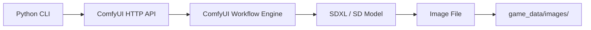
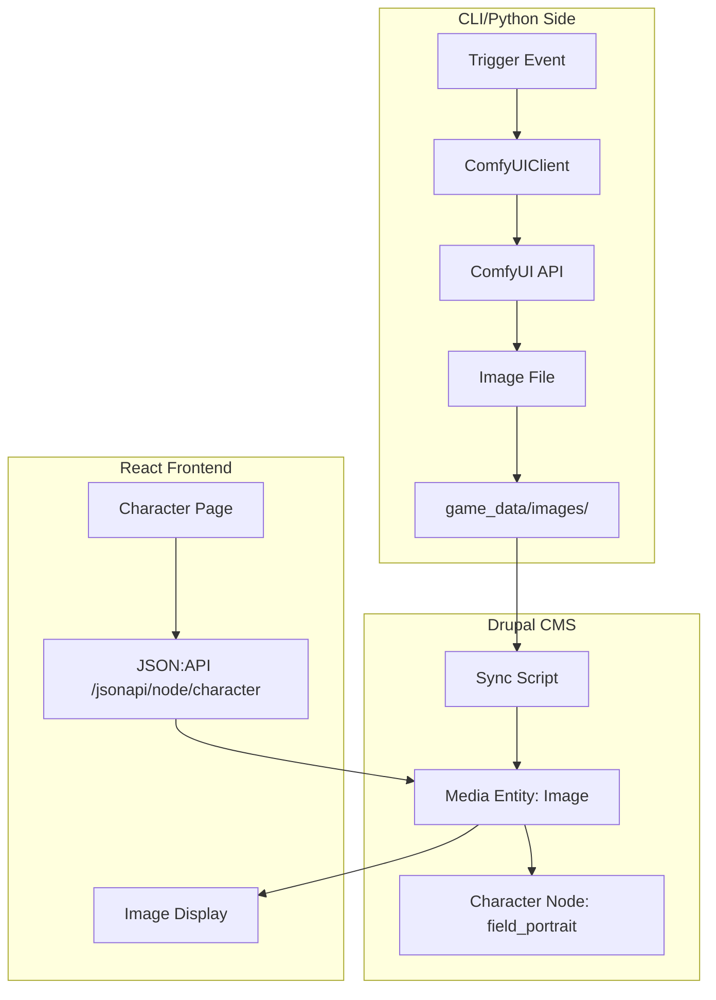

# ComfyUI Integration Plan

## Overview

This document describes the design for integrating ComfyUI as a local image
generation service for the D&D Character Consultant System. Integration
provides optional portrait generation for characters and NPCs, scene
illustrations for story events, and exposes image generation as an optional
feature in Drupal for web display.

This plan is structured to mirror
[`tts_web_integration.md`](tts_web_integration.md), which follows the same
pattern of a CLI-native feature extended optionally into the Drupal frontend.

**Related Documents:**
- Drupal Integration: [`drupal_cms_integration.md`](drupal_cms_integration.md)
- TTS Web Integration (parallel pattern): [`tts_web_integration.md`](tts_web_integration.md)

---

## 1. Architecture Options Analysis

### 1.1 Option A: ComfyUI HTTP API (Direct)

**Description:** Call the ComfyUI REST API directly from Python using the
`/prompt` endpoint with a serialised workflow JSON.



**Pros:**
- No additional infrastructure beyond ComfyUI itself
- Full control over workflow parameters (model, LoRA, sampler, steps)
- Workflow JSONs are reusable and version-controllable
- Works offline after ComfyUI is started

**Cons:**
- ComfyUI must be running before image generation is triggered
- API is low-level; requires managing prompt queuing and result polling
- No built-in retry or error handling

**Verdict:** Recommended for CLI integration.

---

### 1.2 Option B: ComfyUI via Wrapper Service

**Description:** Wrap ComfyUI in a thin FastAPI service that provides a
simpler `POST /generate` endpoint.

**Pros:**
- Cleaner API surface
- Can add queuing, caching, and error handling
- Enables future React/Drupal direct calls

**Cons:**
- Additional service to manage
- Overkill for CLI-only use

**Verdict:** Optional future enhancement for Drupal/web integration.

---

### 1.3 Recommended Approach

**Phase 1:** Direct ComfyUI HTTP API calls from Python CLI.
**Phase 2:** Expose generated images through Drupal media entities.
**Phase 3 (optional):** Thin wrapper service for React real-time generation.

---

## 2. Recommended Architecture

### 2.1 CLI-Side Image Generation

ComfyUI generates images when a trigger event occurs:

1. **Manual trigger**: User runs `dnd_consultant.py --generate-portrait aragorn`
2. **Auto-trigger**: New character or NPC JSON is created/updated
3. **Scene trigger**: Story file generation completes; a scene image is requested

Generated images are saved to `game_data/images/<entity_type>/<name>/`:

```
game_data/
  images/
    characters/
      aragorn/
        portrait_001.png
        portrait_002.png
    npcs/
      gandalf/
        portrait_001.png
    scenes/
      example_campaign/
        session_001_scene_001.png
```

### 2.2 Drupal-Side Display

Generated images are synced to Drupal as Media entities and linked to
Character or NPC content type nodes:



---

## 3. Python Integration

### 3.1 Configuration

Add to `src/config/config_types.py`:

```python
@dataclass
class ComfyUIConfig:
    """ComfyUI image generation configuration."""

    enabled: bool = False
    host: str = ""
    port: int = 8188
    default_workflow: str = ""
    portrait_workflow: str = ""
    scene_workflow: str = ""
    output_dir: str = ""
    auto_generate_portraits: bool = False
```

Environment variables (`.env`):

```
COMFYUI_ENABLED=false
COMFYUI_HOST=localhost
COMFYUI_PORT=8188
COMFYUI_DEFAULT_WORKFLOW=workflows/portrait_workflow.json
COMFYUI_AUTO_GENERATE_PORTRAITS=false
```

ComfyUI is **disabled by default**. Users opt in explicitly, consistent
with rule 4 in AGENTS.md.

### 3.2 ComfyUI Client

Create `src/ai/comfyui_client.py`:

```python
"""Client for the ComfyUI REST API."""

import json
import time
import uuid
from pathlib import Path
from typing import Dict, Any, Optional

try:
    import requests
    REQUESTS_AVAILABLE = True
except ImportError:
    REQUESTS_AVAILABLE = False

from src.config.config_loader import load_config
from src.utils.terminal_display import print_warning, print_info


class ComfyUIClient:
    """
    Sends generation requests to a local ComfyUI instance.

    ComfyUI must be running before any methods are called. This client
    does not start or manage the ComfyUI process.
    """

    def is_available(self) -> bool:
        """Return True if ComfyUI is reachable and enabled in config."""

    def generate_portrait(
        self,
        subject_name: str,
        subject_description: str,
        entity_type: str = "character",
        output_path: Optional[Path] = None,
    ) -> Optional[Path]:
        """Generate a portrait image and return the saved file path."""

    def generate_scene(
        self,
        scene_description: str,
        campaign_name: str,
        scene_index: int = 1,
        output_path: Optional[Path] = None,
    ) -> Optional[Path]:
        """Generate a scene illustration and return the saved file path."""

    def _queue_prompt(self, workflow: Dict[str, Any]) -> str:
        """Submit a workflow to ComfyUI and return the prompt_id."""

    def _poll_result(self, prompt_id: str, timeout: int = 120) -> Optional[Path]:
        """Poll ComfyUI until the prompt completes and return the output path."""
```

### 3.3 Workflow Templates

Store workflow JSONs in `game_data/comfyui_workflows/`:

```
game_data/
  comfyui_workflows/
    portrait_workflow.json    # Character/NPC portrait
    scene_workflow.json       # Story scene illustration
    item_workflow.json        # Custom item illustration
```

Workflow JSONs are standard ComfyUI exports. The client performs
string substitution on placeholder nodes (e.g., the positive prompt
text node) before submitting.

### 3.4 Auto-Generation Hook

When `auto_generate_portraits` is enabled, hook into character and NPC
creation in `src/utils/character_profile_utils.py` and
`src/npcs/npc_manager.py`:

```python
from src.ai.comfyui_client import ComfyUIClient

def save_character_profile(character_data: dict, path: Path) -> None:
    save_json_file(path, character_data)
    client = ComfyUIClient()
    if client.is_available():
        description = character_data.get("appearance", "")
        client.generate_portrait(character_data["name"], description)
```

---

## 4. Drupal Integration

### 4.1 Media Type: D&D Image

Create a Media type `dnd_image` in Drupal:

| Field | Machine Name | Type |
|-------|-------------|------|
| Image File | `field_media_image` | File (image) |
| Subject Name | `field_subject_name` | Text |
| Entity Type | `field_entity_type` | List (character/npc/scene) |
| Generation Prompt | `field_comfyui_prompt` | Text long |
| Campaign Reference | `field_campaign` | Entity Reference |

### 4.2 Image Fields on Content Types

Add portrait fields to Character and NPC content types:

| Content Type | Field Name | Machine Name | Type |
|--------------|-----------|-------------|------|
| Character | Portrait | `field_portrait` | Media Reference (dnd_image) |
| NPC | Portrait | `field_portrait` | Media Reference (dnd_image) |
| Story | Scene Illustration | `field_scene_image` | Media Reference (dnd_image) |

### 4.3 Sync Script

Create `src/cli/sync_images_to_drupal.py` (mirrors the TTS pre-generation
pattern from `tts_web_integration.md`):

```python
"""Syncs generated images from game_data/images/ to Drupal media entities."""

def sync_character_portraits(campaign_name: str) -> None:
    """Upload all character portraits to Drupal and link to character nodes."""

def sync_npc_portraits() -> None:
    """Upload all NPC portraits to Drupal."""

def sync_scene_images(campaign_name: str) -> None:
    """Upload scene illustrations to Drupal and link to story nodes."""
```

The sync script uses the Drupal JSON:API for file upload and entity creation,
consistent with the existing Drupal integration approach.

### 4.4 Display Block

Add an optional `dnd_image_gallery` block in the React frontend that
displays portraits alongside character/NPC profiles. This is gated by the
existence of `field_portrait` on a node - if no image exists, the block
is not shown.

---

## 5. Feature Flag Behaviour

ComfyUI integration must degrade gracefully:

| Condition | Behaviour |
|-----------|-----------|
| `COMFYUI_ENABLED=false` | No image generation; no errors; no CLI options shown |
| Enabled but ComfyUI unreachable | `print_warning()` once; continue without images |
| No workflow file found | `print_warning()` and skip generation |
| Image generation fails | Log error; continue; do not block story/character flow |

---

## Phased Implementation

### Phase 1: Core Client

1. Add `ComfyUIConfig` to `src/config/config_types.py`
2. Create `src/ai/comfyui_client.py` with `is_available()`, `generate_portrait()`
3. Create `game_data/comfyui_workflows/portrait_workflow.json` (placeholder)
4. Unit tests in `tests/ai/test_comfyui_client.py` with mocked HTTP

### Phase 2: CLI Integration

1. Add `--generate-portrait <name>` flag to `dnd_consultant.py`
2. Add `--generate-scene <session_file>` flag
3. Add auto-generate hook to character profile save (opt-in via config)
4. Add `game_data/images/` to `.gitignore`

### Phase 3: Drupal Media Integration

1. Create `dnd_image` Media type config in `drupal-cms/`
2. Add `field_portrait` to Character and NPC content types
3. Create sync script `src/cli/sync_images_to_drupal.py`
4. Register new config as a Drupal recipe or custom module install step

### Phase 4: React Display (Optional)

1. Add portrait display to character and NPC profile pages
2. Add scene image display to story reader
3. Lazy-load images; graceful empty state when no portrait exists

---

## Related Plans

| Plan | Notes |
|------|-------|
| [`drupal_cms_integration.md`](drupal_cms_integration.md) | Media types and content type fields extend existing Drupal setup |
| [`tts_web_integration.md`](tts_web_integration.md) | Parallel pattern: CLI feature exposed as optional Drupal feature |
| [`configuration_system_plan.md`](configuration_system_plan.md) | `ComfyUIConfig` extends `DnDConfig` |
| [`documentation_update_plan.md`](documentation_update_plan.md) | Add ComfyUI setup guide to `docs/` |
| [`model_switching_plan.md`](model_switching_plan.md) | Checkpoint images could serve as creative model selection feedback |
