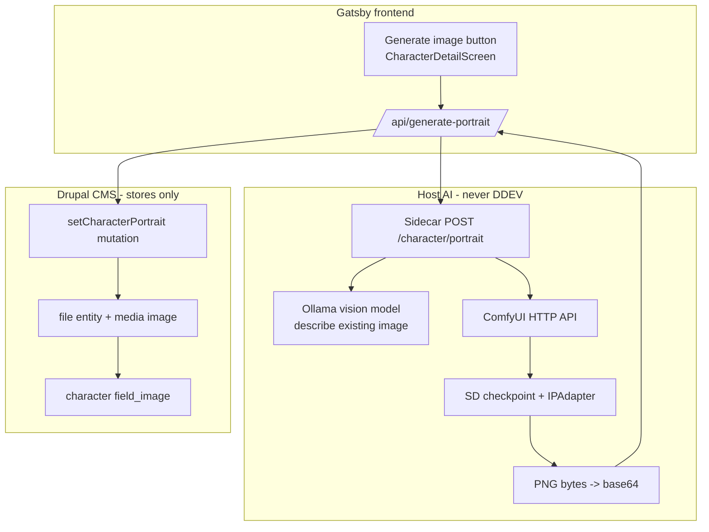

# ComfyUI Integration Plan

## Overview

Integrate **ComfyUI** as a local Stable Diffusion image service that produces
**character portraits** for the D&D Character Consultant System. A **Generate
image** button on the Gatsby character detail screen triggers generation through
the **sidecar**, and the result is attached to the character's existing
`field_image` in Drupal for web display.

This plan supersedes the earlier CLI-centric design. The CLI tier is deprecated
(v1.0.0), so generation is driven from the **three-tier flow**
(Gatsby serverless -> sidecar -> Ollama/ComfyUI on the host -> Drupal store),
mirroring how arc analysis and character creation already work.

**Related documents:**

- Drupal integration: [`drupal_cms_integration.md`](drupal_cms_integration.md)
- Gatsby frontend: [`gatsby_frontend_plan.md`](gatsby_frontend_plan.md)
- Config system: [`configuration_system_plan.md`](configuration_system_plan.md)
- Cross-tier architecture: `../docs/ARCHITECTURE.md`

---

## Confirmed decisions

- **Bespoke sidecar integration** (a thin wrapper endpoint), not the alpha Drupal
  ComfyUI module and not the CLI.
- **Image -> prompt via a local Ollama vision model** (e.g. `llava` /
  `qwen2.5vl`) to describe an existing portrait.
- **IPAdapter identity** so regenerations stay recognisably the same character.
- **Prompt source:** character profile (species/lineage/class, personality,
  bonds/ideals/flaws, background, backstory) + the **arc analysis summary** +
  (when a portrait exists) the **vision-model description** of that image, which
  doubles as the IPAdapter reference.

## Hard constraints (from the project's operating rules)

- **All AI runs on the host, never in DDEV.** Ollama and ComfyUI are host
  processes; DDEV only *stores* results. Heavy models inside DDEV double-load and
  crash the box.
- **Serialize heavy AI.** The vision step and the generation step run one at a
  time, never concurrently, and models are unloaded between steps
  (Ollama `keep_alive`, ComfyUI `/free`). See [[feedback_process_management]]
  and [[feedback_chunk_large_ai_tasks]].
- **This box is CPU-only, 32 GB RAM** (no GPU). Loading a large model on top of
  DDEV + Gatsby + the editor already OOM-crashed it once (the 27B arc model). SD
  on CPU works but is slow (minutes/image), and the vision model + an SDXL
  checkpoint must not be resident at the same time. Keep footprints bounded;
  prefer a smaller SD checkpoint (SD 1.5 class) unless a GPU is added.
- Free models may be pulled from **Hugging Face** (checkpoint, IPAdapter,
  CLIP-vision, vision model).

---

## 1. Architecture

A thin **sidecar wrapper endpoint** in front of the raw ComfyUI HTTP API (the
"wrapper service" option; the old plan's Option B, now the chosen approach). It
gives a clean `POST /character/portrait`, handles workflow patching + polling,
and returns a base64 PNG the serverless layer stores via a Drupal mutation.


```mermaid
flowchart TD
    subgraph FE[Gatsby frontend]
        A[Generate image button<br/>CharacterDetailScreen] --> B[/api/generate-portrait/]
    end
    subgraph Host[Host AI - never DDEV]
        B --> C[Sidecar POST /character/portrait]
        C --> V[Ollama vision model<br/>describe existing image]
        C --> D[ComfyUI HTTP API]
        D --> E[SD checkpoint + IPAdapter]
        E --> F[PNG bytes -> base64]
    end
    subgraph Drupal[Drupal CMS - stores only]
        B --> G[setCharacterPortrait mutation]
        G --> H[file entity + media image]
        H --> I[character field_image]
    end
    F --> B
```

**Portrait storage chain (already exists):**
`node(character).field_image` -> `media(image)` -> `field_media_image` ->
`file`. Config is present (`field.field.node.character.field_image.yml`, media
bundle `image`, `alt_field_required: true`). Exposed as
`image { ... on Drupal_MediaImage { mediaImage { url alt } } }` and flattened to
`imageUrl` in `buildConsoleData.ts` / `Portrait.tsx` /
`CharacterDetailScreen.tsx`. **No code creates file/media entities yet** - that
write path is the largest new piece.

---

## 2. Local setup (host, one-time; HF models)

- Install **ComfyUI** at `~/ComfyUI` in its own venv; serve on `COMFYUI_PORT`
  (default 8188). Add the **ComfyUI-IPAdapter-plus** custom nodes.
- Pull into ComfyUI `models/`: one **SD checkpoint** (SD 1.5-class on CPU;
  SDXL only with a GPU), the **IPAdapter** model, and the **CLIP-vision** encoder.
- Pull an **Ollama vision model** on the host.
- No workflow files need exporting: the graph is **built programmatically** in
  `src/ai/comfyui_workflows.py` (see 3.5), so the checkpoint, prompts, seed, and
  size are patched at call time.
- `start.sh`: launch ComfyUI as a backgrounded host process (mirror the sidecar
  Step-2 block: `.comfyui.log`, readiness probe `GET /system_stats`, shutdown
  prompt); add `COMFYUI_HOST` / `COMFYUI_PORT` with the fail-loud `${VAR:?}`
  pattern and free the port on restart (same LISTEN-only guard the sidecar/Gatsby
  blocks use).

---

## 3. Python / sidecar integration

### 3.1 Configuration

`ComfyUIConfig` under `ServiceConfig` in `src/config/config_types.py`; an
`_apply_env_comfyui` loader in `config_loader.py`. Disabled by default; opt in
via env (consistent with AGENTS.md rule 4 - no hardcoded values).

Workflow paths and model names live in a nested `ComfyUIAssets` dataclass. This
split is required, not cosmetic: pylint caps a class at 7 instance attributes,
and it mirrors the existing `MilvusConfig` / `MilvusEmbeddingConfig` nesting.

```python
@dataclass
class ComfyUIAssets:
    """ComfyUI workflow templates and model names used for generation."""

    txt2img_workflow: str = ""
    ipadapter_workflow: str = ""
    vision_model: str = ""        # Ollama vision model name
    checkpoint: str = ""          # SD checkpoint file name in ComfyUI


@dataclass
class ComfyUIConfig:
    """ComfyUI image-generation service configuration."""

    enabled: bool = False
    host: str = ""
    port: int = 8188
    base_url: str = ""            # derived host:port when empty
    timeout: float = 900.0        # CPU generation is slow
    assets: ComfyUIAssets = field(default_factory=ComfyUIAssets)

    def get_base_url(self) -> str: ...   # base_url, else http://host:port
    def is_configured(self) -> bool: ... # enabled and a usable base URL
```

Accessed as `config.comfyui.enabled` and `config.comfyui.assets.checkpoint`.

`.env` / `.env.example`:

```ini
COMFYUI_ENABLED=false
COMFYUI_HOST=localhost
COMFYUI_PORT=8188
COMFYUI_BASE_URL=
COMFYUI_TIMEOUT=900.0
COMFYUI_TXT2IMG_WORKFLOW=
COMFYUI_IPADAPTER_WORKFLOW=
COMFYUI_VISION_MODEL=
COMFYUI_CHECKPOINT=
```

### 3.2 ComfyUI client

Create `src/ai/comfyui_client.py` - a plain HTTP client for the ComfyUI workflow
API. ComfyUI must already be running; the client does not manage the process.

The client is **workflow-agnostic**: callers build a workflow dict (3.5) and hand
it to `generate()`. Failures return `None`/`False` rather than raising, so the
endpoint degrades gracefully per section 6.

```python
class ComfyUIClient:
    """Minimal client for ComfyUI's HTTP workflow API."""

    def __init__(self, base_url: str, timeout: float = 600.0) -> None: ...

    def is_available(self) -> bool:
        """True if ComfyUI responds to GET /system_stats."""

    def upload_image(self, name: str, data: bytes) -> Optional[str]:
        """POST /upload/image an IPAdapter reference; return its filename."""

    def free(self) -> bool:
        """POST /free to unload models between steps (avoid double-load OOM)."""

    def generate(self, workflow: Dict[str, Any]) -> Optional[bytes]:
        """Queue a workflow, poll history, return the first output PNG bytes."""

    # Internals: _queue (POST /prompt), _await_image (poll GET /history),
    # _history, _first_image, _view (GET /view -> bytes).
```

`src/ai/portrait_prompt.py` - `build_portrait_prompt(profile) -> (positive,
negative)` takes a **single profile dict**. Arc summary, appearance, and
backstory are folded in by the caller as `arc_summary` / `appearance` /
`backstory` keys on that dict; flavour text is truncated to keep the CLIP
encoder bounded.

### 3.3 Vision helper

A small helper (extend `AIClient` or a dedicated call) that sends an existing
portrait to the Ollama vision model as a base64 `image_url` message and returns
a physical description. Runs **before** generation; the model is unloaded
(`keep_alive: 0` via the native Ollama API - note `/v1` ignores `keep_alive`)
before ComfyUI loads the checkpoint.

### 3.4 Sidecar endpoint

`POST /character/portrait` in `src/sidecar/app.py` (+ Pydantic models in
`models.py`). Input: character profile (+ arc summary + optional existing image
URL/bytes). Output: base64 PNG. A cached client getter mirrors
`_get_arc_ai_client`. Flow: (optional) fetch existing image -> vision describe ->
unload vision -> build prompt -> ComfyUI generate (txt2img, or ipadapter when a
reference exists) -> `free()` -> return base64.

### 3.5 Workflow builders

**Superseded:** the original design shipped exported `txt2img.json` /
`ipadapter.json` API-format files under `src/sidecar/comfyui_workflows/`. The
implementation instead **builds the graph programmatically** in
`src/ai/comfyui_workflows.py`. This avoids checking in a large generated JSON
blob that must be re-exported whenever a node changes, and keeps the patch
points type-checked.

```python
@dataclass
class RenderSettings:
    """Size and sampler settings; defaults target an SDXL portrait."""

    width: int = 832      # for an SD 1.5-class checkpoint on CPU, use 512x768
    height: int = 1216
    steps: int = 30
    cfg: float = 7.0


@dataclass
class Txt2ImgParams:
    """Per-request parameters for a text-to-image portrait workflow."""

    checkpoint: str
    positive: str
    negative: str
    seed: int
    render: RenderSettings = field(default_factory=RenderSettings)


def txt2img_workflow(params: Txt2ImgParams) -> Dict[str, Any]: ...
```

`RenderSettings` is a nested dataclass for the same pylint 7-attribute reason as
`ComfyUIAssets`. The emitted graph is the standard ComfyUI text-to-image node
set (`CheckpointLoaderSimple` -> `CLIPTextEncode` x2 -> `KSampler` ->
`VAEDecode` -> `SaveImage`).

The Phase B ipadapter graph will be added here as a second builder that also
takes the uploaded reference filename from `upload_image()`.

Composition in the sidecar is therefore three steps:

```python
positive, negative = build_portrait_prompt(profile)
workflow = txt2img_workflow(Txt2ImgParams(checkpoint, positive, negative, seed))
png = client.generate(workflow)
```

---

## 4. Drupal integration (store only)

Reuse the **existing** `field_image` chain - do **not** add a new media type.
New write path via a DataProducer (the CLI JSON:API sync script is dropped).

- **SDL:** `setCharacterPortrait(id: ID!, imageBase64: String!, alt: String!):
  NodeCharacter` in `dnd_content_mutations.extension.graphqls`.
- **Resolver:** wire in `ContentMutationsSchemaExtension.php`.
- **DataProducer:** `DataProducer/SetCharacterPortrait.php` - decode base64 ->
  `file.repository->writeData()` a `file` entity -> create `media(image)` with
  `field_media_image` + required `alt` -> set the character's `field_image` ->
  `save()`; return the character node. Grant `gatsby_user` any missing
  file/media create permissions; export config.
  - **Producer rule (critical):** `produces` must use `data_type: "any"`, never
    `entity:node` - the latter trips an assertion that breaks the entire schema
    build (same lesson as `SaveCharacterArc`). See `../docs/DRUPAL.md`.

---

## 5. Frontend integration

- **Serverless:** `frontend/src/api/generate-portrait.ts` (mirrors
  `create-character.ts` + `sidecarFetch` for the long, timeout-free sidecar
  call): POST to sidecar `/character/portrait`, then the `setCharacterPortrait`
  mutation with the returned base64 + `alt`.
- **UI:** a **Generate image** button on `CharacterDetailScreen.tsx` (running
  state, error banner, refetch/badge on success), with a `ctx`-cached result for
  immediate feedback like the arc screen. This fills the affordance the
  deprecated "Customize Portrait" screen already promises
  (`menuData.ts` `id: 'ascii'` -> `DeprecatedScreen`).

---

## 6. Feature-flag behaviour (graceful degradation)

| Condition | Behaviour |
| --------- | --------- |
| `COMFYUI_ENABLED=false` | Button hidden / endpoint returns 503; no errors |
| Enabled but ComfyUI unreachable | Endpoint 503; FE shows a one-line notice |
| No workflow file / checkpoint | Endpoint error; FE shows the message; no crash |
| Generation fails or times out | Error surfaced to the FE; character unchanged |

---

## Phased implementation (each phase ships end-to-end)

### Phase A - txt2img portrait from the profile (thin vertical slice)

1. **[DONE]** `ComfyUIConfig`, `ComfyUIAssets`, `_apply_env_comfyui_overrides`,
   and the `.env.example` block.
2. **[DONE]** `src/ai/comfyui_client.py` (`is_available`, `upload_image`,
   `free`, `generate`), `src/ai/comfyui_workflows.py` (`txt2img_workflow`),
   `src/ai/portrait_prompt.py`. Unit tests for all three under `tests/ai/`,
   registered in the `test_all_ai.py` aggregator.
3. **[DONE]** `POST /character/portrait` in `app.py` on the existing
   `_character_router`, with `PortraitRequest` / `PortraitResponse` in
   `models.py` and a cached `_get_comfyui_client()`. Returns the base64 PNG,
   seed, prompt, and `alt`; 503/500 per section 6. Endpoint tests in
   `tests/sidecar/test_portrait_endpoint.py`.
4. **[DONE]** Drupal `setCharacterPortrait` mutation + resolver +
   `SetCharacterPortrait.php` (file + media + `field_image`). Granted
   `gatsby_user` the `create media` / `create image media` / `view media`
   permissions and exported config. Verified end-to-end against the live schema:
   file written to `public://portraits/`, media created, `field_image` set, and
   `image { mediaImage { url alt } }` returns the new URL.
5. `generate-portrait.ts` + the **Generate image** button.

### Phase B - existing image -> vision prompt + IPAdapter consistency

1. Vision helper (Ollama vision model describes the current portrait).
2. `comfyui_client` gains the ipadapter workflow: fetch `imageUrl`,
   `/upload/image` as reference, feed the vision description into the prompt.
   Sidecar chooses txt2img vs ipadapter by whether an existing image is supplied.

### Phase C - arc-aware prompt + polish

1. Fold the saved arc summary (tone / scars / demeanour) into the prompt.
2. Regenerate confirmation, progress affordance, sensible `alt` text, doc
   updates.

---

## Verification (per phase)

- **A:** a character with **no** portrait -> Generate image -> a `media(image)` +
  `file` are created and `field_image` is set; `image { mediaImage { url alt } }`
  returns the new URL; the detail screen shows it after refetch.
- **B:** a character **with** a portrait -> regenerate -> recognisably the same
  character (IPAdapter); the vision description appears in the sidecar log.
- **C:** two characters with different arcs get visibly different tone.
- **Gates each phase:** pylint 10.00 / mypy (`.venv`); PHPCS + PHPStan L6; Drupal
  `config:status` clean; `npm run type-check`. **Watch host RAM during a run** -
  it must stay bounded and models must unload between steps (this box OOM-crashed
  on a single 17 GB model).

---

## Risks

- **Double-load OOM is the top risk.** Never run the vision model and the SD
  checkpoint resident at once; unload between steps; host-only, never DDEV. On a
  32 GB CPU box, prefer an SD 1.5-class checkpoint.
- **File/media creation is new Drupal ground** (permissions, required `alt`,
  base64 transport of a few MB through GraphQL - acceptable).
- **ComfyUI API-format workflow JSON is checkpoint/IPAdapter-specific;** the model
  choices fix the node graph. Large one-time local setup (install + HF
  downloads).
- **CPU-only generation is slow** (minutes/image) but functional; a GPU makes
  SDXL + faster turnaround practical.

---

## Related plans

| Plan | Notes |
| ---- | ----- |
| [`drupal_cms_integration.md`](drupal_cms_integration.md) | Reuses the existing `field_image` media chain (no new media type) |
| [`gatsby_frontend_plan.md`](gatsby_frontend_plan.md) | Generate-image button + serverless follow the console patterns |
| [`configuration_system_plan.md`](configuration_system_plan.md) | `ComfyUIConfig` extends `ServiceConfig` |
| [`tts_web_integration.md`](tts_web_integration.md) | Parallel host-service-behind-the-sidecar pattern |
