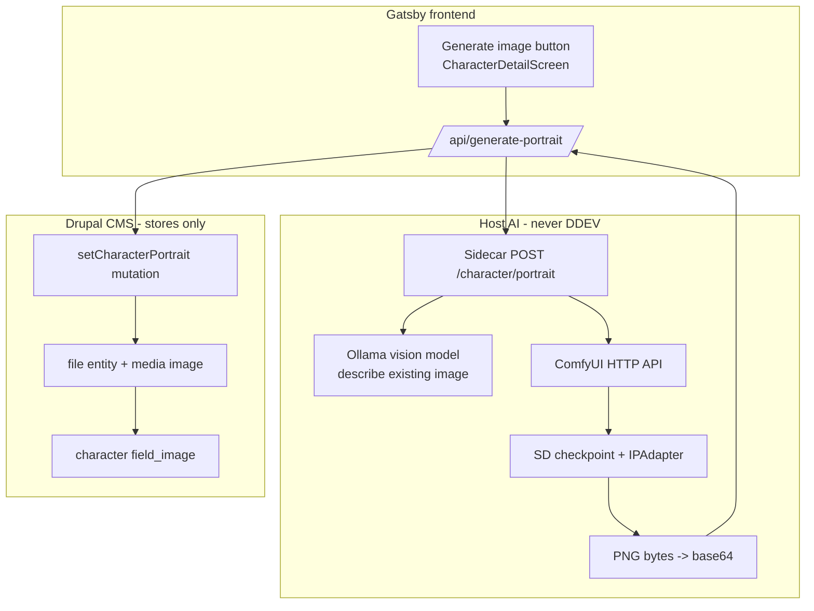

# ComfyUI Integration Plan

## Overview

Integrate **ComfyUI** as a local Stable Diffusion image service that produces
**character portraits** for the D&D Character Consultant System. A **Generate
image** button on the Gatsby character detail screen triggers generation through
the **sidecar**, and the result is attached to the character's existing
`field_image` in Drupal for web display.

This plan supersedes the earlier CLI-centric design. The CLI tier is deprecated
(v1.0.0), so generation is driven from the **three-tier flow**
(Gatsby serverless -> sidecar -> Ollama/ComfyUI on the host -> Drupal store),
mirroring how arc analysis and character creation already work.

**Related documents:**

- Drupal integration: [`drupal_cms_integration.md`](drupal_cms_integration.md)
- Gatsby frontend: [`gatsby_frontend_plan.md`](gatsby_frontend_plan.md)
- Config system: [`configuration_system_plan.md`](configuration_system_plan.md)
- Cross-tier architecture: `../docs/ARCHITECTURE.md`

---

## Confirmed decisions

- **Bespoke sidecar integration** (a thin wrapper endpoint), not the alpha
  Drupal ComfyUI module and not the CLI.
- **Image -> prompt via a local Ollama vision model** (e.g. `llava` /
  `qwen2.5vl`) to describe an existing portrait.
- **IPAdapter identity** so regenerations stay recognisably the same character.
- **Prompt source:** character profile (species/lineage/class, personality,
  bonds/ideals/flaws, background, backstory) + the **arc analysis summary** +
  (when a portrait exists) the **vision-model description** of that image, which
  doubles as the IPAdapter reference.

## Hard constraints (from the project's operating rules)

- **All AI runs on the host, never in DDEV.** Ollama and ComfyUI are host
  processes; DDEV only *stores* results. Heavy models inside DDEV double-load
  and crash the box.
- **Serialize heavy AI.** The vision step and the generation step run one at a
  time, never concurrently, and models are unloaded between steps
  (Ollama `keep_alive`, ComfyUI `/free`). See [[feedback_process_management]]
  and [[feedback_chunk_large_ai_tasks]].
- **This box is CPU-only, 32 GB RAM** (no GPU). Loading a large model on top of
  DDEV + Gatsby + the editor already OOM-crashed it once (the 27B arc model). SD
  on CPU works but is slow (minutes/image), and the vision model + an SDXL
  checkpoint must not be resident at the same time. Keep footprints bounded;
  prefer a smaller SD checkpoint (SD 1.5 class) unless a GPU is added.
- Free models may be pulled from **Hugging Face** (checkpoint, IPAdapter,
  CLIP-vision, vision model).

---

## 1. Architecture

A thin **sidecar wrapper endpoint** in front of the raw ComfyUI HTTP API (the
"wrapper service" option; the old plan's Option B, now the chosen approach). It
gives a clean `POST /character/portrait`, handles workflow patching + polling,
and returns a base64 PNG the serverless layer stores via a Drupal mutation.


```mermaid
flowchart TD
    subgraph FE[Gatsby frontend]
        A[Generate image button<br/>CharacterDetailScreen] --> B[/api/generate-portrait/]
    end
    subgraph Host[Host AI - never DDEV]
        B --> C[Sidecar POST /character/portrait]
        C --> V[Ollama vision model<br/>describe existing image]
        C --> D[ComfyUI HTTP API]
        D --> E[SD checkpoint + IPAdapter]
        E --> F[PNG bytes -> base64]
    end
    subgraph Drupal[Drupal CMS - stores only]
        B --> G[setCharacterPortrait mutation]
        G --> H[file entity + media image]
        H --> I[character field_image]
    end
    F --> B
```

**Portrait storage chain (already exists):**
`node(character).field_image` -> `media(image)` -> `field_media_image` ->
`file`. Config is present (`field.field.node.character.field_image.yml`, media
bundle `image`, `alt_field_required: true`). Exposed as
`image { ... on Drupal_MediaImage { mediaImage { url alt } } }` and flattened to
`imageUrl` in `buildConsoleData.ts` / `Portrait.tsx` /
`CharacterDetailScreen.tsx`. **No code creates file/media entities yet** - that
write path is the largest new piece.

---

## 2. Local setup (host, one-time; HF models)

- Install **ComfyUI** in its own venv at `COMFYUI_DIR`; serve on `COMFYUI_PORT`.
  Add the **ComfyUI-IPAdapter-plus** custom nodes.
- Pull into ComfyUI `models/`: one **SD checkpoint** (SD 1.5-class on CPU; SDXL
  only with a GPU), the **IPAdapter** model, and the **CLIP-vision** encoder.
- Pull an **Ollama vision model** on the host.
- No workflow files need exporting: the graph is **built programmatically** in
  `src/ai/comfyui_workflows.py` (see 3.5), so the checkpoint, prompts, seed, and
  size are patched at call time.
- **[DONE]** `start.sh` launches ComfyUI as a backgrounded host process,
  mirroring the sidecar block: `.comfyui.log`, readiness probe
  `GET /system_stats`, LISTEN-only stale-port free on restart, and a "Stop
  ComfyUI?" shutdown prompt. The whole block is **gated on `COMFYUI_ENABLED`**
  (opt-in; skipped when unset), and when enabled requires `COMFYUI_HOST`,
  `COMFYUI_PORT`, and `COMFYUI_DIR` via the fail-loud `${VAR:?}` pattern.
  ComfyUI runs from `COMFYUI_DIR`'s own venv; `COMFYUI_EXTRA_ARGS` passes launch
  flags (e.g. `--cpu`). Nothing is hardcoded - the install path is env-driven.

---

## 3. Python / sidecar integration

### 3.1 Configuration

`ComfyUIConfig` under `ServiceConfig` in `src/config/config_types.py`; an
`_apply_env_comfyui` loader in `config_loader.py`. Disabled by default; opt in
via env (consistent with AGENTS.md rule 4 - no hardcoded values).

Workflow paths and model names live in a nested `ComfyUIAssets` dataclass. This
split is required, not cosmetic: pylint caps a class at 7 instance attributes,
and it mirrors the existing `MilvusConfig` / `MilvusEmbeddingConfig` nesting.

As built (`src/config/config_types.py`):

```python
@dataclass
class ComfyUIAssets:
    """ComfyUI workflow templates and model names used for generation."""

    image_to_prompt_model: str = ""   # Ollama vision model name
    checkpoint: str = ""              # SD checkpoint file name in ComfyUI
    ipadapter_model: str = ""         # identity conditioning, models/ipadapter/
    clip_vision: str = ""             # its encoder, models/clip_vision/

    def supports_identity(self) -> bool: ...  # both IPAdapter files configured


@dataclass
class ComfyUIConfig:
    """ComfyUI image-generation service configuration."""

    enabled: bool = False
    host: str = ""                # no default: env is authoritative
    port: int = 0                 # no default: env is authoritative
    base_url: str = ""            # derived from host/port when empty
    timeout: float = 900.0        # CPU generation is slow
    assets: ComfyUIAssets = field(default_factory=ComfyUIAssets)
    ollama_url: str = ""          # native Ollama API, for unloading models

    def get_base_url(self) -> str: ...   # base_url, else host+port, else ""
    def is_configured(self) -> bool: ... # enabled and a usable base URL
```

Host and port carry **no defaults**: a guessed address hides a
misconfiguration behind a connection error to the wrong place, so an
unconfigured ComfyUI reports "not set up" (503) instead.

Accessed as `config.comfyui.enabled` and `config.comfyui.assets.checkpoint`.

`.env` / `.env.example`:

```ini
COMFYUI_ENABLED=
COMFYUI_HOST=
COMFYUI_PORT=
COMFYUI_BASE_URL=
COMFYUI_TIMEOUT=
IMAGE_TO_PROMPT_MODEL=
COMFYUI_CHECKPOINT=
COMFYUI_IPADAPTER_MODEL=
COMFYUI_CLIP_VISION=
COMFYUI_DIR=
```

The two workflow-path keys the original design listed
(`COMFYUI_TXT2IMG_WORKFLOW` / `COMFYUI_IPADAPTER_WORKFLOW`) were dropped: the
graphs are built in code (3.5), so they had never been read.

### 3.2 ComfyUI client

Create `src/ai/comfyui_client.py` - a plain HTTP client for the ComfyUI workflow
API. ComfyUI must already be running; the client does not manage the process.

The client is **workflow-agnostic**: callers build a workflow dict (3.5) and
hand it to `generate()`. Failures return `None`/`False` rather than raising, so
the endpoint degrades gracefully per section 6.

```python
class ComfyUIClient:
    """Minimal client for ComfyUI's HTTP workflow API."""

    def __init__(self, base_url: str, timeout: float = 600.0) -> None: ...

    def is_available(self) -> bool:
        """True if ComfyUI responds to GET /system_stats."""

    def upload_image(self, name: str, data: bytes) -> Optional[str]:
        """POST /upload/image an IPAdapter reference; return its filename."""

    def free(self) -> bool:
        """POST /free to unload models between steps (avoid double-load OOM)."""

    def generate(self, workflow: Dict[str, Any]) -> Optional[bytes]:
        """Queue a workflow, poll history, return the first output PNG bytes."""

    # Internals: _queue (POST /prompt), _await_image (poll GET /history),
    # _history, _first_image, _view (GET /view -> bytes).
```

`src/ai/portrait_prompt.py` - `build_portrait_prompt(profile) -> (positive,
negative)` takes a **single profile dict**. Arc summary, appearance, and
backstory are folded in by the caller as `arc_summary` / `appearance` /
`backstory` keys on that dict; flavour text is truncated to keep the CLIP
encoder bounded.

### 3.3 Vision helper

A small helper (extend `AIClient` or a dedicated call) that sends an existing
portrait to the Ollama vision model as a base64 `image_url` message and returns
a physical description. Runs **before** generation; the model is unloaded
(`keep_alive: 0` via the native Ollama API - note `/v1` ignores `keep_alive`)
before ComfyUI loads the checkpoint.

### 3.4 Sidecar endpoint

`POST /character/portrait` in `src/sidecar/app.py` (+ Pydantic models in
`models.py`). Input: character profile (+ arc summary + optional existing image
URL/bytes). Output: base64 PNG. A cached client getter mirrors
`_get_arc_ai_client`. Flow: (optional) fetch existing image -> vision describe
-> unload vision -> build prompt -> ComfyUI generate (txt2img, or ipadapter when
a reference exists) -> `free()` -> return base64.

### 3.5 Workflow builders

**Superseded:** the original design shipped exported `txt2img.json` /
`ipadapter.json` API-format files under `src/sidecar/comfyui_workflows/`. The
implementation instead **builds the graph programmatically** in
`src/ai/comfyui_workflows.py`. This avoids checking in a large generated JSON
blob that must be re-exported whenever a node changes, and keeps the patch
points type-checked.

```python
@dataclass
class RenderSettings:
    """Size and sampler settings; defaults target an SDXL portrait."""

    width: int = 832      # for an SD 1.5-class checkpoint on CPU, use 512x768
    height: int = 1216
    steps: int = 30
    cfg: float = 7.0


@dataclass
class Txt2ImgParams:
    """Per-request parameters for a text-to-image portrait workflow."""

    checkpoint: str
    positive: str
    negative: str
    seed: int
    render: RenderSettings = field(default_factory=RenderSettings)


def txt2img_workflow(params: Txt2ImgParams) -> Dict[str, Any]: ...
```

`RenderSettings` is a nested dataclass for the same pylint 7-attribute reason as
`ComfyUIAssets`. The emitted graph is the standard ComfyUI text-to-image node
set (`CheckpointLoaderSimple` -> `CLIPTextEncode` x2 -> `KSampler` ->
`VAEDecode` -> `SaveImage`).

The Phase B ipadapter graph is now the second builder here,
`ipadapter_workflow`, taking the uploaded reference filename from
`upload_image()` plus the IPAdapter / CLIP-vision model names as an
`IdentityReference`.

Composition in the sidecar is therefore three steps:

```python
positive, negative = build_portrait_prompt(profile)
workflow = txt2img_workflow(Txt2ImgParams(checkpoint, positive, negative, seed))
png = client.generate(workflow)
```

---

## 4. Drupal integration (store only)

Reuse the **existing** `field_image` chain - do **not** add a new media type.
New write path via a DataProducer (the CLI JSON:API sync script is dropped).

- **SDL:** `setCharacterPortrait(id: ID!, imageBase64: String!, alt: String!):
  NodeCharacter` in `dnd_content_mutations.extension.graphqls`.
- **Resolver:** wire in `ContentMutationsSchemaExtension.php`.
- **DataProducer:** `DataProducer/SetCharacterPortrait.php` - decode base64 ->
  `file.repository->writeData()` a `file` entity -> create `media(image)` with
  `field_media_image` + required `alt` -> set the character's `field_image` ->
  `save()`; return the character node. Grant `gatsby_user` any missing
  file/media create permissions; export config.
  - **Producer rule (critical):** `produces` must use `data_type: "any"`, never
    `entity:node` - the latter trips an assertion that breaks the entire schema
    build (same lesson as `SaveCharacterArc`). See `../docs/DRUPAL.md`.

---

## 5. Frontend integration

- **Serverless:** `frontend/src/api/generate-portrait.ts` (mirrors
  `create-character.ts` + `sidecarFetch` for the long, timeout-free sidecar
  call): POST to sidecar `/character/portrait`, then the `setCharacterPortrait`
  mutation with the returned base64 + `alt`.
- **UI:** two entry points, both posting to `generate-portrait.ts` and swapping
  the portrait in place on success (running state + error notice):
  - a one-click **Generate image** button on `CharacterDetailScreen.tsx`; and
  - the **Portrait Studio** screen (`PortraitStudioScreen.tsx`, routed at
    `characters/ascii`), which exposes the ComfyUI inputs - appearance details
    (folded into the prompt as `appearance`), seed, and size - and echoes the
    seed used for reproducibility. This replaces the old deprecated "Customize
    Portrait" notice (`menuData.ts` `id: 'ascii'`, formerly `DeprecatedScreen`);
    the profile mapping is shared via `utils/portraitProfile.ts`.
- **Media picker:** a `MediaPickerModal` (used by the Portrait Studio and the
  Character Edit screen) lists the Drupal media library
  (`list-portrait-media.ts` -> `mediaImages`) and points `field_image` at a
  chosen existing media (`set-portrait-media.ts` -> `setCharacterImage`) without
  generating - so a freshly generated portrait can be swapped for an older one,
  and any character can be given a library image. The just-generated / current
  portrait is pre-selected. Listing is config-only (`media/image` gains
  `edges_enabled`); the select mutation is a new `SetCharacterImage` producer.
  A `field_media_type` list field (exposed as `mediaType`) tags each image
  (`character_portrait` / `npc_portrait` / `item` / `monster_portrait` /
  `story_scenario`); the picker filters by it (`?type=`) so a character only
  sees character portraits. `SetCharacterPortrait` stamps the type on
  generation; existing media were backfilled from their referencing node.

---

## 6. Feature-flag behaviour (graceful degradation)

| Condition | Behaviour |
| --------- | --------- |
| `COMFYUI_ENABLED=false` | Button hidden / endpoint returns 503; no errors |
| Enabled but ComfyUI unreachable | Endpoint 503; FE shows a one-line notice |
| No workflow file / checkpoint | Endpoint error; FE shows the message; no crash |
| Generation fails or times out | Error surfaced to the FE; character unchanged |

---

## Phased implementation (each phase ships end-to-end)

### Phase A - txt2img portrait from the profile (thin vertical slice)

1. **[DONE]** `ComfyUIConfig`, `ComfyUIAssets`, `_apply_env_comfyui_overrides`,
   and the `.env.example` block.
2. **[DONE]** `src/ai/comfyui_client.py` (`is_available`, `upload_image`,
   `free`, `generate`), `src/ai/comfyui_workflows.py` (`txt2img_workflow`),
   `src/ai/portrait_prompt.py`. Unit tests for all three under `tests/ai/`,
   registered in the `test_all_ai.py` aggregator.
3. **[DONE]** `POST /character/portrait` in `app.py` on the existing
   `_character_router`, with `PortraitRequest` / `PortraitResponse` in
   `models.py` and a cached `_get_comfyui_client()`. Returns the base64 PNG,
   seed, prompt, and `alt`; 503/500 per section 6. Endpoint tests in
   `tests/sidecar/test_portrait_endpoint.py`.
4. **[DONE]** Drupal `setCharacterPortrait` mutation + resolver +
   `SetCharacterPortrait.php` (file + media + `field_image`). Granted
   `gatsby_user` the `create media` / `create image media` / `view media`
   permissions and exported config. Verified end-to-end against the live schema:
   file written to `public://portraits/`, media created, `field_image` set, and
   `image { mediaImage { url alt } }` returns the new URL.
5. **[DONE]** `frontend/src/api/generate-portrait.ts` (sidecar
   `/character/portrait` via `sidecarFetch`, then the `setCharacterPortrait`
   mutation; returns the new `imageUrl`) + two UI entry points that share
   `utils/portraitProfile.ts`: the **Generate image / Regenerate image** button
   on `CharacterDetailScreen.tsx`, and the **Portrait Studio**
   (`PortraitStudioScreen.tsx`, routed at `characters/ascii`, replacing the
   deprecated notice) with seed/size inputs and a reproducible seed echo (the
   appearance field is superseded by the prompt layer in item 6). Both show a
   running state, surface a 503 (ComfyUI disabled/unreachable) as a one-line
   notice leaving the character unchanged, and swap the portrait in place on
   success. `npm run type-check` clean.
6. **[DONE, beyond the original slice]** Prompt-as-stored-artifact layer, media
   library reuse, and image->prompt vision:
   - **Editable prompt is the source of truth.** `field_image_prompt` on the
     character (plain `string_long`, exposed as `imagePrompt`, saved via
     `updateCharacter(imagePrompt:)`). The Portrait Studio centres on an
     editable prompt box with **Generate prompt** (template), **Enhance with
     AI** (fast model expands the box), **Image -> prompt** (vision), and **Save
     prompt**; generation is prompt-driven (an explicit `positive` overrides the
     profile build). Old-vs-new compare: the saved prompt stays visible when the
     box diverges, with Undo and Revert-to-saved.
   - **Media library reuse.** `MediaPickerModal` lists image media
     (`mediaImages`, enabled config-only via `edges_enabled`) filtered by a new
     `field_media_type` (`mediaType`: character_portrait / npc_portrait / item /
     monster_portrait / story_scenario); `setCharacterImage(id, mediaId)` points
     `field_image` at an existing media without regenerating.
     `SetCharacterPortrait` stamps the type; existing media were backfilled from
     their referencing node.
   - **Vision config.** `IMAGE_TO_PROMPT_MODEL` (replaced the
     `COMFYUI_VISION_MODEL` stub) names the Ollama vision model; the value is
     deployment config and lives only in `.env`. The describe call caps
     `num_ctx` (else it balloons to ~15 GB / 5 min on CPU) and primes with the
     character's known species/lineage/class so fantasy features read right
     (horns not wings, Tabaxi fur, elf ears).

### Phase B - existing image -> vision prompt + IPAdapter consistency

1. **[DONE]** Vision helper - `src/ai/image_describe.py` +
   `/character/describe-image` (Ollama vision, `num_ctx`-capped,
   species-primed).
   Built for the **Image -> prompt** button (into the editable box) rather than
   automatic priming, but it is the same helper this phase needs.
2. **[DONE - wired and rendering; likeness quality still being tuned]**
   IPAdapter identity conditioning, the "same character, new picture" engine.
   Text prompts alone cannot preserve likeness (image -> prompt -> image is
   lossy), so identity is conditioned on the reference image's own CLIP-vision
   embedding rather than on words about it. **img2img** is deliberately not
   used: a single deliberate refine is fine, but img2img *chains* degrade
   (colour/contrast drift each pass).
   - `ipadapter_workflow()` / `IpAdapterParams` / `IdentityReference` in
     `src/ai/comfyui_workflows.py`: the txt2img graph with
     `IPAdapterModelLoader` + `CLIPVisionLoader` + `LoadImage` ->
     `IPAdapterAdvanced` spliced in, and the sampler rewired onto the patched
     model (omit that rewire and the chain is silently ignored).
   - `PortraitRequest` gains `reference_image_url` + `identity_weight`;
     `_identity_reference()` fetches the portrait, uploads it to ComfyUI
     (content-hashed filename, so a changed reference never hits a stale
     `LoadImage` cache), and the endpoint picks ipadapter vs txt2img. Every
     failure - no IPAdapter models configured, unfetchable reference, failed
     upload - degrades to text-to-image with a logged reason rather than failing
     the render, and `PortraitResponse.used_reference` reports which ran.
   - Config: `COMFYUI_IPADAPTER_MODEL` / `COMFYUI_CLIP_VISION` (they replaced
     the two dead `*_WORKFLOW` keys, unused since the graphs moved into code),
     with `ComfyUIAssets.supports_identity()` as the guard.
   - Console: the detail screen's Regenerate always passes the attached portrait
     as the reference; the Portrait Studio adds a **Keep this character's
     likeness** toggle with a weight slider, and captions each candidate with
     whether the likeness was actually applied.
   - `PortraitJobType` passes `referenceImageUrl` / `identityWeight` through and
     records `usedReference` on the job result.
   - **Host setup (one-time, done):** the **ComfyUI-IPAdapter-plus** custom
     nodes plus two model files - a general (**not** face) IPAdapter into
     `models/ipadapter/` and its CLIP-vision encoder into `models/clip_vision/`,
     both matching the configured checkpoint's family. The file names are
     deployment config and live only in `.env`; naming them here would be a
     second place to keep in sync. Without them everything above is inert and
     generation stays text-to-image, by design.
   - **Use a general IPAdapter, never a `-face` one, for non-human
     characters.** This is the single decision that makes or breaks the feature.
     Face adapters exist to encode *human facial identity*; a dragonborn's snout
     is outside that distribution, so the adapter projects it to the nearest
     human face and reconstructs that instead. Turning the weight up makes it
     worse, because weight is how hard the human reconstruction is imposed. A
     gold dragonborn reference at `weight: 1` on a face adapter rendered a human
     woman even with `human` in the negative prompt - the costume, palette, and
     hall transferred perfectly while the species was overwritten. The identical
     prompt, seed, and reference on the general adapter at `weight: 0.7`
     produced the dragonborn. Negative prompts cannot rescue this: a negative
     removes a concept, it never supplies the missing one.
   - **Verified end to end:** the nodes load, the graph queues, and likeness
     transfers - same prompt and seed, only the adapter model changed, human
     vs correct dragonborn. `weight: 0.7` held species and costume while leaving
     the prompt room to move pose; `0.5` drifted looser.
   - **Not the cause:** ComfyUI's `/free` between runs was suspected of
     degrading output. Measured directly - same workflow and seed either side of
     a `free()` - the PNGs were byte-identical (`sha256` equal). Checkpoint
     unload/reload is bit-exact; look elsewhere for image drift.

### Phase C - context-aware prompt + polish

1. **Arc awareness (partial).** `build_portrait_prompt` already folds
   `arc_summary` in as flavour text; deepen it (tone / scars / demeanour from
   the saved arc) and expose it in the Studio.
2. **Gear-aware prompts + gear generation (future).** Fold a character's
   equipped gear - weapons, armor, vestiges from `field_equipment_items` - into
   the portrait prompt via the same priming seam (`_describe_context`). Gear
   nodes get their *own* image generation and image->prompt (items already have
   `field_image` and `mediaType: item`), and an item's stored
   `field_image_prompt` becomes the priming text. Open calls: which gear counts
   (equipped/notable only), and compose-vs-reference. See the
   `project_gear_image_generation` memory.
3. Polish: the **per-media prompt stamp** (store the exact prompt used on each
   generated media - the reproducibility half of decision 2A, deferred),
   regenerate confirmation, progress affordance, sensible `alt` text, doc
   updates.

### Phase D - story scene generation (future)

Generate an image for a **story passage**: use the passage as the prompt, primed
with the **entities present** so they render true to their profiles. Reuses the
whole prompt pipeline (generate / describe / edit / store), one level up from a
single character.

1. Select a passage in a story -> seed a scene prompt from its text.
2. **Prime with who is present.** Detect the characters / NPCs / monsters the
   passage references (NPC auto-detection + party/current-party context already
   identify who is on stage) and fold their known descriptions -
   species/lineage, stored `field_image_prompt`, existing portraits - into the
   scene prompt via the same `_describe_context` seam.
3. Store the result as media with `mediaType: story_scenario` (already reserved
   in `field_media_type`), attached to the story node (needs a story image field
   and a `SetStoryImage`-style producer, mirroring `SetCharacterImage`).

Caveats: multi-entity scenes are the **hard case** for SD - it blends distinct
characters into one. Regional prompting or multiple IPAdapters (one per present
character, keyed off their portraits) help but are involved; a single-subject or
establishing-shot passage is the easy first target.

### Phase E - async generation + job queue (LARGELY DONE)

AI generation takes minutes on this CPU box, and the work used to be tied to the
page: navigate away and the browser lost the result, and firing several
generations at once would OOM the box. Heavy AI is now **queued, serialized, and
tracked**, so you can start work and walk away. The queue, both quick wins, and
the portrait path are done; the arc / story / summary screens still trigger
their AI inline (see the end of this section).

**Quick wins first (small, independent of the queue):**

1. **[DONE]** **Animated busy state** on the generate/prompt buttons - a
   `<Spinner>` console atom (`components/console/atoms.tsx` + `.console-spinner`
   in `console.css`, reusing the global `spin` keyframes and `currentColor` so
   it reads on `.primary-btn`, `.ghost-btn`, and `.arc-btn`). It replaces the
   button's icon while running, across every long action in the console:
   Portrait Studio (generate / prompt / enhance / vision / save), character
   Generate image, consult Ask + Save voice, character create / add / edit, NPC
   validator save, arc synthesize / discard / accept / analyse-all, and the AI
   action Accept & save. Honours `prefers-reduced-motion`.
2. **[DONE]** **Negative prompt field** in the Portrait Studio - an editable box
   under the prompt, pre-filled with the standard negative (read from
   `/api/portrait-prompt`, which returns it with no model call when
   `enhance: false`) and passed through `generate-portrait.ts` to
   `PortraitRequest.negative`. Blank falls back to the sidecar default, so a
   failed prefill degrades to today's behaviour.

**The queue - Drupal Advanced Queue orchestrates, the sidecar stays
synchronous:**

**[DONE]** `drupal/advancedqueue` (contrib) plus a custom `dnd_jobs` module:

- **Queue:** one `dnd_ai` queue (`processor: daemon`, `lease_time: 3600`,
  `stop_when_empty: false`). One queue + one processor = **one job at a time** =
  the OOM protection.
- **Runner:** a host daemon, not cron. `start.sh` backgrounds
  `ddev drush advancedqueue:queue:process dnd_ai --timeout=0` in a restart loop
  (`JOB_QUEUE_ENABLED`, `.jobqueue.log`, shutdown prompt), started after Gatsby
  because some jobs call console routes.
- **Job types** (`src/Plugin/AdvancedQueue/JobType/`): `dnd_portrait`,
  `dnd_arc_analysis`, `dnd_story_generation`, `dnd_session_summary`. A job type
  calls the **sidecar directly** only when the work is a single model call
  (portrait: generate, then write file + media via the shared `dnd_content`
  `PortraitWriter`, which the synchronous `setCharacterPortrait` mutation now
  also uses). Multi-step orchestrations already exist as console routes, so
  those jobs call **the console** (`ConsoleClient` -> `run-arc-analysis`,
  `generate-story-text`, `store-session-summary`) rather than growing a second
  copy of the chunking/prompt logic in PHP.
- **GraphQL:** `enqueueAiJob(type, payload, label): AiJob` returns a job id
  instantly; `aiJob(id)` / `aiJobs(states, limit)` are the poll targets,
  resolved with `mergeCacheMaxAge(0)` (job state has no cache tag). A finished
  job writes a small `result` back onto its payload - the processor persists the
  mutated payload - so the console reads e.g. the new `imageUrl` on the next
  poll.
- **Console:** `api/enqueue-job.ts` + `api/job-status.ts`, and `utils/aiJobs.ts`
  (`enqueueJob`, `useJobPolling`, `useJobActivity`). The right-rail **activity
  drawer** is now live: running, pending, and just-finished jobs, so a job that
  completed on another screen still reports itself.
- **Env:** the web container reaches the host over its Docker gateway, not
  loopback (`SIDECAR_URL`, `GATSBY_SERVER_URL`, new `SIDECAR_JOB_TIMEOUT`). The
  sidecar therefore listens on `SIDECAR_BIND_HOST` - every interface, a
  `run_sidecar.py` launch knob like `SIDECAR_WORKERS` - while host clients keep
  dialling `SIDECAR_HOST`; `SIDECAR_SECRET` is sent as `X-Sidecar-Secret` when
  set.

**Verified end-to-end:** a queued `dnd_portrait` job rendered on ComfyUI,
created the file + media, set `field_image`, and returned the new `imageUrl` on
the job result; a queued `dnd_story_generation` job produced a story through the
console route. Gates: pylint 10.00, mypy, pyright 0/0/0, PHPCS, PHPStan L6,
`npm run type-check`, `config:status` clean after export.

**Still to do (the remaining UI switch):** `CharacterArcScreen` (single run and
"Analyse all"), the story presets in `AiActionScreen`, and the create-story
session summary still run their AI inline in the browser. Their job types exist
and are callable - what is left is replacing each screen's inline run with
`enqueueJob` + `useJobPolling`, which for the arc screen also means folding its
per-passage progress panel into job state (queued / running / done). Once those
land, the "don't navigate away" caveat disappears everywhere.

**Ops notes:** job lease is 1 hour, which accommodates multi-minute CPU jobs;
the daemon holds a bootstrapped Drupal, so config changes need a processor
restart. Drupal's AI search indexing (`ai` module embeddings) still targets the
host Ollama through the web container's `AI_CREATIVE_BASE_URL` while Ollama
binds loopback only, so the container cannot reach it - it throws on kernel
terminate after a CLI job. Pre-existing, and harmless to the job itself (the
restart loop covers it), but giving Ollama the same wider bind the sidecar now
uses (`SIDECAR_BIND_HOST`) would silence it and let Drupal-side indexing work.

---

## Verification (per phase)

- **A:** a character with **no** portrait -> Generate image -> a `media(image)`
  + `file` are created and `field_image` is set;
  `image { mediaImage { url alt } }` returns the new URL; the detail screen
  shows it after refetch.
- **B:** a character **with** a portrait -> regenerate -> recognisably the same
  character (IPAdapter); the vision description appears in the sidecar log.
- **C:** two characters with different arcs get visibly different tone; equipped
  gear appears in the portrait.
- **D:** a passage with a known character present -> generate -> a
  `story_scenario` media is created and attached to the story, and the present
  character reads true to their profile.
- **E:** enqueue several portraits, navigate away, come back -> jobs ran **one
  at a time** (RAM stayed bounded), the activity bar showed running + pending,
  each finished with a notice, and every portrait was attached.
- **Gates each phase:** pylint 10.00 / mypy (`.venv`); PHPCS + PHPStan L6;
  Drupal `config:status` clean; `npm run type-check`. **Watch host RAM during a
  run** - it must stay bounded and models must unload between steps (this box
  OOM-crashed on a single 17 GB model).

---

## Risks

- **Double-load OOM is the top risk.** Never run the vision model and the SD
  checkpoint resident at once; unload between steps; host-only, never DDEV. On a
  32 GB CPU box, prefer an SD 1.5-class checkpoint.
- **File/media creation is new Drupal ground** (permissions, required `alt`,
  base64 transport of a few MB through GraphQL - acceptable).
- **ComfyUI API-format workflow JSON is checkpoint/IPAdapter-specific;** the
  model choices fix the node graph. Large one-time local setup (install + HF
  downloads).
- **CPU-only generation is slow** (minutes/image) but functional; a GPU makes
  SDXL + faster turnaround practical.

---

## Related plans

| Plan | Notes |
| ---- | ----- |
| [`drupal_cms_integration.md`](drupal_cms_integration.md) | Reuses the existing `field_image` media chain (no new media type) |
| [`gatsby_frontend_plan.md`](gatsby_frontend_plan.md) | Generate-image button + serverless follow the console patterns |
| [`configuration_system_plan.md`](configuration_system_plan.md) | `ComfyUIConfig` extends `ServiceConfig` |
| [`tts_web_integration.md`](tts_web_integration.md) | Parallel host-service-behind-the-sidecar pattern |
