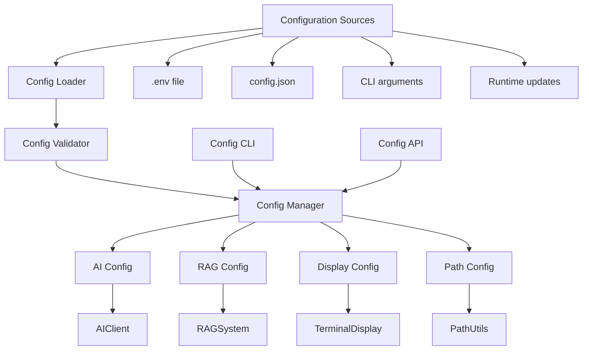
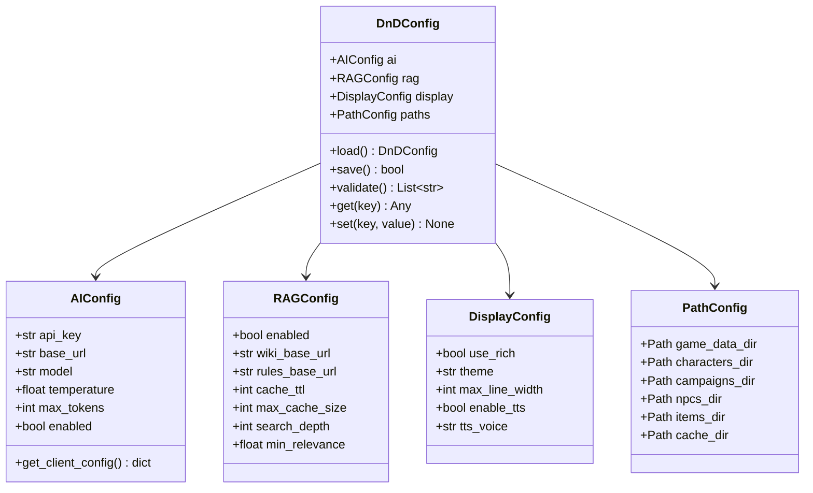

# Configuration System Plan

## Overview

This document describes the design for a centralized configuration system for
the D&D Character Consultant System. The system consolidates settings from
environment variables, configuration files, and runtime parameters into a
single, type-safe configuration interface.

## Problem Statement

### Current Issues

1. **Scattered Configuration**: Settings are spread across multiple locations:
   - Environment variables (`.env` file)
   - Hardcoded defaults in various modules
   - Per-character AI configuration in JSON files
   - No single source of truth

2. **No Validation**: Configuration values are not validated until runtime,
   leading to cryptic errors when invalid values are provided.

3. **No Type Safety**: All environment variables are strings, requiring
   manual parsing and conversion in each module.

4. **No Documentation**: Configuration options are documented in `.env.example`
   but not accessible programmatically.

5. **No Runtime Updates**: Changing configuration requires restarting the
   application.

### Current Configuration Locations

| Setting | Location | Module |
|---------|----------|--------|
| `OPENAI_API_KEY` | `.env` | `src/ai/ai_client.py` |
| `OPENAI_BASE_URL` | `.env` | `src/ai/ai_client.py` |
| `OPENAI_MODEL` | `.env` | `src/ai/ai_client.py` |
| `AI_TEMPERATURE` | `.env` | `src/ai/ai_client.py` |
| `AI_MAX_TOKENS` | `.env` | `src/ai/ai_client.py` |
| `RAG_ENABLED` | `.env` | `src/ai/rag_system.py` |
| `RAG_WIKI_BASE_URL` | `.env` | `src/ai/rag_system.py` |
| `RAG_RULES_BASE_URL` | `.env` | `src/ai/rag_system.py` |
| `RAG_CACHE_TTL` | `.env` | `src/ai/rag_system.py` |
| `RAG_MAX_CACHE_SIZE` | `.env` | `src/ai/rag_system.py` |
| `RAG_SEARCH_DEPTH` | `.env` | Not implemented |
| `RAG_MIN_RELEVANCE` | `.env` | Not implemented |

---

## Proposed Solution

### High-Level Architecture



### Configuration Schema



---

## Implementation Details

### 1. Configuration Data Classes

Create `src/config/config_types.py`:

```python
"""
Configuration Type Definitions

Dataclasses for type-safe configuration management.
"""

from dataclasses import dataclass, field
from typing import Optional, Dict, Any
from pathlib import Path


@dataclass
class AIConfig:
    """AI service configuration."""

    api_key: str = ""
    base_url: Optional[str] = None
    model: str = "gpt-3.5-turbo"
    temperature: float = 0.7
    max_tokens: int = 1000
    enabled: bool = True

    # Per-character overrides stored separately
    character_overrides: Dict[str, Dict[str, Any]] = field(default_factory=dict)

    def get_client_config(self) -> Dict[str, Any]:
        """Get configuration dict for AIClient initialization."""
        return {
            "api_key": self.api_key,
            "base_url": self.base_url,
            "model": self.model,
            "default_temperature": self.temperature,
            "default_max_tokens": self.max_tokens,
        }

    def is_configured(self) -> bool:
        """Check if AI is properly configured."""
        return bool(self.api_key and self.api_key != "your-openai-api-key-here")

    def get_character_config(self, character_name: str) -> Dict[str, Any]:
        """Get AI config for a specific character, with overrides."""
        base_config = self.get_client_config()

        if character_name in self.character_overrides:
            base_config.update(self.character_overrides[character_name])

        return base_config


@dataclass
class RAGConfig:
    """RAG (Retrieval-Augmented Generation) configuration."""

    enabled: bool = False
    wiki_base_url: str = ""
    rules_base_url: str = "https://dnd5e.wikidot.com"
    cache_ttl: int = 604800  # 7 days in seconds
    max_cache_size: int = 100
    search_depth: int = 3
    min_relevance: float = 0.5

    def is_configured(self) -> bool:
        """Check if RAG is properly configured."""
        return self.enabled and bool(self.wiki_base_url)


@dataclass
class DisplayConfig:
    """Terminal display configuration."""

    use_rich: bool = True
    theme: str = "dracula"
    max_line_width: int = 80
    enable_tts: bool = False
    tts_voice: Optional[str] = None
    tts_speed: int = 150

    def get_tts_config(self) -> Dict[str, Any]:
        """Get TTS configuration dict."""
        return {
            "enabled": self.enable_tts,
            "voice": self.tts_voice,
            "speed": self.tts_speed,
        }


@dataclass
class PathConfig:
    """File path configuration."""

    game_data_dir: Path = field(default_factory=lambda: Path("game_data"))
    cache_dir: Path = field(default_factory=lambda: Path(".rag_cache"))

    @property
    def characters_dir(self) -> Path:
        """Get characters directory path."""
        return self.game_data_dir / "characters"

    @property
    def campaigns_dir(self) -> Path:
        """Get campaigns directory path."""
        return self.game_data_dir / "campaigns"

    @property
    def npcs_dir(self) -> Path:
        """Get NPCs directory path."""
        return self.game_data_dir / "npcs"

    @property
    def items_dir(self) -> Path:
        """Get items directory path."""
        return self.game_data_dir / "items"

    def validate_paths(self) -> list:
        """Validate that required paths exist."""
        errors = []

        if not self.game_data_dir.exists():
            errors.append(f"Game data directory not found: {self.game_data_dir}")

        if not self.characters_dir.exists():
            errors.append(f"Characters directory not found: {self.characters_dir}")

        return errors


@dataclass
class DnDConfig:
    """Root configuration container."""

    ai: AIConfig = field(default_factory=AIConfig)
    rag: RAGConfig = field(default_factory=RAGConfig)
    display: DisplayConfig = field(default_factory=DisplayConfig)
    paths: PathConfig = field(default_factory=PathConfig)

    # Metadata
    config_file_path: Optional[Path] = None
    _dirty: bool = field(default=False, repr=False)

    def is_dirty(self) -> bool:
        """Check if configuration has unsaved changes."""
        return self._dirty

    def mark_dirty(self) -> None:
        """Mark configuration as having unsaved changes."""
        self._dirty = True

    def mark_clean(self) -> None:
        """Mark configuration as saved."""
        self._dirty = False
```

### 2. Configuration Loader

Create `src/config/config_loader.py`:

```python
"""
Configuration Loader

Loads configuration from multiple sources with precedence:
1. CLI arguments (highest)
2. Environment variables
3. config.json file
4. Default values (lowest)
"""

import os
import json
from pathlib import Path
from typing import Optional, Dict, Any

from src.config.config_types import (
    DnDConfig,
    AIConfig,
    RAGConfig,
    DisplayConfig,
    PathConfig,
)


# Default config file location
DEFAULT_CONFIG_FILE = Path("game_data/config.json")


def load_config(
    config_path: Optional[Path] = None,
    env_prefix: str = "",
) -> DnDConfig:
    """Load configuration from all sources.

    Precedence (highest to lowest):
    1. Environment variables
    2. config.json file
    3. Default values

    Args:
        config_path: Optional path to config file
        env_prefix: Optional prefix for environment variables

    Returns:
        DnDConfig with merged settings
    """
    # Start with defaults
    config = DnDConfig()

    # Load from config file
    file_config = _load_config_file(config_path or DEFAULT_CONFIG_FILE)
    if file_config:
        config = _merge_config(config, file_config)

    # Override with environment variables
    config = _apply_env_overrides(config, env_prefix)

    # Store config file path
    config.config_file_path = config_path or DEFAULT_CONFIG_FILE

    return config


def _load_config_file(config_path: Path) -> Optional[Dict[str, Any]]:
    """Load configuration from JSON file.

    Args:
        config_path: Path to config file

    Returns:
        Configuration dict or None if file doesn't exist
    """
    if not config_path.exists():
        return None

    try:
        with open(config_path, "r", encoding="utf-8") as f:
            return json.load(f)
    except (OSError, json.JSONDecodeError) as e:
        print(f"[WARNING] Could not load config file: {e}")
        return None


def _merge_config(base: DnDConfig, override: Dict[str, Any]) -> DnDConfig:
    """Merge override dict into base config.

    Args:
        base: Base DnDConfig
        override: Override values from file

    Returns:
        New DnDConfig with merged values
    """
    # AI config
    if "ai" in override:
        ai_data = override["ai"]
        base.ai = AIConfig(
            api_key=ai_data.get("api_key", base.ai.api_key),
            base_url=ai_data.get("base_url", base.ai.base_url),
            model=ai_data.get("model", base.ai.model),
            temperature=ai_data.get("temperature", base.ai.temperature),
            max_tokens=ai_data.get("max_tokens", base.ai.max_tokens),
            enabled=ai_data.get("enabled", base.ai.enabled),
            character_overrides=ai_data.get("character_overrides", {}),
        )

    # RAG config
    if "rag" in override:
        rag_data = override["rag"]
        base.rag = RAGConfig(
            enabled=rag_data.get("enabled", base.rag.enabled),
            wiki_base_url=rag_data.get("wiki_base_url", base.rag.wiki_base_url),
            rules_base_url=rag_data.get("rules_base_url", base.rag.rules_base_url),
            cache_ttl=rag_data.get("cache_ttl", base.rag.cache_ttl),
            max_cache_size=rag_data.get("max_cache_size", base.rag.max_cache_size),
            search_depth=rag_data.get("search_depth", base.rag.search_depth),
            min_relevance=rag_data.get("min_relevance", base.rag.min_relevance),
        )

    # Display config
    if "display" in override:
        display_data = override["display"]
        base.display = DisplayConfig(
            use_rich=display_data.get("use_rich", base.display.use_rich),
            theme=display_data.get("theme", base.display.theme),
            max_line_width=display_data.get("max_line_width", base.display.max_line_width),
            enable_tts=display_data.get("enable_tts", base.display.enable_tts),
            tts_voice=display_data.get("tts_voice", base.display.tts_voice),
            tts_speed=display_data.get("tts_speed", base.display.tts_speed),
        )

    # Path config
    if "paths" in override:
        paths_data = override["paths"]
        base.paths = PathConfig(
            game_data_dir=Path(paths_data.get("game_data_dir", base.paths.game_data_dir)),
            cache_dir=Path(paths_data.get("cache_dir", base.paths.cache_dir)),
        )

    return base


def _apply_env_overrides(config: DnDConfig, prefix: str = "") -> DnDConfig:
    """Apply environment variable overrides.

    Args:
        config: Base configuration
        prefix: Environment variable prefix

    Returns:
        Configuration with env overrides applied
    """
    def get_env(key: str, default: Any = None) -> Any:
        """Get environment variable with optional prefix."""
        full_key = f"{prefix}{key}" if prefix else key
        return os.getenv(full_key, default)

    def get_env_bool(key: str, default: bool = False) -> bool:
        """Get boolean environment variable."""
        value = get_env(key)
        if value is None:
            return default
        return value.lower() in ("true", "1", "yes", "on")

    def get_env_int(key: str, default: int) -> int:
        """Get integer environment variable."""
        value = get_env(key)
        if value is None:
            return default
        try:
            return int(value)
        except ValueError:
            return default

    def get_env_float(key: str, default: float) -> float:
        """Get float environment variable."""
        value = get_env(key)
        if value is None:
            return default
        try:
            return float(value)
        except ValueError:
            return default

    # AI configuration
    api_key = get_env("OPENAI_API_KEY")
    if api_key:
        config.ai.api_key = api_key

    base_url = get_env("OPENAI_BASE_URL")
    if base_url:
        config.ai.base_url = base_url

    model = get_env("OPENAI_MODEL")
    if model:
        config.ai.model = model

    config.ai.temperature = get_env_float("AI_TEMPERATURE", config.ai.temperature)
    config.ai.max_tokens = get_env_int("AI_MAX_TOKENS", config.ai.max_tokens)

    # RAG configuration
    config.rag.enabled = get_env_bool("RAG_ENABLED", config.rag.enabled)

    wiki_url = get_env("RAG_WIKI_BASE_URL")
    if wiki_url:
        config.rag.wiki_base_url = wiki_url

    rules_url = get_env("RAG_RULES_BASE_URL")
    if rules_url:
        config.rag.rules_base_url = rules_url

    config.rag.cache_ttl = get_env_int("RAG_CACHE_TTL", config.rag.cache_ttl)
    config.rag.max_cache_size = get_env_int("RAG_MAX_CACHE_SIZE", config.rag.max_cache_size)
    config.rag.search_depth = get_env_int("RAG_SEARCH_DEPTH", config.rag.search_depth)
    config.rag.min_relevance = get_env_float("RAG_MIN_RELEVANCE", config.rag.min_relevance)

    return config


def save_config(config: DnDConfig, path: Optional[Path] = None) -> bool:
    """Save configuration to JSON file.

    Args:
        config: Configuration to save
        path: Optional path, uses config.config_file_path if not provided

    Returns:
        True if save was successful
    """
    save_path = path or config.config_file_path or DEFAULT_CONFIG_FILE

    # Ensure parent directory exists
    save_path.parent.mkdir(parents=True, exist_ok=True)

    # Build config dict (exclude sensitive data like API keys)
    config_dict = {
        "ai": {
            "base_url": config.ai.base_url,
            "model": config.ai.model,
            "temperature": config.ai.temperature,
            "max_tokens": config.ai.max_tokens,
            "enabled": config.ai.enabled,
            # Note: api_key is NOT saved to file for security
            "character_overrides": config.ai.character_overrides,
        },
        "rag": {
            "enabled": config.rag.enabled,
            "wiki_base_url": config.rag.wiki_base_url,
            "rules_base_url": config.rag.rules_base_url,
            "cache_ttl": config.rag.cache_ttl,
            "max_cache_size": config.rag.max_cache_size,
            "search_depth": config.rag.search_depth,
            "min_relevance": config.rag.min_relevance,
        },
        "display": {
            "use_rich": config.display.use_rich,
            "theme": config.display.theme,
            "max_line_width": config.display.max_line_width,
            "enable_tts": config.display.enable_tts,
            "tts_voice": config.display.tts_voice,
            "tts_speed": config.display.tts_speed,
        },
        "paths": {
            "game_data_dir": str(config.paths.game_data_dir),
            "cache_dir": str(config.paths.cache_dir),
        },
    }

    try:
        with open(save_path, "w", encoding="utf-8") as f:
            json.dump(config_dict, f, indent=2)

        config.mark_clean()
        return True

    except OSError as e:
        print(f"[ERROR] Failed to save config: {e}")
        return False
```

### 3. Configuration Manager

Create `src/config/config_manager.py`:

```python
"""
Configuration Manager

Singleton manager for application-wide configuration access.
"""

from typing import Optional, Any, List
from pathlib import Path

from src.config.config_types import DnDConfig
from src.config.config_loader import load_config, save_config


class ConfigManager:
    """Singleton configuration manager.

    Provides centralized access to configuration throughout the application.

    Usage:
        # Get singleton instance
        config_manager = ConfigManager.get_instance()

        # Access configuration
        ai_config = config_manager.config.ai

        # Update configuration
        config_manager.set("ai.temperature", 0.9)

        # Save changes
        config_manager.save()
    """

    _instance: Optional["ConfigManager"] = None
    _config: Optional[DnDConfig] = None

    def __new__(cls) -> "ConfigManager":
        """Create or return singleton instance."""
        if cls._instance is None:
            cls._instance = super().__new__(cls)
        return cls._instance

    @classmethod
    def get_instance(cls) -> "ConfigManager":
        """Get the singleton instance."""
        return cls()

    @classmethod
    def reset(cls) -> None:
        """Reset the singleton instance (useful for testing)."""
        cls._instance = None
        cls._config = None

    @property
    def config(self) -> DnDConfig:
        """Get the current configuration, loading if necessary."""
        if self._config is None:
            self._config = load_config()
        return self._config

    def reload(self) -> DnDConfig:
        """Reload configuration from all sources."""
        self._config = load_config(self.config.config_file_path)
        return self._config

    def save(self) -> bool:
        """Save current configuration to file."""
        return save_config(self.config)

    def get(self, key: str, default: Any = None) -> Any:
        """Get a configuration value by dot-notation key.

        Args:
            key: Dot-notation key (e.g., "ai.temperature")
            default: Default value if key not found

        Returns:
            Configuration value or default
        """
        parts = key.split(".")
        obj = self.config

        for part in parts:
            if hasattr(obj, part):
                obj = getattr(obj, part)
            elif isinstance(obj, dict) and part in obj:
                obj = obj[part]
            else:
                return default

        return obj

    def set(self, key: str, value: Any) -> None:
        """Set a configuration value by dot-notation key.

        Args:
            key: Dot-notation key (e.g., "ai.temperature")
            value: Value to set
        """
        parts = key.split(".")
        obj = self.config

        # Navigate to parent
        for part in parts[:-1]:
            if hasattr(obj, part):
                obj = getattr(obj, part)
            else:
                raise KeyError(f"Invalid config key: {key}")

        # Set final value
        final_key = parts[-1]
        if hasattr(obj, final_key):
            setattr(obj, final_key, value)
            self.config.mark_dirty()
        else:
            raise KeyError(f"Invalid config key: {key}")

    def validate(self) -> List[str]:
        """Validate current configuration.

        Returns:
            List of validation error messages (empty if valid)
        """
        errors = []

        # Validate AI config
        if self.config.ai.enabled:
            if not self.config.ai.api_key:
                errors.append("AI is enabled but no API key is configured")
            elif self.config.ai.api_key == "your-openai-api-key-here":
                errors.append("AI API key has not been set (still using placeholder)")

        # Validate RAG config
        if self.config.rag.enabled:
            if not self.config.rag.wiki_base_url:
                errors.append("RAG is enabled but no wiki URL is configured")

        # Validate paths
        errors.extend(self.config.paths.validate_paths())

        # Validate ranges
        if not 0.0 <= self.config.ai.temperature <= 2.0:
            errors.append(f"AI temperature must be between 0.0 and 2.0, got {self.config.ai.temperature}")

        if self.config.ai.max_tokens < 1:
            errors.append(f"AI max_tokens must be positive, got {self.config.ai.max_tokens}")

        if not 0.0 <= self.config.rag.min_relevance <= 1.0:
            errors.append(f"RAG min_relevance must be between 0.0 and 1.0, got {self.config.rag.min_relevance}")

        return errors

    def is_ai_configured(self) -> bool:
        """Check if AI is properly configured."""
        return self.config.ai.is_configured()

    def is_rag_configured(self) -> bool:
        """Check if RAG is properly configured."""
        return self.config.rag.is_configured()

    def get_ai_client_config(self) -> dict:
        """Get configuration dict for AIClient initialization."""
        return self.config.ai.get_client_config()

    def get_rag_config(self) -> dict:
        """Get configuration dict for RAGSystem initialization."""
        return {
            "enabled": self.config.rag.enabled,
            "wiki_base_url": self.config.rag.wiki_base_url,
            "rules_base_url": self.config.rag.rules_base_url,
            "cache_ttl": self.config.rag.cache_ttl,
            "max_cache_size": self.config.rag.max_cache_size,
            "search_depth": self.config.rag.search_depth,
            "min_relevance": self.config.rag.min_relevance,
        }


# Convenience function for quick access
def get_config() -> DnDConfig:
    """Get the current configuration."""
    return ConfigManager.get_instance().config


def get_config_manager() -> ConfigManager:
    """Get the configuration manager singleton."""
    return ConfigManager.get_instance()
```

### 4. Configuration CLI

Create `src/cli/cli_config.py`:

```python
"""
Configuration CLI

Command-line interface for viewing and editing configuration.
"""

from typing import Optional

from src.config.config_manager import ConfigManager, get_config
from src.config.config_types import AIConfig, RAGConfig, DisplayConfig, PathConfig
from src.utils.terminal_display import print_info, print_success, print_warning, print_error
from src.utils.cli_utils import confirm_action


class ConfigCLI:
    """CLI interface for configuration management."""

    def __init__(self):
        """Initialize configuration CLI."""
        self.manager = ConfigManager.get_instance()

    def show_config_menu(self) -> None:
        """Display the main configuration menu."""
        while True:
            print("\n=== Configuration ===")
            print("1. View Current Configuration")
            print("2. Edit AI Settings")
            print("3. Edit RAG Settings")
            print("4. Edit Display Settings")
            print("5. Edit Path Settings")
            print("6. Validate Configuration")
            print("7. Save Configuration")
            print("8. Reload Configuration")
            print("0. Back")

            choice = input("\nSelect: ").strip()

            if choice == "1":
                self._view_configuration()
            elif choice == "2":
                self._edit_ai_settings()
            elif choice == "3":
                self._edit_rag_settings()
            elif choice == "4":
                self._edit_display_settings()
            elif choice == "5":
                self._edit_path_settings()
            elif choice == "6":
                self._validate_configuration()
            elif choice == "7":
                self._save_configuration()
            elif choice == "8":
                self._reload_configuration()
            elif choice == "0":
                break
            else:
                print_warning("Invalid selection.")

    def _view_configuration(self) -> None:
        """Display current configuration."""
        config = self.manager.config

        print("\n=== Current Configuration ===")

        # AI Settings
        print("\n[AI Settings]")
        print(f"  Enabled: {config.ai.enabled}")
        print(f"  Model: {config.ai.model}")
        print(f"  Base URL: {config.ai.base_url or 'Default (OpenAI)'}")
        print(f"  Temperature: {config.ai.temperature}")
        print(f"  Max Tokens: {config.ai.max_tokens}")
        api_status = "Configured" if config.ai.is_configured() else "Not Configured"
        print(f"  API Key: {api_status}")

        # RAG Settings
        print("\n[RAG Settings]")
        print(f"  Enabled: {config.rag.enabled}")
        print(f"  Wiki URL: {config.rag.wiki_base_url or 'Not set'}")
        print(f"  Rules URL: {config.rag.rules_base_url}")
        print(f"  Cache TTL: {config.rag.cache_ttl}s")
        print(f"  Max Cache Size: {config.rag.max_cache_size}")

        # Display Settings
        print("\n[Display Settings]")
        print(f"  Use Rich: {config.display.use_rich}")
        print(f"  Theme: {config.display.theme}")
        print(f"  Max Line Width: {config.display.max_line_width}")
        print(f"  TTS Enabled: {config.display.enable_tts}")

        # Path Settings
        print("\n[Path Settings]")
        print(f"  Game Data: {config.paths.game_data_dir}")
        print(f"  Characters: {config.paths.characters_dir}")
        print(f"  Campaigns: {config.paths.campaigns_dir}")
        print(f"  NPCs: {config.paths.npcs_dir}")
        print(f"  Cache: {config.paths.cache_dir}")

        if config.is_dirty():
            print_warning("\nYou have unsaved changes.")

    def _edit_ai_settings(self) -> None:
        """Edit AI configuration."""
        config = self.manager.config.ai

        print("\n=== Edit AI Settings ===")
        print(f"Current model: {config.model}")
        new_model = input("New model (press Enter to keep): ").strip()
        if new_model:
            self.manager.set("ai.model", new_model)

        print(f"\nCurrent temperature: {config.temperature}")
        new_temp = input("New temperature (0.0-2.0, press Enter to keep): ").strip()
        if new_temp:
            try:
                temp = float(new_temp)
                if 0.0 <= temp <= 2.0:
                    self.manager.set("ai.temperature", temp)
                else:
                    print_warning("Temperature must be between 0.0 and 2.0")
            except ValueError:
                print_warning("Invalid number format")

        print(f"\nCurrent max tokens: {config.max_tokens}")
        new_tokens = input("New max tokens (press Enter to keep): ").strip()
        if new_tokens:
            try:
                tokens = int(new_tokens)
                if tokens > 0:
                    self.manager.set("ai.max_tokens", tokens)
                else:
                    print_warning("Max tokens must be positive")
            except ValueError:
                print_warning("Invalid number format")

        print(f"\nCurrent base URL: {config.base_url or 'Default'}")
        new_url = input("New base URL (press Enter to keep, 'default' to reset): ").strip()
        if new_url:
            if new_url.lower() == "default":
                self.manager.set("ai.base_url", None)
            else:
                self.manager.set("ai.base_url", new_url)

        print_success("AI settings updated.")

    def _edit_rag_settings(self) -> None:
        """Edit RAG configuration."""
        config = self.manager.config.rag

        print("\n=== Edit RAG Settings ===")

        # Enable/disable
        enable = confirm_action(f"Enable RAG? (currently: {config.enabled})")
        self.manager.set("rag.enabled", enable)

        if enable:
            print(f"\nCurrent wiki URL: {config.wiki_base_url or 'Not set'}")
            new_url = input("New wiki URL (press Enter to keep): ").strip()
            if new_url:
                self.manager.set("rag.wiki_base_url", new_url)

            print(f"\nCurrent rules URL: {config.rules_base_url}")
            new_rules = input("New rules URL (press Enter to keep): ").strip()
            if new_rules:
                self.manager.set("rag.rules_base_url", new_rules)

        print_success("RAG settings updated.")

    def _edit_display_settings(self) -> None:
        """Edit display configuration."""
        config = self.manager.config.display

        print("\n=== Edit Display Settings ===")

        use_rich = confirm_action(f"Use Rich formatting? (currently: {config.use_rich})")
        self.manager.set("display.use_rich", use_rich)

        print(f"\nCurrent max line width: {config.max_line_width}")
        new_width = input("New max line width (press Enter to keep): ").strip()
        if new_width:
            try:
                width = int(new_width)
                if width > 0:
                    self.manager.set("display.max_line_width", width)
            except ValueError:
                print_warning("Invalid number format")

        enable_tts = confirm_action(f"Enable TTS? (currently: {config.enable_tts})")
        self.manager.set("display.enable_tts", enable_tts)

        print_success("Display settings updated.")

    def _edit_path_settings(self) -> None:
        """Edit path configuration."""
        config = self.manager.config.paths

        print("\n=== Edit Path Settings ===")
        print_warning("Note: Changing paths may require moving existing data.")

        print(f"\nCurrent game data directory: {config.game_data_dir}")
        new_path = input("New game data directory (press Enter to keep): ").strip()
        if new_path:
            from pathlib import Path
            self.manager.set("paths.game_data_dir", Path(new_path))

        print_success("Path settings updated.")

    def _validate_configuration(self) -> None:
        """Validate current configuration."""
        errors = self.manager.validate()

        if errors:
            print_error("\nConfiguration has errors:")
            for error in errors:
                print(f"  - {error}")
        else:
            print_success("\nConfiguration is valid.")

    def _save_configuration(self) -> None:
        """Save configuration to file."""
        if not self.manager.config.is_dirty():
            print_info("No changes to save.")
            return

        if confirm_action("Save configuration to file?"):
            if self.manager.save():
                print_success("Configuration saved.")
            else:
                print_error("Failed to save configuration.")

    def _reload_configuration(self) -> None:
        """Reload configuration from file."""
        if self.manager.config.is_dirty():
            if not confirm_action("Discard unsaved changes and reload?"):
                return

        self.manager.reload()
        print_success("Configuration reloaded.")
```

### 5. Module Integration

Update `src/ai/ai_client.py` to use config manager:

```python
# Before
from openai import OpenAI
from dotenv import load_dotenv

load_dotenv()

class AIClient:
    def __init__(self, api_key=None, base_url=None, model=None, **config):
        self.api_key = api_key or os.getenv("OPENAI_API_KEY", "")
        self.base_url = base_url or os.getenv("OPENAI_BASE_URL", None)
        self.model = model or os.getenv("OPENAI_MODEL", "gpt-3.5-turbo")
        # ...

# After
from src.config.config_manager import get_config

class AIClient:
    def __init__(self, api_key=None, base_url=None, model=None, **config):
        config_obj = get_config()

        self.api_key = api_key or config_obj.ai.api_key
        self.base_url = base_url or config_obj.ai.base_url
        self.model = model or config_obj.ai.model
        self.default_temperature = config.get("default_temperature", config_obj.ai.temperature)
        self.default_max_tokens = config.get("default_max_tokens", config_obj.ai.max_tokens)
        # ...
```

Update `src/ai/rag_system.py` to use config manager:

```python
# Before
class RAGSystem:
    def __init__(self, item_registry=None):
        self.enabled = os.getenv("RAG_ENABLED", "false").lower() == "true"
        self.wiki_base_url = os.getenv("RAG_WIKI_BASE_URL", "")
        # ...

# After
from src.config.config_manager import get_config

class RAGSystem:
    def __init__(self, item_registry=None):
        config = get_config()

        self.enabled = config.rag.enabled
        self.wiki_base_url = config.rag.wiki_base_url
        self.rules_base_url = config.rag.rules_base_url
        # ...
```

---

## Affected Files

### New Files to Create

| File | Purpose |
|------|---------|
| `src/config/__init__.py` | Package initialization |
| `src/config/config_types.py` | Configuration dataclasses |
| `src/config/config_loader.py` | Configuration loading logic |
| `src/config/config_manager.py` | Singleton manager |
| `src/cli/cli_config.py` | CLI interface |
| `tests/config/test_config.py` | Unit tests |
| `game_data/config.json.example` | Example config file |

### Files to Modify

| File | Changes |
|------|---------|
| `src/ai/ai_client.py` | Use ConfigManager instead of os.getenv |
| `src/ai/rag_system.py` | Use ConfigManager instead of os.getenv |
| `src/cli/dnd_consultant.py` | Add config menu option |
| `src/cli/setup.py` | Use ConfigManager for setup |
| `.env.example` | Update with reference to config system |

---

## Testing Strategy

### Unit Tests

Create `tests/config/test_config.py`:

```python
"""Tests for configuration system."""

import pytest
import os
from pathlib import Path

from src.config.config_types import (
    DnDConfig,
    AIConfig,
    RAGConfig,
    DisplayConfig,
    PathConfig,
)
from src.config.config_loader import load_config, save_config
from src.config.config_manager import ConfigManager


class TestAIConfig:
    """Tests for AIConfig dataclass."""

    def test_default_values(self):
        """AIConfig has sensible defaults."""
        config = AIConfig()

        assert config.model == "gpt-3.5-turbo"
        assert config.temperature == 0.7
        assert config.max_tokens == 1000
        assert config.enabled is True

    def test_is_configured(self):
        """is_configured checks for API key."""
        config = AIConfig(api_key="test-key")
        assert config.is_configured() is True

        config = AIConfig(api_key="")
        assert config.is_configured() is False

    def test_get_client_config(self):
        """get_client_config returns correct dict."""
        config = AIConfig(
            api_key="test-key",
            model="gpt-4",
            temperature=0.9,
        )

        client_config = config.get_client_config()

        assert client_config["api_key"] == "test-key"
        assert client_config["model"] == "gpt-4"
        assert client_config["default_temperature"] == 0.9


class TestRAGConfig:
    """Tests for RAGConfig dataclass."""

    def test_default_values(self):
        """RAGConfig has sensible defaults."""
        config = RAGConfig()

        assert config.enabled is False
        assert config.cache_ttl == 604800
        assert config.search_depth == 3

    def test_is_configured(self):
        """is_configured checks for enabled and URL."""
        config = RAGConfig(enabled=True, wiki_base_url="https://example.com")
        assert config.is_configured() is True

        config = RAGConfig(enabled=True, wiki_base_url="")
        assert config.is_configured() is False


class TestPathConfig:
    """Tests for PathConfig dataclass."""

    def test_derived_paths(self):
        """Derived paths are correctly computed."""
        config = PathConfig(game_data_dir=Path("test_data"))

        assert config.characters_dir == Path("test_data/characters")
        assert config.campaigns_dir == Path("test_data/campaigns")
        assert config.npcs_dir == Path("test_data/npcs")


class TestConfigManager:
    """Tests for ConfigManager singleton."""

    def setup_method(self):
        """Reset singleton before each test."""
        ConfigManager.reset()

    def test_singleton_pattern(self):
        """ConfigManager is a singleton."""
        manager1 = ConfigManager.get_instance()
        manager2 = ConfigManager.get_instance()

        assert manager1 is manager2

    def test_get_dot_notation(self):
        """get returns values by dot notation."""
        manager = ConfigManager.get_instance()

        assert manager.get("ai.model") == "gpt-3.5-turbo"
        assert manager.get("rag.enabled") is False

    def test_set_dot_notation(self):
        """set updates values by dot notation."""
        manager = ConfigManager.get_instance()

        manager.set("ai.temperature", 0.9)

        assert manager.config.ai.temperature == 0.9
        assert manager.config.is_dirty() is True

    def test_validate_detects_errors(self):
        """validate returns errors for invalid config."""
        manager = ConfigManager.get_instance()

        # Enable AI without API key
        manager.set("ai.enabled", True)
        manager.set("ai.api_key", "")

        errors = manager.validate()

        assert len(errors) > 0
        assert any("API key" in e for e in errors)

    def test_reset_clears_singleton(self):
        """reset clears the singleton instance."""
        manager1 = ConfigManager.get_instance()
        ConfigManager.reset()
        manager2 = ConfigManager.get_instance()

        assert manager1 is not manager2


class TestConfigLoader:
    """Tests for configuration loading."""

    def test_load_defaults(self, tmp_path):
        """load_config returns defaults when no file exists."""
        config = load_config(config_path=tmp_path / "nonexistent.json")

        assert config.ai.model == "gpt-3.5-turbo"
        assert config.rag.enabled is False

    def test_env_overrides(self, monkeypatch):
        """Environment variables override defaults."""
        monkeypatch.setenv("OPENAI_MODEL", "gpt-4")
        monkeypatch.setenv("RAG_ENABLED", "true")

        ConfigManager.reset()
        config = load_config()

        assert config.ai.model == "gpt-4"
        assert config.rag.enabled is True

    def test_save_and_load(self, tmp_path):
        """Configuration can be saved and loaded."""
        config = DnDConfig()
        config.ai.model = "test-model"
        config.rag.enabled = True

        config_path = tmp_path / "config.json"
        save_config(config, config_path)

        loaded = load_config(config_path=config_path)

        assert loaded.ai.model == "test-model"
        assert loaded.rag.enabled is True
```

---

## Migration Path

### Phase 1: Core Implementation

1. Create `src/config/` package with types, loader, and manager
2. Add unit tests for configuration system
3. Create example config file
4. No changes to existing code yet

### Phase 2: Module Migration

1. Update `src/ai/ai_client.py` to use ConfigManager
2. Update `src/ai/rag_system.py` to use ConfigManager
3. Test AI and RAG functionality

### Phase 3: CLI Integration

1. Create `src/cli/cli_config.py`
2. Add configuration menu to main CLI
3. Update setup.py to use ConfigManager

### Phase 4: Cleanup

1. Remove direct `os.getenv` calls from modules
2. Update `.env.example` with config system reference
3. Update documentation

---

## Dependencies

### No External Dependencies

This plan has no dependencies on other planned features.

### Benefits to Other Plans

- **Error Handling Plan**: Can use centralized config for error settings
- **AI Story Suggestions Plan**: Can use config for suggestion settings

---

## Success Criteria

1. **Centralization**: All configuration accessed through ConfigManager
2. **Type Safety**: Configuration values have proper types
3. **Validation**: Invalid configuration is detected early
4. **Persistence**: Configuration can be saved and loaded
5. **Migration**: Existing .env files continue to work

---

## Future Enhancements

1. **Config Profiles**: Multiple configuration profiles (dev, prod, testing)
2. **Config Diff**: Show differences between current and saved config
3. **Config Import/Export**: Import/export configuration as JSON
4. **Config Watch**: Auto-reload when config file changes
5. **Config Encryption**: Encrypt sensitive values like API keys
6. **Config Validation Rules**: Declarative validation rules per field
