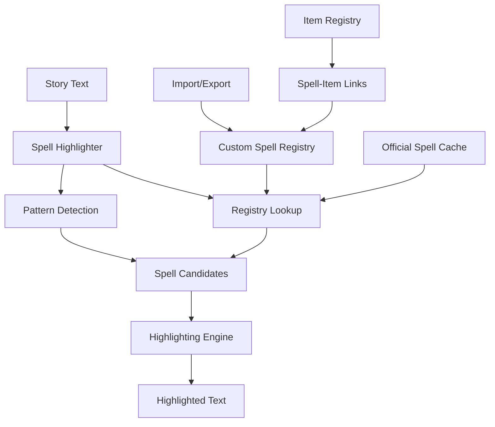

# Custom Spell Highlighting Plan

## Overview

This document describes the design for extending the spell highlighting system
to support homebrew and custom spells. Currently, the system only highlights
official D&D 5e spells via pattern matching. This plan adds a custom spell
registry, import/export capabilities, and integration with the existing
item registry system.

## Problem Statement

### Current Issues

1. **Official Spells Only**: The current spell highlighter in
   [`spell_highlighter.py`](src/utils/spell_highlighter.py) uses pattern
   matching that works well for official D&D 5e spells but cannot recognize
   homebrew spells.

2. **No Custom Spell Registry**: There is no way to define and store
   custom spells that should be highlighted in stories.

3. **No Import/Export**: Users cannot easily share custom spell lists
   between campaigns or with other DMs.

4. **No Integration with Items**: Custom spells and custom items are
   managed separately, despite often being related (e.g., magic items
   that cast spells).

### Evidence from Codebase

| Current State | Limitation |
|---------------|------------|
| Pattern-based detection | Cannot recognize custom spell names |
| No spell registry | Cannot store custom spell definitions |
| Separate from items | No relationship between spells and items |
| No import/export | Cannot share spell definitions |

---

## Proposed Solution

### High-Level Approach

1. **Custom Spell Registry**: Create a JSON-based registry for custom spells
   with metadata (school, level, source, description)
2. **Enhanced Spell Highlighter**: Update the highlighter to check both
   pattern-based detection and the custom registry
3. **Import/Export System**: Support for importing/exporting spell lists
   in various formats (JSON, CSV)
4. **Item Integration**: Link custom spells with magic items that cast them

### Spell Highlighting Architecture



---

## Implementation Details

### 1. Custom Spell Registry Schema

Create `game_data/spells/custom_spells.json`:

```json
{
  "registry_version": "1.0",
  "last_updated": "2026-02-13T00:00:00Z",
  "source": "homebrew",
  "spells": [
    {
      "name": "Void Bolt",
      "level": 3,
      "school": "necromancy",
      "casting_time": "1 action",
      "range": "120 feet",
      "components": {
        "verbal": true,
        "somatic": true,
        "material": "a shard of obsidian"
      },
      "duration": "instantaneous",
      "classes": ["sorcerer", "warlock", "wizard"],
      "description": "You hurl a bolt of void energy at a creature within range...",
      "source": "homebrew",
      "source_reference": "Campaign Homebrew - Void Magic",
      "tags": ["damage", "necromancy", "void"],
      "highlight_priority": 1,
      "aliases": ["void bolt", "Voidbolt"]
    },
    {
      "name": "Dragon's Breath",
      "level": 3,
      "school": "transmutation",
      "casting_time": "1 bonus action",
      "range": "touch",
      "components": {
        "verbal": true,
        "somatic": true,
        "material": "a piece of dragon scale"
      },
      "duration": "concentration, up to 1 minute",
      "classes": ["sorcerer", "wizard"],
      "description": "You touch one willing creature and imbue it with the power to spew magical energy...",
      "source": "official",
      "source_reference": "Xanathar's Guide to Everything",
      "tags": ["damage", "buff", "dragon"],
      "highlight_priority": 1,
      "aliases": []
    }
  ],
  "spell_groups": [
    {
      "name": "Void Magic",
      "description": "Spells related to the Void domain",
      "spells": ["Void Bolt", "Void Shield", "Void Step"]
    }
  ]
}
```

### 2. Custom Spell Registry Module

Create `src/spells/spell_registry.py`:

```python
"""Custom spell registry for homebrew and custom spells."""

from dataclasses import dataclass, field
from typing import Dict, List, Optional, Set
from pathlib import Path
import re

from src.utils.file_io import load_json_file, save_json_file
from src.utils.path_utils import get_game_data_path


@dataclass
class SpellComponents:
    """Spell components required for casting."""
    verbal: bool = False
    somatic: bool = False
    material: str = ""

    def to_dict(self) -> Dict:
        """Convert to dictionary."""
        return {
            "verbal": self.verbal,
            "somatic": self.somatic,
            "material": self.material
        }

    @classmethod
    def from_dict(cls, data: Dict) -> "SpellComponents":
        """Create from dictionary."""
        if isinstance(data, dict):
            return cls(
                verbal=data.get("verbal", False),
                somatic=data.get("somatic", False),
                material=data.get("material", "")
            )
        return cls()


@dataclass
class CustomSpell:
    """Represents a custom or homebrew spell."""
    name: str
    level: int
    school: str
    description: str

    # Optional fields
    casting_time: str = "1 action"
    range: str = "touch"
    components: SpellComponents = field(default_factory=SpellComponents)
    duration: str = "instantaneous"
    classes: List[str] = field(default_factory=list)
    source: str = "homebrew"
    source_reference: str = ""
    tags: List[str] = field(default_factory=list)
    highlight_priority: int = 1
    aliases: List[str] = field(default_factory=list)

    def to_dict(self) -> Dict:
        """Convert to dictionary for JSON serialization."""
        return {
            "name": self.name,
            "level": self.level,
            "school": self.school,
            "description": self.description,
            "casting_time": self.casting_time,
            "range": self.range,
            "components": self.components.to_dict(),
            "duration": self.duration,
            "classes": self.classes,
            "source": self.source,
            "source_reference": self.source_reference,
            "tags": self.tags,
            "highlight_priority": self.highlight_priority,
            "aliases": self.aliases
        }

    @classmethod
    def from_dict(cls, data: Dict) -> "CustomSpell":
        """Create from dictionary."""
        components_data = data.get("components", {})
        components = SpellComponents.from_dict(components_data)

        return cls(
            name=data["name"],
            level=data["level"],
            school=data["school"],
            description=data.get("description", ""),
            casting_time=data.get("casting_time", "1 action"),
            range=data.get("range", "touch"),
            components=components,
            duration=data.get("duration", "instantaneous"),
            classes=data.get("classes", []),
            source=data.get("source", "homebrew"),
            source_reference=data.get("source_reference", ""),
            tags=data.get("tags", []),
            highlight_priority=data.get("highlight_priority", 1),
            aliases=data.get("aliases", [])
        )

    def get_all_names(self) -> Set[str]:
        """Get all names this spell might be known by."""
        names = {self.name, self.name.lower()}
        for alias in self.aliases:
            names.add(alias)
            names.add(alias.lower())
        return names


class SpellRegistry:
    """Manages custom spell definitions."""

    def __init__(self):
        """Initialize the spell registry."""
        self._spells: Dict[str, CustomSpell] = {}  # name -> spell
        self._aliases: Dict[str, str] = {}  # alias/alternate -> canonical name
        self._by_school: Dict[str, List[str]] = {}
        self._by_level: Dict[int, List[str]] = {}
        self._by_class: Dict[str, List[str]] = {}
        self._by_tag: Dict[str, List[str]] = {}
        self._load_registry()

    @property
    def registry_path(self) -> Path:
        """Get the path to the custom spells registry."""
        return get_game_data_path() / "spells" / "custom_spells.json"

    def _load_registry(self) -> None:
        """Load the custom spells registry from file."""
        if not self.registry_path.exists():
            self._create_default_registry()
            return

        try:
            data = load_json_file(str(self.registry_path))
            self._parse_registry(data)
        except Exception:
            self._spells = {}

    def _create_default_registry(self) -> None:
        """Create a default empty registry file."""
        default_data = {
            "registry_version": "1.0",
            "last_updated": "",
            "source": "homebrew",
            "spells": [],
            "spell_groups": []
        }

        # Ensure directory exists
        self.registry_path.parent.mkdir(parents=True, exist_ok=True)
        save_json_file(str(self.registry_path), default_data)

    def _parse_registry(self, data: Dict) -> None:
        """Parse registry data into internal structures."""
        for spell_data in data.get("spells", []):
            spell = CustomSpell.from_dict(spell_data)
            self._add_spell_to_indexes(spell)

    def _add_spell_to_indexes(self, spell: CustomSpell) -> None:
        """Add a spell to all internal indexes."""
        name_lower = spell.name.lower()

        # Main spell index
        self._spells[name_lower] = spell

        # Alias index
        for alias in spell.get_all_names():
            self._aliases[alias.lower()] = spell.name

        # School index
        school_lower = spell.school.lower()
        if school_lower not in self._by_school:
            self._by_school[school_lower] = []
        self._by_school[school_lower].append(spell.name)

        # Level index
        if spell.level not in self._by_level:
            self._by_level[spell.level] = []
        self._by_level[spell.level].append(spell.name)

        # Class index
        for char_class in spell.classes:
            class_lower = char_class.lower()
            if class_lower not in self._by_class:
                self._by_class[class_lower] = []
            self._by_class[class_lower].append(spell.name)

        # Tag index
        for tag in spell.tags:
            tag_lower = tag.lower()
            if tag_lower not in self._by_tag:
                self._by_tag[tag_lower] = []
            self._by_tag[tag_lower].append(spell.name)

    def save_registry(self) -> None:
        """Save the current registry to file."""
        data = {
            "registry_version": "1.0",
            "last_updated": self._get_timestamp(),
            "source": "homebrew",
            "spells": [s.to_dict() for s in self._spells.values()],
            "spell_groups": []
        }

        save_json_file(str(self.registry_path), data)

    def _get_timestamp(self) -> str:
        """Get current timestamp in ISO format."""
        from datetime import datetime
        return datetime.now().isoformat()

    def add_spell(self, spell: CustomSpell) -> None:
        """Add a new spell to the registry."""
        self._add_spell_to_indexes(spell)
        self.save_registry()

    def remove_spell(self, name: str) -> bool:
        """Remove a spell from the registry."""
        name_lower = name.lower()

        if name_lower not in self._spells:
            return False

        spell = self._spells[name_lower]

        # Remove from all indexes
        del self._spells[name_lower]

        # Remove aliases
        for alias in spell.get_all_names():
            self._aliases.pop(alias.lower(), None)

        # Remove from other indexes
        self._by_school.get(spell.school.lower(), []).remove(spell.name)
        self._by_level.get(spell.level, []).remove(spell.name)

        for char_class in spell.classes:
            self._by_class.get(char_class.lower(), []).remove(spell.name)

        for tag in spell.tags:
            self._by_tag.get(tag.lower(), []).remove(spell.name)

        self.save_registry()
        return True

    def get_spell(self, name: str) -> Optional[CustomSpell]:
        """Get a spell by name or alias."""
        name_lower = name.lower()

        # Check direct match
        if name_lower in self._spells:
            return self._spells[name_lower]

        # Check aliases
        canonical_name = self._aliases.get(name_lower)
        if canonical_name:
            return self._spells.get(canonical_name.lower())

        return None

    def has_spell(self, name: str) -> bool:
        """Check if a spell exists in the registry."""
        return name.lower() in self._aliases

    def get_all_spell_names(self) -> Set[str]:
        """Get all spell names and aliases for highlighting."""
        return set(self._aliases.keys())

    def get_spells_by_school(self, school: str) -> List[CustomSpell]:
        """Get all spells of a specific school."""
        names = self._by_school.get(school.lower(), [])
        return [self._spells[n.lower()] for n in names if n.lower() in self._spells]

    def get_spells_by_level(self, level: int) -> List[CustomSpell]:
        """Get all spells of a specific level."""
        names = self._by_level.get(level, [])
        return [self._spells[n.lower()] for n in names if n.lower() in self._spells]

    def get_spells_by_class(self, char_class: str) -> List[CustomSpell]:
        """Get all spells available to a class."""
        names = self._by_class.get(char_class.lower(), [])
        return [self._spells[n.lower()] for n in names if n.lower() in self._spells]

    def get_spells_by_tag(self, tag: str) -> List[CustomSpell]:
        """Get all spells with a specific tag."""
        names = self._by_tag.get(tag.lower(), [])
        return [self._spells[n.lower()] for n in names if n.lower() in self._spells]

    def search_spells(self, query: str) -> List[CustomSpell]:
        """Search spells by name, description, or tags."""
        query_lower = query.lower()
        results = []

        for spell in self._spells.values():
            # Check name
            if query_lower in spell.name.lower():
                results.append(spell)
                continue

            # Check description
            if query_lower in spell.description.lower():
                results.append(spell)
                continue

            # Check tags
            for tag in spell.tags:
                if query_lower in tag.lower():
                    results.append(spell)
                    break

        return results


# Singleton instance
_spell_registry: Optional[SpellRegistry] = None


def get_spell_registry() -> SpellRegistry:
    """Get the singleton spell registry instance."""
    global _spell_registry
    if _spell_registry is None:
        _spell_registry = SpellRegistry()
    return _spell_registry
```

### 3. Enhanced Spell Highlighter

Update `src/utils/spell_highlighter.py`:

```python
"""
Spell Highlighting System for D&D Stories

This module provides automatic highlighting of spell names in story text.
Spell names are wrapped in bold markdown (**spell name**) for better readability.

Detection Strategy:
- Pattern matching for common spell contexts (cast, casts, casting, uses, channels)
- Capitalized words/phrases in spell contexts
- Custom spell registry lookup for homebrew spells
- Integration with RAG system for official D&D 5e spells
"""

import re
from typing import List, Set, Optional, Dict

# Import custom spell registry
from src.spells.spell_registry import get_spell_registry


# Common spell-related context words
SPELL_CONTEXTS = [
    r"\bcast(?:s|ing)?\b",
    r"\bchannels?\b",
    r"\binvokes?\b",
    r"\bconjures?\b",
    r"\bsummons?\b",
    r"\bweaves?\b",
    r"\bpreps?\b",
    r"\bprepares?\b",
    r"\bcompletes?\b",
    r"\bconcentrates? on\b",
    r"\bmaintains?\b",
    r"\breleases?\b",
]

# Pattern to match capitalized spell-like names after spell contexts
SPELL_PATTERN = re.compile(
    r"(?P<context>"
    + "|".join(SPELL_CONTEXTS)
    + r")\s+(?:a\s+|an\s+|the\s+)?(?P<spell>\b[A-Za-z][a-z]+(?:\s+[A-Za-z][a-z]+)?\b)"
    + r"(?=\s*(?:[,.\"]|and\b|to\b|the\b|in\b|on\b|$))",
    re.IGNORECASE,
)

# Pattern to match spell names in parentheses
PARENTHETICAL_SPELL = re.compile(r"\(([A-Z][a-z]+(?:\s+[A-Z][a-z]+)*)\)")

# Common false positives
FALSE_POSITIVES = {
    "The", "A", "An", "Their", "His", "Her", "My", "Your",
    "He", "She", "They", "I", "We", "You",
}


def get_all_known_spells() -> Set[str]:
    """Get all known spell names from all sources.

    Returns:
        Set of all known spell names (official + custom)
    """
    known_spells = set()

    # Get custom spells from registry
    registry = get_spell_registry()
    known_spells.update(registry.get_all_spell_names())

    # Could also add official spells from a cache or API
    # For now, we rely on pattern matching for official spells

    return known_spells


def highlight_spells_in_text(
    text: str,
    known_spells: Optional[Set[str]] = None,
    use_registry: bool = True
) -> str:
    """
    Highlight spell names in story text by wrapping them in bold markdown.

    When known_spells is provided (from user prompt), ONLY those spells are highlighted.
    When known_spells is empty, falls back to pattern-based detection and registry lookup.

    Args:
        text: Story text to process
        known_spells: Optional set of known spell names for more accurate matching
        use_registry: Whether to check the custom spell registry

    Returns:
        Text with spell names wrapped in **bold**
    """
    if not text:
        return text

    known_spells = known_spells or set()
    result_text = text
    highlighted_spells = set()

    # Add registry spells if enabled
    if use_registry:
        registry = get_spell_registry()
        known_spells = known_spells.union(registry.get_all_spell_names())

    # If we have known spells, highlight those
    if known_spells:
        for spell in known_spells:
            if spell.lower() in highlighted_spells:
                continue

            # Skip false positives
            if spell in FALSE_POSITIVES:
                continue

            # Create case-insensitive pattern
            pattern = re.compile(
                r"(?<!\*)\b" + re.escape(spell) + r"\b(?!\*)",
                re.IGNORECASE
            )

            def replace_spell(match):
                return f"**{match.group(0)}**"

            result_text = pattern.sub(replace_spell, result_text)
            highlighted_spells.add(spell.lower())

        return result_text

    # Fallback: Pattern-based detection
    def replace_spell_context(match):
        context = match.group("context")
        spell_full = match.group("spell")

        words = spell_full.split()
        spell = None

        # Try 2-word combinations first
        if len(words) >= 2:
            two_word = " ".join(words[:2])
            if use_registry:
                registry = get_spell_registry()
                if registry.has_spell(two_word):
                    spell = two_word

        # Try single word
        if not spell and len(words) >= 1:
            one_word = words[0]
            if use_registry:
                registry = get_spell_registry()
                if registry.has_spell(one_word):
                    spell = one_word

        # Use pattern-based detection if not in registry
        if not spell:
            spell = words[0] if words else None

        if not spell or spell in FALSE_POSITIVES:
            return match.group(0)

        if spell.lower() in highlighted_spells:
            return match.group(0)

        highlighted_spells.add(spell.lower())
        rest = spell_full[len(spell):]
        return f"{context} **{spell}**{rest}"

    result_text = SPELL_PATTERN.sub(replace_spell_context, result_text)

    # Second pass: Parenthetical spells
    def replace_parenthetical_spell(match):
        spell = match.group(1)

        if spell in FALSE_POSITIVES:
            return match.group(0)

        if spell.lower() in highlighted_spells:
            return match.group(0)

        # Check registry
        if use_registry:
            registry = get_spell_registry()
            if not registry.has_spell(spell):
                # Not a known spell, skip
                return match.group(0)

        highlighted_spells.add(spell.lower())
        return f"(**{spell}**)"

    result_text = PARENTHETICAL_SPELL.sub(replace_parenthetical_spell, result_text)

    return result_text


def extract_spells_from_prompt(prompt: str) -> Set[str]:
    """Extract spell/ability names mentioned in a user prompt.

    Searches for spells/abilities in spell contexts and returns the set
    of identified spells for use in highlighting.

    Args:
        prompt: User prompt text

    Returns:
        Set of spell/ability names found in the prompt
    """
    if not prompt:
        return set()

    spells = set()

    # Get registry for lookup
    registry = get_spell_registry()

    for match in SPELL_PATTERN.finditer(prompt):
        spell_full = match.group("spell")
        words = spell_full.split()

        # Try to find valid spell name
        for spell_candidate in [
            " ".join(words[:2]) if len(words) >= 2 else words[0],
            words[0],
        ]:
            if spell_candidate and spell_candidate not in FALSE_POSITIVES:
                # Check if it's a known custom spell
                if registry.has_spell(spell_candidate):
                    spells.add(spell_candidate.title())
                    break
                # Otherwise use pattern-based detection
                spell_title = spell_candidate.title()
                spells.add(spell_title)
                break

    return spells


def extract_known_spells_from_characters(characters: List[dict]) -> Set[str]:
    """
    Extract all known spells from character profiles.

    Args:
        characters: List of character profile dictionaries

    Returns:
        Set of known spell names
    """
    known_spells = set()

    # Get registry spells
    registry = get_spell_registry()
    known_spells.update(registry.get_all_spell_names())

    for char in characters:
        # From character sheet
        if "character_sheet" in char:
            sheet = char["character_sheet"]
            if "known_spells" in sheet:
                known_spells.update(s.lower() for s in sheet["known_spells"])

        # From spellcasting_notes
        if "spellcasting_notes" in char:
            notes = char["spellcasting_notes"]
            potential_spells = re.findall(
                r"\b[A-Z][a-z]+(?:\s+[A-Z][a-z]+)*\b",
                notes
            )
            known_spells.update(s.lower() for s in potential_spells)

    return known_spells


def highlight_spells_in_story_sections(
    story_data: dict,
    known_spells: Optional[Set[str]] = None
) -> dict:
    """
    Apply spell highlighting to all narrative sections of a story.

    Args:
        story_data: Story dictionary with various sections
        known_spells: Optional set of known spell names

    Returns:
        Story dictionary with highlighted spell names
    """
    if not story_data:
        return story_data

    narrative_sections = [
        "story_narrative",
        "narrative",
        "session_summary",
        "combat_narrative",
        "scene_description",
    ]

    for section in narrative_sections:
        if section in story_data and isinstance(story_data[section], str):
            story_data[section] = highlight_spells_in_text(
                story_data[section],
                known_spells
            )

    return story_data
```

### 4. Import/Export System

Create `src/spells/spell_import_export.py`:

```python
"""Import and export functionality for custom spells."""

import csv
import json
from typing import List, Dict, Optional
from pathlib import Path

from src.spells.spell_registry import CustomSpell, SpellRegistry, get_spell_registry
from src.utils.file_io import load_json_file, save_json_file


class SpellImporter:
    """Import spells from various formats."""

    def __init__(self, registry: Optional[SpellRegistry] = None):
        """Initialize importer.

        Args:
            registry: Spell registry to import into
        """
        self.registry = registry or get_spell_registry()

    def import_from_json(
        self,
        file_path: str,
        merge: bool = True
    ) -> Dict[str, int]:
        """Import spells from a JSON file.

        Args:
            file_path: Path to JSON file
            merge: If True, merge with existing; if False, replace

        Returns:
            Dictionary with import statistics
        """
        data = load_json_file(file_path)

        stats = {
            "imported": 0,
            "skipped": 0,
            "errors": 0
        }

        spells_data = data.get("spells", [])

        for spell_data in spells_data:
            try:
                spell = CustomSpell.from_dict(spell_data)

                if self.registry.has_spell(spell.name):
                    stats["skipped"] += 1
                    continue

                self.registry.add_spell(spell)
                stats["imported"] += 1

            except Exception:
                stats["errors"] += 1

        return stats

    def import_from_csv(
        self,
        file_path: str,
        column_mapping: Optional[Dict[str, str]] = None
    ) -> Dict[str, int]:
        """Import spells from a CSV file.

        Args:
            file_path: Path to CSV file
            column_mapping: Mapping of CSV columns to spell fields

        Returns:
            Dictionary with import statistics
        """
        default_mapping = {
            "name": "name",
            "level": "level",
            "school": "school",
            "description": "description",
            "classes": "classes",
            "casting_time": "casting_time",
            "range": "range",
            "duration": "duration"
        }

        mapping = column_mapping or default_mapping

        stats = {
            "imported": 0,
            "skipped": 0,
            "errors": 0
        }

        with open(file_path, "r", encoding="utf-8") as f:
            reader = csv.DictReader(f)

            for row in reader:
                try:
                    spell_data = {}

                    for csv_col, spell_field in mapping.items():
                        if csv_col in row:
                            value = row[csv_col]

                            # Handle special fields
                            if spell_field == "level":
                                value = int(value) if value.isdigit() else 0
                            elif spell_field == "classes":
                                value = [c.strip() for c in value.split(",")]

                            spell_data[spell_field] = value

                    # Ensure required fields
                    if not spell_data.get("name"):
                        stats["errors"] += 1
                        continue

                    spell_data.setdefault("level", 0)
                    spell_data.setdefault("school", "unknown")
                    spell_data.setdefault("description", "")

                    spell = CustomSpell.from_dict(spell_data)

                    if self.registry.has_spell(spell.name):
                        stats["skipped"] += 1
                        continue

                    self.registry.add_spell(spell)
                    stats["imported"] += 1

                except Exception:
                    stats["errors"] += 1

        return stats

    def import_from_dnd_beyond(
        self,
        file_path: str
    ) -> Dict[str, int]:
        """Import spells from D&D Beyond export format.

        Args:
            file_path: Path to D&D Beyond export file

        Returns:
            Dictionary with import statistics
        """
        # D&D Beyond has a specific export format
        # This would need to be implemented based on their actual format
        data = load_json_file(file_path)

        stats = {
            "imported": 0,
            "skipped": 0,
            "errors": 0
        }

        # Implementation depends on D&D Beyond format
        # Placeholder for now

        return stats


class SpellExporter:
    """Export spells to various formats."""

    def __init__(self, registry: Optional[SpellRegistry] = None):
        """Initialize exporter.

        Args:
            registry: Spell registry to export from
        """
        self.registry = registry or get_spell_registry()

    def export_to_json(
        self,
        file_path: str,
        spells: Optional[List[CustomSpell]] = None,
        include_metadata: bool = True
    ) -> None:
        """Export spells to a JSON file.

        Args:
            file_path: Path to output file
            spells: Specific spells to export, or all if None
            include_metadata: Include registry metadata
        """
        if spells is None:
            spells = list(self.registry._spells.values())

        data = {
            "registry_version": "1.0",
            "spells": [s.to_dict() for s in spells]
        }

        if include_metadata:
            from datetime import datetime
            data["exported_at"] = datetime.now().isoformat()
            data["spell_count"] = len(spells)

        save_json_file(file_path, data)

    def export_to_csv(
        self,
        file_path: str,
        spells: Optional[List[CustomSpell]] = None
    ) -> None:
        """Export spells to a CSV file.

        Args:
            file_path: Path to output file
            spells: Specific spells to export, or all if None
        """
        if spells is None:
            spells = list(self.registry._spells.values())

        fieldnames = [
            "name", "level", "school", "description",
            "casting_time", "range", "duration",
            "classes", "source", "tags"
        ]

        with open(file_path, "w", encoding="utf-8", newline="") as f:
            writer = csv.DictWriter(f, fieldnames=fieldnames)
            writer.writeheader()

            for spell in spells:
                row = {
                    "name": spell.name,
                    "level": spell.level,
                    "school": spell.school,
                    "description": spell.description,
                    "casting_time": spell.casting_time,
                    "range": spell.range,
                    "duration": spell.duration,
                    "classes": ",".join(spell.classes),
                    "source": spell.source,
                    "tags": ",".join(spell.tags)
                }
                writer.writerow(row)

    def export_to_markdown(
        self,
        file_path: str,
        spells: Optional[List[CustomSpell]] = None,
        title: str = "Custom Spells"
    ) -> None:
        """Export spells to a markdown file.

        Args:
            file_path: Path to output file
            spells: Specific spells to export, or all if None
            title: Title for the document
        """
        if spells is None:
            spells = list(self.registry._spells.values())

        lines = [
            f"# {title}",
            "",
            f"**Total Spells:** {len(spells)}",
            ""
        ]

        # Group by level
        by_level: Dict[int, List[CustomSpell]] = {}
        for spell in spells:
            level = spell.level
            if level not in by_level:
                by_level[level] = []
            by_level[level].append(spell)

        # Sort and output
        for level in sorted(by_level.keys()):
            level_name = self._level_name(level)
            lines.append(f"## {level_name}")
            lines.append("")

            for spell in sorted(by_level[level], key=lambda s: s.name):
                lines.append(f"### {spell.name}")
                lines.append("")
                lines.append(f"**School:** {spell.school.title()}")
                lines.append(f"**Casting Time:** {spell.casting_time}")
                lines.append(f"**Range:** {spell.range}")
                lines.append(f"**Duration:** {spell.duration}")

                if spell.classes:
                    lines.append(f"**Classes:** {', '.join(spell.classes)}")

                lines.append("")
                lines.append(spell.description)
                lines.append("")

            lines.append("---")
            lines.append("")

        with open(file_path, "w", encoding="utf-8") as f:
            f.write("\n".join(lines))

    def _level_name(self, level: int) -> str:
        """Get the name for a spell level."""
        if level == 0:
            return "Cantrips (0 Level)"
        elif level == 1:
            return "1st Level Spells"
        elif level == 2:
            return "2nd Level Spells"
        elif level == 3:
            return "3rd Level Spells"
        else:
            return f"{level}th Level Spells"
```

### 5. Item Integration

Create `src/spells/spell_item_integration.py`:

```python
"""Integration between spells and magic items."""

from typing import Dict, List, Optional, Set
from dataclasses import dataclass

from src.spells.spell_registry import CustomSpell, get_spell_registry
from src.items.item_registry import get_item_registry


@dataclass
class SpellItemLink:
    """Represents a link between a spell and a magic item."""
    item_name: str
    spell_name: str
    link_type: str  # "casts", "contains", "enhances", "requires"
    charges: int = 0
    description: str = ""


class SpellItemIntegration:
    """Manages relationships between spells and items."""

    def __init__(self):
        """Initialize the integration manager."""
        self.spell_registry = get_spell_registry()
        self.item_registry = get_item_registry()
        self._links: Dict[str, List[SpellItemLink]] = {}  # item_name -> links

    def link_spell_to_item(
        self,
        item_name: str,
        spell_name: str,
        link_type: str = "casts",
        charges: int = 0,
        description: str = ""
    ) -> SpellItemLink:
        """Create a link between a spell and an item.

        Args:
            item_name: Name of the magic item
            spell_name: Name of the spell
            link_type: Type of link (casts, contains, enhances, requires)
            charges: Number of charges if applicable
            description: Description of how the item uses the spell

        Returns:
            The created link
        """
        link = SpellItemLink(
            item_name=item_name,
            spell_name=spell_name,
            link_type=link_type,
            charges=charges,
            description=description
        )

        if item_name not in self._links:
            self._links[item_name] = []
        self._links[item_name].append(link)

        # Ensure spell exists in registry
        if not self.spell_registry.has_spell(spell_name):
            # Create a basic spell entry
            spell = CustomSpell(
                name=spell_name,
                level=0,
                school="unknown",
                description=f"Spell cast by {item_name}",
                source="item"
            )
            self.spell_registry.add_spell(spell)

        return link

    def get_spells_for_item(self, item_name: str) -> List[CustomSpell]:
        """Get all spells associated with an item.

        Args:
            item_name: Name of the item

        Returns:
            List of spells linked to the item
        """
        links = self._links.get(item_name, [])
        spells = []

        for link in links:
            spell = self.spell_registry.get_spell(link.spell_name)
            if spell:
                spells.append(spell)

        return spells

    def get_items_for_spell(self, spell_name: str) -> List[str]:
        """Get all items that use a specific spell.

        Args:
            spell_name: Name of the spell

        Returns:
            List of item names that use the spell
        """
        items = []

        for item_name, links in self._links.items():
            for link in links:
                if link.spell_name.lower() == spell_name.lower():
                    items.append(item_name)
                    break

        return items

    def import_from_items(self) -> int:
        """Import spells from magic items in the item registry.

        Scans items for spell-related properties and creates
        corresponding spell entries.

        Returns:
            Number of spells imported
        """
        imported = 0

        # Get all items from registry
        items = self.item_registry.get_all_items()

        for item in items:
            # Check for spell-related properties
            spell_properties = [
                "spell", "spells", "casts", "contains_spell",
                "spell_effect", "grants_spell"
            ]

            for prop in spell_properties:
                if prop in item:
                    spell_names = self._extract_spell_names(item[prop])

                    for spell_name in spell_names:
                        if not self.spell_registry.has_spell(spell_name):
                            # Create basic spell entry
                            spell = CustomSpell(
                                name=spell_name,
                                level=0,
                                school="unknown",
                                description=f"Spell from {item.get('name', 'unknown item')}",
                                source="item"
                            )
                            self.spell_registry.add_spell(spell)
                            imported += 1

                        # Create link
                        self.link_spell_to_item(
                            item_name=item.get("name", ""),
                            spell_name=spell_name,
                            link_type="casts"
                        )

        return imported

    def _extract_spell_names(self, value) -> List[str]:
        """Extract spell names from a property value."""
        if isinstance(value, str):
            # Could be a single spell name or comma-separated
            return [s.strip() for s in value.split(",") if s.strip()]
        elif isinstance(value, list):
            return [str(s).strip() for s in value if s]
        return []
```

---

## Affected Files

### New Files to Create

| File | Purpose |
|------|---------|
| `src/spells/__init__.py` | Package initialization |
| `src/spells/spell_registry.py` | Custom spell registry |
| `src/spells/spell_import_export.py` | Import/export functionality |
| `src/spells/spell_item_integration.py` | Item integration |
| `game_data/spells/custom_spells.json` | Default spell registry |
| `tests/spells/test_spell_registry.py` | Registry tests |
| `tests/spells/test_spell_import_export.py` | Import/export tests |

### Files to Modify

| File | Changes |
|------|---------|
| `src/utils/spell_highlighter.py` | Add registry integration |
| `src/items/item_registry.py` | Add spell linking support |
| `src/cli/cli_story_manager.py` | Add spell management commands |

---

## Testing Strategy

### Unit Tests

1. **Spell Registry Tests**
   - Test spell creation and retrieval
   - Test alias handling
   - Test indexing by school, level, class

2. **Highlighter Tests**
   - Test highlighting with registry
   - Test pattern-based fallback
   - Test mixed official/custom spells

3. **Import/Export Tests**
   - Test JSON import/export
   - Test CSV import/export
   - Test markdown export

### Integration Tests

1. **Story Integration**
   - Test highlighting in real stories
   - Test with character known spells
   - Test with item-granted spells

### Test Data

Use existing test data:
- Add custom spells to test registry
- Test with existing story files
- Test with existing item registry

---

## Migration Path

### Phase 1: Registry Infrastructure

1. Create `src/spells/` package
2. Implement spell registry
3. Create default registry file
4. Add unit tests

### Phase 2: Highlighter Integration

1. Update spell_highlighter.py
2. Add registry lookup
3. Test with existing stories
4. Ensure backward compatibility

### Phase 3: Import/Export

1. Implement import/export module
2. Add CLI commands
3. Test with various formats
4. Add documentation

### Phase 4: Item Integration

1. Implement item integration
2. Scan existing items for spells
3. Create links automatically
4. Test end-to-end

### Backward Compatibility

- Existing highlighter works without registry
- Registry is optional enhancement
- No breaking changes to existing APIs

---

## Dependencies

### Internal Dependencies

- `src/utils/file_io.py` - JSON loading/saving
- `src/utils/path_utils.py` - Path resolution
- `src/items/item_registry.py` - Item integration

### External Dependencies

None - uses only Python standard library

### Optional Dependencies

- Integration with RAG system for official spell lookup
- Integration with export plan for spell documentation

---

## Future Enhancements

1. **Spell Validation**: Validate spells against D&D 5e rules
2. **Spell Balancing**: AI-assisted spell balancing suggestions
3. **Spell Cards**: Generate printable spell cards
4. **Wiki Integration**: Link to D&D wiki for spell details
5. **Spell Search**: Advanced search with filters and sorting
