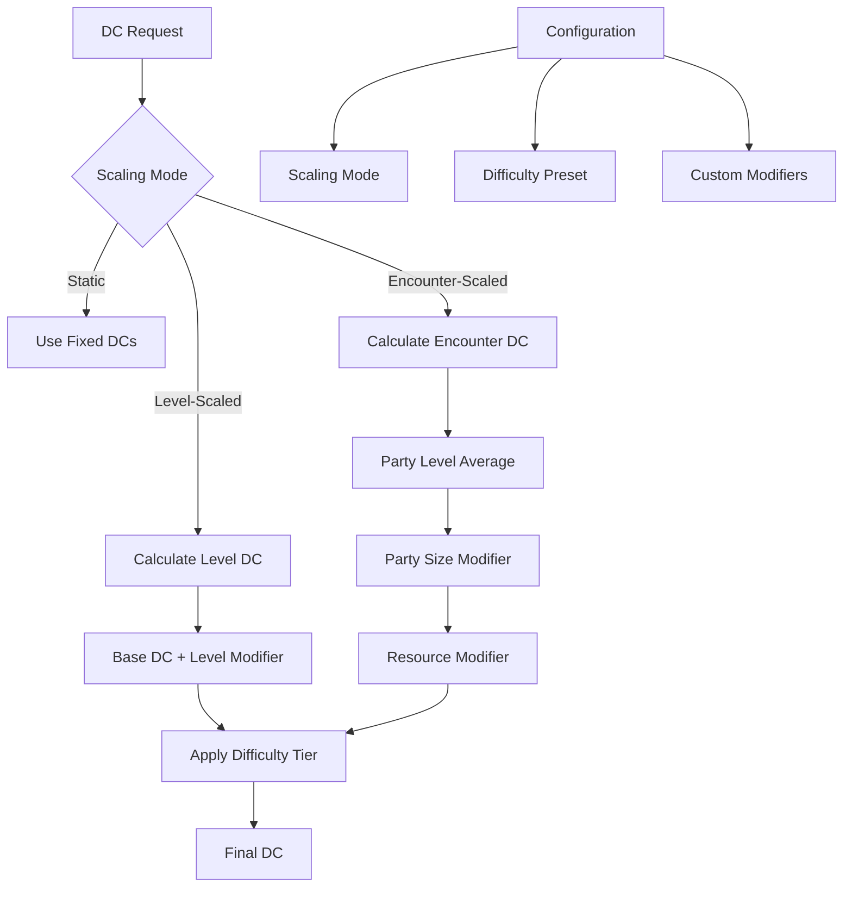

# DC Difficulty Scaling Plan

## Overview

This document describes the design for level-based DC (Difficulty Class) scaling
and encounter difficulty recommendations. The goal is to provide DMs with
intelligent DC suggestions that account for party level, encounter context,
and desired difficulty level.

## Problem Statement

### Current Issues

1. **Static DC Values**: The current system uses fixed DC values (10, 15, 20)
   that don't account for character level or party composition.

2. **No Level Scaling**: A DC 15 check is equally difficult for a level 1
   character as for a level 20 character, which doesn't reflect D&D 5e design.

3. **No Encounter Scaling**: No support for scaling encounter difficulty based
   on party size, level, or resources.

4. **Limited Context Awareness**: DC suggestions don't consider the broader
   context of the campaign or recent events.

### Evidence from Codebase

| File | Current Implementation | Limitation |
|------|----------------------|------------|
| `dnd_rules.py` | `DC_EASY=10, DC_MEDIUM=15, DC_HARD=20` | Static values |
| `consultant_dc.py` | Uses `DC_MEDIUM` as base | No level scaling |
| No encounter scaling | N/A | Missing feature |
| No difficulty presets | N/A | Missing feature |

---

## Proposed Solution

### High-Level Approach

1. **Level-Based DC Formulas**: Implement formulas that scale DCs based on
   character/party level
2. **Difficulty Tiers**: Define clear difficulty tiers with scaling rules
3. **Encounter Scaling**: Add encounter difficulty calculation based on
   party composition
4. **Configuration Options**: Allow DMs to customize scaling behavior

### DC Scaling Architecture



---

## Implementation Details

### 1. DC Scaling Constants

Update `src/utils/dnd_rules.py`:

```python
"""D&D 5e rules and constants with DC scaling support."""

from enum import Enum
from typing import Dict, List, Optional, Tuple


class DifficultyTier(Enum):
    """Difficulty tiers for DC scaling."""
    TRIVIAL = "trivial"        # Should always succeed
    EASY = "easy"              # Unlikely to fail
    MEDIUM = "medium"          # Fair chance
    HARD = "hard"              # Challenging
    VERY_HARD = "very_hard"    # Very challenging
    NEARLY_IMPOSSIBLE = "nearly_impossible"  # Heroic effort


class ScalingMode(Enum):
    """DC scaling modes."""
    STATIC = "static"          # Fixed DCs regardless of level
    LINEAR = "linear"          # Linear scaling with level
    TIERED = "tiered"          # Tier-based scaling (5e style)
    PROFICIENCY = "proficiency"  # Scale with proficiency bonus


# Base DC values for each difficulty tier
BASE_DC: Dict[DifficultyTier, int] = {
    DifficultyTier.TRIVIAL: 5,
    DifficultyTier.EASY: 10,
    DifficultyTier.MEDIUM: 15,
    DifficultyTier.HARD: 20,
    DifficultyTier.VERY_HARD: 25,
    DifficultyTier.NEARLY_IMPOSSIBLE: 30,
}

# Level-based DC modifiers for tiered scaling
# Based on D&D 5e encounter building guidelines
LEVEL_DC_MODIFIERS: Dict[int, Dict[DifficultyTier, int]] = {
    # Levels 1-4: Heroic Tier
    1: {DifficultyTier.EASY: 8, DifficultyTier.MEDIUM: 13, DifficultyTier.HARD: 18},
    2: {DifficultyTier.EASY: 8, DifficultyTier.MEDIUM: 13, DifficultyTier.HARD: 18},
    3: {DifficultyTier.EASY: 9, DifficultyTier.MEDIUM: 14, DifficultyTier.HARD: 19},
    4: {DifficultyTier.EASY: 9, DifficultyTier.MEDIUM: 14, DifficultyTier.HARD: 19},
    # Levels 5-10: Paragon Tier
    5: {DifficultyTier.EASY: 10, DifficultyTier.MEDIUM: 15, DifficultyTier.HARD: 20},
    6: {DifficultyTier.EASY: 10, DifficultyTier.MEDIUM: 15, DifficultyTier.HARD: 20},
    7: {DifficultyTier.EASY: 11, DifficultyTier.MEDIUM: 16, DifficultyTier.HARD: 21},
    8: {DifficultyTier.EASY: 11, DifficultyTier.MEDIUM: 16, DifficultyTier.HARD: 21},
    9: {DifficultyTier.EASY: 12, DifficultyTier.MEDIUM: 17, DifficultyTier.HARD: 22},
    10: {DifficultyTier.EASY: 12, DifficultyTier.MEDIUM: 17, DifficultyTier.HARD: 22},
    # Levels 11-16: Epic Tier
    11: {DifficultyTier.EASY: 13, DifficultyTier.MEDIUM: 18, DifficultyTier.HARD: 23},
    12: {DifficultyTier.EASY: 13, DifficultyTier.MEDIUM: 18, DifficultyTier.HARD: 23},
    13: {DifficultyTier.EASY: 14, DifficultyTier.MEDIUM: 19, DifficultyTier.HARD: 24},
    14: {DifficultyTier.EASY: 14, DifficultyTier.MEDIUM: 19, DifficultyTier.HARD: 24},
    15: {DifficultyTier.EASY: 15, DifficultyTier.MEDIUM: 20, DifficultyTier.HARD: 25},
    16: {DifficultyTier.EASY: 15, DifficultyTier.MEDIUM: 20, DifficultyTier.HARD: 25},
    # Levels 17-20: Legendary Tier
    17: {DifficultyTier.EASY: 16, DifficultyTier.MEDIUM: 21, DifficultyTier.HARD: 26},
    18: {DifficultyTier.EASY: 16, DifficultyTier.MEDIUM: 21, DifficultyTier.HARD: 26},
    19: {DifficultyTier.EASY: 17, DifficultyTier.MEDIUM: 22, DifficultyTier.HARD: 27},
    20: {DifficultyTier.EASY: 17, DifficultyTier.MEDIUM: 22, DifficultyTier.HARD: 27},
}

# Proficiency bonus by level
PROFICIENCY_BY_LEVEL: Dict[int, int] = {
    1: 2, 2: 2, 3: 2, 4: 2,
    5: 3, 6: 3, 7: 3, 8: 3,
    9: 4, 10: 4, 11: 4, 12: 4,
    13: 5, 14: 5, 15: 5, 16: 5,
    17: 6, 18: 6, 19: 6, 20: 6,
}


def get_proficiency_bonus(level: int) -> int:
    """Get proficiency bonus for a character level."""
    return PROFICIENCY_BY_LEVEL.get(min(max(level, 1), 20), 2)


def get_dc_for_difficulty(
    difficulty: DifficultyTier,
    level: Optional[int] = None,
    scaling_mode: ScalingMode = ScalingMode.TIERED
) -> int:
    """Calculate DC for a given difficulty and level.

    Args:
        difficulty: The difficulty tier
        level: Character or party level (1-20)
        scaling_mode: How to scale the DC

    Returns:
        The calculated DC value
    """
    base_dc = BASE_DC.get(difficulty, 15)

    if level is None or scaling_mode == ScalingMode.STATIC:
        return base_dc

    if scaling_mode == ScalingMode.LINEAR:
        # Linear scaling: +1 DC per 2 levels
        level_modifier = (level - 1) // 2
        return base_dc + level_modifier

    if scaling_mode == ScalingMode.TIERED:
        # Use tier-based modifiers
        level_mods = LEVEL_DC_MODIFIERS.get(level, {})
        return level_mods.get(difficulty, base_dc)

    if scaling_mode == ScalingMode.PROFICIENCY:
        # Scale with proficiency bonus
        prof = get_proficiency_bonus(level)
        return base_dc + (prof - 2)  # -2 because base prof is 2

    return base_dc


# Legacy constants for backward compatibility
DC_EASY = 10
DC_MEDIUM = 15
DC_HARD = 20


def get_dc_for_difficulty_legacy(difficulty: str) -> int:
    """Legacy function for backward compatibility."""
    difficulty_map = {
        "easy": DC_EASY,
        "medium": DC_MEDIUM,
        "hard": DC_HARD,
    }
    return difficulty_map.get(difficulty.lower(), DC_MEDIUM)
```

### 2. Encounter Difficulty Calculator

Create `src/encounters/encounter_scaler.py`:

```python
"""Encounter difficulty scaling and calculation."""

from dataclasses import dataclass
from typing import List, Dict, Optional, Tuple
from enum import Enum

from src.utils.dnd_rules import (
    DifficultyTier,
    get_dc_for_difficulty,
    get_proficiency_bonus
)


class EncounterDifficulty(Enum):
    """Overall encounter difficulty ratings."""
    TRIVIAL = "trivial"      # Party should breeze through
    EASY = "easy"            # Minor resource expenditure
    MEDIUM = "medium"        # Moderate challenge
    HARD = "hard"            # Significant challenge
    DEADLY = "deadly"        # Risk of character death


@dataclass
class PartyMember:
    """Represents a party member for encounter scaling."""
    name: str
    level: int
    character_class: str
    max_hp: int
    armor_class: int

    @property
    def proficiency_bonus(self) -> int:
        return get_proficiency_bonus(self.level)


@dataclass
class EncounterMetrics:
    """Calculated metrics for an encounter."""
    difficulty: EncounterDifficulty
    average_party_level: float
    effective_party_size: float
    suggested_dc_range: Tuple[int, int]
    threat_level: str
    resource_drain_estimate: str  # low, medium, high, extreme


class EncounterScaler:
    """Calculates and scales encounter difficulty."""

    # XP thresholds by character level for encounter difficulty
    # Based on D&D 5e encounter building guidelines
    XP_THRESHOLDS: Dict[int, Dict[EncounterDifficulty, int]] = {
        1: {EncounterDifficulty.EASY: 25, EncounterDifficulty.MEDIUM: 50,
            EncounterDifficulty.HARD: 75, EncounterDifficulty.DEADLY: 100},
        2: {EncounterDifficulty.EASY: 50, EncounterDifficulty.MEDIUM: 100,
            EncounterDifficulty.HARD: 150, EncounterDifficulty.DEADLY: 200},
        3: {EncounterDifficulty.EASY: 75, EncounterDifficulty.MEDIUM: 150,
            EncounterDifficulty.HARD: 225, EncounterDifficulty.DEADLY: 400},
        4: {EncounterDifficulty.EASY: 125, EncounterDifficulty.MEDIUM: 250,
            EncounterDifficulty.HARD: 375, EncounterDifficulty.DEADLY: 500},
        5: {EncounterDifficulty.EASY: 250, EncounterDifficulty.MEDIUM: 500,
            EncounterDifficulty.HARD: 750, EncounterDifficulty.DEADLY: 1100},
        6: {EncounterDifficulty.EASY: 300, EncounterDifficulty.MEDIUM: 600,
            EncounterDifficulty.HARD: 900, EncounterDifficulty.DEADLY: 1400},
        7: {EncounterDifficulty.EASY: 350, EncounterDifficulty.MEDIUM: 750,
            EncounterDifficulty.HARD: 1100, EncounterDifficulty.DEADLY: 1700},
        8: {EncounterDifficulty.EASY: 450, EncounterDifficulty.MEDIUM: 900,
            EncounterDifficulty.HARD: 1400, EncounterDifficulty.DEADLY: 2100},
        9: {EncounterDifficulty.EASY: 550, EncounterDifficulty.MEDIUM: 1100,
            EncounterDifficulty.HARD: 1600, EncounterDifficulty.DEADLY: 2400},
        10: {EncounterDifficulty.EASY: 600, EncounterDifficulty.MEDIUM: 1200,
             EncounterDifficulty.HARD: 1900, EncounterDifficulty.DEADLY: 2800},
        11: {EncounterDifficulty.EASY: 800, EncounterDifficulty.MEDIUM: 1600,
             EncounterDifficulty.HARD: 2400, EncounterDifficulty.DEADLY: 3600},
        12: {EncounterDifficulty.EASY: 1000, EncounterDifficulty.MEDIUM: 2000,
             EncounterDifficulty.HARD: 3000, EncounterDifficulty.DEADLY: 4500},
        13: {EncounterDifficulty.EASY: 1100, EncounterDifficulty.MEDIUM: 2200,
             EncounterDifficulty.HARD: 3400, EncounterDifficulty.DEADLY: 5100},
        14: {EncounterDifficulty.EASY: 1250, EncounterDifficulty.MEDIUM: 2500,
             EncounterDifficulty.HARD: 3800, EncounterDifficulty.DEADLY: 5700},
        15: {EncounterDifficulty.EASY: 1400, EncounterDifficulty.MEDIUM: 2800,
             EncounterDifficulty.HARD: 4300, EncounterDifficulty.DEADLY: 6400},
        16: {EncounterDifficulty.EASY: 1600, EncounterDifficulty.MEDIUM: 3200,
             EncounterDifficulty.HARD: 4800, EncounterDifficulty.DEADLY: 7200},
        17: {EncounterDifficulty.EASY: 2000, EncounterDifficulty.MEDIUM: 3900,
             EncounterDifficulty.HARD: 5900, EncounterDifficulty.DEADLY: 8800},
        18: {EncounterDifficulty.EASY: 2100, EncounterDifficulty.MEDIUM: 4200,
             EncounterDifficulty.HARD: 6300, EncounterDifficulty.DEADLY: 9500},
        19: {EncounterDifficulty.EASY: 2400, EncounterDifficulty.MEDIUM: 4900,
             EncounterDifficulty.HARD: 7300, EncounterDifficulty.DEADLY: 10900},
        20: {EncounterDifficulty.EASY: 2800, EncounterDifficulty.MEDIUM: 5700,
             EncounterDifficulty.HARD: 8500, EncounterDifficulty.DEADLY: 12700},
    }

    # Party size adjustment multipliers
    PARTY_SIZE_MULTIPLIERS: Dict[int, float] = {
        1: 0.5,   # Solo adventurer
        2: 0.75,  # Duo
        3: 1.0,   # Small party
        4: 1.0,   # Standard party
        5: 1.25,  # Large party
        6: 1.5,   # Very large party
        7: 1.75,  # Huge party
        8: 2.0,   # Massive party
    }

    def __init__(self, party: List[PartyMember]):
        self.party = party

    @property
    def average_level(self) -> float:
        """Calculate average party level."""
        if not self.party:
            return 1.0
        return sum(m.level for m in self.party) / len(self.party)

    @property
    def party_size(self) -> int:
        """Get party size."""
        return len(self.party)

    def get_party_xp_threshold(
        self,
        difficulty: EncounterDifficulty
    ) -> int:
        """Calculate total XP threshold for the party.

        Args:
            difficulty: The encounter difficulty to calculate for

        Returns:
            Total XP threshold for the party
        """
        total_threshold = 0

        for member in self.party:
            level_thresholds = self.XP_THRESHOLDS.get(member.level, {})
            threshold = level_thresholds.get(difficulty, 0)
            total_threshold += threshold

        # Apply party size multiplier
        size_mult = self.PARTY_SIZE_MULTIPLIERS.get(self.party_size, 1.0)

        return int(total_threshold * size_mult)

    def assess_encounter(
        self,
        enemy_xp_total: int,
        enemy_count: int = 1
    ) -> EncounterMetrics:
        """Assess encounter difficulty based on enemy XP.

        Args:
            enemy_xp_total: Total XP value of all enemies
            enemy_count: Number of enemies

        Returns:
            EncounterMetrics with difficulty assessment
        """
        # Apply encounter size multiplier for many enemies
        encounter_multiplier = self._get_encounter_multiplier(enemy_count)
        adjusted_xp = enemy_xp_total * encounter_multiplier

        # Determine difficulty
        if adjusted_xp <= self.get_party_xp_threshold(EncounterDifficulty.EASY):
            difficulty = EncounterDifficulty.TRIVIAL
        elif adjusted_xp <= self.get_party_xp_threshold(EncounterDifficulty.MEDIUM):
            difficulty = EncounterDifficulty.EASY
        elif adjusted_xp <= self.get_party_xp_threshold(EncounterDifficulty.HARD):
            difficulty = EncounterDifficulty.MEDIUM
        elif adjusted_xp <= self.get_party_xp_threshold(EncounterDifficulty.DEADLY):
            difficulty = EncounterDifficulty.HARD
        else:
            difficulty = EncounterDifficulty.DEADLY

        # Calculate suggested DC range
        avg_level = int(self.average_level)
        easy_dc = get_dc_for_difficulty(DifficultyTier.EASY, avg_level)
        hard_dc = get_dc_for_difficulty(DifficultyTier.HARD, avg_level)

        # Estimate resource drain
        resource_drain = self._estimate_resource_drain(difficulty)

        return EncounterMetrics(
            difficulty=difficulty,
            average_party_level=self.average_level,
            effective_party_size=self.party_size * encounter_multiplier,
            suggested_dc_range=(easy_dc, hard_dc),
            threat_level=self._get_threat_level(difficulty),
            resource_drain_estimate=resource_drain
        )

    def suggest_encounter_dc(
        self,
        check_type: str,
        desired_difficulty: DifficultyTier = DifficultyTier.MEDIUM
    ) -> int:
        """Suggest DC for a check in this encounter.

        Args:
            check_type: Type of check (e.g., 'attack', 'save', 'skill')
            desired_difficulty: How hard the check should be

        Returns:
            Suggested DC value
        """
        avg_level = int(round(self.average_level))
        return get_dc_for_difficulty(desired_difficulty, avg_level)

    def _get_encounter_multiplier(self, enemy_count: int) -> float:
        """Get multiplier for number of enemies."""
        multipliers = {
            1: 1.0,
            2: 1.5,
            3: 2.0,
            4: 2.0,
            5: 2.0,
            6: 2.0,
            7: 2.5,
            8: 2.5,
            9: 2.5,
            10: 2.5,
            11: 3.0,
            12: 3.0,
            13: 3.0,
            14: 3.0,
            15: 4.0,
        }
        return multipliers.get(enemy_count, 4.0)

    def _estimate_resource_drain(self, difficulty: EncounterDifficulty) -> str:
        """Estimate resource drain for encounter difficulty."""
        drain_map = {
            EncounterDifficulty.TRIVIAL: "none",
            EncounterDifficulty.EASY: "low",
            EncounterDifficulty.MEDIUM: "medium",
            EncounterDifficulty.HARD: "high",
            EncounterDifficulty.DEADLY: "extreme",
        }
        return drain_map.get(difficulty, "medium")

    def _get_threat_level(self, difficulty: EncounterDifficulty) -> str:
        """Get descriptive threat level."""
        threat_map = {
            EncounterDifficulty.TRIVIAL: "Negligible - party should handle easily",
            EncounterDifficulty.EASY: "Low - minor challenge expected",
            EncounterDifficulty.MEDIUM: "Moderate - fair fight for the party",
            EncounterDifficulty.HARD: "High - significant risk of setbacks",
            EncounterDifficulty.DEADLY: "Extreme - character death possible",
        }
        return threat_map.get(difficulty, "Unknown")
```

### 3. DC Configuration System

Create `src/utils/dc_config.py`:

```python
"""DC scaling configuration management."""

from dataclasses import dataclass, field
from typing import Dict, Optional, Any
from enum import Enum
import json
from pathlib import Path

from src.utils.dnd_rules import DifficultyTier, ScalingMode, get_dc_for_difficulty


@dataclass
class DCConfig:
    """Configuration for DC scaling behavior."""

    # Global scaling mode
    scaling_mode: ScalingMode = ScalingMode.TIERED

    # Default difficulty for checks
    default_difficulty: DifficultyTier = DifficultyTier.MEDIUM

    # Custom DC overrides by check type
    custom_dc_overrides: Dict[str, int] = field(default_factory=dict)

    # Difficulty modifiers by check type
    difficulty_modifiers: Dict[str, int] = field(default_factory=dict)

    # Party level override (None = use actual party level)
    party_level_override: Optional[int] = None

    # Enable automatic scaling for combat encounters
    combat_scaling_enabled: bool = True

    # Enable automatic scaling for social encounters
    social_scaling_enabled: bool = True

    # Enable automatic scaling for exploration
    exploration_scaling_enabled: bool = True

    def get_dc(
        self,
        check_type: str,
        level: Optional[int] = None,
        difficulty: Optional[DifficultyTier] = None
    ) -> int:
        """Get configured DC for a check.

        Args:
            check_type: Type of check being made
            level: Character/party level
            difficulty: Desired difficulty tier

        Returns:
            Configured DC value
        """
        # Check for custom override
        if check_type in self.custom_dc_overrides:
            return self.custom_dc_overrides[check_type]

        # Use provided difficulty or default
        effective_difficulty = difficulty or self.default_difficulty

        # Use override level or provided level
        effective_level = self.party_level_override or level

        # Get base DC
        base_dc = get_dc_for_difficulty(
            effective_difficulty,
            effective_level,
            self.scaling_mode
        )

        # Apply difficulty modifier for check type
        modifier = self.difficulty_modifiers.get(check_type, 0)

        return max(1, base_dc + modifier)

    def to_dict(self) -> Dict[str, Any]:
        """Serialize to dictionary."""
        return {
            "scaling_mode": self.scaling_mode.value,
            "default_difficulty": self.default_difficulty.value,
            "custom_dc_overrides": self.custom_dc_overrides,
            "difficulty_modifiers": self.difficulty_modifiers,
            "party_level_override": self.party_level_override,
            "combat_scaling_enabled": self.combat_scaling_enabled,
            "social_scaling_enabled": self.social_scaling_enabled,
            "exploration_scaling_enabled": self.exploration_scaling_enabled,
        }

    @classmethod
    def from_dict(cls, data: Dict[str, Any]) -> 'DCConfig':
        """Deserialize from dictionary."""
        return cls(
            scaling_mode=ScalingMode(data.get("scaling_mode", "tiered")),
            default_difficulty=DifficultyTier(data.get("default_difficulty", "medium")),
            custom_dc_overrides=data.get("custom_dc_overrides", {}),
            difficulty_modifiers=data.get("difficulty_modifiers", {}),
            party_level_override=data.get("party_level_override"),
            combat_scaling_enabled=data.get("combat_scaling_enabled", True),
            social_scaling_enabled=data.get("social_scaling_enabled", True),
            exploration_scaling_enabled=data.get("exploration_scaling_enabled", True),
        )

    def save(self, filepath: str):
        """Save configuration to file."""
        with open(filepath, 'w', encoding='utf-8') as f:
            json.dump(self.to_dict(), f, indent=2)

    @classmethod
    def load(cls, filepath: str) -> 'DCConfig':
        """Load configuration from file."""
        path = Path(filepath)
        if not path.exists():
            return cls()  # Return defaults

        with open(filepath, 'r', encoding='utf-8') as f:
            data = json.load(f)

        return cls.from_dict(data)


# Default configuration file location
DEFAULT_DC_CONFIG_PATH = "game_data/dc_config.json"


def get_dc_config() -> DCConfig:
    """Get the current DC configuration."""
    return DCConfig.load(DEFAULT_DC_CONFIG_PATH)
```

### 4. Updated Consultant DC Calculator

Update `src/characters/consultants/consultant_dc.py`:

```python
"""
DC Calculation Component for Character Consultant

Provides DC (Difficulty Class) calculation methods for character actions,
including level-based scaling and encounter context.
"""

from typing import Dict, List, Any, Optional

from src.utils.dnd_rules import (
    DifficultyTier,
    ScalingMode,
    get_dc_for_difficulty,
    get_proficiency_bonus,
    DC_MEDIUM
)
from src.utils.dc_config import get_dc_config, DCConfig


class DCCalculator:
    """Handles DC calculations for character actions."""

    def __init__(self, profile, class_knowledge, config: Optional[DCConfig] = None):
        """
        Initialize DC calculator.

        Args:
            profile: CharacterProfile instance
            class_knowledge: Class knowledge dictionary
            config: Optional DC configuration override
        """
        self.profile = profile
        self.class_knowledge = class_knowledge
        self.config = config or get_dc_config()

    def suggest_dc_for_action(
        self,
        action_description: str,
        context: Optional[Dict[str, Any]] = None
    ) -> Dict[str, Any]:
        """
        Suggest appropriate DC for an action this character wants to take.

        Args:
            action_description: Description of the action
            context: Optional context including party level, encounter type

        Returns:
            Dictionary with DC suggestion, reasoning, alternatives, and advantages
        """
        action_lower = action_description.lower()
        context = context or {}

        # Determine action type and base difficulty
        action_type, difficulty_tier = self._classify_action(action_lower)

        # Get character level
        level = self.profile.level

        # Calculate scaled DC
        base_dc = self.config.get_dc(
            check_type=action_type,
            level=level,
            difficulty=difficulty_tier
        )

        # Apply class bonuses
        class_adjustment = self._get_class_adjustment(action_type)
        final_dc = max(5, base_dc + class_adjustment)

        # Build response
        return {
            "dc": final_dc,
            "action_type": action_type,
            "difficulty_tier": difficulty_tier.value,
            "base_dc": base_dc,
            "class_adjustment": class_adjustment,
            "reasoning": self._build_reasoning(
                action_type, difficulty_tier, base_dc, class_adjustment
            ),
            "alternatives": self._suggest_alternatives(action_type, final_dc),
            "advantages": self._get_advantages(action_type),
            "success_chance": self._estimate_success_chance(action_type, final_dc),
        }

    def _classify_action(
        self,
        action_lower: str
    ) -> tuple:
        """Classify action type and determine difficulty tier."""

        # Action type mapping
        action_patterns = {
            "Persuasion": ["persuade", "convince", "negotiate", "bargain"],
            "Deception": ["deceive", "lie", "bluff", "mislead"],
            "Intimidation": ["intimidate", "threaten", "menace", "coerce"],
            "Stealth": ["sneak", "hide", "stealth", "creep"],
            "Athletics": ["climb", "jump", "swim", "athletics"],
            "Investigation": ["search", "investigate", "examine", "analyze"],
            "Perception": ["notice", "spot", "perceive", "detect"],
            "Arcana": ["cast", "identify", "dispel", "arcana"],
            "History": ["recall", "remember", "history", "lore"],
            "Nature": ["nature", "survival", "forage", "track"],
        }

        action_type = "General"
        for atype, patterns in action_patterns.items():
            if any(p in action_lower for p in patterns):
                action_type = atype
                break

        # Difficulty classification
        if any(w in action_lower for w in ["easy", "simple", "basic", "trivial"]):
            difficulty = DifficultyTier.EASY
        elif any(w in action_lower for w in ["hard", "difficult", "challenging"]):
            difficulty = DifficultyTier.HARD
        elif any(w in action_lower for w in ["impossible", "extreme", "legendary"]):
            difficulty = DifficultyTier.NEARLY_IMPOSSIBLE
        else:
            difficulty = DifficultyTier.MEDIUM

        return action_type, difficulty

    def _get_class_adjustment(self, action_type: str) -> int:
        """Get DC adjustment based on class strengths."""
        class_bonuses = {
            "Rogue": {"Stealth": -2, "Investigation": -2, "Deception": -1},
            "Bard": {"Persuasion": -2, "Deception": -1, "Performance": -2},
            "Paladin": {"Intimidation": -1, "Persuasion": -1},
            "Ranger": {"Stealth": -1, "Perception": -2, "Nature": -2},
            "Fighter": {"Athletics": -2, "Intimidation": -1},
            "Barbarian": {"Athletics": -2, "Intimidation": -2},
            "Monk": {"Athletics": -1, "Stealth": -1},
            "Cleric": {"Persuasion": -1, "History": -2},
            "Wizard": {"Investigation": -2, "Arcana": -2, "History": -2},
            "Sorcerer": {"Persuasion": -1, "Intimidation": -1, "Arcana": -2},
            "Warlock": {"Deception": -1, "Intimidation": -1, "Arcana": -2},
            "Druid": {"Perception": -1, "Nature": -2, "Survival": -2},
        }

        return class_bonuses.get(
            self.profile.character_class.value, {}
        ).get(action_type, 0)

    def _build_reasoning(
        self,
        action_type: str,
        difficulty: DifficultyTier,
        base_dc: int,
        adjustment: int
    ) -> str:
        """Build explanation for DC calculation."""
        parts = [
            f"Base DC {base_dc} for {difficulty.value} {action_type} check",
        ]

        if adjustment != 0:
            direction = "bonus" if adjustment < 0 else "penalty"
            parts.append(f"{abs(adjustment)} {direction} from class expertise")

        return ". ".join(parts) + "."

    def _suggest_alternatives(
        self,
        action_type: str,
        dc: int
    ) -> List[Dict[str, Any]]:
        """Suggest alternative approaches with different DCs."""
        alternatives = []

        # Map actions to alternatives
        alternative_map = {
            "Persuasion": [
                ("Intimidation", dc + 2, "More forceful approach"),
                ("Deception", dc + 0, "Try to mislead instead"),
            ],
            "Stealth": [
                ("Deception", dc - 2, "Create a distraction"),
                ("Persuasion", dc + 3, "Talk your way past"),
            ],
            "Athletics": [
                ("Acrobatics", dc + 2, "Use agility instead of strength"),
            ],
        }

        for alt_type, alt_dc, description in alternative_map.get(action_type, []):
            alternatives.append({
                "skill": alt_type,
                "dc": alt_dc,
                "description": description
            })

        return alternatives

    def _get_advantages(self, action_type: str) -> List[str]:
        """Get potential advantage sources for this action."""
        # This could be expanded to check character features
        advantage_sources = {
            "Stealth": ["Darkness", "Heavy cover", "Distraction"],
            "Persuasion": ["Shared language", "Common interest", "Gift/bribe"],
            "Investigation": ["Time to examine", "Familiar subject", "Tools"],
        }
        return advantage_sources.get(action_type, [])

    def _estimate_success_chance(
        self,
        action_type: str,
        dc: int
    ) -> Dict[str, Any]:
        """Estimate success probability based on character stats."""
        # Get relevant ability score
        ability_map = {
            "Persuasion": "charisma",
            "Deception": "charisma",
            "Intimidation": "charisma",
            "Stealth": "dexterity",
            "Athletics": "strength",
            "Investigation": "intelligence",
            "Perception": "wisdom",
            "Arcana": "intelligence",
            "History": "intelligence",
            "Nature": "wisdom",
        }

        ability = ability_map.get(action_type, "strength")
        ability_score = getattr(self.profile.ability_scores, ability, 10)
        modifier = (ability_score - 10) // 2

        # Check if proficient (simplified)
        prof_bonus = get_proficiency_bonus(self.profile.level)

        # Calculate success chance
        needed_roll = dc - modifier - prof_bonus
        if needed_roll <= 1:
            chance = 1.0
        elif needed_roll >= 20:
            chance = 0.05  # Natural 20
        else:
            chance = (21 - needed_roll) / 20

        return {
            "ability": ability,
            "modifier": modifier,
            "proficiency_bonus": prof_bonus,
            "needed_roll": max(1, min(20, needed_roll)),
            "success_probability": f"{chance * 100:.0f}%"
        }
```

---

## Affected Files

| File | Changes Required |
|------|-----------------|
| `src/utils/dnd_rules.py` | Add DC scaling constants and functions |
| `src/utils/dc_config.py` | Create new configuration module |
| `src/encounters/encounter_scaler.py` | Create new encounter scaling module |
| `src/encounters/__init__.py` | Create new package |
| `src/characters/consultants/consultant_dc.py` | Update with scaling support |
| `game_data/dc_config.json` | Create default configuration file |
| `tests/utils/test_dnd_rules.py` | Add scaling tests |
| `tests/encounters/test_encounter_scaler.py` | Create new test file |

---

## Testing Strategy

### Unit Tests

1. **DC Scaling Tests**
   - Static mode returns fixed values
   - Linear mode scales correctly
   - Tiered mode matches D&D 5e guidelines
   - Proficiency mode scales with proficiency

2. **Encounter Scaler Tests**
   - Party XP threshold calculation
   - Encounter difficulty assessment
   - DC suggestions based on party level

3. **Configuration Tests**
   - Load/save configuration
   - Override behavior
   - Default values

### Integration Tests

1. Consultant DC suggestions use scaling
2. Encounter assessment with real party data
3. Configuration changes affect DC calculations

---

## Migration Path

### Phase 1: Add Scaling Infrastructure

1. Update `dnd_rules.py` with scaling functions
2. Create `dc_config.py` module
3. Maintain backward compatibility with legacy constants

### Phase 2: Encounter Scaling

1. Create `encounters` package
2. Implement `EncounterScaler` class
3. Add encounter assessment to CLI

### Phase 3: Integration

1. Update `consultant_dc.py` to use scaling
2. Add configuration file support
3. Update documentation

---

## Dependencies

### Required Before This Work

- None - this is a standalone enhancement

### Works Well With

- **Multi-class Support Plan** - Combined class bonuses for DC calculations
- **Campaign Templates Plan** - Template-specific DC configurations

### Enables Future Work

- AI-powered encounter balancing
- Dynamic difficulty adjustment
- Campaign difficulty presets

---

## Risks and Mitigations

| Risk | Impact | Mitigation |
|------|--------|------------|
| Breaking existing DC calculations | High | Backward compatibility layer |
| Complex configuration | Medium | Sensible defaults |
| Performance with many calculations | Low | Caching and optimization |
| User confusion about scaling | Medium | Clear documentation |

---

## Success Criteria

1. DC scaling modes implemented and tested
2. Encounter difficulty calculator working
3. Configuration system functional
4. Consultant DC uses scaling
5. All tests pass with 10.00/10 pylint score
6. Documentation updated with scaling options
