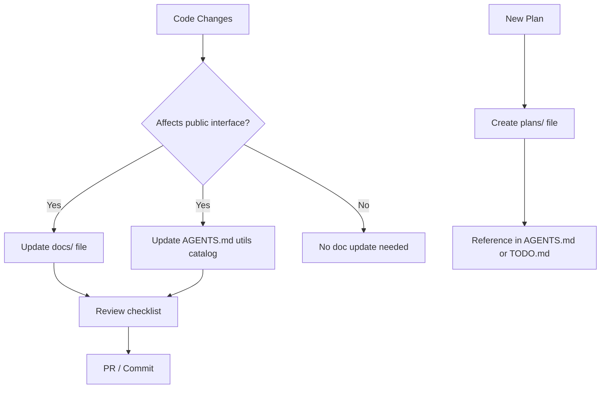

# Documentation Update Plan

## Overview

This document describes a process for auditing, updating, and maintaining
documentation across the D&D Character Consultant System. The project has
grown significantly, and several documentation sources have drifted out of
alignment with the actual codebase, data models, and test suite.

## Relationship to Other Plans

| Plan | Relationship |
|------|-------------|
| [`configuration_system_plan.md`](configuration_system_plan.md) | New config keys must be documented in `.env.example` and AGENTS.md |
| [`milvus_integration_plan.md`](milvus_integration_plan.md) | New RAG architecture requires `docs/RAG_INTEGRATION.md` update |
| [`model_switching_plan.md`](model_switching_plan.md) | Model profiles require `docs/AI_INTEGRATION.md` update |
| All new feature plans | Each new plan creates a documentation obligation |

---

## Problem Statement

### Current Issues

1. **Stale API Documentation**: `docs/AI_INTEGRATION.md` and
   `docs/RAG_INTEGRATION.md` describe the original architecture and do not
   reflect the centralized config system, `SemanticRetriever`, or Milvus.

2. **AGENTS.md Drift**: The utils catalog in `AGENTS.md` is manually
   maintained. New utilities added to `src/utils/` are not always reflected.

3. **No Documentation Contract**: There is no explicit rule about when
   documentation must be updated alongside code changes.

4. **Scattered Personal Docs**: `docs/docs_personal/` contains working notes
   and plans that duplicate or contradict published documentation.

5. **Module READMEs Out of Date**: `src/README.md` and `tests/README.md`
   may not list all current modules or test categories.

### Documentation Inventory

| File | Status | Last Known Issue |
|------|--------|-----------------|
| `docs/AI_INTEGRATION.md` | Likely stale | Does not mention centralized config |
| `docs/RAG_INTEGRATION.md` | Likely stale | Predates Milvus plan |
| `docs/RAG_QUICKSTART.md` | Likely stale | `.env` instructions are outdated |
| `docs/STORY_CONTINUATION.md` | Probably current | Low churn area |
| `docs/TERMINAL_DISPLAY.md` | Probably current | Low churn area |
| `docs/JSON_Validation.md` | Likely stale | New validators may be undocumented |
| `docs/EXAMPLE_CAMPAIGN_WALKTHROUGH.md` | Unknown | Depends on CLI changes |
| `AGENTS.md` | Partially stale | Utils catalog needs audit |
| `src/README.md` | Unknown | Module list may be incomplete |
| `tests/README.md` | Unknown | Test categories may be incomplete |

---

## Proposed Solution

### High-Level Approach

1. **Audit Phase**: Compare each documentation file against the current
   codebase and flag stale sections.
2. **Update Phase**: Rewrite stale sections to match current implementation.
3. **Contract Phase**: Establish a rule (in AGENTS.md) that documentation
   must be updated alongside any code change that alters a public interface.
4. **Auto-Generation Phase**: Identify sections that can be generated from
   docstrings or code structure to reduce manual burden.

### Documentation Architecture



---

## Implementation Details

### 1. Audit Checklist

For each file in `docs/`, verify:

- [ ] All referenced modules still exist at the stated paths
- [ ] All code samples compile and match current signatures
- [ ] All `.env` variable names match `src/config/config_types.py`
- [ ] All CLI commands match current `dnd_consultant.py` argument parser
- [ ] All JSON examples match current validation schemas in `src/validation/`

For `AGENTS.md`, verify:

- [ ] Every module in `src/utils/` is listed in the utils catalog
- [ ] Every function listed still exists in the stated module
- [ ] The project structure tree matches `src/` and `tests/` layout
- [ ] The common commands section reflects current entry points

### 2. Documentation Update Rules (AGENTS.md addition)

Add the following rule to `AGENTS.md` under "Critical Rules":

```markdown
### 5. Documentation Must Track Code

When a code change alters any of the following, the corresponding
documentation file must be updated in the same commit:

| Change Type | Documentation to Update |
|-------------|------------------------|
| New util function | AGENTS.md utils catalog |
| New config key | docs/AI_INTEGRATION.md or .env.example |
| New CLI argument | AGENTS.md quick reference + relevant docs/ file |
| New data field in JSON schema | docs/JSON_Validation.md |
| New test category | tests/README.md |
| New src/ module | src/README.md |
| Changed AI/RAG architecture | docs/AI_INTEGRATION.md, docs/RAG_INTEGRATION.md |
```

### 3. Auto-Generation Strategy

Some sections can be generated from code to avoid manual drift:

| Section | Source | Generation Method |
|---------|--------|------------------|
| AGENTS.md utils catalog | `src/utils/*.py` docstrings | Script: `scripts/gen_utils_catalog.py` |
| `src/README.md` module list | `src/` directory listing | Script: `scripts/gen_module_list.py` |
| `tests/README.md` categories | `tests/` directory listing | Part of same script |
| `.env.example` variable list | `src/config/config_types.py` fields | Script: `scripts/gen_env_example.py` |

These scripts are non-mandatory aids; the canonical documentation remains
the hand-edited Markdown files. Scripts are run to catch drift, not to
replace human judgment.

### 4. Personal Docs Cleanup

`docs/docs_personal/` should be treated as working notes only:

- Files in `docs/docs_personal/` are not canonical documentation.
- Completed plans or design decisions should graduate to `plans/` or `docs/`.
- Outdated personal notes should be removed once their content is captured
  in a canonical location.
- `docs/docs_personal/` should be git-ignored for new contributors.

---

## Audit Priority Order

Address in this sequence based on usage frequency and change rate:

1. `AGENTS.md` - Read by every contributor and AI agent
2. `docs/AI_INTEGRATION.md` - High change rate (new models, Milvus, switching)
3. `docs/RAG_INTEGRATION.md` - Changes with Milvus integration
4. `docs/RAG_QUICKSTART.md` - User-facing; broken quickstart hurts immediately
5. `docs/JSON_Validation.md` - Changes when new validators are added
6. `src/README.md` and `tests/README.md` - Developer onboarding
7. `docs/EXAMPLE_CAMPAIGN_WALKTHROUGH.md` - Changes with CLI changes
8. `docs/STORY_CONTINUATION.md` - Lower churn, audit last

---

## Phased Implementation

### Phase 1: Audit (One-Time)

1. Read each documentation file and note stale sections.
2. Produce a findings list: file, section heading, issue description.
3. Record findings in `docs/docs_personal/DOCUMENTATION_AUDIT.md`.

### Phase 2: Targeted Rewrites

1. Update `AGENTS.md` utils catalog against `src/utils/` contents.
2. Rewrite `docs/AI_INTEGRATION.md` to cover centralized config and
   model switching.
3. Rewrite `docs/RAG_INTEGRATION.md` to cover Milvus and fallback.
4. Update `docs/RAG_QUICKSTART.md` `.env` instructions.
5. Update `docs/JSON_Validation.md` with any new validators.

### Phase 3: Process Establishment

1. Add documentation update rule to `AGENTS.md` (see rule 5 above).
2. Add documentation check to `TODO.md` workflow checklist.
3. Write `scripts/gen_utils_catalog.py` to detect utils catalog drift.

---

## Related Plans

| Plan | Notes |
|------|-------|
| All plans in `plans/` | Documentation must follow each implemented plan |
| [`configuration_system_plan.md`](configuration_system_plan.md) | Config changes drive `.env.example` and AI_INTEGRATION.md updates |
| [`milvus_integration_plan.md`](milvus_integration_plan.md) | New retrieval architecture requires RAG_INTEGRATION.md rewrite |
| [`model_switching_plan.md`](model_switching_plan.md) | Model profiles require AI_INTEGRATION.md update |
