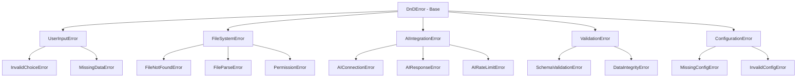

# Error Handling Improvements Plan

## Overview

This document describes the design for a comprehensive error handling system
that provides clear, actionable error messages throughout the D&D Character
Consultant System. The goal is to improve user experience by replacing
scattered error handling with a centralized, consistent approach.

## Problem Statement

### Current Issues

1. **Inconsistent Error Messages**: Error messages vary widely in format and
   clarity across modules. Some use `[ERROR]`, others use `Error:`, and some
   just print raw exception text.

2. **Lack of Actionable Guidance**: Most errors tell users what went wrong
   but not how to fix it. For example:
   - Current: `[ERROR] Failed to generate story: 'NoneType' object has no attribute 'name'`
   - Better: `Failed to generate story: No characters are loaded. Add characters to your party first using the Character Management menu.`

3. **Scattered Error Handling**: Error handling logic is duplicated across
   163+ exception handlers in the codebase, making maintenance difficult.

4. **No Error Categories**: All errors are treated equally, whether they are
   user input errors, file system errors, or AI API failures.

5. **Silent Failures**: Some operations fail silently or with minimal logging,
   making debugging difficult for users.

### Evidence from Codebase Analysis

The search for `except.*Exception|except.*Error` found 163 results across
multiple modules:

| Module | Exception Handlers | Common Pattern |
|--------|-------------------|----------------|
| `src/cli/` | 45+ | Print statements with `[ERROR]` prefix |
| `src/stories/` | 35+ | Mix of print and logging |
| `src/utils/` | 25+ | Mix of patterns |
| `src/validation/` | 15+ | Return tuples with error lists |
| `src/ai/` | 10+ | RuntimeError with messages |

---

## Proposed Solution

### High-Level Approach

Create a centralized error handling system with:

1. **Error Categories**: Define clear error types with specific guidance
2. **Error Templates**: Standardized message formats with actionable guidance
3. **Central Error Handler**: Single module for all error processing
4. **Module Integration**: Update all modules to use the central system

### Error Categories



---

## Implementation Details

### 1. Error Exception Classes

Create `src/utils/errors.py`:

```python
"""
Centralized Error Handling System

Provides consistent, actionable error messages throughout the D&D Consultant system.
"""

from typing import Optional, List


class DnDError(Exception):
    """Base exception for all D&D Consultant errors.

    All custom exceptions inherit from this class to enable
    catching all application-specific errors.
    """

    def __init__(
        self,
        message: str,
        user_guidance: Optional[str] = None,
        recoverable: bool = True,
        context: Optional[dict] = None
    ):
        super().__init__(message)
        self.message = message
        self.user_guidance = user_guidance
        self.recoverable = recoverable
        self.context = context or {}

    def __str__(self) -> str:
        if self.user_guidance:
            return f"{self.message}\n  Guidance: {self.user_guidance}"
        return self.message


class UserInputError(DnDError):
    """Errors caused by invalid user input."""
    pass


class InvalidChoiceError(UserInputError):
    """User selected an invalid menu option."""

    def __init__(self, choice: str, valid_options: List[str]):
        super().__init__(
            message=f"Invalid selection: '{choice}'",
            user_guidance=f"Please choose from: {', '.join(valid_options[:5])}"
                         f"{'...' if len(valid_options) > 5 else ''}"
        )


class MissingDataError(UserInputError):
    """Required data is missing or empty."""

    def __init__(self, data_name: str, action: str):
        super().__init__(
            message=f"No {data_name} available",
            user_guidance=f"You need to add {data_name} before {action}",
            recoverable=True
        )


class FileSystemError(DnDError):
    """Errors related to file operations."""
    pass


class FileNotFoundError(FileSystemError):
    """Required file does not exist."""

    def __init__(self, filepath: str, file_type: str = "file"):
        super().__init__(
            message=f"{file_type.capitalize()} not found: {filepath}",
            user_guidance=f"Check that the {file_type} exists and the path is correct.",
            recoverable=True,
            context={"filepath": filepath, "file_type": file_type}
        )


class FileParseError(FileSystemError):
    """File content could not be parsed."""

    def __init__(self, filepath: str, parse_error: str, expected_format: str):
        super().__init__(
            message=f"Could not parse {filepath}: {parse_error}",
            user_guidance=f"Ensure the file is valid {expected_format} format.",
            recoverable=True,
            context={"filepath": filepath, "expected_format": expected_format}
        )


class AIIntegrationError(DnDError):
    """Errors related to AI API calls."""
    pass


class AIConnectionError(AIIntegrationError):
    """Could not connect to AI service."""

    def __init__(self, service: str, original_error: Optional[str] = None):
        super().__init__(
            message=f"Could not connect to AI service: {service}",
            user_guidance="Check your internet connection and API configuration. "
                         "Run 'Test AI Connection' from the Setup menu to diagnose.",
            recoverable=True,
            context={"service": service, "original_error": original_error}
        )


class AIResponseError(AIIntegrationError):
    """AI returned an unexpected response."""

    def __init__(self, operation: str, details: str):
        super().__init__(
            message=f"AI response error during {operation}",
            user_guidance="Try again with a simpler prompt, or check your AI model "
                         "configuration in the Setup menu.",
            recoverable=True,
            context={"operation": operation, "details": details}
        )


class ConfigurationError(DnDError):
    """Errors in system configuration."""
    pass


class MissingConfigError(ConfigurationError):
    """Required configuration is missing."""

    def __init__(self, config_name: str, how_to_fix: str):
        super().__init__(
            message=f"Missing configuration: {config_name}",
            user_guidance=how_to_fix,
            recoverable=True
        )


class ValidationError(DnDError):
    """Data validation failures."""
    pass


class SchemaValidationError(ValidationError):
    """Data does not match expected schema."""

    def __init__(self, data_type: str, errors: List[str]):
        error_list = "\n  - ".join(errors[:5])
        if len(errors) > 5:
            error_list += f"\n  ... and {len(errors) - 5} more errors"

        super().__init__(
            message=f"Invalid {data_type} data",
            user_guidance=f"Fix the following issues:\n  - {error_list}",
            recoverable=True,
            context={"data_type": data_type, "errors": errors}
        )
```

### 2. Error Handler Utility

Add to `src/utils/errors.py`:

```python
from functools import wraps
from typing import Callable, Type, Any
import logging

LOGGER = logging.getLogger(__name__)


def handle_errors(
    *error_types: Type[Exception],
    default_return: Any = None,
    log_level: int = logging.ERROR
) -> Callable:
    """Decorator for consistent error handling.

    Args:
        error_types: Exception types to catch
        default_return: Value to return on error
        log_level: Logging level for errors

    Returns:
        Decorated function

    Example:
        @handle_errors(FileSystemError, AIIntegrationError)
        def load_character(name: str) -> dict:
            # ... code that might raise errors
    """
    def decorator(func: Callable) -> Callable:
        @wraps(func)
        def wrapper(*args, **kwargs):
            try:
                return func(*args, **kwargs)
            except DnDError as e:
                LOGGER.log(log_level, f"{func.__name__}: {e.message}")
                display_error(e)
                return default_return
            except error_types as e:
                LOGGER.log(log_level, f"{func.__name__}: {e}")
                display_error(wrap_exception(e))
                return default_return
        return wrapper
    return decorator


def wrap_exception(
    exc: Exception,
    context: Optional[dict] = None
) -> DnDError:
    """Convert standard exceptions to DnDError with context.

    Args:
        exc: Original exception
        context: Additional context about the error

    Returns:
        DnDError with appropriate message and guidance
    """
    if isinstance(exc, DnDError):
        return exc

    # Map common exceptions to DnDError types
    exception_map = {
        FileNotFoundError: _wrap_file_not_found,
        PermissionError: _wrap_permission_error,
        json.JSONDecodeError: _wrap_json_error,
        ValueError: _wrap_value_error,
        KeyError: _wrap_key_error,
        ConnectionError: _wrap_connection_error,
        TimeoutError: _wrap_timeout_error,
    }

    wrapper = exception_map.get(type(exc), _wrap_generic)
    return wrapper(exc, context)


def display_error(error: DnDError) -> None:
    """Display error message to user with appropriate formatting.

    Uses terminal_display utilities for consistent output.
    """
    from src.utils.terminal_display import print_error, print_warning, print_info

    print_error(error.message)

    if error.user_guidance:
        print_info(error.user_guidance)

    if not error.recoverable:
        print_warning("This error requires application restart.")


# Internal wrapper functions
def _wrap_file_not_found(exc: Exception, context: Optional[dict]) -> DnDError:
    return FileNotFoundError(
        filepath=str(exc.filename) if hasattr(exc, 'filename') else 'unknown',
        file_type=context.get('file_type', 'file') if context else 'file'
    )


def _wrap_permission_error(exc: Exception, context: Optional[dict]) -> DnDError:
    return FileSystemError(
        message=f"Permission denied: {exc.filename if hasattr(exc, 'filename') else 'unknown'}",
        user_guidance="Check file permissions or run with appropriate access rights.",
        recoverable=False
    )


def _wrap_json_error(exc: Exception, context: Optional[dict]) -> DnDError:
    return FileParseError(
        filepath=context.get('filepath', 'unknown') if context else 'unknown',
        parse_error=str(exc),
        expected_format='JSON'
    )


def _wrap_value_error(exc: Exception, context: Optional[dict]) -> DnDError:
    return UserInputError(
        message=str(exc),
        user_guidance="Check your input and try again."
    )


def _wrap_key_error(exc: Exception, context: Optional[dict]) -> DnDError:
    key = str(exc).strip("'\"")
    return MissingDataError(
        data_name=key,
        action="this operation"
    )


def _wrap_connection_error(exc: Exception, context: Optional[dict]) -> DnDError:
    return AIConnectionError(
        service=context.get('service', 'AI service') if context else 'AI service',
        original_error=str(exc)
    )


def _wrap_timeout_error(exc: Exception, context: Optional[dict]) -> DnDError:
    return AIIntegrationError(
        message="Operation timed out",
        user_guidance="The request took too long. Try again or use a simpler prompt."
    )


def _wrap_generic(exc: Exception, context: Optional[dict]) -> DnDError:
    return DnDError(
        message=f"Unexpected error: {type(exc).__name__}: {exc}",
        user_guidance="If this persists, check the logs or report an issue.",
        recoverable=True,
        context={'original_type': type(exc).__name__}
    )
```

### 3. Error Message Templates

Create `src/utils/error_templates.py`:

```python
"""
Error Message Templates

Standardized error messages with consistent formatting and actionable guidance.
"""

from typing import Dict, Any

# Template format: {key: (message_template, guidance_template)}
ERROR_TEMPLATES: Dict[str, tuple] = {
    # Character errors
    "character_not_found": (
        "Character '{name}' not found",
        "Check the character name spelling. Use Character Management to see available characters."
    ),
    "character_load_failed": (
        "Failed to load character '{name}'",
        "The character file may be corrupted. Check game_data/characters/{name}.json"
    ),
    "character_save_failed": (
        "Failed to save character '{name}'",
        "Check file permissions and disk space. The file may be open in another program."
    ),

    # Story errors
    "story_not_found": (
        "Story '{name}' not found in campaign '{campaign}'",
        "Use 'List Stories' to see available stories in this campaign."
    ),
    "story_generation_failed": (
        "Failed to generate story",
        "Ensure AI is configured correctly and you have characters in your party."
    ),
    "story_parse_error": (
        "Could not parse story file",
        "The story file may have invalid markdown. Check for unclosed brackets or headers."
    ),

    # Campaign errors
    "campaign_not_found": (
        "Campaign '{name}' not found",
        "Use 'List Campaigns' to see available campaigns."
    ),
    "campaign_create_failed": (
        "Failed to create campaign '{name}'",
        "Check that the campaign name is valid and you have write permissions."
    ),

    # AI errors
    "ai_not_configured": (
        "AI is not configured",
        "Set OPENAI_API_KEY in your .env file or use Setup menu to configure AI."
    ),
    "ai_request_failed": (
        "AI request failed: {reason}",
        "Check your internet connection and API key. Try again in a moment."
    ),
    "ai_response_invalid": (
        "AI returned invalid response",
        "The AI model may be overloaded. Try with a simpler prompt."
    ),

    # File errors
    "file_not_found": (
        "{file_type} not found: {path}",
        "Check that the file exists and the path is correct."
    ),
    "file_permission_denied": (
        "Permission denied: {path}",
        "Check file permissions or run with appropriate access rights."
    ),
    "file_parse_error": (
        "Could not parse {file_type} file: {path}",
        "Ensure the file is valid {format} format."
    ),

    # Validation errors
    "validation_failed": (
        "Validation failed for {data_type}",
        "Fix the following issues: {errors}"
    ),

    # Party errors
    "party_empty": (
        "No characters in party",
        "Add characters to your party using the Party Configuration menu."
    ),
    "party_member_not_found": (
        "Party member '{name}' not found in characters",
        "The character file may have been moved or renamed. Update party configuration."
    ),

    # NPC errors
    "npc_not_found": (
        "NPC '{name}' not found",
        "Check the NPC name or use 'Create NPC' to add a new NPC."
    ),
    "npc_detection_failed": (
        "NPC detection failed",
        "Story analysis could not identify NPCs. The story may not contain NPC references."
    ),
}


def get_error_template(key: str, **kwargs: Any) -> tuple:
    """Get formatted error message and guidance.

    Args:
        key: Template key from ERROR_TEMPLATES
        **kwargs: Values to format into templates

    Returns:
        Tuple of (message, guidance)

    Raises:
        KeyError: If template key not found
    """
    if key not in ERROR_TEMPLATES:
        raise KeyError(f"Unknown error template: {key}")

    message_template, guidance_template = ERROR_TEMPLATES[key]

    try:
        message = message_template.format(**kwargs)
        guidance = guidance_template.format(**kwargs)
    except KeyError as e:
        # Missing format argument
        message = message_template.replace(f"{{{e.args[0]}}}", f"[{e.args[0]}]")
        guidance = guidance_template.replace(f"{{{e.args[0]}}}", f"[{e.args[0]}]")

    return message, guidance
```

### 4. Module Integration Pattern

Example integration in `src/cli/cli_story_manager.py`:

```python
# Before (current pattern)
try:
    result = generate_story(prompt)
except (ValueError, AttributeError, OSError) as e:
    print(f"[ERROR] Failed to generate story: {e}")

# After (new pattern)
from src.utils.errors import handle_errors, AIIntegrationError, FileSystemError

@handle_errors(AIIntegrationError, FileSystemError)
def generate_story(prompt: str) -> Optional[str]:
    # ... implementation
    pass
```

Example with explicit error raising:

```python
from src.utils.errors import (
    MissingDataError,
    AIResponseError,
    display_error
)
from src.utils.error_templates import get_error_template

def continue_story(self, story_name: str) -> Optional[str]:
    # Check preconditions
    if not self.party_members:
        msg, guidance = get_error_template("party_empty")
        raise MissingDataError("party members", "continuing a story")

    if not self.ai_client:
        msg, guidance = get_error_template("ai_not_configured")
        raise ConfigurationError("AI", guidance)

    try:
        result = self.ai_client.generate(prompt)
        if not result:
            raise AIResponseError("story continuation", "Empty response")
        return result
    except ConnectionError as e:
        raise AIConnectionError("OpenAI", str(e))
```

---

## Affected Files

### New Files to Create

| File | Purpose |
|------|---------|
| `src/utils/errors.py` | Exception classes and error handler |
| `src/utils/error_templates.py` | Standardized error message templates |
| `tests/utils/test_errors.py` | Unit tests for error handling |

### Files to Modify

| File | Changes |
|------|---------|
| `src/cli/cli_story_manager.py` | Replace 20+ exception handlers |
| `src/cli/cli_character_manager.py` | Replace 10+ exception handlers |
| `src/cli/cli_consultations.py` | Replace 5+ exception handlers |
| `src/cli/cli_story_analysis.py` | Replace 8+ exception handlers |
| `src/cli/dnd_consultant.py` | Replace main loop error handling |
| `src/stories/story_ai_generator.py` | Replace 5+ exception handlers |
| `src/stories/story_manager.py` | Replace 5+ exception handlers |
| `src/stories/story_updater.py` | Replace 5+ exception handlers |
| `src/ai/ai_client.py` | Improve error messages |
| `src/validation/*.py` | Use new error types |
| `src/utils/terminal_display.py` | Integrate with error display |

---

## Testing Strategy

### Unit Tests

Create `tests/utils/test_errors.py`:

```python
"""Tests for centralized error handling system."""

import pytest
from src.utils.errors import (
    DnDError,
    UserInputError,
    InvalidChoiceError,
    MissingDataError,
    FileNotFoundError,
    AIConnectionError,
    handle_errors,
    wrap_exception,
)
from src.utils.error_templates import get_error_template


class TestDnDError:
    """Tests for base DnDError class."""

    def test_basic_error_message(self):
        """Error displays message correctly."""
        error = DnDError("Test error")
        assert str(error) == "Test error"

    def test_error_with_guidance(self):
        """Error includes guidance when provided."""
        error = DnDError("Test error", user_guidance="Do this to fix")
        assert "Guidance: Do this to fix" in str(error)

    def test_error_context_stored(self):
        """Error stores context dictionary."""
        error = DnDError("Test", context={"key": "value"})
        assert error.context == {"key": "value"}


class TestInvalidChoiceError:
    """Tests for InvalidChoiceError."""

    def test_formats_valid_options(self):
        """Error shows valid options."""
        error = InvalidChoiceError("x", ["a", "b", "c"])
        assert "a, b, c" in error.user_guidance

    def test_truncates_long_option_list(self):
        """Long option lists are truncated."""
        error = InvalidChoiceError("x", ["a", "b", "c", "d", "e", "f"])
        assert "..." in error.user_guidance


class TestWrapException:
    """Tests for exception wrapping."""

    def test_wraps_file_not_found(self):
        """FileNotFoundError is wrapped correctly."""
        import builtins
        original = builtins.FileNotFoundError("test.json")
        wrapped = wrap_exception(original)
        assert isinstance(wrapped, FileNotFoundError)

    def test_wraps_value_error(self):
        """ValueError is wrapped as UserInputError."""
        original = ValueError("Invalid input")
        wrapped = wrap_exception(original)
        assert isinstance(wrapped, UserInputError)

    def test_dnd_error_passthrough(self):
        """DnDError types pass through unchanged."""
        original = AIConnectionError("test")
        wrapped = wrap_exception(original)
        assert wrapped is original


class TestHandleErrorsDecorator:
    """Tests for handle_errors decorator."""

    def test_returns_value_on_success(self):
        """Successful function returns value."""
        @handle_errors()
        def success_func():
            return "success"

        assert success_func() == "success"

    def test_returns_default_on_error(self):
        """Failed function returns default."""
        @handle_errors(ValueError, default_return=None)
        def fail_func():
            raise ValueError("test")

        assert fail_func() is None

    def test_handles_multiple_error_types(self):
        """Decorator handles multiple error types."""
        @handle_errors(ValueError, KeyError, default_return="default")
        def multi_fail(error_type):
            if error_type == "value":
                raise ValueError("test")
            raise KeyError("test")

        assert multi_fail("value") == "default"
        assert multi_fail("key") == "default"


class TestErrorTemplates:
    """Tests for error message templates."""

    def test_gets_template_with_formatting(self):
        """Template is formatted with kwargs."""
        message, guidance = get_error_template(
            "character_not_found",
            name="Aragorn"
        )
        assert "Aragorn" in message

    def test_handles_missing_format_args(self):
        """Missing format args are handled gracefully."""
        message, guidance = get_error_template("character_not_found")
        assert "[name]" in message
```

### Integration Tests

Test error handling in real CLI scenarios:

```python
# tests/cli/test_error_integration.py

def test_character_not_found_error_flow():
    """User sees helpful error when character not found."""
    # Simulate selecting non-existent character
    # Verify error message includes guidance

def test_ai_connection_error_flow():
    """User sees helpful error when AI unavailable."""
    # Simulate AI connection failure
    # Verify error suggests checking configuration
```

---

## Migration Path

### Phase 1: Foundation (No Breaking Changes)

1. Create `src/utils/errors.py` with exception classes
2. Create `src/utils/error_templates.py` with templates
3. Add unit tests for new error system
4. No changes to existing code yet

### Phase 2: CLI Module Migration

1. Update `src/cli/dnd_consultant.py` main loop
2. Update `src/cli/cli_story_manager.py` (highest error count)
3. Update `src/cli/cli_character_manager.py`
4. Update remaining CLI modules
5. Test each module after migration

### Phase 3: Core Module Migration

1. Update `src/ai/ai_client.py` error handling
2. Update `src/stories/story_ai_generator.py`
3. Update `src/stories/story_manager.py`
4. Update remaining story modules

### Phase 4: Validation and Polish

1. Update validation modules to use new error types
2. Add error handling to utility modules
3. Remove deprecated error patterns
4. Update documentation

### Migration Checklist Per File

For each file being migrated:

- [ ] Add imports for new error classes
- [ ] Identify all try/except blocks
- [ ] Replace generic prints with `display_error()`
- [ ] Replace bare exceptions with specific DnDError types
- [ ] Add `@handle_errors` decorator where appropriate
- [ ] Update tests to expect new error types
- [ ] Run pylint and achieve 10.00/10
- [ ] Run tests and verify all pass

---

## Dependencies

### No External Dependencies

This plan has no dependencies on other planned features. It can be implemented
immediately.

### Blocks Other Work

Improved error handling will benefit:

- Configuration System Plan - better config error messages
- AI Story Suggestions Plan - better AI error handling

---

## Success Criteria

1. **Consistency**: All error messages follow the same format
2. **Actionability**: Every error includes guidance on how to fix it
3. **Testability**: Error handling is unit tested with 90%+ coverage
4. **Maintainability**: Adding new errors requires minimal code changes
5. **User Satisfaction**: Users report errors are helpful (qualitative)

---

## Future Enhancements

1. **Error Logging**: Add structured logging with error codes
2. **Error Analytics**: Track common errors to improve UX
3. **Error Recovery**: Automatic retry for transient errors
4. **Internationalization**: Support for localized error messages
5. **Error Reporting**: Optional anonymous error reporting for debugging
