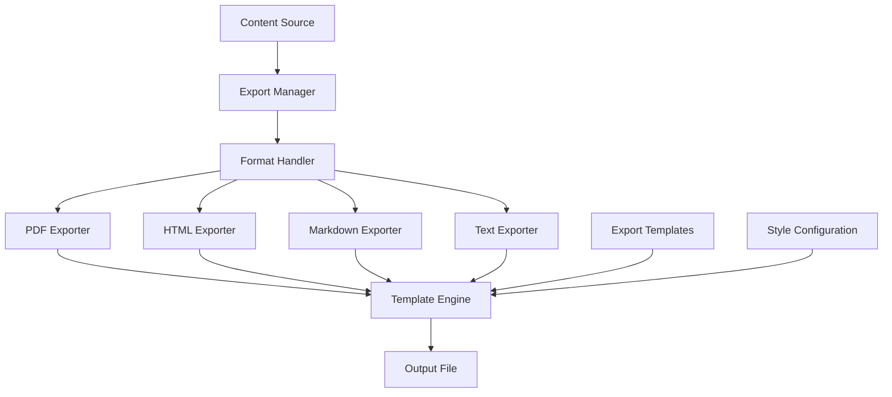

# Export Functionality Plan

## Overview

This document describes the design for an export system for the D&D Character
Consultant System. The goal is to enable users to export stories, characters,
and campaign data to various formats including PDF, HTML, and Markdown for
sharing, printing, and archival purposes.

## Problem Statement

### Current Issues

1. **No Export Options**: Users can only view data within the CLI or read
   raw JSON/Markdown files directly.

2. **No PDF Generation**: Stories cannot be exported to PDF for printing
   or sharing with players who prefer physical copies.

3. **No HTML Export**: No way to generate web-viewable versions of campaign
   content for easy sharing.

4. **No Batch Export**: Cannot export multiple stories or entire campaigns
   at once.

### Evidence from Codebase

| Current State | Limitation |
|---------------|------------|
| Stories in Markdown only | No alternative formats |
| No export module | Cannot convert to other formats |
| No template system | Cannot customize output |
| No CLI export commands | No user-facing export functionality |

---

## Proposed Solution

### High-Level Approach

1. **Export Formats**: Support PDF, HTML, Markdown, and plain text exports
2. **Export Templates**: Customizable templates for different output styles
3. **Export Pipeline**: Modular pipeline for processing and formatting content
4. **CLI Integration**: Add export commands to the CLI
5. **Batch Export**: Support exporting multiple items at once

### Export Architecture



---

## Implementation Details

### 1. Export Format Definitions

Create `src/export/formats.py`:

```python
"""Export format definitions and base classes."""

from abc import ABC, abstractmethod
from dataclasses import dataclass, field
from typing import Dict, List, Optional, Any
from enum import Enum
from pathlib import Path


class ExportFormat(Enum):
    """Supported export formats."""
    PDF = "pdf"
    HTML = "html"
    MARKDOWN = "md"
    TEXT = "txt"
    JSON = "json"
    DOCX = "docx"


@dataclass
class ExportOptions:
    """Options for export operations."""
    format: ExportFormat
    output_path: str

    # Content options
    include_metadata: bool = True
    include_toc: bool = True
    include_page_numbers: bool = True

    # Style options
    template_name: str = "default"
    style_config: Dict[str, Any] = field(default_factory=dict)

    # PDF-specific options
    page_size: str = "a4"
    margins: Dict[str, float] = field(default_factory=lambda: {
        "top": 1.0, "bottom": 1.0, "left": 1.0, "right": 1.0
    })
    font_family: str = "Georgia"
    font_size: int = 11

    # HTML-specific options
    include_css: bool = True
    embed_images: bool = False
    dark_mode: bool = False

    # Batch options
    combine_into_one: bool = False
    create_index: bool = False


@dataclass
class ExportResult:
    """Result of an export operation."""
    success: bool
    output_path: str
    format: ExportFormat
    items_exported: int = 0
    errors: List[str] = field(default_factory=list)
    warnings: List[str] = field(default_factory=list)

    def to_dict(self) -> Dict:
        """Convert to dictionary."""
        return {
            "success": self.success,
            "output_path": self.output_path,
            "format": self.format.value,
            "items_exported": self.items_exported,
            "errors": self.errors,
            "warnings": self.warnings
        }


class FormatHandler(ABC):
    """Base class for format-specific handlers."""

    format: ExportFormat = None
    file_extension: str = ""

    @abstractmethod
    def export(
        self,
        content: Dict[str, Any],
        options: ExportOptions
    ) -> ExportResult:
        """Export content to the specific format.

        Args:
            content: Content to export
            options: Export options

        Returns:
            ExportResult with outcome details
        """
        pass

    @abstractmethod
    def export_batch(
        self,
        items: List[Dict[str, Any]],
        options: ExportOptions
    ) -> ExportResult:
        """Export multiple items.

        Args:
            items: List of items to export
            options: Export options

        Returns:
            ExportResult with outcome details
        """
        pass

    def get_template_context(
        self,
        content: Dict[str, Any],
        options: ExportOptions
    ) -> Dict[str, Any]:
        """Build template context for rendering.

        Args:
            content: Content to export
            options: Export options

        Returns:
            Dictionary of template variables
        """
        context = {
            "content": content,
            "options": options,
            "metadata": content.get("metadata", {}),
            "include_metadata": options.include_metadata,
            "include_toc": options.include_toc,
        }

        return context
```

### 2. PDF Exporter

Create `src/export/pdf_exporter.py`:

```python
"""PDF export functionality."""

from typing import Dict, List, Any, Optional
from pathlib import Path
from datetime import datetime

from src.export.formats import (
    FormatHandler, ExportFormat, ExportOptions, ExportResult
)


class PDFExporter(FormatHandler):
    """Export content to PDF format."""

    format = ExportFormat.PDF
    file_extension = ".pdf"

    def __init__(self):
        """Initialize the PDF exporter."""
        self._weasyprint = None
        self._reportlab = None
        self._check_dependencies()

    def _check_dependencies(self) -> None:
        """Check for available PDF libraries."""
        try:
            import weasyprint
            self._weasyprint = weasyprint
        except ImportError:
            pass

        try:
            from reportlab.lib.pagesizes import A4, letter
            from reportlab.platypus import SimpleDocTemplate, Paragraph, Spacer
            from reportlab.lib.styles import getSampleStyleSheet
            self._reportlab = True
        except ImportError:
            pass

    def export(
        self,
        content: Dict[str, Any],
        options: ExportOptions
    ) -> ExportResult:
        """Export content to PDF.

        Args:
            content: Content dictionary with title, body, metadata
            options: Export options

        Returns:
            ExportResult with outcome
        """
        errors = []
        warnings = []

        # Check for PDF library
        if self._weasyprint:
            result = self._export_with_weasyprint(content, options)
        elif self._reportlab:
            result = self._export_with_reportlab(content, options)
        else:
            return ExportResult(
                success=False,
                output_path=options.output_path,
                format=self.format,
                errors=["No PDF library available. Install weasyprint or reportlab."]
            )

        return result

    def _export_with_weasyprint(
        self,
        content: Dict[str, Any],
        options: ExportOptions
    ) -> ExportResult:
        """Export using WeasyPrint (HTML to PDF)."""
        try:
            # Generate HTML first
            html_content = self._generate_html_for_pdf(content, options)

            # Create PDF
            pdf = self._weasyprint.HTML(string=html_content).write_pdf()

            # Write to file
            output_path = Path(options.output_path)
            output_path.parent.mkdir(parents=True, exist_ok=True)

            with open(output_path, "wb") as f:
                f.write(pdf)

            return ExportResult(
                success=True,
                output_path=str(output_path),
                format=self.format,
                items_exported=1
            )

        except Exception as e:
            return ExportResult(
                success=False,
                output_path=options.output_path,
                format=self.format,
                errors=[str(e)]
            )

    def _export_with_reportlab(
        self,
        content: Dict[str, Any],
        options: ExportOptions
    ) -> ExportResult:
        """Export using ReportLab."""
        try:
            from reportlab.lib.pagesizes import A4, letter
            from reportlab.platypus import (
                SimpleDocTemplate, Paragraph, Spacer, PageBreak, Table
            )
            from reportlab.lib.styles import getSampleStyleSheet, ParagraphStyle
            from reportlab.lib.units import inch
            from reportlab.lib.enums import TA_CENTER, TA_JUSTIFY

            # Setup document
            output_path = Path(options.output_path)
            output_path.parent.mkdir(parents=True, exist_ok=True)

            page_size = A4 if options.page_size.lower() == "a4" else letter

            doc = SimpleDocTemplate(
                str(output_path),
                pagesize=page_size,
                topMargin=options.margins["top"] * inch,
                bottomMargin=options.margins["bottom"] * inch,
                leftMargin=options.margins["left"] * inch,
                rightMargin=options.margins["right"] * inch
            )

            # Styles
            styles = getSampleStyleSheet()

            title_style = ParagraphStyle(
                "CustomTitle",
                parent=styles["Heading1"],
                fontSize=24,
                alignment=TA_CENTER,
                spaceAfter=30
            )

            heading_style = ParagraphStyle(
                "CustomHeading",
                parent=styles["Heading2"],
                fontSize=16,
                spaceBefore=20,
                spaceAfter=10
            )

            body_style = ParagraphStyle(
                "CustomBody",
                parent=styles["Normal"],
                fontSize=options.font_size,
                fontName=options.font_family,
                alignment=TA_JUSTIFY,
                spaceAfter=12
            )

            # Build content
            story = []

            # Title
            title = content.get("title", "Untitled")
            story.append(Paragraph(title, title_style))

            # Metadata
            if options.include_metadata:
                metadata = content.get("metadata", {})
                if metadata:
                    meta_text = self._format_metadata(metadata)
                    story.append(Paragraph(meta_text, styles["Normal"]))
                    story.append(Spacer(1, 20))

            # Body content
            body = content.get("body", "")

            # Process markdown-like content
            for paragraph in body.split("\n\n"):
                paragraph = paragraph.strip()
                if not paragraph:
                    continue

                # Check for headings
                if paragraph.startswith("# "):
                    text = paragraph[2:].strip()
                    story.append(Paragraph(text, title_style))
                elif paragraph.startswith("## "):
                    text = paragraph[3:].strip()
                    story.append(Paragraph(text, heading_style))
                elif paragraph.startswith("### "):
                    text = paragraph[4:].strip()
                    story.append(Paragraph(text, styles["Heading3"]))
                else:
                    # Clean markdown formatting
                    text = self._clean_markdown(paragraph)
                    story.append(Paragraph(text, body_style))

            # Build PDF
            doc.build(story)

            return ExportResult(
                success=True,
                output_path=str(output_path),
                format=self.format,
                items_exported=1
            )

        except Exception as e:
            return ExportResult(
                success=False,
                output_path=options.output_path,
                format=self.format,
                errors=[str(e)]
            )

    def _generate_html_for_pdf(
        self,
        content: Dict[str, Any],
        options: ExportOptions
    ) -> str:
        """Generate HTML content for PDF conversion."""
        title = content.get("title", "Untitled")
        body = content.get("body", "")
        metadata = content.get("metadata", {})

        html_parts = [
            "<!DOCTYPE html>",
            "<html>",
            "<head>",
            f"<title>{title}</title>",
            "<style>",
            self._get_pdf_css(options),
            "</style>",
            "</head>",
            "<body>",
            f"<h1>{title}</h1>"
        ]

        # Metadata
        if options.include_metadata and metadata:
            html_parts.append('<div class="metadata">')
            for key, value in metadata.items():
                html_parts.append(f'<p><strong>{key}:</strong> {value}</p>')
            html_parts.append("</div>")

        # Body
        html_parts.append('<div class="content">')
        html_parts.append(self._markdown_to_html(body))
        html_parts.append("</div>")

        html_parts.extend(["</body>", "</html>"])

        return "\n".join(html_parts)

    def _get_pdf_css(self, options: ExportOptions) -> str:
        """Get CSS for PDF styling."""
        return f"""
            body {{
                font-family: {options.font_family}, serif;
                font-size: {options.font_size}pt;
                line-height: 1.6;
                color: #333;
            }}
            h1 {{
                font-size: 24pt;
                text-align: center;
                margin-bottom: 20pt;
                color: #222;
            }}
            h2 {{
                font-size: 18pt;
                margin-top: 20pt;
                margin-bottom: 10pt;
                color: #333;
            }}
            h3 {{
                font-size: 14pt;
                margin-top: 15pt;
                margin-bottom: 8pt;
            }}
            p {{
                text-align: justify;
                margin-bottom: 12pt;
            }}
            .metadata {{
                font-size: 10pt;
                color: #666;
                margin-bottom: 20pt;
                padding: 10pt;
                background: #f5f5f5;
            }}
            .content {{
                text-align: justify;
            }}
            blockquote {{
                margin: 15pt 30pt;
                padding: 10pt;
                border-left: 3pt solid #ccc;
                background: #f9f9f9;
            }}
            code {{
                font-family: monospace;
                background: #f0f0f0;
                padding: 2pt 4pt;
            }}
            @page {{
                size: {options.page_size};
                margin: {options.margins['top']}in {options.margins['right']}in
                        {options.margins['bottom']}in {options.margins['left']}in;
            }}
        """

    def _markdown_to_html(self, markdown_text: str) -> str:
        """Convert markdown to HTML."""
        import re

        html = markdown_text

        # Headers
        html = re.sub(r'^### (.+)$', r'<h3>\1</h3>', html, flags=re.MULTILINE)
        html = re.sub(r'^## (.+)$', r'<h2>\1</h2>', html, flags=re.MULTILINE)
        html = re.sub(r'^# (.+)$', r'<h1>\1</h1>', html, flags=re.MULTILINE)

        # Bold and italic
        html = re.sub(r'\*\*(.+?)\*\*', r'<strong>\1</strong>', html)
        html = re.sub(r'\*(.+?)\*', r'<em>\1</em>', html)

        # Paragraphs
        paragraphs = html.split('\n\n')
        html = '\n'.join(
            f'<p>{p.strip()}</p>'
            for p in paragraphs
            if p.strip() and not p.strip().startswith('<h')
        )

        return html

    def _format_metadata(self, metadata: Dict) -> str:
        """Format metadata for display."""
        parts = []
        for key, value in metadata.items():
            parts.append(f"{key.title()}: {value}")
        return " | ".join(parts)

    def _clean_markdown(self, text: str) -> str:
        """Clean markdown formatting for plain text."""
        import re

        # Remove bold/italic markers
        text = re.sub(r'\*\*(.+?)\*\*', r'\1', text)
        text = re.sub(r'\*(.+?)\*', r'\1', text)

        # Remove links
        text = re.sub(r'\[(.+?)\]\(.+?\)', r'\1', text)

        # Escape special characters for ReportLab
        text = text.replace("&", "&")
        text = text.replace("<", "<")
        text = text.replace(">", ">")

        return text

    def export_batch(
        self,
        items: List[Dict[str, Any]],
        options: ExportOptions
    ) -> ExportResult:
        """Export multiple items to a single PDF."""
        try:
            from reportlab.platypus import PageBreak

            # Combine all items
            combined_content = {
                "title": options.style_config.get("collection_title", "Exported Content"),
                "body": "",
                "metadata": {}
            }

            for item in items:
                combined_content["body"] += f"\n\n---\n\n{item.get('body', '')}"

            return self.export(combined_content, options)

        except Exception as e:
            return ExportResult(
                success=False,
                output_path=options.output_path,
                format=self.format,
                errors=[str(e)]
            )
```

### 3. HTML Exporter

Create `src/export/html_exporter.py`:

```python
"""HTML export functionality."""

from typing import Dict, List, Any
from pathlib import Path
from datetime import datetime

from src.export.formats import (
    FormatHandler, ExportFormat, ExportOptions, ExportResult
)


class HTMLExporter(FormatHandler):
    """Export content to HTML format."""

    format = ExportFormat.HTML
    file_extension = ".html"

    def export(
        self,
        content: Dict[str, Any],
        options: ExportOptions
    ) -> ExportResult:
        """Export content to HTML.

        Args:
            content: Content dictionary
            options: Export options

        Returns:
            ExportResult with outcome
        """
        try:
            html_content = self._generate_html(content, options)

            # Write to file
            output_path = Path(options.output_path)
            output_path.parent.mkdir(parents=True, exist_ok=True)

            with open(output_path, "w", encoding="utf-8") as f:
                f.write(html_content)

            return ExportResult(
                success=True,
                output_path=str(output_path),
                format=self.format,
                items_exported=1
            )

        except Exception as e:
            return ExportResult(
                success=False,
                output_path=options.output_path,
                format=self.format,
                errors=[str(e)]
            )

    def _generate_html(
        self,
        content: Dict[str, Any],
        options: ExportOptions
    ) -> str:
        """Generate complete HTML document."""
        title = content.get("title", "Untitled")
        body = content.get("body", "")
        metadata = content.get("metadata", {})

        html_parts = [
            "<!DOCTYPE html>",
            "<html lang='en'>",
            "<head>",
            "<meta charset='UTF-8'>",
            "<meta name='viewport' content='width=device-width, initial-scale=1.0'>",
            f"<title>{title}</title>"
        ]

        # Include CSS
        if options.include_css:
            html_parts.append("<style>")
            html_parts.append(self._get_css(options))
            html_parts.append("</style>")

        html_parts.extend([
            "</head>",
            f"<body class='{'dark' if options.dark_mode else 'light'}'>",
            "<article class='document'>"
        ])

        # Header
        html_parts.append(f"<header><h1>{title}</h1></header>")

        # Metadata
        if options.include_metadata and metadata:
            html_parts.append("<section class='metadata'>")
            html_parts.append("<h2>Details</h2>")
            html_parts.append("<dl>")
            for key, value in metadata.items():
                html_parts.append(f"<dt>{key.title()}</dt>")
                html_parts.append(f"<dd>{value}</dd>")
            html_parts.append("</dl>")
            html_parts.append("</section>")

        # Table of contents
        if options.include_toc:
            toc = self._generate_toc(body)
            if toc:
                html_parts.append("<nav class='toc'>")
                html_parts.append("<h2>Contents</h2>")
                html_parts.append(toc)
                html_parts.append("</nav>")

        # Main content
        html_parts.append("<section class='content'>")
        html_parts.append(self._markdown_to_html(body))
        html_parts.append("</section>")

        # Footer
        html_parts.append("<footer>")
        html_parts.append(f"<p>Generated: {datetime.now().strftime('%Y-%m-%d %H:%M')}</p>")
        html_parts.append("</footer>")

        html_parts.extend([
            "</article>",
            "</body>",
            "</html>"
        ])

        return "\n".join(html_parts)

    def _get_css(self, options: ExportOptions) -> str:
        """Get CSS styling."""
        dark_mode = options.dark_mode

        bg_color = "#1a1a2e" if dark_mode else "#ffffff"
        text_color = "#e0e0e0" if dark_mode else "#333333"
        accent_color = "#4a90d9" if dark_mode else "#2c5282"

        return f"""
            :root {{
                --bg-color: {bg_color};
                --text-color: {text_color};
                --accent-color: {accent_color};
                --border-color: {bg_color if dark_mode else "#e0e0e0"};
            }}

            * {{
                box-sizing: border-box;
                margin: 0;
                padding: 0;
            }}

            body {{
                font-family: Georgia, 'Times New Roman', serif;
                font-size: 16px;
                line-height: 1.8;
                color: var(--text-color);
                background-color: var(--bg-color);
                padding: 20px;
            }}

            .document {{
                max-width: 800px;
                margin: 0 auto;
                background: var(--bg-color);
                padding: 40px;
            }}

            header {{
                text-align: center;
                margin-bottom: 40px;
                padding-bottom: 20px;
                border-bottom: 2px solid var(--accent-color);
            }}

            h1 {{
                font-size: 2.5em;
                color: var(--accent-color);
                margin-bottom: 10px;
            }}

            h2 {{
                font-size: 1.8em;
                color: var(--accent-color);
                margin-top: 30px;
                margin-bottom: 15px;
            }}

            h3 {{
                font-size: 1.4em;
                margin-top: 25px;
                margin-bottom: 10px;
            }}

            p {{
                margin-bottom: 15px;
                text-align: justify;
            }}

            .metadata {{
                background: {'#16213e' if dark_mode else '#f5f5f5'};
                padding: 20px;
                border-radius: 5px;
                margin-bottom: 30px;
            }}

            .metadata h2 {{
                font-size: 1.2em;
                margin-top: 0;
            }}

            .metadata dl {{
                display: grid;
                grid-template-columns: auto 1fr;
                gap: 5px 15px;
            }}

            .metadata dt {{
                font-weight: bold;
            }}

            .toc {{
                background: {'#16213e' if dark_mode else '#fafafa'};
                padding: 20px;
                border-radius: 5px;
                margin-bottom: 30px;
            }}

            .toc h2 {{
                font-size: 1.2em;
                margin-top: 0;
                margin-bottom: 10px;
            }}

            .toc ul {{
                list-style: none;
            }}

            .toc li {{
                padding: 5px 0;
            }}

            .toc a {{
                color: var(--accent-color);
                text-decoration: none;
            }}

            .toc a:hover {{
                text-decoration: underline;
            }}

            blockquote {{
                margin: 20px 30px;
                padding: 15px;
                border-left: 4px solid var(--accent-color);
                background: {'#16213e' if dark_mode else '#f9f9f9'};
            }}

            code {{
                font-family: 'Courier New', monospace;
                background: {'#16213e' if dark_mode else '#f0f0f0'};
                padding: 2px 6px;
                border-radius: 3px;
            }}

            strong {{
                color: var(--accent-color);
            }}

            hr {{
                border: none;
                border-top: 1px solid var(--border-color);
                margin: 30px 0;
            }}

            footer {{
                margin-top: 40px;
                padding-top: 20px;
                border-top: 1px solid var(--border-color);
                text-align: center;
                font-size: 0.9em;
                color: {'#888' if dark_mode else '#666'};
            }}

            @media print {{
                body {{
                    background: white;
                    color: black;
                }}

                .document {{
                    max-width: none;
                    padding: 0;
                }}
            }}
        """

    def _generate_toc(self, body: str) -> str:
        """Generate table of contents from headings."""
        import re

        headings = re.findall(r'^(#{1,3})\s+(.+)$', body, re.MULTILINE)

        if not headings:
            return ""

        toc_items = []
        for level, text in headings:
            level_num = len(level)
            anchor = text.lower().replace(" ", "-")
            indent = "  " * (level_num - 1)
            toc_items.append(f"{indent}<li><a href='#{anchor}'>{text}</a></li>")

        return f"<ul>\n{''.join(toc_items)}\n</ul>"

    def _markdown_to_html(self, markdown_text: str) -> str:
        """Convert markdown to HTML."""
        import re

        html = markdown_text

        # Headers with anchors
        def header_replacer(match):
            level = len(match.group(1))
            text = match.group(2)
            anchor = text.lower().replace(" ", "-")
            return f'<h{level} id="{anchor}">{text}</h{level}>'

        html = re.sub(r'^(#{1,3})\s+(.+)$', header_replacer, html, flags=re.MULTILINE)

        # Bold and italic
        html = re.sub(r'\*\*(.+?)\*\*', r'<strong>\1</strong>', html)
        html = re.sub(r'\*(.+?)\*', r'<em>\1</em>', html)

        # Links
        html = re.sub(r'\[(.+?)\]\((.+?)\)', r'<a href="\2">\1</a>', html)

        # Blockquotes
        html = re.sub(r'^>\s+(.+)$', r'<blockquote>\1</blockquote>', html, flags=re.MULTILINE)

        # Horizontal rules
        html = re.sub(r'^---$', r'<hr>', html, flags=re.MULTILINE)

        # Paragraphs
        paragraphs = html.split('\n\n')
        html_parts = []

        for p in paragraphs:
            p = p.strip()
            if not p:
                continue

            # Skip if already wrapped in block element
            if p.startswith('<h') or p.startswith('<blockquote') or p.startswith('<hr'):
                html_parts.append(p)
            else:
                html_parts.append(f'<p>{p}</p>')

        return '\n'.join(html_parts)

    def export_batch(
        self,
        items: List[Dict[str, Any]],
        options: ExportOptions
    ) -> ExportResult:
        """Export multiple items to HTML."""
        if options.combine_into_one:
            return self._export_combined(items, options)
        else:
            return self._export_separate(items, options)

    def _export_combined(
        self,
        items: List[Dict[str, Any]],
        options: ExportOptions
    ) -> ExportResult:
        """Export items combined into one HTML file."""
        combined_body = "\n\n<hr>\n\n".join(
            f"<h2>{item.get('title', 'Untitled')}</h2>\n\n{item.get('body', '')}"
            for item in items
        )

        combined_content = {
            "title": options.style_config.get("collection_title", "Exported Stories"),
            "body": combined_body,
            "metadata": {"total_items": len(items)}
        }

        return self.export(combined_content, options)

    def _export_separate(
        self,
        items: List[Dict[str, Any]],
        options: ExportOptions
    ) -> ExportResult:
        """Export items to separate HTML files."""
        output_dir = Path(options.output_path)
        output_dir.mkdir(parents=True, exist_ok=True)

        exported = 0
        errors = []

        for i, item in enumerate(items):
            title = item.get("title", f"item_{i+1}")
            safe_name = "".join(c if c.isalnum() or c in " -_" else "" for c in title)
            safe_name = safe_name.strip().replace(" ", "_").lower()

            item_path = output_dir / f"{safe_name}.html"

            item_options = ExportOptions(
                format=options.format,
                output_path=str(item_path),
                include_metadata=options.include_metadata,
                include_toc=options.include_toc,
                include_css=options.include_css,
                dark_mode=options.dark_mode
            )

            result = self.export(item, item_options)

            if result.success:
                exported += 1
            else:
                errors.extend(result.errors)

        return ExportResult(
            success=exported > 0,
            output_path=str(output_dir),
            format=self.format,
            items_exported=exported,
            errors=errors
        )
```

### 4. Export Manager

Create `src/export/export_manager.py`:

```python
"""Central export manager for coordinating exports."""

from typing import Dict, List, Optional, Any, Type
from pathlib import Path
from datetime import datetime

from src.export.formats import (
    FormatHandler, ExportFormat, ExportOptions, ExportResult
)
from src.export.pdf_exporter import PDFExporter
from src.export.html_exporter import HTMLExporter


class ExportManager:
    """Manages export operations across all formats."""

    def __init__(self):
        """Initialize the export manager."""
        self._handlers: Dict[ExportFormat, FormatHandler] = {}
        self._register_default_handlers()

    def _register_default_handlers(self) -> None:
        """Register built-in format handlers."""
        self.register_handler(PDFExporter())
        self.register_handler(HTMLExporter())
        self.register_handler(MarkdownExporter())
        self.register_handler(TextExporter())

    def register_handler(self, handler: FormatHandler) -> None:
        """Register a format handler.

        Args:
            handler: Handler to register
        """
        self._handlers[handler.format] = handler

    def get_handler(self, format: ExportFormat) -> Optional[FormatHandler]:
        """Get handler for a format.

        Args:
            format: Export format

        Returns:
            Format handler or None if not found
        """
        return self._handlers.get(format)

    def get_supported_formats(self) -> List[ExportFormat]:
        """Get list of supported export formats."""
        return list(self._handlers.keys())

    def export_story(
        self,
        story_path: str,
        output_path: str,
        format: ExportFormat,
        options: Optional[ExportOptions] = None
    ) -> ExportResult:
        """Export a single story file.

        Args:
            story_path: Path to story file
            output_path: Output file path
            format: Export format
            options: Export options

        Returns:
            ExportResult with outcome
        """
        handler = self.get_handler(format)

        if not handler:
            return ExportResult(
                success=False,
                output_path=output_path,
                format=format,
                errors=[f"Unsupported format: {format.value}"]
            )

        # Load story content
        content = self._load_story(story_path)

        if not content:
            return ExportResult(
                success=False,
                output_path=output_path,
                format=format,
                errors=[f"Could not load story: {story_path}"]
            )

        # Use default options if not provided
        if options is None:
            options = ExportOptions(format=format, output_path=output_path)

        return handler.export(content, options)

    def export_campaign(
        self,
        campaign_name: str,
        output_path: str,
        format: ExportFormat,
        options: Optional[ExportOptions] = None
    ) -> ExportResult:
        """Export all stories in a campaign.

        Args:
            campaign_name: Name of the campaign
            output_path: Output path (file or directory)
            format: Export format
            options: Export options

        Returns:
            ExportResult with outcome
        """
        from src.utils.path_utils import get_campaign_path

        campaign_path = get_campaign_path(campaign_name)

        if not campaign_path.exists():
            return ExportResult(
                success=False,
                output_path=output_path,
                format=format,
                errors=[f"Campaign not found: {campaign_name}"]
            )

        # Find all story files
        story_files = list(campaign_path.glob("*.md"))

        if not story_files:
            return ExportResult(
                success=False,
                output_path=output_path,
                format=format,
                errors=[f"No stories found in campaign: {campaign_name}"]
            )

        # Load all stories
        items = []
        for story_file in story_files:
            content = self._load_story(str(story_file))
            if content:
                items.append(content)

        # Use default options if not provided
        if options is None:
            options = ExportOptions(format=format, output_path=output_path)

        # Get handler
        handler = self.get_handler(format)

        if not handler:
            return ExportResult(
                success=False,
                output_path=output_path,
                format=format,
                errors=[f"Unsupported format: {format.value}"]
            )

        return handler.export_batch(items, options)

    def export_character(
        self,
        character_name: str,
        output_path: str,
        format: ExportFormat,
        options: Optional[ExportOptions] = None
    ) -> ExportResult:
        """Export a character profile.

        Args:
            character_name: Name of the character
            output_path: Output file path
            format: Export format
            options: Export options

        Returns:
            ExportResult with outcome
        """
        from src.utils.character_profile_utils import load_character_profile

        try:
            profile = load_character_profile(character_name)

            content = {
                "title": profile.get("name", character_name),
                "body": self._format_character_body(profile),
                "metadata": {
                    "Class": profile.get("dnd_class", "Unknown"),
                    "Level": profile.get("level", 1),
                    "Species": profile.get("species", "Unknown"),
                    "Background": profile.get("background", "Unknown")
                }
            }

            if options is None:
                options = ExportOptions(format=format, output_path=output_path)

            handler = self.get_handler(format)

            if not handler:
                return ExportResult(
                    success=False,
                    output_path=output_path,
                    format=format,
                    errors=[f"Unsupported format: {format.value}"]
                )

            return handler.export(content, options)

        except Exception as e:
            return ExportResult(
                success=False,
                output_path=output_path,
                format=format,
                errors=[str(e)]
            )

    def _load_story(self, story_path: str) -> Optional[Dict[str, Any]]:
        """Load a story file and parse its content."""
        from src.utils.file_io import read_text_file

        try:
            content = read_text_file(story_path)

            # Parse frontmatter if present
            metadata = {}
            body = content

            if content.startswith("---"):
                parts = content.split("---", 2)
                if len(parts) >= 3:
                    import yaml
                    try:
                        metadata = yaml.safe_load(parts[1]) or {}
                    except:
                        pass
                    body = parts[2].strip()

            # Extract title from first heading or filename
            title = metadata.get("title", "")
            if not title:
                import re
                title_match = re.search(r'^#\s+(.+)$', body, re.MULTILINE)
                if title_match:
                    title = title_match.group(1)
                else:
                    title = Path(story_path).stem

            return {
                "title": title,
                "body": body,
                "metadata": metadata
            }

        except Exception:
            return None

    def _format_character_body(self, profile: Dict) -> str:
        """Format character profile as markdown body."""
        sections = []

        # Overview
        sections.append(f"# {profile.get('name', 'Unknown Character')}\n")

        # Basic info
        sections.append("## Overview\n")
        sections.append(f"- **Class:** {profile.get('dnd_class', 'Unknown')}")
        sections.append(f"- **Level:** {profile.get('level', 1)}")
        sections.append(f"- **Species:** {profile.get('species', 'Unknown')}")
        sections.append(f"- **Background:** {profile.get('background', 'Unknown')}")

        # Ability scores
        if "ability_scores" in profile:
            sections.append("\n## Ability Scores\n")
            scores = profile["ability_scores"]
            for ability, score in scores.items():
                modifier = (score - 10) // 2
                mod_str = f"+{modifier}" if modifier >= 0 else str(modifier)
                sections.append(f"- **{ability.title()}:** {score} ({mod_str})")

        # Traits
        if "personality_traits" in profile:
            sections.append("\n## Personality\n")
            traits = profile["personality_traits"]
            if isinstance(traits, list):
                for trait in traits:
                    sections.append(f"- {trait}")
            else:
                sections.append(str(traits))

        # Background
        if "backstory" in profile:
            sections.append("\n## Backstory\n")
            sections.append(profile["backstory"])

        return "\n".join(sections)


# Additional exporters

class MarkdownExporter(FormatHandler):
    """Export content to Markdown format."""

    format = ExportFormat.MARKDOWN
    file_extension = ".md"

    def export(
        self,
        content: Dict[str, Any],
        options: ExportOptions
    ) -> ExportResult:
        """Export to Markdown."""
        try:
            output_path = Path(options.output_path)
            output_path.parent.mkdir(parents=True, exist_ok=True)

            lines = []

            # Title
            lines.append(f"# {content.get('title', 'Untitled')}\n")

            # Metadata
            if options.include_metadata:
                metadata = content.get("metadata", {})
                if metadata:
                    lines.append("---")
                    for key, value in metadata.items():
                        lines.append(f"{key}: {value}")
                    lines.append("---\n")

            # Body
            lines.append(content.get("body", ""))

            with open(output_path, "w", encoding="utf-8") as f:
                f.write("\n".join(lines))

            return ExportResult(
                success=True,
                output_path=str(output_path),
                format=self.format,
                items_exported=1
            )

        except Exception as e:
            return ExportResult(
                success=False,
                output_path=options.output_path,
                format=self.format,
                errors=[str(e)]
            )

    def export_batch(
        self,
        items: List[Dict[str, Any]],
        options: ExportOptions
    ) -> ExportResult:
        """Export multiple items to Markdown."""
        output_dir = Path(options.output_path)
        output_dir.mkdir(parents=True, exist_ok=True)

        exported = 0
        errors = []

        for i, item in enumerate(items):
            title = item.get("title", f"item_{i+1}")
            safe_name = "".join(c if c.isalnum() or c in " -_" else "" for c in title)
            safe_name = safe_name.strip().replace(" ", "_").lower()

            item_path = output_dir / f"{safe_name}.md"

            item_options = ExportOptions(
                format=self.format,
                output_path=str(item_path),
                include_metadata=options.include_metadata
            )

            result = self.export(item, item_options)

            if result.success:
                exported += 1
            else:
                errors.extend(result.errors)

        return ExportResult(
            success=exported > 0,
            output_path=str(output_dir),
            format=self.format,
            items_exported=exported,
            errors=errors
        )


class TextExporter(FormatHandler):
    """Export content to plain text format."""

    format = ExportFormat.TEXT
    file_extension = ".txt"

    def export(
        self,
        content: Dict[str, Any],
        options: ExportOptions
    ) -> ExportResult:
        """Export to plain text."""
        try:
            output_path = Path(options.output_path)
            output_path.parent.mkdir(parents=True, exist_ok=True)

            lines = []

            # Title
            lines.append(content.get("title", "Untitled").upper())
            lines.append("=" * 50)
            lines.append("")

            # Metadata
            if options.include_metadata:
                metadata = content.get("metadata", {})
                if metadata:
                    for key, value in metadata.items():
                        lines.append(f"{key.title()}: {value}")
                    lines.append("")

            # Body - strip markdown formatting
            body = content.get("body", "")
            body = self._strip_markdown(body)
            lines.append(body)

            with open(output_path, "w", encoding="utf-8") as f:
                f.write("\n".join(lines))

            return ExportResult(
                success=True,
                output_path=str(output_path),
                format=self.format,
                items_exported=1
            )

        except Exception as e:
            return ExportResult(
                success=False,
                output_path=options.output_path,
                format=self.format,
                errors=[str(e)]
            )

    def _strip_markdown(self, text: str) -> str:
        """Remove markdown formatting from text."""
        import re

        # Remove headers
        text = re.sub(r'^#{1,6}\s+', '', text, flags=re.MULTILINE)

        # Remove bold/italic
        text = re.sub(r'\*\*(.+?)\*\*', r'\1', text)
        text = re.sub(r'\*(.+?)\*', r'\1', text)

        # Remove links
        text = re.sub(r'\[(.+?)\]\(.+?\)', r'\1', text)

        # Remove images
        text = re.sub(r'!\[.*?\]\(.+?\)', '', text)

        return text

    def export_batch(
        self,
        items: List[Dict[str, Any]],
        options: ExportOptions
    ) -> ExportResult:
        """Export multiple items to plain text."""
        output_dir = Path(options.output_path)
        output_dir.mkdir(parents=True, exist_ok=True)

        exported = 0
        errors = []

        for i, item in enumerate(items):
            title = item.get("title", f"item_{i+1}")
            safe_name = "".join(c if c.isalnum() or c in " -_" else "" for c in title)
            safe_name = safe_name.strip().replace(" ", "_").lower()

            item_path = output_dir / f"{safe_name}.txt"

            item_options = ExportOptions(
                format=self.format,
                output_path=str(item_path),
                include_metadata=options.include_metadata
            )

            result = self.export(item, item_options)

            if result.success:
                exported += 1
            else:
                errors.extend(result.errors)

        return ExportResult(
            success=exported > 0,
            output_path=str(output_dir),
            format=self.format,
            items_exported=exported,
            errors=errors
        )


# Singleton instance
_export_manager: Optional[ExportManager] = None


def get_export_manager() -> ExportManager:
    """Get the global export manager instance."""
    global _export_manager
    if _export_manager is None:
        _export_manager = ExportManager()
    return _export_manager
```

### 5. CLI Integration

Create `src/cli/cli_export.py`:

```python
"""CLI commands for export functionality."""

from typing import Optional
from pathlib import Path

from src.export.export_manager import get_export_manager
from src.export.formats import ExportFormat, ExportOptions


def add_export_commands(cli_group):
    """Add export commands to CLI."""

    @cli_group.command("export-story")
    def export_story(
        story_path: str,
        output_path: str,
        format: str = "pdf"
    ):
        """Export a story to a different format.

        Args:
            story_path: Path to the story file
            output_path: Output file path
            format: Export format (pdf, html, md, txt)
        """
        manager = get_export_manager()

        try:
            export_format = ExportFormat(format.lower())
        except ValueError:
            print(f"Unknown format: {format}")
            print(f"Supported formats: {', '.join(f.value for f in manager.get_supported_formats())}")
            return

        result = manager.export_story(story_path, output_path, export_format)

        if result.success:
            print(f"Exported to: {result.output_path}")
        else:
            print("Export failed:")
            for error in result.errors:
                print(f"  - {error}")

    @cli_group.command("export-campaign")
    def export_campaign(
        campaign_name: str,
        output_path: str,
        format: str = "pdf",
        combined: bool = False
    ):
        """Export all stories in a campaign.

        Args:
            campaign_name: Name of the campaign
            output_path: Output path (file or directory)
            format: Export format (pdf, html, md, txt)
            combined: Combine into single file
        """
        manager = get_export_manager()

        try:
            export_format = ExportFormat(format.lower())
        except ValueError:
            print(f"Unknown format: {format}")
            return

        options = ExportOptions(
            format=export_format,
            output_path=output_path,
            combine_into_one=combined
        )

        result = manager.export_campaign(campaign_name, output_path, export_format, options)

        if result.success:
            print(f"Exported {result.items_exported} items to: {result.output_path}")
        else:
            print("Export failed:")
            for error in result.errors:
                print(f"  - {error}")

    @cli_group.command("export-character")
    def export_character(
        character_name: str,
        output_path: str,
        format: str = "pdf"
    ):
        """Export a character profile.

        Args:
            character_name: Name of the character
            output_path: Output file path
            format: Export format (pdf, html, md, txt)
        """
        manager = get_export_manager()

        try:
            export_format = ExportFormat(format.lower())
        except ValueError:
            print(f"Unknown format: {format}")
            return

        result = manager.export_character(character_name, output_path, export_format)

        if result.success:
            print(f"Exported to: {result.output_path}")
        else:
            print("Export failed:")
            for error in result.errors:
                print(f"  - {error}")
```

---

## Affected Files

### New Files to Create

| File | Purpose |
|------|---------|
| `src/export/__init__.py` | Package initialization |
| `src/export/formats.py` | Format definitions and base classes |
| `src/export/pdf_exporter.py` | PDF export functionality |
| `src/export/html_exporter.py` | HTML export functionality |
| `src/export/export_manager.py` | Central export manager |
| `src/cli/cli_export.py` | CLI export commands |
| `tests/export/test_pdf_exporter.py` | PDF exporter tests |
| `tests/export/test_html_exporter.py` | HTML exporter tests |
| `tests/export/test_export_manager.py` | Manager tests |

### Files to Modify

| File | Changes |
|------|---------|
| `src/cli/dnd_consultant.py` | Add export command group |
| `requirements.txt` | Add optional PDF dependencies |

---

## Testing Strategy

### Unit Tests

1. **Format Handler Tests**
   - Test each exporter independently
   - Test with various content types
   - Test error handling

2. **Export Manager Tests**
   - Test story export
   - Test campaign export
   - Test character export

### Integration Tests

1. **End-to-End Tests**
   - Export real story files
   - Export real campaigns
   - Verify output quality

### Test Data

Use existing test data:
- `game_data/campaigns/Example_Campaign/` stories
- `game_data/characters/` profiles

---

## Migration Path

### Phase 1: Core Infrastructure

1. Create `src/export/` package
2. Implement format definitions
3. Implement export manager
4. Add unit tests

### Phase 2: Format Handlers

1. Implement HTML exporter
2. Implement Markdown exporter
3. Implement Text exporter
4. Add tests for each

### Phase 3: PDF Support

1. Implement PDF exporter with ReportLab
2. Add WeasyPrint support (optional)
3. Test PDF generation
4. Add CSS styling options

### Phase 4: CLI Integration

1. Add export commands (`src/cli/cli_export.py`)
2. Implement `batch_export` operation in `src/cli/batch_operations.py` (see below)
3. Wire `batch_export` into `src/cli/cli_enhancements.py` batch menu
4. Add progress reporting
5. Document usage

#### batch_export integration (deferred from CLI Enhancements)

The `CLIEnhancementsMenu` in `src/cli/cli_enhancements.py` already has the
batch character level-up and add-item options. A third option — batch export —
was intentionally left out because it depends on `ExportManager`. Once Phase 1
of this plan is complete, add the following to `src/cli/batch_operations.py`:

```python
def batch_export(
    format_type: str, output_dir: str
) -> Callable[[str, Dict[str, Any]], BatchResult]:
    """Create a character export operation for BatchProcessor.

    Args:
        format_type: Export format string (pdf, html, md, txt).
        output_dir: Directory to write exported files into.

    Returns:
        Operation callable suitable for BatchProcessor.process_characters.
    """
    def operation(name: str, _data: Dict[str, Any]) -> BatchResult:
        from src.export.export_manager import get_export_manager
        from src.export.formats import ExportFormat
        manager = get_export_manager()
        output_path = Path(output_dir) / f"{name}.{format_type}"
        result = manager.export_character(name, str(output_path), ExportFormat(format_type))
        message = result.errors[0] if result.errors else f"Exported to {output_path}"
        return BatchResult(item=name, success=result.success, message=message)
    return operation
```

Then add a "Batch Export Characters" entry to the menu in
`CLIEnhancementsMenu.run()` and a `_batch_export_characters()` method that
prompts for format and output directory before calling
`BatchProcessor.process_characters(batch_export(...), ...)`.

### Backward Compatibility

- Export is entirely additive
- No changes to existing functionality
- Optional dependencies for PDF

---

## Dependencies

### Internal Dependencies

- `src/utils/file_io.py` - File operations
- `src/utils/path_utils.py` - Path resolution
- `src/utils/character_profile_utils.py` - Character loading

### External Dependencies

**Required:**
- None (HTML, Markdown, Text work without dependencies)

**Optional (for PDF):**
- `reportlab` - PDF generation
- `weasyprint` - Alternative PDF generation (better HTML support)

### Installation

```bash
# Basic export (HTML, Markdown, Text)
# No additional dependencies needed

# PDF export with ReportLab
pip install reportlab

# PDF export with WeasyPrint (better HTML support)
pip install weasyprint
```

---

## Future Enhancements

1. **DOCX Export**: Microsoft Word format support
2. **EPUB Export**: E-book format for story collections
3. **Custom Templates**: User-defined export templates
4. **Image Embedding**: Include images in exports
5. **Export Profiles**: Save export configurations
