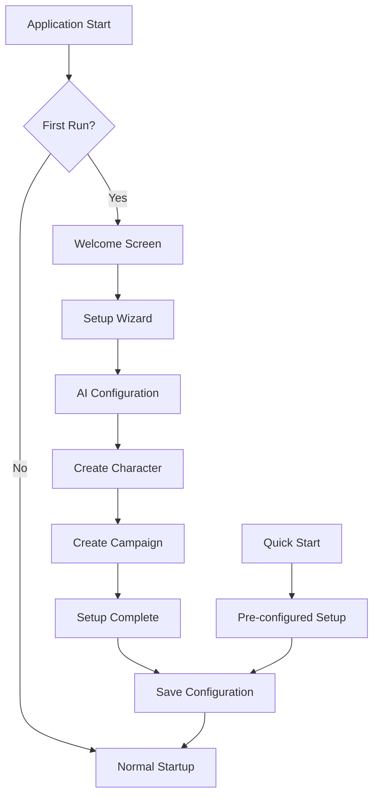

# Interactive Setup Plan

## Overview

This document describes the design for an interactive setup wizard for the D&D
Character Consultant System. The goal is to provide a guided first-run experience
for new users, helping them configure the system and create their first character
or campaign.

## Problem Statement

### Current Issues

1. **No Guided Onboarding**: New users must figure out the system on their own
   without any guided setup process.

2. **Manual Configuration**: Users must manually create configuration files,
   character profiles, and campaign structures.

3. **No First-Run Detection**: The system doesn't detect when it's being run
   for the first time to offer setup assistance.

4. **Steep Learning Curve**: Without guidance, new users may struggle to
   understand the system's capabilities.

### Evidence from Codebase

| Current State | Limitation |
|---------------|------------|
| No setup wizard | No guided onboarding |
| Manual file creation | Users must understand JSON structure |
| No first-run detection | Cannot offer help to new users |
| Basic CLI help | Limited guidance for new users |

---

## Proposed Solution

### High-Level Approach

1. **Setup Wizard Flow**: Step-by-step guided setup for new users
2. **Interactive Prompts**: User-friendly prompts for configuration choices
3. **Configuration Generation**: Automatic creation of config files
4. **First-Run Detection**: Detect and offer setup on first run
5. **Quick Start Options**: Pre-configured templates for common use cases

### Setup Architecture



---

## Implementation Details

### 1. First-Run Detection

Create `src/setup/first_run.py`:

```python
"""First-run detection and management."""

from pathlib import Path
from typing import Optional
from datetime import datetime

from src.utils.path_utils import get_game_data_path


class FirstRunDetector:
    """Detects and manages first-run state."""

    SETUP_MARKER_FILE = ".setup_complete"

    def __init__(self):
        """Initialize the first-run detector."""
        self.game_data_path = get_game_data_path()

    @property
    def marker_path(self) -> Path:
        """Get the path to the setup marker file."""
        return self.game_data_path / self.SETUP_MARKER_FILE

    def is_first_run(self) -> bool:
        """Check if this is the first run of the application.

        Returns:
            True if this is the first run
        """
        # Check if marker file exists
        if self.marker_path.exists():
            return False

        # Check if game_data has any content
        if self._has_existing_data():
            return False

        return True

    def _has_existing_data(self) -> bool:
        """Check if there is existing game data.

        Returns:
            True if game data exists
        """
        # Check for characters
        characters_dir = self.game_data_path / "characters"
        if characters_dir.exists():
            json_files = list(characters_dir.glob("*.json"))
            # Exclude example files
            real_files = [f for f in json_files if not f.name.startswith(".")]
            if real_files:
                return True

        # Check for campaigns
        campaigns_dir = self.game_data_path / "campaigns"
        if campaigns_dir.exists():
            campaign_dirs = [d for d in campaigns_dir.iterdir() if d.is_dir()]
            if campaign_dirs:
                return True

        return False

    def mark_setup_complete(self, setup_info: Optional[dict] = None) -> None:
        """Mark the setup as complete.

        Args:
            setup_info: Optional information about the setup
        """
        import json

        self.marker_path.parent.mkdir(parents=True, exist_ok=True)

        data = {
            "setup_complete": True,
            "completed_at": datetime.now().isoformat(),
            "setup_info": setup_info or {}
        }

        with open(self.marker_path, "w", encoding="utf-8") as f:
            json.dump(data, f, indent=2)

    def get_setup_info(self) -> Optional[dict]:
        """Get information about the completed setup.

        Returns:
            Setup info dict or None if not set up
        """
        if not self.marker_path.exists():
            return None

        import json

        try:
            with open(self.marker_path, "r", encoding="utf-8") as f:
                data = json.load(f)
            return data.get("setup_info")
        except Exception:
            return None

    def reset_setup(self) -> None:
        """Reset the setup state (for testing or re-setup)."""
        if self.marker_path.exists():
            self.marker_path.unlink()


# Singleton instance
_first_run_detector: Optional[FirstRunDetector] = None


def get_first_run_detector() -> FirstRunDetector:
    """Get the global first-run detector instance."""
    global _first_run_detector
    if _first_run_detector is None:
        _first_run_detector = FirstRunDetector()
    return _first_run_detector
```

### 2. Setup Wizard

Create `src/setup/setup_wizard.py`:

```python
"""Interactive setup wizard for first-time users."""

from typing import Optional, Dict, Any, List
from dataclasses import dataclass, field
from enum import Enum
import os

from src.setup.first_run import get_first_run_detector
from src.utils.path_utils import get_game_data_path
from src.utils.file_io import save_json_file, ensure_directory


class SetupStep(Enum):
    """Steps in the setup wizard."""
    WELCOME = "welcome"
    AI_CONFIG = "ai_config"
    CREATE_CHARACTER = "create_character"
    CREATE_CAMPAIGN = "create_campaign"
    COMPLETE = "complete"


@dataclass
class SetupState:
    """State of the setup wizard."""
    current_step: SetupStep = SetupStep.WELCOME
    ai_configured: bool = False
    character_created: bool = False
    campaign_created: bool = False
    setup_data: Dict[str, Any] = field(default_factory=dict)


class SetupWizard:
    """Interactive setup wizard for new users."""

    def __init__(self):
        """Initialize the setup wizard."""
        self.state = SetupState()
        self.detector = get_first_run_detector()

    def run(self) -> bool:
        """Run the setup wizard.

        Returns:
            True if setup completed successfully
        """
        self._show_welcome()

        # Ask if user wants guided setup
        if not self._ask_yes_no(
            "Would you like to run the guided setup?",
            default=True
        ):
            print("\nYou can run setup later with: dnd-consultant setup")
            return False

        # AI Configuration
        self._configure_ai()

        # Character creation
        self._create_character_prompt()

        # Campaign creation
        self._create_campaign_prompt()

        # Complete setup
        self._complete_setup()

        return True

    def _show_welcome(self) -> None:
        """Show the welcome screen."""
        print("\n" + "=" * 60)
        print("Welcome to the D&D Character Consultant System!")
        print("=" * 60)
        print("""
This system helps you manage D&D characters, NPCs, campaigns,
and story generation with AI assistance.

Let's get you set up with:
  1. AI configuration for story generation
  2. Your first character
  3. Your first campaign
""")

    def _configure_ai(self) -> None:
        """Configure AI settings."""
        print("\n" + "-" * 40)
        print("AI Configuration")
        print("-" * 40)
        print("""
The system can use AI to generate stories, analyze characters,
and provide DM assistance. You'll need an API key from one of:
  - OpenAI (https://platform.openai.com)
  - OpenRouter (https://openrouter.ai)
  - Local Ollama (https://ollama.ai)
""")

        if not self._ask_yes_no("Would you like to configure AI now?", default=True):
            print("\nYou can configure AI later by editing .env file")
            return

        # Select provider
        print("\nSelect your AI provider:")
        print("  1. OpenAI")
        print("  2. OpenRouter")
        print("  3. Ollama (local)")
        print("  4. Skip for now")

        choice = self._ask_choice("Provider", ["1", "2", "3", "4"], default="4")

        if choice == "4":
            print("\nAI configuration skipped. You can configure later.")
            return

        provider_map = {
            "1": "openai",
            "2": "openrouter",
            "3": "ollama"
        }

        provider = provider_map[choice]

        # Get API key (not needed for Ollama)
        api_key = ""
        if provider != "ollama":
            api_key = self._ask_input("Enter your API key", password=True)

        # Get model
        default_models = {
            "openai": "gpt-4",
            "openrouter": "openai/gpt-4",
            "ollama": "llama2"
        }

        model = self._ask_input(
            f"Model name",
            default=default_models.get(provider, "")
        )

        # Save configuration
        self._save_ai_config(provider, api_key, model)

        self.state.ai_configured = True
        print("\nAI configuration saved!")

    def _save_ai_config(
        self,
        provider: str,
        api_key: str,
        model: str
    ) -> None:
        """Save AI configuration to .env file."""
        env_path = get_game_data_path().parent / ".env"

        lines = []

        # Read existing .env if present
        if env_path.exists():
            with open(env_path, "r", encoding="utf-8") as f:
                lines = f.readlines()

        # Update or add settings
        settings = {
            "AI_PROVIDER": provider,
            "AI_MODEL": model,
            "AI_API_KEY": api_key
        }

        for key, value in settings.items():
            found = False
            for i, line in enumerate(lines):
                if line.startswith(f"{key}="):
                    lines[i] = f"{key}={value}\n"
                    found = True
                    break

            if not found:
                lines.append(f"{key}={value}\n")

        # Write back
        with open(env_path, "w", encoding="utf-8") as f:
            f.writelines(lines)

        self.state.setup_data["ai_provider"] = provider
        self.state.setup_data["ai_model"] = model

    def _create_character_prompt(self) -> None:
        """Prompt for character creation."""
        print("\n" + "-" * 40)
        print("Character Creation")
        print("-" * 40)
        print("""
Let's create your first character. You can create more later
using the character management commands.
""")

        if not self._ask_yes_no("Create a character now?", default=True):
            print("\nYou can create characters later with: dnd-consultant character create")
            return

        self._create_character()

    def _create_character(self) -> None:
        """Create a character interactively."""
        print("\n--- New Character ---")

        # Basic info
        name = self._ask_input("Character name")

        print("\nSelect character class:")
        classes = [
            "Barbarian", "Bard", "Cleric", "Druid",
            "Fighter", "Monk", "Paladin", "Ranger",
            "Rogue", "Sorcerer", "Warlock", "Wizard"
        ]

        for i, cls in enumerate(classes, 1):
            print(f"  {i}. {cls}")

        class_choice = self._ask_choice(
            "Class",
            [str(i) for i in range(1, len(classes) + 1)]
        )
        dnd_class = classes[int(class_choice) - 1]

        # Level
        level = int(self._ask_input("Level", default="1"))

        # Species
        print("\nSelect species/race:")
        species_list = [
            "Human", "Elf", "Dwarf", "Halfling",
            "Dragonborn", "Gnome", "Half-Elf", "Half-Orc",
            "Tiefling", "Other"
        ]

        for i, species in enumerate(species_list, 1):
            print(f"  {i}. {species}")

        species_choice = self._ask_choice(
            "Species",
            [str(i) for i in range(1, len(species_list) + 1)]
        )

        if species_choice == str(len(species_list)):
            species = self._ask_input("Enter species name")
        else:
            species = species_list[int(species_choice) - 1]

        # Background
        print("\nSelect background:")
        backgrounds = [
            "Acolyte", "Criminal", "Folk Hero", "Noble",
            "Sage", "Soldier", "Other"
        ]

        for i, bg in enumerate(backgrounds, 1):
            print(f"  {i}. {bg}")

        bg_choice = self._ask_choice(
            "Background",
            [str(i) for i in range(1, len(backgrounds) + 1)]
        )

        if bg_choice == str(len(backgrounds)):
            background = self._ask_input("Enter background name")
        else:
            background = backgrounds[int(bg_choice) - 1]

        # Ability scores
        print("\nEnter ability scores (or press Enter for standard array):")
        print("Standard array: 15, 14, 13, 12, 10, 8")

        use_standard = self._ask_yes_no("Use standard array?", default=True)

        if use_standard:
            scores = [15, 14, 13, 12, 10, 8]
            abilities = ["Strength", "Dexterity", "Constitution",
                        "Intelligence", "Wisdom", "Charisma"]

            print("\nAssign scores to abilities:")
            ability_scores = {}
            remaining_scores = scores.copy()

            for ability in abilities:
                print(f"\nRemaining scores: {remaining_scores}")
                score_choice = self._ask_choice(
                    f"{ability} score",
                    [str(s) for s in remaining_scores]
                )
                ability_scores[ability.lower()[:3]] = int(score_choice)
                remaining_scores.remove(int(score_choice))
        else:
            ability_scores = {
                "str": int(self._ask_input("Strength", default="10")),
                "dex": int(self._ask_input("Dexterity", default="10")),
                "con": int(self._ask_input("Constitution", default="10")),
                "int": int(self._ask_input("Intelligence", default="10")),
                "wis": int(self._ask_input("Wisdom", default="10")),
                "cha": int(self._ask_input("Charisma", default="10"))
            }

        # Create character file
        character_data = {
            "name": name,
            "dnd_class": dnd_class,
            "level": level,
            "species": species,
            "background": background,
            "ability_scores": ability_scores,
            "personality_traits": [],
            "ideals": "",
            "bonds": "",
            "flaws": "",
            "backstory": "",
            "equipment": [],
            "known_spells": [],
            "relationships": {}
        }

        # Save character
        char_path = get_game_data_path() / "characters" / f"{name.lower()}.json"
        char_path.parent.mkdir(parents=True, exist_ok=True)
        save_json_file(str(char_path), character_data)

        self.state.character_created = True
        self.state.setup_data["first_character"] = name

        print(f"\nCharacter '{name}' created successfully!")

    def _create_campaign_prompt(self) -> None:
        """Prompt for campaign creation."""
        print("\n" + "-" * 40)
        print("Campaign Creation")
        print("-" * 40)
        print("""
Let's create your first campaign to organize your stories.
""")

        if not self._ask_yes_no("Create a campaign now?", default=True):
            print("\nYou can create campaigns later with: dnd-consultant campaign create")
            return

        self._create_campaign()

    def _create_campaign(self) -> None:
        """Create a campaign interactively."""
        print("\n--- New Campaign ---")

        # Campaign name
        name = self._ask_input("Campaign name")

        # Campaign type
        print("\nSelect campaign type:")
        types = [
            "Homebrew (custom world)",
            "Published Adventure",
            "One-shot",
            "Sandbox"
        ]

        for i, ctype in enumerate(types, 1):
            print(f"  {i}. {ctype}")

        type_choice = self._ask_choice(
            "Type",
            [str(i) for i in range(1, len(types) + 1)]
        )
        campaign_type = types[int(type_choice) - 1]

        # Description
        description = self._ask_input("Brief description (optional)", default="")

        # Create campaign directory
        campaign_dir = get_game_data_path() / "campaigns" / name
        campaign_dir.mkdir(parents=True, exist_ok=True)

        # Create campaign info file
        campaign_info = {
            "name": name,
            "type": campaign_type,
            "description": description,
            "created_at": self._get_timestamp(),
            "sessions": []
        }

        info_path = campaign_dir / "campaign_info.json"
        save_json_file(str(info_path), campaign_info)

        # Create initial story file
        story_path = campaign_dir / "001_beginning.md"
        story_content = f"""# {name}

## Session 1

*Your story begins here...*

"""
        with open(story_path, "w", encoding="utf-8") as f:
            f.write(story_content)

        self.state.campaign_created = True
        self.state.setup_data["first_campaign"] = name

        print(f"\nCampaign '{name}' created successfully!")

    def _complete_setup(self) -> None:
        """Complete the setup process."""
        print("\n" + "=" * 60)
        print("Setup Complete!")
        print("=" * 60)

        print("\nYou're all set up! Here's what was configured:")

        if self.state.ai_configured:
            print(f"  [x] AI: {self.state.setup_data.get('ai_provider', 'configured')}")
        else:
            print("  [ ] AI: Not configured (edit .env to add)")

        if self.state.character_created:
            print(f"  [x] Character: {self.state.setup_data.get('first_character', 'created')}")
        else:
            print("  [ ] Character: None created yet")

        if self.state.campaign_created:
            print(f"  [x] Campaign: {self.state.setup_data.get('first_campaign', 'created')}")
        else:
            print("  [ ] Campaign: None created yet")

        print("""
Quick Start Commands:
  dnd-consultant story create    - Create a new story
  dnd-consultant character list  - List your characters
  dnd-consultant campaign list   - List your campaigns
  dnd-consultant --help          - Show all commands

Documentation: See docs/ folder for guides and tutorials.
""")

        # Mark setup complete
        self.detector.mark_setup_complete(self.state.setup_data)

    # Helper methods

    def _ask_yes_no(self, prompt: str, default: bool = True) -> bool:
        """Ask a yes/no question."""
        default_str = "Y/n" if default else "y/N"

        while True:
            response = input(f"{prompt} [{default_str}]: ").strip().lower()

            if not response:
                return default

            if response in ("y", "yes"):
                return True
            elif response in ("n", "no"):
                return False

            print("Please enter 'y' or 'n'")

    def _ask_choice(
        self,
        prompt: str,
        choices: List[str],
        default: Optional[str] = None
    ) -> str:
        """Ask user to choose from options."""
        default_str = f" [{default}]" if default else ""

        while True:
            response = input(f"{prompt}{default_str}: ").strip()

            if not response and default:
                return default

            if response in choices:
                return response

            print(f"Please enter one of: {', '.join(choices)}")

    def _ask_input(
        self,
        prompt: str,
        default: str = "",
        password: bool = False
    ) -> str:
        """Ask for text input."""
        default_str = f" [{default}]" if default else ""

        if password:
            import getpass
            response = getpass.getpass(f"{prompt}{default_str}: ").strip()
        else:
            response = input(f"{prompt}{default_str}: ").strip()

        return response if response else default

    def _get_timestamp(self) -> str:
        """Get current timestamp."""
        from datetime import datetime
        return datetime.now().isoformat()


# Quick start templates

QUICK_START_TEMPLATES = {
    "basic": {
        "name": "Basic Setup",
        "description": "Minimal setup with one character and campaign",
        "ai_required": False,
        "steps": ["character", "campaign"]
    },
    "ai_powered": {
        "name": "AI-Powered Setup",
        "description": "Full setup with AI configuration",
        "ai_required": True,
        "steps": ["ai", "character", "campaign"]
    },
    "dm_ready": {
        "name": "DM Ready",
        "description": "Setup for DMs with multiple NPCs and campaigns",
        "ai_required": False,
        "steps": ["ai", "character", "npcs", "campaign"]
    }
}


def run_quick_start(template_name: str = "basic") -> bool:
    """Run a quick start template.

    Args:
        template_name: Name of the quick start template

    Returns:
        True if setup completed successfully
    """
    template = QUICK_START_TEMPLATES.get(template_name)

    if not template:
        print(f"Unknown template: {template_name}")
        print(f"Available: {', '.join(QUICK_START_TEMPLATES.keys())}")
        return False

    print(f"\nQuick Start: {template['name']}")
    print(f"{template['description']}\n")

    wizard = SetupWizard()

    # Run appropriate steps
    if "ai" in template["steps"]:
        wizard._configure_ai()

    if "character" in template["steps"]:
        wizard._create_character_prompt()

    if "npcs" in template["steps"]:
        # Create some sample NPCs
        pass

    if "campaign" in template["steps"]:
        wizard._create_campaign_prompt()

    wizard._complete_setup()

    return True
```

### 3. CLI Integration

Create `src/cli/cli_setup.py`:

```python
"""CLI commands for setup management."""

from src.setup.setup_wizard import SetupWizard, run_quick_start
from src.setup.first_run import get_first_run_detector


def add_setup_commands(cli_group):
    """Add setup commands to CLI."""

    @cli_group.command("setup")
    def setup():
        """Run the interactive setup wizard."""
        detector = get_first_run_detector()

        if not detector.is_first_run():
            print("Setup has already been completed.")
            print("Run 'dnd-consultant setup --reset' to reconfigure.")
            return

        wizard = SetupWizard()
        wizard.run()

    @cli_group.command("setup-quick")
    def setup_quick(template: str = "basic"):
        """Run quick start setup with a template.

        Args:
            template: Quick start template (basic, ai_powered, dm_ready)
        """
        run_quick_start(template)

    @cli_group.command("setup-reset")
    def setup_reset():
        """Reset setup state and run setup again."""
        detector = get_first_run_detector()
        detector.reset_setup()

        print("Setup state reset. Running setup wizard...")

        wizard = SetupWizard()
        wizard.run()

    @cli_group.command("setup-status")
    def setup_status():
        """Show current setup status."""
        detector = get_first_run_detector()

        if detector.is_first_run():
            print("Setup has not been completed.")
            print("Run 'dnd-consultant setup' to get started.")
            return

        info = detector.get_setup_info()

        print("Setup Status: Complete")
        print("-" * 40)

        if info:
            if "ai_provider" in info:
                print(f"AI Provider: {info['ai_provider']}")
            if "first_character" in info:
                print(f"First Character: {info['first_character']}")
            if "first_campaign" in info:
                print(f"First Campaign: {info['first_campaign']}")


def check_first_run() -> bool:
    """Check if this is first run and offer setup.

    Returns:
        True if this is first run
    """
    detector = get_first_run_detector()

    if not detector.is_first_run():
        return False

    print("\n" + "=" * 60)
    print("Welcome! This appears to be your first run.")
    print("=" * 60)
    print("\nWould you like to run the setup wizard?")
    print("  1. Yes, run guided setup")
    print("  2. Quick start (basic setup)")
    print("  3. No, I'll configure manually")

    choice = input("\nChoice [1-3]: ").strip()

    if choice == "1":
        wizard = SetupWizard()
        wizard.run()
    elif choice == "2":
        run_quick_start("basic")
    else:
        print("\nYou can run setup later with: dnd-consultant setup")

    return True
```

### 4. Application Integration

Update `src/cli/dnd_consultant.py`:

```python
"""Main CLI entry point with first-run detection."""

import sys
from typing import Optional

import click

from src.cli.cli_setup import check_first_run, add_setup_commands


@click.group()
@click.option("--skip-setup", is_flag=True, help="Skip first-run setup check")
@click.version_option(version="1.0.0")
def cli(skip_setup: bool):
    """D&D Character Consultant System."""
    if not skip_setup:
        check_first_run()


# Add command groups
def main():
    """Main entry point."""
    # Add all command groups
    add_setup_commands(cli)
    # ... other command groups

    cli()


if __name__ == "__main__":
    main()
```

### 5. Configuration Templates

Create `templates/setup/.env.template`:

```env
# D&D Character Consultant Configuration
# Generated by setup wizard

# AI Configuration
AI_PROVIDER=openai
AI_MODEL=gpt-4
AI_API_KEY=your-api-key-here

# Optional: Alternative endpoints
# AI_BASE_URL=https://api.openai.com/v1

# RAG Configuration
RAG_ENABLED=true
RAG_WIKI_BASE_URL=https://dnd5e.wikidot.com
RAG_CACHE_TTL=86400

# Backup Configuration
BACKUP_ENABLED=true
BACKUP_SCHEDULE=daily
```

Create `templates/setup/character_template.json`:

```json
{
  "name": "",
  "dnd_class": "",
  "level": 1,
  "species": "",
  "background": "",
  "ability_scores": {
    "str": 10,
    "dex": 10,
    "con": 10,
    "int": 10,
    "wis": 10,
    "cha": 10
  },
  "personality_traits": [],
  "ideals": "",
  "bonds": "",
  "flaws": "",
  "backstory": "",
  "equipment": [],
  "known_spells": [],
  "relationships": {}
}
```

---

## Affected Files

### New Files to Create

| File | Purpose |
|------|---------|
| `src/setup/__init__.py` | Package initialization |
| `src/setup/first_run.py` | First-run detection |
| `src/setup/setup_wizard.py` | Interactive setup wizard |
| `src/cli/cli_setup.py` | CLI setup commands |
| `templates/setup/.env.template` | Environment template |
| `templates/setup/character_template.json` | Character template |
| `tests/setup/test_first_run.py` | First-run tests |
| `tests/setup/test_setup_wizard.py` | Wizard tests |

### Files to Modify

| File | Changes |
|------|---------|
| `src/cli/dnd_consultant.py` | Add first-run check |
| `src/cli/setup.py` | Integrate with new setup system |

---

## Testing Strategy

### Unit Tests

1. **First-Run Detector Tests**
   - Test detection logic
   - Test marker file handling
   - Test reset functionality

2. **Setup Wizard Tests**
   - Test step progression
   - Test configuration generation
   - Test character creation

### Integration Tests

1. **End-to-End Tests**
   - Test complete setup flow
   - Test quick start templates
   - Test configuration persistence

### Test Data

- Use temporary directories for testing
- Mock user input for automated testing
- Test with various configuration scenarios

---

## Migration Path

### Phase 1: Core Infrastructure

1. Create `src/setup/` package
2. Implement first-run detection
3. Add unit tests

### Phase 2: Setup Wizard

1. Implement setup wizard
2. Add AI configuration
3. Add character creation
4. Add campaign creation

### Phase 3: CLI Integration

1. Add setup commands
2. Add first-run check to main CLI
3. Add quick start templates

### Phase 4: Polish

1. Add input validation
2. Add error handling
3. Add help text
4. Document setup process

### Backward Compatibility

- Setup is entirely optional
- Existing installations work without changes
- No breaking changes to existing APIs

---

## Dependencies

### Internal Dependencies

- `src/utils/file_io.py` - File operations
- `src/utils/path_utils.py` - Path resolution

### External Dependencies

None - uses only Python standard library

---

## Future Enhancements

1. **Web-Based Setup**: Browser-based setup wizard
2. **Import from D&D Beyond**: Import characters from D&D Beyond
3. **Import from Roll20**: Import campaign data from Roll20
4. **Guided Tutorial**: Interactive tutorial after setup
5. **Configuration Profiles**: Multiple configuration profiles
