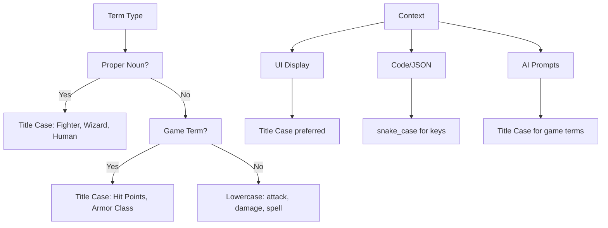

# Language Fixes Plan

## Overview

This document describes the design for a comprehensive Language Fixes initiative to
standardize terminology, fix typos, and ensure consistent language throughout the
D&D Character Consultant System. Consistent language is critical for:
- AI prompt reliability and response quality
- User experience clarity
- Code maintainability
- D&D 5e rules accuracy

## Problem Statement

### Current Issues

1. **Inconsistent D&D Terminology**: The codebase uses multiple variations for
   the same D&D concepts:
   - Hit Points: "hit points", "Hit Points", "HP", "hp"
   - Armor Class: "Armor Class", "AC", "ac"
   - Difficulty Class: "DC", "difficulty class", "Difficulty Class"
   - Saving Throws: "save", "saving throw", "Saving Throw", "saves"

2. **Inconsistent Capitalization**: Game terms have varying capitalization:
   - Class names: "Fighter" vs "fighter" vs "FIGHTER"
   - Species names: "Human" vs "human"
   - Ability names: "Strength" vs "strength"

3. **AI Prompt Language Variability**: Prompts across different modules use
   different phrasing for similar requests, potentially affecting AI response
   consistency.

4. **User-Facing Message Inconsistency**: CLI messages vary in style, tone,
   and formatting.

### Evidence from Codebase

| Term | Variations Found | Location |
|------|------------------|----------|
| Hit Points | "hit points", "HP", "hp" | [`narrator_descriptions.py`](src/combat/narrator_descriptions.py), [`npc_migration.py`](src/utils/npc_migration.py) |
| Armor Class | "Armor Class", "AC", "ac" | [`npc_migration.py`](src/utils/npc_migration.py), [`item_registry.py`](src/items/item_registry.py) |
| DC | "DC", "difficulty class" | [`consultant_ai.py`](src/characters/consultants/consultant_ai.py), [`dnd_rules.py`](src/utils/dnd_rules.py) |
| Class | "dnd_class", "character_class", "class" | [`character_profile.py`](src/characters/consultants/character_profile.py), JSON files |

---

## Terminology Standardization

### D&D 5e Official Terms

The following terms must be standardized according to D&D 5e official terminology:

#### Core Statistics

| Term | Standard Form | Abbreviation | Usage Context |
|------|---------------|--------------|---------------|
| Hit Points | Hit Points | HP | UI displays, combat narration |
| Armor Class | Armor Class | AC | UI displays, item descriptions |
| Difficulty Class | Difficulty Class | DC | All contexts |
| Saving Throw | Saving Throw | save | Action descriptions |
| Ability Score | Ability Score | - | Character data |
| Ability Modifier | Ability Modifier | modifier | Calculations |
| Proficiency Bonus | Proficiency Bonus | - | Character data |
| Speed | Speed | - | Movement |
| Initiative | Initiative | - | Combat |

#### Character Identity

| Term | Standard Form | Notes |
|------|---------------|-------|
| Class | Class | Use "class" in code, "Class" in display |
| Subclass | Subclass | Also: archetype, tradition, domain |
| Species | Species | D&D 2024 terminology (not "race") |
| Lineage | Lineage | Subspecies/heritage |
| Level | Level | Character level |
| Background | Background | PHB background name |

#### Ability Scores

| Ability | Standard Name | Abbreviation |
|---------|---------------|--------------|
| Strength | Strength | STR |
| Dexterity | Dexterity | DEX |
| Constitution | Constitution | CON |
| Intelligence | Intelligence | INT |
| Wisdom | Wisdom | WIS |
| Charisma | Charisma | CHA |

#### Capitalization Rules



### Abbreviation Usage Guidelines

| Context | Use Full Term | Use Abbreviation |
|---------|---------------|------------------|
| First mention in UI | Yes | No |
| Subsequent mentions | Optional | Yes |
| Tables/columns | No | Yes |
| AI prompts | Yes | No |
| Code comments | Optional | Yes |
| JSON keys | No | Use snake_case |

---

## Grammar and Style Guidelines

### AI Prompt Language Standards

All AI prompts must follow these standards:

#### Structure

1. **System prompts**: Define role and context clearly
2. **User prompts**: Provide specific, unambiguous instructions
3. **Response format**: Specify expected output format

#### Language Patterns

```python
# CORRECT: Clear, specific, consistent
system_prompt = """You are a D&D 5e Dungeon Master assistant.
Provide suggestions using official D&D 5e terminology.
Use Title Case for game terms: Hit Points, Armor Class, Difficulty Class."""

# INCORRECT: Vague, inconsistent
system_prompt = """You are a DM helper.
Use hp/HP/hit points as needed.
Suggest DCs or difficulty classes for actions."""
```

#### Standard Prompt Phrases

| Purpose | Standard Phrase |
|---------|-----------------|
| Request DC | "Suggest an appropriate Difficulty Class (DC)" |
| Request reaction | "How would this character react?" |
| Request analysis | "Analyze this character's actions for consistency" |
| Request narration | "Convert this tactical description into narrative prose" |

### User-Facing Message Style

#### Message Categories

| Category | Prefix | Example |
|----------|--------|---------|
| Success | `[SUCCESS]` | `[SUCCESS] Profile saved!` |
| Error | `[ERROR]` | `[ERROR] Failed to load character` |
| Warning | `[WARNING]` | `[WARNING] AI not available` |
| Info | `[INFO]` | `[INFO] Using default configuration` |
| Debug | `[DEBUG]` | `[DEBUG] Character cache cleared` |

#### Message Formatting Rules

1. **Prefixes**: Use square brackets with uppercase label
2. **Punctuation**: End messages with appropriate punctuation
3. **Tone**: Professional, clear, actionable
4. **Details**: Include relevant context for errors

```python
# CORRECT
print("[SUCCESS] Character profile saved to game_data/characters/aragorn.json")
print("[ERROR] Failed to load profile: File not found at game_data/characters/unknown.json")
print("[WARNING] AI integration disabled - using fallback mode")

# INCORRECT
print("Success! saved.")
print("Error: file not found!!")
print("warning: ai disabled")
```

### Error Message Formatting

All error messages must include:

1. **What failed**: Clear description of the operation
2. **Why it failed**: Reason or error type
3. **How to fix**: Suggested resolution (when applicable)

```python
# Standard error format
ERROR_TEMPLATE = "[{CATEGORY}] {operation} failed: {reason}. {suggestion}"

# Examples
"[ERROR] Character load failed: File not found. Check the filename and try again."
"[WARNING] AI request failed: Connection timeout. Check your network connection."
"[ERROR] Validation failed: Missing required field 'name'. Add the field to your JSON file."
```

---

## Implementation Approach

### Phase 1: Terminology Constants Module

Create a centralized terminology module for consistent usage:

**File**: [`src/utils/terminology.py`](src/utils/terminology.py) (new)

```python
"""
D&D 5e Terminology Constants

Provides standardized terminology for consistent usage across the codebase.
All game terms follow D&D 5e official conventions.
"""

# Core Statistics
TERM_HIT_POINTS = "Hit Points"
TERM_ARMOR_CLASS = "Armor Class"
TERM_DIFFICULTY_CLASS = "Difficulty Class"
TERM_SAVING_THROW = "Saving Throw"
TERM_ABILITY_SCORE = "Ability Score"

# Abbreviations (for display contexts where space is limited)
ABBR_HIT_POINTS = "HP"
ABBR_ARMOR_CLASS = "AC"
ABBR_DIFFICULTY_CLASS = "DC"

# Ability Scores
ABILITIES = {
    "strength": "Strength",
    "dexterity": "Dexterity",
    "constitution": "Constitution",
    "intelligence": "Intelligence",
    "wisdom": "Wisdom",
    "charisma": "Charisma",
}

ABILITY_ABBREVIATIONS = {
    "Strength": "STR",
    "Dexterity": "DEX",
    "Constitution": "CON",
    "Intelligence": "INT",
    "Wisdom": "WIS",
    "Charisma": "CHA",
}

# Character Identity
TERM_CLASS = "Class"
TERM_SUBCLASS = "Subclass"
TERM_SPECIES = "Species"
TERM_LINEAGE = "Lineage"
TERM_BACKGROUND = "Background"

# Message Prefixes
MSG_SUCCESS = "[SUCCESS]"
MSG_ERROR = "[ERROR]"
MSG_WARNING = "[WARNING]"
MSG_INFO = "[INFO]"
MSG_DEBUG = "[DEBUG]"

# DC Difficulty Levels (DMG 2024)
DC_DIFFICULTY = {
    "very_easy": 5,
    "easy": 10,
    "medium": 15,
    "hard": 20,
    "very_hard": 25,
    "nearly_impossible": 30,
}

DC_DIFFICULTY_NAMES = {
    5: "Very Easy",
    10: "Easy",
    15: "Medium",
    20: "Hard",
    25: "Very Hard",
    30: "Nearly Impossible",
}
```

### Phase 2: Terminology Validation

Add a validation step to check for terminology inconsistencies:

**File**: [`src/validation/terminology_validator.py`](src/validation/terminology_validator.py) (new)

```python
"""
Terminology Validator

Validates consistent usage of D&D terminology in code and data files.
"""

import re
from typing import List, Tuple
from pathlib import Path

# Inconsistent patterns to detect
INCONSISTENT_PATTERNS = [
    # Hit Points variations
    (r'\bhit points\b(?!\s*:\s*\d)', 'Use "Hit Points" (Title Case)'),
    (r'\bHP\b(?!\s*:\s*\d)', 'Use "Hit Points" or "hp" only in tables'),

    # Armor Class variations
    (r'\barmor class\b', 'Use "Armor Class" (Title Case)'),
    (r'\bac\b(?!\s*:\s*\d)', 'Use "AC" only in tables and calculations'),

    # DC variations
    (r'\bdifficulty class\b(?!\s*\()', 'Use "Difficulty Class" (Title Case)'),

    # Class capitalization
    (r'\b(fighter|wizard|rogue|cleric|barbarian|bard|druid|monk|paladin|ranger|sorcerer|warlock)\b',
     'Use Title Case for class names (e.g., "Fighter")'),
]

def validate_terminology_in_file(filepath: Path) -> List[Tuple[int, str, str]]:
    """Validate terminology in a source file.

    Args:
        filepath: Path to the file to validate

    Returns:
        List of (line_number, issue, suggestion) tuples
    """
    issues = []
    content = filepath.read_text(encoding='utf-8')

    for line_num, line in enumerate(content.split('\n'), 1):
        for pattern, suggestion in INCONSISTENT_PATTERNS:
            if re.search(pattern, line, re.IGNORECASE):
                issues.append((line_num, line.strip(), suggestion))

    return issues
```

### Phase 3: AI Prompt Standardization

Create standardized prompt templates:

**File**: [`src/ai/prompt_templates.py`](src/ai/prompt_templates.py) (new)

```python
"""
AI Prompt Templates

Standardized prompt templates for consistent AI interactions.
All prompts use official D&D 5e terminology.
"""

from src.utils.terminology import (
    TERM_HIT_POINTS,
    TERM_ARMOR_CLASS,
    TERM_DIFFICULTY_CLASS,
)

# System Prompts
SYSTEM_DM_ASSISTANT = """You are a D&D 5e Dungeon Master assistant.
Use official D&D 5e terminology with Title Case: Hit Points, Armor Class, Difficulty Class.
Provide clear, actionable suggestions based on the rules."""

SYSTEM_COMBAT_NARRATOR = """You are an expert D&D combat narrator.
Convert tactical descriptions into engaging narrative prose.
NEVER mention dice rolls, DCs, or game mechanics in the narrative.
Use present tense for immediacy and vivid sensory details."""

SYSTEM_CHARACTER_CONSULTANT = """You are a D&D character consultant.
Analyze character actions for consistency with established traits.
Suggest appropriate reactions based on personality and class."""

# DC Suggestion Prompt Template
DC_SUGGESTION_TEMPLATE = """Suggest an appropriate {dc_term} ({dc_abbr}) for this action:

Action: {action}
Character: {character_name} ({character_class} Level {character_level})

Consider:
1. Standard {dc_abbr} guidelines (5=very easy, 10=easy, 15=medium, 20=hard, 25=very hard, 30=nearly impossible)
2. Character's class abilities and level
3. Situational modifiers

Provide the suggested {dc_abbr} and reasoning."""

# Reaction Suggestion Template
REACTION_TEMPLATE = """Given this situation: {situation}

How would {character_name} react? Consider:
1. Immediate emotional/instinctive response
2. What they would say or do
3. Alignment with their goals and personality
4. Class abilities or knowledge they might use

Provide a natural, in-character response."""
```

---

## Files to be Updated

### Priority 1: Core Terminology (Critical)

| File | Changes Required |
|------|------------------|
| [`src/utils/dnd_rules.py`](src/utils/dnd_rules.py) | Add terminology imports, standardize comments |
| [`src/combat/narrator_descriptions.py`](src/combat/narrator_descriptions.py) | Use TERM_HIT_POINTS constant |
| [`src/combat/narrator_ai.py`](src/combat/narrator_ai.py) | Standardize AI prompts |
| [`src/characters/consultants/consultant_ai.py`](src/characters/consultants/consultant_ai.py) | Use prompt templates |
| [`src/utils/npc_migration.py`](src/utils/npc_migration.py) | Standardize user prompts |

### Priority 2: User-Facing Messages (High)

| File | Changes Required |
|------|------------------|
| [`src/cli/dnd_cli_helpers.py`](src/cli/dnd_cli_helpers.py) | Use message constants |
| [`src/cli/cli_story_manager.py`](src/cli/cli_story_manager.py) | Standardize messages |
| [`src/cli/cli_consultations.py`](src/cli/cli_consultations.py) | Use terminology constants |
| [`src/cli/cli_character_manager.py`](src/cli/cli_character_manager.py) | Standardize messages |
| [`src/cli/cli_session_manager.py`](src/cli/cli_session_manager.py) | Use message constants |

### Priority 3: AI Prompts (High)

| File | Changes Required |
|------|------------------|
| [`src/ai/ai_client.py`](src/ai/ai_client.py) | Use prompt templates |
| [`src/ai/rag_system.py`](src/ai/rag_system.py) | Standardize prompts |
| [`src/dm/dungeon_master.py`](src/dm/dungeon_master.py) | Use prompt templates |
| [`src/stories/story_ai_generator.py`](src/stories/story_ai_generator.py) | Standardize prompts |

### Priority 4: Validation (Medium)

| File | Changes Required |
|------|------------------|
| [`src/validation/character_validator.py`](src/validation/character_validator.py) | Use terminology constants |
| [`src/validation/npc_validator.py`](src/validation/npc_validator.py) | Use terminology constants |
| [`src/validation/party_validator.py`](src/validation/party_validator.py) | Use terminology constants |

### Priority 5: Documentation (Medium)

| File | Changes Required |
|------|------------------|
| [`README.md`](README.md) | Standardize terminology |
| [`docs/AI_INTEGRATION.md`](docs/AI_INTEGRATION.md) | Standardize terminology |
| [`docs/RAG_INTEGRATION.md`](docs/RAG_INTEGRATION.md) | Standardize terminology |
| [`AGENTS.md`](AGENTS.md) | Add terminology section |

---

## Testing Requirements

### Unit Tests

**File**: [`tests/utils/test_terminology.py`](tests/utils/test_terminology.py) (new)

```python
"""Tests for terminology consistency."""

import pytest
from src.utils.terminology import (
    TERM_HIT_POINTS,
    TERM_ARMOR_CLASS,
    TERM_DIFFICULTY_CLASS,
    ABILITIES,
    DC_DIFFICULTY,
)

class TestTerminologyConstants:
    """Test terminology constants are correct."""

    def test_hit_points_term(self):
        """Hit Points term is correctly formatted."""
        assert TERM_HIT_POINTS == "Hit Points"

    def test_armor_class_term(self):
        """Armor Class term is correctly formatted."""
        assert TERM_ARMOR_CLASS == "Armor Class"

    def test_dc_term(self):
        """Difficulty Class term is correctly formatted."""
        assert TERM_DIFFICULTY_CLASS == "Difficulty Class"

    def test_abilities_title_case(self):
        """All abilities are Title Case."""
        for key, value in ABILITIES.items():
            assert value == value.title()
            assert key == key.lower()

    def test_dc_difficulty_range(self):
        """DC difficulties are within valid range."""
        for name, dc in DC_DIFFICULTY.items():
            assert 5 <= dc <= 30
```

### Integration Tests

**File**: [`tests/validation/test_terminology_validator.py`](tests/validation/test_terminology_validator.py) (new)

```python
"""Tests for terminology validation."""

import pytest
from pathlib import Path
from src.validation.terminology_validator import validate_terminology_in_file

class TestTerminologyValidator:
    """Test terminology validation functionality."""

    def test_valid_terminology_passes(self, tmp_path):
        """Files with valid terminology pass validation."""
        test_file = tmp_path / "test.py"
        test_file.write_text('print("Hit Points: 20")')

        issues = validate_terminology_in_file(test_file)
        assert len(issues) == 0

    def test_lowercase_hit_points_flagged(self, tmp_path):
        """Lowercase 'hit points' is flagged."""
        test_file = tmp_path / "test.py"
        test_file.write_text('print("hit points: 20")')

        issues = validate_terminology_in_file(test_file)
        assert len(issues) > 0
        assert "Hit Points" in issues[0][2]
```

### Test Data Requirements

Use existing test characters:
- [`aragorn.json`](game_data/characters/aragorn.json) - Ranger with standard terminology
- [`frodo.json`](game_data/characters/frodo.json) - Halfling character
- [`gandalf.json`](game_data/characters/gandalf.json) - Wizard character

---

## Implementation Phases

### Phase 1: Foundation (New Files)

1. Create [`src/utils/terminology.py`](src/utils/terminology.py) with constants
2. Create [`src/ai/prompt_templates.py`](src/ai/prompt_templates.py) with templates
3. Create [`src/validation/terminology_validator.py`](src/validation/terminology_validator.py)
4. Add unit tests for new modules

### Phase 2: Core Updates

1. Update [`src/utils/dnd_rules.py`](src/utils/dnd_rules.py) to use terminology constants
2. Update combat narration modules to use standardized terms
3. Update AI client modules to use prompt templates
4. Run full test suite to verify no regressions

### Phase 3: CLI Updates

1. Update all CLI modules to use message constants
2. Standardize user-facing prompts and messages
3. Update error handling to use standard formats
4. Test CLI interactions manually

### Phase 4: Validation Integration

1. Add terminology validation to CI pipeline
2. Create pre-commit hooks for terminology checking
3. Document terminology standards in AGENTS.md
4. Update all documentation

### Phase 5: Documentation

1. Update README.md with terminology section
2. Update all docs/ files for consistency
3. Add terminology guide to AGENTS.md
4. Create terminology quick-reference card

---

## Success Criteria

1. **All terminology constants used consistently** across the codebase
2. **All AI prompts use standardized templates** from prompt_templates.py
3. **All user-facing messages use standard prefixes** and formatting
4. **Terminology validation passes** for all source files
5. **All tests pass** including new terminology tests
6. **Pylint score remains 10.00/10** for all modified files
7. **No emojis in any .py or .md files** (per AGENTS.md rules)

---

## Risk Mitigation

| Risk | Mitigation |
|------|------------|
| Breaking existing functionality | Comprehensive test coverage before changes |
| AI prompt changes affect response quality | Test prompts with multiple AI providers |
| User confusion from changed messages | Document changes in release notes |
| Incomplete migration | Use validation to catch remaining issues |

---

## Dependencies

- No external dependencies required
- Internal dependencies:
  - [`src/utils/dnd_rules.py`](src/utils/dnd_rules.py) for DC constants
  - [`src/utils/file_io.py`](src/utils/file_io.py) for validation file reading
  - [`src/validation/`](src/validation/) for validation framework

---

## Appendix: Quick Reference

### Standard Terminology Table

| Concept | Display Form | Code Key | Abbreviation |
|---------|--------------|----------|--------------|
| Hit Points | Hit Points | hit_points | HP |
| Armor Class | Armor Class | armor_class | AC |
| Difficulty Class | Difficulty Class | - | DC |
| Saving Throw | Saving Throw | saving_throw | - |
| Ability Score | Ability Score | ability_scores | - |
| Class | Class | dnd_class | - |
| Species | Species | species | - |
| Level | Level | level | - |

### Message Prefix Quick Reference

| Prefix | Use Case | Color (if supported) |
|--------|----------|---------------------|
| `[SUCCESS]` | Operation completed successfully | Green |
| `[ERROR]` | Operation failed, user action required | Red |
| `[WARNING]` | Non-critical issue, fallback used | Yellow |
| `[INFO]` | Informational message | Blue |
| `[DEBUG]` | Debug information (development only) | Gray |
