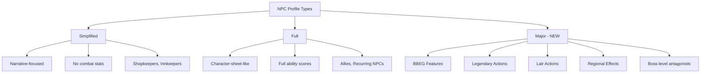
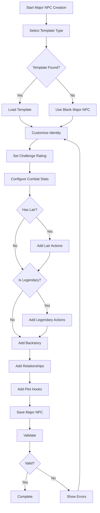

# Major NPC Template Plan

## Overview

This document describes the design for Major NPC templates - extended NPC profiles
for important non-player characters such as BBEGs (Big Bad Evil Guys), major villains,
key allies, and recurring characters who need full character-sheet-like data but are
not player characters.

## Problem Statement

### Current Issues

1. **Limited NPC Profiles**: Current NPCs use either simplified profiles (narrative-only)
   or full character profiles designed for player characters. Neither adequately serves
   the needs of major antagonists or key allies.

2. **Missing BBEG Features**: No support for lair actions, legendary actions, regional
   effects, or other features unique to boss-level antagonists.

3. **Inadequate Combat Integration**: Major NPCs in combat lack the structured data
   needed for AI-powered combat narration and tactical decision-making.

4. **No Archetype Templates**: DMs must manually create major NPCs from scratch with
   no guidance on appropriate stats, abilities, or features for different villain types.

### Evidence from Codebase

| Current State | Issue |
|---------------|-------|
| `game_data/npcs/npc.example.json` | Simplified profile - no combat stats |
| `game_data/npcs/npc_full_profile.example.json` | Player character structure - no BBEG features |
| `src/validation/npc_validator.py` | Only supports simplified and full types |
| No lair action support | Cannot define boss encounter mechanics |
| No legendary action support | Cannot define multi-turn boss abilities |

---

## Proposed Solution

### High-Level Approach

1. **New Profile Type**: Add major NPC profile type with BBEG-specific fields
2. **Extended Schema**: Define JSON schema for lair actions, legendary actions, etc.
3. **Template Library**: Create pre-built templates for common BBEG archetypes
4. **Combat Integration**: Integrate major NPCs with combat narrator system
5. **CLI Workflow**: Add major NPC creation and management to CLI

### Profile Type Architecture



---

## NPC Type Distinctions

### Regular NPCs vs Major NPCs

| Aspect | Regular NPCs | Major NPCs |
|--------|--------------|------------|
| **Profile Type** | simplified | major |
| **Combat Stats** | Optional | Required |
| **Ability Scores** | Optional | Required |
| **Legendary Actions** | No | Yes - for bosses |
| **Lair Actions** | No | Yes - for lair-bound |
| **Regional Effects** | No | Yes - for world-scale |
| **Backstory Depth** | Brief | Extensive |
| **Motivations** | Simple | Complex |
| **Relationships** | Local | Campaign-spanning |
| **AI Integration** | Basic dialogue | Full combat AI |

### NPC Classification Guide

**Regular NPCs - Use Simplified Profile:**
- Shopkeepers, merchants, innkeepers
- Town guards, soldiers, commoners
- Minor quest givers
- One-time encounter NPCs
- Background characters

**Regular NPCs - Use Full Profile:**
- Recurring allies with combat roles
- Important faction members
- Long-term quest givers with depth
- Henchmen with character levels

**Major NPCs - Use Major Profile:**
- Campaign antagonists (BBEGs)
- Recurring villains
- Key allies with significant power
- Boss monsters with intelligence
- Legendary figures

---

## JSON Schema for Major NPCs

### Core Structure

```json
{
  "$schema": "http://json-schema.org/draft-07/schema#",
  "title": "Major NPC Profile",
  "type": "object",
  "required": [
    "name", "role", "species", "profile_type", "faction",
    "challenge_rating", "ability_scores", "combat_stats",
    "personality", "motivations", "relationships"
  ],
  "properties": {
    "profile_type": {
      "type": "string",
      "const": "major",
      "description": "Identifies this as a major NPC profile"
    },
    "faction": {
      "type": "string",
      "enum": ["ally", "neutral", "enemy", "bbeg"],
      "description": "Extended to include bbeg for primary antagonists"
    }
  }
}
```

### Complete Major NPC Template

Create `game_data/npcs/major_npc.example.json`:

```json
{
  "_comment": "Major NPC profile example - for BBEGs, major villains, and key allies",
  "profile_type": "major",
  "faction": "bbeg",
  
  "_identity_section": "=== IDENTITY ===",
  "name": "Lord Malachar",
  "nickname": "The Shadow Lord",
  "title": "Archmage of the Dark Tower",
  "role": "Primary Antagonist",
  "species": "Human",
  "lineage": "Tiefling-blooded",
  
  "_narrative_section": "=== NARRATIVE ELEMENTS ===",
  "personality": "Coldly calculating, utterly ruthless, yet possessing a twisted sense of honor",
  "appearance": "Tall and gaunt, with pale skin and eyes that burn with unholy fire",
  "motivations": [
    "Achieve immortality through dark ritual",
    "Conquer the kingdom and reshape it in his image",
    "Destroy the order of paladins that spurned him"
  ],
  "fears_weaknesses": [
    "His own mortality driving his obsession",
    "Secret doubt about the morality of his actions",
    "The holy relic that can pierce his defenses"
  ],
  "backstory": "Once a promising paladin, Malachar fell from grace when his order sacrificed his family for political expediency. He turned to dark arts, becoming an archmage of terrible power. Now he seeks vengeance against all who wronged him.",
  
  "_relationships_section": "=== RELATIONSHIPS ===",
  "relationships": {
    "Order of the Silver Flame": "Sworn enemy - destroyed his family",
    "King Aldric": "Rival for the throne",
    "Lady Seraphina": "Former lover, now enemy",
    "The Shadow Council": "His loyal lieutenants"
  },
  "minions": [
    "Shadow Council Members",
    "Dark Knights",
    "Undead Servitors"
  ],
  "allies": [
    "Demon Lord Orcus",
    "The Thieves Guild"
  ],
  
  "_combat_section": "=== COMBAT STATISTICS ===",
  "challenge_rating": 17,
  "proficiency_bonus": 6,
  "ability_scores": {
    "strength": 12,
    "dexterity": 16,
    "constitution": 18,
    "intelligence": 22,
    "wisdom": 16,
    "charisma": 20
  },
  "saving_throws": {
    "intelligence": 12,
    "wisdom": 9,
    "charisma": 11
  },
  "skills": {
    "Arcana": 14,
    "History": 10,
    "Perception": 9,
    "Persuasion": 11,
    "Deception": 11
  },
  "combat_stats": {
    "max_hit_points": 350,
    "armor_class": 19,
    "armor_class_details": "Mage Armor with Shield spell available",
    "movement_speed": 30,
    "initiative_bonus": 3,
    "hit_dice": "20d8 + 80"
  },
  
  "_abilities_section": "=== ABILITIES AND POWERS ===",
  "damage_vulnerabilities": [],
  "damage_resistances": ["cold", "necrotic"],
  "damage_immunities": ["poison"],
  "condition_immunities": ["charmed", "frightened", "poisoned"],
  "senses": {
    "darkvision": 120,
    "truesight": 30,
    "passive_perception": 19
  },
  "languages": ["Common", "Infernal", "Abyssal", "Draconic", "Elvish"],
  
  "special_abilities": [
    {
      "name": "Legendary Resistance",
      "description": "If Malachar fails a saving throw, he can choose to succeed instead.",
      "uses": 3,
      "recharge": "per day"
    },
    {
      "name": "Magic Resistance",
      "description": "Malachar has advantage on saving throws against spells and other magical effects."
    },
    {
      "name": "Spellcasting",
      "description": "Malachar is a 20th-level spellcaster. His spellcasting ability is Intelligence.",
      "spell_attack_bonus": 15,
      "spell_save_dc": 23,
      "spellcasting_ability": "intelligence"
    }
  ],
  
  "_spells_section": "=== SPELLS ===",
  "known_spells": {
    "cantrips": ["fire bolt", "lightning lure", "mage hand", "prestidigitation", "ray of frost"],
    "1st_level": ["detect magic", "mage armor", "magic missile", "shield", "thunderwave"],
    "2nd_level": ["detect thoughts", "invisibility", "misty step", "web"],
    "3rd_level": ["counterspell", "fireball", "fly", "lightning bolt"],
    "4th_level": ["blight", "dimension door", "polymorph"],
    "5th_level": ["cloudkill", "cone of cold", "wall of force"],
    "6th_level": ["disintegrate", "globe of invulnerability"],
    "7th_level": ["finger of death", "plane shift"],
    "8th_level": ["dominate monster", "power word stun"],
    "9th_level": ["power word kill", "time stop"]
  },
  "spell_slots": {
    "1": 4,
    "2": 3,
    "3": 3,
    "4": 3,
    "5": 3,
    "6": 1,
    "7": 1,
    "8": 1,
    "9": 1
  },
  
  "_actions_section": "=== ACTIONS ===",
  "actions": [
    {
      "name": "Shadow Staff",
      "type": "melee",
      "description": "Melee Weapon Attack: +8 to hit, reach 6 ft., one target. Hit: 10 (1d8 + 6) bludgeoning damage plus 14 (4d6) necrotic damage."
    },
    {
      "name": "Shadow Bolt",
      "type": "ranged",
      "recharge": "5-6",
      "description": "Ranged Spell Attack: +15 to hit, range 120 ft., one target. Hit: 35 (10d6) necrotic damage."
    }
  ],
  
  "_legendary_section": "=== LEGENDARY ACTIONS ===",
  "legendary_actions": {
    "available": 3,
    "actions": [
      {
        "name": "Cantrip",
        "cost": 1,
        "description": "Malachar casts a cantrip."
      },
      {
        "name": "Shadow Step",
        "cost": 1,
        "description": "Malachar magically teleports up to 60 feet to an unoccupied space he can see that is in dim light or darkness."
      },
      {
        "name": "Attack",
        "cost": 2,
        "description": "Malachar makes one Shadow Staff attack."
      },
      {
        "name": "Darkness Descends",
        "cost": 3,
        "description": "Magical darkness spreads from a point Malachar chooses within 60 feet of him, filling a 15-foot-radius sphere."
      }
    ]
  },
  
  "_lair_section": "=== LAIR ACTIONS ===",
  "lair_actions": {
    "enabled": true,
    "lair_location": "The Dark Tower",
    "initiative_count": 20,
    "actions": [
      {
        "name": "Impeding Shadows",
        "description": "Shadows swirl around intruders. Each creature of Malachars choice within 120 feet must succeed on a DC 19 Dexterity saving throw or be restrained until initiative count 20 on the next round."
      },
      {
        "name": "Tower Defense",
        "description": "The tower itself attacks. Malachar chooses a 20-foot-square area within 120 feet. Stone spikes erupt: 28 (8d6) piercing damage, DC 19 Dexterity half."
      },
      {
        "name": "Dimensional Lock",
        "description": "Malachar seals the tower against teleportation. No creature can teleport within 300 feet until the next initiative count 20."
      }
    ]
  },
  
  "_regional_section": "=== REGIONAL EFFECTS ===",
  "regional_effects": {
    "enabled": true,
    "radius_miles": 6,
    "effects": [
      {
        "name": "Eternal Twilight",
        "description": "The land within 6 miles is perpetually shrouded in dim light."
      },
      {
        "name": "Nightmares",
        "description": "Creatures sleeping in the region have nightmares. They gain no benefit from a long rest unless they succeed on a DC 15 Wisdom save."
      },
      {
        "name": "Shadow Creatures",
        "description": "Shadows and undead have advantage on all checks within the region."
      }
    ],
    "dispel_condition": "These effects end if Malachar dies or the Dark Tower is destroyed."
  },
  
  "_equipment_section": "=== EQUIPMENT ===",
  "equipment": {
    "weapons": ["Staff of the Shadow Lord"],
    "armor": [],
    "items": ["Robes of the Archmagi", "Ring of Mind Shielding"],
    "magic_items": ["Staff of the Shadow Lord", "Robes of the Archmagi"],
    "gold": 50000
  },
  
  "_plot_section": "=== PLOT ELEMENTS ===",
  "plot_hooks": [
    "A village seeks heroes to stop the nightmares plaguing their children",
    "The Order of the Silver Flame offers a bounty for Malachars defeat",
    "Lady Seraphina knows the secret to piercing his defenses"
  ],
  "defeat_conditions": [
    "The Holy Sword of Saint Cuthbert can bypass his legendary resistance",
    "Destroying the phylactery hidden in the tower basement weakens him",
    "Redeeming his soul through the memory of his lost family"
  ],
  "encounter_tactics": [
    "Opens with Cloudkill to control the battlefield",
    "Uses legendary resistance sparingly, saving for truly deadly effects",
    "Targets healers first with Power Word spells",
    "Retreats through shadow step when cornered"
  ],
  
  "_ai_config_section": "=== AI CONFIGURATION ===",
  "ai_config": {
    "enabled": true,
    "temperature": 0.7,
    "max_tokens": 1500,
    "system_prompt": "You are Lord Malachar, the Shadow Lord. Speak with cold authority and barely contained rage. You are intelligent, calculating, and utterly ruthless. You view others as tools or obstacles. Your voice should be commanding and menacing.",
    "combat_ai": {
      "enabled": true,
      "tactics_profile": "controller",
      "preferred_spells": ["cloudkill", "wall of force", "counterspell"],
      "targeting_priority": ["healer", "caster", "melee"]
    }
  },
  
  "_metadata_section": "=== METADATA ===",
  "notes": "Primary antagonist for the Shadow Over the Kingdom campaign arc.",
  "recurring": true,
  "first_appearance": "Session 5",
  "tags": ["bbeg", "archmage", "fallen-paladin", "undead-adjacent"]
}
```

---

## Storage Location Options

### Option 1: Separate Directory

Create `game_data/major_npcs/` for major NPCs only.

**Pros:**
- Clear separation of NPC types
- Easier to manage large files
- Prevents cluttering regular NPC directory

**Cons:**
- Requires new path utilities
- Two places to search for NPCs
- More complex lookup logic

### Option 2: Extended NPC Files with Type Field

Keep all NPCs in `game_data/npcs/` with profile_type field.

**Pros:**
- Single location for all NPCs
- Existing path utilities work
- Simpler lookup logic

**Cons:**
- Directory may become cluttered
- Mix of simple and complex files

### Option 3: Hybrid Approach (Recommended)

Keep all NPCs in `game_data/npcs/` but organize with naming convention:
- Regular NPCs: `butterbur.json`, `guard_captain.json`
- Major NPCs: `major_malachar.json`, `major_sauron.json`

**Pros:**
- Single location with clear organization
- Existing utilities work with minimal changes
- Easy filtering by filename prefix
- Consistent with existing pattern

**Cons:**
- Requires naming convention discipline

### Recommended Implementation

Use Option 3 with the following:

1. Add `profile_type` field validation for major NPCs
2. Update [`npc_validator.py`](src/validation/npc_validator.py) to validate major profile type
3. Add filename prefix convention for easy filtering
4. Update [`path_utils.py`](src/utils/path_utils.py) with helper functions

---

## CLI Workflow for Major NPCs

### New CLI Commands

```
# Create a new major NPC from template
python dnd_consultant.py npc create-major --template bbeg_archmage --name "Lord Malachar"

# List all major NPCs
python dnd_consultant.py npc list-major

# Edit major NPC
python dnd_consultant.py npc edit-major "Lord Malachar"

# Validate major NPC
python dnd_consultant.py npc validate-major "Lord Malachar"

# Generate combat encounter
python dnd_consultant.py npc encounter "Lord Malachar" --party-level 10
```

### Major NPC Creation Wizard



---

## Integration with AI and Combat

### Combat Narrator Integration

Update [`combat_narrator.py`](src/combat/combat_narrator.py) to support major NPCs:

```python
# Pseudocode for integration
class CombatNarrator:
    def narrate_with_major_npc(
        self, 
        combat_prompt: str, 
        major_npc: dict,
        style: str = "cinematic"
    ) -> str:
        # Include legendary actions in narration
        # Reference lair actions when in lair
        # Use NPC personality for dialogue
        pass
```

### AI Consultant Integration

Major NPCs can be loaded as AI consultants for:
- Villain monologues
- Strategic advice for DM
- Combat AI for boss encounters
- Relationship-aware dialogue

### RAG System Integration

Update [`rag_system.py`](src/ai/rag_system.py) to index major NPC content:
- Backstory for context retrieval
- Plot hooks for story suggestions
- Relationships for consistency checking

---

## Template Examples for BBEG Archetypes

### BBEG Archetype Templates

Create templates in `templates/major_npcs/`:

| Template | CR Range | Key Features |
|----------|----------|--------------|
| `bbeg_archmage` | 14-20 | High spellcasting, legendary actions |
| `bbeg_warlord` | 12-18 | Martial prowess, minion commander |
| `bbeg_vampire_lord` | 13-19 | Undead traits, lair actions |
| `bbeg_dragon` | 10-20 | Dragon abilities, regional effects |
| `bbeg_demon_prince` | 16-26 | Demon traits, legendary resistance |
| `bbeg_lich` | 15-22 | Undead, lair actions, phylactery |
| `bbeg_fallen_hero` | 10-16 | Paladin abilities, tragic backstory |
| `bbeg_shadow_assassin` | 11-17 | Stealth, shadow abilities |

### Example Template: BBEG Archmage

Create `templates/major_npcs/bbeg_archmage.json`:

```json
{
  "name": "Archmage Villain",
  "template_type": "bbeg_archmage",
  "description": "A powerful spellcaster serving as primary antagonist",
  "challenge_rating_range": [14, 20],
  
  "base_stats": {
    "ability_scores": {
      "strength": 10,
      "dexterity": 14,
      "constitution": 16,
      "intelligence": 20,
      "wisdom": 14,
      "charisma": 16
    }
  },
  
  "required_features": [
    "Spellcasting",
    "Legendary Resistance",
    "Magic Resistance"
  ],
  
  "recommended_abilities": [
    "Counterspell",
    "Dimension Door",
    "Shield",
    "Misty Step"
  ],
  
  "legendary_action_templates": [
    "Cantrip",
    "Teleport",
    "Attack",
    "Spell (costs 2)"
  ],
  
  "lair_action_templates": [
    "Area control spell",
    "Defensive barrier",
    "Minion summon"
  ],
  
  "tactics_profile": "controller",
  "preferred_spells": ["area control", "counterspell", "escape"],
  
  "backstory_themes": [
    "Fallen from grace",
    "Seeking forbidden knowledge",
    "Revenge against order/kingdom",
    "Immortality obsession"
  ],
  
  "relationship_templates": {
    "minions": "Loyal followers",
    "rival": "Former ally turned enemy",
    "hero_connection": "Personal connection to a PC"
  }
}
```

---

## Testing Requirements

### Unit Tests

Create `tests/npcs/test_major_npc_validator.py`:

| Test | Description |
|------|-------------|
| `test_major_npc_valid` | Valid major NPC passes validation |
| `test_major_npc_missing_required` | Missing required fields fail |
| `test_legendary_actions_valid` | Legendary actions structure validated |
| `test_lair_actions_valid` | Lair actions structure validated |
| `test_regional_effects_valid` | Regional effects structure validated |
| `test_combat_stats_valid` | Combat stats validated |
| `test_spell_slots_valid` | Spell slots match CR expectations |
| `test_challenge_rating_range` | CR within valid range |

### Integration Tests

Create `tests/npcs/test_major_npc_integration.py`:

| Test | Description |
|------|-------------|
| `test_major_npc_loading` | Major NPC loads correctly |
| `test_major_npc_combat_integration` | Combat narrator uses major NPC |
| `test_major_npc_ai_consultant` | AI consultant works with major NPC |
| `test_major_npc_rag_indexing` | RAG indexes major NPC content |

### Test Data

Create test major NPCs in `game_data/npcs/`:
- `major_test_villain.json` - Basic major NPC for testing
- `major_test_boss.json` - Full BBEG with all features

---

## Implementation Phases

### Phase 1: Schema and Validation

1. Define major NPC JSON schema
2. Create example major NPC file
3. Update [`npc_validator.py`](src/validation/npc_validator.py) for major profile type
4. Add validation for legendary/lair/regional sections
5. Write unit tests for validator

### Phase 2: Data Model and Loading

1. Create `MajorNPCProfile` dataclass in [`character_profile.py`](src/characters/consultants/character_profile.py)
2. Add major NPC loading to [`npc_lookup_helper.py`](src/utils/npc_lookup_helper.py)
3. Update path utilities for major NPC filtering
4. Write unit tests for loading

### Phase 3: CLI Integration

1. Add major NPC creation wizard to CLI
2. Add major NPC listing and editing commands
3. Add major NPC validation command
4. Write CLI integration tests

### Phase 4: Combat Integration

1. Update [`combat_narrator.py`](src/combat/combat_narrator.py) for major NPCs
2. Add legendary action narration
3. Add lair action narration
4. Write combat integration tests

### Phase 5: Templates

1. Create template directory structure
2. Create BBEG archetype templates
3. Add template-based creation to CLI
4. Write template tests

### Phase 6: AI Integration

1. Add major NPC to AI consultant system
2. Add combat AI for major NPCs
3. Add RAG indexing for major NPCs
4. Write AI integration tests

---

## File Changes Summary

### New Files

| File | Purpose |
|------|---------|
| `game_data/npcs/major_npc.example.json` | Example major NPC profile |
| `templates/major_npcs/bbeg_archmage.json` | Archmage template |
| `templates/major_npcs/bbeg_warlord.json` | Warlord template |
| `templates/major_npcs/bbeg_vampire_lord.json` | Vampire template |
| `tests/npcs/test_major_npc_validator.py` | Validator tests |
| `tests/npcs/test_major_npc_integration.py` | Integration tests |

### Modified Files

| File | Changes |
|------|---------|
| `src/validation/npc_validator.py` | Add major profile type validation |
| `src/utils/path_utils.py` | Add major NPC filtering functions |
| `src/utils/npc_lookup_helper.py` | Add major NPC loading |
| `src/combat/combat_narrator.py` | Add major NPC support |
| `src/ai/rag_system.py` | Index major NPC content |

---

## Success Criteria

1. **Validation**: Major NPCs validate correctly with all required fields
2. **Loading**: Major NPCs load and function like other NPCs
3. **Combat**: Combat narrator uses major NPC data for boss encounters
4. **AI**: AI consultants can use major NPCs for villain dialogue
5. **Templates**: DMs can create major NPCs quickly from templates
6. **Testing**: All tests pass with 10.00/10 pylint score

---

## Appendix: Field Reference

### Required Fields for Major NPCs

| Field | Type | Description |
|-------|------|-------------|
| `profile_type` | string | Must be "major" |
| `faction` | string | ally, neutral, enemy, or bbeg |
| `name` | string | NPC name |
| `role` | string | Role in campaign |
| `species` | string | Species/race |
| `challenge_rating` | integer | CR for encounter balancing |
| `ability_scores` | object | All six ability scores |
| `combat_stats` | object | HP, AC, speed, etc. |
| `personality` | string | Personality description |
| `motivations` | array | What drives the NPC |
| `relationships` | object | Key relationships |

### Optional Fields for Major NPCs

| Field | Type | Description |
|-------|------|-------------|
| `legendary_actions` | object | Legendary action definitions |
| `lair_actions` | object | Lair action definitions |
| `regional_effects` | object | Regional effect definitions |
| `backstory` | string | Detailed backstory |
| `plot_hooks` | array | Story integration hooks |
| `defeat_conditions` | array | Special defeat conditions |
| `encounter_tactics` | array | Combat behavior notes |
| `ai_config` | object | AI configuration |
| `combat_ai` | object | Combat AI settings |