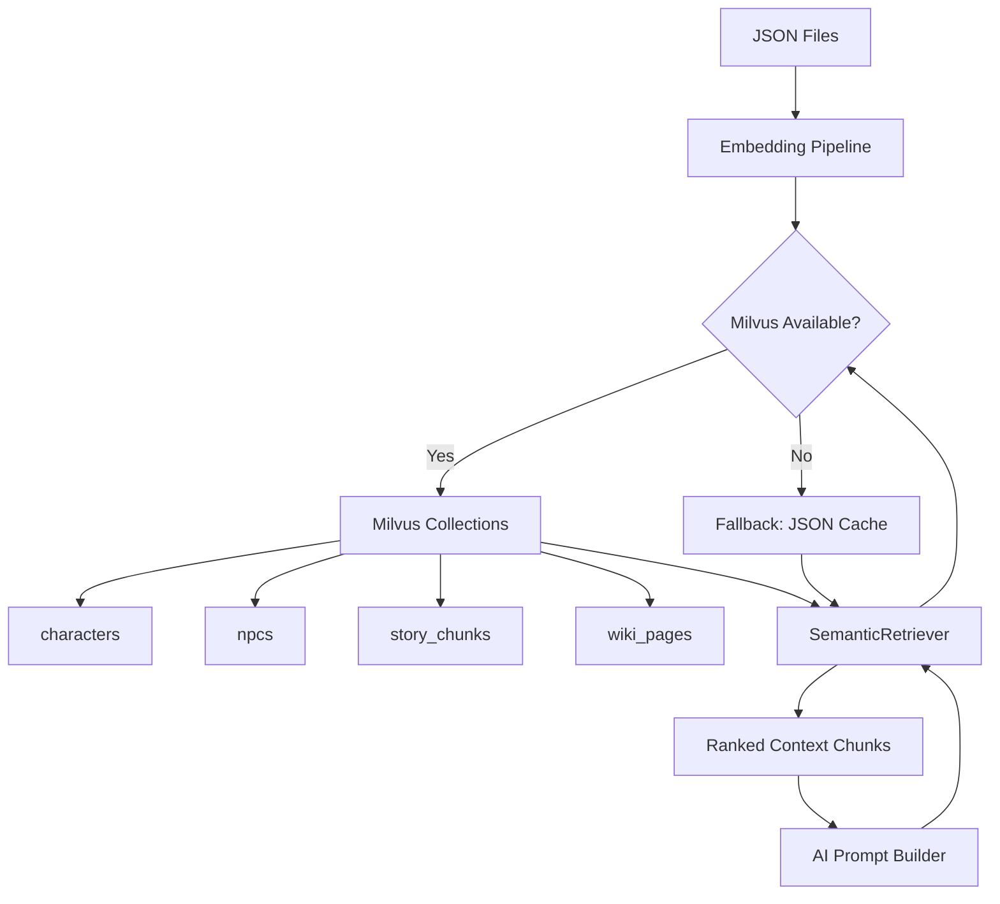

# Milvus Integration Plan

## Overview

This document describes the design for replacing the current file-based and
SQLite-backed retrieval layer with Milvus, an open-source vector database, to
enable semantic search across characters, NPCs, story content, and campaign
lore. This plan supersedes the relational-analytics goals of
[`sqlite_integration_plan.md`](sqlite_integration_plan.md).

## Relationship to Other Plans

| Plan | Relationship |
|------|-------------|
| [`sqlite_integration_plan.md`](sqlite_integration_plan.md) | Superseded for retrieval; relational analytics use cases remain valid but are secondary |
| [`drupal_cms_integration.md`](drupal_cms_integration.md) | Drupal Search API with Solr handles CMS-side search; Milvus handles Python-side semantic retrieval |
| [`configuration_system_plan.md`](configuration_system_plan.md) | Milvus connection config goes through the centralized config system |
| [`ai_story_suggestions_plan.md`](ai_story_suggestions_plan.md) | Story suggestions benefit from semantic similarity lookups via Milvus |

---

## Problem Statement

### Current Issues

1. **Keyword-Only Retrieval**: The RAG system (`src/ai/rag_system.py`) scrapes
   wiki pages and performs keyword matching. There is no understanding of
   semantic similarity between a query and retrieved content.

2. **SQLite Cache Only**: The `WikiCache` class uses a flat file cache backed
   by JSON. There is no vector index, so finding relevant lore for a prompt
   requires loading and scanning all cached documents.

3. **No Embedding Layer**: Character profiles, NPC descriptions, and story
   files are never converted to embeddings. Cross-document similarity
   (e.g., "find stories where Aragorn faces a moral dilemma") is impossible.

4. **Scaling Limits**: As campaigns grow and more story files accumulate,
   the current scan-everything approach degrades linearly.

### Evidence from Codebase

| Current State | Location | Limitation |
|---------------|----------|------------|
| Keyword wiki scraping | `src/ai/rag_system.py` | No semantic similarity |
| JSON file cache in `.rag_cache/` | `src/ai/rag_system.py:WikiCache` | No vector index |
| No embedding generation | Anywhere | Cannot do similarity search |
| Full-file JSON loads on every query | `src/utils/file_io.py` | No indexed retrieval |

---

## Proposed Solution

### High-Level Approach

1. **Embedding Pipeline**: Generate embeddings for characters, NPCs, story
   chunks, and wiki pages when they are created or updated.
2. **Milvus Collections**: Store embeddings in typed collections mirroring
   the existing JSON data model.
3. **Semantic Retrieval**: Replace keyword search in the RAG prompt builder
   with cosine-similarity queries against Milvus.
4. **Optional Layer**: Milvus is opt-in. The system falls back to keyword
   retrieval when Milvus is unavailable, preserving offline usability.
5. **Sync on Write**: Embeddings are regenerated whenever a JSON file is
   saved through `save_json_file()`.

### Architecture



---

## Implementation Details

### 1. Configuration

Add to `src/config/config_types.py`:

```python
@dataclass
class MilvusConfig:
    """Milvus vector database configuration."""

    enabled: bool = False
    host: str = ""
    port: int = 19530
    collection_prefix: str = "dnd"
    embedding_model: str = ""
    embedding_dim: int = 1536
    top_k: int = 5
    similarity_threshold: float = 0.7
```

Environment variables (`.env`):

```
MILVUS_ENABLED=false
MILVUS_HOST=localhost
MILVUS_PORT=19530
MILVUS_EMBEDDING_MODEL=text-embedding-3-small
MILVUS_TOP_K=5
```

### 2. Collection Schemas

Create `src/ai/milvus_collections.py`:

```python
"""Milvus collection definitions for D&D data types."""

COLLECTIONS = {
    "characters": {
        "description": "Character profile embeddings",
        "fields": [
            {"name": "id", "dtype": "INT64", "is_primary": True, "auto_id": True},
            {"name": "character_name", "dtype": "VARCHAR", "max_length": 100},
            {"name": "source_file", "dtype": "VARCHAR", "max_length": 512},
            {"name": "chunk_text", "dtype": "VARCHAR", "max_length": 2048},
            {"name": "chunk_type", "dtype": "VARCHAR", "max_length": 50},
            {"name": "embedding", "dtype": "FLOAT_VECTOR", "dim": 1536},
        ],
        "index": {"metric_type": "COSINE", "index_type": "IVF_FLAT", "nlist": 128},
    },
    "npcs": {
        "description": "NPC profile embeddings",
        "fields": [
            {"name": "id", "dtype": "INT64", "is_primary": True, "auto_id": True},
            {"name": "npc_name", "dtype": "VARCHAR", "max_length": 100},
            {"name": "location", "dtype": "VARCHAR", "max_length": 200},
            {"name": "chunk_text", "dtype": "VARCHAR", "max_length": 2048},
            {"name": "embedding", "dtype": "FLOAT_VECTOR", "dim": 1536},
        ],
        "index": {"metric_type": "COSINE", "index_type": "IVF_FLAT", "nlist": 128},
    },
    "story_chunks": {
        "description": "Story file paragraph-level embeddings",
        "fields": [
            {"name": "id", "dtype": "INT64", "is_primary": True, "auto_id": True},
            {"name": "campaign_name", "dtype": "VARCHAR", "max_length": 200},
            {"name": "story_file", "dtype": "VARCHAR", "max_length": 512},
            {"name": "chunk_index", "dtype": "INT64"},
            {"name": "chunk_text", "dtype": "VARCHAR", "max_length": 4096},
            {"name": "embedding", "dtype": "FLOAT_VECTOR", "dim": 1536},
        ],
        "index": {"metric_type": "COSINE", "index_type": "IVF_FLAT", "nlist": 256},
    },
    "wiki_pages": {
        "description": "Cached wiki page sentence embeddings",
        "fields": [
            {"name": "id", "dtype": "INT64", "is_primary": True, "auto_id": True},
            {"name": "page_url", "dtype": "VARCHAR", "max_length": 1024},
            {"name": "page_title", "dtype": "VARCHAR", "max_length": 512},
            {"name": "chunk_text", "dtype": "VARCHAR", "max_length": 4096},
            {"name": "cached_at", "dtype": "INT64"},
            {"name": "embedding", "dtype": "FLOAT_VECTOR", "dim": 1536},
        ],
        "index": {"metric_type": "COSINE", "index_type": "IVF_FLAT", "nlist": 256},
    },
}
```

### 3. Embedding Pipeline

Create `src/ai/embedding_pipeline.py`:

```python
"""Generates and manages embeddings for D&D data types."""

from typing import List, Optional
from src.config.config_loader import load_config


class EmbeddingPipeline:
    """Generates embeddings using the configured AI provider."""

    def embed_text(self, text: str) -> List[float]:
        """Generate embedding vector for a single text string."""

    def embed_character(self, character_data: dict) -> List[dict]:
        """Split character profile into chunks and embed each."""

    def embed_npc(self, npc_data: dict) -> List[dict]:
        """Embed NPC profile fields."""

    def embed_story_file(self, story_path: str) -> List[dict]:
        """Split story file into paragraphs and embed each."""

    def embed_wiki_page(self, page_text: str, url: str) -> List[dict]:
        """Split wiki page into sentences and embed each."""
```

### 4. Semantic Retriever

Create `src/ai/semantic_retriever.py`:

```python
"""Semantic retrieval layer backed by Milvus with JSON fallback."""

from typing import List, Dict, Any, Optional
from src.config.config_loader import load_config


class SemanticRetriever:
    """
    Retrieves contextually relevant data for AI prompt construction.

    Falls back to keyword-based retrieval when Milvus is unavailable.
    """

    def get_relevant_characters(
        self, query: str, top_k: Optional[int] = None
    ) -> List[Dict[str, Any]]:
        """Return most semantically relevant character profiles."""

    def get_relevant_npcs(
        self, query: str, location: Optional[str] = None, top_k: Optional[int] = None
    ) -> List[Dict[str, Any]]:
        """Return NPCs relevant to the current scene."""

    def get_relevant_story_context(
        self, query: str, campaign_name: str, top_k: Optional[int] = None
    ) -> List[Dict[str, Any]]:
        """Return story chunks relevant to a prompt."""

    def get_relevant_lore(
        self, query: str, top_k: Optional[int] = None
    ) -> List[Dict[str, Any]]:
        """Return relevant wiki/lore content."""
```

### 5. Integration with RAG System

Modify `src/ai/rag_system.py` to use `SemanticRetriever` when Milvus is
available, falling back to existing wiki scraping:

```python
try:
    from src.ai.semantic_retriever import SemanticRetriever
    MILVUS_AVAILABLE = True
except ImportError:
    MILVUS_AVAILABLE = False

class RAGSystem:
    def __init__(self):
        self._retriever = SemanticRetriever() if MILVUS_AVAILABLE else None

    def get_relevant_context(self, prompt: str, campaign_name: str) -> str:
        if self._retriever:
            return self._retriever.get_relevant_story_context(prompt, campaign_name)
        return self._keyword_search(prompt)  # existing fallback
```

---

## Technology Comparison

| Feature | Milvus (This Plan) | SQLite (Analytics) | Drupal/Solr |
|---------|--------------------|-------------------|-------------|
| Search type | Vector/semantic | Relational/exact | Full-text |
| Setup | Docker container | Single file | DDEV + PHP |
| Best for | RAG retrieval | History analytics | CMS search |
| Offline | Yes (local Docker) | Yes | No (DDEV) |
| Scales to | Millions of vectors | Thousands of rows | CMS content |
| Python SDK | `pymilvus` | `sqlite3` (stdlib) | REST/JSON:API |

All three can coexist: Milvus for Python-side semantic retrieval, SQLite for
lightweight analytics, and Drupal/Solr for CMS-side full-text search.

---

## Phased Implementation

### Phase 1: Infrastructure and Schema

1. Add `MilvusConfig` to `src/config/config_types.py`
2. Create `src/ai/milvus_collections.py` with collection schemas
3. Add `pymilvus` to `requirements.txt` as an optional dependency
4. Write `src/ai/embedding_pipeline.py`
5. Write connection/health-check utility in `src/ai/milvus_client.py`

### Phase 2: Embedding Generation

1. Implement `EmbeddingPipeline` for all four data types
2. Add CLI command: `dnd_consultant.py --reindex` to build collections
3. Hook `save_json_file()` to trigger incremental re-embedding
4. Add `game_data/milvus/` to `.gitignore`

### Phase 3: Retrieval Integration

1. Implement `SemanticRetriever` with Milvus backend and JSON fallback
2. Replace `npc_lookup_helper.py` keyword matching with semantic NPC lookup
3. Replace `WikiCache` keyword search with `wiki_pages` collection query
4. Update AI prompt builder to use `SemanticRetriever`

### Phase 4: Testing

1. Unit tests in `tests/ai/test_semantic_retriever.py`
2. Integration test using `game_data/campaigns/Example_Campaign/`
3. Verify fallback behaviour when Milvus is unreachable

---

## Related Plans

| Plan | Notes |
|------|-------|
| [`sqlite_integration_plan.md`](sqlite_integration_plan.md) | Relational analytics remain valid alongside Milvus |
| [`drupal_cms_integration.md`](drupal_cms_integration.md) | Solr handles CMS-side; Milvus handles Python-side |
| [`configuration_system_plan.md`](configuration_system_plan.md) | `MilvusConfig` extends existing config schema |
| [`ai_story_suggestions_plan.md`](ai_story_suggestions_plan.md) | Suggestions engine uses semantic retrieval |
| [`spotlighting_system_plan.md`](spotlighting_system_plan.md) | Spotlight queries use semantic story search |
