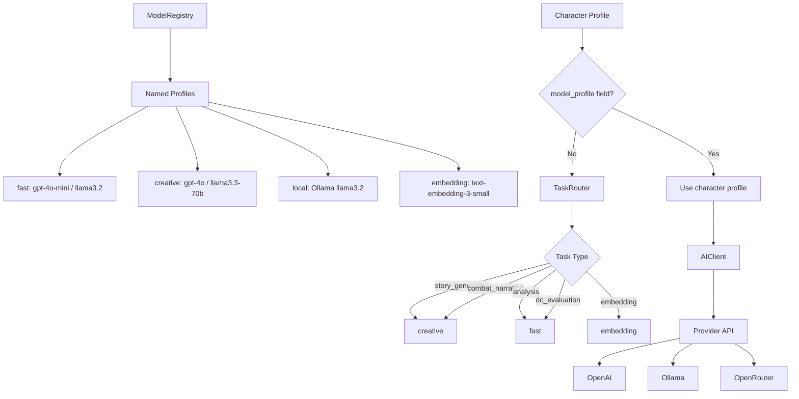

# Model Switching Plan

## Overview

This document describes the design for runtime AI model switching in the
D&D Character Consultant System. While the
[configuration system](configuration_system_plan.md) allows a single global
model to be configured via `.env`, model switching adds the ability to select
different model profiles at runtime, per character, and per task type without
restarting the application.

## Relationship to Other Plans

| Plan | Relationship |
|------|-------------|
| [`configuration_system_plan.md`](configuration_system_plan.md) | Switching extends the existing config system; it does not replace it |
| [`milvus_integration_plan.md`](milvus_integration_plan.md) | Embedding model selection is one use case for model switching |
| [`plugin_architecture_plan.md`](plugin_architecture_plan.md) | Plugins may register custom model profiles |
| [`spotlighting_system_plan.md`](spotlighting_system_plan.md) | Spotlight analysis can use a cheaper fast model |

---

## Problem Statement

### Current Issues

1. **Single Global Model**: `OPENAI_MODEL` in `.env` sets one model for the
   entire application. There is no way to use a fast model for analysis tasks
   and a creative model for story generation simultaneously.

2. **No Provider Switching**: The local Ollama backend (documented in
   `Modelfile` and `src/ai/ai_client.py`) cannot be activated without
   manually editing `.env` and restarting.

3. **No Per-Character Model**: Character personalities vary significantly.
   An ancient dragon character may need a different model than a simple
   shopkeeper NPC. The current `character_overrides` field in `AIConfig`
   exists but is undiscoverable and has no UI.

4. **No Task Routing**: Combat narration, story analysis, and DC evaluation
   all use the same model regardless of required capability or cost.

### Evidence from Codebase

| Current State | Location | Limitation |
|---------------|----------|------------|
| Single `OPENAI_MODEL` env var | `src/ai/ai_client.py` | One model for everything |
| `character_overrides` dict exists | `src/config/config_types.py:AIConfig` | No UI to set overrides |
| Ollama support coded but manual | `src/ai/ai_client.py` docstring | Requires `.env` edit + restart |
| No task-type routing | Anywhere | Cannot route by task |

---

## Proposed Solution

### High-Level Approach

1. **Model Registry**: Define named model profiles in config. Each profile
   specifies a provider, base URL, model name, and defaults for temperature
   and max tokens.
2. **Task Router**: Map task types (story generation, combat narration,
   analysis, embedding) to a preferred model profile.
3. **Per-Character Override**: Allow individual character JSON files to
   specify a model profile by name, replacing the raw `character_overrides`
   dict.
4. **CLI Switching**: Add a `--model` flag and an interactive model menu to
   switch the active profile mid-session.
5. **Session Persistence**: The active profile is remembered for the duration
   of a session but does not modify `.env`.

### Architecture



---

## Implementation Details

### 1. Model Profile Schema

Add to `src/config/config_types.py`:

```python
@dataclass
class ModelProfile:
    """A named AI model configuration profile."""

    name: str
    provider: str  # "openai", "ollama", "openrouter"
    base_url: str = ""
    model: str = ""
    temperature: float = 0.7
    max_tokens: int = 1000
    description: str = ""


@dataclass
class ModelRegistryConfig:
    """Registry of available model profiles."""

    active_profile: str = "default"
    profiles: Dict[str, ModelProfile] = field(default_factory=dict)

    def get_profile(self, name: str) -> Optional[ModelProfile]:
        """Return a profile by name, or the active profile if name is empty."""
```

### 2. Built-in Default Profiles

Configured in `config.json` (or `.env` for simple overrides):

```json
{
  "model_registry": {
    "active_profile": "default",
    "profiles": {
      "default": {
        "provider": "openai",
        "base_url": "",
        "model": "",
        "temperature": 0.7,
        "max_tokens": 1000,
        "description": "Default model from OPENAI_MODEL env var"
      },
      "fast": {
        "provider": "openai",
        "base_url": "",
        "model": "",
        "temperature": 0.3,
        "max_tokens": 500,
        "description": "Cheap fast model for analysis tasks"
      },
      "creative": {
        "provider": "openai",
        "base_url": "",
        "model": "",
        "temperature": 0.9,
        "max_tokens": 2000,
        "description": "High-creativity model for story generation"
      },
      "local": {
        "provider": "ollama",
        "base_url": "http://localhost:11434/v1",
        "model": "",
        "temperature": 0.7,
        "max_tokens": 1000,
        "description": "Local Ollama model (see Modelfile)"
      }
    }
  }
}
```

All `model` fields are empty strings by default, consistent with rule 4 in
AGENTS.md - users set actual model names in their config.

### 3. Task Router

Create `src/ai/task_router.py`:

```python
"""Routes AI tasks to the appropriate model profile."""

from typing import Dict, Optional
from src.config.config_loader import load_config


TASK_PROFILE_MAP: Dict[str, str] = {
    "story_generation": "creative",
    "story_analysis": "fast",
    "combat_narration": "creative",
    "dc_evaluation": "fast",
    "character_consultation": "default",
    "npc_dialogue": "default",
    "spotlight_analysis": "fast",
    "embedding": "embedding",
}


class TaskRouter:
    """Returns the correct ModelProfile for a given task type."""

    def get_profile_for_task(self, task_type: str) -> str:
        """Return the profile name to use for a task type."""

    def get_client_config(
        self, task_type: str, character_profile_override: Optional[str] = None
    ) -> dict:
        """Return AIClient kwargs for a task, respecting character overrides."""
```

### 4. Per-Character Model Profile

Character JSON files gain an optional `model_profile` field:

```json
{
  "name": "Smaug",
  "class": "Dragon",
  "model_profile": "creative"
}
```

The `CharacterProfile` loader in `src/utils/character_profile_utils.py` reads
this field. The task router checks it before falling back to task-based routing.

### 5. CLI Switching

Add `--model <profile_name>` to `dnd_consultant.py`:

```python
parser.add_argument(
    "--model",
    metavar="PROFILE",
    help="Activate a named model profile for this session (e.g. local, creative)",
)
```

Add an interactive model menu to the main CLI under a new "Settings" option:

```
[M] Switch Model Profile
    1. default  - gpt-4o (current)
    2. fast     - gpt-4o-mini
    3. creative - gpt-4o + high temperature
    4. local    - Ollama llama3.2
```

Uses `display_selection_menu()` from `src/utils/cli_utils.py`.

### 6. Session-Only Persistence

The active profile switch is stored in memory for the process lifetime:

```python
class ModelRegistry:
    _active_profile: str = "default"

    def switch_profile(self, profile_name: str) -> None:
        """Switch active profile for the current session only."""

    def get_active_profile(self) -> ModelProfile:
        """Return the currently active ModelProfile."""
```

It is never written back to `.env` or `config.json` to avoid surprising
persistent changes. Users who want a permanent change edit config directly.

---

## Relationship to Existing Ollama Support

The `Modelfile` at the project root and the Ollama usage in `ai_client.py`
are the starting point for the `local` profile. The model switching plan
formalises this into a named profile with discoverable CLI support, rather
than requiring manual `.env` edits.

---

## Phased Implementation

### Phase 1: Registry and Schema

1. Add `ModelProfile` and `ModelRegistryConfig` to `src/config/config_types.py`
2. Add default profiles to default `config.json`
3. Unit tests in `tests/config/test_model_registry.py`

### Phase 2: Task Router

1. Create `src/ai/task_router.py`
2. Update `src/ai/ai_client.py` callers to pass task type
3. Update `src/stories/story_manager.py` to use task router
4. Unit tests in `tests/ai/test_task_router.py`

### Phase 3: Per-Character Override

1. Add `model_profile` field to character JSON schema
2. Update `src/utils/character_profile_utils.py` to read field
3. Update `src/validation/` character validator to accept optional field
4. Update character arc analysis to respect profile routing

### Phase 4: CLI Integration

1. Add `--model` flag to `dnd_consultant.py`
2. Add interactive model menu using `display_selection_menu()`
3. Show active profile in CLI status bar or header

---

## Related Plans

| Plan | Notes |
|------|-------|
| [`configuration_system_plan.md`](configuration_system_plan.md) | Model registry config extends `DnDConfig` |
| [`milvus_integration_plan.md`](milvus_integration_plan.md) | Embedding model is a separate profile |
| [`plugin_architecture_plan.md`](plugin_architecture_plan.md) | Plugins may register additional profiles |
| [`spotlighting_system_plan.md`](spotlighting_system_plan.md) | Spotlight uses the `fast` profile |
| [`documentation_update_plan.md`](documentation_update_plan.md) | AI_INTEGRATION.md must be updated once implemented |
