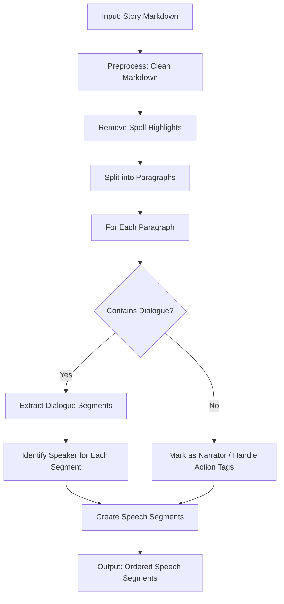
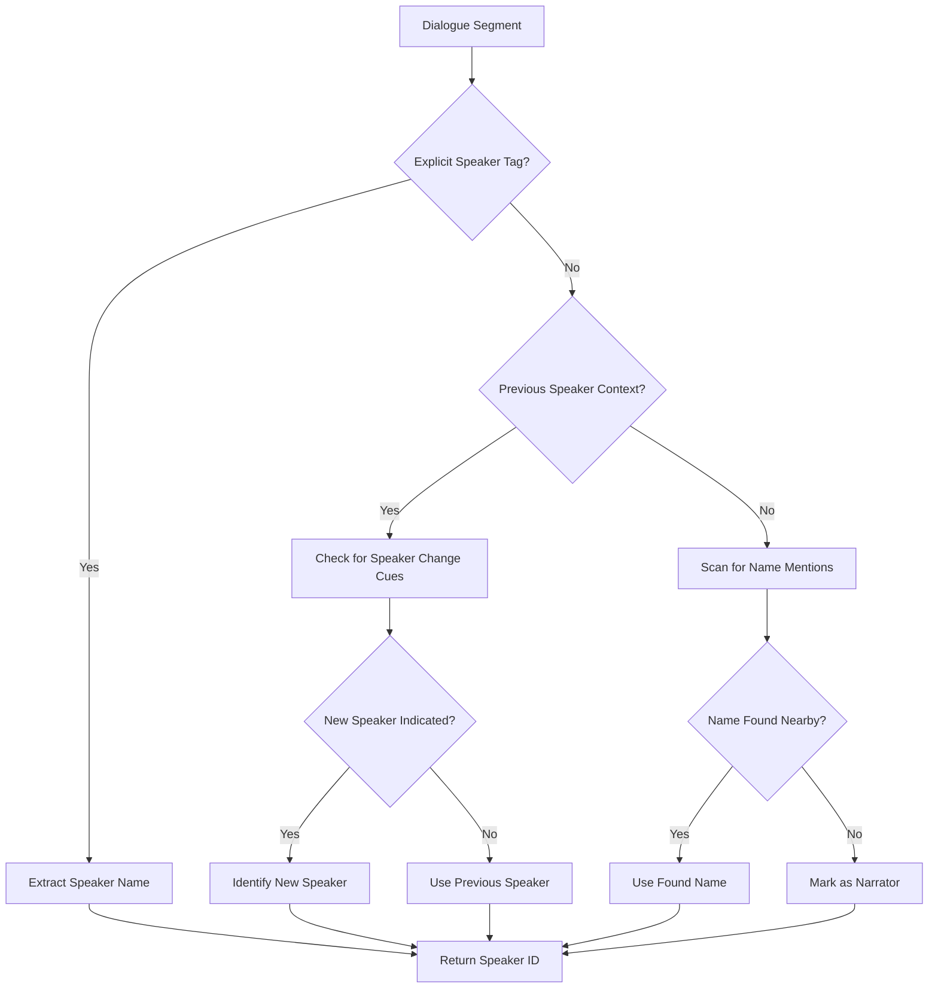
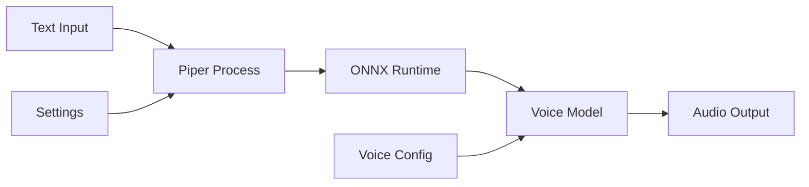
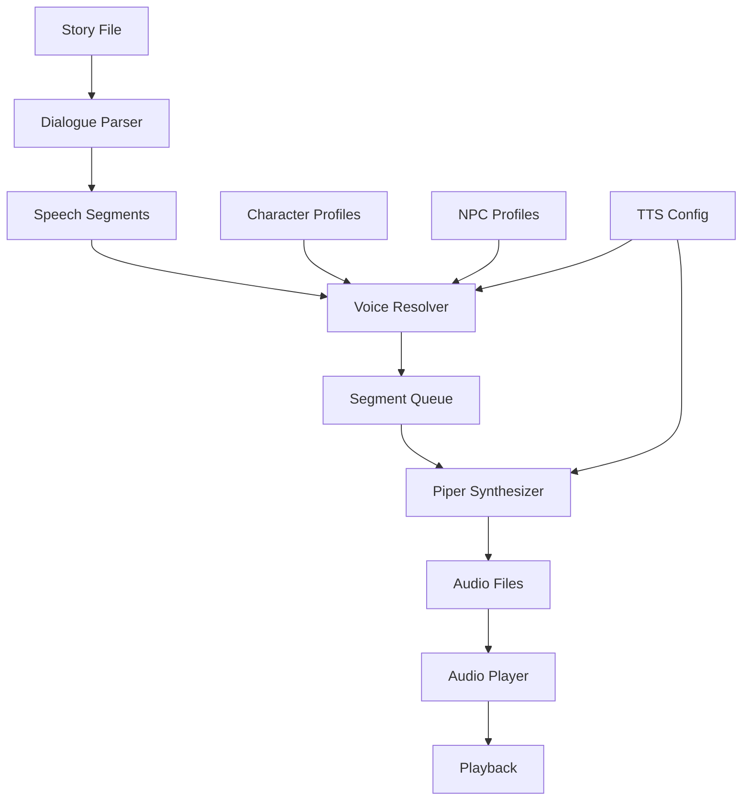

# Multi-Voice TTS Narration System Design

## Overview

This document describes the design for a multi-voice Text-to-Speech narration
system for D&D story files. The system enables different characters and NPCs to
speak with distinct voices during narration, creating an immersive audio
experience.

## Current State Analysis

### Existing TTS Implementation

The current TTS system in [`src/utils/tts_narrator.py`](src/utils/tts_narrator.py)
uses pyttsx3 with platform-specific backends:

- Windows: SAPI5
- macOS: NSSpeechSynthesizer
- Linux: eSpeak

Key limitations:

- Single voice for all narration
- No character voice differentiation
- Windows SAPI5 state issues requiring subprocess isolation
- Limited voice quality

### Dialogue Patterns in Story Files

Analysis of story files reveals multiple dialogue patterns:

**Pattern A - Inline Dialogue with Speaker After:**

```markdown
"Evenin'," the barkeep said without looking up. "What'll it be?"
"Ale," Gorak replied, his voice deep and steady.
```

**Pattern B - Explicit Speaker Prefix:**

```markdown
Nymur: "I couldn't help but hear you're asking about Ruthen Arlath."
Gorak: "Curiosity's been known to save a life or two."
```

**Pattern C - Dialogue with Action Tags:**

```markdown
Kaelen: (with a raised eyebrow) "Friendship comes cheap these days."
Valana: (grinning) "Wouldn't dream of it."
```

**Pattern D - Multi-line Dialogue:**

```markdown
"I've heard rumors about missing shipments, especially silk. I want to know
who's behind it, and put a stop to it if I can. The barkeep said you might
have answers, but I'm guessing you're looking for someone to watch your
back as much as I am."
```

---

## 1. JSON Schema Changes

### 1.1 Character JSON Additions

Add a `voice` section to character JSON files:

```json
{
  "name": "Aragorn",
  "voice": {
    "piper_voice_id": "en_US-ryan-low",
    "voice_settings": {
      "speed": 1.0,
      "pitch_shift": 0
    }
  },
  "...other fields..."
}
```

### 1.2 NPC JSON Additions

Same voice structure for NPCs:

```json
{
  "name": "Barliman Butterbur",
  "voice": {
    "piper_voice_id": "en_US-lessac-medium",
    "voice_settings": {
      "speed": 0.9,
      "pitch_shift": -2
    }
  },
  "...other fields..."
}
```

### 1.3 Voice Configuration Schema

```json
{
  "voice": {
    "piper_voice_id": "string - Required. Piper voice identifier",
    "voice_settings": {
      "speed": "float - Optional. Range 0.5-2.0, default 1.0",
      "pitch_shift": "int - Optional. Range -12 to +12 semitones, default 0",
      "volume": "float - Optional. Range 0.0-1.0, default 1.0"
    }
  }
}
```

### 1.4 TTS Configuration

**Recommendation**: Extend the existing `DisplayConfig` in [`src/config/config_types.py`](src/config/config_types.py) rather than creating a new configuration file. This keeps configuration unified.

Add these fields to `DisplayConfig`:

```python
@dataclass
class DisplayConfig:
    # Existing fields (enable_tts, tts_voice, tts_speed)...
    
    # New fields
    tts_engine: str = "piper"  # "piper" or "pyttsx3"
    piper_path: str = "piper"  # Path to piper executable
    piper_voices_dir: Optional[str] = None  # Directory containing .onnx files
    narrator_voice_id: str = "en_US-lessac-medium"
    pause_between_segments: float = 0.5
    pause_on_speaker_change: float = 0.75
```

**Fallback option** (if separate config preferred): Create `game_data/tts_config.json`:

```json
{
  "narrator_voice": {
    "piper_voice_id": "en_US-lessac-medium",
    "voice_settings": {
      "speed": 1.0,
      "pitch_shift": 0,
      "volume": 1.0
    }
  },
  "piper": {
    "executable_path": "piper",
    "voices_directory": "~/piper-voices",
    "output_format": "wav"
  },
  "fallback_voice": {
    "enabled": true,
    "piper_voice_id": "en_US-lessac-medium"
  }
}
```

### 1.5 Voice Files Configuration

#### 1.5.1 Voice Storage Location

All Piper voice files are stored in `game_data/piper/voices/`. This directory is NOT gitignored to provide default voices.

```
game_data/piper/voices/
├── en_US-lessac-high.onnx      # Default male narrator voice
├── en_US-lessac-high.onnx.json
├── en_US-amy-medium.onnx        # Default female voice
├── en_US-amy-medium.onnx.json
└── [user-added voices]
```

#### 1.5.2 Default Voices (Tracked in Git)

Three default voices are included in the repository:

| Voice ID | Gender | Characteristics | Use Case |
|----------|--------|-----------------|----------|
| `en_US-joe-medium` | Male | Clear, standard American | Narrator |
| `en_US-ryan-low` | Male | Deep, gruff | Rugged/mature characters |
| `en_US-amy-medium` | Female | Warm, expressive | Female NPCs, dialogue |

#### 1.5.3 Voice Selection for Users

Users can select from ANY voice present in the `game_data/piper/voices/` folder:

1. **Default voices** - Already included (lessac-high, amy-medium)
2. **Add new voices** - Download from <https://huggingface.co/rhasspy/piper-voices>
3. **Voice ID format** - `<language>-<voice_name>-<quality>.onnx`

Example voice IDs:

- `en_US-lessac-high` - Male narrator voice (currently included)
- `en_US-lessac-medium` - Slower male voice
- `en_US-amy-medium` - Female voice (currently included)
- `en_GB-jenny_dioco-medium` - British female voice
- `en_US-ryan-low` - Low male voice (deep)

#### 1.5.4 Recommended Male Voices for Narrator

Voices currently included (available in `game_data/piper/voices/`):

| Voice ID | Description | Use |
|----------|-------------|-----|
| `en_US-joe-medium` | Clear, standard American male | Narrator |
| `en_US-ryan-low` | Deep, gruff, rugged | Mature/rough characters |

**Additional voices can be added by users:**

- Download from: <https://huggingface.co/rhasspy/piper-voices>
- Use path format: `en/en_US/<voice_name>/<quality>/`
- Place `.onnx` and `.onnx.json` files in `game_data/piper/voices/`

#### 1.5.5 Adding New Voices

Users can download additional voices from the Piper voices repository:

1. Visit: <https://huggingface.co/rhasspy/piper-voices>
2. Browse to desired voice (e.g., `en_US-lessac/medium/`)
3. Download both `.onnx` and `.onnx.json` files
4. Place in `game_data/piper/voices/`
5. Reference by voice ID (filename without .onnx extension)

**Note:** Direct downloads via curl may be blocked by HuggingFace. Use browser download or the URLs from `game_data/piper/DOWNLOAD_INSTRUCTIONS.md`.

---

## 2. Dialogue Detection Algorithm

### 2.1 Text Segmentation Strategy

The algorithm segments story text into speakable units with speaker attribution:



### 2.2 Preprocessing Requirements

The preprocessing step must:

1. **Remove markdown formatting** - Strip bold, italic, headers
2. **Filter spell highlights** - Replace `**Fireball**` patterns with spoken form "Fireball spell"
3. **Handle action-only lines** - Lines with character mentions but no dialogue (e.g., "Barliman pressed on, fidgeting nervously") should mark character context for subsequent dialogue
4. **Clean quotes** - Normalize curly quotes to straight quotes for regex processing

### 2.2 Dialogue Detection Regex Patterns

```python
DIALOGUE_PATTERNS = {
    # Pattern A: "Dialogue," speaker said
    "inline_after": re.compile(
        r'"([^"]+)"\s*,?\s*(?:the\s+)?(\w+)\s+(?:said|replied|asked|'
        r'muttered|whispered|called|answered|responded)'
    ),

    # Pattern B: Speaker: "Dialogue"
    "prefix_explicit": re.compile(
        r'([A-Z][a-zA-Z]+)\s*:\s*(?:\([^)]+\))?\s*"([^"]+)"'
    ),

    # Pattern C: "Dialogue" (no explicit speaker - use context)
    "standalone": re.compile(
        r'"([^"]+)"'
    ),

    # Pattern D: Multi-paragraph dialogue continuation
    "continuation": re.compile(
        r'^([A-Z][a-zA-Z]+)\s*:\s*"([^"]+)"',
        re.MULTILINE
    )
}
```

### 2.3 Speaker Identification Algorithm



### 2.4 Speaker Resolution Rules

1. **Explicit Prefix**: `CharacterName: "Dialogue"` - Direct attribution
2. **Post-Dialogue Tag**: `"Dialogue," CharacterName said` - Extract speaker
3. **Context Window**: Look 100 characters before/after for name mentions
4. **Pronoun Resolution**: Track last speaker for pronoun references
5. **Action Tags**: `CharacterName (action): "Dialogue"` - Parse around action
6. **Default to Narrator**: If no speaker identified, use narrator voice

### 2.5 Edge Cases

| Scenario | Detection Strategy | Resolution |
|----------|-------------------|------------|
| Nested quotes | Count quote depth | Inner quotes are not dialogue |
| Thoughts vs speech | Look for italics context | Italicized quotes may be thoughts |
| Multiple speakers in paragraph | Split on speaker change | Create separate segments |
| Unknown character name | Fuzzy match to known characters | Use narrator if no match |
| Interrupted dialogue | Detect em-dashes, ellipses | Single segment with pause |

### 2.6 Character Name Matching

```python
def resolve_speaker_name(
    text_name: str,
    known_characters: List[str],
    known_npcs: List[str]
) -> Optional[str]:
    """Resolve a text reference to a known character/NPC name.

    Handles:
    - Exact match: "Gorak" -> "Gorak"
    - Nickname match: "Strider" -> "Aragorn"
    - Partial match: "the barkeep" -> "Barliman Butterbur"
    - Title match: "the dwarf" -> match by species/role
    """
```

---

## 3. Piper TTS Integration

### 3.1 Piper Architecture Overview



### 3.2 Piper Interface Design

```python
class PiperTTSClient:
    """Client for Piper TTS synthesis."""

    def __init__(
        self,
        executable_path: str = "piper",
        voices_directory: str = None,
        default_speaker: int = 0
    ):
        """Initialize Piper TTS client.

        Args:
            executable_path: Path to piper executable
            voices_directory: Directory containing .onnx voice files
            default_speaker: Default speaker ID for multi-speaker models
        """

    def synthesize(
        self,
        text: str,
        voice_id: str,
        output_path: Optional[Path] = None,
        speed: float = 1.0,
        pitch_shift: int = 0
    ) -> bytes:
        """Synthesize text to audio.

        Args:
            text: Text to synthesize
            voice_id: Piper voice identifier (e.g., "en_US-lessac-medium")
            output_path: Optional path to save audio file
            speed: Speech speed multiplier
            pitch_shift: Pitch shift in semitones

        Returns:
            Audio data as bytes (WAV format)
        """

    def list_available_voices(self) -> List[VoiceInfo]:
        """List all available Piper voices."""

    def is_voice_available(self, voice_id: str) -> bool:
        """Check if a specific voice is available."""
```

### 3.3 Piper Command-Line Interface

Piper is invoked via command line:

```bash
echo "Text to speak" | piper \
    --model en_US-lessac-medium.onnx \
    --output_file output.wav \
    --speaker 0 \
    --noise_scale 0.667 \
    --length_scale 1.0
```

### 3.4 Python Subprocess Integration

```python
def _run_piper_synthesis(
    self,
    text: str,
    voice_id: str,
    output_path: Path,
    speed: float = 1.0
) -> bool:
    """Run Piper synthesis via subprocess.

    Args:
        text: Text to synthesize
        voice_id: Voice model identifier
        output_path: Path for output WAV file
        speed: Length scale (inverse of speed)

    Returns:
        True if synthesis succeeded
    """
    model_path = self.voices_directory / f"{voice_id}.onnx"

    cmd = [
        self.executable_path,
        "--model", str(model_path),
        "--output_file", str(output_path),
        "--length_scale", str(1.0 / speed),  # Inverse for speed
        "--speaker", str(self.default_speaker)
    ]

    result = subprocess.run(
        cmd,
        input=text,
        capture_output=True,
        text=True,
        timeout=60
    )

    return result.returncode == 0
```

### 3.5 Audio Playback Integration

```python
class AudioPlayer:
    """Cross-platform audio playback."""

    def __init__(self):
        """Initialize audio player."""
        self._audio_queue = queue.Queue()
        self._stop_flag = threading.Event()

    def play_audio_file(self, filepath: Path, block: bool = True) -> bool:
        """Play an audio file.

        Args:
            filepath: Path to audio file
            block: If True, wait for playback to complete

        Returns:
            True if playback succeeded
        """

    def queue_audio(self, filepath: Path) -> None:
        """Add audio file to playback queue."""

    def play_queue(self) -> None:
        """Play all queued audio files in order."""

    def stop(self) -> None:
        """Stop current playback and clear queue."""
```

### 3.6 Platform-Specific Playback

| Platform | Library | Notes |
|----------|---------|-------|
| Windows | `winsound` or `pygame` | Built-in winsound for WAV |
| macOS | `afplay` command | System command |
| Linux | `aplay` or `paplay` | ALSA or PulseAudio |

---

## 4. Voice Switching Architecture

### 4.1 Speech Segment Data Structure

```python
@dataclass
class SpeechSegment:
    """A segment of speech with speaker attribution."""

    text: str
    speaker: str  # Character/NPC name or "narrator"
    voice_id: str  # Piper voice identifier
    voice_settings: VoiceSettings
    source_location: Tuple[int, int]  # Line, column in source file

    @property
    def is_dialogue(self) -> bool:
        """True if this is character dialogue, not narration."""
        return self.speaker != "narrator"


@dataclass
class VoiceSettings:
    """Voice synthesis settings."""

    speed: float = 1.0
    pitch_shift: int = 0
    volume: float = 1.0
    pause_before: float = 0.0
    pause_after: float = 0.0
```

### 4.2 Narration Pipeline



### 4.3 Multi-Voice Narrator Class

```python
class MultiVoiceNarrator:
    """Narrates stories with multiple character voices."""

    def __init__(
        self,
        tts_config_path: Optional[Path] = None,
        characters_dir: Optional[Path] = None,
        npcs_dir: Optional[Path] = None
    ):
        """Initialize multi-voice narrator.

        Args:
            tts_config_path: Path to TTS configuration file
            characters_dir: Directory containing character JSON files
            npcs_dir: Directory containing NPC JSON files
        """
        self.config = self._load_config(tts_config_path)
        self.piper = PiperTTSClient(
            executable_path=self.config["piper"]["executable_path"],
            voices_directory=self.config["piper"]["voices_directory"]
        )
        self.audio_player = AudioPlayer()
        self.voice_registry = VoiceRegistry(characters_dir, npcs_dir)
        self.dialogue_parser = DialogueParser()

    def narrate_file(
        self,
        filepath: Path,
        pause_between_segments: float = 0.5
    ) -> bool:
        """Narrate a story file with multiple voices.

        Args:
            filepath: Path to story markdown file
            pause_between_segments: Pause duration between segments

        Returns:
            True if narration completed successfully
        """
        # Parse story into segments
        content = filepath.read_text(encoding="utf-8")
        segments = self.dialogue_parser.parse(content)

        # Resolve voices for each segment
        resolved_segments = self._resolve_voices(segments)

        # Synthesize and play
        return self._narrate_segments(resolved_segments, pause_between_segments)

    def narrate_text(self, text: str) -> bool:
        """Narrate text with multiple voices."""
        segments = self.dialogue_parser.parse(text)
        resolved_segments = self._resolve_voices(segments)
        return self._narrate_segments(resolved_segments, 0.5)

    def stop(self) -> None:
        """Stop current narration."""
        self.audio_player.stop()
```

### 4.4 Voice Registry

```python
class VoiceRegistry:
    """Registry mapping characters/NPCs to their voice configurations."""

    def __init__(
        self,
        characters_dir: Optional[Path] = None,
        npcs_dir: Optional[Path] = None
    ):
        """Initialize voice registry."""
        self._voice_map: Dict[str, VoiceConfig] = {}
        self._nickname_map: Dict[str, str] = {}  # nickname -> canonical name
        self._load_profiles(characters_dir, npcs_dir)

    def get_voice(self, name: str) -> VoiceConfig:
        """Get voice configuration for a character/NPC.

        Args:
            name: Character name (handles nicknames)

        Returns:
            Voice configuration, or default narrator voice if not found
        """

    def register_voice(
        self,
        name: str,
        voice_config: VoiceConfig,
        nicknames: Optional[List[str]] = None
    ) -> None:
        """Register a voice configuration."""

    def list_registered_voices(self) -> List[str]:
        """List all registered character/NPC names."""
```

### 4.5 Smooth Transitions

To handle smooth voice transitions:

1. **Pre-synthesis**: All segments are synthesized before playback begins
2. **Queue-based playback**: Audio segments are queued for gapless playback
3. **Crossfade**: Optional short crossfade between segments (50-100ms)
4. **Pause insertion**: Configurable pauses between narrator/character switches

```python
def _narrate_segments(
    self,
    segments: List[ResolvedSegment],
    pause_between: float
) -> bool:
    """Synthesize and play segments in order."""
    temp_dir = tempfile.mkdtemp()

    try:
        audio_files = []

        # Synthesize all segments
        for i, segment in enumerate(segments):
            output_path = Path(temp_dir) / f"segment_{i:04d}.wav"
            self.piper.synthesize(
                text=segment.text,
                voice_id=segment.voice_id,
                output_path=output_path,
                **segment.voice_settings.to_dict()
            )
            audio_files.append(output_path)

            # Add pause between different speakers
            if i > 0 and segments[i].speaker != segments[i-1].speaker:
                self.audio_player.add_pause(pause_between)

        # Play all audio
        for audio_file in audio_files:
            self.audio_player.queue_audio(audio_file)

        self.audio_player.play_queue()
        return True

    finally:
        # Cleanup temp files
        shutil.rmtree(temp_dir)
```

---

## 5. Implementation Phases

### Phase 1: Voice Selection in JSON

**Goal**: Add voice configuration to character and NPC JSON files.

**Tasks**:

1. Create `VoiceConfig` dataclass in `src/utils/tts_types.py`
2. Update character validator to accept optional `voice` field
3. Update NPC validator to accept optional `voice` field
4. Create `game_data/tts_config.json` with narrator defaults
5. Create `VoiceRegistry` class to load and cache voice configurations
6. Add voice field to example JSON files

**Files to Create/Modify**:

- Create: `src/utils/tts_types.py`
- Create: `game_data/tts_config.json`
- Modify: `src/validation/character_validator.py`
- Modify: `src/validation/npc_validator.py`
- Modify: `game_data/characters/*.json` (add voice fields)
- Modify: `game_data/npcs/*.json` (add voice fields)

### Phase 2: Dialogue Detection

**Goal**: Parse story markdown to detect and attribute dialogue.

**Tasks**:

1. Create `DialogueParser` class in `src/utils/dialogue_parser.py`
2. Implement regex patterns for dialogue detection
3. Implement speaker identification algorithm
4. Create `SpeechSegment` dataclass
5. Add unit tests with story file samples
6. Handle edge cases (nested quotes, multi-line dialogue)

**Files to Create/Modify**:

- Create: `src/utils/dialogue_parser.py`
- Modify: `src/utils/story_parsing_utils.py` (integrate dialogue parsing)
- Create: `tests/utils/test_dialogue_parser.py`

### Phase 3: Voice Switching

**Goal**: Segment text by speaker and queue TTS with different voices.

**Tasks**:

1. Create `MultiVoiceNarrator` class
2. Implement segment resolution with voice lookup
3. Create `AudioPlayer` class for cross-platform playback
4. Implement queue-based audio playback
5. Add pause insertion between speaker changes
6. Integrate with existing `narrate_file` interface

**Files to Create/Modify**:

- Create: `src/utils/multi_voice_narrator.py`
- Create: `src/utils/audio_player.py`
- Modify: `src/utils/tts_narrator.py` (add multi-voice support)
- Create: `tests/utils/test_multi_voice_narrator.py`

### Phase 4: Piper Integration

**Goal**: Replace pyttsx3 with Piper TTS for better voice quality.

**Tasks**:

1. Create `PiperTTSClient` class
2. Implement subprocess-based Piper invocation
3. Add configuration for Piper executable and voices directory
4. Implement audio file synthesis
5. Add voice availability checking
6. Create fallback mechanism for missing voices
7. Update documentation with Piper setup instructions

**Files to Create/Modify**:

- Create: `src/utils/piper_client.py`
- Modify: `src/utils/multi_voice_narrator.py` (use Piper)
- Modify: `game_data/tts_config.json` (Piper settings)
- Modify: `README.md` (Piper setup instructions)

---

## 6. File Structure Summary

```
src/utils/
|-- tts_narrator.py          # Existing - will be updated
|-- tts_types.py             # NEW - VoiceConfig, SpeechSegment dataclasses
|-- dialogue_parser.py       # NEW - Dialogue detection and parsing
|-- multi_voice_narrator.py  # NEW - Multi-voice narration orchestration
|-- piper_client.py          # NEW - Piper TTS integration
|-- audio_player.py          # NEW - Cross-platform audio playback
|-- voice_registry.py        # NEW - Character/NPC voice lookup

game_data/
|-- tts_config.json          # NEW - TTS configuration
|-- characters/
|   |-- *.json               # Modified - add voice fields
|-- npcs/
    |-- *.json               # Modified - add voice fields

tests/utils/
|-- test_dialogue_parser.py  # NEW
|-- test_multi_voice_narrator.py  # NEW
|-- test_piper_client.py     # NEW
|-- test_voice_registry.py   # NEW
```

---

## 7. Configuration Reference

### 7.1 TTS Configuration File

Location: `game_data/tts_config.json`

```json
{
  "narrator_voice": {
    "piper_voice_id": "en_US-lessac-medium",
    "voice_settings": {
      "speed": 1.0,
      "pitch_shift": 0,
      "volume": 1.0
    }
  },
  "piper": {
    "executable_path": "piper",
    "voices_directory": null,
    "output_format": "wav",
    "timeout_seconds": 60
  },
  "fallback_voice": {
    "enabled": true,
    "piper_voice_id": "en_US-lessac-medium"
  },
  "playback": {
    "pause_between_segments": 0.5,
    "pause_on_speaker_change": 0.75,
    "crossfade_ms": 50
  }
}
```

### 7.2 Character Voice Configuration

```json
{
  "name": "Gorak",
  "voice": {
    "piper_voice_id": "en_US-ryan-low",
    "voice_settings": {
      "speed": 0.9,
      "pitch_shift": -3,
      "volume": 1.0
    }
  }
}
```

### 7.3 Environment Variables

| Variable | Description | Default |
|----------|-------------|---------|
| `PIPER_PATH` | Path to Piper executable | `piper` |
| `PIPER_VOICES_DIR` | Directory for voice models | `~/piper-voices` |
| `TTS_CONFIG_PATH` | Custom TTS config path | `game_data/tts_config.json` |

---

## 8. Error Handling

### 8.1 Missing Voice Model

```python
try:
    audio = piper.synthesize(text, voice_id)
except VoiceNotFoundError:
    # Fall back to default voice
    audio = piper.synthesize(text, fallback_voice_id)
    log.warning(f"Voice {voice_id} not found, using fallback")
```

### 8.2 Piper Not Available

```python
if not piper.is_available():
    # Fall back to pyttsx3
    narrator = StoryNarrator()  # Legacy single-voice
    narrator.speak(text)
```

### 8.3 Unknown Speaker

```python
speaker = resolve_speaker_name(text_ref, known_characters, known_npcs)
if speaker is None:
    speaker = "narrator"  # Default to narrator voice
```

---

## 9. Testing Strategy

### 9.1 Unit Tests

- `test_dialogue_parser.py`: Test each dialogue pattern regex
- `test_voice_registry.py`: Test voice lookup and nickname resolution
- `test_piper_client.py`: Mock subprocess calls, test synthesis
- `test_multi_voice_narrator.py`: Integration tests with mock audio

### 9.2 Integration Tests

Use existing story files from `game_data/campaigns/`:

- `Example_Campaign/002_continue.md` - Multiple dialogue patterns
- `Future_Campaign/001PortDamali.md` - Complex multi-character scenes

### 9.3 Test Data

Use existing characters:

- `aragorn.json` - Test character voice
- `butterbur.json` - Test NPC voice
- Create test voice configurations for validation

---

## 10. Dependencies

### 10.1 New Dependencies

Add to `requirements.txt`:

```
# Audio playback (cross-platform)
pygame>=2.5.0

# Optional: For advanced audio processing
# pydub>=0.25.0  # For crossfade effects
```

### 10.2 External Dependencies

- **Piper TTS**: Must be installed separately
  - Download from: <https://github.com/rhasspy/piper>
  - Voice models: <https://huggingface.co/rhasspy/piper-voices>

### 10.3 Platform-Specific

| Platform | Dependency | Purpose |
|----------|------------|---------|
| Windows | Built-in | `winsound` for WAV playback |
| macOS | Built-in | `afplay` command |
| Linux | `alsa-utils` | `aplay` command |

---

## 11. Migration Path

### 11.1 Backward Compatibility

The existing `StoryNarrator` class remains functional:

```python
# Legacy usage (still works)
narrator = StoryNarrator()
narrator.speak("Hello world")

# New multi-voice usage
narrator = MultiVoiceNarrator()
narrator.narrate_file("story.md")
```

### 11.2 Gradual Migration

1. Phase 1-2: Add voice fields to JSON (no breaking changes)
2. Phase 3: New `MultiVoiceNarrator` alongside existing `StoryNarrator`
3. Phase 4: Piper becomes default, pyttsx3 remains as fallback

---

## 12. Future Enhancements

1. **Voice Preview**: CLI command to preview voice samples
2. **Auto Voice Assignment**: Suggest voices based on character traits
3. **Emotion Detection**: Adjust voice parameters based on dialogue emotion
4. **Speed Control**: Runtime speed adjustment during playback
5. **Export Audio**: Export narration as audio file for offline listening
6. **Streaming Synthesis**: Synthesize while playing for faster start

---

## 13. Feasibility Assessment

### 13.1 Reusable Existing Components

| Component | Location | Reusable | Notes |
|-----------|----------|----------|-------|
| TTS base classes | `src/utils/tts_narrator.py` | Yes | Can serve as fallback |
| Text cleaning | `clean_text_for_narration()` | Yes | Removes markdown formatting |
| Character loading | `src/utils/character_profile_utils.py` | Yes | Extend for voice registry |
| NPC loading | `src/utils/npc_lookup_helper.py` | Yes | Extend for voice registry |
| Config system | `src/config/config_types.py` | Yes | Extend DisplayConfig |
| Validation | `src/validation/` | Yes | Add voice field validation |

### 13.2 Configuration Recommendation

**Recommended**: Extend existing `DisplayConfig` rather than creating new `tts_config.json`:

```python
@dataclass
class DisplayConfig:
    # Existing fields...
    tts_engine: str = "piper"  # "piper" or "pyttsx3"
    piper_path: str = "piper"
    piper_voices_dir: Optional[str] = None
    narrator_voice_id: str = "en_US-lessac-medium"
    pause_between_segments: float = 0.5
    pause_on_speaker_change: float = 0.75
```

### 13.3 Edge Cases Identified

| Scenario | Recommendation |
|----------|---------------|
| Action-only lines | Handle character mentions without dialogue (e.g., "Barliman pressed on") |
| Spell highlights | Filter `**Fireball**` patterns before TTS input |
| Pronoun resolution | Track last speaker for "he said" / "she replied" |
| Unknown characters | Default to narrator voice (already specified) |
| Voice not found | Fallback to narrator voice (already specified) |

### 13.4 Dependencies

**Python packages (add to requirements.txt):**

```
pygame>=2.5.0  # Audio playback
```

**External (must be installed separately):**

- Piper TTS binary: <https://github.com/rhasspy/piper>
- Voice models: <https://huggingface.co/rhasspy/piper-voices>

### 13.5 New Files Required

| File | Purpose |
|------|---------|
| `src/utils/tts_types.py` | VoiceConfig, SpeechSegment dataclasses |
| `src/utils/dialogue_parser.py` | Dialogue detection algorithm |
| `src/utils/multi_voice_narrator.py` | Main orchestrator class |
| `src/utils/piper_client.py` | Piper subprocess integration |
| `src/utils/audio_player.py` | Cross-platform audio playback |

### 13.6 Implementation Priority

1. **Phase 1**: Add voice fields to character/NPC JSON schemas
2. **Phase 2**: Build dialogue parser (testable without TTS)
3. **Phase 3**: Voice registry integration
4. **Phase 4**: Integrate voice switching with existing pyttsx3
5. **Phase 5**: Add Piper for quality improvement

---

## 14. Verdict

**Status**: FEASIBLE

The design is well-structured and achievable. Key strengths:

- Phased approach minimizes risk
- Backward compatibility maintained (existing StoryNarrator works as fallback)
- Subprocess approach for Piper is proven (matches existing pyttsx3 pattern)
- Adds new components rather than modifying existing ones

Required updates before implementation:

1. Update Section 1.4 to use extended DisplayConfig instead of new config file
2. Add handling for action-only lines in dialogue parser (Section 2)
3. Add spell highlight filtering to preprocessing step

---

## 15. Alternative TTS Engine: Coqui AI TTS

### 15.1 Overview

[Coqui AI TTS](https://coqui.ai/) is an open-source neural Text-to-Speech engine that offers higher quality voices than Piper. It uses deep learning models for more natural-sounding speech.

### 15.2 Comparison: Piper vs Coqui

| Aspect | Piper TTS | Coqui TTS |
|--------|-----------|-----------|
| Voice Quality | Good (fast-rnn) | Excellent (neural networks) |
| Model Size | ~50MB per voice | ~500MB per voice |
| Speed | Fast (real-time) | Slower (requires GPU for best performance) |
| Offline | Yes | Yes |
| Voice Selection | 100+ voices | 50+ voices |
| CPU Performance | Excellent | Good (GPU recommended) |
| Installation | Standalone binary | Docker or Python |
| License | Apache 2.0 | MPL 2.0 |

### 15.3 Overall Effect of Adding Coqui

**Positive impacts:**

- Significantly higher voice quality and naturalness
- Better emotional range in voices
- More expressive character dialogue
- Neural vocoder produces smoother audio

**Trade-offs:**

- Much larger model files (~500MB vs ~50MB per voice)
- Slower synthesis without GPU acceleration
- More complex installation (requires Coqui model files)
- Higher system resource requirements
- Slightly longer latency before playback starts

**Recommendation for this project:**

- **Start with Piper** - As designed, it provides good quality with minimal resource usage
- **Add Coqui as optional enhancement** - Can be implemented as a secondary TTS engine
- Users with powerful hardware can opt for Coqui for better quality
- The architecture can support multiple TTS engines (Piper/Coqui/pyttsx3)

### 15.4 Coqui Integration Architecture

If Coqui is added later, the architecture would be:

```python
class MultiVoiceNarrator:
    def __init__(self, ...):
        # Select TTS engine based on config
        engine = config.get("tts_engine", "piper")
        if engine == "coqui":
            self.tts_client = CoquiTTSClient()
        else:
            self.tts_client = PiperTTSClient()
```

### 15.5 Coqui Dependencies

```bash
# Python package (if not using Docker)
pip install TTS

# Or use Docker
docker run -v /path/to/models:/models coqui/tts
```

Note: Coqui TTS models are significantly larger. Consider:

- Hosting models separately from the repository
- Using a model downloader on first use
- Providing a configuration option to select between engines

### 15.6 Hardware Requirements for Coqui

Based on typical user hardware:

| Component | Minimum | Recommended |
|-----------|---------|-------------|
| CPU | 4 cores | 8+ cores (Ryzen 9 7950X3D: 16-core/32-thread - excellent) |
| RAM | 8GB | 16GB+ (30GB available - excellent) |
| VRAM | N/A (CPU mode) | 8GB+ for GPU mode |
| Storage | 2GB free | 5GB+ for multiple voices |

**GPU Acceleration:**

- Coqui prefers NVIDIA GPUs with CUDA
- AMD GPUs (like RX 7900 XT) can work with ROCm but support is limited
- **CPU mode is viable** on powerful CPUs (real-time synthesis possible with 8+ cores)

**Conclusion**: Coqui is viable on this machine using CPU mode, leveraging the powerful 32-thread CPU.
