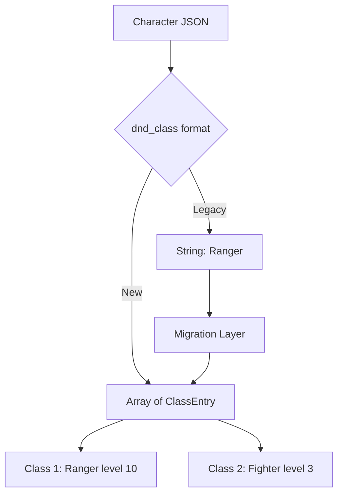

# Multi-class Support Plan

## Overview

This document describes the design for supporting multi-class characters in the
D&D Character Consultant System. The goal is to allow characters to have
multiple D&D classes with proper level tracking, feature access, and consultant
calculations.

## Problem Statement

### Current Issues

1. **Single Class Limitation**: The current character schema only supports a
   single `dnd_class` field, preventing multi-class character representation.

2. **Incomplete Feature Access**: Multi-class characters need access to
   features from all their classes, but the current system only loads
   knowledge for one class.

3. **DC Calculation Gaps**: The DC calculator only considers one class for
   bonuses, missing the combined benefits of multi-class characters.

4. **Validation Constraints**: The character validator expects a single class
   string, rejecting any multi-class data structures.

### Evidence from Codebase

| File | Current Implementation | Limitation |
|------|----------------------|------------|
| `character_validator.py` | `dnd_class: str` required | Single string only |
| `class_knowledge.py` | `CLASS_KNOWLEDGE[class_name]` | Single class lookup |
| `consultant_dc.py` | `self.profile.character_class.value` | Single class bonus |
| `aragorn.json` | `"dnd_class": "Ranger"` | No multi-class support |

---

## Proposed Solution

### High-Level Approach

1. **Schema Evolution**: Change `dnd_class` from string to array of class objects
2. **Backward Compatibility**: Support both legacy string and new array formats
3. **Multi-Class Knowledge**: Aggregate knowledge from all classes
4. **Combined DC Bonuses**: Merge bonuses from all classes

### Schema Design



---

## Implementation Details

### 1. New Schema Structure

Create a new `classes` field that supports multi-classing:

```json
{
  "name": "Aragorn",
  "dnd_class": "Ranger",
  "classes": [
    {
      "name": "Ranger",
      "level": 7,
      "subclass": "Hunter"
    },
    {
      "name": "Fighter",
      "level": 3,
      "subclass": "Champion"
    }
  ],
  "level": 10
}
```

### 2. Class Entry Schema

Each class entry should contain:

| Field | Type | Required | Description |
|-------|------|----------|-------------|
| `name` | string | Yes | Class name - must match CLASS_KNOWLEDGE keys |
| `level` | int | Yes | Level in this class - 1-20 range |
| `subclass` | string | No | Subclass/archetype name |

### 3. CharacterProfile Updates

Update `src/characters/consultants/character_profile.py`:

```python
@dataclass
class ClassEntry:
    """Represents a single class for multi-class characters."""
    name: str
    level: int
    subclass: Optional[str] = None

    def __post_init__(self):
        # Validate class name exists in CLASS_KNOWLEDGE
        if self.name not in CLASS_KNOWLEDGE:
            raise ValueError(f"Unknown class: {self.name}")
        # Validate level range
        if not 1 <= self.level <= 20:
            raise ValueError(f"Level must be 1-20, got {self.level}")

class CharacterProfile:
    # Existing fields...
    dnd_class: str  # Primary class - kept for backward compatibility
    classes: List[ClassEntry] = field(default_factory=list)

    @property
    def total_level(self) -> int:
        """Calculate total character level from all classes."""
        return sum(c.level for c in self.classes) if self.classes else 0

    @property
    def primary_class(self) -> str:
        """Return the highest-level class or dnd_class for legacy."""
        if self.classes:
            return max(self.classes, key=lambda c: c.level).name
        return self.dnd_class
```

### 4. Class Knowledge Aggregation

Update `src/characters/consultants/class_knowledge.py`:

```python
def get_multiclass_knowledge(classes: List[ClassEntry]) -> Dict[str, Any]:
    """Aggregate knowledge from all classes a character has.

    Args:
        classes: List of ClassEntry objects

    Returns:
        Combined knowledge dictionary with merged features
    """
    if not classes:
        return {}

    combined = {
        "primary_abilities": [],
        "typical_roles": [],
        "key_features": [],
        "common_reactions": {},
        "roleplay_notes": []
    }

    for class_entry in classes:
        knowledge = CLASS_KNOWLEDGE.get(class_entry.name, {})
        combined["primary_abilities"].append(knowledge.get("primary_ability"))
        combined["typical_roles"].append(knowledge.get("typical_role"))
        combined["key_features"].extend(knowledge.get("key_features", []))
        # Merge reactions, later classes can override
        combined["common_reactions"].update(knowledge.get("common_reactions", {}))
        combined["roleplay_notes"].append(knowledge.get("roleplay_notes"))

    return combined
```

### 5. DC Calculator Updates

Update `src/characters/consultants/consultant_dc.py`:

```python
def _get_multiclass_bonuses(self) -> Dict[str, int]:
    """Aggregate DC bonuses from all classes.

    Returns:
        Dictionary mapping skill names to total bonus
    """
    all_bonuses = {}

    for class_entry in self.profile.classes:
        class_bonuses = CLASS_BONUSES.get(class_entry.name, {})
        for skill, bonus in class_bonuses.items():
            # Sum bonuses from all classes
            all_bonuses[skill] = all_bonuses.get(skill, 0) + bonus

    return all_bonuses

def suggest_dc_for_action(self, action_description: str) -> Dict[str, Any]:
    """Suggest DC considering all class bonuses."""
    # ... existing logic ...

    # Use multi-class bonuses instead of single class
    multiclass_bonuses = self._get_multiclass_bonuses()
    class_adjustment = multiclass_bonuses.get(action_type, 0)
    final_dc = max(5, adjusted_dc + class_adjustment)

    # ... rest of logic ...
```

### 6. Validator Updates

Update `src/validation/character_validator.py`:

```python
def _validate_classes_field(data: Dict[str, Any], file_prefix: str) -> List[str]:
    """Validate the classes array for multi-class characters."""
    errors = []

    if "classes" not in data:
        return errors  # Optional field

    classes = data["classes"]
    if not isinstance(classes, list):
        errors.append(f"{file_prefix}Field 'classes' must be an array")
        return errors

    if not classes:
        errors.append(f"{file_prefix}Field 'classes' cannot be empty if present")
        return errors

    valid_classes = set(CLASS_KNOWLEDGE.keys())
    total_levels = 0

    for i, class_entry in enumerate(classes):
        entry_prefix = f"{file_prefix}classes[{i}]: "

        if not isinstance(class_entry, dict):
            errors.append(f"{entry_prefix}Must be an object")
            continue

        # Validate name
        name = class_entry.get("name")
        if not name:
            errors.append(f"{entry_prefix}Missing required field: 'name'")
        elif name not in valid_classes:
            errors.append(f"{entry_prefix}Unknown class: '{name}'")

        # Validate level
        level = class_entry.get("level")
        if level is None:
            errors.append(f"{entry_prefix}Missing required field: 'level'")
        elif not isinstance(level, int):
            errors.append(f"{entry_prefix}Level must be an integer")
        elif not 1 <= level <= 20:
            errors.append(f"{entry_prefix}Level must be 1-20, got {level}")
        else:
            total_levels += level

    # Validate total levels match character level
    if "level" in data and total_levels > 0:
        if data["level"] != total_levels:
            errors.append(
                f"{file_prefix}Total class levels ({total_levels}) must equal "
                f"character level ({data['level']})"
            )

    return errors
```

---

## Affected Files

| File | Changes Required |
|------|-----------------|
| `src/characters/consultants/character_profile.py` | Add ClassEntry dataclass, update CharacterProfile |
| `src/characters/consultants/class_knowledge.py` | Add get_multiclass_knowledge function |
| `src/characters/consultants/consultant_dc.py` | Update DC calculations for multi-class |
| `src/characters/consultants/consultant_core.py` | Update class knowledge loading |
| `src/validation/character_validator.py` | Add classes field validation |
| `game_data/characters/*.json` | Optional migration to new format |
| `tests/characters/test_character_profile.py` | Add multi-class tests |
| `tests/characters/test_class_knowledge.py` | Add aggregation tests |
| `tests/characters/test_consultant_dc.py` | Add multi-class DC tests |
| `tests/validation/test_character_validator.py` | Add classes validation tests |

---

## Testing Strategy

### Unit Tests

1. **ClassEntry Tests**
   - Valid class entry creation
   - Invalid class name rejection
   - Level range validation

2. **Multi-class Knowledge Tests**
   - Single class returns same as before
   - Two classes merge correctly
   - Conflicting reactions handled

3. **DC Calculator Tests**
   - Single class unchanged
   - Multi-class bonuses stack
   - No bonuses for untrained skills

4. **Validator Tests**
   - Valid multi-class JSON passes
   - Invalid class names rejected
   - Level mismatch detected

### Integration Tests

1. Load multi-class character and verify consultant behavior
2. Run story analysis with multi-class party member
3. Verify backward compatibility with legacy characters

### Test Data

Create test character file: `game_data/characters/multiclass_test.json`

```json
{
  "name": "Elric",
  "dnd_class": "Fighter",
  "classes": [
    {"name": "Fighter", "level": 5, "subclass": "Eldritch Knight"},
    {"name": "Wizard", "level": 3, "subclass": "School of Evocation"}
  ],
  "level": 8,
  "species": "Human",
  "ability_scores": {
    "strength": 16,
    "dexterity": 12,
    "constitution": 14,
    "intelligence": 16,
    "wisdom": 10,
    "charisma": 8
  },
  "equipment": {"weapons": [], "armor": [], "items": []},
  "known_spells": ["Fireball", "Shield", "Magic Missile"],
  "relationships": {},
  "background": "Soldier"
}
```

---

## Migration Path

### Phase 1: Backward Compatibility

1. Add `classes` field as optional
2. Keep `dnd_class` as required for legacy support
3. If `classes` is empty, derive from `dnd_class` and `level`

### Phase 2: Migration Script

Create `scripts/migrate_to_multiclass.py`:

```python
"""Migrate character files to multi-class format."""

import json
from pathlib import Path

def migrate_character(filepath: Path) -> bool:
    """Add classes array to legacy character file."""
    with open(filepath, 'r', encoding='utf-8') as f:
        data = json.load(f)

    # Skip if already migrated
    if 'classes' in data and data['classes']:
        return False

    # Create classes array from legacy fields
    class_entry = {
        "name": data["dnd_class"],
        "level": data["level"]
    }
    if "subclass" in data:
        class_entry["subclass"] = data["subclass"]

    data["classes"] = [class_entry]

    # Write back
    with open(filepath, 'w', encoding='utf-8') as f:
        json.dump(data, f, indent=2)

    return True
```

### Phase 3: Deprecation

1. Add warning when `dnd_class` is used without `classes`
2. Update documentation to recommend `classes` field
3. Eventually make `dnd_class` optional if `classes` is present

---

## Dependencies

### Required Before This Work

- None - this is a standalone enhancement

### Works Well With

- **Character Names Split Plan** - Could be implemented together
- **DC Difficulty Scaling Plan** - Benefits from multi-class DC calculations

### Enables Future Work

- Class-specific spell slot tracking
- Multi-class feature prerequisites
- Class-specific saving throw proficiencies

---

## Risks and Mitigations

| Risk | Impact | Mitigation |
|------|--------|------------|
| Breaking existing characters | High | Backward compatibility layer |
| Complex DC calculations | Medium | Clear documentation and tests |
| UI confusion | Low | CLI shows primary class prominently |
| Validation complexity | Medium | Comprehensive test coverage |

---

## Success Criteria

1. Multi-class characters load without errors
2. DC calculations include bonuses from all classes
3. Legacy single-class characters continue to work
4. All tests pass with 10.00/10 pylint score
5. Documentation updated with multi-class examples
