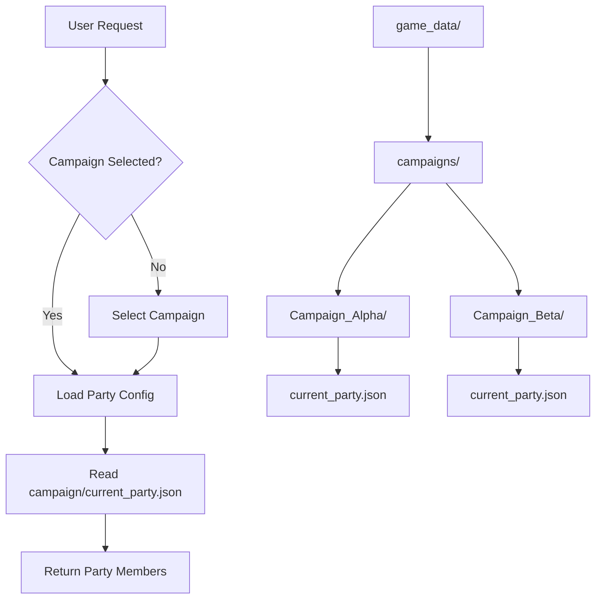

# Current Party Alterations Plan

## Overview

This document describes the design for moving party configuration from a global
location to campaign-specific storage. The goal is to allow each campaign to
have its own party configuration, enabling better separation of concerns and
support for multiple concurrent campaigns.

## Problem Statement

### Current Issues

1. **Global Party Configuration**: The current system uses a single
   `current_party.json` that applies globally, making it difficult to manage
   multiple campaigns with different party compositions.

2. **Campaign Isolation**: When switching between campaigns, users must
   manually update the party configuration, leading to potential errors and
   confusion.

3. **Inconsistent Storage Location**: Party files exist both in
   `game_data/current_party/` and within campaign directories, creating
   ambiguity about which file is authoritative.

4. **Path Resolution Complexity**: The current `get_party_config_path()`
   function has complex logic to handle multiple possible locations.

### Evidence from Codebase

| File | Current Behavior | Issue |
|------|-----------------|-------|
| `party_config_manager.py` | Loads from global or campaign path | Complex fallback logic |
| `party_validator.py` | Uses `get_party_config_path()` | Multiple location support |
| `Example_Campaign/current_party.json` | Campaign-local file exists | Duplicated structure |
| `path_utils.py` | `get_party_config_path()` has fallbacks | Ambiguous resolution |

---

## Proposed Solution

### High-Level Approach

1. **Campaign-Scoped Storage**: Move party configuration to be exclusively
   within campaign directories
2. **Deprecate Global Location**: Remove support for global `current_party.json`
3. **Campaign Selection Flow**: Require campaign selection before party operations
4. **Migration Utility**: Provide tool to migrate existing global party files

### Storage Architecture



---

## Implementation Details

### 1. New Directory Structure

```
game_data/
├── characters/           # Shared character pool
│   ├── aragorn.json
│   ├── frodo.json
│   └── gandalf.json
├── campaigns/
│   ├── Campaign_Alpha/
│   │   ├── current_party.json    # Party for this campaign
│   │   ├── 001_intro.md
│   │   └── session_results_*.md
│   └── Campaign_Beta/
│       ├── current_party.json    # Different party for this campaign
│       ├── 001_start.md
│       └── session_results_*.md
└── npcs/                 # Shared NPC pool
```

### 2. Updated Party Config Schema

The `current_party.json` within each campaign:

```json
{
  "campaign_name": "Campaign_Alpha",
  "party_members": [
    "Aragorn",
    "Frodo Baggins",
    "Gandalf the Grey"
  ],
  "active": true,
  "created_date": "2025-10-12T08:25:04.637762",
  "last_updated": "2025-11-15T14:30:00.000000",
  "notes": "Main campaign party for the Fellowship storyline"
}
```

### 3. Path Utils Updates

Update `src/utils/path_utils.py`:

```python
def get_party_config_path(
    campaign_name: Optional[str] = None,
    workspace_path: Optional[str] = None
) -> str:
    """Get path to campaign-specific party configuration.

    Args:
        campaign_name: Name of the campaign. Required.
        workspace_path: Optional workspace root path.

    Returns:
        Path to the campaign's current_party.json

    Raises:
        ValueError: If campaign_name is not provided
    """
    if not campaign_name:
        raise ValueError(
            "campaign_name is required. Party configuration is now "
            "campaign-specific. Select a campaign first."
        )

    base_path = Path(workspace_path) if workspace_path else get_game_data_path()
    campaign_dir = base_path / "campaigns" / campaign_name

    if not campaign_dir.exists():
        raise ValueError(f"Campaign directory not found: {campaign_dir}")

    return str(campaign_dir / "current_party.json")


def get_all_campaign_party_paths(workspace_path: Optional[str] = None) -> List[str]:
    """Get all campaign party configuration files.

    Returns:
        List of paths to all current_party.json files in campaigns
    """
    base_path = Path(workspace_path) if workspace_path else get_game_data_path()
    campaigns_dir = base_path / "campaigns"

    if not campaigns_dir.exists():
        return []

    party_files = []
    for campaign_dir in campaigns_dir.iterdir():
        if campaign_dir.is_dir():
            party_file = campaign_dir / "current_party.json"
            if party_file.exists():
                party_files.append(str(party_file))

    return party_files
```

### 4. Party Config Manager Updates

Update `src/cli/party_config_manager.py`:

```python
def load_current_party(
    campaign_name: str,
    workspace_path: Optional[str] = None,
) -> List[str]:
    """Load current party members from campaign configuration.

    Args:
        campaign_name: Name of the campaign - required
        workspace_path: Optional workspace root path

    Returns:
        List of party member names

    Raises:
        ValueError: If campaign_name is not provided
        FileNotFoundError: If campaign or party file not found
    """
    if not campaign_name:
        raise ValueError(
            "Cannot load party: no campaign selected. "
            "Please select a campaign first."
        )

    config_path = get_party_config_path(campaign_name, workspace_path)

    if not file_exists(config_path):
        # Create default empty party for new campaigns
        save_current_party([], campaign_name, workspace_path)
        return []

    try:
        data = load_json_file(config_path)
        return data.get("party_members", [])
    except (OSError, ValueError) as e:
        raise RuntimeError(f"Could not load party configuration: {e}")


def save_current_party(
    party_members: List[str],
    campaign_name: str,
    workspace_path: Optional[str] = None,
):
    """Save current party members to campaign configuration.

    Args:
        party_members: List of party member names
        campaign_name: Name of the campaign - required
        workspace_path: Optional workspace root path
    """
    if not campaign_name:
        raise ValueError(
            "Cannot save party: no campaign selected. "
            "Please select a campaign first."
        )

    config_path = get_party_config_path(campaign_name, workspace_path)

    data = {
        "campaign_name": campaign_name,
        "party_members": party_members,
        "active": True,
        "last_updated": datetime.now().isoformat(),
    }

    # Load existing to preserve created_date and notes
    if file_exists(config_path):
        try:
            existing = load_json_file(config_path)
            data["created_date"] = existing.get("created_date", datetime.now().isoformat())
            data["notes"] = existing.get("notes", "")
        except (OSError, ValueError):
            data["created_date"] = datetime.now().isoformat()
    else:
        data["created_date"] = datetime.now().isoformat()

    # Validate before saving
    if VALIDATOR_AVAILABLE:
        is_valid, errors = validate_party_json(data)
        if not is_valid:
            print("[WARNING] Party configuration validation failed:")
            for error in errors:
                print(f"  - {error}")

    save_json_file(config_path, data)
```

### 5. CLI Party Selection Updates

Update `src/cli/cli_character_manager.py` or create new party selection flow:

```python
def select_campaign_for_party() -> Optional[str]:
    """Prompt user to select a campaign for party management.

    Returns:
        Selected campaign name or None if cancelled
    """
    campaigns = list_campaigns()

    if not campaigns:
        print("[INFO] No campaigns found. Create a campaign first.")
        return None

    print("\nSelect a campaign for party management:")
    for i, campaign in enumerate(campaigns, 1):
        party = load_current_party(campaign)
        member_count = len(party)
        print(f"  {i}. {campaign} ({member_count} party members)")

    choice = input("\nEnter selection (or 'q' to quit): ").strip()

    if choice.lower() == 'q':
        return None

    try:
        index = int(choice) - 1
        if 0 <= index < len(campaigns):
            return campaigns[index]
    except ValueError:
        pass

    print("[ERROR] Invalid selection")
    return None


def manage_party_menu(campaign_name: str):
    """Party management menu for a specific campaign.

    Args:
        campaign_name: The campaign to manage party for
    """
    while True:
        current_party = load_current_party(campaign_name)

        print(f"\n=== Party Management: {campaign_name} ===")
        print(f"Current Party: {', '.join(current_party) if current_party else 'Empty'}")
        print("\n1. Add party member")
        print("2. Remove party member")
        print("3. View all available characters")
        print("4. Clear entire party")
        print("5. Return to previous menu")

        choice = input("\nSelect option: ").strip()

        if choice == "1":
            add_member_to_campaign_party(campaign_name)
        elif choice == "2":
            remove_member_from_campaign_party(campaign_name)
        elif choice == "3":
            list_available_characters()
        elif choice == "4":
            confirm_and_clear_party(campaign_name)
        elif choice == "5":
            break
```

### 6. Party Validator Updates

Update `src/validation/party_validator.py`:

```python
def _validate_campaign_reference(
    data: Dict[str, Any],
    campaigns_dir: str
) -> List[str]:
    """Validate that campaign_name references an existing campaign."""
    errors = []
    campaign_name = data.get("campaign_name")

    if campaign_name:
        campaign_path = Path(campaigns_dir) / campaign_name
        if not campaign_path.exists():
            errors.append(
                f"Campaign '{campaign_name}' not found in {campaigns_dir}"
            )

    return errors


def validate_party_json(
    data: Dict[str, Any],
    characters_dir: Optional[str] = None,
    campaigns_dir: Optional[str] = None
) -> Tuple[bool, List[str]]:
    """Validate party JSON with campaign reference checking."""
    errors = []
    errors.extend(_validate_required_fields(data))
    errors.extend(_validate_party_members(data))
    errors.extend(_validate_party_cross_reference(data, characters_dir))
    errors.extend(_validate_last_updated(data))

    if campaigns_dir:
        errors.extend(_validate_campaign_reference(data, campaigns_dir))

    return (len(errors) == 0, errors)
```

---

## Affected Files

| File | Changes Required |
|------|-----------------|
| `src/utils/path_utils.py` | Update `get_party_config_path()` to require campaign |
| `src/cli/party_config_manager.py` | Update load/save to require campaign_name |
| `src/stories/party_manager.py` | Update to work with campaign-scoped parties |
| `src/validation/party_validator.py` | Add campaign reference validation |
| `src/cli/cli_character_manager.py` | Add campaign selection for party management |
| `src/cli/cli_story_manager.py` | Update party loading for story operations |
| `src/stories/character_loader.py` | Update party-based character loading |
| `game_data/campaigns/*/current_party.json` | Ensure all campaigns have party files |
| `tests/cli/test_party_config_manager.py` | Update tests for campaign-scoped parties |
| `tests/validation/test_party_validator.py` | Add campaign validation tests |

---

## Testing Strategy

### Unit Tests

1. **Path Utils Tests**
   - `get_party_config_path()` requires campaign_name
   - Raises ValueError without campaign
   - Returns correct path with campaign

2. **Party Manager Tests**
   - Load party from specific campaign
   - Save party to specific campaign
   - Error handling for missing campaign

3. **Validator Tests**
   - Campaign reference validation
   - Cross-reference with characters
   - Required fields with campaign_name

### Integration Tests

1. Create new campaign and verify empty party
2. Add/remove members to campaign party
3. Switch between campaigns with different parties
4. Story analysis uses correct campaign party

### Test Data

Ensure all test campaigns have valid party files:

```
game_data/campaigns/
├── Example_Campaign/
│   └── current_party.json    # Existing - verify format
└── Test_Campaign/
    └── current_party.json    # Create for testing
```

---

## Migration Path

### Phase 1: Preparation

1. Create `current_party.json` in all existing campaigns
2. Copy global party to each campaign that lacks one
3. Add deprecation warning for global party path

### Phase 2: Migration Script

Create `scripts/migrate_party_to_campaigns.py`:

```python
"""Migrate global party configuration to campaign-specific files."""

import json
from pathlib import Path
from datetime import datetime

def migrate_global_party_to_campaigns(workspace_path: str = "."):
    """Copy global party to all campaigns that lack party files."""
    game_data = Path(workspace_path) / "game_data"
    global_party_path = game_data / "current_party" / "current_party.json"

    if not global_party_path.exists():
        print("No global party file found. Nothing to migrate.")
        return

    # Load global party
    with open(global_party_path, 'r', encoding='utf-8') as f:
        global_party = json.load(f)

    # Find all campaigns
    campaigns_dir = game_data / "campaigns"
    if not campaigns_dir.exists():
        print("No campaigns directory found.")
        return

    migrated = 0
    for campaign_dir in campaigns_dir.iterdir():
        if not campaign_dir.is_dir():
            continue

        campaign_party_path = campaign_dir / "current_party.json"

        if campaign_party_path.exists():
            print(f"  Skipping {campaign_dir.name}: already has party file")
            continue

        # Create campaign-specific party file
        campaign_party = {
            "campaign_name": campaign_dir.name,
            "party_members": global_party.get("party_members", []),
            "active": True,
            "created_date": datetime.now().isoformat(),
            "last_updated": datetime.now().isoformat(),
            "notes": f"Migrated from global party configuration"
        }

        with open(campaign_party_path, 'w', encoding='utf-8') as f:
            json.dump(campaign_party, f, indent=2)

        print(f"  Migrated party to {campaign_dir.name}")
        migrated += 1

    print(f"\nMigration complete: {migrated} campaigns updated")
    print(f"Global party file preserved at: {global_party_path}")
    print("You may delete the global file after verifying migration.")


if __name__ == "__main__":
    migrate_global_party_to_campaigns()
```

### Phase 3: Deprecation

1. Add warning when global party path is accessed
2. Update all documentation to reference campaign-scoped parties
3. Remove global party path fallback in future version

---

## Dependencies

### Required Before This Work

- None - this is a standalone enhancement

### Works Well With

- **Campaign Templates Plan** - New campaigns should include party template
- **Session Notes Integration Plan** - Party context for session notes

### Enables Future Work

- Party history tracking per campaign
- Party composition analytics
- Cross-campaign character usage tracking

---

## Risks and Mitigations

| Risk | Impact | Mitigation |
|------|--------|------------|
| Breaking existing workflows | High | Migration script and deprecation warnings |
| User confusion about campaign selection | Medium | Clear CLI prompts and documentation |
| Lost party configurations | High | Migration preserves all data |
| Multiple party file locations | Low | Remove global fallback entirely |

---

## Success Criteria

1. Each campaign has its own `current_party.json`
2. Global party location is deprecated and removed
3. CLI requires campaign selection for party operations
4. All tests pass with 10.00/10 pylint score
5. Migration script successfully moves existing configurations
6. Documentation updated to reflect campaign-scoped parties
