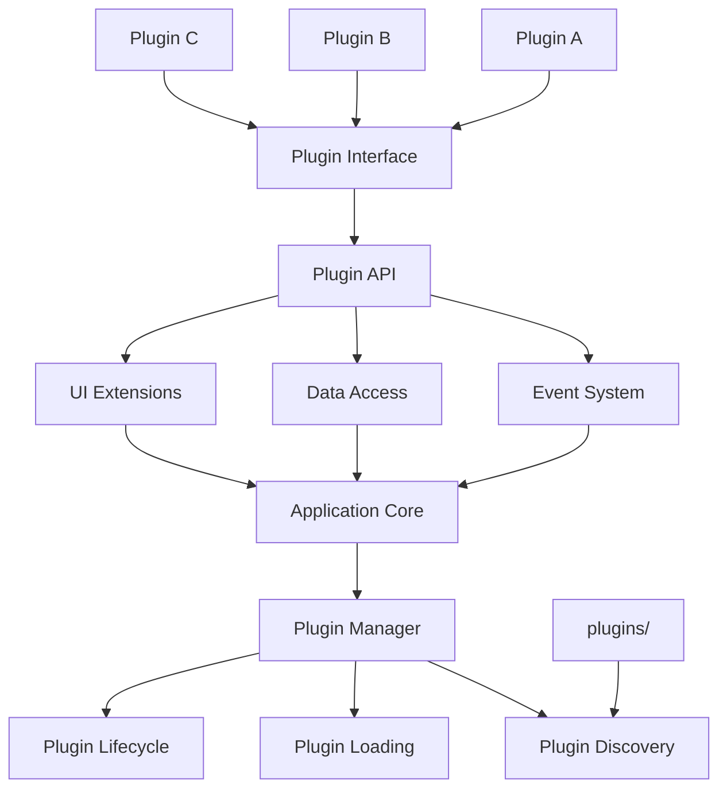

# Plugin Architecture Plan

## Overview

This document describes the design for a plugin architecture for the D&D
Character Consultant System. The goal is to allow custom modules and plugins
for specific campaign needs, enabling extensibility without modifying core
code.

## Problem Statement

### Current Issues

1. **No Extensibility**: Adding new features requires modifying core code,
   making updates difficult and risking regressions.

2. **Campaign-Specific Needs**: Different campaigns have unique requirements
   (custom rules, special mechanics, unique content) that don't fit the
   standard system.

3. **No Custom Hooks**: There are no extension points for custom behavior
   at key points in the application flow.

4. **No Third-Party Extensions**: Users cannot share or use community-created
   extensions without code changes.

### Evidence from Codebase

| Current State | Limitation |
|---------------|------------|
| Monolithic code structure | Hard to extend without modification |
| No plugin interface | No standard way to add features |
| No event system | Cannot hook into application events |
| No module discovery | Cannot load external modules |

---

## Proposed Solution

### High-Level Approach

1. **Plugin Interface**: Define a standard interface that all plugins must
   implement
2. **Plugin Loader**: Discover and load plugins from a plugins directory
3. **Plugin API**: Provide a stable API for plugins to interact with the
   core system
4. **Event System**: Allow plugins to subscribe to and emit events
5. **Example Plugins**: Create reference plugins demonstrating the architecture

### Plugin Architecture



---

## Implementation Details

### 1. Plugin Interface

Create `src/plugins/base.py`:

```python
"""Base plugin interface and types."""

from abc import ABC, abstractmethod
from dataclasses import dataclass, field
from typing import Dict, List, Optional, Any, Callable
from enum import Enum


class PluginState(Enum):
    """States a plugin can be in."""
    UNLOADED = "unloaded"
    LOADED = "loaded"
    ENABLED = "enabled"
    DISABLED = "disabled"
    ERROR = "error"


@dataclass
class PluginMetadata:
    """Metadata about a plugin."""
    name: str
    version: str
    description: str
    author: str = ""
    website: str = ""
    license: str = "MIT"
    min_app_version: str = "1.0.0"
    max_app_version: str = ""
    dependencies: List[str] = field(default_factory=list)
    tags: List[str] = field(default_factory=list)

    def to_dict(self) -> Dict:
        """Convert to dictionary."""
        return {
            "name": self.name,
            "version": self.version,
            "description": self.description,
            "author": self.author,
            "website": self.website,
            "license": self.license,
            "min_app_version": self.min_app_version,
            "max_app_version": self.max_app_version,
            "dependencies": self.dependencies,
            "tags": self.tags
        }


@dataclass
class PluginContext:
    """Context provided to plugins for accessing the application."""
    config: Dict[str, Any]
    data_dir: str
    plugin_dir: str

    # Callbacks for plugin actions
    register_command: Optional[Callable] = None
    register_event_handler: Optional[Callable] = None
    emit_event: Optional[Callable] = None
    get_service: Optional[Callable] = None
    log: Optional[Callable] = None


class PluginBase(ABC):
    """Base class for all plugins.

    All plugins must inherit from this class and implement the required methods.
    """

    # Metadata must be defined by subclasses
    metadata: PluginMetadata = None

    def __init__(self):
        """Initialize the plugin."""
        self._state = PluginState.UNLOADED
        self._context: Optional[PluginContext] = None
        self._registered_commands: List[str] = []
        self._registered_handlers: List[str] = []

    @property
    def name(self) -> str:
        """Get the plugin name."""
        return self.metadata.name if self.metadata else "Unknown"

    @property
    def state(self) -> PluginState:
        """Get the current plugin state."""
        return self._state

    @abstractmethod
    def on_load(self, context: PluginContext) -> bool:
        """Called when the plugin is loaded.

        Args:
            context: Plugin context with access to application

        Returns:
            True if load was successful, False otherwise
        """
        pass

    @abstractmethod
    def on_enable(self) -> bool:
        """Called when the plugin is enabled.

        Returns:
            True if enable was successful, False otherwise
        """
        pass

    @abstractmethod
    def on_disable(self) -> bool:
        """Called when the plugin is disabled.

        Returns:
            True if disable was successful, False otherwise
        """
        pass

    @abstractmethod
    def on_unload(self) -> bool:
        """Called when the plugin is unloaded.

        Returns:
            True if unload was successful, False otherwise
        """
        pass

    def get_config_schema(self) -> Optional[Dict]:
        """Get the JSON schema for plugin configuration.

        Returns:
            JSON schema dict or None if no configuration needed
        """
        return None

    def get_default_config(self) -> Dict:
        """Get default configuration values.

        Returns:
            Dictionary of default configuration values
        """
        return {}

    def validate_config(self, config: Dict) -> List[str]:
        """Validate plugin configuration.

        Args:
            config: Configuration to validate

        Returns:
            List of validation error messages, empty if valid
        """
        return []

    def get_commands(self) -> Dict[str, Callable]:
        """Get CLI commands provided by this plugin.

        Returns:
            Dictionary mapping command names to handler functions
        """
        return {}

    def get_event_handlers(self) -> Dict[str, Callable]:
        """Get event handlers provided by this plugin.

        Returns:
            Dictionary mapping event names to handler functions
        """
        return {}

    def get_services(self) -> Dict[str, Any]:
        """Get services provided by this plugin.

        Returns:
            Dictionary mapping service names to service objects
        """
        return {}


class SimplePlugin(PluginBase):
    """Simple plugin base class for basic plugins.

    Provides default implementations for lifecycle methods.
    """

    def on_load(self, context: PluginContext) -> bool:
        """Default load implementation."""
        self._context = context
        self._state = PluginState.LOADED
        return True

    def on_enable(self) -> bool:
        """Default enable implementation."""
        self._state = PluginState.ENABLED
        return True

    def on_disable(self) -> bool:
        """Default disable implementation."""
        self._state = PluginState.DISABLED
        return True

    def on_unload(self) -> bool:
        """Default unload implementation."""
        self._state = PluginState.UNLOADED
        return True
```

### 2. Event System

Create `src/plugins/events.py`:

```python
"""Event system for plugin communication."""

from dataclasses import dataclass, field
from typing import Dict, List, Callable, Any, Optional
from enum import Enum
from datetime import datetime
import threading


class EventType(Enum):
    """Standard event types in the application."""
    # Application lifecycle
    APP_START = "app:start"
    APP_SHUTDOWN = "app:shutdown"

    # Character events
    CHARACTER_LOADED = "character:loaded"
    CHARACTER_SAVED = "character:saved"
    CHARACTER_CREATED = "character:created"
    CHARACTER_DELETED = "character:deleted"

    # Story events
    STORY_LOADED = "story:loaded"
    STORY_SAVED = "story:saved"
    STORY_GENERATED = "story:generated"
    STORY_ANALYZED = "story:analyzed"

    # Session events
    SESSION_STARTED = "session:started"
    SESSION_ENDED = "session:ended"

    # Combat events
    COMBAT_STARTED = "combat:started"
    COMBAT_ENDED = "combat:ended"
    COMBAT_ROUND = "combat:round"

    # NPC events
    NPC_DETECTED = "npc:detected"
    NPC_CREATED = "npc:created"
    NPC_UPDATED = "npc:updated"

    # Plugin events
    PLUGIN_LOADED = "plugin:loaded"
    PLUGIN_ENABLED = "plugin:enabled"
    PLUGIN_DISABLED = "plugin:disabled"
    PLUGIN_ERROR = "plugin:error"

    # Custom events (plugins can define their own)
    CUSTOM = "custom"


@dataclass
class Event:
    """Represents an event in the system."""
    event_type: str
    data: Dict[str, Any] = field(default_factory=dict)
    source: str = ""  # Plugin name or "core"
    timestamp: str = field(default_factory=lambda: datetime.now().isoformat())
    cancelled: bool = False

    def cancel(self) -> None:
        """Cancel the event, preventing further handlers."""
        self.cancelled = True


class EventBus:
    """Central event bus for plugin communication."""

    def __init__(self):
        """Initialize the event bus."""
        self._handlers: Dict[str, List[Callable]] = {}
        self._lock = threading.Lock()
        self._event_history: List[Event] = []
        self._max_history = 100

    def subscribe(
        self,
        event_type: str,
        handler: Callable[[Event], None],
        priority: int = 0
    ) -> str:
        """Subscribe to an event type.

        Args:
            event_type: Type of event to subscribe to
            handler: Function to call when event is emitted
            priority: Handler priority (higher = called first)

        Returns:
            Subscription ID for unsubscribing
        """
        with self._lock:
            if event_type not in self._handlers:
                self._handlers[event_type] = []

            # Store handler with priority
            subscription_id = f"{event_type}:{id(handler)}"
            self._handlers[event_type].append({
                "handler": handler,
                "priority": priority,
                "id": subscription_id
            })

            # Sort by priority (descending)
            self._handlers[event_type].sort(
                key=lambda x: x["priority"],
                reverse=True
            )

            return subscription_id

    def unsubscribe(self, subscription_id: str) -> bool:
        """Unsubscribe from an event.

        Args:
            subscription_id: ID returned from subscribe

        Returns:
            True if unsubscribed, False if not found
        """
        with self._lock:
            for event_type, handlers in self._handlers.items():
                for i, handler_info in enumerate(handlers):
                    if handler_info["id"] == subscription_id:
                        handlers.pop(i)
                        return True
            return False

    def emit(
        self,
        event_type: str,
        data: Optional[Dict[str, Any]] = None,
        source: str = "core"
    ) -> Event:
        """Emit an event to all subscribers.

        Args:
            event_type: Type of event to emit
            data: Event data
            source: Source of the event

        Returns:
            The emitted event
        """
        event = Event(
            event_type=event_type,
            data=data or {},
            source=source
        )

        # Store in history
        self._event_history.append(event)
        if len(self._event_history) > self._max_history:
            self._event_history.pop(0)

        # Call handlers
        handlers = self._handlers.get(event_type, [])

        for handler_info in handlers:
            if event.cancelled:
                break

            try:
                handler_info["handler"](event)
            except Exception as e:
                # Log error but continue
                print(f"[EventBus] Handler error: {e}")

        return event

    def get_history(
        self,
        event_type: Optional[str] = None,
        limit: int = 10
    ) -> List[Event]:
        """Get recent event history.

        Args:
            event_type: Filter by event type, or None for all
            limit: Maximum number of events to return

        Returns:
            List of recent events
        """
        events = self._event_history

        if event_type:
            events = [e for e in events if e.event_type == event_type]

        return events[-limit:]

    def clear_handlers(self, event_type: Optional[str] = None) -> None:
        """Clear all handlers for an event type.

        Args:
            event_type: Event type to clear, or None for all
        """
        with self._lock:
            if event_type:
                self._handlers.pop(event_type, None)
            else:
                self._handlers.clear()


# Global event bus instance
_event_bus: Optional[EventBus] = None


def get_event_bus() -> EventBus:
    """Get the global event bus instance."""
    global _event_bus
    if _event_bus is None:
        _event_bus = EventBus()
    return _event_bus
```

### 3. Plugin Manager

Create `src/plugins/manager.py`:

```python
"""Plugin manager for loading and managing plugins."""

import importlib
import importlib.util
import sys
from pathlib import Path
from typing import Dict, List, Optional, Type
from dataclasses import dataclass

from src.plugins.base import (
    PluginBase, PluginMetadata, PluginContext, PluginState
)
from src.plugins.events import EventBus, get_event_bus
from src.utils.path_utils import get_game_data_path


@dataclass
class PluginInfo:
    """Information about a loaded plugin."""
    plugin: PluginBase
    path: str
    enabled: bool = False
    error: str = ""


class PluginManager:
    """Manages plugin discovery, loading, and lifecycle."""

    def __init__(self, plugin_dir: Optional[str] = None):
        """Initialize the plugin manager.

        Args:
            plugin_dir: Directory containing plugins
        """
        self.plugin_dir = Path(plugin_dir) if plugin_dir else self._get_default_plugin_dir()
        self._plugins: Dict[str, PluginInfo] = {}
        self._services: Dict[str, Dict[str, Any]] = {}
        self._event_bus = get_event_bus()

    def _get_default_plugin_dir(self) -> Path:
        """Get the default plugin directory."""
        return get_game_data_path() / "plugins"

    def discover_plugins(self) -> List[str]:
        """Discover all available plugins.

        Returns:
            List of discovered plugin names
        """
        discovered = []

        if not self.plugin_dir.exists():
            return discovered

        for plugin_path in self.plugin_dir.iterdir():
            if plugin_path.is_dir():
                # Check for plugin.py or __init__.py
                plugin_file = plugin_path / "plugin.py"
                init_file = plugin_path / "__init__.py"

                if plugin_file.exists() or init_file.exists():
                    discovered.append(plugin_path.name)

        return discovered

    def load_plugin(self, plugin_name: str) -> bool:
        """Load a plugin by name.

        Args:
            plugin_name: Name of the plugin to load

        Returns:
            True if loaded successfully
        """
        if plugin_name in self._plugins:
            return True

        plugin_path = self.plugin_dir / plugin_name

        if not plugin_path.exists():
            return False

        try:
            # Load the plugin module
            plugin_module = self._load_plugin_module(plugin_name, plugin_path)

            if not plugin_module:
                return False

            # Find the plugin class
            plugin_class = self._find_plugin_class(plugin_module)

            if not plugin_class:
                return False

            # Instantiate the plugin
            plugin = plugin_class()

            # Create context
            context = PluginContext(
                config={},
                data_dir=str(get_game_data_path()),
                plugin_dir=str(plugin_path),
                register_command=self._register_command,
                register_event_handler=self._register_event_handler,
                emit_event=self._emit_event,
                get_service=self._get_service,
                log=self._log
            )

            # Load the plugin
            if not plugin.on_load(context):
                return False

            # Store plugin info
            self._plugins[plugin_name] = PluginInfo(
                plugin=plugin,
                path=str(plugin_path),
                enabled=False
            )

            # Emit event
            self._event_bus.emit(
                "plugin:loaded",
                {"plugin_name": plugin_name},
                source="plugin_manager"
            )

            return True

        except Exception as e:
            self._plugins[plugin_name] = PluginInfo(
                plugin=None,
                path=str(plugin_path),
                enabled=False,
                error=str(e)
            )
            return False

    def _load_plugin_module(self, plugin_name: str, plugin_path: Path):
        """Load a plugin as a Python module."""
        plugin_file = plugin_path / "plugin.py"
        init_file = plugin_path / "__init__.py"

        if plugin_file.exists():
            module_path = plugin_file
        elif init_file.exists():
            module_path = init_file
        else:
            return None

        try:
            spec = importlib.util.spec_from_file_location(
                f"plugins.{plugin_name}",
                str(module_path)
            )

            if not spec or not spec.loader:
                return None

            module = importlib.util.module_from_spec(spec)
            sys.modules[f"plugins.{plugin_name}"] = module
            spec.loader.exec_module(module)

            return module

        except Exception as e:
            print(f"[PluginManager] Error loading module: {e}")
            return None

    def _find_plugin_class(self, module) -> Optional[Type[PluginBase]]:
        """Find the plugin class in a module."""
        for attr_name in dir(module):
            attr = getattr(module, attr_name)

            if (isinstance(attr, type) and
                issubclass(attr, PluginBase) and
                attr is not PluginBase and
                attr is not SimplePlugin):
                return attr

        return None

    def enable_plugin(self, plugin_name: str) -> bool:
        """Enable a loaded plugin.

        Args:
            plugin_name: Name of the plugin to enable

        Returns:
            True if enabled successfully
        """
        info = self._plugins.get(plugin_name)

        if not info or not info.plugin:
            return False

        if info.enabled:
            return True

        try:
            if info.plugin.on_enable():
                info.enabled = True

                # Register commands
                commands = info.plugin.get_commands()
                for cmd_name, handler in commands.items():
                    self._register_command(cmd_name, handler, plugin_name)

                # Register event handlers
                handlers = info.plugin.get_event_handlers()
                for event_type, handler in handlers.items():
                    self._register_event_handler(event_type, handler, plugin_name)

                # Register services
                services = info.plugin.get_services()
                if services:
                    self._services[plugin_name] = services

                # Emit event
                self._event_bus.emit(
                    "plugin:enabled",
                    {"plugin_name": plugin_name},
                    source="plugin_manager"
                )

                return True

        except Exception as e:
            info.error = str(e)
            return False

        return False

    def disable_plugin(self, plugin_name: str) -> bool:
        """Disable an enabled plugin.

        Args:
            plugin_name: Name of the plugin to disable

        Returns:
            True if disabled successfully
        """
        info = self._plugins.get(plugin_name)

        if not info or not info.plugin:
            return False

        if not info.enabled:
            return True

        try:
            if info.plugin.on_disable():
                info.enabled = False

                # Unregister services
                self._services.pop(plugin_name, None)

                # Emit event
                self._event_bus.emit(
                    "plugin:disabled",
                    {"plugin_name": plugin_name},
                    source="plugin_manager"
                )

                return True

        except Exception as e:
            info.error = str(e)
            return False

        return False

    def unload_plugin(self, plugin_name: str) -> bool:
        """Unload a plugin completely.

        Args:
            plugin_name: Name of the plugin to unload

        Returns:
            True if unloaded successfully
        """
        info = self._plugins.get(plugin_name)

        if not info:
            return True

        # Disable first if enabled
        if info.enabled:
            self.disable_plugin(plugin_name)

        try:
            if info.plugin and info.plugin.on_unload():
                del self._plugins[plugin_name]
                return True

        except Exception as e:
            info.error = str(e)
            return False

        return False

    def get_plugin(self, plugin_name: str) -> Optional[PluginBase]:
        """Get a loaded plugin by name."""
        info = self._plugins.get(plugin_name)
        return info.plugin if info else None

    def get_all_plugins(self) -> Dict[str, PluginInfo]:
        """Get all loaded plugins."""
        return self._plugins.copy()

    def get_enabled_plugins(self) -> List[PluginBase]:
        """Get all enabled plugins."""
        return [
            info.plugin
            for info in self._plugins.values()
            if info.enabled and info.plugin
        ]

    # Callback implementations
    def _register_command(
        self,
        command_name: str,
        handler: callable,
        plugin_name: str
    ) -> None:
        """Register a CLI command from a plugin."""
        # This would integrate with the CLI system
        pass

    def _register_event_handler(
        self,
        event_type: str,
        handler: callable,
        plugin_name: str
    ) -> str:
        """Register an event handler from a plugin."""
        return self._event_bus.subscribe(event_type, handler)

    def _emit_event(
        self,
        event_type: str,
        data: dict,
        source: str
    ) -> None:
        """Emit an event from a plugin."""
        self._event_bus.emit(event_type, data, source)

    def _get_service(self, service_name: str) -> Optional[Any]:
        """Get a service by name."""
        for plugin_services in self._services.values():
            if service_name in plugin_services:
                return plugin_services[service_name]
        return None

    def _log(self, message: str, level: str = "info") -> None:
        """Log a message from a plugin."""
        print(f"[Plugin] [{level.upper()}] {message}")


# Global plugin manager instance
_plugin_manager: Optional[PluginManager] = None


def get_plugin_manager() -> PluginManager:
    """Get the global plugin manager instance."""
    global _plugin_manager
    if _plugin_manager is None:
        _plugin_manager = PluginManager()
    return _plugin_manager
```

### 4. Plugin API

Create `src/plugins/api.py`:

```python
"""Plugin API for stable plugin-to-core interaction."""

from typing import Dict, List, Optional, Any, Callable
from dataclasses import dataclass

from src.utils.path_utils import (
    get_game_data_path,
    get_characters_dir,
    get_npcs_dir,
    get_campaign_path
)
from src.utils.file_io import load_json_file, save_json_file


@dataclass
class CharacterInfo:
    """Basic character information for plugins."""
    name: str
    dnd_class: str
    level: int
    species: str
    background: str


@dataclass
class StoryInfo:
    """Basic story information for plugins."""
    title: str
    campaign: str
    file_path: str
    session_id: str


class PluginAPI:
    """Stable API for plugins to interact with the core system.

    This class provides a stable interface that plugins can rely on
    across versions. Internal implementation may change but the API
    will remain backward compatible.
    """

    # Version of the API
    API_VERSION = "1.0.0"

    def __init__(self):
        """Initialize the plugin API."""
        pass

    # === Data Access ===

    def get_character_names(self) -> List[str]:
        """Get list of all character names."""
        characters_dir = get_characters_dir()
        names = []

        for char_file in characters_dir.glob("*.json"):
            if not char_file.name.startswith("."):
                name = char_file.stem
                names.append(name)

        return names

    def get_character(self, name: str) -> Optional[Dict]:
        """Get a character by name.

        Args:
            name: Character name

        Returns:
            Character data dict or None if not found
        """
        char_path = get_characters_dir() / f"{name}.json"

        if not char_path.exists():
            return None

        return load_json_file(str(char_path))

    def save_character(self, name: str, data: Dict) -> bool:
        """Save character data.

        Args:
            name: Character name
            data: Character data to save

        Returns:
            True if saved successfully
        """
        char_path = get_characters_dir() / f"{name}.json"

        try:
            save_json_file(str(char_path), data)
            return True
        except Exception:
            return False

    def get_npc_names(self) -> List[str]:
        """Get list of all NPC names."""
        npcs_dir = get_npcs_dir()
        names = []

        for npc_file in npcs_dir.glob("*.json"):
            if not npc_file.name.startswith("."):
                name = npc_file.stem
                names.append(name)

        return names

    def get_npc(self, name: str) -> Optional[Dict]:
        """Get an NPC by name."""
        npc_path = get_npcs_dir() / f"{name}.json"

        if not npc_path.exists():
            return None

        return load_json_file(str(npc_path))

    def get_campaign_names(self) -> List[str]:
        """Get list of all campaign names."""
        campaigns_dir = get_game_data_path() / "campaigns"
        names = []

        if campaigns_dir.exists():
            for campaign_dir in campaigns_dir.iterdir():
                if campaign_dir.is_dir():
                    names.append(campaign_dir.name)

        return names

    def get_campaign_stories(self, campaign_name: str) -> List[str]:
        """Get list of story files in a campaign."""
        campaign_path = get_campaign_path(campaign_name)
        stories = []

        if campaign_path.exists():
            for story_file in campaign_path.glob("*.md"):
                stories.append(story_file.name)

        return stories

    # === Configuration ===

    def get_config(self, key: str, default: Any = None) -> Any:
        """Get a configuration value.

        Args:
            key: Configuration key (dot-notation supported)
            default: Default value if not found

        Returns:
            Configuration value or default
        """
        # This would integrate with the configuration system
        return default

    def set_config(self, key: str, value: Any) -> None:
        """Set a configuration value."""
        # This would integrate with the configuration system
        pass

    # === AI Integration ===

    def generate_text(
        self,
        prompt: str,
        system_prompt: Optional[str] = None,
        temperature: float = 0.7
    ) -> Optional[str]:
        """Generate text using the AI client.

        Args:
            prompt: User prompt
            system_prompt: Optional system prompt
            temperature: Generation temperature

        Returns:
            Generated text or None on error
        """
        try:
            from src.ai.ai_client import get_ai_client

            client = get_ai_client()
            if client:
                return client.generate(
                    prompt,
                    system_prompt=system_prompt,
                    temperature=temperature
                )
        except Exception:
            pass

        return None

    # === Event Helpers ===

    def on_event(
        self,
        event_type: str,
        handler: Callable
    ) -> str:
        """Subscribe to an event.

        Args:
            event_type: Type of event
            handler: Handler function

        Returns:
            Subscription ID
        """
        from src.plugins.events import get_event_bus
        return get_event_bus().subscribe(event_type, handler)

    def emit_event(
        self,
        event_type: str,
        data: Dict
    ) -> None:
        """Emit an event.

        Args:
            event_type: Type of event
            data: Event data
        """
        from src.plugins.events import get_event_bus
        get_event_bus().emit(event_type, data)

    # === Utility ===

    def get_data_path(self) -> str:
        """Get the game data directory path."""
        return str(get_game_data_path())

    def log(self, message: str, level: str = "info") -> None:
        """Log a message.

        Args:
            message: Message to log
            level: Log level (debug, info, warning, error)
        """
        print(f"[Plugin API] [{level.upper()}] {message}")


# Global API instance
_api: Optional[PluginAPI] = None


def get_plugin_api() -> PluginAPI:
    """Get the global plugin API instance."""
    global _api
    if _api is None:
        _api = PluginAPI()
    return _api
```

### 5. Example Plugins

Create `game_data/plugins/example_plugin/plugin.py`:

```python
"""Example plugin demonstrating the plugin architecture."""

from src.plugins.base import SimplePlugin, PluginMetadata, PluginContext
from src.plugins.events import Event


class ExamplePlugin(SimplePlugin):
    """Example plugin that logs events and adds a custom command."""

    metadata = PluginMetadata(
        name="example_plugin",
        version="1.0.0",
        description="Example plugin demonstrating the plugin system",
        author="D&D Consultant Team",
        tags=["example", "demo"]
    )

    def on_load(self, context: PluginContext) -> bool:
        """Load the plugin."""
        super().on_load(context)

        # Log that we're loading
        if context.log:
            context.log(f"Loading {self.metadata.name}")

        return True

    def on_enable(self) -> bool:
        """Enable the plugin."""
        super().on_enable()

        # Subscribe to character events
        if self._context.register_event_handler:
            self._context.register_event_handler(
                "character:loaded",
                self._on_character_loaded,
                self.metadata.name
            )

        return True

    def _on_character_loaded(self, event: Event) -> None:
        """Handle character loaded event."""
        char_name = event.data.get("name", "Unknown")

        if self._context.log:
            self._context.log(f"Character loaded: {char_name}")

    def get_commands(self) -> dict:
        """Get CLI commands provided by this plugin."""
        return {
            "example": self._example_command
        }

    def _example_command(self, args: list) -> None:
        """Example CLI command."""
        print("This is an example command from the example plugin!")
        print(f"Arguments: {args}")


# Plugin entry point
plugin = ExamplePlugin
```

Create `game_data/plugins/example_plugin/plugin.json`:

```json
{
  "name": "example_plugin",
  "version": "1.0.0",
  "description": "Example plugin demonstrating the plugin system",
  "author": "D&D Consultant Team",
  "main": "plugin.py",
  "enabled": true
}
```

### 6. Combat Tracker Plugin Example

Create `game_data/plugins/combat_tracker/plugin.py`:

```python
"""Combat tracker plugin for detailed combat logging."""

from typing import Dict, List
from dataclasses import dataclass

from src.plugins.base import SimplePlugin, PluginMetadata, PluginContext
from src.plugins.events import Event


@dataclass
class Combatant:
    """Represents a combatant in the tracker."""
    name: str
    initiative: int
    hp: int
    max_hp: int
    ac: int
    conditions: List[str]


class CombatTrackerPlugin(SimplePlugin):
    """Plugin for tracking combat encounters in detail."""

    metadata = PluginMetadata(
        name="combat_tracker",
        version="1.0.0",
        description="Detailed combat encounter tracking",
        author="D&D Consultant Team",
        tags=["combat", "tracking"]
    )

    def __init__(self):
        """Initialize the combat tracker."""
        super().__init__()
        self._current_combat: Dict = None
        self._combatants: List[Combatant] = []
        self._round: int = 0
        self._turn: int = 0

    def on_enable(self) -> bool:
        """Enable the plugin."""
        super().on_enable()

        # Subscribe to combat events
        if self._context.register_event_handler:
            self._context.register_event_handler(
                "combat:started",
                self._on_combat_started,
                self.metadata.name
            )
            self._context.register_event_handler(
                "combat:ended",
                self._on_combat_ended,
                self.metadata.name
            )
            self._context.register_event_handler(
                "combat:round",
                self._on_combat_round,
                self.metadata.name
            )

        return True

    def _on_combat_started(self, event: Event) -> None:
        """Handle combat started event."""
        self._current_combat = event.data
        self._combatants = []
        self._round = 1
        self._turn = 0

        if self._context.log:
            self._context.log("Combat encounter started")

    def _on_combat_ended(self, event: Event) -> None:
        """Handle combat ended event."""
        if self._context.log:
            self._context.log(
                f"Combat ended after {self._round} rounds"
            )

        self._current_combat = None
        self._combatants = []

    def _on_combat_round(self, event: Event) -> None:
        """Handle combat round event."""
        self._round = event.data.get("round", self._round + 1)

        if self._context.log:
            self._context.log(f"Round {self._round}")

    def get_commands(self) -> dict:
        """Get CLI commands."""
        return {
            "combat-add": self._add_combatant,
            "combat-list": self._list_combatants,
            "combat-next": self._next_turn,
            "combat-hp": self._update_hp
        }

    def _add_combatant(self, args: list) -> None:
        """Add a combatant to the encounter."""
        if len(args) < 4:
            print("Usage: combat-add <name> <initiative> <hp> <ac>")
            return

        name = args[0]
        initiative = int(args[1])
        hp = int(args[2])
        ac = int(args[3])

        combatant = Combatant(
            name=name,
            initiative=initiative,
            hp=hp,
            max_hp=hp,
            ac=ac,
            conditions=[]
        )

        self._combatants.append(combatant)
        self._combatants.sort(key=lambda c: c.initiative, reverse=True)

        print(f"Added {name} to combat (Init: {initiative}, HP: {hp}, AC: {ac})")

    def _list_combatants(self, args: list) -> None:
        """List all combatants in initiative order."""
        if not self._combatants:
            print("No combatants in encounter")
            return

        print("\n=== Initiative Order ===")
        for i, combatant in enumerate(self._combatants):
            current = " <-- Current" if i == self._turn else ""
            hp_status = f"{combatant.hp}/{combatant.max_hp}"
            conditions = f" [{', '.join(combatant.conditions)}]" if combatant.conditions else ""

            print(
                f"{i+1}. {combatant.name} (Init: {combatant.initiative}, "
                f"HP: {hp_status}, AC: {combatant.ac}){conditions}{current}"
            )

    def _next_turn(self, args: list) -> None:
        """Advance to the next turn."""
        if not self._combatants:
            print("No combatants in encounter")
            return

        self._turn = (self._turn + 1) % len(self._combatants)

        if self._turn == 0:
            self._round += 1
            print(f"\n=== Round {self._round} ===")

        combatant = self._combatants[self._turn]
        print(f"\n{combatant.name}'s turn")

    def _update_hp(self, args: list) -> None:
        """Update a combatant's HP."""
        if len(args) < 2:
            print("Usage: combat-hp <name> <new_hp>")
            return

        name = args[0]
        new_hp = int(args[1])

        for combatant in self._combatants:
            if combatant.name.lower() == name.lower():
                old_hp = combatant.hp
                combatant.hp = max(0, min(new_hp, combatant.max_hp))

                diff = combatant.hp - old_hp
                if diff > 0:
                    print(f"{combatant.name} healed for {diff} HP")
                elif diff < 0:
                    print(f"{combatant.name} took {-diff} damage")

                if combatant.hp == 0:
                    print(f"{combatant.name} is unconscious!")

                return

        print(f"Combatant '{name}' not found")


# Plugin entry point
plugin = CombatTrackerPlugin
```

---

## Affected Files

### New Files to Create

| File | Purpose |
|------|---------|
| `src/plugins/__init__.py` | Package initialization |
| `src/plugins/base.py` | Plugin base classes |
| `src/plugins/events.py` | Event system |
| `src/plugins/manager.py` | Plugin manager |
| `src/plugins/api.py` | Stable plugin API |
| `game_data/plugins/example_plugin/plugin.py` | Example plugin |
| `game_data/plugins/example_plugin/plugin.json` | Example plugin config |
| `game_data/plugins/combat_tracker/plugin.py` | Combat tracker plugin |
| `tests/plugins/test_base.py` | Base class tests |
| `tests/plugins/test_events.py` | Event system tests |
| `tests/plugins/test_manager.py` | Manager tests |

### Files to Modify

| File | Changes |
|------|---------|
| `src/cli/dnd_consultant.py` | Add plugin initialization |
| `src/cli/cli_story_manager.py` | Add plugin command registration |
| `src/stories/story_manager.py` | Add event emission |

---

## Testing Strategy

### Unit Tests

1. **Plugin Base Tests**
   - Test lifecycle methods
   - Test metadata handling
   - Test state transitions

2. **Event System Tests**
   - Test subscribe/unsubscribe
   - Test event emission
   - Test event cancellation

3. **Plugin Manager Tests**
   - Test plugin discovery
   - Test plugin loading
   - Test enable/disable lifecycle

### Integration Tests

1. **Example Plugin Tests**
   - Test example plugin loading
   - Test event handling
   - Test command registration

### Test Data

Create test plugins in test fixtures:
- Simple test plugin
- Plugin with dependencies
- Plugin with configuration

---

## Migration Path

### Phase 1: Core Infrastructure

1. Create `src/plugins/` package
2. Implement plugin base classes
3. Implement event system
4. Add unit tests

### Phase 2: Plugin Manager

1. Implement plugin manager
2. Implement plugin discovery
3. Implement lifecycle management
4. Add tests

### Phase 3: Plugin API

1. Implement stable API
2. Add data access methods
3. Add AI integration helpers
4. Document API

### Phase 4: Example Plugins

1. Create example plugin
2. Create combat tracker plugin
3. Test with real use cases
4. Document plugin development

### Backward Compatibility

- Plugin system is entirely optional
- No changes to existing code required
- Plugins can be added incrementally

---

## Dependencies

### Internal Dependencies

- `src/utils/path_utils.py` - Path resolution
- `src/utils/file_io.py` - File operations
- `src/ai/ai_client.py` - AI integration (optional)

### External Dependencies

None - uses only Python standard library

### Optional Dependencies

- Integration with configuration system for plugin settings
- Integration with CLI for plugin commands

---

## Future Enhancements

1. **Plugin Marketplace**: Central repository for sharing plugins
2. **Plugin Dependencies**: Automatic dependency resolution
3. **Plugin Hot-Reload**: Reload plugins without restart
4. **Plugin Sandboxing**: Isolated plugin execution
5. **Plugin Configuration UI**: Web-based plugin management
