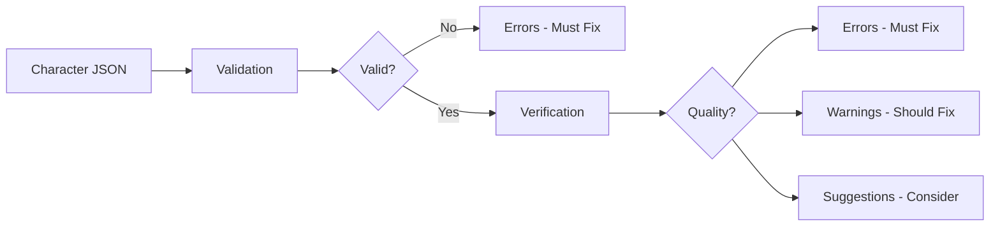
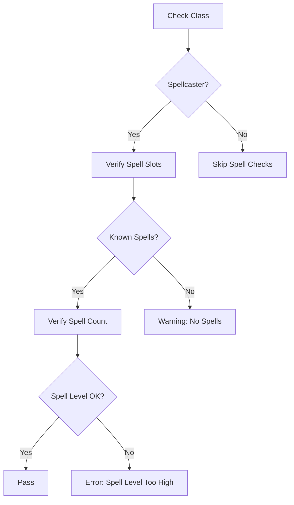
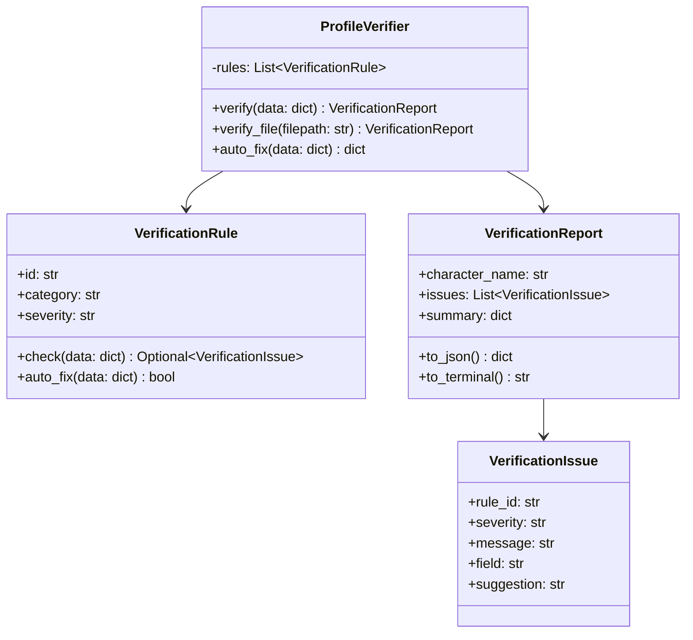
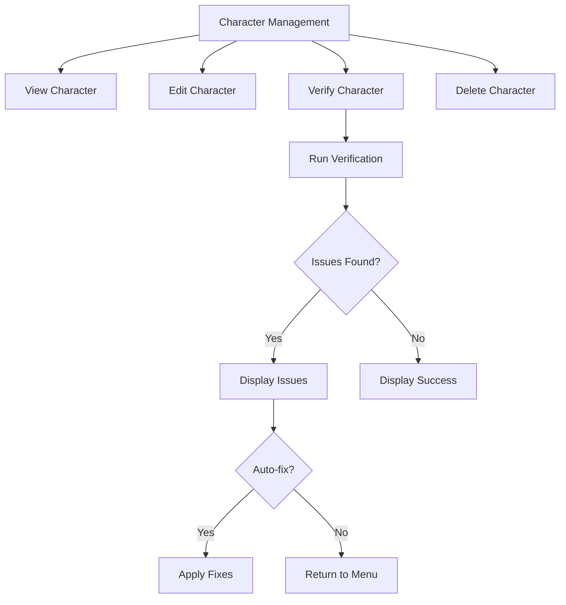
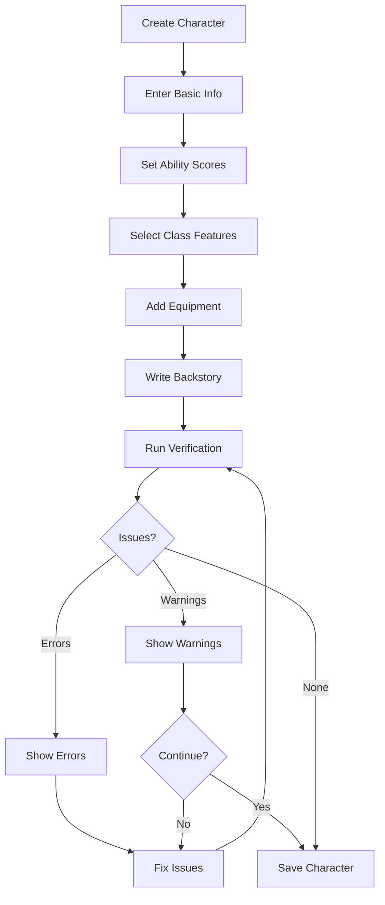
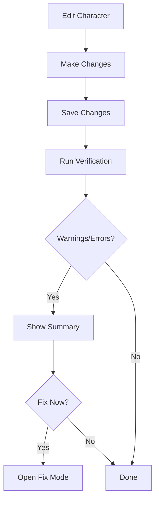

# Profile Verification Plan

## Overview

This document describes the design for a Profile Verification system that checks
character profiles for completeness, consistency, and best practices. Unlike
validation which ensures data integrity and correct JSON structure, verification
focuses on quality assurance and D&D 5e rules compliance.

## Problem Statement

### Current Issues

1. **Validation vs Verification Gap**: The existing
   [`character_validator.py`](src/validation/character_validator.py) only checks
   for required fields and basic types. It does not verify data quality or
   consistency.

2. **Inconsistent Character Data**: Characters may have:
   - Ability scores that do not match their listed modifiers
   - Proficiency bonuses inconsistent with their level
   - Spell slots that do not match their class and level
   - Missing optional but important fields like backstory or personality traits

3. **No D&D Rules Enforcement**: The system does not check if:
   - Class/race combinations are valid
   - Spell selections are appropriate for the class
   - Equipment load is reasonable
   - Ability scores are within valid ranges

4. **No Quality Guidance**: Users have no way to know if their character
   profiles follow best practices or need improvement.

### Evidence from Codebase

| Current State | Issue |
|---------------|-------|
| [`character_validator.py`](src/validation/character_validator.py) | Only checks required fields and types |
| [`dnd_rules.py`](src/utils/dnd_rules.py) | Has modifier/proficiency calculations but not used for verification |
| Character JSON files | May have inconsistent or incomplete data |
| No verification CLI | Users cannot check profile quality |

---

## Validation vs Verification

### Validation - Current System

Validation ensures data integrity:

- Required fields are present
- Fields have correct types
- JSON structure is valid
- Values are within basic constraints

Example from [`character_validator.py`](src/validation/character_validator.py:15-75):
```python
required_fields = {
    "name": str,
    "species": str,
    "dnd_class": str,
    "level": int,
    "ability_scores": dict,
    ...
}
```

### Verification - New System

Verification ensures data quality:

- Completeness: All recommended fields are populated
- Consistency: Related values match each other
- Rules Compliance: Data follows D&D 5e rules
- Best Practices: Character is well-designed



---

## Verification Categories

### 1. Completeness Checks

Check for missing or empty optional fields that enhance character quality.

| Field | Severity | Reason |
|-------|----------|--------|
| `backstory` | Warning | Essential for roleplay and AI consultations |
| `personality_traits` | Warning | Defines character behavior |
| `ideals` | Suggestion | Adds depth to character |
| `bonds` | Suggestion | Creates story hooks |
| `flaws` | Suggestion | Creates roleplay opportunities |
| `background` | Warning | PHB background for skills/equipment |
| `subclass` | Warning | Important for class features - required after level 3 |
| `feats` | Suggestion | Characters gain feats at certain levels |
| `relationships` | Suggestion | Enables relationship-aware AI responses |
| `ai_config` | Suggestion | Required for AI consultations |
| `nickname` | Suggestion | Alternative name for dialogue |

#### Completeness Verification Logic

```python
COMPLETENESS_CHECKS = {
    "backstory": {
        "severity": "warning",
        "condition": lambda data: bool(data.get("backstory", "").strip()),
        "message": "Missing backstory - essential for roleplay",
    },
    "personality_traits": {
        "severity": "warning",
        "condition": lambda data: len(data.get("personality_traits", [])) >= 2,
        "message": "Should have at least 2 personality traits",
    },
    "subclass": {
        "severity": "warning",
        "condition": lambda data: data.get("level", 1) < 3 or bool(data.get("subclass")),
        "message": "Subclass required for level 3+ characters",
    },
}
```

### 2. Consistency Checks

Verify that related values are mathematically consistent.

#### Ability Scores vs Modifiers

Characters may have pre-calculated skill modifiers. Verify these match ability
scores.

| Check | Formula | Example |
|-------|---------|---------|
| Skill modifier | ability_modifier + proficiency | Stealth = DEX mod + proficiency |
| Saving throw | ability_modifier + proficiency | DEX save = DEX mod + proficiency |
| Ability modifier | floor((score - 10) / 2) | DEX 16 = +3 modifier |

#### Level vs Proficiency Bonus

From [`dnd_rules.py`](src/utils/dnd_rules.py:50-64):

| Level Range | Proficiency Bonus |
|-------------|-------------------|
| 1-4 | +2 |
| 5-8 | +3 |
| 9-12 | +4 |
| 13-16 | +5 |
| 17-20 | +6 |

#### Hit Points Consistency

Verify HP matches class hit die and Constitution:

```
Expected HP = Base HP + (Level - 1) * Hit Die Average + CON modifier * Level
```

| Class | Hit Die | Average Roll |
|-------|---------|--------------|
| Barbarian | d12 | 7 |
| Fighter, Paladin, Ranger | d10 | 6 |
| Bard, Cleric, Druid, Monk, Rogue, Warlock | d8 | 5 |
| Sorcerer, Wizard | d6 | 4 |

#### Armor Class Consistency

Verify AC matches armor and Dexterity:

| Armor Type | AC Formula |
|------------|------------|
| No armor | 10 + DEX modifier |
| Light armor | Base AC + DEX modifier |
| Medium armor | Base AC + DEX modifier (max +2) |
| Heavy armor | Base AC (no DEX) |

### 3. Rules Compliance Checks

Verify character follows D&D 5e rules.

#### Ability Score Range

| Check | Valid Range | Severity |
|-------|-------------|----------|
| Ability score | 1-30 | Error |
| Typical PC score | 3-20 | Warning |
| Standard array | 15, 14, 13, 12, 10, 8 | Suggestion |

#### Level-Based Constraints

| Check | Rule | Severity |
|-------|------|----------|
| Level range | 1-20 | Error |
| Cantrips known | Class/level dependent | Warning |
| Spell slots | Class/level dependent | Warning |
| Feat count | Level/4 + 1 (or ASI) | Suggestion |
| ASI total | Level/4 * 2 | Suggestion |

#### Class-Specific Rules



#### Spell Slot Verification

| Class Type | Slot Progression |
|------------|------------------|
| Full caster | Wizard, Cleric, Druid, Bard, Sorcerer |
| Half caster | Paladin, Ranger (level/2 for slots) |
| Third caster | Eldritch Knight, Arcane Trickster |
| Warlock | Pact Magic (different progression) |

Example spell slots for level 10 full caster:
```json
{
  "1": 4,
  "2": 3,
  "3": 3,
  "4": 3,
  "5": 2
}
```

#### Equipment Weight Check

Verify carrying capacity is not exceeded:

```
Carrying Capacity = 15 * Strength score
```

### 4. Best Practices Checks

Quality recommendations for better character profiles.

#### Backstory Quality

| Check | Criteria | Severity |
|-------|----------|----------|
| Length | At least 100 characters | Suggestion |
| Content | Contains origin mention | Suggestion |
| Content | Contains motivation | Suggestion |

#### Personality Depth

| Check | Criteria | Severity |
|-------|----------|----------|
| Traits count | At least 2 traits | Warning |
| Traits count | At least 4 traits | Suggestion |
| Ideals count | At least 1 ideal | Suggestion |
| Bonds count | At least 1 bond | Suggestion |
| Flaws count | At least 1 flaw | Suggestion |

#### Relationship Quality

| Check | Criteria | Severity |
|-------|----------|----------|
| Relationships | At least 1 relationship | Suggestion |
| Description | Each relationship has description | Suggestion |

---

## Severity Levels

### Error - Must Fix

Issues that break game mechanics or data integrity:

- Ability scores outside valid range (1-30)
- Level outside valid range (1-20)
- Proficiency bonus does not match level
- Spell slots exceed class/level maximum
- Invalid class/race combination

### Warning - Should Fix

Issues that affect gameplay or character quality:

- Missing backstory
- Missing personality traits
- Missing subclass for level 3+
- Inconsistent HP calculation
- Missing background

### Suggestion - Consider

Recommendations for improvement:

- Short backstory
- Few personality traits
- Missing relationships
- Missing feats for eligible levels
- Suboptimal ability score distribution

---

## Architecture

### Module Structure

```
src/validation/
|-- character_validator.py      # Existing validation
|-- profile_verifier.py         # New verification module
|-- verification_rules.py       # Verification rule definitions
|-- verification_report.py      # Report generation
```

### Class Design



### VerificationRule Base Class

```python
from dataclasses import dataclass
from typing import Optional, Dict, Any, Callable

@dataclass
class VerificationIssue:
    """Represents a single verification issue."""
    rule_id: str
    severity: str  # "error", "warning", "suggestion"
    message: str
    field: str
    suggestion: str = ""
    auto_fixable: bool = False

class VerificationRule:
    """Base class for verification rules."""

    def __init__(
        self,
        rule_id: str,
        category: str,
        severity: str,
        check_func: Callable[[Dict[str, Any]], Optional[str]],
        message: str,
        auto_fix_func: Optional[Callable[[Dict[str, Any]], bool]] = None
    ):
        self.rule_id = rule_id
        self.category = category
        self.severity = severity
        self.check_func = check_func
        self.message = message
        self.auto_fix_func = auto_fix_func

    def check(self, data: Dict[str, Any]) -> Optional[VerificationIssue]:
        """Check if this rule passes. Returns issue if failed."""
        result = self.check_func(data)
        if result:
            return VerificationIssue(
                rule_id=self.rule_id,
                severity=self.severity,
                message=self.message.format(detail=result),
                field=result,
                auto_fixable=self.auto_fix_func is not None
            )
        return None
```

---

## CLI Integration

### Command Structure

```bash
# Verify single character
python -m src.validation.profile_verifier aragorn

# Verify all characters
python -m src.validation.profile_verifier --all

# Output as JSON
python -m src.validation.profile_verifier aragorn --format json

# Auto-fix issues
python -m src.validation.profile_verifier aragorn --auto-fix

# Filter by severity
python -m src.validation.profile_verifier aragorn --severity warning

# Verbose output
python -m src.validation.profile_verifier aragorn --verbose
```

### CLI Menu Integration

Add verification option to character management menu in
[`cli_character_manager.py`](src/cli/cli_character_manager.py):



### Terminal Output Format

Using [`terminal_display.py`](src/utils/terminal_display.py) for rich output:

```
================================================================================
Profile Verification: Aragorn
================================================================================

COMPLETENESS
  [OK] backstory: Present and substantial
  [OK] personality_traits: 4 traits defined
  [WARNING] subclass: Missing for level 10 character

CONSISTENCY
  [OK] proficiency_bonus: Correct (+4 for level 10)
  [ERROR] skills: Stealth modifier inconsistent
    Expected: +7 (DEX 16 = +3, proficiency +4)
    Actual: +9
  [OK] ability_scores: All within valid range

RULES COMPLIANCE
  [OK] spell_slots: Valid for Ranger level 10
  [OK] level: Within valid range (1-20)

BEST PRACTICES
  [SUGGESTION] backstory: Consider expanding backstory
    Current: 180 characters
    Recommended: 200+ characters for better AI consultations

================================================================================
Summary: 1 Error, 2 Warnings, 1 Suggestion
================================================================================
```

### JSON Output Format

```json
{
  "character": "Aragorn",
  "timestamp": "2026-02-14T08:00:00Z",
  "summary": {
    "errors": 1,
    "warnings": 2,
    "suggestions": 1,
    "total_checks": 25,
    "passed": 21
  },
  "issues": [
    {
      "rule_id": "skills_inconsistent",
      "category": "consistency",
      "severity": "error",
      "field": "skills.Stealth",
      "message": "Stealth modifier inconsistent with ability scores",
      "detail": "Expected +7, got +9",
      "suggestion": "Recalculate skill modifiers",
      "auto_fixable": true
    }
  ]
}
```

---

## Auto-Fix Capabilities

### Auto-Fixable Issues

| Issue | Auto-Fix Action |
|-------|-----------------|
| Proficiency bonus mismatch | Recalculate from level |
| Skill modifier mismatch | Recalculate from ability score |
| Missing proficiency bonus | Add calculated value |
| Empty spell_slots for caster | Add appropriate slots |
| Missing nickname field | Set to null |

### Auto-Fix Implementation

```python
def auto_fix_proficiency_bonus(data: Dict[str, Any]) -> bool:
    """Fix proficiency bonus based on level."""
    level = data.get("level", 1)
    correct_bonus = get_proficiency_bonus(level)
    current_bonus = data.get("proficiency_bonus")

    if current_bonus != correct_bonus:
        data["proficiency_bonus"] = correct_bonus
        return True
    return False

def auto_fix_skill_modifiers(data: Dict[str, Any]) -> bool:
    """Recalculate skill modifiers based on ability scores."""
    skills = data.get("skills", {})
    ability_scores = data.get("ability_scores", {})
    proficiency = data.get("proficiency_bonus", 2)

    # Skill to ability mapping
    skill_abilities = {
        "Athletics": "strength",
        "Stealth": "dexterity",
        "Sleight of Hand": "dexterity",
        "Arcana": "intelligence",
        "History": "intelligence",
        "Investigation": "intelligence",
        "Nature": "intelligence",
        "Religion": "intelligence",
        "Perception": "wisdom",
        "Insight": "wisdom",
        "Medicine": "wisdom",
        "Survival": "wisdom",
        "Persuasion": "charisma",
        "Intimidation": "charisma",
        "Deception": "charisma",
        "Performance": "charisma",
    }

    fixed = False
    for skill, modifier in skills.items():
        ability = skill_abilities.get(skill)
        if ability and ability in ability_scores:
            expected = calculate_modifier(ability_scores[ability])
            # Assume proficient if modifier > ability modifier
            if modifier > expected:
                expected += proficiency
            if modifier != expected:
                skills[skill] = expected
                fixed = True

    return fixed
```

### Auto-Fix Safety

- Always create backup before auto-fix
- Only fix issues marked as auto_fixable
- Prompt user before applying fixes
- Show diff of changes before saving

---

## Integration Points

### Character Creation Flow

Integrate verification into character creation:



### Character Editing Flow

Verify after edits:



### AI Consultation Integration

Before AI consultations, verify character:

```python
def prepare_for_consultation(character_name: str) -> CharacterProfile:
    """Load and verify character before consultation."""
    profile = load_character_profile(character_name)

    # Run verification
    report = ProfileVerifier().verify(profile)

    # Log warnings but continue
    if report.warnings:
        LOGGER.warning(
            "Character %s has verification warnings: %s",
            character_name,
            report.warnings
        )

    # Block on errors
    if report.errors:
        raise CharacterVerificationError(
            f"Character {character_name} has verification errors. "
            f"Please fix before consultation."
        )

    return profile
```

---

## Testing Requirements

### Test Categories

| Category | Description |
|----------|-------------|
| Unit Tests | Test individual verification rules |
| Integration Tests | Test full verification workflow |
| Edge Cases | Test boundary conditions |
| Auto-Fix Tests | Verify auto-fix correctness |

### Test Data

Use existing characters from `game_data/characters/`:

- [`aragorn.json`](game_data/characters/aragorn.json) - Ranger level 10
- [`frodo.json`](game_data/characters/frodo.json) - Rogue level 4
- [`gandalf.json`](game_data/characters/gandalf.json) - Wizard level 10

### Test Cases

```python
# tests/validation/test_profile_verifier.py

def test_proficiency_bonus_level_1():
    """Level 1 character should have +2 proficiency."""
    data = {"level": 1, "proficiency_bonus": 2}
    result = verify_proficiency_bonus(data)
    assert result is None  # No issue

def test_proficiency_bonus_level_5():
    """Level 5 character should have +3 proficiency."""
    data = {"level": 5, "proficiency_bonus": 2}
    result = verify_proficiency_bonus(data)
    assert result is not None  # Issue found
    assert result.severity == "error"

def test_missing_backstory():
    """Missing backstory should generate warning."""
    data = {"name": "Test", "backstory": ""}
    result = verify_backstory(data)
    assert result.severity == "warning"

def test_auto_fix_proficiency():
    """Auto-fix should correct proficiency bonus."""
    data = {"level": 10, "proficiency_bonus": 2}
    fixed = auto_fix_proficiency_bonus(data)
    assert fixed is True
    assert data["proficiency_bonus"] == 4
```

### Test File Structure

```
tests/validation/
|-- test_profile_verifier.py
|-- test_verification_rules.py
|-- test_verification_report.py
|-- test_auto_fix.py
|-- fixtures/
|   |-- incomplete_character.json
|   |-- inconsistent_character.json
|   |-- invalid_rules_character.json
```

---

## Implementation Phases

### Phase 1: Core Verification Module

**Goal**: Basic verification infrastructure

**Tasks**:
- Create `src/validation/profile_verifier.py`
- Create `src/validation/verification_rules.py`
- Define `VerificationRule` base class
- Define `VerificationIssue` dataclass
- Define `VerificationReport` class
- Implement completeness checks
- Implement consistency checks for proficiency bonus

**Files to Create**:
- `src/validation/profile_verifier.py`
- `src/validation/verification_rules.py`

**Files to Modify**:
- None (new module)

### Phase 2: Rules Compliance

**Goal**: D&D 5e rules verification

**Tasks**:
- Implement ability score range checks
- Implement spell slot verification
- Implement class-specific rules
- Add D&D 5e reference data (spell slots by class/level)
- Implement equipment weight checks

**Files to Create**:
- `src/validation/dnd_rules_data.py`

**Files to Modify**:
- `src/validation/verification_rules.py`

### Phase 3: CLI Integration

**Goal**: Command-line interface for verification

**Tasks**:
- Add CLI commands for verification
- Integrate with character management menu
- Add JSON output format
- Add terminal display formatting
- Add verbose mode

**Files to Modify**:
- `src/cli/cli_character_manager.py`
- `src/validation/profile_verifier.py`

### Phase 4: Auto-Fix and Integration

**Goal**: Auto-fix capabilities and workflow integration

**Tasks**:
- Implement auto-fix for proficiency bonus
- Implement auto-fix for skill modifiers
- Add backup before auto-fix
- Integrate with character creation flow
- Integrate with AI consultation

**Files to Modify**:
- `src/validation/profile_verifier.py`
- `src/characters/consultants/character_profile.py`
- `src/cli/cli_character_manager.py`

### Phase 5: Testing and Documentation

**Goal**: Comprehensive testing and documentation

**Tasks**:
- Write unit tests for all verification rules
- Write integration tests
- Write auto-fix tests
- Update user documentation
- Add verification guide to docs

**Files to Create**:
- `tests/validation/test_profile_verifier.py`
- `tests/validation/test_verification_rules.py`
- `tests/validation/test_auto_fix.py`
- `docs/PROFILE_VERIFICATION.md`

---

## Verification Rules Reference

### Completeness Rules

| Rule ID | Field | Severity | Auto-Fixable |
|---------|-------|----------|--------------|
| COMP001 | backstory | warning | No |
| COMP002 | personality_traits | warning | No |
| COMP003 | subclass (level 3+) | warning | No |
| COMP004 | background | warning | No |
| COMP005 | ideals | suggestion | No |
| COMP006 | bonds | suggestion | No |
| COMP007 | flaws | suggestion | No |
| COMP008 | feats | suggestion | No |
| COMP009 | relationships | suggestion | No |
| COMP010 | ai_config | suggestion | No |

### Consistency Rules

| Rule ID | Check | Severity | Auto-Fixable |
|---------|-------|----------|--------------|
| CONS001 | proficiency_bonus vs level | error | Yes |
| CONS002 | skill modifiers vs ability scores | error | Yes |
| CONS003 | HP vs level/CON | warning | Yes |
| CONS004 | AC vs armor/DEX | warning | Yes |
| CONS005 | spell_slots vs class/level | warning | Yes |

### Rules Compliance Rules

| Rule ID | Check | Severity | Auto-Fixable |
|---------|-------|----------|--------------|
| RULE001 | ability_scores range (1-30) | error | No |
| RULE002 | level range (1-20) | error | No |
| RULE003 | valid class | error | No |
| RULE004 | valid species | warning | No |
| RULE005 | spell level vs character level | error | No |
| RULE006 | cantrips known vs class/level | warning | No |

### Best Practices Rules

| Rule ID | Check | Severity | Auto-Fixable |
|---------|-------|----------|--------------|
| BEST001 | backstory length | suggestion | No |
| BEST002 | personality_traits count | suggestion | No |
| BEST003 | relationship descriptions | suggestion | No |
| BEST004 | ability score distribution | suggestion | No |
| BEST005 | primary ability for class | suggestion | No |

---

## Dependencies

### Existing Modules

| Module | Usage |
|--------|-------|
| [`src/utils/dnd_rules.py`](src/utils/dnd_rules.py) | Proficiency bonus, modifiers |
| [`src/utils/validation_helpers.py`](src/utils/validation_helpers.py) | Validation patterns |
| [`src/utils/terminal_display.py`](src/utils/terminal_display.py) | Rich output |
| [`src/validation/character_validator.py`](src/validation/character_validator.py) | Run validation first |
| [`src/utils/file_io.py`](src/utils/file_io.py) | File operations |

### New Data Requirements

| Data | Source |
|------|--------|
| Spell slot progression | PHB/Basic Rules |
| Class hit dice | PHB/Basic Rules |
| Skill-ability mapping | PHB/Basic Rules |
| Class primary abilities | PHB/Basic Rules |

---

## Success Criteria

1. **Completeness**: All verification categories implemented
2. **Accuracy**: Verification rules correctly identify issues
3. **Usability**: CLI provides clear, actionable feedback
4. **Safety**: Auto-fix creates backups and shows diffs
5. **Integration**: Works with existing character workflows
6. **Testing**: 100% test coverage for verification rules
7. **Documentation**: Users understand verification results

---

## Future Enhancements

1. **Custom Rules**: Allow users to define custom verification rules
2. **Campaign Rules**: Support campaign-specific house rules
3. **Batch Verification**: Verify all characters in a campaign
4. **Verification Profiles**: Different strictness levels
5. **AI-Assisted Fixes**: Use AI to suggest backstory improvements
