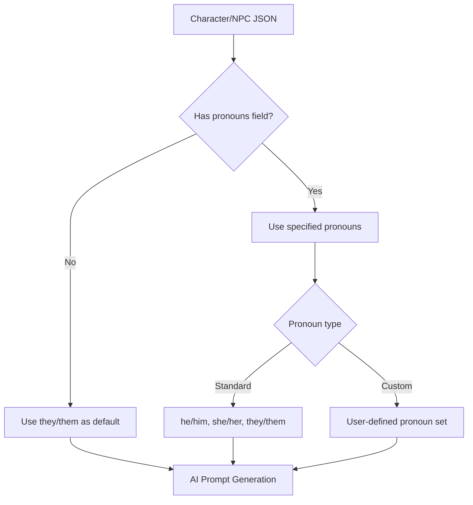

# Pronouns Field Support Plan

## Overview

This document describes the design for adding pronouns field support to the D&D Character Consultant System. The goal is to enable proper gender pronoun handling for characters and NPCs, improving narrative consistency and AI-generated content accuracy.

### Goals

1. Add optional `pronouns` field to character and NPC JSON schemas
2. Support common pronoun sets (he/him, she/her, they/them) and custom entries
3. Integrate pronouns into AI system prompts for accurate narrative generation
4. Provide backward compatibility for existing characters without pronouns
5. Update validation to support the new field

### Non-Goals

- Automatic pronoun inference from character name or appearance
- Complex pronoun grammar transformation engines
- Pronoun usage analytics or tracking

---

## Problem Statement

### Current Issues

1. **Missing Pronoun Data**: Characters and NPCs lack pronoun information, forcing AI to guess or use generic language.

2. **Inconsistent AI Narration**: Without explicit pronouns, AI-generated content may use incorrect pronouns or awkward phrasing to avoid them.

3. **Manual Workarounds**: Users must include pronouns in backstory or personality fields, which is inconsistent and not structured.

4. **NPC Consistency**: Auto-detected NPCs have no pronoun information, leading to generic or incorrect references.

### Evidence from Codebase

| File | Current State | Issue |
|------|---------------|-------|
| `aragorn.json` | No pronouns field | AI must infer from context |
| `frodo.json` | No pronouns field | Same issue |
| `gandalf.json` | No pronouns field | Same issue |
| `butterbur.json` | No pronouns field | NPC lacks pronoun data |
| `consultant_ai.py` | Builds prompts without pronouns | AI lacks pronoun context |
| `character_validator.py` | No pronoun validation | Cannot validate pronoun format |

---

## Proposed Solution

### High-Level Approach

1. **Add Optional Pronouns Field**: New `pronouns` field in character and NPC JSON schemas
2. **Default Handling**: Graceful fallback when pronouns are not specified
3. **AI Integration**: Include pronouns in system prompts for accurate generation
4. **Validation Support**: Validate pronoun field format without being restrictive
5. **Migration Path**: Optional script to add pronouns to existing characters

### Schema Design



---

## Implementation Details

### 1. JSON Schema Changes

#### Character JSON Schema

Add optional `pronouns` field to character files:

```json
{
  "name": "Aragorn",
  "pronouns": "he/him",
  "nickname": "Strider",
  "species": "Human",
  ...
}
```

#### NPC JSON Schema

Add optional `pronouns` field to NPC files:

```json
{
  "name": "Barliman Butterbur",
  "pronouns": "he/him",
  "role": "Innkeeper",
  ...
}
```

#### Pronoun Field Format

The `pronouns` field accepts:

| Format | Example | Description |
|--------|---------|-------------|
| Standard string | `"he/him"` | Common shorthand |
| Standard string | `"she/her"` | Common shorthand |
| Standard string | `"they/them"` | Common shorthand |
| Custom string | `"xe/xem"` | Neopronouns |
| Full object | See below | Complete pronoun set |

**Full Object Format** (optional, for advanced use):

```json
{
  "pronouns": {
    "subject": "they",
    "object": "them",
    "possessive_determiner": "their",
    "possessive_pronoun": "theirs",
    "reflexive": "themselves"
  }
}
```

### 2. CharacterIdentity Dataclass Changes

Update [`CharacterIdentity`](src/characters/consultants/character_profile.py:33) dataclass:

```python
@dataclass
class CharacterIdentity:
    """Basic character identity information."""

    name: str
    character_class: DnDClass
    nickname: Optional[str] = None
    level: int = 1
    species: str = "Human"
    lineage: Optional[str] = None
    subclass: Optional[str] = None
    pronouns: Optional[str] = None  # NEW FIELD
```

### 3. CharacterProfile Changes

Add property accessor for pronouns:

```python
@property
def pronouns(self) -> str:
    """Character pronouns, defaults to they/them."""
    return self.identity.pronouns or "they/them"
```

### 4. Validation Changes

Update [`character_validator.py`](src/validation/character_validator.py:1):

```python
# Add to optional_fields dict
optional_fields = {
    "nickname": (str, type(None)),
    "pronouns": (str, type(None)),  # NEW
}

def _validate_pronouns(data: Dict[str, Any], file_prefix: str) -> List[str]:
    """Validate pronouns field format if present."""
    errors = []
    if "pronouns" in data:
        pronouns = data["pronouns"]
        if pronouns is None:
            return errors  # None is valid (use default)
        if not isinstance(pronouns, (str, dict)):
            errors.append(
                f"{file_prefix}Field 'pronouns' should be str or dict, "
                f"got {type(pronouns).__name__}"
            )
        elif isinstance(pronouns, str) and not pronouns.strip():
            errors.append(f"{file_prefix}Field 'pronouns' cannot be empty string")
    return errors
```

### 5. NPC Validator Changes

Update [`npc_validator.py`](src/validation/npc_validator.py:1) with similar validation:

```python
# Add to optional fields
"pronouns": (str, type(None)),
```

### 6. AI Prompt Integration

Update [`consultant_ai.py`](src/characters/consultants/consultant_ai.py:55) to include pronouns:

```python
def build_character_system_prompt(self) -> str:
    """Build a system prompt that describes this character for AI roleplay."""
    prompt_parts = [
        f"You are {self.profile.name}, a {self.profile.character_class.value}"
        " in a D&D 5e campaign.",
        f"You are level {self.profile.level}.",
    ]

    # NEW: Add pronouns
    pronouns = self.profile.pronouns
    if pronouns:
        prompt_parts.append(f"Your pronouns are {pronouns}.")

    # ... rest of prompt building
```

### 7. NPC Auto-Detection Changes

Update [`npc_auto_detection.py`](src/npcs/npc_auto_detection.py:100) to include pronouns in generated NPCs:

```python
# Default NPC template
{
    "name": npc_name,
    "pronouns": None,  # NEW: Will default to they/them
    "faction": "neutral",
    ...
}
```

### 8. Display Integration

Update character listing in [`cli_character_manager.py`](src/cli/cli_character_manager.py:68):

```python
def list_characters(self):
    """List all characters."""
    # ... existing code ...
    for i, name in enumerate(characters, 1):
        profile = self.story_manager.get_character_profile(name)
        if profile:
            pronouns_display = f" [{profile.pronouns}]" if profile.pronouns else ""
            print(
                f"{i}. {name}{pronouns_display} "
                f"({profile.character_class.value} Level {profile.level})"
            )
```

---

## Default Pronoun Handling

### Standard Pronoun Sets

| Shorthand | Subject | Object | Possessive Det. | Possessive Pron. | Reflexive |
|-----------|---------|--------|-----------------|------------------|-----------|
| he/him | he | him | his | his | himself |
| she/her | she | her | her | hers | herself |
| they/them | they | them | their | theirs | themselves |

### Default Behavior

When `pronouns` field is `null` or missing:

1. **System Default**: Use `they/them` as the neutral default
2. **AI Prompts**: Do not include pronoun instruction, let AI use neutral language
3. **Display**: Do not show pronoun indicator in character lists

### Pronoun Helper Utility

Create a new utility module for pronoun handling:

```python
# src/utils/pronoun_utils.py

"""Pronoun handling utilities for characters and NPCs."""

from typing import Dict, Optional, Tuple

# Standard pronoun sets
PRONOUN_SETS: Dict[str, Dict[str, str]] = {
    "he/him": {
        "subject": "he",
        "object": "him",
        "possessive_determiner": "his",
        "possessive_pronoun": "his",
        "reflexive": "himself",
    },
    "she/her": {
        "subject": "she",
        "object": "her",
        "possessive_determiner": "her",
        "possessive_pronoun": "hers",
        "reflexive": "herself",
    },
    "they/them": {
        "subject": "they",
        "object": "them",
        "possessive_determiner": "their",
        "possessive_pronoun": "theirs",
        "reflexive": "themselves",
    },
}

DEFAULT_PRONOUNS = "they/them"


def parse_pronouns(pronouns: Optional[str]) -> Dict[str, str]:
    """Parse pronouns field into a complete pronoun set.

    Args:
        pronouns: Pronouns string (e.g., "he/him") or None

    Returns:
        Dictionary with subject, object, possessive_determiner,
        possessive_pronoun, and reflexive keys.
    """
    if pronouns is None:
        return PRONOUN_SETS[DEFAULT_PRONOUNS]

    pronouns_lower = pronouns.lower().strip()

    if pronouns_lower in PRONOUN_SETS:
        return PRONOUN_SETS[pronouns_lower]

    # Try to parse custom format "subject/object"
    if "/" in pronouns_lower:
        parts = pronouns_lower.split("/")
        if len(parts) >= 2:
            subject = parts[0].strip()
            obj = parts[1].strip()
            return {
                "subject": subject,
                "object": obj,
                "possessive_determiner": f"{subject}s",  # Guess
                "possessive_pronoun": f"{obj}s",  # Guess
                "reflexive": f"{obj}self",  # Guess
            }

    # Fallback to they/them
    return PRONOUN_SETS[DEFAULT_PRONOUNS]


def get_pronoun_display(pronouns: Optional[str]) -> str:
    """Get display string for pronouns.

    Args:
        pronouns: Pronouns string or None

    Returns:
        Display string (e.g., "he/him") or empty string if None.
    """
    if pronouns is None:
        return ""
    return pronouns.strip()


def validate_pronouns(pronouns: Optional[str]) -> Tuple[bool, str]:
    """Validate pronouns field format.

    Args:
        pronouns: Pronouns string or None

    Returns:
        Tuple of (is_valid, error_message).
        error_message is empty string if valid.
    """
    if pronouns is None:
        return True, ""

    if not isinstance(pronouns, str):
        return False, "Pronouns must be a string or null"

    pronouns_stripped = pronouns.strip()
    if not pronouns_stripped:
        return False, "Pronouns cannot be empty string"

    return True, ""
```

---

## Migration Strategy

### Phase 1: Schema Update

1. Update JSON schemas to accept optional `pronouns` field
2. Update validators to accept the new field
3. No breaking changes - field is optional

### Phase 2: Code Updates

1. Update `CharacterIdentity` dataclass
2. Update `CharacterProfile` loading and saving
3. Update AI prompt builders
4. Update CLI display

### Phase 3: Data Migration (Optional)

Create migration script for existing characters:

```python
# scripts/add_pronouns_to_characters.py

"""Optional migration script to add pronouns to existing characters."""

import json
from pathlib import Path

# Manual mapping for known characters
PRONOUN_MAPPING = {
    "Aragorn": "he/him",
    "Frodo Baggins": "he/him",
    "Gandalf the Grey": "he/him",
    "Barliman Butterbur": "he/him",
    # Add more as needed
}


def add_pronouns_to_character(filepath: Path, dry_run: bool = True) -> bool:
    """Add pronouns field to a character file.

    Args:
        filepath: Path to character JSON file
        dry_run: If True, only print changes without modifying files

    Returns:
        True if file was modified (or would be modified in dry_run).
    """
    with open(filepath, "r", encoding="utf-8") as f:
        data = json.load(f)

    name = data.get("name", "")
    if "pronouns" in data:
        print(f"  [SKIP] {name} already has pronouns: {data['pronouns']}")
        return False

    pronouns = PRONOUN_MAPPING.get(name)
    if not pronouns:
        print(f"  [SKIP] {name} not in mapping, skipping")
        return False

    if dry_run:
        print(f"  [WOULD ADD] {name}: {pronouns}")
    else:
        data["pronouns"] = pronouns
        with open(filepath, "w", encoding="utf-8") as f:
            json.dump(data, f, indent=2, ensure_ascii=False)
        print(f"  [ADDED] {name}: {pronouns}")

    return True


def main(dry_run: bool = True):
    """Run migration on all character files."""
    characters_dir = Path("game_data/characters")
    npcs_dir = Path("game_data/npcs")

    print("Adding pronouns to characters...")
    for filepath in characters_dir.glob("*.json"):
        if filepath.name.endswith(".example.json"):
            continue
        add_pronouns_to_character(filepath, dry_run)

    print("\nAdding pronouns to NPCs...")
    for filepath in npcs_dir.glob("*.json"):
        if filepath.name.endswith(".example.json"):
            continue
        add_pronouns_to_character(filepath, dry_run)


if __name__ == "__main__":
    import argparse

    parser = argparse.ArgumentParser(
        description="Add pronouns to character and NPC files"
    )
    parser.add_argument(
        "--write",
        action="store_true",
        help="Actually write changes (default is dry-run)",
    )
    args = parser.parse_args()

    main(dry_run=not args.write)
```

---

## Testing Requirements

### Unit Tests

Create test file: `tests/utils/test_pronoun_utils.py`

```python
"""Tests for pronoun utilities."""

import pytest
from src.utils.pronoun_utils import (
    parse_pronouns,
    get_pronoun_display,
    validate_pronouns,
    PRONOUN_SETS,
)


class TestParsePronouns:
    """Tests for parse_pronouns function."""

    def test_parse_he_him(self):
        """Test parsing he/him pronouns."""
        result = parse_pronouns("he/him")
        assert result == PRONOUN_SETS["he/him"]

    def test_parse_she_her(self):
        """Test parsing she/her pronouns."""
        result = parse_pronouns("she/her")
        assert result == PRONOUN_SETS["she/her"]

    def test_parse_they_them(self):
        """Test parsing they/them pronouns."""
        result = parse_pronouns("they/them")
        assert result == PRONOUN_SETS["they/them"]

    def test_parse_none_returns_default(self):
        """Test that None returns they/them default."""
        result = parse_pronouns(None)
        assert result == PRONOUN_SETS["they/them"]

    def test_parse_case_insensitive(self):
        """Test case-insensitive parsing."""
        result = parse_pronouns("HE/HIM")
        assert result == PRONOUN_SETS["he/him"]

    def test_parse_custom_format(self):
        """Test parsing custom pronoun format."""
        result = parse_pronouns("xe/xem")
        assert result["subject"] == "xe"
        assert result["object"] == "xem"


class TestGetPronounDisplay:
    """Tests for get_pronoun_display function."""

    def test_display_standard(self):
        """Test display of standard pronouns."""
        assert get_pronoun_display("he/him") == "he/him"

    def test_display_none(self):
        """Test display of None pronouns."""
        assert get_pronoun_display(None) == ""

    def test_display_preserves_case(self):
        """Test that display preserves original case."""
        assert get_pronoun_display("He/Him") == "He/Him"


class TestValidatePronouns:
    """Tests for validate_pronouns function."""

    def test_validate_standard(self):
        """Test validation of standard pronouns."""
        is_valid, error = validate_pronouns("he/him")
        assert is_valid
        assert error == ""

    def test_validate_none(self):
        """Test validation of None pronouns."""
        is_valid, error = validate_pronouns(None)
        assert is_valid
        assert error == ""

    def test_validate_empty_string(self):
        """Test validation of empty string."""
        is_valid, error = validate_pronouns("")
        assert not is_valid
        assert "empty" in error.lower()

    def test_validate_whitespace_only(self):
        """Test validation of whitespace-only string."""
        is_valid, error = validate_pronouns("   ")
        assert not is_valid
```

### Integration Tests

Create test file: `tests/characters/test_pronouns_integration.py`

```python
"""Integration tests for pronouns in character profiles."""

import pytest
from pathlib import Path
from src.characters.consultants.character_profile import CharacterProfile
from src.validation.character_validator import validate_character_json


class TestCharacterPronouns:
    """Tests for pronouns in character profiles."""

    def test_load_character_with_pronouns(self, tmp_path):
        """Test loading a character with pronouns field."""
        char_data = {
            "name": "Test Character",
            "pronouns": "they/them",
            "species": "Human",
            "dnd_class": "Fighter",
            "level": 1,
            "ability_scores": {
                "strength": 16,
                "dexterity": 14,
                "constitution": 15,
                "intelligence": 10,
                "wisdom": 12,
                "charisma": 11,
            },
            "equipment": {"weapons": [], "armor": [], "items": []},
            "known_spells": [],
            "relationships": {},
            "backstory": "A test character.",
        }

        char_file = tmp_path / "test_char.json"
        char_file.write_text(json.dumps(char_data))

        profile = CharacterProfile.load_from_file(str(char_file))
        assert profile.pronouns == "they/them"

    def test_load_character_without_pronouns(self, tmp_path):
        """Test loading a character without pronouns field."""
        char_data = {
            "name": "Test Character",
            "species": "Human",
            "dnd_class": "Fighter",
            "level": 1,
            "ability_scores": {
                "strength": 16,
                "dexterity": 14,
                "constitution": 15,
                "intelligence": 10,
                "wisdom": 12,
                "charisma": 11,
            },
            "equipment": {"weapons": [], "armor": [], "items": []},
            "known_spells": [],
            "relationships": {},
            "backstory": "A test character.",
        }

        char_file = tmp_path / "test_char.json"
        char_file.write_text(json.dumps(char_data))

        profile = CharacterProfile.load_from_file(str(char_file))
        assert profile.pronouns == "they/them"  # Default

    def test_validation_accepts_pronouns(self):
        """Test that validator accepts pronouns field."""
        data = {
            "name": "Test",
            "pronouns": "she/her",
            "species": "Human",
            "dnd_class": "Wizard",
            "level": 1,
            "ability_scores": {
                "strength": 10,
                "dexterity": 14,
                "constitution": 12,
                "intelligence": 16,
                "wisdom": 14,
                "charisma": 10,
            },
            "equipment": {"weapons": [], "armor": [], "items": []},
            "known_spells": [],
            "relationships": {},
            "backstory": "Test",
        }

        is_valid, errors = validate_character_json(data)
        assert is_valid
        assert not any("pronouns" in e.lower() for e in errors)
```

### Test Data Updates

Update example files to include pronouns:

- `game_data/characters/class.example.json` - Add `"pronouns": "they/them"`
- `game_data/npcs/npc.example.json` - Add `"pronouns": null`
- `game_data/npcs/npc_full_profile.example.json` - Add `"pronouns": null`

---

## Implementation Phases

### Phase 1: Core Schema and Validation

**Files to modify:**
- [`src/characters/consultants/character_profile.py`](src/characters/consultants/character_profile.py:1) - Add pronouns to CharacterIdentity
- [`src/validation/character_validator.py`](src/validation/character_validator.py:1) - Add pronoun validation
- [`src/validation/npc_validator.py`](src/validation/npc_validator.py:1) - Add pronoun validation for NPCs

**Deliverables:**
- CharacterIdentity dataclass with pronouns field
- Pronoun validation in both validators
- Backward compatibility maintained

### Phase 2: Utility Module

**Files to create:**
- `src/utils/pronoun_utils.py` - Pronoun handling utilities

**Deliverables:**
- `parse_pronouns()` function
- `get_pronoun_display()` function
- `validate_pronouns()` function
- Standard pronoun sets dictionary

### Phase 3: AI Integration

**Files to modify:**
- [`src/characters/consultants/consultant_ai.py`](src/characters/consultants/consultant_ai.py:55) - Include pronouns in system prompts
- [`src/npcs/npc_auto_detection.py`](src/npcs/npc_auto_detection.py:100) - Add pronouns to NPC templates

**Deliverables:**
- AI prompts include pronoun information
- Auto-detected NPCs have pronouns field

### Phase 4: Display and CLI

**Files to modify:**
- [`src/cli/cli_character_manager.py`](src/cli/cli_character_manager.py:68) - Show pronouns in character list
- [`src/cli/dnd_cli_helpers.py`](src/cli/dnd_cli_helpers.py:1) - Add pronouns to edit interface

**Deliverables:**
- Character list shows pronouns
- Edit profile allows pronoun modification

### Phase 5: Testing and Documentation

**Files to create:**
- `tests/utils/test_pronoun_utils.py` - Unit tests
- `tests/characters/test_pronouns_integration.py` - Integration tests

**Files to update:**
- `game_data/characters/class.example.json` - Add pronouns example
- `game_data/npcs/npc.example.json` - Add pronouns example
- `game_data/npcs/npc_full_profile.example.json` - Add pronouns example

**Deliverables:**
- Complete test coverage
- Updated example files
- All tests passing with 10.00/10 Pylint score

---

## Files Affected

### New Files

| File | Purpose |
|------|---------|
| `src/utils/pronoun_utils.py` | Pronoun handling utilities |
| `tests/utils/test_pronoun_utils.py` | Unit tests for pronoun utilities |
| `tests/characters/test_pronouns_integration.py` | Integration tests |
| `scripts/add_pronouns_to_characters.py` | Optional migration script |

### Modified Files

| File | Changes |
|------|---------|
| `src/characters/consultants/character_profile.py` | Add pronouns to CharacterIdentity, add property accessor |
| `src/validation/character_validator.py` | Add pronoun field validation |
| `src/validation/npc_validator.py` | Add pronoun field validation for NPCs |
| `src/characters/consultants/consultant_ai.py` | Include pronouns in system prompts |
| `src/npcs/npc_auto_detection.py` | Add pronouns to NPC templates |
| `src/cli/cli_character_manager.py` | Display pronouns in character list |
| `src/cli/dnd_cli_helpers.py` | Add pronouns to edit interface |
| `game_data/characters/class.example.json` | Add pronouns example |
| `game_data/npcs/npc.example.json` | Add pronouns example |
| `game_data/npcs/npc_full_profile.example.json` | Add pronouns example |

---

## Risks and Mitigations

### Risk: Breaking Existing Characters

**Mitigation:** The pronouns field is optional with a sensible default. Existing characters without the field will continue to work.

### Risk: Incorrect Pronoun Grammar

**Mitigation:** The utility module provides standard pronoun sets with correct forms. Custom pronouns are parsed but may require manual verification.

### Risk: AI Misuse of Pronouns

**Mitigation:** Clear instructions in system prompts. The AI is instructed to use the specified pronouns consistently.

### Risk: Validation Too Restrictive

**Mitigation:** Validation only checks for non-empty strings, allowing any custom pronoun format. Standard sets are recognized but not required.

---

## Success Criteria

1. **Schema Compatibility**: All existing character and NPC files load without modification
2. **Validation Passes**: New pronoun field validates correctly
3. **AI Integration**: Generated content uses correct pronouns
4. **Test Coverage**: All new code has tests with 100% coverage
5. **Pylint Score**: All new and modified files achieve 10.00/10 Pylint score
6. **Documentation**: Example files updated with pronouns field

---

## Appendix: Example Character with Pronouns

```json
{
  "name": "Aragorn",
  "pronouns": "he/him",
  "nickname": "Strider",
  "species": "Human",
  "lineage": null,
  "dnd_class": "Ranger",
  "subclass": "Hunter",
  "level": 10,
  "ability_scores": {
    "strength": 18,
    "dexterity": 16,
    "constitution": 16,
    "intelligence": 14,
    "wisdom": 15,
    "charisma": 16
  },
  "skills": {
    "Survival": 9,
    "Perception": 8,
    "Stealth": 7,
    "Athletics": 8,
    "Insight": 7,
    "Medicine": 6
  },
  "max_hit_points": 85,
  "armor_class": 17,
  "movement_speed": 35,
  "proficiency_bonus": 4,
  "equipment": {
    "weapons": ["Anduril", "Longbow", "Dagger"],
    "armor": ["Leather Armor", "Cloak of Elvenkind"],
    "items": ["Pipe", "Healing Herbs", "Elven Brooch"],
    "magic_items": ["Ring of Barahir"],
    "gold": 0
  },
  "spell_slots": {"1": 4, "2": 3, "3": 2},
  "known_spells": ["Hunters Mark", "Goodberry", "Pass without Trace"],
  "background": "Noble",
  "personality_traits": ["Stoic", "Wise", "Compassionate", "Wary of power"],
  "ideals": ["Protect the Free Peoples of Middle-earth", "Fulfill his destiny as king"],
  "bonds": ["Defend his friends", "Unite Gondor and Arnor"],
  "flaws": ["Fear of failing his ancestors", "Temptation of the Ring", "Isolation"],
  "backstory": "Heir of Isildur, raised in Rivendell, hidden from Saurons gaze.",
  "feats": ["Alert", "Skilled", "Resilient"],
  "magic_items": ["Ring of Barahir"],
  "class_abilities": ["Favored Enemy: Orcs", "Natural Explorer", "Primeval Awareness"],
  "specialized_abilities": ["Leadership", "Tracking"],
  "major_plot_actions": ["Led the Fellowship", "Healed Faramir", "Claimed the throne"],
  "relationships": {
    "Arwen": "Beloved",
    "Gandalf": "Mentor and friend",
    "Legolas": "Trusted companion",
    "Gimli": "Trusted companion",
    "Boromir": "Comrade, wary respect",
    "Frodo": "Protector"
  },
  "ai_config": {
    "enabled": true,
    "temperature": 0.5,
    "max_tokens": 1000,
    "system_prompt": "You are Aragorn, a stoic and wise ranger, heir to the throne of Gondor. Your pronouns are he/him. Speak with measured confidence, always considering the safety of your companions and the fate of Middle-earth."
  }
}
```

---

## Appendix: Example NPC with Pronouns

```json
{
  "profile_type": "simplified",
  "faction": "ally",
  "name": "Barliman Butterbur",
  "pronouns": "he/him",
  "nickname": null,
  "role": "Innkeeper",
  "species": "Human",
  "lineage": "",
  "personality": "Hospitable, nervous, talkative, well-meaning, forgetful",
  "relationships": {
    "Aragorn": "Respects Strider, but is wary of his mysterious nature.",
    "Local Patrons": "Friendly and familiar with most regulars.",
    "Gandalf": "Finds him mysterious and intimidating"
  },
  "key_traits": ["Hospitable", "Forgetful", "Talkative", "Nervous"],
  "abilities": ["Insight", "Persuasion", "Deception", "Perception"],
  "recurring": true,
  "notes": "Runs The Prancing Pony in Bree.",
  "ai_config": {
    "enabled": true,
    "model": "llama3.1:8b",
    "base_url": "http://localhost:11434/v1",
    "api_key": "ollama",
    "temperature": 0.7,
    "max_tokens": 600,
    "system_prompt": "You are Barliman Butterbur, a portly, friendly, and somewhat forgetful innkeeper of The Prancing Pony in Bree. Your pronouns are he/him. Speak in a nervous but well-meaning tone."
  }
}
```
