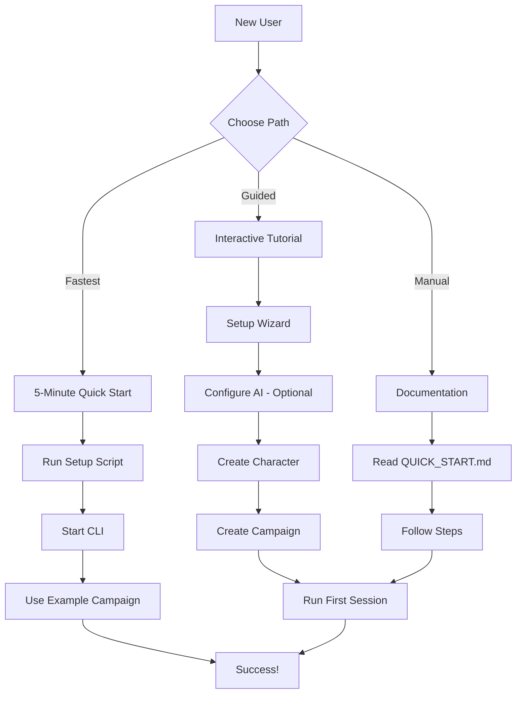
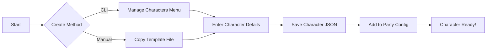
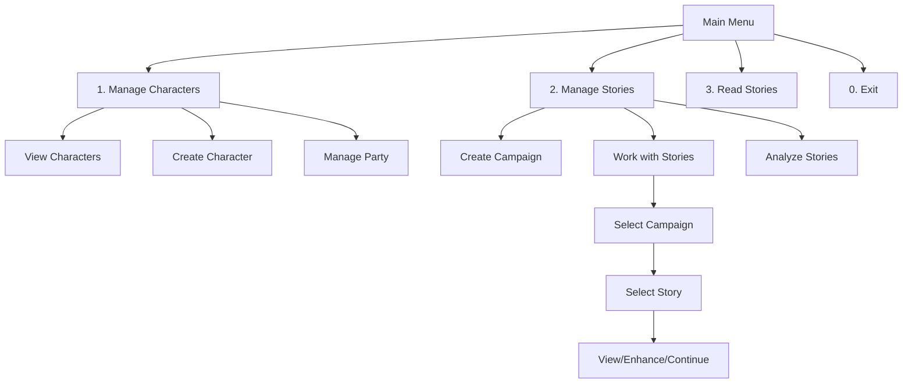
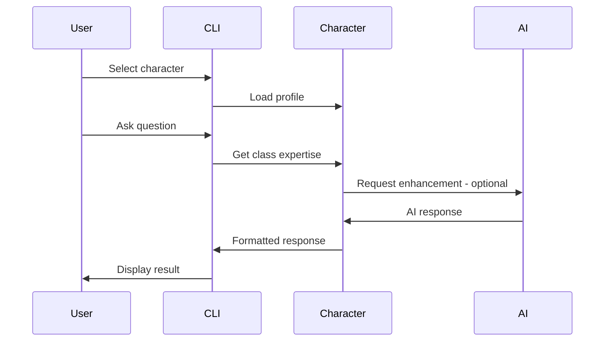
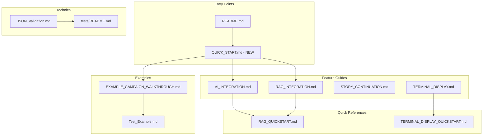

# Quick Start Guide Design Plan

## Overview

This document describes the design for a comprehensive Quick Start Guide for the D&D Character Consultant System. The goal is to provide new users with a streamlined, step-by-step onboarding experience that gets them from installation to running their first session in minimal time.

### Target Audience

| User Type | Experience Level | Primary Need |
|-----------|------------------|--------------|
| New DM | New to D&D CCS | Guided setup, first character, first session |
| Experienced DM | Familiar with D&D, new to CCS | Quick setup, feature overview |
| Developer | Technical background | Installation, configuration, integration |
| Casual User | Non-technical | Simple, visual, minimal configuration |

### Goals

1. **Reduce Time to Value** - Get users running their first session within 15 minutes
2. **Minimize Friction** - Clear, simple steps with no ambiguity
3. **Provide Context** - Explain what each step accomplishes
4. **Enable Self-Service** - Users can troubleshoot without external help
5. **Integrate with Existing Docs** - Link to detailed documentation when needed

---

## Problem Statement

### Current Issues

1. **Fragmented Documentation**: Setup information is spread across multiple files:
   - [`README.md`](README.md) - Brief 4-step quick start
   - [`docs/AI_INTEGRATION.md`](docs/AI_INTEGRATION.md) - Detailed AI setup
   - [`docs/RAG_QUICKSTART.md`](docs/RAG_QUICKSTART.md) - RAG setup
   - [`docs/EXAMPLE_CAMPAIGN_WALKTHROUGH.md`](docs/EXAMPLE_CAMPAIGN_WALKTHROUGH.md) - Campaign walkthrough

2. **No Single Entry Point**: New users must navigate multiple documents to understand the full setup process.

3. **Missing First-Run Experience**: No guided onboarding when the system is first run.

4. **No Character Creation Guide**: No step-by-step guide for creating a new character.

5. **No Troubleshooting Section**: Common issues are not documented in a single place.

### Evidence from Codebase

| Current State | Limitation |
|---------------|------------|
| README Quick Start | Only 4 steps, no character creation |
| No first-run detection | Cannot offer guided setup |
| Setup script minimal | Only creates VSCode config |
| No interactive tutorial | Users learn by exploration |

---

## Proposed Solution

### High-Level Approach

Create a multi-format Quick Start Guide that provides:

1. **Single Markdown Document** - Comprehensive quick start guide in `docs/QUICK_START.md`
2. **Interactive CLI Guide** - Built-in tutorial mode accessible from main menu
3. **Visual Workflow Diagrams** - Mermaid diagrams showing key workflows
4. **Troubleshooting Section** - Common issues and solutions

### Quick Start Architecture



---

## Content Structure

### 1. Document Outline for `docs/QUICK_START.md`

```markdown
# Quick Start Guide

## Prerequisites
- Python 3.8+ installed
- Git installed - optional
- VSCode installed - optional but recommended

## Installation
### Step 1: Get the Code
### Step 2: Install Dependencies
### Step 3: Run Setup

## First Run Experience
### Option A: 5-Minute Quick Start - Use Example Campaign
### Option B: Guided Setup - Create Your Own

## Creating Your First Character
### Using the CLI
### Manual JSON Creation
### Character Template Reference

## Running Your First Session
### Starting the CLI
### Menu Navigation
### Story Creation Workflow
### Session Results

## Common Workflows
### Character Consultation
### Story Continuation
### Combat Narration
### NPC Management

## Next Steps
### AI Integration
### RAG System
### Advanced Features

## Troubleshooting
### Common Issues
### Error Messages
### Getting Help
```

### 2. Prerequisites Section

**Content to include:**

| Prerequisite | How to Verify | Minimum Version |
|--------------|---------------|-----------------|
| Python | `python --version` | 3.8 |
| pip | `pip --version` | Included with Python |
| Git | `git --version` | Any - optional |
| VSCode | `code --version` | Any - optional |

**Platform-specific notes:**
- Windows: Recommend PowerShell or Windows Terminal
- macOS: Terminal.app or iTerm2
- Linux: Any terminal emulator

### 3. Installation Steps

**Simplified Installation:**

```powershell
# Step 1: Navigate to project directory
cd path/to/new-beginnings

# Step 2: Create virtual environment - recommended
python -m venv .venv
.venv\Scripts\activate

# Step 3: Install dependencies
pip install -r requirements.txt

# Step 4: Run setup
python setup.py
```

**Dependency Explanation:**

| Package | Purpose | Required For |
|---------|---------|--------------|
| openai | AI integration | AI features |
| python-dotenv | Environment config | AI/RAG features |
| rich | Terminal formatting | All features |
| pyttsx3 | Text-to-speech | TTS narration |
| beautifulsoup4 | Web scraping | RAG features |

### 4. First Run Experience

**Option A: 5-Minute Quick Start**

For users who want to see the system in action immediately:

1. Run `python dnd_consultant.py`
2. Select "Manage Stories" > "Work with Story Series"
3. Select "Example_Campaign"
4. Explore existing stories and generated content

**Option B: Guided Setup**

For users who want to create their own content:

1. Configure AI - optional but recommended
2. Create a character
3. Create a campaign
4. Run a session

### 5. Creating Your First Character

**Workflow Diagram:**



**Character Creation Steps:**

1. **Copy Template:**
   ```powershell
   copy game_data\characters\class.example.json game_data\characters\my_character.json
   ```

2. **Edit Required Fields:**
   - `name` - Character name
   - `dnd_class` - D&D class - Fighter, Wizard, etc.
   - `race` - Character race
   - `level` - Character level
   - `background` - Character background
   - `ability_scores` - STR, DEX, CON, INT, WIS, CHA

3. **Add to Party:**
   Edit `game_data/campaigns/Your_Campaign/current_party.json`

**Character JSON Template:**

```json
{
  "name": "Your Character Name",
  "dnd_class": "Fighter",
  "race": "Human",
  "level": 5,
  "background": "Soldier",
  "ability_scores": {
    "strength": 16,
    "dexterity": 12,
    "constitution": 14,
    "intelligence": 10,
    "wisdom": 10,
    "charisma": 13
  },
  "personality_traits": [
    "Trait 1",
    "Trait 2"
  ],
  "ideals": "Your ideals",
  "bonds": "Your bonds",
  "flaws": "Your flaws"
}
```

### 6. Running Your First Session

**Menu Navigation Diagram:**



**Session Workflow:**

1. **Start CLI:**
   ```powershell
   python dnd_consultant.py
   ```

2. **Create Campaign:**
   - Menu: 2 > 1 > Enter campaign name
   - Creates folder in `game_data/campaigns/`

3. **Create Story:**
   - Menu: 2 > 2 > Select campaign > 1
   - Write narrative in markdown

4. **Generate Content:**
   - AI continuation - optional
   - Character development analysis
   - Session results
   - Story hooks

### 7. Common Workflows

**Character Consultation:**



**Story Continuation:**

1. Select campaign and story
2. Choose continuation type:
   - Combat/Action scene
   - Exploration/Social/Roleplay scene
3. Enter prompt describing what happens next
4. AI generates continuation - if configured
5. Review and edit generated content

**Combat Narration:**

1. Paste combat log from Fantasy Grounds Unity - optional
2. Or describe combat in plain text
3. Select narrative style:
   - Heroic
   - Gritty
   - Epic
4. AI generates narrative combat description

### 8. Troubleshooting Section

**Common Issues Table:**

| Issue | Cause | Solution |
|-------|-------|----------|
| Module not found | Missing dependencies | `pip install -r requirements.txt` |
| AI not working | Missing .env file | Copy `.env.example` to `.env` |
| Character not loading | Invalid JSON | Validate JSON syntax |
| No characters found | Wrong directory | Run from project root |
| Party config error | Missing file | Create `current_party.json` |
| Story not generating | AI not configured | Configure AI or use templates |

**Error Messages Reference:**

| Error Message | Meaning | Action |
|---------------|---------|--------|
| `[ERROR] 'game_data/characters' directory not found!` | Wrong working directory | Run from project root |
| `[WARNING] AI initialization failed` | Missing or invalid .env | Check AI configuration |
| `[ERROR] Character file not found` | Invalid character name | Check spelling and file exists |

---

## Format Options

### Option 1: Single Markdown File - Recommended

**Pros:**
- Easy to maintain
- Version controlled
- Works in VSCode preview
- Can be converted to other formats

**Cons:**
- No interactivity
- Limited visual elements

**Implementation:**
- Create `docs/QUICK_START.md`
- Link from README.md main Quick Start section
- Include in VSCode welcome overlay

### Option 2: Interactive CLI Guide

**Pros:**
- Guided experience
- Context-aware help
- Can run actual setup steps

**Cons:**
- More complex to implement
- Requires code changes
- Harder to maintain

**Implementation:**
- Add "Tutorial" option to main menu
- Create `src/cli/tutorial.py`
- Step-by-step guided setup

### Option 3: Web-Based Documentation

**Pros:**
- Rich media support
- Searchable
- Professional appearance

**Cons:**
- Requires hosting
- Separate from codebase
- Sync issues

**Implementation:**
- Use GitHub Pages
- Convert markdown to HTML
- Host on repository wiki

### Recommendation

**Primary: Single Markdown File** with **Supplementary CLI Tutorial**

The markdown file provides comprehensive documentation, while a CLI tutorial offers hands-on learning. This combination provides the best of both worlds without significant complexity.

---

## Integration with Existing Documentation

### Documentation Map



### Cross-Reference Strategy

| Document | Links To | Purpose |
|----------|----------|---------|
| README.md | QUICK_START.md | Primary entry point |
| QUICK_START.md | AI_INTEGRATION.md | AI setup details |
| QUICK_START.md | RAG_QUICKSTART.md | RAG setup details |
| QUICK_START.md | EXAMPLE_CAMPAIGN_WALKTHROUGH.md | Hands-on tutorial |
| QUICK_START.md | JSON_Validation.md | Data validation |

### Avoiding Duplication

**Content in QUICK_START.md:**
- High-level steps with minimal explanation
- Links to detailed documentation
- Essential examples only

**Content in Detailed Docs:**
- Comprehensive explanations
- All configuration options
- Advanced use cases

---

## Code Changes Needed

### 1. First-Run Detection Enhancement

**File:** `src/cli/setup.py`

**Current State:** Basic setup that creates VSCode config

**Proposed Changes:**
- Add first-run detection
- Offer guided setup option
- Create default party configuration

**Implementation Notes:**
- See [`plans/interactive_setup_plan.md`](plans/interactive_setup_plan.md) for detailed design
- Can be implemented independently of this guide

### 2. Tutorial Mode

**New File:** `src/cli/tutorial.py`

**Purpose:** Interactive guided tutorial

**Features:**
- Step-by-step character creation
- Campaign creation walkthrough
- Sample session generation

**Implementation Notes:**
- Optional enhancement
- Can be added after documentation is complete

### 3. Help Command Enhancement

**File:** `src/cli/dnd_consultant.py`

**Current State:** Basic menu with no help

**Proposed Changes:**
- Add `--help-quickstart` flag
- Display quick start instructions
- Link to documentation

### 4. Error Message Improvements

**Files:** Various CLI files

**Current State:** Basic error messages

**Proposed Changes:**
- Add actionable guidance to errors
- Include documentation links
- Suggest common solutions

---

## Visual Aids

### 1. Workflow Diagrams

**Already included in this plan:**
- Quick Start Architecture
- Character Creation Workflow
- Menu Navigation Diagram
- Documentation Map

**To be created for QUICK_START.md:**
- Installation flowchart
- Session workflow diagram
- Troubleshooting decision tree

### 2. Screenshots Placeholders

**Recommended screenshots:**
- Main menu display
- Character creation form
- Story editor view
- Generated content example
- VSCode integration

**Format:**
```markdown

*The main menu provides access to all system features*
```

### 3. Code Examples

**Include syntax-highlighted examples for:**
- Character JSON template
- Party configuration
- .env file setup
- CLI commands
- Menu navigation sequences

---

## Implementation Phases

### Phase 1: Documentation Only

**Deliverables:**
- [ ] Create `docs/QUICK_START.md`
- [ ] Update README.md to link to quick start
- [ ] Add cross-references to existing docs
- [ ] Create troubleshooting section

**Dependencies:** None

**Testing:**
- Have a new user follow the guide
- Verify all links work
- Test all commands

### Phase 2: CLI Enhancements

**Deliverables:**
- [ ] Add first-run detection
- [ ] Create guided setup option
- [ ] Enhance error messages
- [ ] Add `--help-quickstart` flag

**Dependencies:** Phase 1 complete

**Testing:**
- Test first-run detection
- Verify guided setup flow
- Test error message improvements

### Phase 3: Interactive Tutorial - Optional

**Deliverables:**
- [ ] Create `src/cli/tutorial.py`
- [ ] Add tutorial option to main menu
- [ ] Create step-by-step guided experience
- [ ] Add progress tracking

**Dependencies:** Phase 2 complete

**Testing:**
- Complete tutorial from start to finish
- Test all tutorial paths
- Verify progress tracking

---

## Success Metrics

### Quantitative

| Metric | Target | Measurement |
|--------|--------|-------------|
| Time to first session | < 15 minutes | User testing |
| Setup completion rate | > 90% | Analytics - if implemented |
| Documentation coverage | 100% of features | Audit |
| Error recovery rate | > 80% | User testing |

### Qualitative

| Metric | Target | Measurement |
|--------|--------|-------------|
| User satisfaction | Positive feedback | Surveys |
| Documentation clarity | Easy to follow | User testing |
| Error message helpfulness | Actionable | User testing |

---

## Appendix A: QUICK_START.md Template

```markdown
# Quick Start Guide

Welcome to the D&D Character Consultant System! This guide will get you up and
running in minutes.

## Prerequisites

Before starting, ensure you have:

- Python 3.8 or higher
- A terminal or command prompt
- Optional: VSCode for the best experience

## Installation

### Step 1: Install Dependencies

```powershell
pip install -r requirements.txt
```

### Step 2: Run Setup

```powershell
python setup.py
```

This creates VSCode configuration and verifies your installation.

## Quick Start Options

### Option A: Explore the Example Campaign - 5 Minutes

1. Run the consultant:
   ```powershell
   python dnd_consultant.py
   ```

2. Select **2. Manage Stories** > **2. Work with Story Series**

3. Select **Example_Campaign**

4. Explore the pre-built stories and generated content

### Option B: Create Your Own Campaign - 15 Minutes

Follow the steps below to create your first character and campaign.

## Creating Your First Character

### Step 1: Copy the Template

```powershell
copy game_data\characters\class.example.json game_data\characters\my_character.json
```

### Step 2: Edit Your Character

Open `game_data/characters/my_character.json` and fill in:

- `name` - Your character's name
- `dnd_class` - Their class - Fighter, Wizard, Rogue, etc.
- `race` - Their race
- `level` - Starting level
- `ability_scores` - Their six ability scores

### Step 3: Add to Party

Edit `game_data/campaigns/Your_Campaign/current_party.json`:

```json
{
  "party_members": ["My Character"],
  "last_updated": "2026-01-15T12:00:00"
}
```

## Running Your First Session

### Step 1: Start the CLI

```powershell
python dnd_consultant.py
```

### Step 2: Create a Campaign

1. Select **2. Manage Stories**
2. Select **1. Create New Campaign**
3. Enter a campaign name ending in _Campaign, _Quest, or _Adventure

### Step 3: Create a Story

1. Select **2. Work with Story Series**
2. Select your campaign
3. Select **1. Add New Story**
4. Write your narrative

### Step 4: Generate Content

After creating a story, the system automatically generates:

- Character development analysis
- Session results
- Story hooks for future sessions

## Next Steps

- [AI Integration](AI_INTEGRATION.md) - Add AI-powered features
- [RAG Quick Start](RAG_QUICKSTART.md) - Enable wiki integration
- [Example Walkthrough](EXAMPLE_CAMPAIGN_WALKTHROUGH.md) - Detailed tutorial

## Troubleshooting

### Common Issues

**Module not found error:**
```powershell
pip install -r requirements.txt
```

**AI not working:**
1. Copy `.env.example` to `.env`
2. Configure your AI provider
3. See [AI Integration](AI_INTEGRATION.md) for details

**Character not loading:**
- Check JSON syntax is valid
- Verify filename matches character name
- Ensure file is in `game_data/characters/`

### Getting Help

- Check [JSON Validation](JSON_Validation.md) for data issues
- Review [Test Examples](Test_Example.md) for usage patterns
- Consult [README.md](../README.md) for system overview
```

---

## Appendix B: Existing Documentation Analysis

### Current Documentation Assets

| Document | Purpose | Audience | Quality |
|----------|---------|----------|---------|
| README.md | System overview | All | Comprehensive |
| AI_INTEGRATION.md | AI setup | Technical | Detailed |
| RAG_INTEGRATION.md | RAG system | Technical | Detailed |
| RAG_QUICKSTART.md | RAG quick setup | All | Brief |
| EXAMPLE_CAMPAIGN_WALKTHROUGH.md | Tutorial | New users | Step-by-step |
| Test_Example.md | Usage examples | All | Examples |
| JSON_Validation.md | Data validation | Technical | Reference |
| TERMINAL_DISPLAY.md | Display features | All | Feature guide |
| TERMINAL_DISPLAY_QUICKSTART.md | Display quick setup | All | Brief |
| STORY_CONTINUATION.md | Story features | All | Feature guide |

### Gaps Identified

| Gap | Current State | Needed |
|-----|---------------|--------|
| Single entry point | Multiple docs | One quick start |
| Character creation guide | Template only | Step-by-step guide |
| First-run experience | None | Guided setup |
| Troubleshooting | Scattered | Consolidated section |
| Visual aids | Text only | Diagrams, screenshots |

---

## Appendix C: Related Plans

This plan coordinates with:

| Plan | Relationship |
|------|--------------|
| [Interactive Setup Plan](interactive_setup_plan.md) | CLI tutorial implementation |
| [Error Handling Plan](error_handling_plan.md) | Error message improvements |
| [CLI Enhancements Plan](cli_enhancements_plan.md) | Menu and navigation improvements |
| [Configuration System Plan](configuration_system_plan.md) | Configuration management |

---

## Conclusion

The Quick Start Guide design provides a comprehensive approach to improving the new user experience. By creating a single, well-organized document with clear steps, visual aids, and troubleshooting guidance, users can quickly become productive with the D&D Character Consultant System.

The phased implementation approach allows for incremental improvements, starting with documentation and optionally progressing to interactive CLI features. This ensures immediate value while leaving room for future enhancements.
