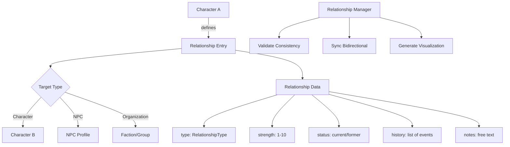

# Character Relationship Mapping Plan

## Overview

This document describes the design for a comprehensive relationship tracking and
visualization system for characters and NPCs. The goal is to enable rich
relationship data storage, analysis, and visualization to support narrative
generation and campaign management.

## Problem Statement

### Current Issues

1. **Basic Relationship Storage**: The current `relationships` field is a simple
   string-to-string dictionary, lacking nuance for complex relationships.

2. **No Relationship History**: Relationships are static snapshots with no
   tracking of how they evolved over time.

3. **No Bidirectional Consistency**: Relationships defined on one character
   may not have corresponding entries on related characters.

4. **No Visualization**: No way to generate visual relationship maps for
   the DM or players.

5. **Limited Story Integration**: Story analysis cannot leverage relationship
   data for narrative suggestions.

### Evidence from Codebase

| File | Current Implementation | Limitation |
|------|----------------------|------------|
| `aragorn.json` | `"relationships": {"Arwen": "Beloved"}` | Simple string value |
| `character_validator.py` | Validates string keys/values only | No structure |
| `story_consistency_analyzer.py` | No relationship checking | Missing feature |
| No visualization module | N/A | Cannot generate maps |

---

## Proposed Solution

### High-Level Approach

1. **Structured Relationship Schema**: Replace simple strings with rich objects
2. **Relationship Types**: Define taxonomy of relationship categories
3. **Bidirectional Sync**: Ensure relationships are reflected on both parties
4. **Visualization Export**: Generate Graphviz/DOT format for rendering
5. **Story Integration**: Use relationships in narrative generation

### Relationship Architecture



---

## Implementation Details

### 1. Relationship Type Taxonomy

Define `src/characters/relationship_types.py`:

```python
"""Relationship type definitions for D&D characters."""

from enum import Enum
from typing import Dict, List


class RelationshipType(Enum):
    """Categories of relationships between characters."""

    # Family relationships
    FAMILY_CLOSE = "family_close"           # Parent, sibling, child
    FAMILY_DISTANT = "family_distant"       # Cousin, in-law
    FAMILY_ESTRANGED = "family_estranged"   # Disowned, exiled

    # Romantic relationships
    ROMANTIC_PARTNER = "romantic_partner"   # Current partner
    ROMANTIC_FORMER = "romantic_former"     # Ex-partner
    ROMANTIC_INTEREST = "romantic_interest" # Crush, attraction

    # Friendship
    FRIEND_CLOSE = "friend_close"           # Best friend
    FRIEND = "friend"                       # Regular friend
    ACQUAINTANCE = "acquaintance"           # Casual contact

    # Professional
    ALLY = "ally"                           # Political/military ally
    COLLEAGUE = "colleague"                 # Work relationship
    MENTOR = "mentor"                       # Teacher/student
    STUDENT = "student"                     # Reverse of mentor

    # Antagonistic
    RIVAL = "rival"                         # Friendly competition
    ENEMY = "enemy"                         # Active hostility
    NEMESIS = "nemesis"                     # Archenemy

    # Social hierarchy
    LORD = "lord"                           # Feudal superior
    VASSAL = "vassal"                       # Feudal subordinate
    EMPLOYER = "employer"                   # Employment
    EMPLOYEE = "employee"                   # Employed by

    # Other
    DEBTOR = "debtor"                       # Owes something
    CREDITOR = "creditor"                   # Owed something
    UNKNOWN = "unknown"                     # Relationship exists but undefined


# Mapping of relationship types to their inverse
RELATIONSHIP_INVERSES: Dict[RelationshipType, RelationshipType] = {
    RelationshipType.MENTOR: RelationshipType.STUDENT,
    RelationshipType.STUDENT: RelationshipType.MENTOR,
    RelationshipType.LORD: RelationshipType.VASSAL,
    RelationshipType.VASSAL: RelationshipType.LORD,
    RelationshipType.EMPLOYER: RelationshipType.EMPLOYEE,
    RelationshipType.EMPLOYEE: RelationshipType.EMPLOYER,
    RelationshipType.DEBTOR: RelationshipType.CREDITOR,
    RelationshipType.CREDITOR: RelationshipType.DEBTOR,
    RelationshipType.FRIEND_CLOSE: RelationshipType.FRIEND_CLOSE,
    RelationshipType.FRIEND: RelationshipType.FRIEND,
    RelationshipType.ALLY: RelationshipType.ALLY,
    RelationshipType.RIVAL: RelationshipType.RIVAL,
    RelationshipType.ENEMY: RelationshipType.ENEMY,
    RelationshipType.NEMESIS: RelationshipType.NEMESIS,
    RelationshipType.ROMANTIC_PARTNER: RelationshipType.ROMANTIC_PARTNER,
}


def get_inverse(relationship_type: RelationshipType) -> RelationshipType:
    """Get the inverse relationship type.

    For asymmetric relationships, returns the corresponding type.
    For symmetric relationships, returns the same type.
    """
    return RELATIONSHIP_INVERSES.get(
        relationship_type,
        RelationshipType.UNKNOWN
    )
```

### 2. Structured Relationship Schema

Create `src/characters/relationship.py`:

```python
"""Relationship data structures and management."""

from dataclasses import dataclass, field
from typing import Optional, List, Dict, Any
from datetime import datetime
from enum import Enum

from src.characters.relationship_types import RelationshipType, get_inverse


class RelationshipStatus(Enum):
    """Status of a relationship."""
    CURRENT = "current"
    FORMER = "former"
    COMPLICATED = "complicated"
    UNKNOWN = "unknown"


@dataclass
class RelationshipEvent:
    """A significant event in a relationship's history."""
    date: Optional[str] = None
    description: str = ""
    impact: int = 0  # -5 to +5, how this affected the relationship

    def to_dict(self) -> Dict[str, Any]:
        return {
            "date": self.date,
            "description": self.description,
            "impact": self.impact
        }

    @classmethod
    def from_dict(cls, data: Dict[str, Any]) -> 'RelationshipEvent':
        return cls(
            date=data.get("date"),
            description=data.get("description", ""),
            impact=data.get("impact", 0)
        )


@dataclass
class Relationship:
    """A structured relationship between two entities."""

    # Required fields
    target_name: str
    relationship_type: RelationshipType

    # Optional fields with defaults
    strength: int = 5  # 1-10 scale
    status: RelationshipStatus = RelationshipStatus.CURRENT
    notes: str = ""
    history: List[RelationshipEvent] = field(default_factory=list)

    # Metadata
    created_date: Optional[str] = None
    last_updated: Optional[str] = None

    def __post_init__(self):
        # Validate strength range
        if not 1 <= self.strength <= 10:
            raise ValueError(f"Strength must be 1-10, got {self.strength}")

        # Set timestamps if not provided
        if self.created_date is None:
            self.created_date = datetime.now().isoformat()
        if self.last_updated is None:
            self.last_updated = datetime.now().isoformat()

    @property
    def is_positive(self) -> bool:
        """Check if this is a generally positive relationship."""
        positive_types = {
            RelationshipType.FAMILY_CLOSE,
            RelationshipType.ROMANTIC_PARTNER,
            RelationshipType.FRIEND_CLOSE,
            RelationshipType.FRIEND,
            RelationshipType.ALLY,
            RelationshipType.MENTOR,
            RelationshipType.STUDENT,
        }
        return self.relationship_type in positive_types

    @property
    def is_negative(self) -> bool:
        """Check if this is a generally negative relationship."""
        negative_types = {
            RelationshipType.FAMILY_ESTRANGED,
            RelationshipType.ENEMY,
            RelationshipType.NEMESIS,
            RelationshipType.RIVAL,
        }
        return self.relationship_type in negative_types

    def add_event(self, description: str, impact: int = 0, date: str = None):
        """Add a relationship event and update strength accordingly."""
        event = RelationshipEvent(
            date=date or datetime.now().isoformat(),
            description=description,
            impact=impact
        )
        self.history.append(event)

        # Adjust strength based on impact
        self.strength = max(1, min(10, self.strength + impact))
        self.last_updated = datetime.now().isoformat()

    def to_dict(self) -> Dict[str, Any]:
        """Convert to dictionary for JSON serialization."""
        return {
            "target_name": self.target_name,
            "type": self.relationship_type.value,
            "strength": self.strength,
            "status": self.status.value,
            "notes": self.notes,
            "history": [e.to_dict() for e in self.history],
            "created_date": self.created_date,
            "last_updated": self.last_updated
        }

    @classmethod
    def from_dict(cls, data: Dict[str, Any]) -> 'Relationship':
        """Create from dictionary."""
        return cls(
            target_name=data["target_name"],
            relationship_type=RelationshipType(data.get("type", "unknown")),
            strength=data.get("strength", 5),
            status=RelationshipStatus(data.get("status", "current")),
            notes=data.get("notes", ""),
            history=[RelationshipEvent.from_dict(e) for e in data.get("history", [])],
            created_date=data.get("created_date"),
            last_updated=data.get("last_updated")
        )

    @classmethod
    def from_legacy(cls, target_name: str, description: str) -> 'Relationship':
        """Create from legacy simple string format."""
        # Try to infer type from description
        inferred_type = cls._infer_type_from_description(description)

        return cls(
            target_name=target_name,
            relationship_type=inferred_type,
            notes=description
        )

    @staticmethod
    def _infer_type_from_description(description: str) -> RelationshipType:
        """Attempt to infer relationship type from a text description."""
        desc_lower = description.lower()

        # Family keywords
        if any(w in desc_lower for w in ["father", "mother", "sibling", "son", "daughter"]):
            return RelationshipType.FAMILY_CLOSE

        # Romantic keywords
        if any(w in desc_lower for w in ["beloved", "lover", "spouse", "partner", "wife", "husband"]):
            return RelationshipType.ROMANTIC_PARTNER

        # Friendship keywords
        if any(w in desc_lower for w in ["friend", "companion", "trusted"]):
            return RelationshipType.FRIEND_CLOSE

        # Mentor keywords
        if any(w in desc_lower for w in ["mentor", "teacher", "master"]):
            return RelationshipType.MENTOR

        # Enemy keywords
        if any(w in desc_lower for w in ["enemy", "nemesis", "foe", "rival"]):
            return RelationshipType.ENEMY

        # Ally keywords
        if any(w in desc_lower for w in ["ally", "comrade"]):
            return RelationshipType.ALLY

        return RelationshipType.UNKNOWN
```

### 3. Relationship Manager

Create `src/characters/relationship_manager.py`:

```python
"""Relationship management and synchronization."""

from typing import Dict, List, Optional, Set, Tuple
from pathlib import Path
from dataclasses import dataclass

from src.characters.relationship import Relationship
from src.characters.relationship_types import RelationshipType, get_inverse
from src.utils.file_io import load_json_file, save_json_file
from src.utils.path_utils import get_characters_dir, get_npcs_dir


@dataclass
class RelationshipGraph:
    """Graph representation of all relationships."""
    nodes: Set[str]  # All character/NPC names
    edges: List[Tuple[str, str, Relationship]]  # (source, target, relationship)

    def get_relationships_for(self, name: str) -> List[Relationship]:
        """Get all relationships for a specific character."""
        return [r for s, t, r in self.edges if s == name or t == name]

    def get_connection_strength(self, name1: str, name2: str) -> Optional[int]:
        """Get the strength of connection between two characters."""
        for source, target, rel in self.edges:
            if (source == name1 and target == name2) or \
               (source == name2 and target == name1):
                return rel.strength
        return None


class RelationshipManager:
    """Manages relationships across all characters and NPCs."""

    def __init__(self, characters_dir: Optional[str] = None, npcs_dir: Optional[str] = None):
        self.characters_dir = Path(characters_dir or get_characters_dir())
        self.npcs_dir = Path(npcs_dir or get_npcs_dir())

    def build_relationship_graph(self) -> RelationshipGraph:
        """Build a complete relationship graph from all sources."""
        nodes = set()
        edges = []

        # Load character relationships
        for char_file in self.characters_dir.glob("*.json"):
            if ".example" in char_file.name:
                continue

            data = load_json_file(str(char_file))
            char_name = data.get("name")
            if not char_name:
                continue

            nodes.add(char_name)

            for rel in self._parse_relationships(data):
                edges.append((char_name, rel.target_name, rel))
                nodes.add(rel.target_name)

        # Load NPC relationships
        for npc_file in self.npcs_dir.glob("*.json"):
            if ".example" in npc_file.name:
                continue

            data = load_json_file(str(npc_file))
            npc_name = data.get("name")
            if not npc_name:
                continue

            nodes.add(npc_name)

            for rel in self._parse_relationships(data):
                edges.append((npc_name, rel.target_name, rel))
                nodes.add(rel.target_name)

        return RelationshipGraph(nodes=nodes, edges=edges)

    def _parse_relationships(self, data: Dict) -> List[Relationship]:
        """Parse relationships from character/NPC data."""
        relationships = []
        rel_data = data.get("relationships", {})

        for target_name, rel_value in rel_data.items():
            if isinstance(rel_value, dict):
                relationships.append(Relationship.from_dict(
                    {"target_name": target_name, **rel_value}
                ))
            elif isinstance(rel_value, str):
                relationships.append(
                    Relationship.from_legacy(target_name, rel_value)
                )

        return relationships

    def validate_consistency(self) -> List[str]:
        """Check for relationship inconsistencies.

        Returns:
            List of warning messages about inconsistent relationships
        """
        warnings = []
        graph = self.build_relationship_graph()

        # Check for missing inverse relationships
        for source, target, rel in graph.edges:
            # Check if target has a relationship back to source
            target_rels = [r for s, t, r in graph.edges if s == target and t == source]

            if not target_rels:
                expected_type = get_inverse(rel.relationship_type)
                warnings.append(
                    f"{source} -> {target}: {rel.relationship_type.value}, "
                    f"but {target} has no relationship to {source} "
                    f"(expected: {expected_type.value})"
                )

        return warnings

    def sync_bidirectional(self, character_name: str) -> int:
        """Ensure all relationships are bidirectional.

        Creates inverse relationships where missing.

        Returns:
            Number of relationships created
        """
        # Load character data
        char_file = self._find_character_file(character_name)
        if not char_file:
            return 0

        data = load_json_file(str(char_file))
        relationships = data.get("relationships", {})
        created = 0

        for target_name, rel_value in relationships.items():
            # Find target's file
            target_file = self._find_character_file(target_name)
            if not target_file:
                continue

            target_data = load_json_file(str(target_file))
            target_rels = target_data.get("relationships", {})

            # Check if inverse exists
            if character_name not in target_rels:
                # Create inverse relationship
                if isinstance(rel_value, dict):
                    rel = Relationship.from_dict(
                        {"target_name": target_name, **rel_value}
                    )
                else:
                    rel = Relationship.from_legacy(target_name, rel_value)

                inverse_type = get_inverse(rel.relationship_type)
                target_rels[character_name] = {
                    "type": inverse_type.value,
                    "strength": rel.strength,
                    "status": rel.status.value,
                    "notes": f"Auto-synced from {character_name}"
                }
                target_data["relationships"] = target_rels
                save_json_file(str(target_file), target_data)
                created += 1

        return created

    def _find_character_file(self, name: str) -> Optional[Path]:
        """Find a character or NPC file by name."""
        # Check characters
        for char_file in self.characters_dir.glob("*.json"):
            if ".example" in char_file.name:
                continue
            data = load_json_file(str(char_file))
            if data.get("name") == name:
                return char_file

        # Check NPCs
        for npc_file in self.npcs_dir.glob("*.json"):
            if ".example" in npc_file.name:
                continue
            data = load_json_file(str(npc_file))
            if data.get("name") == name:
                return npc_file

        return None
```

### 4. Visualization Export

Create `src/characters/relationship_visualizer.py`:

```python
"""Relationship visualization and export."""

from typing import Optional, List, Set
from pathlib import Path

from src.characters.relationship_manager import RelationshipManager, RelationshipGraph
from src.characters.relationship import Relationship
from src.characters.relationship_types import RelationshipType


class RelationshipVisualizer:
    """Generate visual representations of relationships."""

    # Color mapping for relationship types
    TYPE_COLORS = {
        RelationshipType.FAMILY_CLOSE: "#2E86AB",      # Blue
        RelationshipType.ROMANTIC_PARTNER: "#E94F37",  # Red
        RelationshipType.FRIEND_CLOSE: "#7CB518",      # Green
        RelationshipType.FRIEND: "#AACC00",            # Light green
        RelationshipType.ALLY: "#F0A500",              # Orange
        RelationshipType.MENTOR: "#9B5DE5",            # Purple
        RelationshipType.STUDENT: "#9B5DE5",           # Purple
        RelationshipType.ENEMY: "#F72585",             # Pink
        RelationshipType.NEMESIS: "#B5179E",           # Dark pink
        RelationshipType.RIVAL: "#7209B7",             # Violet
        RelationshipType.UNKNOWN: "#6C757D",           # Gray
    }

    def __init__(self, manager: Optional[RelationshipManager] = None):
        self.manager = manager or RelationshipManager()

    def to_dot(
        self,
        center_on: Optional[str] = None,
        min_strength: int = 1,
        include_types: Optional[List[RelationshipType]] = None
    ) -> str:
        """Generate Graphviz DOT format for relationship visualization.

        Args:
            center_on: Optional character name to center the graph on
            min_strength: Minimum relationship strength to include
            include_types: Only include these relationship types

        Returns:
            DOT format string for rendering with Graphviz
        """
        graph = self.manager.build_relationship_graph()

        lines = [
            'digraph Relationships {',
            '    rankdir=LR;',
            '    node [shape=box, style="rounded,filled", fillcolor=white];',
            '    edge [fontsize=10];',
            ''
        ]

        # Filter nodes if centering
        if center_on:
            nodes = self._get_connected_nodes(graph, center_on)
        else:
            nodes = graph.nodes

        # Add nodes
        for node in nodes:
            safe_name = self._safe_id(node)
            lines.append(f'    {safe_name} [label="{node}"];')

        lines.append('')

        # Add edges
        seen_edges: Set[tuple] = set()
        for source, target, rel in graph.edges:
            if source not in nodes or target not in nodes:
                continue
            if rel.strength < min_strength:
                continue
            if include_types and rel.relationship_type not in include_types:
                continue

            # Avoid duplicate edges
            edge_key = (min(source, target), max(source, target))
            if edge_key in seen_edges:
                continue
            seen_edges.add(edge_key)

            color = self.TYPE_COLORS.get(rel.relationship_type, "#6C757D")
            safe_source = self._safe_id(source)
            safe_target = self._safe_id(target)
            label = f"{rel.relationship_type.value}\\n({rel.strength})"

            lines.append(
                f'    {safe_source} -> {safe_target} '
                f'[label="{label}", color="{color}", fontcolor="{color}"];'
            )

        lines.append('}')
        return '\n'.join(lines)

    def to_mermaid(
        self,
        center_on: Optional[str] = None,
        min_strength: int = 1
    ) -> str:
        """Generate Mermaid diagram format.

        Args:
            center_on: Optional character name to center on
            min_strength: Minimum relationship strength to include

        Returns:
            Mermaid flowchart syntax
        """
        graph = self.manager.build_relationship_graph()

        if center_on:
            nodes = self._get_connected_nodes(graph, center_on)
        else:
            nodes = graph.nodes

        lines = ['flowchart LR']

        # Add connections
        seen: Set[tuple] = set()
        for source, target, rel in graph.edges:
            if source not in nodes or target not in nodes:
                continue
            if rel.strength < min_strength:
                continue

            edge_key = (min(source, target), max(source, target))
            if edge_key in seen:
                continue
            seen.add(edge_key)

            safe_source = self._safe_mermaid_id(source)
            safe_target = self._safe_mermaid_id(target)

            # Mermaid link with label
            lines.append(
                f'    {safe_source}["{source}"] '
                f'-- "{rel.relationship_type.value}" --> '
                f'{safe_target}["{target}"]'
            )

        return '\n'.join(lines)

    def export_dot_file(
        self,
        output_path: str,
        center_on: Optional[str] = None
    ) -> None:
        """Export to a .dot file for Graphviz rendering."""
        dot_content = self.to_dot(center_on=center_on)
        Path(output_path).write_text(dot_content, encoding='utf-8')

    def _get_connected_nodes(
        self,
        graph: RelationshipGraph,
        center: str,
        depth: int = 2
    ) -> Set[str]:
        """Get all nodes connected to center within depth hops."""
        connected = {center}
        frontier = {center}

        for _ in range(depth):
            new_frontier = set()
            for node in frontier:
                for source, target, _ in graph.edges:
                    if source == node and target not in connected:
                        new_frontier.add(target)
                        connected.add(target)
                    elif target == node and source not in connected:
                        new_frontier.add(source)
                        connected.add(source)
            frontier = new_frontier
            if not frontier:
                break

        return connected

    @staticmethod
    def _safe_id(name: str) -> str:
        """Convert name to safe DOT identifier."""
        return name.replace(' ', '_').replace('-', '_').replace("'", "")

    @staticmethod
    def _safe_mermaid_id(name: str) -> str:
        """Convert name to safe Mermaid identifier."""
        return name.replace(' ', '_').replace('-', '_').replace("'", "")


def render_relationship_map(
    output_format: str = "dot",
    center_on: Optional[str] = None,
    output_path: Optional[str] = None
) -> str:
    """Generate a relationship map.

    Args:
        output_format: One of 'dot', 'mermaid'
        center_on: Optional character to center the map on
        output_path: Optional file path to write output

    Returns:
        The generated map content
    """
    visualizer = RelationshipVisualizer()

    if output_format == "mermaid":
        content = visualizer.to_mermaid(center_on=center_on)
    else:
        content = visualizer.to_dot(center_on=center_on)

    if output_path:
        Path(output_path).write_text(content, encoding='utf-8')

    return content
```

### 5. Story Integration

Update `src/stories/story_consistency_analyzer.py`:

```python
def check_relationship_consistency(
    character_name: str,
    mentioned_characters: List[str],
    relationship_manager: RelationshipManager
) -> List[str]:
    """Check if story content is consistent with character relationships.

    Args:
        character_name: The main character in the scene
        mentioned_characters: Other characters mentioned in the story
        relationship_manager: Relationship manager instance

    Returns:
        List of consistency warnings
    """
    warnings = []
    graph = relationship_manager.build_relationship_graph()

    for other in mentioned_characters:
        rels = [r for s, t, r in graph.edges
                if (s == character_name and t == other) or
                   (s == other and t == character_name)]

        if not rels:
            warnings.append(
                f"{character_name} interacts with {other}, but no "
                f"relationship is defined between them."
            )
        else:
            rel = rels[0]
            if rel.is_negative and rel.strength >= 7:
                warnings.append(
                    f"{character_name} has a strong negative relationship "
                    f"with {other} ({rel.relationship_type.value}, strength {rel.strength}). "
                    f"Consider how this affects their interaction."
                )

    return warnings
```

---

## Affected Files

| File | Changes Required |
|------|-----------------|
| `src/characters/relationship_types.py` | Create new module |
| `src/characters/relationship.py` | Create new module |
| `src/characters/relationship_manager.py` | Create new module |
| `src/characters/relationship_visualizer.py` | Create new module |
| `src/characters/__init__.py` | Export new modules |
| `src/validation/character_validator.py` | Update for structured relationships |
| `src/stories/story_consistency_analyzer.py` | Add relationship checking |
| `game_data/characters/*.json` | Migrate to structured format |
| `game_data/npcs/*.json` | Migrate to structured format |
| `tests/characters/test_relationships.py` | Create new test file |

---

## Testing Strategy

### Unit Tests

1. **RelationshipType Tests**
   - All types have valid values
   - Inverse mapping is correct
   - Unknown type handling

2. **Relationship Tests**
   - Create from dict
   - Create from legacy string
   - Add events and update strength
   - Serialize to dict

3. **RelationshipManager Tests**
   - Build relationship graph
   - Validate consistency
   - Sync bidirectional

4. **Visualizer Tests**
   - Generate valid DOT syntax
   - Generate valid Mermaid syntax
   - Filter by strength and type

### Integration Tests

1. Load all characters and build complete graph
2. Validate relationship consistency across all files
3. Generate visualization for test campaign
4. Story analysis uses relationship data

---

## Migration Path

### Phase 1: Add Infrastructure

1. Create relationship types and classes
2. Create relationship manager
3. Add backward compatibility for legacy format

### Phase 2: Migrate Data

Create `scripts/migrate_relationships.py`:

```python
"""Migrate relationships to structured format."""

import json
from pathlib import Path
from src.characters.relationship import Relationship

def migrate_character_relationships(characters_dir: str = "game_data/characters"):
    """Convert legacy relationships to structured format."""
    char_path = Path(characters_dir)

    for char_file in char_path.glob("*.json"):
        if ".example" in char_file.name:
            continue

        with open(char_file, 'r', encoding='utf-8') as f:
            data = json.load(f)

        if "relationships" not in data:
            continue

        old_rels = data["relationships"]
        new_rels = {}

        for target, value in old_rels.items():
            if isinstance(value, str):
                rel = Relationship.from_legacy(target, value)
                new_rels[target] = rel.to_dict()
            else:
                new_rels[target] = value

        data["relationships"] = new_rels

        with open(char_file, 'w', encoding='utf-8') as f:
            json.dump(data, f, indent=2)

        print(f"Migrated: {char_file.name}")
```

### Phase 3: Integration

1. Add visualization export to CLI
2. Integrate with story analysis
3. Add relationship management to character editor

---

## Dependencies

### Required Before This Work

- **Character Names Split Plan** - Structured names for better display

### Works Well With

- **Session Notes Integration Plan** - Track relationship changes in sessions
- **SQLite Integration Plan** - Store relationship history efficiently

### Enables Future Work

- Relationship-based story suggestions
- Faction relationship tracking
- Social network analysis

---

## Risks and Mitigations

| Risk | Impact | Mitigation |
|------|--------|------------|
| Complex migration | Medium | Backward compatibility layer |
| Performance with many relationships | Low | Lazy loading, caching |
| Visualization rendering issues | Low | Multiple output formats |
| Inconsistent user data | Medium | Validation and sync tools |

---

## Success Criteria

1. Structured relationship schema implemented
2. Legacy format still supported
3. Bidirectional sync working
4. DOT and Mermaid export functional
5. Story analysis uses relationships
6. All tests pass with 10.00/10 pylint score
