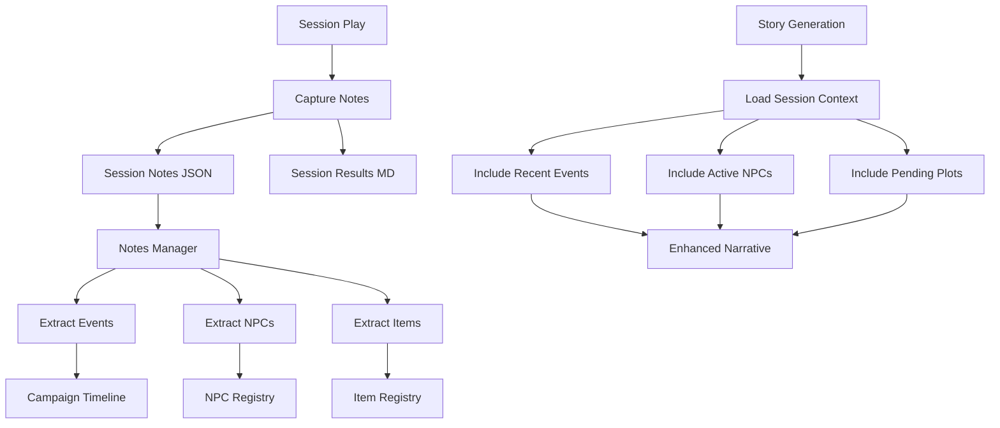

# Session Notes Integration Plan

## Overview

This document describes the design for integrating session notes with story
narrative generation. The goal is to enable DMs to capture session notes that
can be used to enhance story generation, track campaign progress, and maintain
continuity between sessions.

## Problem Statement

### Current Issues

1. **Disconnected Session Results**: Session results files exist but are not
   integrated with story generation or analysis.

2. **No Structured Notes**: DMs have no structured way to capture important
   session details like plot developments, NPC introductions, or player decisions.

3. **Lost Context**: Important details from sessions are not easily accessible
   when generating new story content.

4. **Manual Continuity**: DMs must manually remember and reference past session
   events when creating new content.

### Evidence from Codebase

| File | Current Implementation | Limitation |
|------|----------------------|------------|
| `session_results_manager.py` | Basic roll tracking | No structured notes |
| `story_ai_generator.py` | No session context | Missing session data |
| `story_consistency_analyzer.py` | No session history | Cannot check past events |
| `Example_Campaign/session_results_*.md` | Basic format | No structured data |

---

## Proposed Solution

### High-Level Approach

1. **Structured Session Notes Schema**: Define a schema for capturing session
   details beyond just roll results
2. **Notes-to-Narrative Linking**: Connect notes to story files and vice versa
3. **Session Context Integration**: Include session notes in story generation
4. **Campaign Timeline**: Build a timeline of events from session notes

### Session Notes Architecture



---

## Implementation Details

### 1. Session Notes Schema

Create `src/sessions/session_notes.py`:

```python
"""Session notes data structures."""

from dataclasses import dataclass, field
from typing import Optional, List, Dict, Any
from datetime import datetime
from enum import Enum


class NotePriority(Enum):
    """Priority level for session notes."""
    CRITICAL = "critical"    # Must be remembered
    IMPORTANT = "important"  # Should be referenced
    MINOR = "minor"          # Nice to have
    FLAVOR = "flavor"        # Atmospheric details


class PlotStatus(Enum):
    """Status of a plot thread."""
    INTRODUCED = "introduced"
    ACTIVE = "active"
    RESOLVED = "resolved"
    ABANDONED = "abandoned"


@dataclass
class PlotThread:
    """A plot thread or story arc tracked across sessions."""
    name: str
    description: str
    status: PlotStatus = PlotStatus.ACTIVE
    introduced_session: Optional[str] = None
    resolved_session: Optional[str] = None
    notes: List[str] = field(default_factory=list)

    def to_dict(self) -> Dict[str, Any]:
        return {
            "name": self.name,
            "description": self.description,
            "status": self.status.value,
            "introduced_session": self.introduced_session,
            "resolved_session": self.resolved_session,
            "notes": self.notes
        }


@dataclass
class SessionEvent:
    """A significant event from a session."""
    title: str
    description: str
    characters_involved: List[str] = field(default_factory=list)
    npcs_involved: List[str] = field(default_factory=list)
    location: Optional[str] = None
    outcome: Optional[str] = None
    priority: NotePriority = NotePriority.IMPORTANT

    def to_dict(self) -> Dict[str, Any]:
        return {
            "title": self.title,
            "description": self.description,
            "characters_involved": self.characters_involved,
            "npcs_involved": self.npcs_involved,
            "location": self.location,
            "outcome": self.outcome,
            "priority": self.priority.value
        }


@dataclass
class NPCIntroduction:
    """An NPC introduced during a session."""
    name: str
    role: str
    location: str
    first_impression: str
    relationship_to_party: str = "Neutral"

    def to_dict(self) -> Dict[str, Any]:
        return {
            "name": self.name,
            "role": self.role,
            "location": self.location,
            "first_impression": self.first_impression,
            "relationship_to_party": self.relationship_to_party
        }


@dataclass
class PlayerDecision:
    """A significant player decision made during a session."""
    decision: str
    made_by: str  # Character name
    alternatives_considered: List[str] = field(default_factory=list)
    consequences: Optional[str] = None

    def to_dict(self) -> Dict[str, Any]:
        return {
            "decision": self.decision,
            "made_by": self.made_by,
            "alternatives_considered": self.alternatives_considered,
            "consequences": self.consequences
        }


@dataclass
class SessionNotes:
    """Complete session notes for a single session."""

    # Metadata
    session_id: str
    session_date: str
    campaign_name: str
    story_file: Optional[str] = None

    # Core content
    summary: str = ""
    events: List[SessionEvent] = field(default_factory=list)
    plot_threads: List[PlotThread] = field(default_factory=list)
    npc_introductions: List[NPCIntroduction] = field(default_factory=list)
    player_decisions: List[PlayerDecision] = field(default_factory=list)

    # Legacy compatibility
    roll_results: List[Dict[str, Any]] = field(default_factory=list)

    # Metadata
    dm_notes: str = ""
    created_date: Optional[str] = None
    last_updated: Optional[str] = None

    def __post_init__(self):
        if self.created_date is None:
            self.created_date = datetime.now().isoformat()
        if self.last_updated is None:
            self.last_updated = datetime.now().isoformat()

    def add_event(
        self,
        title: str,
        description: str,
        characters: List[str] = None,
        npcs: List[str] = None,
        location: str = None,
        priority: NotePriority = NotePriority.IMPORTANT
    ):
        """Add a session event."""
        event = SessionEvent(
            title=title,
            description=description,
            characters_involved=characters or [],
            npcs_involved=npcs or [],
            location=location,
            priority=priority
        )
        self.events.append(event)
        self.last_updated = datetime.now().isoformat()

    def add_plot_thread(
        self,
        name: str,
        description: str,
        status: PlotStatus = PlotStatus.INTRODUCED
    ):
        """Add or update a plot thread."""
        # Check if thread already exists
        for thread in self.plot_threads:
            if thread.name == name:
                thread.notes.append(description)
                thread.status = status
                return

        # Create new thread
        thread = PlotThread(
            name=name,
            description=description,
            status=status,
            introduced_session=self.session_id
        )
        self.plot_threads.append(thread)

    def resolve_plot_thread(self, name: str, resolution: str):
        """Mark a plot thread as resolved."""
        for thread in self.plot_threads:
            if thread.name == name:
                thread.status = PlotStatus.RESOLVED
                thread.resolved_session = self.session_id
                thread.notes.append(f"Resolved: {resolution}")
                return

    def add_npc_introduction(
        self,
        name: str,
        role: str,
        location: str,
        impression: str,
        relationship: str = "Neutral"
    ):
        """Record an NPC introduction."""
        intro = NPCIntroduction(
            name=name,
            role=role,
            location=location,
            first_impression=impression,
            relationship_to_party=relationship
        )
        self.npc_introductions.append(intro)

    def add_player_decision(
        self,
        decision: str,
        made_by: str,
        alternatives: List[str] = None,
        consequences: str = None
    ):
        """Record a significant player decision."""
        dec = PlayerDecision(
            decision=decision,
            made_by=made_by,
            alternatives_considered=alternatives or [],
            consequences=consequences
        )
        self.player_decisions.append(dec)

    def to_dict(self) -> Dict[str, Any]:
        """Serialize to dictionary for JSON storage."""
        return {
            "session_id": self.session_id,
            "session_date": self.session_date,
            "campaign_name": self.campaign_name,
            "story_file": self.story_file,
            "summary": self.summary,
            "events": [e.to_dict() for e in self.events],
            "plot_threads": [p.to_dict() for p in self.plot_threads],
            "npc_introductions": [n.to_dict() for n in self.npc_introductions],
            "player_decisions": [d.to_dict() for d in self.player_decisions],
            "roll_results": self.roll_results,
            "dm_notes": self.dm_notes,
            "created_date": self.created_date,
            "last_updated": self.last_updated
        }

    @classmethod
    def from_dict(cls, data: Dict[str, Any]) -> 'SessionNotes':
        """Deserialize from dictionary."""
        notes = cls(
            session_id=data["session_id"],
            session_date=data["session_date"],
            campaign_name=data["campaign_name"],
            story_file=data.get("story_file"),
            summary=data.get("summary", ""),
            roll_results=data.get("roll_results", []),
            dm_notes=data.get("dm_notes", ""),
            created_date=data.get("created_date"),
            last_updated=data.get("last_updated")
        )

        # Deserialize events
        for event_data in data.get("events", []):
            notes.events.append(SessionEvent(
                title=event_data["title"],
                description=event_data["description"],
                characters_involved=event_data.get("characters_involved", []),
                npcs_involved=event_data.get("npcs_involved", []),
                location=event_data.get("location"),
                outcome=event_data.get("outcome"),
                priority=NotePriority(event_data.get("priority", "important"))
            ))

        # Deserialize plot threads
        for thread_data in data.get("plot_threads", []):
            notes.plot_threads.append(PlotThread(
                name=thread_data["name"],
                description=thread_data["description"],
                status=PlotStatus(thread_data.get("status", "active")),
                introduced_session=thread_data.get("introduced_session"),
                resolved_session=thread_data.get("resolved_session"),
                notes=thread_data.get("notes", [])
            ))

        # Deserialize NPC introductions
        for npc_data in data.get("npc_introductions", []):
            notes.npc_introductions.append(NPCIntroduction(
                name=npc_data["name"],
                role=npc_data["role"],
                location=npc_data["location"],
                first_impression=npc_data["first_impression"],
                relationship_to_party=npc_data.get("relationship_to_party", "Neutral")
            ))

        # Deserialize player decisions
        for dec_data in data.get("player_decisions", []):
            notes.player_decisions.append(PlayerDecision(
                decision=dec_data["decision"],
                made_by=dec_data["made_by"],
                alternatives_considered=dec_data.get("alternatives_considered", []),
                consequences=dec_data.get("consequences")
            ))

        return notes
```

### 2. Session Notes Manager

Create `src/sessions/session_notes_manager.py`:

```python
"""Session notes management and retrieval."""

import json
from pathlib import Path
from typing import List, Optional, Dict, Any
from datetime import datetime

from src.sessions.session_notes import SessionNotes, PlotStatus, NotePriority
from src.utils.file_io import load_json_file, save_json_file, ensure_directory
from src.utils.path_utils import get_game_data_path
from src.utils.string_utils import sanitize_filename, get_session_date


class SessionNotesManager:
    """Manages session notes for campaigns."""

    def __init__(self, campaign_name: str, workspace_path: Optional[str] = None):
        self.campaign_name = campaign_name
        self.workspace = Path(workspace_path) if workspace_path else get_game_data_path()
        self.campaign_dir = self.workspace / "campaigns" / campaign_name
        self.notes_dir = self.campaign_dir / "session_notes"

    def ensure_notes_dir(self):
        """Ensure the notes directory exists."""
        ensure_directory(str(self.notes_dir))

    def create_session_notes(
        self,
        session_id: str,
        story_file: Optional[str] = None
    ) -> SessionNotes:
        """Create a new session notes instance."""
        return SessionNotes(
            session_id=session_id,
            session_date=get_session_date(),
            campaign_name=self.campaign_name,
            story_file=story_file
        )

    def save_session_notes(self, notes: SessionNotes) -> str:
        """Save session notes to JSON file."""
        self.ensure_notes_dir()

        filename = f"notes_{notes.session_date}_{notes.session_id}.json"
        filepath = self.notes_dir / filename

        save_json_file(str(filepath), notes.to_dict())
        return str(filepath)

    def load_session_notes(self, session_id: str) -> Optional[SessionNotes]:
        """Load session notes by session ID."""
        # Find the file matching the session ID
        for notes_file in self.notes_dir.glob(f"notes_*_{session_id}.json"):
            data = load_json_file(str(notes_file))
            return SessionNotes.from_dict(data)

        return None

    def load_notes_by_date(self, date: str) -> List[SessionNotes]:
        """Load all session notes from a specific date."""
        notes_list = []

        for notes_file in self.notes_dir.glob(f"notes_{date}_*.json"):
            data = load_json_file(str(notes_file))
            notes_list.append(SessionNotes.from_dict(data))

        return sorted(notes_list, key=lambda n: n.session_id)

    def get_all_session_notes(self) -> List[SessionNotes]:
        """Get all session notes for the campaign."""
        notes_list = []

        if not self.notes_dir.exists():
            return notes_list

        for notes_file in self.notes_dir.glob("notes_*.json"):
            data = load_json_file(str(notes_file))
            notes_list.append(SessionNotes.from_dict(data))

        return sorted(notes_list, key=lambda n: (n.session_date, n.session_id))

    def get_recent_notes(self, count: int = 3) -> List[SessionNotes]:
        """Get the most recent session notes."""
        all_notes = self.get_all_session_notes()
        return all_notes[-count:] if all_notes else []

    def get_active_plot_threads(self) -> List[Dict[str, Any]]:
        """Get all active plot threads across all sessions."""
        threads = {}

        for notes in self.get_all_session_notes():
            for thread in notes.plot_threads:
                if thread.status == PlotStatus.ACTIVE:
                    threads[thread.name] = {
                        "name": thread.name,
                        "description": thread.description,
                        "introduced": thread.introduced_session,
                        "notes": thread.notes
                    }
                elif thread.status == PlotStatus.RESOLVED:
                    # Remove resolved threads
                    threads.pop(thread.name, None)

        return list(threads.values())

    def get_npc_introductions(self) -> List[Dict[str, Any]]:
        """Get all NPCs introduced across sessions."""
        npcs = {}

        for notes in self.get_all_session_notes():
            for npc in notes.npc_introductions:
                if npc.name not in npcs:
                    npcs[npc.name] = {
                        "name": npc.name,
                        "role": npc.role,
                        "location": npc.location,
                        "first_impression": npc.first_impression,
                        "relationship": npc.relationship_to_party,
                        "introduced_session": notes.session_id
                    }

        return list(npcs.values())

    def get_campaign_timeline(self) -> List[Dict[str, Any]]:
        """Build a timeline of events from all sessions."""
        timeline = []

        for notes in self.get_all_session_notes():
            for event in notes.events:
                timeline.append({
                    "date": notes.session_date,
                    "session_id": notes.session_id,
                    "title": event.title,
                    "description": event.description,
                    "characters": event.characters_involved,
                    "npcs": event.npcs_involved,
                    "location": event.location,
                    "priority": event.priority.value
                })

        return sorted(timeline, key=lambda e: (e["date"], e["session_id"]))

    def get_context_for_story_generation(self) -> Dict[str, Any]:
        """Get session context for story generation.

        Returns a dictionary with:
        - recent_events: Key events from recent sessions
        - active_plots: Unresolved plot threads
        - recent_npcs: NPCs recently introduced
        - pending_decisions: Unresolved player decisions
        """
        recent = self.get_recent_notes(3)

        events = []
        for notes in recent:
            for event in notes.events:
                if event.priority in (NotePriority.CRITICAL, NotePriority.IMPORTANT):
                    events.append({
                        "session": notes.session_id,
                        "title": event.title,
                        "description": event.description
                    })

        return {
            "recent_events": events[-10:],  # Last 10 important events
            "active_plots": self.get_active_plot_threads(),
            "recent_npcs": self.get_npc_introductions()[-5:],  # Last 5 NPCs
            "pending_decisions": [
                {
                    "decision": d.decision,
                    "made_by": d.made_by,
                    "consequences": d.consequences
                }
                for notes in recent
                for d in notes.player_decisions
                if d.consequences is None
            ]
        }

    def export_timeline_markdown(self) -> str:
        """Export campaign timeline as markdown."""
        timeline = self.get_campaign_timeline()

        lines = [
            f"# Campaign Timeline: {self.campaign_name}",
            "",
            "## Events in Chronological Order",
            ""
        ]

        current_date = None
        for event in timeline:
            if event["date"] != current_date:
                current_date = event["date"]
                lines.append(f"### {current_date}")
                lines.append("")

            lines.append(f"**{event['title']}**")
            lines.append(f"- {event['description']}")
            if event["characters"]:
                lines.append(f"- Characters: {', '.join(event['characters'])}")
            if event["npcs"]:
                lines.append(f"- NPCs: {', '.join(event['npcs'])}")
            lines.append("")

        return "\n".join(lines)
```

### 3. Story Generation Integration

Update `src/stories/story_ai_generator.py`:

```python
def build_story_prompt_with_session_context(
    base_prompt: str,
    session_context: Dict[str, Any]
) -> str:
    """Enhance story generation prompt with session context.

    Args:
        base_prompt: The original story generation prompt
        session_context: Context from SessionNotesManager.get_context_for_story_generation()

    Returns:
        Enhanced prompt with session context
    """
    context_parts = []

    # Add recent events
    if session_context.get("recent_events"):
        context_parts.append("## Recent Events")
        for event in session_context["recent_events"]:
            context_parts.append(f"- [{event['session']}] {event['title']}: {event['description']}")
        context_parts.append("")

    # Add active plot threads
    if session_context.get("active_plots"):
        context_parts.append("## Active Plot Threads")
        for plot in session_context["active_plots"]:
            context_parts.append(f"- **{plot['name']}**: {plot['description']}")
        context_parts.append("")

    # Add recent NPCs
    if session_context.get("recent_npcs"):
        context_parts.append("## Recently Encountered NPCs")
        for npc in session_context["recent_npcs"]:
            context_parts.append(f"- **{npc['name']}** ({npc['role']}): {npc['first_impression']}")
        context_parts.append("")

    # Add pending decisions
    if session_context.get("pending_decisions"):
        context_parts.append("## Pending Consequences")
        for dec in session_context["pending_decisions"]:
            context_parts.append(f"- {dec['made_by']} decided: {dec['decision']}")
        context_parts.append("")

    if context_parts:
        context_block = "\n".join(context_parts)
        return f"{base_prompt}\n\n---\n\n### Session Context\n\n{context_block}"

    return base_prompt
```

### 4. CLI Session Notes Workflow

Create `src/cli/cli_session_notes.py`:

```python
"""CLI interface for session notes management."""

from typing import Optional
from src.sessions.session_notes_manager import SessionNotesManager
from src.sessions.session_notes import NotePriority, PlotStatus


def session_notes_menu(campaign_name: str):
    """Interactive session notes management menu."""
    manager = SessionNotesManager(campaign_name)

    while True:
        print(f"\n=== Session Notes: {campaign_name} ===")
        print("1. View recent session notes")
        print("2. View campaign timeline")
        print("3. View active plot threads")
        print("4. Add notes to current session")
        print("5. Export timeline to markdown")
        print("6. Return to previous menu")

        choice = input("\nSelect option: ").strip()

        if choice == "1":
            view_recent_notes(manager)
        elif choice == "2":
            view_timeline(manager)
        elif choice == "3":
            view_plot_threads(manager)
        elif choice == "4":
            add_session_notes(manager)
        elif choice == "5":
            export_timeline(manager)
        elif choice == "6":
            break


def view_recent_notes(manager: SessionNotesManager):
    """Display recent session notes."""
    recent = manager.get_recent_notes(5)

    if not recent:
        print("\n[INFO] No session notes found.")
        return

    for notes in recent:
        print(f"\n--- Session: {notes.session_id} ({notes.session_date}) ---")
        print(f"Summary: {notes.summary or 'No summary'}")

        if notes.events:
            print("\nEvents:")
            for event in notes.events[:5]:
                print(f"  - {event.title}: {event.description[:50]}...")


def view_timeline(manager: SessionNotesManager):
    """Display campaign timeline."""
    timeline = manager.get_campaign_timeline()

    if not timeline:
        print("\n[INFO] No events recorded yet.")
        return

    print(f"\n=== Campaign Timeline ({len(timeline)} events) ===")

    for event in timeline[-10:]:  # Show last 10 events
        print(f"\n[{event['date']}] {event['title']}")
        print(f"  {event['description']}")


def view_plot_threads(manager: SessionNotesManager):
    """Display active plot threads."""
    threads = manager.get_active_plot_threads()

    if not threads:
        print("\n[INFO] No active plot threads.")
        return

    print(f"\n=== Active Plot Threads ({len(threads)}) ===")

    for thread in threads:
        print(f"\n** {thread['name']} **")
        print(f"  {thread['description']}")
        if thread['notes']:
            print(f"  Notes: {', '.join(thread['notes'][-3:])}")


def add_session_notes(manager: SessionNotesManager):
    """Add notes to a session interactively."""
    session_id = input("\nEnter session ID (or 'new' for new session): ").strip()

    if session_id.lower() == 'new':
        from src.utils.string_utils import get_session_date
        session_id = input("Enter new session ID: ").strip()
        notes = manager.create_session_notes(session_id)
    else:
        notes = manager.load_session_notes(session_id)
        if not notes:
            print(f"[ERROR] Session {session_id} not found.")
            return

    print("\nWhat would you like to add?")
    print("1. Event")
    print("2. Plot thread")
    print("3. NPC introduction")
    print("4. Player decision")
    print("5. Summary")

    choice = input("Select: ").strip()

    if choice == "1":
        title = input("Event title: ").strip()
        description = input("Event description: ").strip()
        characters = input("Characters involved (comma-separated): ").strip()
        notes.add_event(
            title=title,
            description=description,
            characters=[c.strip() for c in characters.split(",")] if characters else []
        )

    elif choice == "2":
        name = input("Plot thread name: ").strip()
        description = input("Description: ").strip()
        notes.add_plot_thread(name, description)

    elif choice == "3":
        name = input("NPC name: ").strip()
        role = input("NPC role: ").strip()
        location = input("Location: ").strip()
        impression = input("First impression: ").strip()
        notes.add_npc_introduction(name, role, location, impression)

    elif choice == "4":
        decision = input("Decision made: ").strip()
        made_by = input("Made by (character): ").strip()
        notes.add_player_decision(decision, made_by)

    elif choice == "5":
        notes.summary = input("Session summary: ").strip()

    manager.save_session_notes(notes)
    print(f"\n[SUCCESS] Notes saved for session {session_id}")


def export_timeline(manager: SessionNotesManager):
    """Export timeline to markdown file."""
    markdown = manager.export_timeline_markdown()

    output_path = manager.campaign_dir / "campaign_timeline.md"
    with open(output_path, 'w', encoding='utf-8') as f:
        f.write(markdown)

    print(f"\n[SUCCESS] Timeline exported to: {output_path}")
```

---

## Affected Files

| File | Changes Required |
|------|-----------------|
| `src/sessions/session_notes.py` | Create new module |
| `src/sessions/session_notes_manager.py` | Create new module |
| `src/sessions/__init__.py` | Create new package |
| `src/cli/cli_session_notes.py` | Create new CLI module |
| `src/stories/story_ai_generator.py` | Add session context integration |
| `src/stories/session_results_manager.py` | Update to use new notes system |
| `src/cli/cli_story_manager.py` | Add session notes menu option |
| `tests/sessions/test_session_notes.py` | Create new test file |

---

## Testing Strategy

### Unit Tests

1. **SessionNotes Tests**
   - Create notes with all fields
   - Add events, plot threads, NPCs
   - Serialize and deserialize

2. **SessionNotesManager Tests**
   - Save and load notes
   - Get recent notes
   - Build timeline
   - Get context for generation

3. **Integration Tests**
   - Story generation with session context
   - Timeline export
   - Plot thread tracking

### Test Data

Create test session notes in `game_data/campaigns/Example_Campaign/session_notes/`:
- `notes_2025-11-23_001.json` - Notes for first session
- `notes_2025-11-23_002.json` - Notes for second session

---

## Migration Path

### Phase 1: Infrastructure

1. Create sessions package
2. Create session notes data structures
3. Create session notes manager

### Phase 2: Integration

1. Update story generation to use session context
2. Add CLI menu for session notes
3. Update session results manager

### Phase 3: Migration

Create `scripts/migrate_session_results.py`:

```python
"""Migrate existing session results to structured notes."""

import re
from pathlib import Path
from src.sessions.session_notes import SessionNotes

def parse_session_results_file(filepath: Path) -> SessionNotes:
    """Parse legacy session results markdown into structured notes."""
    content = filepath.read_text(encoding='utf-8')

    # Extract date and session from filename
    match = re.search(r'session_results_(\d{4}-\d{2}-\d{2})_(.+)\.md', filepath.name)
    if not match:
        return None

    date = match.group(1)
    session_id = match.group(2)

    notes = SessionNotes(
        session_id=session_id,
        session_date=date,
        campaign_name=filepath.parent.parent.name
    )

    # Parse roll results
    roll_pattern = r'\*\*(.+?)\*\* - (.+?)\n\s+- Roll: (\d+) vs DC (\d+) - (\w+)'
    for match in re.finditer(roll_pattern, content):
        notes.roll_results.append({
            "character": match.group(1),
            "action": match.group(2),
            "roll_value": int(match.group(3)),
            "dc": int(match.group(4)),
            "success": match.group(5) == "SUCCESS"
        })

    return notes
```

---

## Dependencies

### Required Before This Work

- None - this is a standalone enhancement

### Works Well With

- **Campaign Templates Plan** - Template-specific note structures
- **Character Relationship Mapping Plan** - Track relationship changes in sessions

### Enables Future Work

- Session replay functionality
- Campaign analytics dashboard
- AI-powered session summaries

---

## Risks and Mitigations

| Risk | Impact | Mitigation |
|------|--------|------------|
| Complex migration | Medium | Incremental migration with fallback |
| Performance with many sessions | Low | Pagination and caching |
| User adoption | Medium | Clear CLI workflow and documentation |
| Data consistency | Low | Validation on save |

---

## Success Criteria

1. Structured session notes schema implemented
2. Session notes manager functional
3. Story generation uses session context
4. CLI workflow for notes management
5. Timeline export working
6. All tests pass with 10.00/10 pylint score
