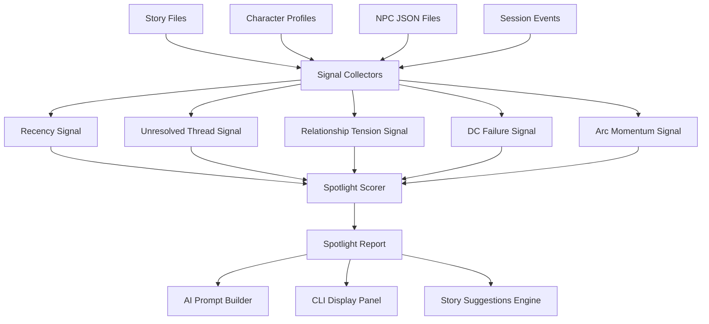

# Spotlighting System Plan

## Overview

This document describes the design for a Spotlighting System that dynamically
highlights narratively important characters, NPCs, and events based on the
current story context. Unlike the retrospective
[character arc analysis](character_arc_analysis_plan.md), the Spotlight system
operates in near-real-time during story writing and AI prompt construction,
surfacing elements that deserve immediate narrative attention.

## Spotlight / Wildcard Conversation System

Here’s a focused summary of the Spotlight / Wildcard conversation system based on the ideas you described.

Spotlight System (Agent Conversation Control)

The Spotlight system manages which agents meaningfully participate in a conversation or scene. Instead of every character speaking equally, agents accumulate spotlight points that determine who gets narrative attention.

Core Idea

Each agent receives spotlight points based on relevance to the current scene. Agents with higher points are more likely to:

Speak in dialogue

Influence the scene

Drive narrative direction

This prevents chaotic multi-agent conversations and keeps the story readable.

Spotlight Point Sources

Agents gain points from several contextual signals.

Story Relevance

Points are added when:

The scene involves the agent’s goals

The agent is connected to the current quest or conflict

The scene references the agent’s history or relationships

Personality / Role Influence

Some characters naturally gain spotlight more easily.

Examples:

Leaders

Quest-givers

Characters with strong motivations

Characters with high social traits

Recent Silence

Agents that haven't spoken for several turns gain catch-up points, preventing characters from disappearing entirely.

This helps maintain party balance.

Relationship Triggers

Points increase when:

A character they care about is present

An ally or rival speaks

Their personal storyline is involved

Spotlight Threshold

Agents with points above a scene threshold are allowed to participate in dialogue generation.

Typical flow:

Scene begins

Spotlight points calculated

Top agents selected

Dialogue generation runs using only those agents

This keeps scenes focused.

Wildcard Mechanic

A Wildcard slot allows a lower-priority agent to occasionally jump into the conversation unexpectedly.

Purpose:

Prevent conversations from feeling deterministic

Allow surprise character moments

Introduce humor or tension

The wildcard agent is selected from the remaining pool using weighted randomness.

Wildcard Effects

When triggered, the wildcard agent can:

Interrupt a conversation

Add commentary

Introduce new information

Change the tone of the scene

This keeps the system feeling organic instead of scripted.

Example Flow

Scene participants:

Knight

Mage

Rogue

Bard

Spotlight scoring:

Agent Points
Knight 8
Mage 7
Rogue 3
Bard 2

Top agents selected:

Knight

Mage

Wildcard selection:

Bard randomly chosen

Conversation participants:

Knight

Mage

Bard (wildcard)

The Bard unexpectedly jumps in with a remark.

Why This System Matters

This approach solves several common multi-agent AI problems:

Prevents everyone talking at once

Avoids dominant characters monopolizing dialogue

Preserves surprise and spontaneity

Keeps scenes narratively focused

It also scales well as the number of agents increases.

## Relationship to Other Plans

| Plan | Relationship |
|------|-------------|
| [`character_arc_analysis_plan.md`](character_arc_analysis_plan.md) | Arc is historical/retrospective; spotlight is contextual/live. Spotlight reads arc data as one of its inputs. |
| [`ai_story_suggestions_plan.md`](ai_story_suggestions_plan.md) | Story suggestions use spotlight output to prioritise which hooks to surface. |
| [`milvus_integration_plan.md`](milvus_integration_plan.md) | Semantic retrieval finds thematically related past events for spotlight scoring. |
| [`session_notes_plan.md`](session_notes_plan.md) | Session events feed into spotlight scoring. |

---

## Problem Statement

### Current Issues

1. **No Narrative Weighting**: All characters and NPCs are treated equally
   in AI prompts. A character with unresolved plot threads gets the same
   attention as one with no narrative significance.

2. **Unresolved Threads Not Surfaced**: Failed History checks, unmet DC
   challenges, and open relationship conflicts are recorded but never
   re-surfaced to influence story continuation.

3. **NPC Recency Ignored**: An NPC who appeared three sessions ago and gave
   the party a critical clue is not automatically re-introduced when the
   relevant plot point becomes important again.

4. **DM Cognitive Load**: The DM must manually track which characters and
   events are overdue for narrative attention.

### Evidence from Codebase

| Current State | Location | Limitation |
|---------------|----------|------------|
| All NPCs weighted equally | `src/utils/npc_lookup_helper.py` | No recency or significance scoring |
| Unresolved DCs stored nowhere | N/A | Cannot track failed challenges |
| Character mentions counted | `src/stories/series_analyzer.py` | Raw counts only, no weighting |
| No spotlight data structure | Anywhere | Cannot store or query spotlight state |

---

## Proposed Solution

### High-Level Approach

1. **Spotlight Scores**: Assign a numeric score (0-100) to each character
   and NPC based on multiple narrative signals.
2. **Signal Collectors**: Each signal type has its own collector that reads
   from existing data sources (story files, character profiles, NPC files).
3. **Spotlight Report**: The system produces a ranked report of elements
   deserving immediate narrative attention.
4. **AI Prompt Injection**: High-spotlight items are injected into the AI
   prompt preamble to guide story continuation.
5. **CLI Display**: The spotlight report is displayable as a panel before
   story generation.

### Architecture



---

## Implementation Details

### 1. Spotlight Score Data Structure

Create `src/stories/spotlight_types.py`:

```python
"""Data types for the Spotlighting System."""

from dataclasses import dataclass, field
from typing import List, Dict


@dataclass
class SpotlightSignal:
    """A single narrative signal contributing to a spotlight score."""

    signal_type: str
    description: str
    weight: float
    evidence: str


@dataclass
class SpotlightEntry:
    """Spotlight score and signals for a single character or NPC."""

    name: str
    entity_type: str  # "character" or "npc"
    score: float
    signals: List[SpotlightSignal] = field(default_factory=list)
    last_appearance: str = ""
    sessions_absent: int = 0


@dataclass
class SpotlightReport:
    """Full spotlight report for a campaign context."""

    campaign_name: str
    generated_at: str
    entries: List[SpotlightEntry] = field(default_factory=list)

    def top_characters(self, n: int = 3) -> List[SpotlightEntry]:
        """Return the top N spotlit characters."""
        chars = [e for e in self.entries if e.entity_type == "character"]
        return sorted(chars, key=lambda x: x.score, reverse=True)[:n]

    def top_npcs(self, n: int = 3) -> List[SpotlightEntry]:
        """Return the top N spotlit NPCs."""
        npcs = [e for e in self.entries if e.entity_type == "npc"]
        return sorted(npcs, key=lambda x: x.score, reverse=True)[:n]
```

### 2. Signal Definitions and Weights

| Signal Type | Description | Default Weight | Source |
|-------------|-------------|---------------|--------|
| `recency` | Sessions since last appearance | 20 | Story file mentions |
| `unresolved_thread` | Open plot threads or quests | 25 | Story file analysis |
| `dc_failure` | Failed DC checks awaiting retry | 20 | Story file DC extraction |
| `relationship_tension` | Conflicted or unresolved relationships | 15 | Character profile `relationships` |
| `arc_momentum` | Character in active arc development | 10 | Arc analysis data |
| `npc_clue_holder` | NPC gave unresolved clue or quest | 10 | NPC profile flags |

Total maximum score: 100. Weights are configurable via `src/config/config_types.py`.

### 3. Signal Collectors

Create `src/stories/spotlight_signals.py`:

```python
"""Signal collectors for the Spotlighting System."""

from typing import List, Dict
from src.stories.spotlight_types import SpotlightSignal
from src.utils.story_file_helpers import list_story_files
from src.utils.story_parsing_utils import extract_character_actions, extract_dc_requests


def collect_recency_signals(
    campaign_name: str, character_names: List[str]
) -> Dict[str, SpotlightSignal]:
    """Score characters by how many sessions have passed since last mention."""


def collect_unresolved_thread_signals(
    campaign_name: str
) -> Dict[str, SpotlightSignal]:
    """Identify open plot threads from story files."""


def collect_dc_failure_signals(
    campaign_name: str
) -> Dict[str, SpotlightSignal]:
    """Find DC checks that failed and were never retried."""


def collect_relationship_tension_signals(
    character_names: List[str]
) -> Dict[str, SpotlightSignal]:
    """Score characters with conflicted or unresolved relationships."""
```

### 4. Spotlight Engine

Create `src/stories/spotlight_engine.py`:

```python
"""Core spotlight scoring engine."""

from typing import List, Optional
from src.stories.spotlight_types import SpotlightReport, SpotlightEntry
from src.stories.spotlight_signals import (
    collect_recency_signals,
    collect_unresolved_thread_signals,
    collect_dc_failure_signals,
    collect_relationship_tension_signals,
)
from src.utils.character_profile_utils import list_character_names
from src.utils.npc_lookup_helper import load_relevant_npcs_for_prompt
from src.utils.string_utils import get_timestamp


class SpotlightEngine:
    """Generates spotlight reports for a campaign."""

    def generate_report(
        self, campaign_name: str, context_hint: Optional[str] = None
    ) -> SpotlightReport:
        """Generate a full spotlight report for the given campaign."""

    def get_prompt_injection(
        self, campaign_name: str, max_characters: int = 3, max_npcs: int = 3
    ) -> str:
        """Return a short text block for injection into AI prompts."""
```

### 5. AI Prompt Injection

The `get_prompt_injection()` output is a brief natural-language block:

```
Narratively important at this moment:
- Aragorn (score 87): Has not appeared in 2 sessions; unresolved oath to Gondor.
- Gandalf (score 72): DC 18 Insight check failed last session; awaiting follow-up.
- Grima Wormtongue (NPC, score 65): Gave Frodo a warning that has not been acted on.
```

This block is prepended to the existing system prompt in
`src/ai/ai_client.py` when story continuation is requested.

### 6. CLI Integration

Add to the story management CLI menu:

```
[S] Show Spotlight Report
[G] Generate story (spotlight-guided)
```

`display_panel()` from `src/utils/terminal_display.py` is used to render
the spotlight report in the terminal.

---

## Spotlight vs Arc Analysis Boundary

| Aspect | Spotlight | Arc Analysis |
|--------|-----------|-------------|
| Time horizon | Current + recent sessions | Full campaign history |
| Output | Ranked priority list | Narrative arc report |
| Update frequency | Before each story session | After each story batch |
| AI integration | Injected into prompt preamble | Used for arc summaries |
| Primary user | DM deciding what to write next | DM reviewing character growth |

---

## Phased Implementation

### Phase 1: Data Structures and Signal Collectors

1. Create `src/stories/spotlight_types.py`
2. Create `src/stories/spotlight_signals.py` with recency and DC signals
3. Unit tests in `tests/stories/test_spotlight_signals.py`
4. Use `game_data/campaigns/Example_Campaign/` for test data

### Phase 2: Scoring Engine

1. Create `src/stories/spotlight_engine.py`
2. Implement `generate_report()` combining all signals
3. Implement `get_prompt_injection()` text formatter
4. Unit tests in `tests/stories/test_spotlight_engine.py`

### Phase 3: Integration

1. Add spotlight injection to AI prompt builder
2. Add `--spotlight` flag to `dnd_consultant.py`
3. Add CLI menu option for spotlight display
4. Integration test: full campaign report generation

---

## Related Plans

| Plan | Notes |
|------|-------|
| [`character_arc_analysis_plan.md`](character_arc_analysis_plan.md) | Arc momentum is one spotlight signal |
| [`ai_story_suggestions_plan.md`](ai_story_suggestions_plan.md) | Suggestions engine reads spotlight to prioritise hooks |
| [`milvus_integration_plan.md`](milvus_integration_plan.md) | Semantic story search supports unresolved thread detection |
| [`session_notes_plan.md`](session_notes_plan.md) | Session events provide recency and DC failure data |
| [`story_tools_plan.md`](story_tools_plan.md) | Story tools provide the underlying story parsing primitives |
