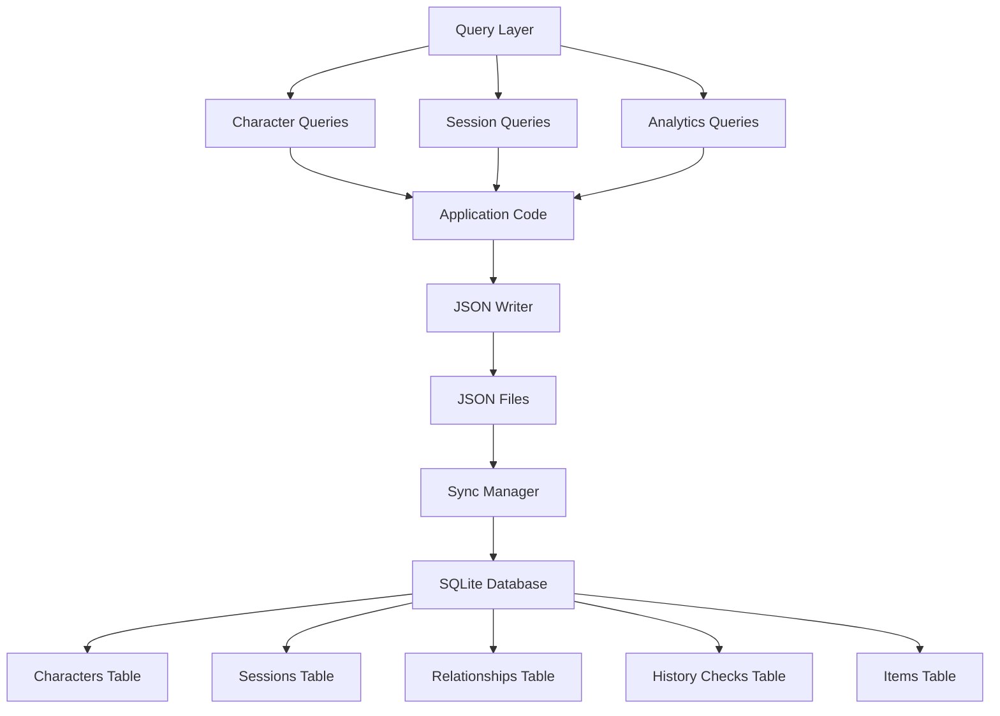

# SQLite Integration Plan

## Overview

This document describes the design for optional SQLite database support in the
D&D Character Consultant System. The goal is to provide enhanced querying,
history tracking, and analytics capabilities while keeping JSON as the default
storage format for simplicity.

## Relationship to Drupal CMS Integration

This plan provides a **lightweight alternative** to the Drupal CMS integration
([`drupal_cms_integration.md`](drupal_cms_integration.md)). The two approaches
serve different use cases:

| Feature | SQLite (This Plan) | Drupal CMS |
|---------|-------------------|------------|
| Setup complexity | Low - single file | High - requires DDEV, PHP, MySQL |
| Resource usage | Minimal | Significant |
| Web interface | No | Yes - full CMS UI |
| Multi-user | No | Yes |
| API access | Query helpers only | Full JSON:API |
| Best for | Solo DMs, quick analytics | Teams, web visualization |

**Recommendation:** Use SQLite for local analytics and history tracking when
you don't need web visualization. Use Drupal when you want a full web interface
for viewing and managing your campaign data. Both can coexist - SQLite can sync
from the same JSON files that Drupal uses.

## Problem Statement

### Current Issues

1. **Limited Query Capabilities**: JSON files require loading entire files
   to find specific data, making cross-character queries inefficient.

2. **No History Tracking**: Character knowledge from History checks, session
   outcomes, and relationship changes are not tracked over time.

3. **No Analytics**: Cannot easily analyze campaign statistics, character
   progression, or session patterns.

4. **File System Limitations**: Large campaigns with many sessions and
   characters can become slow to load and search.

### Evidence from Codebase

| Current State | Limitation |
|---------------|------------|
| JSON file storage | No complex queries |
| No history tables | Cannot track changes over time |
| No session analytics | Cannot analyze patterns |
| `load_json_file()` everywhere | Must load entire files |

---

## Proposed Solution

### High-Level Approach

1. **Optional Database Layer**: SQLite as an optional enhancement, not a
   replacement for JSON storage
2. **Sync Utilities**: Keep JSON and database in sync for compatibility
3. **History Tables**: Track changes to characters, relationships, and sessions
4. **Query Helpers**: Provide convenient query functions for common operations
5. **Analytics Views**: Pre-built views for campaign insights

### Database Architecture



---

## Implementation Details

### 1. Database Schema

Create `src/database/schema.py`:

```python
"""SQLite database schema for D&D Character Consultant."""

SCHEMA_VERSION = 1

SCHEMA_SQL = """
-- Schema version tracking
CREATE TABLE IF NOT EXISTS schema_version (
    version INTEGER PRIMARY KEY,
    applied_at TEXT NOT NULL
);

-- Characters table
CREATE TABLE IF NOT EXISTS characters (
    id INTEGER PRIMARY KEY AUTOINCREMENT,
    name TEXT NOT NULL UNIQUE,
    json_path TEXT NOT NULL,
    species TEXT,
    dnd_class TEXT,
    level INTEGER,
    background TEXT,
    created_at TEXT NOT NULL,
    updated_at TEXT NOT NULL,
    json_data TEXT NOT NULL  -- Full JSON for reference
);

-- Character ability scores
CREATE TABLE IF NOT EXISTS ability_scores (
    character_id INTEGER PRIMARY KEY,
    strength INTEGER NOT NULL,
    dexterity INTEGER NOT NULL,
    constitution INTEGER NOT NULL,
    intelligence INTEGER NOT NULL,
    wisdom INTEGER NOT NULL,
    charisma INTEGER NOT NULL,
    FOREIGN KEY (character_id) REFERENCES characters(id) ON DELETE CASCADE
);

-- NPCs table
CREATE TABLE IF NOT EXISTS npcs (
    id INTEGER PRIMARY KEY AUTOINCREMENT,
    name TEXT NOT NULL UNIQUE,
    json_path TEXT NOT NULL,
    role TEXT,
    location TEXT,
    created_at TEXT NOT NULL,
    updated_at TEXT NOT NULL,
    json_data TEXT NOT NULL
);

-- Relationships table
CREATE TABLE IF NOT EXISTS relationships (
    id INTEGER PRIMARY KEY AUTOINCREMENT,
    character_id INTEGER NOT NULL,
    target_name TEXT NOT NULL,
    relationship_type TEXT NOT NULL,
    strength INTEGER DEFAULT 5,
    status TEXT DEFAULT 'current',
    notes TEXT,
    created_at TEXT NOT NULL,
    updated_at TEXT NOT NULL,
    FOREIGN KEY (character_id) REFERENCES characters(id) ON DELETE CASCADE,
    UNIQUE(character_id, target_name)
);

-- Relationship history
CREATE TABLE IF NOT EXISTS relationship_history (
    id INTEGER PRIMARY KEY AUTOINCREMENT,
    relationship_id INTEGER NOT NULL,
    old_type TEXT,
    new_type TEXT NOT NULL,
    old_strength INTEGER,
    new_strength INTEGER,
    change_reason TEXT,
    changed_at TEXT NOT NULL,
    FOREIGN KEY (relationship_id) REFERENCES relationships(id) ON DELETE CASCADE
);

-- Sessions table
CREATE TABLE IF NOT EXISTS sessions (
    id INTEGER PRIMARY KEY AUTOINCREMENT,
    session_id TEXT NOT NULL UNIQUE,
    campaign_name TEXT NOT NULL,
    session_date TEXT NOT NULL,
    story_file TEXT,
    summary TEXT,
    created_at TEXT NOT NULL,
    json_data TEXT
);

-- Session events
CREATE TABLE IF NOT EXISTS session_events (
    id INTEGER PRIMARY KEY AUTOINCREMENT,
    session_id INTEGER NOT NULL,
    event_title TEXT NOT NULL,
    event_description TEXT,
    characters_involved TEXT,  -- JSON array
    npcs_involved TEXT,        -- JSON array
    location TEXT,
    priority TEXT DEFAULT 'important',
    FOREIGN KEY (session_id) REFERENCES sessions(id) ON DELETE CASCADE
);

-- History checks (character knowledge)
CREATE TABLE IF NOT EXISTS history_checks (
    id INTEGER PRIMARY KEY AUTOINCREMENT,
    character_id INTEGER NOT NULL,
    session_id INTEGER,
    topic TEXT NOT NULL,
    roll_result INTEGER,
    dc INTEGER,
    success INTEGER NOT NULL,  -- 0 or 1
    knowledge_gained TEXT,
    checked_at TEXT NOT NULL,
    FOREIGN KEY (character_id) REFERENCES characters(id) ON DELETE CASCADE,
    FOREIGN KEY (session_id) REFERENCES sessions(id) ON DELETE SET NULL
);

-- Items registry
CREATE TABLE IF NOT EXISTS items (
    id INTEGER PRIMARY KEY AUTOINCREMENT,
    name TEXT NOT NULL UNIQUE,
    item_type TEXT,
    rarity TEXT,
    requires_attunement INTEGER DEFAULT 0,
    description TEXT,
    source TEXT,  -- 'official' or 'homebrew'
    json_data TEXT NOT NULL
);

-- Character items (inventory)
CREATE TABLE IF NOT EXISTS character_items (
    id INTEGER PRIMARY KEY AUTOINCREMENT,
    character_id INTEGER NOT NULL,
    item_id INTEGER,
    custom_item_name TEXT,  -- For items not in registry
    quantity INTEGER DEFAULT 1,
    equipped INTEGER DEFAULT 0,
    notes TEXT,
    FOREIGN KEY (character_id) REFERENCES characters(id) ON DELETE CASCADE,
    FOREIGN KEY (item_id) REFERENCES items(id) ON DELETE SET NULL
);

-- Plot threads
CREATE TABLE IF NOT EXISTS plot_threads (
    id INTEGER PRIMARY KEY AUTOINCREMENT,
    campaign_name TEXT NOT NULL,
    thread_name TEXT NOT NULL,
    description TEXT,
    status TEXT DEFAULT 'active',
    introduced_session TEXT,
    resolved_session TEXT,
    created_at TEXT NOT NULL,
    updated_at TEXT NOT NULL,
    UNIQUE(campaign_name, thread_name)
);

-- Indexes for common queries
CREATE INDEX IF NOT EXISTS idx_characters_class ON characters(dnd_class);
CREATE INDEX IF NOT EXISTS idx_characters_level ON characters(level);
CREATE INDEX IF NOT EXISTS idx_relationships_character ON relationships(character_id);
CREATE INDEX IF NOT EXISTS idx_relationships_target ON relationships(target_name);
CREATE INDEX IF NOT EXISTS idx_sessions_campaign ON sessions(campaign_name);
CREATE INDEX IF NOT EXISTS idx_sessions_date ON sessions(session_date);
CREATE INDEX IF NOT EXISTS idx_history_checks_character ON history_checks(character_id);
CREATE INDEX IF NOT EXISTS idx_plot_threads_campaign ON plot_threads(campaign_name);

-- Views for analytics
CREATE VIEW IF NOT EXISTS character_summary AS
SELECT
    c.name,
    c.species,
    c.dnd_class,
    c.level,
    c.background,
    COUNT(DISTINCT r.id) as relationship_count,
    COUNT(DISTINCT hi.id) as history_check_count
FROM characters c
LEFT JOIN relationships r ON c.id = r.character_id
LEFT JOIN history_checks hi ON c.id = hi.character_id
GROUP BY c.id;

CREATE VIEW IF NOT EXISTS campaign_stats AS
SELECT
    campaign_name,
    COUNT(*) as session_count,
    MIN(session_date) as first_session,
    MAX(session_date) as last_session,
    COUNT(DISTINCT json_extract(characters_involved, '$')) as unique_characters
FROM sessions s
LEFT JOIN session_events e ON s.id = e.session_id
GROUP BY campaign_name;

CREATE VIEW IF NOT EXISTS relationship_network AS
SELECT
    c1.name as character_name,
    r.target_name,
    r.relationship_type,
    r.strength,
    c2.name as target_character
FROM relationships r
JOIN characters c1 ON r.character_id = c1.id
LEFT JOIN characters c2 ON r.target_name = c2.name;
"""
```

### 2. Database Manager

Create `src/database/db_manager.py`:

```python
"""SQLite database management for D&D Character Consultant."""

import sqlite3
import json
from pathlib import Path
from typing import Optional, List, Dict, Any
from datetime import datetime
from contextlib import contextmanager

from src.database.schema import SCHEMA_SQL, SCHEMA_VERSION


class DatabaseManager:
    """Manages SQLite database connections and operations."""

    def __init__(self, db_path: str = "game_data/dnd_consultant.db"):
        """
        Initialize database manager.

        Args:
            db_path: Path to SQLite database file
        """
        self.db_path = Path(db_path)
        self._connection: Optional[sqlite3.Connection] = None

    @contextmanager
    def connection(self):
        """Context manager for database connections."""
        conn = self._get_connection()
        try:
            yield conn
            conn.commit()
        except Exception:
            conn.rollback()
            raise

    def _get_connection(self) -> sqlite3.Connection:
        """Get or create database connection."""
        if self._connection is None:
            # Ensure directory exists
            self.db_path.parent.mkdir(parents=True, exist_ok=True)

            self._connection = sqlite3.connect(
                str(self.db_path),
                detect_types=sqlite3.PARSE_DECLTYPES
            )
            self._connection.row_factory = sqlite3.Row

            # Enable foreign keys
            self._connection.execute("PRAGMA foreign_keys = ON")

            # Initialize schema if needed
            self._initialize_schema()

        return self._connection

    def _initialize_schema(self):
        """Initialize database schema if not exists."""
        with self._get_connection() as conn:
            # Check if schema exists
            cursor = conn.execute(
                "SELECT name FROM sqlite_master WHERE type='table' AND name='schema_version'"
            )

            if cursor.fetchone() is None:
                # Create schema
                conn.executescript(SCHEMA_SQL)

                # Record schema version
                conn.execute(
                    "INSERT INTO schema_version (version, applied_at) VALUES (?, ?)",
                    (SCHEMA_VERSION, datetime.now().isoformat())
                )

    def close(self):
        """Close database connection."""
        if self._connection:
            self._connection.close()
            self._connection = None

    def execute(self, query: str, params: tuple = ()) -> sqlite3.Cursor:
        """Execute a query and return cursor."""
        with self.connection() as conn:
            return conn.execute(query, params)

    def execute_many(self, query: str, params_list: List[tuple]) -> sqlite3.Cursor:
        """Execute a query with multiple parameter sets."""
        with self.connection() as conn:
            return conn.executemany(query, params_list)

    def fetch_one(self, query: str, params: tuple = ()) -> Optional[Dict[str, Any]]:
        """Execute query and return single row as dict."""
        cursor = self.execute(query, params)
        row = cursor.fetchone()
        return dict(row) if row else None

    def fetch_all(self, query: str, params: tuple = ()) -> List[Dict[str, Any]]:
        """Execute query and return all rows as dicts."""
        cursor = self.execute(query, params)
        return [dict(row) for row in cursor.fetchall()]


# Singleton instance
_db_manager: Optional[DatabaseManager] = None


def get_database() -> DatabaseManager:
    """Get the singleton database manager instance."""
    global _db_manager
    if _db_manager is None:
        _db_manager = DatabaseManager()
    return _db_manager


def is_database_enabled() -> bool:
    """Check if database functionality is enabled."""
    # Check for config or environment variable
    import os
    return os.environ.get("DND_DB_ENABLED", "false").lower() == "true"
```

### 3. Sync Utilities

Create `src/database/sync_manager.py`:

```python
"""Synchronization between JSON files and SQLite database."""

import json
from pathlib import Path
from typing import List, Dict, Any, Optional
from datetime import datetime

from src.database.db_manager import DatabaseManager, get_database
from src.utils.file_io import load_json_file, get_json_files_in_directory
from src.utils.path_utils import (
    get_characters_dir,
    get_npcs_dir,
    get_game_data_path
)


class SyncManager:
    """Synchronizes JSON files with SQLite database."""

    def __init__(self, db: Optional[DatabaseManager] = None):
        self.db = db or get_database()

    def sync_all(self) -> Dict[str, int]:
        """Sync all JSON data to database.

        Returns:
            Dictionary with counts of synced items
        """
        results = {
            "characters": self.sync_characters(),
            "npcs": self.sync_npcs(),
            "items": self.sync_items(),
        }
        return results

    def sync_characters(self) -> int:
        """Sync all character JSON files to database.

        Returns:
            Number of characters synced
        """
        characters_dir = get_characters_dir()
        json_files = get_json_files_in_directory(
            characters_dir,
            exclude_patterns=[".example"]
        )

        synced = 0
        for char_file in json_files:
            try:
                data = load_json_file(str(char_file))
                self._upsert_character(data, str(char_file))
                synced += 1
            except Exception as e:
                print(f"[WARNING] Failed to sync {char_file}: {e}")

        return synced

    def _upsert_character(self, data: Dict[str, Any], json_path: str):
        """Insert or update a character in the database."""
        name = data.get("name")
        if not name:
            return

        now = datetime.now().isoformat()
        json_data = json.dumps(data)

        # Check if character exists
        existing = self.db.fetch_one(
            "SELECT id FROM characters WHERE name = ?",
            (name,)
        )

        if existing:
            # Update existing character
            self.db.execute(
                """
                UPDATE characters SET
                    json_path = ?,
                    species = ?,
                    dnd_class = ?,
                    level = ?,
                    background = ?,
                    updated_at = ?,
                    json_data = ?
                WHERE name = ?
                """,
                (
                    json_path,
                    data.get("species"),
                    data.get("dnd_class"),
                    data.get("level"),
                    data.get("background"),
                    now,
                    json_data,
                    name
                )
            )
            char_id = existing["id"]
        else:
            # Insert new character
            cursor = self.db.execute(
                """
                INSERT INTO characters
                (name, json_path, species, dnd_class, level, background,
                 created_at, updated_at, json_data)
                VALUES (?, ?, ?, ?, ?, ?, ?, ?, ?)
                """,
                (
                    name,
                    json_path,
                    data.get("species"),
                    data.get("dnd_class"),
                    data.get("level"),
                    data.get("background"),
                    now,
                    now,
                    json_data
                )
            )
            char_id = cursor.lastrowid

        # Update ability scores
        ability_scores = data.get("ability_scores", {})
        if ability_scores:
            self.db.execute(
                """
                INSERT OR REPLACE INTO ability_scores
                (character_id, strength, dexterity, constitution,
                 intelligence, wisdom, charisma)
                VALUES (?, ?, ?, ?, ?, ?, ?)
                """,
                (
                    char_id,
                    ability_scores.get("strength", 10),
                    ability_scores.get("dexterity", 10),
                    ability_scores.get("constitution", 10),
                    ability_scores.get("intelligence", 10),
                    ability_scores.get("wisdom", 10),
                    ability_scores.get("charisma", 10)
                )
            )

        # Update relationships
        self._sync_relationships(char_id, data.get("relationships", {}))

    def _sync_relationships(
        self,
        character_id: int,
        relationships: Dict[str, Any]
    ):
        """Sync character relationships to database."""
        now = datetime.now().isoformat()

        # Get existing relationships
        existing = self.db.fetch_all(
            "SELECT id, target_name FROM relationships WHERE character_id = ?",
            (character_id,)
        )
        existing_targets = {r["target_name"]: r["id"] for r in existing}

        for target_name, rel_data in relationships.items():
            # Parse relationship data
            if isinstance(rel_data, str):
                rel_type = "unknown"
                strength = 5
                notes = rel_data
            else:
                rel_type = rel_data.get("type", "unknown")
                strength = rel_data.get("strength", 5)
                notes = rel_data.get("notes", "")

            if target_name in existing_targets:
                # Update existing
                self.db.execute(
                    """
                    UPDATE relationships SET
                        relationship_type = ?,
                        strength = ?,
                        notes = ?,
                        updated_at = ?
                    WHERE id = ?
                    """,
                    (rel_type, strength, notes, now, existing_targets[target_name])
                )
            else:
                # Insert new
                self.db.execute(
                    """
                    INSERT INTO relationships
                    (character_id, target_name, relationship_type, strength,
                     notes, created_at, updated_at)
                    VALUES (?, ?, ?, ?, ?, ?, ?)
                    """,
                    (character_id, target_name, rel_type, strength, notes, now, now)
                )

    def sync_npcs(self) -> int:
        """Sync all NPC JSON files to database."""
        npcs_dir = get_npcs_dir()
        json_files = get_json_files_in_directory(
            npcs_dir,
            exclude_patterns=[".example"]
        )

        synced = 0
        for npc_file in json_files:
            try:
                data = load_json_file(str(npc_file))
                self._upsert_npc(data, str(npc_file))
                synced += 1
            except Exception as e:
                print(f"[WARNING] Failed to sync {npc_file}: {e}")

        return synced

    def _upsert_npc(self, data: Dict[str, Any], json_path: str):
        """Insert or update an NPC in the database."""
        name = data.get("name")
        if not name:
            return

        now = datetime.now().isoformat()
        json_data = json.dumps(data)

        existing = self.db.fetch_one(
            "SELECT id FROM npcs WHERE name = ?",
            (name,)
        )

        if existing:
            self.db.execute(
                """
                UPDATE npcs SET
                    json_path = ?,
                    role = ?,
                    location = ?,
                    updated_at = ?,
                    json_data = ?
                WHERE name = ?
                """,
                (
                    json_path,
                    data.get("role"),
                    data.get("location"),
                    now,
                    json_data,
                    name
                )
            )
        else:
            self.db.execute(
                """
                INSERT INTO npcs
                (name, json_path, role, location, created_at, updated_at, json_data)
                VALUES (?, ?, ?, ?, ?, ?, ?)
                """,
                (name, json_path, data.get("role"), data.get("location"), now, now, json_data)
            )

    def sync_items(self) -> int:
        """Sync custom items registry to database."""
        items_path = get_game_data_path() / "items" / "custom_items.json"

        if not items_path.exists():
            return 0

        try:
            data = load_json_file(str(items_path))
            items = data.get("items", [])

            for item in items:
                self._upsert_item(item)

            return len(items)
        except Exception as e:
            print(f"[WARNING] Failed to sync items: {e}")
            return 0

    def _upsert_item(self, item: Dict[str, Any]):
        """Insert or update an item in the database."""
        name = item.get("name")
        if not name:
            return

        json_data = json.dumps(item)

        self.db.execute(
            """
            INSERT OR REPLACE INTO items
            (name, item_type, rarity, requires_attunement, description, source, json_data)
            VALUES (?, ?, ?, ?, ?, ?, ?)
            """,
            (
                name,
                item.get("type"),
                item.get("rarity"),
                1 if item.get("requires_attunement") else 0,
                item.get("description"),
                item.get("source", "homebrew"),
                json_data
            )
        )

    def sync_session_notes(self, campaign_name: str) -> int:
        """Sync session notes for a campaign to database."""
        notes_dir = (
            get_game_data_path() / "campaigns" / campaign_name / "session_notes"
        )

        if not notes_dir.exists():
            return 0

        synced = 0
        for notes_file in notes_dir.glob("notes_*.json"):
            try:
                data = load_json_file(str(notes_file))
                self._upsert_session(data)
                synced += 1
            except Exception as e:
                print(f"[WARNING] Failed to sync {notes_file}: {e}")

        return synced

    def _upsert_session(self, data: Dict[str, Any]):
        """Insert or update a session in the database."""
        session_id = data.get("session_id")
        if not session_id:
            return

        json_data = json.dumps(data)

        existing = self.db.fetch_one(
            "SELECT id FROM sessions WHERE session_id = ?",
            (session_id,)
        )

        if existing:
            self.db.execute(
                """
                UPDATE sessions SET
                    campaign_name = ?,
                    session_date = ?,
                    story_file = ?,
                    summary = ?,
                    json_data = ?
                WHERE session_id = ?
                """,
                (
                    data.get("campaign_name"),
                    data.get("session_date"),
                    data.get("story_file"),
                    data.get("summary"),
                    json_data,
                    session_id
                )
            )
            session_pk = existing["id"]
        else:
            cursor = self.db.execute(
                """
                INSERT INTO sessions
                (session_id, campaign_name, session_date, story_file,
                 summary, created_at, json_data)
                VALUES (?, ?, ?, ?, ?, ?, ?)
                """,
                (
                    session_id,
                    data.get("campaign_name"),
                    data.get("session_date"),
                    data.get("story_file"),
                    data.get("summary"),
                    datetime.now().isoformat(),
                    json_data
                )
            )
            session_pk = cursor.lastrowid

        # Sync session events
        self._sync_session_events(session_pk, data.get("events", []))

    def _sync_session_events(self, session_id: int, events: List[Dict[str, Any]]):
        """Sync session events to database."""
        # Clear existing events for this session
        self.db.execute("DELETE FROM session_events WHERE session_id = ?", (session_id,))

        for event in events:
            self.db.execute(
                """
                INSERT INTO session_events
                (session_id, event_title, event_description, characters_involved,
                 npcs_involved, location, priority)
                VALUES (?, ?, ?, ?, ?, ?, ?)
                """,
                (
                    session_id,
                    event.get("title"),
                    event.get("description"),
                    json.dumps(event.get("characters_involved", [])),
                    json.dumps(event.get("npcs_involved", [])),
                    event.get("location"),
                    event.get("priority", "important")
                )
            )
```

### 4. Query Helpers

Create `src/database/queries.py`:

```python
"""Common database queries for D&D Character Consultant."""

from typing import List, Dict, Any, Optional
from datetime import datetime

from src.database.db_manager import DatabaseManager, get_database


class CharacterQueries:
    """Character-related database queries."""

    def __init__(self, db: Optional[DatabaseManager] = None):
        self.db = db or get_database()

    def get_all_characters(self) -> List[Dict[str, Any]]:
        """Get all characters with summary info."""
        return self.db.fetch_all(
            """
            SELECT name, species, dnd_class, level, background
            FROM characters
            ORDER BY name
            """
        )

    def get_characters_by_class(self, dnd_class: str) -> List[Dict[str, Any]]:
        """Get all characters of a specific class."""
        return self.db.fetch_all(
            """
            SELECT name, species, level, background
            FROM characters
            WHERE dnd_class = ?
            ORDER BY level DESC, name
            """,
            (dnd_class,)
        )

    def get_characters_by_level_range(
        self,
        min_level: int,
        max_level: int
    ) -> List[Dict[str, Any]]:
        """Get characters within a level range."""
        return self.db.fetch_all(
            """
            SELECT name, species, dnd_class, level
            FROM characters
            WHERE level BETWEEN ? AND ?
            ORDER BY level, name
            """,
            (min_level, max_level)
        )

    def get_character_with_relationships(self, name: str) -> Optional[Dict[str, Any]]:
        """Get a character with all their relationships."""
        char = self.db.fetch_one(
            "SELECT * FROM characters WHERE name = ?",
            (name,)
        )

        if not char:
            return None

        relationships = self.db.fetch_all(
            """
            SELECT target_name, relationship_type, strength, status, notes
            FROM relationships
            WHERE character_id = ?
            ORDER BY strength DESC
            """,
            (char["id"],)
        )

        char["relationships"] = relationships
        return char

    def search_characters(self, query: str) -> List[Dict[str, Any]]:
        """Search characters by name, class, or background."""
        search_term = f"%{query}%"
        return self.db.fetch_all(
            """
            SELECT name, species, dnd_class, level
            FROM characters
            WHERE name LIKE ?
               OR dnd_class LIKE ?
               OR background LIKE ?
               OR species LIKE ?
            ORDER BY name
            """,
            (search_term, search_term, search_term, search_term)
        )


class SessionQueries:
    """Session-related database queries."""

    def __init__(self, db: Optional[DatabaseManager] = None):
        self.db = db or get_database()

    def get_campaign_sessions(self, campaign_name: str) -> List[Dict[str, Any]]:
        """Get all sessions for a campaign."""
        return self.db.fetch_all(
            """
            SELECT session_id, session_date, story_file, summary
            FROM sessions
            WHERE campaign_name = ?
            ORDER BY session_date
            """,
            (campaign_name,)
        )

    def get_recent_sessions(self, count: int = 5) -> List[Dict[str, Any]]:
        """Get most recent sessions across all campaigns."""
        return self.db.fetch_all(
            """
            SELECT session_id, campaign_name, session_date, summary
            FROM sessions
            ORDER BY session_date DESC
            LIMIT ?
            """,
            (count,)
        )

    def get_sessions_with_character(self, character_name: str) -> List[Dict[str, Any]]:
        """Get all sessions where a character was involved."""
        return self.db.fetch_all(
            """
            SELECT DISTINCT s.session_id, s.campaign_name, s.session_date
            FROM sessions s
            JOIN session_events e ON s.id = e.session_id
            WHERE e.characters_involved LIKE ?
            ORDER BY s.session_date
            """,
            (f'%{character_name}%',)
        )

    def get_session_events(self, session_id: str) -> List[Dict[str, Any]]:
        """Get all events for a session."""
        return self.db.fetch_all(
            """
            SELECT event_title, event_description, characters_involved,
                   npcs_involved, location, priority
            FROM session_events e
            JOIN sessions s ON e.session_id = s.id
            WHERE s.session_id = ?
            ORDER BY e.id
            """,
            (session_id,)
        )


class AnalyticsQueries:
    """Analytics and statistics queries."""

    def __init__(self, db: Optional[DatabaseManager] = None):
        self.db = db or get_database()

    def get_campaign_statistics(self) -> List[Dict[str, Any]]:
        """Get statistics for all campaigns."""
        return self.db.fetch_all("SELECT * FROM campaign_stats")

    def get_character_activity(self) -> List[Dict[str, Any]]:
        """Get activity metrics for all characters."""
        return self.db.fetch_all(
            """
            SELECT
                c.name,
                c.dnd_class,
                c.level,
                COUNT(DISTINCT s.id) as session_count,
                COUNT(DISTINCT e.id) as event_count
            FROM characters c
            LEFT JOIN session_events e ON e.characters_involved LIKE '%' || c.name || '%'
            LEFT JOIN sessions s ON e.session_id = s.id
            GROUP BY c.id
            ORDER BY session_count DESC
            """
        )

    def get_relationship_summary(self) -> Dict[str, Any]:
        """Get summary statistics about relationships."""
        total = self.db.fetch_one(
            "SELECT COUNT(*) as count FROM relationships"
        )

        by_type = self.db.fetch_all(
            """
            SELECT relationship_type, COUNT(*) as count
            FROM relationships
            GROUP BY relationship_type
            ORDER BY count DESC
            """
        )

        avg_strength = self.db.fetch_one(
            "SELECT AVG(strength) as avg FROM relationships"
        )

        return {
            "total_relationships": total["count"] if total else 0,
            "by_type": by_type,
            "average_strength": round(avg_strength["avg"], 1) if avg_strength else 0
        }

    def get_class_distribution(self) -> List[Dict[str, Any]]:
        """Get distribution of character classes."""
        return self.db.fetch_all(
            """
            SELECT dnd_class, COUNT(*) as count
            FROM characters
            GROUP BY dnd_class
            ORDER BY count DESC
            """
        )

    def get_level_distribution(self) -> List[Dict[str, Any]]:
        """Get distribution of character levels."""
        return self.db.fetch_all(
            """
            SELECT
                CASE
                    WHEN level BETWEEN 1 AND 4 THEN '1-4 (Heroic)'
                    WHEN level BETWEEN 5 AND 10 THEN '5-10 (Paragon)'
                    WHEN level BETWEEN 11 AND 16 THEN '11-16 (Epic)'
                    ELSE '17-20 (Legendary)'
                END as tier,
                COUNT(*) as count
            FROM characters
            GROUP BY tier
            ORDER BY MIN(level)
            """
        )


class HistoryCheckQueries:
    """History check related queries."""

    def __init__(self, db: Optional[DatabaseManager] = None):
        self.db = db or get_database()

    def record_history_check(
        self,
        character_name: str,
        topic: str,
        roll_result: int,
        dc: int,
        success: bool,
        knowledge_gained: Optional[str] = None,
        session_id: Optional[str] = None
    ):
        """Record a history check result."""
        # Get character ID
        char = self.db.fetch_one(
            "SELECT id FROM characters WHERE name = ?",
            (character_name,)
        )

        if not char:
            return

        # Get session ID if provided
        session_pk = None
        if session_id:
            session = self.db.fetch_one(
                "SELECT id FROM sessions WHERE session_id = ?",
                (session_id,)
            )
            session_pk = session["id"] if session else None

        self.db.execute(
            """
            INSERT INTO history_checks
            (character_id, session_id, topic, roll_result, dc, success,
             knowledge_gained, checked_at)
            VALUES (?, ?, ?, ?, ?, ?, ?, ?)
            """,
            (
                char["id"],
                session_pk,
                topic,
                roll_result,
                dc,
                1 if success else 0,
                knowledge_gained,
                datetime.now().isoformat()
            )
        )

    def get_character_history(self, character_name: str) -> List[Dict[str, Any]]:
        """Get all history checks for a character."""
        return self.db.fetch_all(
            """
            SELECT h.topic, h.roll_result, h.dc, h.success,
                   h.knowledge_gained, h.checked_at, s.session_id
            FROM history_checks h
            JOIN characters c ON h.character_id = c.id
            LEFT JOIN sessions s ON h.session_id = s.id
            WHERE c.name = ?
            ORDER BY h.checked_at DESC
            """,
            (character_name,)
        )

    def get_topic_knowledge(self, topic: str) -> List[Dict[str, Any]]:
        """Get all knowledge gained about a topic."""
        return self.db.fetch_all(
            """
            SELECT c.name as character_name, h.knowledge_gained,
                   h.roll_result, h.checked_at
            FROM history_checks h
            JOIN characters c ON h.character_id = c.id
            WHERE h.topic LIKE ? AND h.success = 1
            ORDER BY h.checked_at DESC
            """,
            (f"%{topic}%",)
        )
```

### 5. Configuration

Create `src/database/config.py`:

```python
"""Database configuration management."""

import os
from dataclasses import dataclass
from typing import Optional


@dataclass
class DatabaseConfig:
    """Configuration for database functionality."""

    enabled: bool = False
    db_path: str = "game_data/dnd_consultant.db"
    auto_sync: bool = True
    sync_on_startup: bool = False

    @classmethod
    def from_environment(cls) -> 'DatabaseConfig':
        """Load configuration from environment variables."""
        return cls(
            enabled=os.environ.get("DND_DB_ENABLED", "false").lower() == "true",
            db_path=os.environ.get("DND_DB_PATH", "game_data/dnd_consultant.db"),
            auto_sync=os.environ.get("DND_DB_AUTO_SYNC", "true").lower() == "true",
            sync_on_startup=os.environ.get("DND_DB_SYNC_STARTUP", "false").lower() == "true",
        )

    @classmethod
    def from_config_file(cls, filepath: str) -> 'DatabaseConfig':
        """Load configuration from JSON file."""
        import json
        from pathlib import Path

        path = Path(filepath)
        if not path.exists():
            return cls()

        with open(path, 'r', encoding='utf-8') as f:
            data = json.load(f)

        return cls(
            enabled=data.get("enabled", False),
            db_path=data.get("db_path", "game_data/dnd_consultant.db"),
            auto_sync=data.get("auto_sync", True),
            sync_on_startup=data.get("sync_on_startup", False),
        )


def get_db_config() -> DatabaseConfig:
    """Get the current database configuration."""
    # Try environment first, then config file
    config = DatabaseConfig.from_environment()

    if not config.enabled:
        # Try config file
        config_path = "game_data/db_config.json"
        try:
            config = DatabaseConfig.from_config_file(config_path)
        except Exception:
            pass

    return config
```

---

## Affected Files

| File | Changes Required |
|------|-----------------|
| `src/database/__init__.py` | Create new package |
| `src/database/schema.py` | Create schema definitions |
| `src/database/db_manager.py` | Create database manager |
| `src/database/sync_manager.py` | Create sync utilities |
| `src/database/queries.py` | Create query helpers |
| `src/database/config.py` | Create configuration |
| `game_data/db_config.json` | Create default config file |
| `requirements.txt` | Add sqlite3 (standard library, no install needed) |
| `tests/database/test_db_manager.py` | Create test file |
| `tests/database/test_queries.py` | Create test file |

---

## Testing Strategy

### Unit Tests

1. **Database Manager Tests**
   - Schema initialization
   - Connection management
   - CRUD operations

2. **Sync Manager Tests**
   - Character sync
   - NPC sync
   - Session sync
   - Incremental updates

3. **Query Tests**
   - Character queries
   - Session queries
   - Analytics queries

### Integration Tests

1. Full sync from JSON to database
2. Query results match JSON data
3. History check recording and retrieval

### Test Database

Use in-memory SQLite for tests:

```python
import sqlite3

def test_db():
    conn = sqlite3.connect(":memory:")
    # Run tests against in-memory database
```

---

## Migration Path

### Phase 1: Infrastructure

1. Create database package
2. Implement schema and manager
3. Add configuration support

### Phase 2: Sync and Queries

1. Implement sync manager
2. Create query helpers
3. Add to CLI as optional feature

### Phase 3: Integration

1. Add database option to main CLI
2. Create migration script for existing data
3. Update documentation

---

## Dependencies

### Required Before This Work

- None - this is a standalone enhancement

### Works Well With

- **Session Notes Integration Plan** - Store session history
- **Character Relationship Mapping Plan** - Track relationship changes
- **DC Difficulty Scaling Plan** - Store DC history

### Enables Future Work

- Web interface with database backend
- Multi-user support
- Cloud sync capabilities

---

## Risks and Mitigations

| Risk | Impact | Mitigation |
|------|--------|------------|
| Data inconsistency | High | Sync utilities, validation |
| Performance with large data | Medium | Indexes, pagination |
| User confusion | Medium | Clear opt-in configuration |
| Migration complexity | Medium | Incremental sync, keep JSON |

---

## Success Criteria

1. Database schema implemented and tested
2. Sync utilities working for all data types
3. Query helpers functional
4. Configuration system allows opt-in
5. JSON remains the primary storage
6. All tests pass with 10.00/10 pylint score
7. Documentation updated with database options
