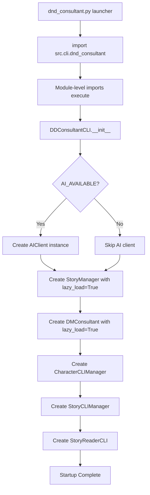
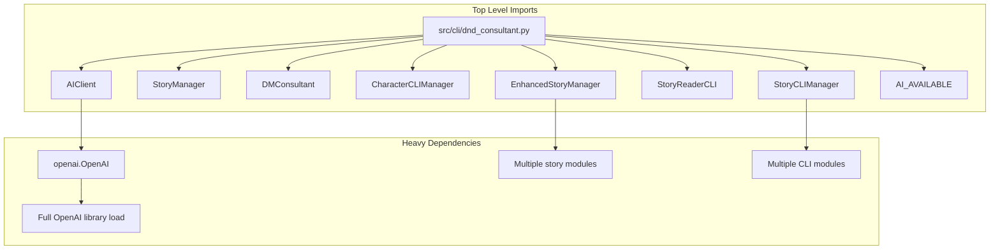
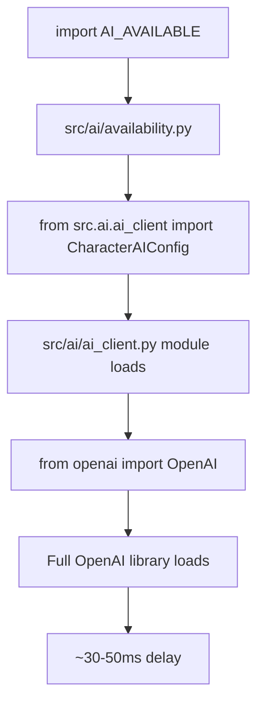

# Startup Performance Optimization Plan

## Overview

This document describes the design for further startup performance optimizations
in the D&D Character Consultant System. The primary optimization (lazy character
loading) has been completed, reducing startup time from 2-5 seconds to under
0.1 seconds. This plan addresses remaining optimization opportunities to achieve
near-instant startup.

### Current State

| Metric | Before Lazy Loading | After Lazy Loading |
|--------|---------------------|-------------------|
| Startup Time | 2-5 seconds | < 0.1 seconds |
| Character Loading | Eager at startup | On-demand |
| AI Client Import | At module level | At module level |
| CLI Module Imports | At module level | At module level |

### Target State

| Metric | Current | Target |
|--------|---------|--------|
| Startup Time | < 0.1 seconds | < 0.05 seconds |
| AI Client Import | Module level | On-demand |
| CLI Module Imports | Module level | On-demand |
| Memory Footprint | Reduced | Minimal |

---

## Current Startup Flow Analysis

### Entry Point Flow



### Module Import Chain

When `dnd_consultant.py` executes `from src.cli.dnd_consultant import main`,
the following import chain triggers:



### Current Lazy Loading Implementation

The existing lazy loading pattern in [`CharacterLoadingMixin`](src/stories/character_loading_base.py:14):

```python
class CharacterLoadingMixin:
    """Mixin providing lazy character loading methods."""

    def ensure_characters_loaded(self):
        """Ensure all characters are loaded - lazy loading compatible."""
        if not self._characters_loaded:
            self.load_characters()

    def is_characters_loaded(self) -> bool:
        """Check if characters have been loaded."""
        return self._characters_loaded
```

The [`AIImportManager`](src/ai/lazy_imports.py:13) pattern:

```python
class AIImportManager:
    """Manages lazy loading of AI imports."""

    _ai_available: Any = None
    _loaded: bool = False

    @classmethod
    def ensure_loaded(cls) -> None:
        """Load AI imports if not already loaded."""
        if cls._loaded:
            return
        # ... lazy import logic
```

---

## Remaining Optimization Opportunities

### 1. CLI Module Lazy Imports in dnd_consultant.py

**Location:** [`src/cli/dnd_consultant.py`](src/cli/dnd_consultant.py:9) lines 9-16

**Current Code:**
```python
from src.stories.enhanced_story_manager import EnhancedStoryManager
from src.stories.story_manager import StoryManager
from src.dm.dungeon_master import DMConsultant
from src.cli.cli_character_manager import CharacterCLIManager
from src.cli.cli_story_manager import StoryCLIManager
from src.cli.cli_story_reader import StoryReaderCLI
from src.ai.ai_client import AIClient
from src.ai.availability import AI_AVAILABLE
```

**Impact:** These imports load multiple module chains before the CLI class
is even instantiated. Each import triggers its own dependency chain.

**Import Dependency Analysis:**

| Import | Dependencies Loaded | Estimated Time |
|--------|---------------------|----------------|
| `EnhancedStoryManager` | 15+ modules | ~20ms |
| `StoryManager` | 10+ modules | ~15ms |
| `DMConsultant` | 8+ modules | ~10ms |
| `CharacterCLIManager` | 6+ modules | ~8ms |
| `StoryCLIManager` | 20+ modules | ~25ms |
| `StoryReaderCLI` | 4+ modules | ~5ms |
| `AIClient` | OpenAI library | ~30ms |
| `AI_AVAILABLE` | Triggers ai_client | ~30ms |

### 2. OpenAI Import at Module Level

**Location:** [`src/ai/ai_client.py`](src/ai/ai_client.py:12) lines 12-13

**Current Code:**
```python
from openai import OpenAI
from openai.types.chat import ChatCompletionMessageParam
```

**Impact:** The OpenAI library is heavy. Importing it at module level means
any module that imports `AIClient` or even `AI_AVAILABLE` triggers the full
OpenAI library load.

**Import Chain:**


### 3. CLI Story Manager Heavy Imports

**Location:** [`src/cli/cli_story_manager.py`](src/cli/cli_story_manager.py:10) lines 10-54

**Current Code includes 20+ imports:**
```python
from src.cli.party_config_manager import (...)
from src.stories.story_workflow_orchestrator import (...)
from src.stories.story_ai_generator import generate_story_from_prompt
from src.stories.story_file_manager import (...)
from src.stories.story_updater import StoryUpdater
from src.stories.session_results_manager import (...)
from src.stories.character_action_analyzer import extract_character_actions
from src.cli.story_amender_cli_handler import StoryAmenderCLIHandler
from src.characters.character_consistency import create_character_development_file
from src.ai.ai_client import AIClient
# ... 10+ more imports
```

**Impact:** This module is imported by `dnd_consultant.py` at startup, loading
the entire story processing pipeline before any story operation is requested.

### 4. Other Heavy Imports

**Character Profile Module:**
[`src/characters/consultants/character_profile.py`](src/characters/consultants/character_profile.py:14) imports `AIImportManager` but also has:

```python
from src.characters.character_sheet import DnDClass
from src.utils.file_io import load_json_file, save_json_file
```

**Consultant Core Module:**
[`src/characters/consultants/consultant_core.py`](src/characters/consultants/consultant_core.py:10) imports multiple consultant components:

```python
from src.characters.consultants.class_knowledge import get_class_knowledge
from src.characters.consultants.consultant_dc import DCCalculator
from src.characters.consultants.consultant_story import StoryAnalyzer
from src.characters.consultants.consultant_ai import AIConsultant
```

---

## Implementation Approach

### Phase 1: CLI Entry Point Lazy Imports

Create a lazy import manager for CLI modules in `src/cli/lazy_imports.py`:

```python
"""
Lazy loader for CLI module imports.

Defers heavy CLI module imports until actually needed,
reducing startup time by avoiding premature module loading.
"""

from typing import Any, Callable, Optional, TypeVar
import importlib
from functools import wraps

T = TypeVar('T')


class CLILazyLoader:
    """Manages lazy loading of CLI module imports."""

    _instances: dict = {}

    @classmethod
    def get_story_manager(cls, *args, **kwargs):
        """Lazily import and create StoryManager."""
        if 'story_manager_class' not in cls._instances:
            from src.stories.story_manager import StoryManager
            cls._instances['story_manager_class'] = StoryManager
        return cls._instances['story_manager_class'](*args, **kwargs)

    @classmethod
    def get_enhanced_story_manager(cls, *args, **kwargs):
        """Lazily import and create EnhancedStoryManager."""
        if 'enhanced_story_manager_class' not in cls._instances:
            from src.stories.enhanced_story_manager import EnhancedStoryManager
            cls._instances['enhanced_story_manager_class'] = EnhancedStoryManager
        return cls._instances['enhanced_story_manager_class'](*args, **kwargs)

    @classmethod
    def get_dm_consultant(cls, *args, **kwargs):
        """Lazily import and create DMConsultant."""
        if 'dm_consultant_class' not in cls._instances:
            from src.dm.dungeon_master import DMConsultant
            cls._instances['dm_consultant_class'] = DMConsultant
        return cls._instances['dm_consultant_class'](*args, **kwargs)

    @classmethod
    def get_character_cli_manager(cls, *args, **kwargs):
        """Lazily import and create CharacterCLIManager."""
        if 'character_cli_manager_class' not in cls._instances:
            from src.cli.cli_character_manager import CharacterCLIManager
            cls._instances['character_cli_manager_class'] = CharacterCLIManager
        return cls._instances['character_cli_manager_class'](*args, **kwargs)

    @classmethod
    def get_story_cli_manager(cls, *args, **kwargs):
        """Lazily import and create StoryCLIManager."""
        if 'story_cli_manager_class' not in cls._instances:
            from src.cli.cli_story_manager import StoryCLIManager
            cls._instances['story_cli_manager_class'] = StoryCLIManager
        return cls._instances['story_cli_manager_class'](*args, **kwargs)

    @classmethod
    def get_story_reader_cli(cls, *args, **kwargs):
        """Lazily import and create StoryReaderCLI."""
        if 'story_reader_cli_class' not in cls._instances:
            from src.cli.cli_story_reader import StoryReaderCLI
            cls._instances['story_reader_cli_class'] = StoryReaderCLI
        return cls._instances['story_reader_cli_class'](*args, **kwargs)

    @classmethod
    def is_ai_available(cls) -> bool:
        """Check AI availability without triggering heavy imports."""
        # Use the existing AIImportManager pattern
        from src.ai.lazy_imports import AIImportManager
        return AIImportManager.is_available()

    @classmethod
    def get_ai_client(cls, *args, **kwargs):
        """Lazily import and create AIClient."""
        if 'ai_client_class' not in cls._instances:
            from src.ai.ai_client import AIClient
            cls._instances['ai_client_class'] = AIClient
        return cls._instances['ai_client_class'](*args, **kwargs)
```

**Updated dnd_consultant.py:**
```python
"""
Main D&D Character Consultant Interface
VSCode-integrated system for story management and character consultation.
"""

import argparse
import os
from typing import Optional
from src.cli.lazy_imports import CLILazyLoader


class DDConsultantCLI:
    """Command-line interface for the D&D Character Consultant system."""

    def __init__(self, workspace_path: str = "", campaign_name: str = ""):
        self.workspace_path = workspace_path or os.getcwd()

        # Initialize AI client lazily if available
        ai_client = None
        if CLILazyLoader.is_ai_available():
            try:
                ai_client = CLILazyLoader.get_ai_client()
            except (ValueError, OSError) as e:
                print(f"[WARNING] AI initialization failed: {e}")
                print("[INFO] Story generation will use templates only.")

        # Create managers lazily
        if campaign_name:
            self.story_manager = CLILazyLoader.get_enhanced_story_manager(
                self.workspace_path,
                campaign_name=campaign_name,
                ai_client=ai_client,
                lazy_load=True,
            )
        else:
            self.story_manager = CLILazyLoader.get_story_manager(
                self.workspace_path, ai_client=ai_client, lazy_load=True
            )

        self.dm_consultant = CLILazyLoader.get_dm_consultant(
            self.workspace_path, ai_client=None, lazy_load=True
        )

        # Initialize manager modules lazily
        self._character_manager = None
        self._story_cli = None
        self._story_reader = None

    @property
    def character_manager(self):
        """Lazily initialize character manager."""
        if self._character_manager is None:
            self._character_manager = CLILazyLoader.get_character_cli_manager(
                self.story_manager, None, self.dm_consultant
            )
        return self._character_manager

    @property
    def story_cli(self):
        """Lazily initialize story CLI manager."""
        if self._story_cli is None:
            self._story_cli = CLILazyLoader.get_story_cli_manager(
                self.story_manager, self.workspace_path, self.dm_consultant
            )
        return self._story_cli

    @property
    def story_reader(self):
        """Lazily initialize story reader."""
        if self._story_reader is None:
            self._story_reader = CLILazyLoader.get_story_reader_cli(
                self.workspace_path
            )
        return self._story_reader

    # ... rest of class unchanged
```

### Phase 2: OpenAI Deferred Import

Modify [`src/ai/ai_client.py`](src/ai/ai_client.py:12) to defer OpenAI import:

**Current approach:**
```python
from openai import OpenAI
from openai.types.chat import ChatCompletionMessageParam
```

**Proposed approach:**
```python
"""
AI Client Module - Flexible OpenAI-compatible client for LLM integration
Supports OpenAI, Ollama, OpenRouter, and other OpenAI-compatible providers
"""

import os
import json
import re
import ast
from typing import Dict, Any, Optional, Sequence, TYPE_CHECKING
from dataclasses import dataclass, field

# Use TYPE_CHECKING for type hints without runtime import
if TYPE_CHECKING:
    from openai import OpenAI
    from openai.types.chat import ChatCompletionMessageParam


def _get_openai_client(api_key: Optional[str], base_url: Optional[str]):
    """Lazily import and create OpenAI client.

    Defers the heavy OpenAI import until actually needed.
    """
    from openai import OpenAI

    client_kwargs = {}
    if api_key and isinstance(api_key, str) and api_key.strip():
        client_kwargs["api_key"] = api_key
    if base_url and isinstance(base_url, str) and base_url.strip():
        client_kwargs["base_url"] = base_url

    allowed_keys = {"api_key", "base_url"}
    filtered_kwargs = {
        k: v for k, v in client_kwargs.items() if k in allowed_keys and v
    }

    return OpenAI(**filtered_kwargs)


class AIClient:
    """
    Flexible AI client that works with any OpenAI-compatible API.
    """

    def __init__(
        self,
        api_key: Optional[str] = None,
        base_url: Optional[str] = None,
        model: Optional[str] = None,
        **config,
    ):
        """Initialize AI client with configuration."""
        self.api_key = api_key or os.getenv("OPENAI_API_KEY", "")
        self.base_url = base_url or os.getenv("OPENAI_BASE_URL", None)
        self.model = model or os.getenv("OPENAI_MODEL", "gpt-3.5-turbo")
        self.default_temperature = config.get("default_temperature", 0.7)
        self.default_max_tokens = config.get("default_max_tokens", 1000)

        # Defer OpenAI client creation until first use
        self._client = None

    @property
    def client(self):
        """Lazily create OpenAI client on first access."""
        if self._client is None:
            self._client = _get_openai_client(self.api_key, self.base_url)
        return self._client

    def chat_completion(
        self,
        messages: Sequence["ChatCompletionMessageParam"],
        model: Optional[str] = None,
        temperature: Optional[float] = None,
        max_tokens: Optional[int] = None,
        **kwargs,
    ) -> str:
        """Get a chat completion from the LLM."""
        # Access self.client to trigger lazy initialization
        response = self.client.chat.completions.create(
            # ... rest of method
        )
```

### Phase 3: AI Availability Check Optimization

Modify [`src/ai/availability.py`](src/ai/availability.py:10) to avoid triggering
OpenAI import:

**Current approach:**
```python
try:
    from src.ai.ai_client import CharacterAIConfig
    AI_AVAILABLE = True
except ImportError:
    AI_AVAILABLE = False
    CharacterAIConfig = None
```

**Proposed approach:**
```python
"""Centralized AI availability check.

Checks AI availability without triggering heavy OpenAI imports.
Uses environment variable check first, then validates import capability.
"""

import os
import importlib.util


def _check_ai_available() -> bool:
    """Check if AI is available without importing heavy modules.

    Returns:
        True if OpenAI library is installed and API key is configured.
    """
    # Fast check: API key must be configured
    if not os.getenv("OPENAI_API_KEY"):
        return False

    # Fast check: OpenAI library must be installed
    # Use importlib.util to check without actually importing
    spec = importlib.util.find_spec("openai")
    return spec is not None


# Lazy-loaded CharacterAIConfig - only loaded when actually accessed
_CharacterAIConfig = None


def get_character_ai_config():
    """Get CharacterAIConfig class, loading it lazily."""
    global _CharacterAIConfig
    if _CharacterAIConfig is None:
        try:
            from src.ai.ai_client import CharacterAIConfig
            _CharacterAIConfig = CharacterAIConfig
        except ImportError:
            pass
    return _CharacterAIConfig


# Module-level constants for backward compatibility
AI_AVAILABLE = _check_ai_available()


def __getattr__(name):
    """Lazy attribute access for backward compatibility."""
    if name == "CharacterAIConfig":
        return get_character_ai_config()
    raise AttributeError(f"module {__name__!r} has no attribute {name!r}")
```

### Phase 4: CLI Story Manager Lazy Imports

Modify [`src/cli/cli_story_manager.py`](src/cli/cli_story_manager.py:10) to use
function-level imports for heavy dependencies:

**Pattern for lazy imports in methods:**
```python
class StoryCLIManager:
    """Manages story-related CLI operations."""

    def __init__(self, story_manager, workspace_path, dm_consultant=None):
        self.story_manager = story_manager
        self.workspace_path = workspace_path
        self.dm_consultant = dm_consultant
        # Defer heavy initializations
        self._analysis_cli = None
        self._consultations_cli = None

    @property
    def analysis_cli(self):
        """Lazily create StoryAnalysisCLI."""
        if self._analysis_cli is None:
            from src.cli.cli_story_analysis import StoryAnalysisCLI
            self._analysis_cli = StoryAnalysisCLI(self.story_manager)
        return self._analysis_cli

    def manage_stories(self):
        """Story management submenu."""
        # Import heavy modules only when this method is called
        from src.stories.story_ai_generator import generate_story_from_prompt
        from src.stories.story_file_manager import create_new_story_series
        # ... rest of method
```

---

## Measurement Strategy

### Benchmark Script

Create `scripts/benchmark_startup.py`:

```python
#!/usr/bin/env python
"""
Startup Performance Benchmark Script

Measures startup time and identifies slow imports.
Run with: python scripts/benchmark_startup.py
"""

import time
import sys
import cProfile
import pstats
from io import StringIO


def measure_startup_time():
    """Measure total startup time."""
    start = time.perf_counter()

    # Simulate the import chain
    import dnd_consultant  # noqa: F401

    elapsed = time.perf_counter() - start
    return elapsed


def profile_imports():
    """Profile import performance."""
    profiler = cProfile.Profile()
    profiler.enable()

    import dnd_consultant  # noqa: F401

    profiler.disable()

    s = StringIO()
    ps = pstats.Stats(profiler, stream=s).sort_stats('cumulative')
    ps.print_stats(30)  # Top 30 slowest

    return s.getvalue()


def measure_module_import_times():
    """Measure individual module import times."""
    modules_to_test = [
        'src.stories.story_manager',
        'src.stories.enhanced_story_manager',
        'src.dm.dungeon_master',
        'src.cli.cli_story_manager',
        'src.ai.ai_client',
        'openai',
    ]

    results = {}
    for module in modules_to_test:
        # Clear from cache if already imported
        if module in sys.modules:
            del sys.modules[module]

        start = time.perf_counter()
        try:
            __import__(module)
            elapsed = time.perf_counter() - start
            results[module] = elapsed
        except ImportError as e:
            results[module] = f"Error: {e}"

    return results


def main():
    """Run all benchmarks."""
    print("=" * 60)
    print("D&D Character Consultant - Startup Performance Benchmark")
    print("=" * 60)
    print()

    print("1. Total Startup Time")
    print("-" * 40)
    total_time = measure_startup_time()
    print(f"   Total: {total_time*1000:.2f}ms")
    print()

    print("2. Module Import Times")
    print("-" * 40)
    module_times = measure_module_import_times()
    for module, time_taken in sorted(module_times.items(), key=lambda x: -x[1] if isinstance(x[1], float) else 0):
        if isinstance(time_taken, float):
            print(f"   {module}: {time_taken*1000:.2f}ms")
        else:
            print(f"   {module}: {time_taken}")
    print()

    print("3. Import Profile (Top 30)")
    print("-" * 40)
    profile = profile_imports()
    print(profile)


if __name__ == "__main__":
    main()
```

### Performance Targets

| Metric | Current | Phase 1 | Phase 2 | Phase 3 | Final Target |
|--------|---------|---------|---------|---------|--------------|
| Total Startup | <100ms | <80ms | <60ms | <50ms | <50ms |
| OpenAI Import | 30-50ms | 30-50ms | 0ms* | 0ms* | 0ms* |
| CLI Module Imports | 50-80ms | <30ms | <30ms | <20ms | <20ms |
| AI Availability Check | 30-50ms | 30-50ms | 30-50ms | <5ms | <5ms |

*OpenAI import deferred until actual AI operation is performed.

### Regression Testing

Add startup time test to test suite:

```python
# tests/test_startup_performance.py
"""
Startup Performance Tests

Validates that startup time remains under target threshold.
"""

import time
import subprocess
import sys


STARTUP_TIME_THRESHOLD_MS = 100  # Target: under 100ms


def test_startup_time():
    """Test that startup completes within threshold."""
    script = """
import time
start = time.perf_counter()
import dnd_consultant
elapsed = time.perf_counter() - start
print(f"STARTUP_TIME_MS:{elapsed*1000:.2f}")
"""

    result = subprocess.run(
        [sys.executable, "-c", script],
        capture_output=True,
        text=True,
    )

    # Parse output
    for line in result.stdout.splitlines():
        if line.startswith("STARTUP_TIME_MS:"):
            time_ms = float(line.split(":")[1])
            assert time_ms < STARTUP_TIME_THRESHOLD_MS, (
                f"Startup time {time_ms:.2f}ms exceeds threshold "
                f"{STARTUP_TIME_THRESHOLD_MS}ms"
            )
            return

    raise AssertionError("Could not parse startup time from output")
```

---

## Risk Assessment

### Risk Matrix

| Risk | Likelihood | Impact | Mitigation |
|------|------------|--------|------------|
| Circular imports | Medium | High | Careful dependency analysis |
| Type hint breakage | Low | Medium | Use TYPE_CHECKING pattern |
| Property access overhead | Low | Low | Minimal - first access only |
| Backward compatibility | Medium | Medium | Use `__getattr__` pattern |
| Test failures | Medium | Medium | Update tests for lazy loading |
| Debugging difficulty | Low | Low | Add debug logging option |

### Circular Import Risks

The lazy loading approach can introduce circular imports if not carefully
designed. Key risk areas:

1. **AI Client <-> Availability**: Currently `availability.py` imports from
   `ai_client.py`. The proposed change breaks this by using `importlib.util`
   for availability checking.

2. **CLI Manager <-> Story Manager**: `cli_story_manager.py` imports from
   multiple story modules. Lazy imports in methods avoid this.

3. **Character Profile <-> AI**: `character_profile.py` imports `AIImportManager`.
   This is already lazy and safe.

### Backward Compatibility

The `__getattr__` pattern in `availability.py` maintains backward compatibility:

```python
# Old code still works:
from src.ai.availability import AI_AVAILABLE, CharacterAIConfig

# New code can use lazy access:
from src.ai.availability import AI_AVAILABLE
config = get_character_ai_config()  # Only loads when called
```

### Testing Considerations

Tests that mock or patch AI client need to account for lazy loading:

```python
# Old test pattern - may fail with lazy loading
def test_ai_client():
    with patch('src.ai.ai_client.OpenAI'):
        from src.ai.ai_client import AIClient
        client = AIClient()

# New test pattern - works with lazy loading
def test_ai_client():
    from src.ai.ai_client import AIClient
    with patch('src.ai.ai_client.OpenAI'):
        client = AIClient()
        _ = client.chat_completion  # Force lazy initialization
```

---

## Testing Requirements

### Unit Tests

1. **CLILazyLoader Tests** (`tests/cli/test_lazy_imports.py`)
   - Test each lazy loader method returns correct class
   - Test classes are cached after first load
   - Test error handling for missing modules

2. **AIClient Lazy Initialization Tests** (`tests/ai/test_ai_client_lazy.py`)
   - Test client is None before first access
   - Test client is created on first access
   - Test client is reused on subsequent access

3. **AI Availability Tests** (`tests/ai/test_availability_lazy.py`)
   - Test AI_AVAILABLE is False without API key
   - Test AI_AVAILABLE is True with API key and OpenAI installed
   - Test CharacterAIConfig is lazily loaded

### Integration Tests

1. **Startup Flow Test** (`tests/integration/test_startup_flow.py`)
   - Test complete startup without AI configured
   - Test startup with AI configured
   - Test first AI operation triggers lazy load

2. **CLI Operation Tests** (`tests/integration/test_cli_operations.py`)
   - Test character management works
   - Test story management works
   - Test story reading works

### Performance Tests

1. **Startup Benchmark Test** (`tests/performance/test_startup_benchmark.py`)
   - Measure startup time
   - Compare against threshold
   - Track trends over time

---

## Implementation Phases

### Phase 1: CLI Entry Point Lazy Imports

**Scope:** Create `CLILazyLoader` and update `dnd_consultant.py`

**Files Changed:**
- `src/cli/lazy_imports.py` (new)
- `src/cli/dnd_consultant.py` (modified)

**Dependencies:** None

**Validation:**
- Run existing test suite
- Run startup benchmark
- Manual CLI testing

### Phase 2: OpenAI Deferred Import

**Scope:** Modify `ai_client.py` to defer OpenAI import

**Files Changed:**
- `src/ai/ai_client.py` (modified)

**Dependencies:** Phase 1 (to avoid breaking availability check)

**Validation:**
- Run AI-related tests
- Test with/without OpenAI installed
- Test with/without API key configured

### Phase 3: AI Availability Check Optimization

**Scope:** Modify `availability.py` to avoid triggering imports

**Files Changed:**
- `src/ai/availability.py` (modified)

**Dependencies:** Phase 2

**Validation:**
- Run all tests
- Test AI availability detection
- Test CharacterAIConfig lazy loading

### Phase 4: CLI Story Manager Lazy Imports

**Scope:** Convert `cli_story_manager.py` to use method-level imports

**Files Changed:**
- `src/cli/cli_story_manager.py` (modified)

**Dependencies:** Phase 1

**Validation:**
- Run CLI tests
- Test story management operations
- Test story analysis operations

### Phase 5: Final Validation and Documentation

**Scope:** Run full test suite, update documentation

**Files Changed:**
- `README.md` (update startup time claims)
- `AGENTS.md` (add lazy loading patterns)
- `tests/performance/test_startup_benchmark.py` (new)

**Dependencies:** Phases 1-4

**Validation:**
- Full test suite pass
- Pylint 10.00/10
- Startup benchmark under 50ms

---

## Summary

This plan outlines a systematic approach to further optimize startup performance
in the D&D Character Consultant System. The key improvements are:

1. **CLI Module Lazy Imports**: Defer heavy CLI module imports until needed
2. **OpenAI Deferred Import**: Move OpenAI import from module-level to first use
3. **AI Availability Optimization**: Check availability without importing OpenAI
4. **CLI Story Manager Optimization**: Use method-level imports for heavy dependencies

The implementation is broken into phases to allow incremental progress with
testing at each stage. The target is to achieve startup times under 50ms while
maintaining backward compatibility and code quality standards.
