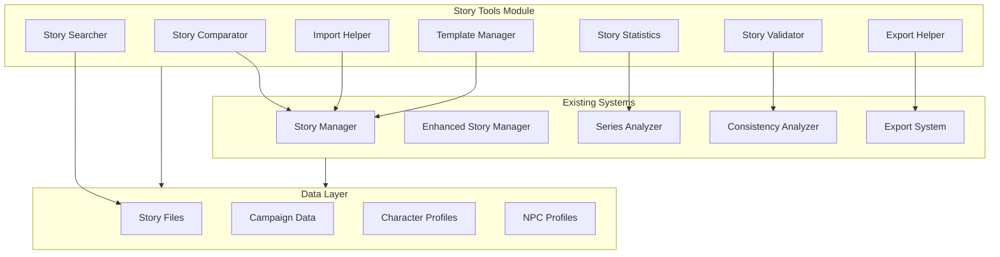

# Story Tools Design Plan

## Overview

This document describes the design for a comprehensive Story Tools system for the D&D Character Consultant System. Story Tools are utility functions and helpers that enhance story management capabilities beyond the core story creation and analysis features.

### What Are Story Tools?

Story Tools are a collection of utility functions and helpers that provide:
- Story comparison and version tracking
- Content search across stories
- Statistics and analytics
- Import/export helpers
- Template and snippet management
- Validation and quality checks

### Goals

1. **Enhanced Story Management**: Provide tools that go beyond basic story creation
2. **Cross-Story Analysis**: Enable searching and comparing content across stories
3. **Quality Assurance**: Help DMs maintain consistency and quality
4. **Workflow Efficiency**: Reduce manual effort in story management
5. **Integration**: Work seamlessly with existing story modules

---

## Problem Statement

### Current Limitations

1. **No Story Comparison**: Cannot compare different versions of stories or track changes
2. **No Cross-Story Search**: No way to find content across multiple story files
3. **Limited Statistics**: No word counts, character appearance tracking, or analytics
4. **Manual Export**: Export functionality exists but lacks story-specific helpers
5. **No Import Support**: Cannot import stories from external formats
6. **Basic Templates**: Only one story template exists with no snippet system

### Evidence from Codebase

| Current State | Location | Limitation |
|---------------|----------|------------|
| No diff/comparison | N/A | Cannot track story changes |
| No search utility | N/A | Cannot find content across stories |
| No statistics module | N/A | No analytics on story content |
| Basic export | `plans/export_functionality_plan.md` | Needs story-specific helpers |
| No import | N/A | Cannot import from external formats |
| Single template | `templates/story_template.md` | Limited template support |

---

## Inventory of Existing Story Tools

### Core Story Modules

| Module | Purpose | Tools Provided |
|--------|---------|----------------|
| [`story_manager.py`](../src/stories/story_manager.py) | Main orchestrator | Story loading, analysis coordination |
| [`story_file_manager.py`](../src/stories/story_file_manager.py) | File operations | Create, list, sequence stories |
| [`enhanced_story_manager.py`](../src/stories/enhanced_story_manager.py) | Enhanced management | Party integration, NPC detection |
| [`story_analysis.py`](../src/stories/story_analysis.py) | Story analysis | Character action extraction |
| [`story_analyzer.py`](../src/stories/story_analyzer.py) | NPC analysis | NPC suggestions, character updates |
| [`story_updater.py`](../src/stories/story_updater.py) | Story updates | Append content, clean templates |
| [`series_analyzer.py`](../src/stories/series_analyzer.py) | Series analysis | Cross-story character development |
| [`story_consistency_analyzer.py`](../src/stories/story_consistency_analyzer.py) | Consistency checks | Behavioral consistency analysis |

### Existing Story Utilities

| Utility | Purpose | Functions |
|---------|---------|-----------|
| [`story_file_helpers.py`](../src/utils/story_file_helpers.py) | File operations | `list_story_files`, `has_numbered_story_files`, `next_filename_for_dir` |
| [`story_formatting_utils.py`](../src/utils/story_formatting_utils.py) | Formatting | `generate_consultant_notes`, `generate_consistency_section` |
| [`story_parsing_utils.py`](../src/utils/story_parsing_utils.py) | Parsing | `extract_character_actions`, `extract_dc_requests` |

### Related Plans

| Plan | Purpose | Overlap |
|------|---------|---------|
| [AI Story Suggestions](ai_story_suggestions_plan.md) | AI-powered suggestions | Complementary - uses story tools |
| [Session Notes](session_notes_plan.md) | Session integration | Complementary - provides data |
| [Timeline Tracking](timeline_tracking_plan.md) | Event tracking | Complementary - uses story tools |
| [Export Functionality](export_functionality_plan.md) | Export to formats | Story export helpers integrate here |

---

## Proposed New Story Tools

### Tool Categories

```mermaid
flowchart TD
    A[Story Tools] --> B[Comparison Tools]
    A --> C[Search Tools]
    A --> D[Statistics Tools]
    A --> E[Export Helpers]
    A --> F[Import Helpers]
    A --> G[Template Tools]
    A --> H[Validation Tools]

    B --> B1[Story Diff]
    B --> B2[Version Tracking]
    B --> B3[Change Highlights]

    C --> C1[Content Search]
    C --> C2[Character Search]
    C --> C3[Location Search]
    C --> C4[Phrase Search]

    D --> D1[Word Count]
    D --> D2[Character Appearances]
    D --> D3[Session Duration]
    D --> D4[Readability Score]

    E --> E1[Format Conversion]
    E --> E2[Batch Export]
    E --> E3[Story Bundling]

    F --> F1[Markdown Import]
    F --> F2[Text Import]
    F --> F3[JSON Import]

    G --> G1[Template Library]
    G --> G2[Snippet Manager]
    G --> G3[Custom Templates]

    H --> H1[Structure Validation]
    H --> H2[Link Validation]
    H --> H3[Consistency Checks]
```



---

## Implementation Details

### 1. Story Comparison/Diff Tool

Create `src/stories/tools/story_comparator.py`:

```python
"""Story comparison and diff utilities.

Provides tools for comparing story versions and tracking changes.
"""

from dataclasses import dataclass, field
from typing import List, Dict, Any, Optional
from enum import Enum
import difflib
from datetime import datetime


class ChangeType(Enum):
    """Types of changes between story versions."""
    ADDITION = "addition"
    DELETION = "deletion"
    MODIFICATION = "modification"
    MOVE = "move"


@dataclass
class StoryChange:
    """Represents a single change between story versions."""
    change_type: ChangeType
    line_number: int
    old_content: str
    new_content: str
    section: str  # Which markdown section changed
    significance: int  # 1-10 scale of importance


@dataclass
class StoryDiff:
    """Complete diff result between two story versions."""
    source_file: str
    target_file: str
    changes: List[StoryChange] = field(default_factory=list)
    similarity_score: float = 0.0
    summary: str = ""

    @property
    def has_changes(self) -> bool:
        """Check if there are any changes."""
        return len(self.changes) > 0

    @property
    def significant_changes(self) -> List[StoryChange]:
        """Get changes with significance >= 5."""
        return [c for c in self.changes if c.significance >= 5]


class StoryComparator:
    """Compare story files and track changes."""

    def __init__(self, workspace_path: str):
        """Initialize comparator.

        Args:
            workspace_path: Root workspace path for story files
        """
        self.workspace_path = workspace_path

    def compare_stories(
        self,
        source_path: str,
        target_path: str
    ) -> StoryDiff:
        """Compare two story files.

        Args:
            source_path: Path to source story file
            target_path: Path to target story file

        Returns:
            StoryDiff with all detected changes
        """
        # Implementation uses difflib for line-by-line comparison
        pass

    def compare_series(
        self,
        series_name: str,
        from_index: int,
        to_index: int
    ) -> List[StoryDiff]:
        """Compare stories across a series by index.

        Args:
            series_name: Name of the story series
            from_index: Starting story index
            to_index: Ending story index

        Returns:
            List of diffs between consecutive stories
        """
        pass

    def find_narrative_changes(
        self,
        diff: StoryDiff
    ) -> List[StoryChange]:
        """Extract only narrative content changes.

        Filters out metadata and formatting changes.

        Args:
            diff: StoryDiff to filter

        Returns:
            List of narrative-focused changes
        """
        pass

    def generate_change_report(
        self,
        diff: StoryDiff,
        output_format: str = "markdown"
    ) -> str:
        """Generate a formatted change report.

        Args:
            diff: StoryDiff to report
            output_format: Output format - markdown or text

        Returns:
            Formatted change report string
        """
        pass
```

### 2. Story Search Functionality

Create `src/stories/tools/story_search.py`:

```python
"""Story search utilities.

Provides search functionality across story files.
"""

from dataclasses import dataclass, field
from typing import List, Dict, Any, Optional, Callable
from enum import Enum
import re
from pathlib import Path


class SearchScope(Enum):
    """Scope for story searches."""
    CURRENT_STORY = "current"
    CURRENT_SERIES = "series"
    ALL_CAMPAIGNS = "all"


class SearchType(Enum):
    """Types of searches."""
    TEXT = "text"
    CHARACTER = "character"
    LOCATION = "location"
    ITEM = "item"
    NPC = "npc"
    REGEX = "regex"


@dataclass
class SearchResult:
    """A single search result."""
    file_path: str
    line_number: int
    line_content: str
    match_start: int
    match_end: int
    context_before: str
    context_after: str
    relevance_score: float = 1.0


@dataclass
class SearchResults:
    """Collection of search results."""
    query: str
    search_type: SearchType
    scope: SearchScope
    results: List[SearchResult] = field(default_factory=list)
    total_matches: int = 0
    files_searched: int = 0

    def group_by_file(self) -> Dict[str, List[SearchResult]]:
        """Group results by file path."""
        grouped: Dict[str, List[SearchResult]] = {}
        for result in self.results:
            if result.file_path not in grouped:
                grouped[result.file_path] = []
            grouped[result.file_path].append(result)
        return grouped


class StorySearcher:
    """Search across story files."""

    def __init__(self, workspace_path: str):
        """Initialize searcher.

        Args:
            workspace_path: Root workspace path
        """
        self.workspace_path = workspace_path

    def search(
        self,
        query: str,
        search_type: SearchType = SearchType.TEXT,
        scope: SearchScope = SearchScope.CURRENT_SERIES,
        case_sensitive: bool = False,
        whole_word: bool = False
    ) -> SearchResults:
        """Search for content in stories.

        Args:
            query: Search query string
            search_type: Type of search to perform
            scope: Scope of the search
            case_sensitive: Whether search is case sensitive
            whole_word: Whether to match whole words only

        Returns:
            SearchResults with all matches
        """
        pass

    def search_character(
        self,
        character_name: str,
        scope: SearchScope = SearchScope.ALL_CAMPAIGNS
    ) -> SearchResults:
        """Search for character appearances.

        Args:
            character_name: Name of character to find
            scope: Search scope

        Returns:
            SearchResults with character appearances
        """
        pass

    def search_location(
        self,
        location_name: str,
        scope: SearchScope = SearchScope.ALL_CAMPAIGNS
    ) -> SearchResults:
        """Search for location mentions.

        Args:
            location_name: Name of location to find
            scope: Search scope

        Returns:
            SearchResults with location mentions
        """
        pass

    def search_by_regex(
        self,
        pattern: str,
        scope: SearchScope = SearchScope.CURRENT_SERIES
    ) -> SearchResults:
        """Search using regular expression.

        Args:
            pattern: Regex pattern to match
            scope: Search scope

        Returns:
            SearchResults with regex matches
        """
        pass

    def find_dialogue_by_character(
        self,
        character_name: str,
        scope: SearchScope = SearchScope.CURRENT_SERIES
    ) -> SearchResults:
        """Find dialogue spoken by a character.

        Args:
            character_name: Name of character
            scope: Search scope

        Returns:
            SearchResults with dialogue matches
        """
        pass
```

### 3. Story Statistics

Create `src/stories/tools/story_statistics.py`:

```python
"""Story statistics and analytics utilities.

Provides word counts, character appearances, and other metrics.
"""

from dataclasses import dataclass, field
from typing import List, Dict, Any, Optional
from datetime import datetime
import re


@dataclass
class CharacterAppearance:
    """Statistics for a character appearance."""
    character_name: str
    mention_count: int
    dialogue_count: int
    action_count: int
    first_appearance_line: int
    last_appearance_line: int
    scenes_present: List[str] = field(default_factory=list)


@dataclass
class StoryMetrics:
    """Metrics for a single story file."""
    file_path: str
    word_count: int
    character_count: int  # Characters in text, not D&D characters
    sentence_count: int
    paragraph_count: int
    reading_time_minutes: float
    character_appearances: Dict[str, CharacterAppearance] = field(default_factory=dict)
    location_mentions: Dict[str, int] = field(default_factory=dict)
    dialogue_percentage: float = 0.0
    combat_percentage: float = 0.0
    exploration_percentage: float = 0.0


@dataclass
class SeriesMetrics:
    """Aggregated metrics for a story series."""
    series_name: str
    total_stories: int
    total_word_count: int
    total_reading_time_minutes: float
    average_story_length: float
    character_appearances: Dict[str, int] = field(default_factory=dict)
    location_mentions: Dict[str, int] = field(default_factory=dict)
    story_metrics: List[StoryMetrics] = field(default_factory=list)


class StoryStatistics:
    """Calculate statistics for stories."""

    def __init__(self, workspace_path: str):
        """Initialize statistics calculator.

        Args:
            workspace_path: Root workspace path
        """
        self.workspace_path = workspace_path

    def calculate_story_metrics(
        self,
        story_path: str,
        character_names: Optional[List[str]] = None
    ) -> StoryMetrics:
        """Calculate metrics for a single story.

        Args:
            story_path: Path to story file
            character_names: Optional list of character names to track

        Returns:
            StoryMetrics for the story
        """
        pass

    def calculate_series_metrics(
        self,
        series_name: str,
        character_names: Optional[List[str]] = None
    ) -> SeriesMetrics:
        """Calculate aggregated metrics for a series.

        Args:
            series_name: Name of the story series
            character_names: Optional list of character names to track

        Returns:
            SeriesMetrics for the entire series
        """
        pass

    def get_character_appearance_timeline(
        self,
        character_name: str,
        series_name: str
    ) -> List[Dict[str, Any]]:
        """Get timeline of character appearances across series.

        Args:
            character_name: Name of character to track
            series_name: Name of the series

        Returns:
            List of appearance records by story
        """
        pass

    def calculate_readability_score(
        self,
        story_path: str
    ) -> Dict[str, float]:
        """Calculate readability scores for a story.

        Uses Flesch-Kincaid and other readability formulas.

        Args:
            story_path: Path to story file

        Returns:
            Dictionary with readability scores
        """
        pass

    def generate_statistics_report(
        self,
        metrics: StoryMetrics,
        output_format: str = "markdown"
    ) -> str:
        """Generate a formatted statistics report.

        Args:
            metrics: StoryMetrics to report
            output_format: Output format - markdown or text

        Returns:
            Formatted statistics report
        """
        pass
```

### 4. Story Export Helpers

Create `src/stories/tools/story_export_helpers.py`:

```python
"""Story-specific export helpers.

Provides utilities for exporting stories to various formats.
Integrates with the main export functionality.
"""

from dataclasses import dataclass, field
from typing import List, Dict, Any, Optional
from pathlib import Path
from enum import Enum


class StoryExportFormat(Enum):
    """Supported export formats for stories."""
    PDF = "pdf"
    HTML = "html"
    MARKDOWN = "md"
    PLAIN_TEXT = "txt"
    DOCX = "docx"
    JSON = "json"


@dataclass
class StoryExportOptions:
    """Options for story export."""
    format: StoryExportFormat = StoryExportFormat.MARKDOWN
    include_metadata: bool = True
    include_analysis: bool = False
    include_consultant_notes: bool = False
    include_session_results: bool = True
    include_story_hooks: bool = True
    include_character_development: bool = True
    wrap_width: int = 80
    title_page: bool = True


@dataclass
class SeriesExportOptions:
    """Options for series export."""
    format: StoryExportFormat = StoryExportFormat.PDF
    combine_stories: bool = True
    include_table_of_contents: bool = True
    include_timeline: bool = True
    story_options: StoryExportOptions = field(default_factory=StoryExportOptions)


class StoryExportHelper:
    """Helper for exporting stories."""

    def __init__(self, workspace_path: str):
        """Initialize export helper.

        Args:
            workspace_path: Root workspace path
        """
        self.workspace_path = workspace_path

    def export_story(
        self,
        story_path: str,
        output_path: str,
        options: Optional[StoryExportOptions] = None
    ) -> str:
        """Export a single story to specified format.

        Args:
            story_path: Path to story file
            output_path: Path for output file
            options: Export options

        Returns:
            Path to exported file
        """
        pass

    def export_series(
        self,
        series_name: str,
        output_path: str,
        options: Optional[SeriesExportOptions] = None
    ) -> str:
        """Export an entire series.

        Args:
            series_name: Name of the series
            output_path: Path for output file or directory
            options: Export options

        Returns:
            Path to exported file or directory
        """
        pass

    def export_campaign_bundle(
        self,
        campaign_name: str,
        output_path: str,
        include_characters: bool = True,
        include_npcs: bool = True
    ) -> str:
        """Export complete campaign bundle.

        Creates a zip with all campaign content.

        Args:
            campaign_name: Name of the campaign
            output_path: Path for output zip file
            include_characters: Include character profiles
            include_npcs: Include NPC profiles

        Returns:
            Path to exported bundle
        """
        pass

    def prepare_story_for_export(
        self,
        story_path: str,
        options: StoryExportOptions
    ) -> str:
        """Prepare story content for export.

        Applies formatting and includes/excludes sections.

        Args:
            story_path: Path to story file
            options: Export options

        Returns:
            Prepared content string
        """
        pass
```

### 5. Story Import Helpers

Create `src/stories/tools/story_import_helpers.py`:

```python
"""Story import utilities.

Provides utilities for importing stories from external formats.
"""

from dataclasses import dataclass, field
from typing import List, Dict, Any, Optional
from pathlib import Path
from enum import Enum


class ImportFormat(Enum):
    """Supported import formats."""
    MARKDOWN = "md"
    PLAIN_TEXT = "txt"
    JSON = "json"
    DOCX = "docx"
    HTML = "html"


@dataclass
class ImportResult:
    """Result of an import operation."""
    success: bool
    story_path: Optional[str] = None
    warnings: List[str] = field(default_factory=list)
    errors: List[str] = field(default_factory=list)
    characters_detected: List[str] = field(default_factory=list)
    locations_detected: List[str] = field(default_factory=list)


@dataclass
class ImportOptions:
    """Options for story import."""
    format: ImportFormat = ImportFormat.MARKDOWN
    auto_detect_characters: bool = True
    auto_detect_locations: bool = True
    create_missing_npcs: bool = False
    split_on_headers: bool = True
    target_series: Optional[str] = None


class StoryImportHelper:
    """Helper for importing stories."""

    def __init__(self, workspace_path: str):
        """Initialize import helper.

        Args:
            workspace_path: Root workspace path
        """
        self.workspace_path = workspace_path

    def import_story(
        self,
        source_path: str,
        target_series: Optional[str] = None,
        options: Optional[ImportOptions] = None
    ) -> ImportResult:
        """Import a story from external file.

        Args:
            source_path: Path to source file
            target_series: Optional series to add story to
            options: Import options

        Returns:
            ImportResult with import status
        """
        pass

    def import_from_markdown(
        self,
        source_path: str,
        options: ImportOptions
    ) -> ImportResult:
        """Import from markdown file.

        Args:
            source_path: Path to markdown file
            options: Import options

        Returns:
            ImportResult with import status
        """
        pass

    def import_from_text(
        self,
        source_path: str,
        options: ImportOptions
    ) -> ImportResult:
        """Import from plain text file.

        Args:
            source_path: Path to text file
            options: Import options

        Returns:
            ImportResult with import status
        """
        pass

    def import_from_json(
        self,
        source_path: str,
        options: ImportOptions
    ) -> ImportResult:
        """Import from JSON file.

        Args:
            source_path: Path to JSON file
            options: Import options

        Returns:
            ImportResult with import status
        """
        pass

    def batch_import(
        self,
        source_directory: str,
        target_series: str,
        options: Optional[ImportOptions] = None
    ) -> List[ImportResult]:
        """Import multiple stories from directory.

        Args:
            source_directory: Directory containing source files
            target_series: Series to add stories to
            options: Import options

        Returns:
            List of ImportResults
        """
        pass

    def detect_characters_in_content(
        self,
        content: str,
        known_characters: List[str]
    ) -> List[str]:
        """Detect character names in content.

        Args:
            content: Story content to analyze
            known_characters: List of known character names

        Returns:
            List of detected character names
        """
        pass
```

### 6. Story Templates and Snippets

Create `src/stories/tools/story_templates.py`:

```python
"""Story template and snippet management.

Provides template library and snippet utilities.
"""

from dataclasses import dataclass, field
from typing import List, Dict, Any, Optional
from pathlib import Path
from enum import Enum


class TemplateCategory(Enum):
    """Categories of story templates."""
    COMBAT = "combat"
    SOCIAL = "social"
    EXPLORATION = "exploration"
    DUNGEON = "dungeon"
    URBAN = "urban"
    WILDERNESS = "wilderness"
    BOSS_FIGHT = "boss_fight"
    PUZZLE = "puzzle"
    ROLEPLAY = "roleplay"
    TRAVEL = "travel"


@dataclass
class StorySnippet:
    """A reusable story snippet."""
    name: str
    category: TemplateCategory
    content: str
    placeholders: List[str] = field(default_factory=list)
    description: str = ""
    tags: List[str] = field(default_factory=list)


@dataclass
class StoryTemplate:
    """A complete story template."""
    name: str
    category: TemplateCategory
    content: str
    placeholders: Dict[str, str] = field(default_factory=dict)
    description: str = ""
    snippets: List[StorySnippet] = field(default_factory=list)


@dataclass
class TemplateLibrary:
    """Collection of available templates."""
    templates: Dict[str, StoryTemplate] = field(default_factory=dict)
    snippets: Dict[str, StorySnippet] = field(default_factory=dict)

    def get_templates_by_category(
        self,
        category: TemplateCategory
    ) -> List[StoryTemplate]:
        """Get all templates in a category."""
        return [
            t for t in self.templates.values()
            if t.category == category
        ]


class TemplateManager:
    """Manage story templates and snippets."""

    def __init__(self, workspace_path: str):
        """Initialize template manager.

        Args:
            workspace_path: Root workspace path
        """
        self.workspace_path = workspace_path
        self.library = TemplateLibrary()
        self._load_builtin_templates()
        self._load_custom_templates()

    def _load_builtin_templates(self) -> None:
        """Load built-in templates."""
        pass

    def _load_custom_templates(self) -> None:
        """Load custom templates from workspace."""
        pass

    def get_template(
        self,
        template_name: str
    ) -> Optional[StoryTemplate]:
        """Get a template by name.

        Args:
            template_name: Name of template

        Returns:
            StoryTemplate if found, None otherwise
        """
        pass

    def apply_template(
        self,
        template_name: str,
        values: Dict[str, str]
    ) -> str:
        """Apply values to a template.

        Args:
            template_name: Name of template
            values: Dictionary of placeholder values

        Returns:
            Template content with placeholders filled
        """
        pass

    def get_snippet(
        self,
        snippet_name: str
    ) -> Optional[StorySnippet]:
        """Get a snippet by name.

        Args:
            snippet_name: Name of snippet

        Returns:
            StorySnippet if found, None otherwise
        """
        pass

    def insert_snippet(
        self,
        content: str,
        snippet_name: str,
        position: int,
        values: Optional[Dict[str, str]] = None
    ) -> str:
        """Insert a snippet into content.

        Args:
            content: Existing content
            snippet_name: Name of snippet to insert
            position: Character position to insert at
            values: Optional placeholder values

        Returns:
            Content with snippet inserted
        """
        pass

    def create_custom_template(
        self,
        name: str,
        category: TemplateCategory,
        content: str,
        description: str = ""
    ) -> StoryTemplate:
        """Create a custom template.

        Args:
            name: Template name
            category: Template category
            content: Template content
            description: Template description

        Returns:
            Created StoryTemplate
        """
        pass

    def save_custom_template(
        self,
        template: StoryTemplate
    ) -> str:
        """Save a custom template to workspace.

        Args:
            template: Template to save

        Returns:
            Path to saved template file
        """
        pass

    def list_templates(
        self,
        category: Optional[TemplateCategory] = None
    ) -> List[StoryTemplate]:
        """List available templates.

        Args:
            category: Optional category filter

        Returns:
            List of available templates
        """
        pass

    def list_snippets(
        self,
        category: Optional[TemplateCategory] = None
    ) -> List[StorySnippet]:
        """List available snippets.

        Args:
            category: Optional category filter

        Returns:
            List of available snippets
        """
        pass
```

### 7. Story Validation Tools

Create `src/stories/tools/story_validator.py`:

```python
"""Story validation utilities.

Provides validation and quality checks for stories.
"""

from dataclasses import dataclass, field
from typing import List, Dict, Any, Optional
from enum import Enum


class ValidationSeverity(Enum):
    """Severity levels for validation issues."""
    ERROR = "error"
    WARNING = "warning"
    INFO = "info"
    STYLE = "style"


@dataclass
class ValidationIssue:
    """A single validation issue."""
    rule_name: str
    severity: ValidationSeverity
    message: str
    line_number: Optional[int] = None
    suggestion: str = ""
    context: str = ""


@dataclass
class ValidationResult:
    """Result of story validation."""
    story_path: str
    is_valid: bool
    issues: List[ValidationIssue] = field(default_factory=list)
    warnings: List[ValidationIssue] = field(default_factory=list)
    style_suggestions: List[ValidationIssue] = field(default_factory=list)

    @property
    def error_count(self) -> int:
        """Count of error-level issues."""
        return len([i for i in self.issues if i.severity == ValidationSeverity.ERROR])

    @property
    def warning_count(self) -> int:
        """Count of warning-level issues."""
        return len([i for i in self.issues if i.severity == ValidationSeverity.WARNING])


class StoryValidator:
    """Validate story files for quality and consistency."""

    def __init__(self, workspace_path: str):
        """Initialize validator.

        Args:
            workspace_path: Root workspace path
        """
        self.workspace_path = workspace_path

    def validate_story(
        self,
        story_path: str,
        strict: bool = False
    ) -> ValidationResult:
        """Validate a story file.

        Args:
            story_path: Path to story file
            strict: Enable strict validation mode

        Returns:
            ValidationResult with all issues found
        """
        pass

    def validate_series(
        self,
        series_name: str,
        strict: bool = False
    ) -> Dict[str, ValidationResult]:
        """Validate all stories in a series.

        Args:
            series_name: Name of the series
            strict: Enable strict validation mode

        Returns:
            Dictionary mapping story paths to ValidationResults
        """
        pass

    def check_structure(
        self,
        content: str
    ) -> List[ValidationIssue]:
        """Check story structure.

        Validates markdown structure, headers, sections.

        Args:
            content: Story content to check

        Returns:
            List of structural issues
        """
        pass

    def check_links(
        self,
        content: str,
        story_path: str
    ) -> List[ValidationIssue]:
        """Check internal and external links.

        Args:
            content: Story content to check
            story_path: Path to story file for relative link resolution

        Returns:
            List of link issues
        """
        pass

    def check_character_consistency(
        self,
        content: str,
        character_profiles: Dict[str, Any]
    ) -> List[ValidationIssue]:
        """Check character consistency in story.

        Args:
            content: Story content to check
            character_profiles: Dictionary of character profiles

        Returns:
            List of character consistency issues
        """
        pass

    def check_spelling(
        self,
        content: str,
        custom_dictionary: Optional[List[str]] = None
    ) -> List[ValidationIssue]:
        """Check spelling in story.

        Args:
            content: Story content to check
            custom_dictionary: Optional list of custom words

        Returns:
            List of spelling issues
        """
        pass

    def check_style(
        self,
        content: str
    ) -> List[ValidationIssue]:
        """Check writing style.

        Checks for passive voice, repeated words, etc.

        Args:
            content: Story content to check

        Returns:
            List of style suggestions
        """
        pass

    def generate_validation_report(
        self,
        result: ValidationResult,
        output_format: str = "markdown"
    ) -> str:
        """Generate a formatted validation report.

        Args:
            result: ValidationResult to report
            output_format: Output format - markdown or text

        Returns:
            Formatted validation report
        """
        pass
```

---

## CLI Integration

### New CLI Commands

Add to `src/cli/dnd_consultant.py` or create new CLI module:

```python
# Story Tools CLI Commands

# Comparison Commands
story diff <story1> <story2>           # Compare two stories
story diff-series <series> <from> <to> # Compare stories in series range

# Search Commands
story search <query>                   # Search across stories
story search-character <name>          # Find character appearances
story search-location <name>           # Find location mentions

# Statistics Commands
story stats <story>                    # Show story statistics
story stats-series <series>            # Show series statistics
story timeline <character> <series>    # Character appearance timeline

# Export Commands
story export <story> <format>          # Export single story
story export-series <series> <format>  # Export entire series
story bundle <campaign>                # Create campaign bundle

# Import Commands
story import <file> [--series <name>]  # Import story from file
story import-dir <directory> <series>  # Import multiple stories

# Template Commands
story templates                        # List available templates
story apply-template <name>            # Apply template to new story
story snippets                         # List available snippets
story insert-snippet <name>            # Insert snippet into story

# Validation Commands
story validate <story>                 # Validate story file
story validate-series <series>         # Validate all stories in series
```

### CLI Implementation

Create `src/cli/cli_story_tools.py`:

```python
"""CLI commands for story tools.

Provides command-line interface for story tools functionality.
"""

import argparse
from typing import Optional, List

from src.stories.tools.story_comparator import StoryComparator
from src.stories.tools.story_search import StorySearcher, SearchType, SearchScope
from src.stories.tools.story_statistics import StoryStatistics
from src.stories.tools.story_export_helpers import StoryExportHelper, StoryExportFormat
from src.stories.tools.story_import_helpers import StoryImportHelper, ImportFormat
from src.stories.tools.story_templates import TemplateManager, TemplateCategory
from src.stories.tools.story_validator import StoryValidator


def create_story_tools_parser() -> argparse.ArgumentParser:
    """Create argument parser for story tools commands."""
    parser = argparse.ArgumentParser(
        description="Story tools for D&D Character Consultant"
    )
    subparsers = parser.add_subparsers(dest="command", help="Story tool commands")

    # Diff command
    diff_parser = subparsers.add_parser("diff", help="Compare stories")
    diff_parser.add_argument("source", help="Source story file")
    diff_parser.add_argument("target", help="Target story file")
    diff_parser.add_argument("--output", help="Output file for diff report")

    # Search command
    search_parser = subparsers.add_parser("search", help="Search stories")
    search_parser.add_argument("query", help="Search query")
    search_parser.add_argument("--type", choices=["text", "character", "location"],
                               default="text", help="Search type")
    search_parser.add_argument("--scope", choices=["current", "series", "all"],
                               default="series", help="Search scope")

    # Stats command
    stats_parser = subparsers.add_parser("stats", help="Story statistics")
    stats_parser.add_argument("story", help="Story file path")
    stats_parser.add_argument("--series", help="Series name for series stats")

    # Export command
    export_parser = subparsers.add_parser("export", help="Export story")
    export_parser.add_argument("story", help="Story file path")
    export_parser.add_argument("format", choices=["pdf", "html", "md", "txt"],
                               help="Export format")
    export_parser.add_argument("--output", help="Output file path")

    # Import command
    import_parser = subparsers.add_parser("import", help="Import story")
    import_parser.add_argument("file", help="File to import")
    import_parser.add_argument("--series", help="Target series name")

    # Template command
    template_parser = subparsers.add_parser("template", help="Template operations")
    template_parser.add_argument("action", choices=["list", "apply", "create"],
                                 help="Template action")
    template_parser.add_argument("--name", help="Template name")
    template_parser.add_argument("--category", help="Template category")

    # Validate command
    validate_parser = subparsers.add_parser("validate", help="Validate story")
    validate_parser.add_argument("story", help="Story file path")
    validate_parser.add_argument("--strict", action="store_true",
                                 help="Enable strict validation")

    return parser


def handle_story_tools_command(args, workspace_path: str) -> int:
    """Handle story tools CLI commands.

    Args:
        args: Parsed command line arguments
        workspace_path: Root workspace path

    Returns:
        Exit code
    """
    # Implementation routes to appropriate tool based on command
    pass
```

---

## Integration with Existing Systems

### Integration Points



### Integration with Story Manager

```python
# Extend StoryManager with tool access

class StoryManager:
    # ... existing code ...

    @property
    def tools(self) -> "StoryTools":
        """Access story tools."""
        if not hasattr(self, "_tools"):
            from src.stories.tools.story_tools import StoryTools
            self._tools = StoryTools(self.workspace_path)
        return self._tools
```

### Integration with Export System

The export helpers integrate with the existing export functionality plan:

```python
# In src/export/export_manager.py

from src.stories.tools.story_export_helpers import StoryExportHelper

class ExportManager:
    def export_story(self, story_path: str, format: str) -> str:
        # Use story export helper for story-specific exports
        helper = StoryExportHelper(self.workspace_path)
        return helper.export_story(story_path, format)
```

---

## Testing Requirements

### Unit Tests

Create tests in `tests/stories/tools/`:

| Test File | Coverage |
|-----------|----------|
| `test_story_comparator.py` | Comparison logic, diff generation |
| `test_story_search.py` | Search functionality, result ranking |
| `test_story_statistics.py` | Metrics calculation, aggregation |
| `test_story_export_helpers.py` | Export preparation, format handling |
| `test_story_import_helpers.py` | Import parsing, character detection |
| `test_story_templates.py` | Template loading, placeholder substitution |
| `test_story_validator.py` | Validation rules, issue detection |

### Test Data Requirements

Use existing test data:
- `game_data/campaigns/Example_Campaign/` - Story files for testing
- `game_data/characters/` - Character profiles for consistency tests
- `game_data/npcs/` - NPC profiles for detection tests

### Test Coverage Goals

| Module | Target Coverage |
|--------|-----------------|
| story_comparator.py | 90% |
| story_search.py | 95% |
| story_statistics.py | 90% |
| story_export_helpers.py | 85% |
| story_import_helpers.py | 85% |
| story_templates.py | 90% |
| story_validator.py | 90% |

---

## Implementation Phases

### Phase 1: Core Tools

**Priority: High**

1. Story Search functionality
   - Basic text search
   - Character search
   - Location search

2. Story Statistics
   - Word count
   - Character appearances
   - Basic metrics

**Dependencies:** None

**Deliverables:**
- `src/stories/tools/story_search.py`
- `src/stories/tools/story_statistics.py`
- Unit tests for both modules

### Phase 2: Comparison and Validation

**Priority: High**

1. Story Comparison/Diff
   - Line-by-line comparison
   - Change categorization
   - Report generation

2. Story Validation
   - Structure validation
   - Link checking
   - Basic consistency checks

**Dependencies:** Phase 1

**Deliverables:**
- `src/stories/tools/story_comparator.py`
- `src/stories/tools/story_validator.py`
- Unit tests for both modules

### Phase 3: Import/Export Helpers

**Priority: Medium**

1. Export Helpers
   - Story-specific export logic
   - Series export
   - Campaign bundling

2. Import Helpers
   - Markdown import
   - Text import
   - Character detection

**Dependencies:** Phase 1, Export Functionality plan

**Deliverables:**
- `src/stories/tools/story_export_helpers.py`
- `src/stories/tools/story_import_helpers.py`
- Unit tests for both modules

### Phase 4: Templates and CLI

**Priority: Medium**

1. Template System
   - Template library
   - Snippet management
   - Custom templates

2. CLI Integration
   - All story tool commands
   - Help documentation
   - Output formatting

**Dependencies:** Phases 1-3

**Deliverables:**
- `src/stories/tools/story_templates.py`
- `src/cli/cli_story_tools.py`
- Unit tests and integration tests

---

## File Structure

```
src/stories/tools/
|-- __init__.py
|-- story_comparator.py      # Story comparison and diff
|-- story_search.py          # Search functionality
|-- story_statistics.py      # Statistics and metrics
|-- story_export_helpers.py  # Export utilities
|-- story_import_helpers.py  # Import utilities
|-- story_templates.py       # Template management
|-- story_validator.py       # Validation tools
|-- story_tools.py           # Unified access point

src/cli/
|-- cli_story_tools.py       # CLI commands for story tools

tests/stories/tools/
|-- __init__.py
|-- test_story_comparator.py
|-- test_story_search.py
|-- test_story_statistics.py
|-- test_story_export_helpers.py
|-- test_story_import_helpers.py
|-- test_story_templates.py
|-- test_story_validator.py

templates/story/
|-- combat_template.md
|-- social_template.md
|-- exploration_template.md
|-- dungeon_template.md
|-- snippets/
|   |-- combat/
|   |   |-- ambush.md
|   |   |-- boss_intro.md
|   |-- social/
|   |   |-- tavern_scene.md
|   |   |-- negotiation.md
|   |-- exploration/
|   |   |-- discovery.md
|   |   |-- travel.md
```

---

## Dependencies

### New Dependencies

| Package | Purpose | Required For |
|---------|---------|--------------|
| `difflib` | Built-in diff | Comparator |
| `re` | Built-in regex | Search, Validator |
| `dataclasses` | Data structures | All modules |
| `pathlib` | Path handling | All modules |

### Optional Dependencies

| Package | Purpose | Required For |
|---------|---------|--------------|
| `python-docx` | DOCX import/export | Import/Export helpers |
| `beautifulsoup4` | HTML parsing | Import helper |
| `textstat` | Readability scores | Statistics |

---

## Success Criteria

1. **Functionality**
   - All tools work correctly with existing story files
   - Search returns accurate results across campaigns
   - Statistics provide meaningful insights
   - Import/export preserves story content

2. **Performance**
   - Search completes in under 5 seconds for 100 stories
   - Statistics calculation under 2 seconds per story
   - Diff generation under 1 second per story pair

3. **Integration**
   - Tools integrate seamlessly with existing story modules
   - CLI commands work alongside existing commands
   - No breaking changes to existing functionality

4. **Quality**
   - All modules achieve 10.00/10 Pylint score
   - Test coverage meets targets
   - No emojis in code or output

---

## Future Enhancements

1. **AI-Enhanced Tools**
   - AI-powered search suggestions
   - Smart template recommendations
   - Automated content improvement suggestions

2. **Advanced Analytics**
   - Sentiment analysis
   - Theme detection
   - Plot arc visualization

3. **Collaboration Features**
   - Story sharing
   - Comment system
   - Version control integration

4. **Performance Optimizations**
   - Caching for frequently accessed stories
   - Index-based search for large campaigns
   - Background statistics calculation
