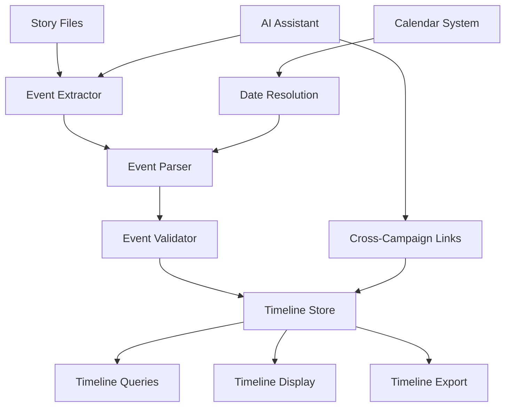

# Story Timeline Tracking Plan

## Overview

This document describes the design for a story timeline tracking system
for the D&D Character Consultant System. The goal is to track chronological
order of events across campaigns, enabling cross-campaign linking,
event extraction from stories, and timeline visualization.

## Problem Statement

### Current Issues

1. **No Event Extraction**: Stories contain rich narrative events but these
   are not automatically extracted or structured for querying.

2. **No Cross-Campaign Linking**: Events in one campaign cannot reference
   or link to events in other campaigns, making it hard to track overarching
   plot threads.

3. **Manual Timeline Management**: DMs must manually maintain timeline
   information across multiple story files and campaigns.

4. **No Timeline Visualization**: There is no way to view the chronological
   flow of events across a campaign or multiple campaigns.

### Evidence from Codebase

| Current State | Limitation |
|---------------|------------|
| Story files are standalone | No event linkage between stories |
| No event extraction | Events remain buried in narrative text |
| No timeline storage | Cannot query events chronologically |
| No visualization tools | Cannot see campaign timeline at a glance |

---

## Proposed Solution

### High-Level Approach

1. **Event Extraction System**: Parse story files to extract key events
   with dates, participants, and locations
2. **Timeline Storage Schema**: Store events in a structured format with
   cross-campaign references
3. **Cross-Campaign Linking**: Allow events to reference events in other
   campaigns for shared world building
4. **Timeline Display**: CLI and exportable views of campaign timelines
5. **AI Integration**: Use AI to assist in event extraction and linking

### Timeline Architecture



---

## Implementation Details

### 1. Event Schema

Create `src/timeline/event_schema.py`:

```python
"""Event schema for timeline tracking."""

from dataclasses import dataclass, field
from typing import Dict, List, Optional
from enum import Enum
import json
import hashlib


class EventType(Enum):
    """Types of timeline events."""
    COMBAT = "combat"
    SOCIAL = "social"
    EXPLORATION = "exploration"
    DISCOVERY = "discovery"
    QUEST_START = "quest_start"
    QUEST_COMPLETE = "quest_complete"
    CHARACTER_DEATH = "character_death"
    CHARACTER_JOIN = "character_join"
    NPC_INTRO = "npc_intro"
    NPC_DEATH = "npc_death"
    ITEM_GAIN = "item_gain"
    ITEM_LOSS = "item_loss"
    LOCATION_VISIT = "location_visit"
    PLOT_TWIST = "plot_twist"
    RELATIONSHIP_CHANGE = "relationship_change"
    LEVEL_UP = "level_up"
    STORY_MILESTONE = "story_milestone"
    CUSTOM = "custom"


class EventPriority(Enum):
    """Priority levels for events."""
    CRITICAL = "critical"      # Major plot points
    IMPORTANT = "important"    # Significant events
    NORMAL = "normal"          # Standard events
    MINOR = "minor"           # Minor details


@dataclass
class TimelineEvent:
    """Represents a single event in the timeline."""
    event_id: str
    title: str
    event_type: EventType
    description: str

    # Temporal information
    in_world_date: Optional[Dict] = None  # From calendar system
    real_world_date: Optional[str] = None

    # Location
    location: str = ""
    region: str = ""

    # Participants
    characters_involved: List[str] = field(default_factory=list)
    npcs_involved: List[str] = field(default_factory=list)
    organizations_involved: List[str] = field(default_factory=list)

    # Source tracking
    campaign_name: str = ""
    story_file: str = ""
    session_id: str = ""
    story_section: str = ""

    # Cross-campaign linking
    linked_events: List[str] = field(default_factory=list)  # Event IDs
    parent_event: Optional[str] = None  # For sub-events
    tags: List[str] = field(default_factory=list)

    # Metadata
    priority: EventPriority = EventPriority.NORMAL
    consequences: List[str] = field(default_factory=list)
    foreshadowing: List[str] = field(default_factory=list)  # Setup for future events

    # AI extraction metadata
    extraction_confidence: float = 0.0
    manually_verified: bool = False

    def to_dict(self) -> Dict:
        """Convert to dictionary for JSON serialization."""
        return {
            "event_id": self.event_id,
            "title": self.title,
            "event_type": self.event_type.value,
            "description": self.description,
            "in_world_date": self.in_world_date,
            "real_world_date": self.real_world_date,
            "location": self.location,
            "region": self.region,
            "characters_involved": self.characters_involved,
            "npcs_involved": self.npcs_involved,
            "organizations_involved": self.organizations_involved,
            "campaign_name": self.campaign_name,
            "story_file": self.story_file,
            "session_id": self.session_id,
            "story_section": self.story_section,
            "linked_events": self.linked_events,
            "parent_event": self.parent_event,
            "tags": self.tags,
            "priority": self.priority.value,
            "consequences": self.consequences,
            "foreshadowing": self.foreshadowing,
            "extraction_confidence": self.extraction_confidence,
            "manually_verified": self.manually_verified
        }

    @classmethod
    def from_dict(cls, data: Dict) -> "TimelineEvent":
        """Create from dictionary."""
        return cls(
            event_id=data["event_id"],
            title=data["title"],
            event_type=EventType(data["event_type"]),
            description=data["description"],
            in_world_date=data.get("in_world_date"),
            real_world_date=data.get("real_world_date"),
            location=data.get("location", ""),
            region=data.get("region", ""),
            characters_involved=data.get("characters_involved", []),
            npcs_involved=data.get("npcs_involved", []),
            organizations_involved=data.get("organizations_involved", []),
            campaign_name=data.get("campaign_name", ""),
            story_file=data.get("story_file", ""),
            session_id=data.get("session_id", ""),
            story_section=data.get("story_section", ""),
            linked_events=data.get("linked_events", []),
            parent_event=data.get("parent_event"),
            tags=data.get("tags", []),
            priority=EventPriority(data.get("priority", "normal")),
            consequences=data.get("consequences", []),
            foreshadowing=data.get("foreshadowing", []),
            extraction_confidence=data.get("extraction_confidence", 0.0),
            manually_verified=data.get("manually_verified", False)
        )

    def generate_id(self) -> str:
        """Generate a unique event ID based on content."""
        content = f"{self.title}{self.description}{self.campaign_name}"
        hash_obj = hashlib.md5(content.encode())
        return f"evt_{hash_obj.hexdigest()[:12]}"
```

### 2. Event Extractor

Create `src/timeline/event_extractor.py`:

```python
"""Extract events from story files."""

import re
from typing import List, Dict, Optional, Set
from dataclasses import dataclass

from src.timeline.event_schema import TimelineEvent, EventType, EventPriority
from src.utils.file_io import read_text_file


@dataclass
class ExtractionPattern:
    """Pattern for extracting events from text."""
    event_type: EventType
    patterns: List[str]
    priority: EventPriority


# Patterns for automatic event detection
EXTRACTION_PATTERNS = [
    ExtractionPattern(
        event_type=EventType.COMBAT,
        patterns=[
            r"(?:battle|fight|combat|ambush|skirmish|duel|clash)",
            r"(?:attacks?|strikes?|defeats?|slays?|kills?)",
            r"(?:encounter with)",
        ],
        priority=EventPriority.IMPORTANT
    ),
    ExtractionPattern(
        event_type=EventType.CHARACTER_DEATH,
        patterns=[
            r"(?:dies?|death|falls? in battle|killed|slain)",
            r"(?:perishes?|passes? away)",
        ],
        priority=EventPriority.CRITICAL
    ),
    ExtractionPattern(
        event_type=EventType.NPC_INTRO,
        patterns=[
            r"(?:meets?|encounters?|introduces?)\s+(?:a|an|the)?\s+\w+\s+(?:named|called)",
            r"(?:introduced to)",
        ],
        priority=EventPriority.NORMAL
    ),
    ExtractionPattern(
        event_type=EventType.DISCOVERY,
        patterns=[
            r"(?:discovers?|finds?|uncovers?|reveals?)",
            r"(?:stumbles? upon)",
            r"(?:hidden|secret|ancient)",
        ],
        priority=EventPriority.IMPORTANT
    ),
    ExtractionPattern(
        event_type=EventType.QUEST_START,
        patterns=[
            r"(?:quest|mission|task|journey)\s+(?:begins?|starts?)",
            r"(?:accepts?\s+(?:the|a)\s+(?:quest|mission))",
            r"(?:tasked with)",
        ],
        priority=EventPriority.IMPORTANT
    ),
    ExtractionPattern(
        event_type=EventType.QUEST_COMPLETE,
        patterns=[
            r"(?:quest|mission)\s+(?:completes?|ends?|finished)",
            r"(?:successfully\s+)?(?:completes?|finishes?)\s+(?:the|a)?\s*(?:quest|mission)",
        ],
        priority=EventPriority.IMPORTANT
    ),
    ExtractionPattern(
        event_type=EventType.ITEM_GAIN,
        patterns=[
            r"(?:acquires?|obtains?|gains?|receives?|finds?)\s+(?:a|an|the)",
            r"(?:rewarded with)",
        ],
        priority=EventPriority.NORMAL
    ),
    ExtractionPattern(
        event_type=EventType.LOCATION_VISIT,
        patterns=[
            r"(?:arrives? at|reaches?|enters?|visits?)",
            r"(?:travels? to|journeys? to)",
        ],
        priority=EventPriority.MINOR
    ),
    ExtractionPattern(
        event_type=EventType.PLOT_TWIST,
        patterns=[
            r"(?:reveals? that|turns? out)",
            r"(?:betrayal|traitor|secret)",
            r"(?:unexpectedly|suddenly)",
        ],
        priority=EventPriority.CRITICAL
    ),
]


class EventExtractor:
    """Extracts events from story text."""

    def __init__(self):
        """Initialize the event extractor."""
        self._compiled_patterns = self._compile_patterns()

    def _compile_patterns(self) -> Dict[EventType, List[re.Pattern]]:
        """Compile regex patterns for efficiency."""
        compiled = {}
        for extraction in EXTRACTION_PATTERNS:
            compiled[extraction.event_type] = [
                re.compile(p, re.IGNORECASE) for p in extraction.patterns
            ]
        return compiled

    def extract_from_file(
        self,
        file_path: str,
        campaign_name: str = "",
        story_file: str = ""
    ) -> List[TimelineEvent]:
        """Extract events from a story file.

        Args:
            file_path: Path to the story file
            campaign_name: Name of the campaign
            story_file: Relative path within campaign

        Returns:
            List of extracted events
        """
        content = read_text_file(file_path)
        return self.extract_from_text(content, campaign_name, story_file)

    def extract_from_text(
        self,
        text: str,
        campaign_name: str = "",
        story_file: str = ""
    ) -> List[TimelineEvent]:
        """Extract events from story text.

        Args:
            text: Story text content
            campaign_name: Name of the campaign
            story_file: Relative path within campaign

        Returns:
            List of extracted events
        """
        events = []

        # Split into sections (by headers)
        sections = self._split_sections(text)

        for section_title, section_content in sections:
            section_events = self._extract_from_section(
                section_content,
                section_title,
                campaign_name,
                story_file
            )
            events.extend(section_events)

        return events

    def _split_sections(self, text: str) -> List[tuple]:
        """Split text into sections by markdown headers."""
        sections = []
        current_title = "Introduction"
        current_content = []

        for line in text.split("\n"):
            if line.startswith("#"):
                # Save previous section
                if current_content:
                    sections.append((current_title, "\n".join(current_content)))
                current_title = line.lstrip("#").strip()
                current_content = []
            else:
                current_content.append(line)

        # Save final section
        if current_content:
            sections.append((current_title, "\n".join(current_content)))

        return sections

    def _extract_from_section(
        self,
        content: str,
        section_title: str,
        campaign_name: str,
        story_file: str
    ) -> List[TimelineEvent]:
        """Extract events from a single section."""
        events = []

        # Split into paragraphs
        paragraphs = [p.strip() for p in content.split("\n\n") if p.strip()]

        for paragraph in paragraphs:
            detected_events = self._detect_events_in_paragraph(
                paragraph,
                section_title,
                campaign_name,
                story_file
            )
            events.extend(detected_events)

        return events

    def _detect_events_in_paragraph(
        self,
        paragraph: str,
        section_title: str,
        campaign_name: str,
        story_file: str
    ) -> List[TimelineEvent]:
        """Detect events within a paragraph."""
        events = []

        # Check each event type
        for event_type, patterns in self._compiled_patterns.items():
            for pattern in patterns:
                matches = pattern.finditer(paragraph)
                for match in matches:
                    # Extract context around the match
                    start = max(0, match.start() - 50)
                    end = min(len(paragraph), match.end() + 100)
                    context = paragraph[start:end]

                    # Create event
                    event = TimelineEvent(
                        event_id="",  # Will be generated
                        title=self._generate_title(event_type, context),
                        event_type=event_type,
                        description=context.strip(),
                        campaign_name=campaign_name,
                        story_file=story_file,
                        story_section=section_title,
                        priority=self._get_priority_for_type(event_type),
                        extraction_confidence=0.7  # Pattern-based extraction
                    )
                    event.event_id = event.generate_id()

                    # Extract entities
                    event.characters_involved = self._extract_character_names(paragraph)
                    event.location = self._extract_location(paragraph)

                    events.append(event)

        return events

    def _generate_title(self, event_type: EventType, context: str) -> str:
        """Generate a title for an event."""
        type_titles = {
            EventType.COMBAT: "Combat Encounter",
            EventType.CHARACTER_DEATH: "Character Death",
            EventType.NPC_INTRO: "NPC Introduction",
            EventType.DISCOVERY: "Discovery",
            EventType.QUEST_START: "Quest Begins",
            EventType.QUEST_COMPLETE: "Quest Completed",
            EventType.ITEM_GAIN: "Item Acquired",
            EventType.LOCATION_VISIT: "Location Visited",
            EventType.PLOT_TWIST: "Plot Twist",
        }

        base_title = type_titles.get(event_type, "Event")

        # Try to extract a more specific title from context
        first_sentence = context.split(".")[0] if "." in context else context
        if len(first_sentence) < 50:
            return f"{base_title}: {first_sentence.strip()}"

        return base_title

    def _get_priority_for_type(self, event_type: EventType) -> EventPriority:
        """Get default priority for an event type."""
        for extraction in EXTRACTION_PATTERNS:
            if extraction.event_type == event_type:
                return extraction.priority
        return EventPriority.NORMAL

    def _extract_character_names(self, text: str) -> List[str]:
        """Extract potential character names from text."""
        # Look for capitalized words that might be names
        # This is a simplified version - would integrate with character registry
        pattern = r"\b[A-Z][a-z]+\b"
        matches = re.findall(pattern, text)

        # Filter out common words
        common_words = {"The", "A", "An", "He", "She", "They", "It", "This", "That"}
        return [m for m in matches if m not in common_words][:5]  # Limit to 5

    def _extract_location(self, text: str) -> str:
        """Extract potential location from text."""
        # Look for location indicators
        patterns = [
            r"(?:in|at|near|inside|outside)\s+(?:the\s+)?([A-Z][a-z]+(?:\s+[A-Z][a-z]+)*)",
            r"(?:arrives? at|reaches?|enters?)\s+(?:the\s+)?([A-Z][a-z]+(?:\s+[A-Z][a-z]+)*)",
        ]

        for pattern in patterns:
            match = re.search(pattern, text)
            if match:
                return match.group(1)

        return ""


class AIEventExtractor:
    """Use AI to extract events with higher accuracy."""

    def __init__(self, ai_client):
        """Initialize with AI client.

        Args:
            ai_client: AI client for text analysis
        """
        self.ai_client = ai_client

    def extract_with_ai(
        self,
        text: str,
        campaign_name: str = "",
        story_file: str = ""
    ) -> List[TimelineEvent]:
        """Extract events using AI analysis.

        Args:
            text: Story text content
            campaign_name: Name of the campaign
            story_file: Relative path within campaign

        Returns:
            List of AI-extracted events
        """
        prompt = f"""
Analyze the following story text and extract key events. For each event, provide:
1. Event type (combat, social, exploration, discovery, quest_start, quest_complete, character_death, npc_intro, item_gain, location_visit, plot_twist, or custom)
2. A brief title
3. A description
4. Characters involved
5. Location
6. Priority (critical, important, normal, minor)

Story text:
{text}

Respond in JSON format as an array of events:
[
  {{
    "event_type": "type",
    "title": "Brief title",
    "description": "Description of the event",
    "characters_involved": ["name1", "name2"],
    "location": "Location name",
    "priority": "important"
  }}
]
"""

        try:
            response = self.ai_client.generate(prompt)
            events_data = self._parse_ai_response(response)

            events = []
            for data in events_data:
                event = TimelineEvent(
                    event_id="",
                    title=data.get("title", "Unknown Event"),
                    event_type=EventType(data.get("event_type", "custom")),
                    description=data.get("description", ""),
                    campaign_name=campaign_name,
                    story_file=story_file,
                    characters_involved=data.get("characters_involved", []),
                    location=data.get("location", ""),
                    priority=EventPriority(data.get("priority", "normal")),
                    extraction_confidence=0.9,  # AI extraction
                    manually_verified=False
                )
                event.event_id = event.generate_id()
                events.append(event)

            return events
        except Exception:
            return []

    def _parse_ai_response(self, response: str) -> List[Dict]:
        """Parse AI response into event data."""
        import json

        # Try to extract JSON from response
        try:
            # Find JSON array in response
            start = response.find("[")
            end = response.rfind("]") + 1
            if start >= 0 and end > start:
                json_str = response[start:end]
                return json.loads(json_str)
        except json.JSONDecodeError:
            pass

        return []
```

### 3. Timeline Store

Create `src/timeline/timeline_store.py`:

```python
"""Storage and retrieval of timeline events."""

from dataclasses import dataclass
from typing import List, Dict, Optional
from pathlib import Path
from datetime import datetime

from src.timeline.event_schema import TimelineEvent, EventType, EventPriority
from src.utils.file_io import load_json_file, save_json_file
from src.utils.path_utils import get_game_data_path


@dataclass
class TimelineQuery:
    """Query parameters for timeline search."""
    campaign_name: Optional[str] = None
    event_types: Optional[List[EventType]] = None
    characters: Optional[List[str]] = None
    locations: Optional[List[str]] = None
    priority: Optional[EventPriority] = None
    tags: Optional[List[str]] = None
    date_range_start: Optional[Dict] = None
    date_range_end: Optional[Dict] = None
    include_linked: bool = True


class TimelineStore:
    """Manages storage and retrieval of timeline events."""

    def __init__(self, campaign_name: Optional[str] = None):
        """Initialize timeline store.

        Args:
            campaign_name: Optional campaign to filter by
        """
        self.campaign_name = campaign_name
        self._events: Dict[str, TimelineEvent] = {}
        self._campaign_index: Dict[str, List[str]] = {}  # campaign -> event_ids
        self._character_index: Dict[str, List[str]] = {}  # character -> event_ids
        self._location_index: Dict[str, List[str]] = {}  # location -> event_ids
        self._load_all_timelines()

    def _load_all_timelines(self) -> None:
        """Load timeline data from all campaigns."""
        campaigns_dir = get_game_data_path() / "campaigns"

        if not campaigns_dir.exists():
            return

        for campaign_dir in campaigns_dir.iterdir():
            if campaign_dir.is_dir():
                self._load_campaign_timeline(campaign_dir.name)

    def _load_campaign_timeline(self, campaign_name: str) -> None:
        """Load timeline for a specific campaign."""
        timeline_path = (
            get_game_data_path() / "campaigns" / campaign_name / "timeline.json"
        )

        if not timeline_path.exists():
            return

        try:
            data = load_json_file(str(timeline_path))

            for event_data in data.get("events", []):
                event = TimelineEvent.from_dict(event_data)
                self._add_event_to_indexes(event)
        except Exception:
            pass

    def _add_event_to_indexes(self, event: TimelineEvent) -> None:
        """Add event to all indexes."""
        self._events[event.event_id] = event

        # Campaign index
        if event.campaign_name:
            if event.campaign_name not in self._campaign_index:
                self._campaign_index[event.campaign_name] = []
            self._campaign_index[event.campaign_name].append(event.event_id)

        # Character index
        for char in event.characters_involved:
            char_lower = char.lower()
            if char_lower not in self._character_index:
                self._character_index[char_lower] = []
            self._character_index[char_lower].append(event.event_id)

        # Location index
        if event.location:
            loc_lower = event.location.lower()
            if loc_lower not in self._location_index:
                self._location_index[loc_lower] = []
            self._location_index[loc_lower].append(event.event_id)

    def add_event(self, event: TimelineEvent) -> None:
        """Add a new event to the timeline."""
        self._add_event_to_indexes(event)
        self._save_campaign_timeline(event.campaign_name)

    def _save_campaign_timeline(self, campaign_name: str) -> None:
        """Save timeline for a campaign."""
        if not campaign_name:
            return

        event_ids = self._campaign_index.get(campaign_name, [])
        events = [self._events[eid].to_dict() for eid in event_ids if eid in self._events]

        timeline_path = (
            get_game_data_path() / "campaigns" / campaign_name / "timeline.json"
        )

        data = {
            "campaign_name": campaign_name,
            "last_updated": datetime.now().isoformat(),
            "events": events
        }

        save_json_file(str(timeline_path), data)

    def get_event(self, event_id: str) -> Optional[TimelineEvent]:
        """Get an event by ID."""
        return self._events.get(event_id)

    def query(self, query: TimelineQuery) -> List[TimelineEvent]:
        """Query events based on criteria."""
        results = []

        for event in self._events.values():
            if self._event_matches_query(event, query):
                results.append(event)

        # Sort by date if available
        return sorted(results, key=lambda e: e.event_id)

    def _event_matches_query(self, event: TimelineEvent, query: TimelineQuery) -> bool:
        """Check if an event matches query criteria."""
        # Campaign filter
        if query.campaign_name and event.campaign_name != query.campaign_name:
            return False

        # Event type filter
        if query.event_types and event.event_type not in query.event_types:
            return False

        # Character filter
        if query.characters:
            event_chars = {c.lower() for c in event.characters_involved}
            query_chars = {c.lower() for c in query.characters}
            if not event_chars.intersection(query_chars):
                return False

        # Location filter
        if query.locations:
            if event.location.lower() not in {l.lower() for l in query.locations}:
                return False

        # Priority filter
        if query.priority and event.priority != query.priority:
            return False

        # Tags filter
        if query.tags:
            event_tags = {t.lower() for t in event.tags}
            query_tags = {t.lower() for t in query.tags}
            if not event_tags.intersection(query_tags):
                return False

        return True

    def get_campaign_timeline(self, campaign_name: str) -> List[TimelineEvent]:
        """Get all events for a campaign."""
        event_ids = self._campaign_index.get(campaign_name, [])
        return [self._events[eid] for eid in event_ids if eid in self._events]

    def get_character_timeline(self, character_name: str) -> List[TimelineEvent]:
        """Get all events involving a character."""
        char_lower = character_name.lower()
        event_ids = self._character_index.get(char_lower, [])
        return [self._events[eid] for eid in event_ids if eid in self._events]

    def get_location_timeline(self, location: str) -> List[TimelineEvent]:
        """Get all events at a location."""
        loc_lower = location.lower()
        event_ids = self._location_index.get(loc_lower, [])
        return [self._events[eid] for eid in event_ids if eid in self._events]

    def link_events(self, event_id_1: str, event_id_2: str) -> bool:
        """Create a link between two events."""
        event1 = self._events.get(event_id_1)
        event2 = self._events.get(event_id_2)

        if not event1 or not event2:
            return False

        if event_id_2 not in event1.linked_events:
            event1.linked_events.append(event_id_2)

        if event_id_1 not in event2.linked_events:
            event2.linked_events.append(event_id_1)

        # Save both campaigns
        self._save_campaign_timeline(event1.campaign_name)
        self._save_campaign_timeline(event2.campaign_name)

        return True

    def get_linked_events(self, event_id: str) -> List[TimelineEvent]:
        """Get all events linked to a specific event."""
        event = self._events.get(event_id)
        if not event:
            return []

        return [self._events[eid] for eid in event.linked_events if eid in self._events]
```

### 4. Timeline Display

Create `src/timeline/timeline_display.py`:

```python
"""Display and export timeline views."""

from typing import List, Optional
from datetime import datetime

from src.timeline.event_schema import TimelineEvent, EventType, EventPriority
from src.timeline.timeline_store import TimelineStore, TimelineQuery
from src.utils.terminal_display import print_info, print_section_header


class TimelineDisplay:
    """Display timeline views in terminal."""

    def __init__(self, store: Optional[TimelineStore] = None):
        """Initialize display with timeline store."""
        self.store = store or TimelineStore()

    def display_campaign_timeline(
        self,
        campaign_name: str,
        event_types: Optional[List[EventType]] = None
    ) -> None:
        """Display timeline for a campaign."""
        query = TimelineQuery(
            campaign_name=campaign_name,
            event_types=event_types
        )
        events = self.store.query(query)

        print_section_header(f"Timeline: {campaign_name}")

        if not events:
            print_info("No events found for this campaign.")
            return

        for event in events:
            self._display_event(event)

    def display_character_timeline(self, character_name: str) -> None:
        """Display timeline for a character across all campaigns."""
        events = self.store.get_character_timeline(character_name)

        print_section_header(f"Timeline: {character_name}")

        if not events:
            print_info(f"No events found for {character_name}.")
            return

        # Group by campaign
        by_campaign: dict = {}
        for event in events:
            campaign = event.campaign_name or "Unknown"
            if campaign not in by_campaign:
                by_campaign[campaign] = []
            by_campaign[campaign].append(event)

        for campaign, campaign_events in by_campaign.items():
            print(f"\n[{campaign}]")
            for event in campaign_events:
                self._display_event(event, show_campaign=False)

    def _display_event(
        self,
        event: TimelineEvent,
        show_campaign: bool = True
    ) -> None:
        """Display a single event."""
        priority_markers = {
            EventPriority.CRITICAL: "[!]",
            EventPriority.IMPORTANT: "[*]",
            EventPriority.NORMAL: "[ ]",
            EventPriority.MINOR: "[-]"
        }

        marker = priority_markers.get(event.priority, "[ ]")

        # Format date
        date_str = ""
        if event.in_world_date:
            date_str = f"{event.in_world_date.get('day', '?')} {event.in_world_date.get('month', '?')}, {event.in_world_date.get('year', '?')}"

        # Build display line
        parts = [marker, event.title]

        if date_str:
            parts.append(f"({date_str})")

        if show_campaign and event.campaign_name:
            parts.append(f"[{event.campaign_name}]")

        print(" ".join(parts))

        # Show description for important events
        if event.priority in [EventPriority.CRITICAL, EventPriority.IMPORTANT]:
            if event.description:
                desc_preview = event.description[:100]
                if len(event.description) > 100:
                    desc_preview += "..."
                print(f"    {desc_preview}")

        # Show participants
        if event.characters_involved:
            chars = ", ".join(event.characters_involved[:3])
            if len(event.characters_involved) > 3:
                chars += f" (+{len(event.characters_involved) - 3} more)"
            print(f"    Characters: {chars}")

        # Show location
        if event.location:
            print(f"    Location: {event.location}")

        # Show linked events
        if event.linked_events:
            print(f"    Linked: {len(event.linked_events)} event(s)")

        print()

    def display_event_detail(self, event_id: str) -> None:
        """Display detailed view of a single event."""
        event = self.store.get_event(event_id)

        if not event:
            print_info(f"Event not found: {event_id}")
            return

        print_section_header(f"Event: {event.title}")

        print(f"Type: {event.event_type.value}")
        print(f"Priority: {event.priority.value}")
        print(f"Campaign: {event.campaign_name or 'Unknown'}")

        if event.in_world_date:
            print(f"Date: {event.in_world_date}")

        if event.real_world_date:
            print(f"Real Date: {event.real_world_date}")

        if event.location:
            print(f"Location: {event.location}")

        print(f"\nDescription:\n{event.description}")

        if event.characters_involved:
            print(f"\nCharacters: {', '.join(event.characters_involved)}")

        if event.npcs_involved:
            print(f"NPCs: {', '.join(event.npcs_involved)}")

        if event.tags:
            print(f"Tags: {', '.join(event.tags)}")

        if event.linked_events:
            print(f"\nLinked Events:")
            for linked_id in event.linked_events:
                linked = self.store.get_event(linked_id)
                if linked:
                    print(f"  - {linked.title} ({linked.campaign_name})")

        if event.consequences:
            print(f"\nConsequences:")
            for cons in event.consequences:
                print(f"  - {cons}")

    def export_timeline_markdown(
        self,
        campaign_name: str,
        output_path: str
    ) -> None:
        """Export timeline to markdown file."""
        events = self.store.get_campaign_timeline(campaign_name)

        lines = [
            f"# Timeline: {campaign_name}",
            "",
            f"Generated: {datetime.now().strftime('%Y-%m-%d %H:%M')}",
            "",
            "## Events",
            ""
        ]

        for event in events:
            lines.append(f"### {event.title}")
            lines.append("")

            if event.in_world_date:
                lines.append(f"**Date:** {event.in_world_date}")

            if event.location:
                lines.append(f"**Location:** {event.location}")

            lines.append(f"**Type:** {event.event_type.value}")
            lines.append(f"**Priority:** {event.priority.value}")
            lines.append("")
            lines.append(event.description)
            lines.append("")

            if event.characters_involved:
                lines.append(f"**Characters:** {', '.join(event.characters_involved)}")

            if event.npcs_involved:
                lines.append(f"**NPCs:** {', '.join(event.npcs_involved)}")

            lines.append("")
            lines.append("---")
            lines.append("")

        # Write to file
        with open(output_path, "w", encoding="utf-8") as f:
            f.write("\n".join(lines))
```

### 5. Cross-Campaign Linking

Create `src/timeline/cross_campaign.py`:

```python
"""Cross-campaign event linking."""

from typing import List, Dict, Optional, Set
from dataclasses import dataclass

from src.timeline.event_schema import TimelineEvent
from src.timeline.timeline_store import TimelineStore


@dataclass
class CampaignLink:
    """Represents a link between campaigns."""
    campaign_1: str
    campaign_2: str
    link_type: str  # "shared_world", "sequel", "prequel", "parallel"
    description: str = ""
    shared_events: List[str] = None

    def __post_init__(self):
        if self.shared_events is None:
            self.shared_events = []


class CrossCampaignLinker:
    """Manages links between campaigns."""

    def __init__(self, store: Optional[TimelineStore] = None):
        """Initialize linker with timeline store."""
        self.store = store or TimelineStore()
        self._campaign_links: Dict[str, List[CampaignLink]] = {}

    def link_campaigns(
        self,
        campaign_1: str,
        campaign_2: str,
        link_type: str,
        description: str = ""
    ) -> CampaignLink:
        """Create a link between two campaigns."""
        link = CampaignLink(
            campaign_1=campaign_1,
            campaign_2=campaign_2,
            link_type=link_type,
            description=description
        )

        # Index by both campaigns
        for campaign in [campaign_1, campaign_2]:
            if campaign not in self._campaign_links:
                self._campaign_links[campaign] = []
            self._campaign_links[campaign].append(link)

        return link

    def find_shared_characters(self, campaign_1: str, campaign_2: str) -> Set[str]:
        """Find characters that appear in both campaigns."""
        events_1 = self.store.get_campaign_timeline(campaign_1)
        events_2 = self.store.get_campaign_timeline(campaign_2)

        chars_1 = set()
        chars_2 = set()

        for event in events_1:
            chars_1.update(c.lower() for c in event.characters_involved)

        for event in events_2:
            chars_2.update(c.lower() for c in event.characters_involved)

        return chars_1.intersection(chars_2)

    def find_shared_locations(self, campaign_1: str, campaign_2: str) -> Set[str]:
        """Find locations that appear in both campaigns."""
        events_1 = self.store.get_campaign_timeline(campaign_1)
        events_2 = self.store.get_campaign_timeline(campaign_2)

        locs_1 = set()
        locs_2 = set()

        for event in events_1:
            if event.location:
                locs_1.add(event.location.lower())

        for event in events_2:
            if event.location:
                locs_2.add(event.location.lower())

        return locs_1.intersection(locs_2)

    def suggest_links(self, campaign_name: str) -> List[Dict]:
        """Suggest potential links to other campaigns."""
        suggestions = []

        all_campaigns = set(self.store._campaign_index.keys())
        all_campaigns.discard(campaign_name)

        for other_campaign in all_campaigns:
            shared_chars = self.find_shared_characters(campaign_name, other_campaign)
            shared_locs = self.find_shared_locations(campaign_name, other_campaign)

            if shared_chars or shared_locs:
                suggestions.append({
                    "campaign": other_campaign,
                    "shared_characters": list(shared_chars),
                    "shared_locations": list(shared_locs),
                    "link_type": self._suggest_link_type(shared_chars, shared_locs)
                })

        return suggestions

    def _suggest_link_type(
        self,
        shared_chars: Set[str],
        shared_locs: Set[str]
    ) -> str:
        """Suggest link type based on shared elements."""
        if shared_chars:
            return "shared_world"  # Same characters = same world
        if shared_locs:
            return "parallel"  # Same locations but different characters
        return "unknown"

    def get_linked_campaigns(self, campaign_name: str) -> List[CampaignLink]:
        """Get all campaigns linked to a given campaign."""
        return self._campaign_links.get(campaign_name, [])

    def get_unified_timeline(
        self,
        campaign_names: List[str]
    ) -> List[TimelineEvent]:
        """Get unified timeline across multiple campaigns."""
        all_events = []

        for campaign in campaign_names:
            events = self.store.get_campaign_timeline(campaign)
            all_events.extend(events)

        # Sort by date if available
        # This would integrate with the calendar system
        return sorted(all_events, key=lambda e: e.event_id)
```

---

## Affected Files

### New Files to Create

| File | Purpose |
|------|---------|
| `src/timeline/__init__.py` | Package initialization |
| `src/timeline/event_schema.py` | Event data structures |
| `src/timeline/event_extractor.py` | Pattern-based and AI extraction |
| `src/timeline/timeline_store.py` | Event storage and retrieval |
| `src/timeline/timeline_display.py` | Terminal display and export |
| `src/timeline/cross_campaign.py` | Cross-campaign linking |
| `tests/timeline/test_event_schema.py` | Schema tests |
| `tests/timeline/test_event_extractor.py` | Extraction tests |
| `tests/timeline/test_timeline_store.py` | Store tests |

### Files to Modify

| File | Changes |
|------|---------|
| `src/stories/story_manager.py` | Add event extraction after story creation |
| `src/stories/story_file_manager.py` | Parse timeline from story files |
| `src/cli/cli_story_manager.py` | Add timeline commands |
| `src/dm/dungeon_master.py` | Add timeline context to prompts |

---

## Testing Strategy

### Unit Tests

1. **Event Schema Tests**
   - Test event creation and serialization
   - Test ID generation
   - Test all event types and priorities

2. **Event Extractor Tests**
   - Test pattern matching for each event type
   - Test section splitting
   - Test character/location extraction

3. **Timeline Store Tests**
   - Test event storage and retrieval
   - Test query filtering
   - Test indexing

### Integration Tests

1. **Story Integration**
   - Test extraction from real story files
   - Test timeline persistence
   - Test cross-campaign linking

### Test Data

Use `game_data/campaigns/Example_Campaign/` for testing:
- Extract events from existing story files
- Create timeline.json for testing
- Test cross-campaign with multiple campaigns

---

## Migration Path

### Phase 1: Core Infrastructure

1. Create `src/timeline/` package
2. Implement event schema
3. Implement basic event extractor
4. Add unit tests

### Phase 2: Storage and Display

1. Implement timeline store
2. Implement timeline display
3. Add CLI commands for viewing timelines
4. Add tests for store and display

### Phase 3: Story Integration

1. Integrate extraction with story creation
2. Add timeline.json to campaigns
3. Update story file format for event metadata
4. Add AI-assisted extraction

### Phase 4: Cross-Campaign Features

1. Implement cross-campaign linking
2. Add link suggestions
3. Create unified timeline view
4. Add export functionality

### Backward Compatibility

- Existing stories work without timeline
- Timeline is optional per campaign
- No breaking changes to existing APIs

---

## Dependencies

### Internal Dependencies

- `src/utils/file_io.py` - JSON loading/saving
- `src/utils/path_utils.py` - Path resolution
- `src/utils/terminal_display.py` - Output formatting
- `src/ai/ai_client.py` - AI-assisted extraction
- `src/calendar/` - Date resolution (optional)

### External Dependencies

None - uses only Python standard library

### Optional Dependencies

- Integration with calendar tracking plan for date resolution
- Integration with SQLite plan for advanced queries
- Integration with export plan for timeline reports

---

## Future Enhancements

1. **Visual Timeline**: Generate graphical timeline images
2. **Event Clustering**: Group related events automatically
3. **Causality Tracking**: Track cause-effect relationships between events
4. **Timeline Diff**: Compare timelines between campaign branches
5. **Import/Export**: Support for external timeline formats
