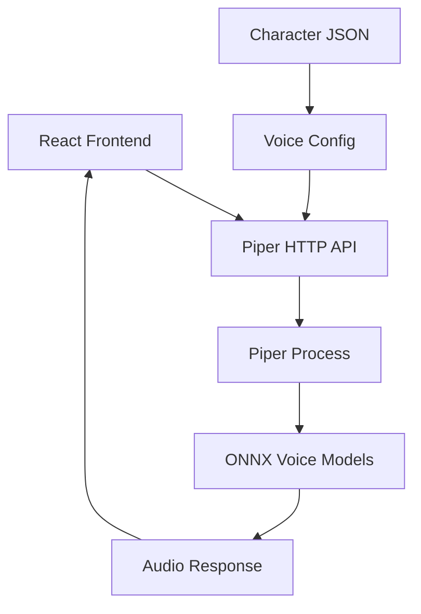
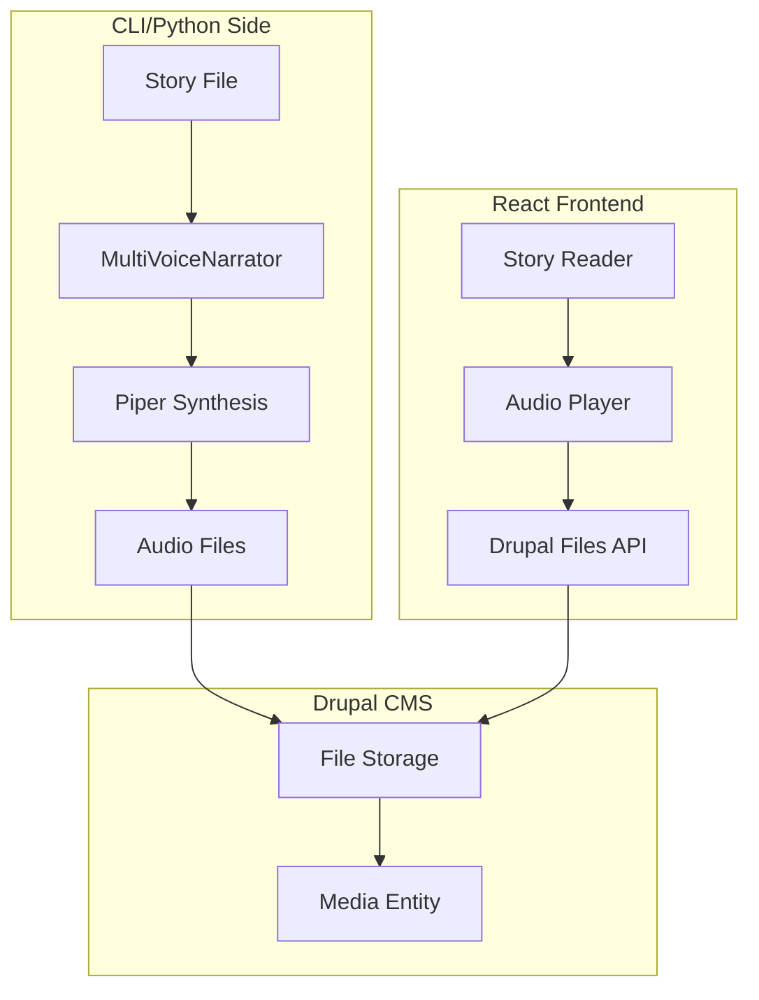
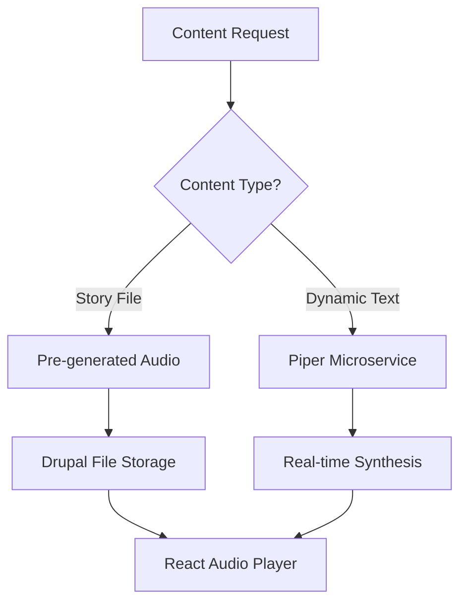
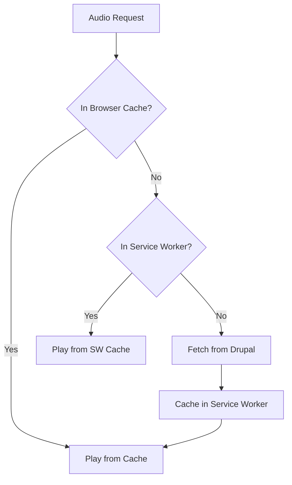

# TTS Web Integration Design

## Overview

This document describes how the Multi-Voice TTS system integrates with the Drupal
CMS and React frontend. It extends the existing TTS design to support web-based
narration while maintaining CLI functionality.

**Related Documents:**
- Base TTS Design: [`plans/multi_voice_tts_design.md`](plans/multi_voice_tts_design.md)
- Drupal Integration: [`plans/drupal_cms_integration.md`](plans/drupal_cms_integration.md)

---

## 1. Architecture Options Analysis

### 1.1 Option A: Browser Web Speech API

**Description:** Use the browser's built-in Speech Synthesis API.


**Pros:**
- No server infrastructure required
- Works offline after page load
- Zero latency for synthesis
- No audio file storage needed
- Free - no API costs

**Cons:**
- Limited voice selection - varies by browser/OS
- No Piper voice support - cannot use configured character voices
- Inconsistent quality across platforms
- No control over voice characteristics - speed/pitch limited
- Cannot match character-specific voices from JSON config

**Verdict:** Not recommended. Loses the core value of multi-voice narration.

---

### 1.2 Option B: Piper as Microservice

**Description:** Run Piper TTS as an HTTP API service that React calls directly.



**Implementation Options:**

**B1: Piper HTTP Server (Python)**
```python
# Using FastAPI wrapper around Piper
from fastapi import FastAPI, Response
from pydantic import BaseModel

app = FastAPI

class SynthesizeRequest(BaseModel):
    text: str
    voice_id: str
    speed: float = 1.0

@app.post("/synthesize")
async def synthesize(request: SynthesizeRequest):
    audio_bytes = piper_client.synthesize(
        text=request.text,
        voice_id=request.voice_id,
        speed=request.speed
    )
    return Response(content=audio_bytes, media_type="audio/wav")
```

**B2: Piper WebSocket Server**
```python
# Real-time streaming synthesis
@app.websocket("/ws/synthesize")
async def websocket_synthesize(websocket: WebSocket):
    await websocket.accept
    while True:
        data = await websocket.receive_json
        audio = synthesize(data)
        await websocket.send_bytes(audio)
```

**Pros:**
- Full Piper voice quality and selection
- Real-time synthesis on demand
- No pre-generation needed
- Supports all voice configurations from JSON
- Can stream audio for long content

**Cons:**
- Requires running additional service
- Latency for synthesis - 1-3 seconds per segment
- Server resource usage - CPU for ONNX inference
- Voice models must be available on server
- Need to handle concurrent requests

**Verdict:** Good option for real-time needs, but adds infrastructure complexity.

---

### 1.3 Option C: Pre-generated Audio Files

**Description:** Generate audio files in Python CLI, store in Drupal, serve to React.



**Pros:**
- Zero latency playback - files ready to stream
- No server-side synthesis needed
- Full Piper voice quality
- Works with existing Drupal file infrastructure
- Can optimize/encode audio for web
- Offline-capable with service worker caching

**Cons:**
- Storage requirements - ~1MB per minute of audio
- Must regenerate when story/voices change
- Not suitable for dynamic content
- Sync complexity between CLI and Drupal

**Verdict:** Excellent for static story content, recommended as primary approach.

---

### 1.4 Option D: Hybrid Approach

**Description:** Combine pre-generated audio for stories with on-demand synthesis
for dynamic content.



**Use Cases:**
- Pre-generated: Story narration, session summaries
- On-demand: AI-generated responses, dynamic dialogue, combat narration

**Pros:**
- Best of both approaches
- Optimized for common use case - story playback
- Flexible for dynamic content
- Can start with pre-generated, add microservice later

**Cons:**
- More complex architecture
- Two code paths to maintain
- Need to decide which content uses which path

**Verdict:** Recommended for full-featured implementation.

---

## 2. Recommended Approach

### 2.1 Phase 1: Pre-generated Audio (Recommended Start)

Start with pre-generated audio files stored in Drupal:

1. **CLI generates audio** when stories are created/updated
2. **Audio stored as Drupal media entities** linked to story nodes
3. **React fetches audio URLs** from JSON:API
4. **Browser handles playback** with HTML5 Audio API

**Rationale:**
- Simplest architecture for initial implementation
- Leverages existing Drupal file infrastructure
- Zero latency for end user
- Story content changes infrequently
- Can add microservice later for dynamic content

### 2.2 Phase 2: Piper Microservice (Future Enhancement)

Add Piper microservice for dynamic content:

1. **Deploy Piper HTTP API** alongside Drupal (DDEV add-on)
2. **React calls API** for real-time synthesis
3. **Cache responses** in browser or service worker
4. **Use for:** AI responses, combat narration, dynamic dialogue

---

## 3. Drupal Integration

### 3.1 Voice Configuration Storage

Voice settings should be stored in Drupal to enable web access:

#### Option A: Fields on Character/NPC Content Types

Add voice fields directly to Character and NPC content types:

| Field Name | Machine Name | Type | Description |
|------------|--------------|------|-------------|
| Piper Voice ID | `field_piper_voice_id` | Text | Voice identifier like en_US-ryan-low |
| Voice Speed | `field_voice_speed` | Decimal | Speed multiplier 0.5-2.0 |
| Voice Pitch | `field_voice_pitch` | Integer | Pitch shift -12 to +12 |
| Voice Volume | `field_voice_volume` | Decimal | Volume 0.0-1.0 |

**Character Content Type Update:**

```yaml
# web/modules/custom/dnd_content/config/install/field.field.node.character.field_piper_voice_id.yml
langcode: en
status: true
dependencies:
  config:
    - field.storage.node.field_piper_voice_id
    - node.type.character
id: node.character.field_piper_voice_id
field_name: field_piper_voice_id
entity_type: node
bundle: character
label: 'Piper Voice ID'
description: 'Piper TTS voice identifier (e.g., en_US-ryan-low)'
required: false
translatable: false
default_value: {  }
default_value_callback: ''
settings: {  }
field_type: string
```

#### Option B: Separate Voice Configuration Entity

Create a dedicated Voice Configuration entity:

```php
/**
 * @ContentEntityType(
 *   id = "voice_config",
 *   label = @Translation("Voice Configuration"),
 *   base_table = "voice_config",
 *   entity_keys = {
 *     "id" = "id",
 *     "label" = "name",
 *   },
 * )
 */
```

**Pros:** Reusable across entities, centralized management
**Cons:** Additional complexity, may be overkill for this use case

**Recommendation:** Use Option A (fields on content types) for simplicity.

### 3.2 Audio File Storage

#### Story Audio Media Type

Create a Media type for story narration audio:

| Field Name | Machine Name | Type |
|------------|--------------|------|
| Audio File | `field_media_audio_file` | File |
| Story Reference | `field_story` | Entity Reference |
| Segment Index | `field_segment_index` | Integer |
| Speaker | `field_speaker` | Entity Reference |
| Duration | `field_duration` | Decimal |

```yaml
# web/modules/custom/dnd_content/config/install/media.type.story_audio.yml
langcode: en
status: true
dependencies:
  module:
    - media
id: story_audio
label: 'Story Audio'
description: 'Generated TTS audio for story narration'
source: audio_file
queue_thumbnail_downloads: false
new_revision: true
source_configuration:
  source_field: field_media_audio_file
field_map:
  name: name
  duration: field_duration
```

#### Storage Structure

```
sites/default/files/
|-- audio/
|   |-- stories/
|   |   |-- example_campaign/
|   |   |   |-- 001_start/
|   |   |   |   |-- segment_000_narrator.wav
|   |   |   |   |-- segment_001_gorak.wav
|   |   |   |   |-- segment_002_nymur.wav
|   |   |   |   |-- playlist.json
|   |   |   |-- 002_continue/
|   |   |   |   |-- ...
```

### 3.3 JSON:API Endpoints

Voice configuration and audio accessible via JSON:API:

| Resource | Endpoint | Example |
|----------|----------|---------|
| Character Voice | `/jsonapi/node/character/{id}` | Includes `field_piper_voice_id` |
| NPC Voice | `/jsonapi/node/npc/{id}` | Includes `field_piper_voice_id` |
| Story Audio | `/jsonapi/media/story_audio` | Filter by `field_story` |
| Audio File | `/jsonapi/media/story_audio/{id}` | Direct file URL in links |

**Example API Response:**

```json
{
  "data": {
    "type": "node--character",
    "id": "abc-123",
    "attributes": {
      "title": "Aragorn",
      "field_piper_voice_id": "en_US-ryan-low",
      "field_voice_speed": 1.0,
      "field_voice_pitch": 0
    }
  }
}
```

### 3.4 Python-to-Drupal Audio Sync

Extend the DrupalSync class to handle audio:

```python
# src/integration/drupal_audio_sync.py

"""
Audio synchronization between Python TTS and Drupal CMS.
"""

from pathlib import Path
from typing import Dict, List, Optional
import requests

from src.utils.file_io import load_json_file


class DrupalAudioSync:
    """Synchronize generated TTS audio with Drupal media entities."""

    def __init__(self, drupal_sync):
        """Initialize with DrupalSync instance.

        Args:
            drupal_sync: Configured DrupalSync client
        """
        self.sync = drupal_sync

    def upload_story_audio(
        self,
        story_node_id: str,
        audio_files: List[Path],
        playlist: Dict
    ) -> List[str]:
        """Upload generated audio files for a story.

        Args:
            story_node_id: Drupal node UUID for the story
            audio_files: List of paths to audio segment files
            playlist: Playlist metadata with speaker info

        Returns:
            List of created media entity UUIDs
        """
        media_ids = []

        for i, audio_path in enumerate(audio_files):
            segment_info = playlist["segments"][i]

            # Upload file to Drupal
            file_response = self._upload_file(audio_path)

            # Create media entity
            media_data = {
                "data": {
                    "type": "media--story_audio",
                    "attributes": {
                        "name": f"Segment {i:04d} - {segment_info['speaker']}",
                        "field_segment_index": i,
                        "field_duration": segment_info.get("duration", 0),
                    },
                    "relationships": {
                        "field_media_audio_file": {
                            "data": {
                                "type": "file--file",
                                "id": file_response["data"]["id"]
                            }
                        },
                        "field_story": {
                            "data": {
                                "type": "node--story",
                                "id": story_node_id
                            }
                        },
                        "field_speaker": {
                            "data": self._get_speaker_reference(
                                segment_info["speaker"]
                            )
                        }
                    }
                }
            }

            response = self.sync._request(
                "POST",
                "/media/story_audio",
                data=media_data
            )
            media_ids.append(response["data"]["id"])

        return media_ids

    def _upload_file(self, file_path: Path) -> Dict:
        """Upload a file to Drupal.

        Args:
            file_path: Path to the file to upload

        Returns:
            File entity response from Drupal
        """
        url = f"{self.sync.base_url}/jsonapi/media/story_audio/field_media_audio_file"

        with open(file_path, "rb") as f:
            files = {
                "file": (file_path.name, f, "audio/wav")
            }
            headers = {
                "Content-Disposition": f'file; filename="{file_path.name}"',
                "Accept": "application/vnd.api+json",
            }
            response = requests.post(
                url,
                files=files,
                headers=headers,
                auth=self.sync.auth
            )
            response.raise_for_status()
            return response.json()

    def _get_speaker_reference(self, speaker_name: str) -> Optional[Dict]:
        """Get entity reference for speaker.

        Args:
            speaker_name: Name of character or NPC

        Returns:
            Entity reference data or None for narrator
        """
        if speaker_name.lower() == "narrator":
            return None

        # Try to find in characters
        char_response = self.sync._request(
            "GET",
            "/node/character",
            params={"filter[title]": speaker_name}
        )
        if char_response["data"]:
            return {
                "type": "node--character",
                "id": char_response["data"][0]["id"]
            }

        # Try NPCs
        npc_response = self.sync._request(
            "GET",
            "/node/npc",
            params={"filter[title]": speaker_name}
        )
        if npc_response["data"]:
            return {
                "type": "node--npc",
                "id": npc_response["data"][0]["id"]
            }

        return None
```

---

## 4. React Integration

### 4.1 Audio Player Component

```typescript
// src/components/Audio/StoryNarrator.tsx

import { useState, useEffect, useRef } from 'react';
import { useQuery } from '@tanstack/react-query';

interface AudioSegment {
  id: string;
  segmentIndex: number;
  speaker: string;
  audioUrl: string;
  duration: number;
}

interface StoryNarratorProps {
  storyId: string;
  autoPlay?: boolean;
}

export function StoryNarrator({ storyId, autoPlay = false }: StoryNarratorProps) {
  const [currentSegment, setCurrentSegment] = useState(0);
  const [isPlaying, setIsPlaying] = useState(false);
  const audioRef = useRef<HTMLAudioElement>(null);

  // Fetch audio segments for story
  const { data: segments, isLoading } = useQuery({
    queryKey: ['story-audio', storyId],
    queryFn: async (): Promise<AudioSegment[]> => {
      const response = await fetch(
        `/jsonapi/media/story_audio?filter[field_story.id]=${storyId}&sort=field_segment_index`
      );
      if (!response.ok) throw new Error('Failed to fetch audio');

      const json = await response.json();
      return json.data.map((item: any) => ({
        id: item.id,
        segmentIndex: item.attributes.field_segment_index,
        speaker: item.attributes.name.split(' - ')[1] || 'narrator',
        audioUrl: item.relationships.field_media_audio_file.links.related.href,
        duration: item.attributes.field_duration,
      }));
    },
  });

  // Handle segment completion
  const handleSegmentEnd = () => {
    if (segments && currentSegment < segments.length - 1) {
      setCurrentSegment(prev => prev + 1);
    } else {
      setIsPlaying(false);
      setCurrentSegment(0);
    }
  };

  // Auto-play when segment changes
  useEffect(() => {
    if (audioRef.current && isPlaying) {
      audioRef.current.play().catch(console.error);
    }
  }, [currentSegment, isPlaying]);

  if (isLoading) {
    return <div>Loading audio...</div>;
  }

  if (!segments || segments.length === 0) {
    return <div>No audio available for this story.</div>;
  }

  const current = segments[currentSegment];

  return (
    <div className="story-narrator">
      <div className="narrator-controls">
        <button
          onClick={() => setIsPlaying(!isPlaying)}
          aria-label={isPlaying ? 'Pause' : 'Play'}
        >
          {isPlaying ? 'Pause' : 'Play'}
        </button>

        <button
          onClick={() => setCurrentSegment(Math.max(0, currentSegment - 1))}
          disabled={currentSegment === 0}
          aria-label="Previous segment"
        >
          Previous
        </button>

        <button
          onClick={() => setCurrentSegment(Math.min(segments.length - 1, currentSegment + 1))}
          disabled={currentSegment === segments.length - 1}
          aria-label="Next segment"
        >
          Next
        </button>
      </div>

      <div className="narrator-progress">
        <span>Segment {currentSegment + 1} of {segments.length}</span>
        <span>Speaker: {current.speaker}</span>
      </div>

      <div className="narrator-visual">
        <progress
          value={currentSegment + 1}
          max={segments.length}
        />
      </div>

      <audio
        ref={audioRef}
        src={current.audioUrl}
        onEnded={handleSegmentEnd}
        onPlay={() => setIsPlaying(true)}
        onPause={() => setIsPlaying(false)}
      />
    </div>
  );
}
```

### 4.2 Voice Preview Component

For character voice preview in the UI:

```typescript
// src/components/Character/VoicePreview.tsx

import { useState } from 'react';

interface VoicePreviewProps {
  voiceId: string;
  speed: number;
  pitch: number;
  sampleText?: string;
}

export function VoicePreview({
  voiceId,
  speed,
  pitch,
  sampleText = "Hello, I am ready for adventure."
}: VoicePreviewProps) {
  const [isPlaying, setIsPlaying] = useState(false);
  const [isLoading, setIsLoading] = useState(false);
  const audioRef = useRef<HTMLAudioElement>(null);

  const previewAudio = async () => {
    setIsLoading(true);

    try {
      // Option 1: Pre-generated preview files
      const audioUrl = `/audio/voice-previews/${voiceId}.wav`;

      // Option 2: Piper microservice (if available)
      // const response = await fetch('/api/tts/synthesize', {
      //   method: 'POST',
      //   headers: { 'Content-Type': 'application/json' },
      //   body: JSON.stringify({ text: sampleText, voiceId, speed, pitch }),
      // });
      // const audioBlob = await response.blob();
      // const audioUrl = URL.createObjectURL(audioBlob);

      if (audioRef.current) {
        audioRef.current.src = audioUrl;
        audioRef.current.play();
      }
    } catch (error) {
      console.error('Failed to preview voice:', error);
    } finally {
      setIsLoading(false);
    }
  };

  return (
    <div className="voice-preview">
      <button
        onClick={previewAudio}
        disabled={isLoading}
        className="preview-button"
      >
        {isLoading ? 'Loading...' : isPlaying ? 'Playing...' : 'Preview Voice'}
      </button>

      <audio
        ref={audioRef}
        onPlay={() => setIsPlaying(true)}
        onEnded={() => setIsPlaying(false)}
      />
    </div>
  );
}
```

### 4.3 Audio Player Hook

Custom hook for audio playback control:

```typescript
// src/hooks/useAudioPlayer.ts

import { useState, useRef, useCallback, useEffect } from 'react';

interface UseAudioPlayerOptions {
  onSegmentEnd?: () => void;
  onPlay?: () => void;
  onPause?: () => void;
}

export function useAudioPlayer(options: UseAudioPlayerOptions = {}) {
  const audioRef = useRef<HTMLAudioElement | null>(null);
  const [isPlaying, setIsPlaying] = useState(false);
  const [currentTime, setCurrentTime] = useState(0);
  const [duration, setDuration] = useState(0);

  useEffect(() => {
    const audio = new Audio();
    audioRef.current = audio;

    audio.addEventListener('timeupdate', () => {
      setCurrentTime(audio.currentTime);
    });

    audio.addEventListener('loadedmetadata', () => {
      setDuration(audio.duration);
    });

    audio.addEventListener('ended', () => {
      setIsPlaying(false);
      options.onSegmentEnd?.();
    });

    audio.addEventListener('play', () => {
      setIsPlaying(true);
      options.onPlay?.();
    });

    audio.addEventListener('pause', () => {
      setIsPlaying(false);
      options.onPause?.();
    });

    return () => {
      audio.pause();
      audio.src = '';
    };
  }, []);

  const load = useCallback((src: string) => {
    if (audioRef.current) {
      audioRef.current.src = src;
      audioRef.current.load();
    }
  }, []);

  const play = useCallback(async () => {
    if (audioRef.current) {
      try {
        await audioRef.current.play();
      } catch (error) {
        console.error('Playback failed:', error);
      }
    }
  }, []);

  const pause = useCallback(() => {
    if (audioRef.current) {
      audioRef.current.pause();
    }
  }, []);

  const seek = useCallback((time: number) => {
    if (audioRef.current) {
      audioRef.current.currentTime = time;
    }
  }, []);

  const setVolume = useCallback((volume: number) => {
    if (audioRef.current) {
      audioRef.current.volume = Math.max(0, Math.min(1, volume));
    }
  }, []);

  const setPlaybackRate = useCallback((rate: number) => {
    if (audioRef.current) {
      audioRef.current.playbackRate = Math.max(0.5, Math.min(2, rate));
    }
  }, []);

  return {
    audioRef,
    isPlaying,
    currentTime,
    duration,
    load,
    play,
    pause,
    seek,
    setVolume,
    setPlaybackRate,
    toggle: isPlaying ? pause : play,
  };
}
```

---

## 5. Piper Microservice API Design

For Phase 2 dynamic content synthesis:

### 5.1 REST Endpoints

| Method | Endpoint | Description |
|--------|----------|-------------|
| POST | `/api/tts/synthesize` | Synthesize text to audio |
| POST | `/api/tts/synthesize-stream` | Stream synthesis via WebSocket |
| GET | `/api/tts/voices` | List available voices |
| GET | `/api/tts/voices/{id}` | Get voice details |
| POST | `/api/tts/preview` | Generate preview for voice selection |

### 5.2 Request/Response Schemas

**POST /api/tts/synthesize**

Request:
```json
{
  "text": "Hello, adventurer. What brings you to these lands?",
  "voice_id": "en_US-ryan-low",
  "speed": 1.0,
  "pitch_shift": 0,
  "output_format": "wav",
  "return_type": "file" | "base64" | "url"
}
```

Response (file):
```
Content-Type: audio/wav
Content-Disposition: attachment; filename="synthesis.wav"

[binary audio data]
```

Response (base64):
```json
{
  "audio": "UklGRiQAAABXQVZFZm10IBAAAAABAAEARKwAAIhYAQACABAAZGF0YQ...",
  "duration": 3.2,
  "format": "wav",
  "voice_id": "en_US-ryan-low"
}
```

**GET /api/tts/voices**

Response:
```json
{
  "voices": [
    {
      "id": "en_US-ryan-low",
      "name": "Ryan (Low Quality)",
      "language": "en_US",
      "quality": "low",
      "sample_rate": 16000,
      "preview_url": "/audio/previews/en_US-ryan-low.wav"
    },
    {
      "id": "en_US-lessac-medium",
      "name": "Lessac (Medium Quality)",
      "language": "en_US",
      "quality": "medium",
      "sample_rate": 22050,
      "preview_url": "/audio/previews/en_US-lessac-medium.wav"
    }
  ]
}
```

### 5.3 FastAPI Implementation

```python
# piper_service/main.py

"""
Piper TTS HTTP API Service

Run with: uvicorn main:app --host 0.0.0.0 --port 8001
"""

import io
import tempfile
from pathlib import Path
from typing import List, Optional

from fastapi import FastAPI, HTTPException, Response
from fastapi.middleware.cors import CORSMiddleware
from fastapi.responses import FileResponse
from pydantic import BaseModel

from src.utils.piper_client import PiperTTSClient
from src.utils.tts_types import VoiceInfo


app = FastAPI(
    title="Piper TTS API",
    description="Text-to-speech synthesis using Piper",
    version="1.0.0"
)

# CORS for React frontend
app.add_middleware(
    CORSMiddleware,
    allow_origins=["http://localhost:3000", "http://localhost:5173"],
    allow_credentials=True,
    allow_methods=["*"],
    allow_headers=["*"],
)

# Initialize Piper client
piper = PiperTTSClient(
    executable_path="/usr/local/bin/piper",
    voices_directory="/app/voices"
)


class SynthesizeRequest(BaseModel):
    """Request model for synthesis."""
    text: str
    voice_id: str
    speed: float = 1.0
    pitch_shift: int = 0
    output_format: str = "wav"
    return_type: str = "file"


class SynthesizeResponse(BaseModel):
    """Response model for base64 audio."""
    audio: str
    duration: float
    format: str
    voice_id: str


@app.post("/api/tts/synthesize")
async def synthesize(request: SynthesizeRequest):
    """Synthesize text to audio.

    Args:
        request: Synthesis parameters

    Returns:
        Audio file or base64 encoded audio
    """
    # Validate voice
    if not piper.is_voice_available(request.voice_id):
        raise HTTPException(
            status_code=400,
            detail=f"Voice '{request.voice_id}' not available"
        )

    # Validate text length
    if len(request.text) > 5000:
        raise HTTPException(
            status_code=400,
            detail="Text exceeds maximum length of 5000 characters"
        )

    try:
        # Synthesize to bytes
        audio_bytes = piper.synthesize(
            text=request.text,
            voice_id=request.voice_id,
            speed=request.speed,
            pitch_shift=request.pitch_shift
        )

        if request.return_type == "file":
            return Response(
                content=audio_bytes,
                media_type="audio/wav",
                headers={
                    "Content-Disposition": "attachment; filename=synthesis.wav"
                }
            )
        else:
            import base64
            return SynthesizeResponse(
                audio=base64.b64encode(audio_bytes).decode(),
                duration=len(audio_bytes) / 32000,  # Approximate
                format=request.output_format,
                voice_id=request.voice_id
            )

    except Exception as e:
        raise HTTPException(status_code=500, detail=str(e))


@app.get("/api/tts/voices")
async def list_voices() -> List[VoiceInfo]:
    """List all available Piper voices."""
    return piper.list_available_voices()


@app.get("/api/tts/voices/{voice_id}")
async def get_voice(voice_id: str) -> VoiceInfo:
    """Get details for a specific voice."""
    voices = piper.list_available_voices()
    for voice in voices:
        if voice.id == voice_id:
            return voice
    raise HTTPException(status_code=404, detail="Voice not found")


@app.get("/health")
async def health_check():
    """Health check endpoint."""
    return {"status": "healthy", "piper_available": piper.is_available()}
```

### 5.4 DDEV Integration

Add Piper service to DDEV:

```yaml
# .ddev/docker-compose.piper.yaml
version: '3.8'
services:
  piper:
    build:
      context: ./piper_service
      dockerfile: Dockerfile
    ports:
      - "8001:8001"
    volumes:
      - ./piper_voices:/app/voices:ro
    environment:
      - PIPER_EXECUTABLE=/usr/local/bin/piper
      - PIPER_VOICES_DIR=/app/voices
```

```dockerfile
# .ddev/piper_service/Dockerfile
FROM python:3.11-slim

# Install Piper
RUN apt-get update && apt-get install -y \
    wget \
    && wget -q https://github.com/rhasspy/piper/releases/download/v1.2.0/piper_amd64.tar.gz \
    && tar -xzf piper_amd64.tar.gz -C /usr/local \
    && rm piper_amd64.tar.gz

# Install Python dependencies
COPY requirements.txt /app/
RUN pip install --no-cache-dir -r /app/requirements.txt

# Copy service code
COPY . /app/
WORKDIR /app

# Run service
CMD ["uvicorn", "main:app", "--host", "0.0.0.0", "--port", "8001"]
```

---

## 6. Audio Storage Strategy

### 6.1 File Format Recommendations

| Format | Use Case | Pros | Cons |
|--------|----------|------|------|
| WAV | Synthesis output | Lossless, no encoding needed | Large files |
| MP3 | Web delivery | Smaller files, wide support | Lossy, encoding needed |
| Opus | Streaming | Best compression, low latency | Less browser support |
| FLAC | Archival | Lossless compression | Larger than MP3 |

**Recommendation:**
- Store original WAV from Piper
- Generate MP3 (128kbps) for web delivery
- Use Drupal image styles equivalent for audio

### 6.2 Storage Estimates

| Content Type | Duration | WAV Size | MP3 Size |
|--------------|----------|----------|----------|
| Short segment | 10 sec | ~1.7 MB | ~160 KB |
| Story segment | 30 sec | ~5 MB | ~480 KB |
| Full story | 10 min | ~100 MB | ~10 MB |
| Campaign | 2 hours | ~1.2 GB | ~120 MB |

### 6.3 Caching Strategy



**Service Worker Cache:**

```typescript
// public/sw.js

const AUDIO_CACHE = 'audio-cache-v1';

self.addEventListener('fetch', (event) => {
  if (event.request.url.includes('/audio/')) {
    event.respondWith(
      caches.open(AUDIO_CACHE).then((cache) => {
        return cache.match(event.request).then((response) => {
          if (response) {
            return response;
          }
          return fetch(event.request).then((networkResponse) => {
            cache.put(event.request, networkResponse.clone());
            return networkResponse;
          });
        });
      })
    );
  }
});
```

### 6.4 Cleanup Strategy

Implement audio cleanup for old/unused files:

```python
# scripts/cleanup_audio.py

"""
Clean up orphaned audio files.

Run periodically via cron or scheduled task.
"""

from datetime import datetime, timedelta
from pathlib import Path


def cleanup_orphaned_audio(days_old: int = 30):
    """Remove audio files not linked to any story.

    Args:
        days_old: Remove files older than this many days
    """
    cutoff = datetime.now() - timedelta(days=days_old)
    audio_dir = Path("sites/default/files/audio/stories")

    for audio_file in audio_dir.rglob("*.wav"):
        # Check if file is old enough
        mtime = datetime.fromtimestamp(audio_file.stat().st_mtime)
        if mtime < cutoff:
            # Check if linked to any media entity
            if not is_linked_to_media(audio_file):
                audio_file.unlink()
                print(f"Removed: {audio_file}")


def is_linked_to_media(file_path: Path) -> bool:
    """Check if file is linked to a Drupal media entity."""
    # Query Drupal database or API
    # Implementation depends on Drupal setup
    pass
```

---

## 7. Implementation Checklist

### Phase 1: Pre-generated Audio

- [ ] Add voice fields to Character content type in Drupal
- [ ] Add voice fields to NPC content type in Drupal
- [ ] Create Story Audio media type in Drupal
- [ ] Implement audio generation in Python CLI
- [ ] Create `DrupalAudioSync` class for uploading
- [ ] Update story sync to include audio upload
- [ ] Build React `StoryNarrator` component
- [ ] Build React `VoicePreview` component
- [ ] Implement audio caching in service worker
- [ ] Test end-to-end audio playback

### Phase 2: Piper Microservice (Future)

- [ ] Create FastAPI Piper service
- [ ] Add DDEV docker-compose for Piper
- [ ] Implement synthesis endpoints
- [ ] Add WebSocket streaming support
- [ ] Build React hooks for real-time synthesis
- [ ] Add voice preview generation
- [ ] Implement caching for synthesized audio
- [ ] Load testing for concurrent requests

---

## 8. Security Considerations

### 8.1 API Authentication

For Piper microservice:

```python
# Add API key authentication
from fastapi import Security, HTTPException
from fastapi.security import APIKeyHeader

api_key_header = APIKeyHeader(name="X-API-Key")

async def verify_api_key(api_key: str = Security(api_key_header)):
    if api_key != settings.API_KEY:
        raise HTTPException(status_code=403, detail="Invalid API key")
    return api_key

# Apply to endpoints
@app.post("/api/tts/synthesize", dependencies=[Security(verify_api_key)])
async def synthesize(request: SynthesizeRequest):
    ...
```

### 8.2 Rate Limiting

```python
from slowapi import Limiter
from slowapi.util import get_remote_address

limiter = Limiter(key_func=get_remote_address)

@app.post("/api/tts/synthesize")
@limiter.limit("60/minute")
async def synthesize(request: SynthesizeRequest):
    ...
```

### 8.3 Input Validation

- Limit text length to prevent abuse
- Validate voice IDs against allowlist
- Sanitize text for SSML injection
- Rate limit per user/IP

---

## 9. Monitoring and Logging

### 9.1 Metrics to Track

| Metric | Description |
|--------|-------------|
| Synthesis latency | Time to generate audio |
| Request count | Requests per voice/hour |
| Error rate | Failed synthesis attempts |
| Cache hit rate | Audio served from cache |
| Storage usage | Disk space for audio files |

### 9.2 Logging

```python
import logging
import structlog

logger = structlog.get_logger()

@app.post("/api/tts/synthesize")
async def synthesize(request: SynthesizeRequest):
    logger.info(
        "synthesis_requested",
        voice_id=request.voice_id,
        text_length=len(request.text),
        speed=request.speed
    )

    start_time = time.time()

    try:
        audio = piper.synthesize(...)

        logger.info(
            "synthesis_complete",
            voice_id=request.voice_id,
            duration_seconds=time.time() - start_time,
            audio_size_bytes=len(audio)
        )

        return audio

    except Exception as e:
        logger.error(
            "synthesis_failed",
            voice_id=request.voice_id,
            error=str(e)
        )
        raise
```

---

## 10. Related Files

- TTS Types: [`src/utils/tts_types.py`](src/utils/tts_types.md) (to be created)
- Piper Client: [`src/utils/piper_client.py`](src/utils/piper_client.md) (to be created)
- Drupal Sync: [`src/integration/drupal_sync.py`](src/integration/drupal_sync.md) (to be created)
- Audio Sync: [`src/integration/drupal_audio_sync.py`](src/integration/drupal_audio_sync.md) (to be created)
- Story Narrator Component: [`react/src/components/Audio/StoryNarrator.tsx`](react/src/components/Audio/StoryNarrator.tsx) (to be created)
